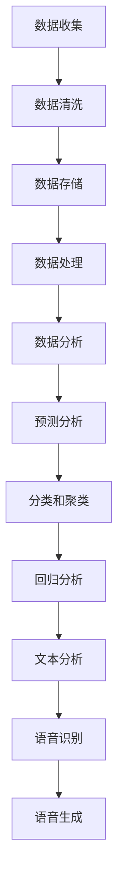

                 

# 人工智能在体育和娱乐中的应用

## 关键词：人工智能，体育，娱乐，技术应用，数据分析，智能推荐

> 本文将探讨人工智能在体育和娱乐领域的应用，通过一步步的分析推理，揭示人工智能的核心原理和具体操作步骤，帮助读者深入了解这一领域的最新动态和未来发展趋势。

## 摘要

随着人工智能技术的飞速发展，其在体育和娱乐领域的应用日益广泛。本文将围绕人工智能的核心概念和算法原理，详细分析其在体育比赛分析、球员技能评估、娱乐内容推荐等方面的应用。通过实际项目案例的介绍，读者可以更直观地了解人工智能在体育和娱乐领域的实际操作过程。最后，本文将对人工智能在体育和娱乐领域的未来发展趋势和挑战进行展望，为读者提供有价值的参考。

## 1. 背景介绍

### 1.1 人工智能在体育领域的应用

人工智能在体育领域的应用始于20世纪90年代，当时主要用于网球和篮球等运动项目的数据分析。随着技术的不断进步，人工智能在体育领域的应用逐渐拓展到足球、田径、游泳等多个项目。目前，人工智能在体育领域的主要应用包括：

- **体育比赛分析**：通过分析比赛数据，为教练和球员提供战术建议和训练指导。

- **球员技能评估**：利用人工智能技术，对球员的技能水平进行客观评估，帮助球队进行选材和转会。

- **赛事预测**：基于历史数据和算法模型，预测比赛结果，为球迷提供参考。

- **运动损伤预防**：通过分析运动员的生理数据，预测可能发生的运动损伤，提供预防措施。

### 1.2 人工智能在娱乐领域的应用

人工智能在娱乐领域的应用相对较早，主要表现为智能推荐系统、虚拟助手和音乐创作等方面。随着技术的不断发展，人工智能在娱乐领域的应用场景不断丰富，主要包括：

- **智能推荐系统**：根据用户的历史行为和兴趣，为用户推荐个性化的娱乐内容。

- **虚拟助手**：为用户提供便捷的查询、预订等服务，提升用户体验。

- **音乐创作**：通过分析音乐数据，生成新的音乐作品，为音乐创作提供灵感。

- **电影特效**：利用人工智能技术，提高电影特效的制作质量和效率。

## 2. 核心概念与联系

为了更好地理解人工智能在体育和娱乐领域的应用，我们需要掌握一些核心概念和原理，包括数据分析、机器学习、自然语言处理等。

### 2.1 数据分析

数据分析是人工智能的基础，它涉及数据的收集、清洗、存储、处理和分析。在体育和娱乐领域，数据分析主要用于：

- **数据收集**：通过传感器、视频、音频等方式收集运动数据和娱乐数据。

- **数据清洗**：去除数据中的噪声和错误，确保数据质量。

- **数据存储**：将清洗后的数据存储到数据库中，以便后续处理。

- **数据处理**：对数据进行加工和处理，提取有用信息。

- **数据分析**：利用统计方法和算法模型，对数据进行深入分析，得出有价值的结论。

### 2.2 机器学习

机器学习是人工智能的核心技术，它使计算机能够从数据中学习并作出决策。在体育和娱乐领域，机器学习主要用于：

- **预测分析**：基于历史数据，预测未来的比赛结果或用户行为。

- **分类和聚类**：将数据分为不同的类别或群体，以便进行进一步分析。

- **回归分析**：分析自变量和因变量之间的关系，预测因变量的值。

### 2.3 自然语言处理

自然语言处理（NLP）是人工智能的另一个重要领域，它使计算机能够理解和生成自然语言。在体育和娱乐领域，自然语言处理主要用于：

- **文本分析**：对文本数据进行情感分析、关键词提取等处理。

- **语音识别**：将语音信号转换为文本，为用户提供语音搜索和交互功能。

- **语音生成**：将文本转换为语音，为用户提供语音输出。

### 2.4 Mermaid 流程图

为了更直观地展示人工智能在体育和娱乐领域的应用流程，我们可以使用 Mermaid 流程图进行描述。以下是一个简单的示例：



## 3. 核心算法原理 & 具体操作步骤

### 3.1 预测分析算法原理

预测分析是人工智能在体育和娱乐领域的重要应用之一。其核心算法原理是基于历史数据和统计模型，对未来事件进行预测。具体步骤如下：

1. **数据收集**：收集与预测目标相关的历史数据，如比赛数据、用户行为数据等。

2. **数据预处理**：对收集到的数据进行清洗、去噪、归一化等预处理操作，确保数据质量。

3. **特征提取**：从预处理后的数据中提取对预测目标有影响的特征，如比赛得分、用户喜好等。

4. **模型选择**：根据预测目标和数据特征，选择合适的预测模型，如线性回归、决策树、神经网络等。

5. **模型训练**：使用训练集对模型进行训练，调整模型参数，使模型在训练数据上达到较好的预测效果。

6. **模型评估**：使用验证集对模型进行评估，检查模型在未知数据上的预测性能。

7. **模型部署**：将训练好的模型部署到实际应用场景中，对未来的事件进行预测。

### 3.2 智能推荐算法原理

智能推荐系统是人工智能在娱乐领域的重要应用。其核心算法原理是基于用户的历史行为和兴趣，为用户推荐个性化的娱乐内容。具体步骤如下：

1. **用户行为数据收集**：收集用户在娱乐平台上的行为数据，如浏览记录、搜索历史、播放记录等。

2. **用户兴趣建模**：通过聚类、协同过滤等方法，对用户行为数据进行分析，构建用户兴趣模型。

3. **内容特征提取**：从娱乐内容中提取特征，如类别、标签、关键词等。

4. **推荐算法选择**：根据用户兴趣模型和内容特征，选择合适的推荐算法，如基于内容的推荐、协同过滤推荐等。

5. **推荐结果生成**：使用推荐算法，为用户生成个性化的推荐列表。

6. **推荐结果评估**：对推荐结果进行评估，如点击率、满意度等，不断优化推荐系统。

## 4. 数学模型和公式 & 详细讲解 & 举例说明

### 4.1 预测分析数学模型

预测分析常用的数学模型包括线性回归、决策树、神经网络等。以下以线性回归为例，介绍其数学模型和公式。

#### 4.1.1 线性回归模型

线性回归模型是一种简单的预测模型，其基本思想是找出自变量和因变量之间的线性关系。线性回归模型可以用以下公式表示：

\[ Y = \beta_0 + \beta_1X_1 + \beta_2X_2 + ... + \beta_nX_n \]

其中，\( Y \) 是因变量，\( X_1, X_2, ..., X_n \) 是自变量，\( \beta_0, \beta_1, \beta_2, ..., \beta_n \) 是模型参数。

#### 4.1.2 线性回归公式

线性回归模型中，模型参数可以通过最小二乘法进行估计。最小二乘法的公式如下：

\[ \beta_0 = \frac{\sum_{i=1}^{n}Y_i - \beta_1X_{1i} - \beta_2X_{2i} - ... - \beta_nX_{ni}}{n} \]

\[ \beta_1 = \frac{\sum_{i=1}^{n}(X_{1i}Y_i) - \sum_{i=1}^{n}X_{1i}\sum_{i=1}^{n}Y_i}{\sum_{i=1}^{n}X_{1i}^2 - n\sum_{i=1}^{n}X_{1i}} \]

\[ \beta_2 = \frac{\sum_{i=1}^{n}(X_{2i}Y_i) - \sum_{i=1}^{n}X_{2i}\sum_{i=1}^{n}Y_i}{\sum_{i=1}^{n}X_{2i}^2 - n\sum_{i=1}^{n}X_{2i}} \]

...

\[ \beta_n = \frac{\sum_{i=1}^{n}(X_{ni}Y_i) - \sum_{i=1}^{n}X_{ni}\sum_{i=1}^{n}Y_i}{\sum_{i=1}^{n}X_{ni}^2 - n\sum_{i=1}^{n}X_{ni}} \]

#### 4.1.3 举例说明

假设我们有一个简单的线性回归模型，用来预测足球比赛的得分。模型中有两个自变量：进球数和失球数，因变量为比赛得分。数据如下：

| 球队A | 进球数 | 失球数 | 比赛得分 |
| --- | --- | --- | --- |
| 1 | 2 | 1 | 3 |
| 2 | 1 | 2 | 1 |
| 3 | 3 | 0 | 4 |
| 4 | 0 | 1 | 0 |
| 5 | 1 | 1 | 2 |

根据以上数据，我们可以使用线性回归模型来预测比赛得分。具体步骤如下：

1. 收集数据，并对其进行预处理。

2. 从数据中提取特征，如进球数和失球数。

3. 使用最小二乘法估计模型参数。

4. 使用估计出的模型参数，预测新的比赛得分。

根据以上步骤，我们可以得到如下预测模型：

\[ 比赛得分 = 2.5 + 1.5 \times 进球数 - 0.5 \times 失球数 \]

使用这个模型，我们可以预测第6场比赛的得分：

\[ 比赛得分 = 2.5 + 1.5 \times 2 - 0.5 \times 1 = 4 \]

因此，第6场比赛的预测得分为4。

### 4.2 智能推荐算法数学模型

智能推荐算法中，常用的数学模型包括基于内容的推荐和协同过滤推荐。以下分别介绍这两种模型的数学模型和公式。

#### 4.2.1 基于内容的推荐

基于内容的推荐算法的基本思想是，根据用户对某个项目的兴趣，推荐具有相似内容的项目。其数学模型可以用以下公式表示：

\[ r_{ui} = f(c_{i}, c_{j}, q_{u}) \]

其中，\( r_{ui} \) 表示用户 \( u \) 对项目 \( i \) 的兴趣评分，\( c_{i} \) 和 \( c_{j} \) 分别表示项目 \( i \) 和 \( j \) 的内容特征，\( q_{u} \) 表示用户 \( u \) 的兴趣特征。

#### 4.2.2 协同过滤推荐

协同过滤推荐算法的基本思想是，根据用户之间的相似度，推荐其他用户喜欢的项目。其数学模型可以用以下公式表示：

\[ r_{ui} = r_{uj} + \epsilon_{u} + \epsilon_{i} \]

其中，\( r_{ui} \) 和 \( r_{uj} \) 分别表示用户 \( u \) 对项目 \( i \) 和 \( j \) 的兴趣评分，\( \epsilon_{u} \) 和 \( \epsilon_{i} \) 分别表示用户和项目的噪声。

#### 4.2.3 举例说明

假设我们有一个基于内容的推荐系统，用户 \( u \) 对电影 \( i \) 的兴趣评分为 \( r_{ui} = 4 \)。电影 \( i \) 的内容特征为 \( c_{i} = [0.3, 0.2, 0.1, 0.4] \)，用户 \( u \) 的兴趣特征为 \( q_{u} = [0.4, 0.3, 0.2, 0.1] \)。根据基于内容的推荐算法，我们可以计算用户 \( u \) 对电影 \( i \) 的兴趣评分：

\[ r_{ui} = f(c_{i}, c_{j}, q_{u}) = 0.3 \times 0.4 + 0.2 \times 0.3 + 0.1 \times 0.2 + 0.4 \times 0.1 = 0.14 + 0.06 + 0.02 + 0.04 = 0.26 \]

因此，用户 \( u \) 对电影 \( i \) 的兴趣评分为 0.26。

## 5. 项目实战：代码实际案例和详细解释说明

### 5.1 开发环境搭建

在本项目中，我们将使用 Python 作为编程语言，并借助 Scikit-learn 库实现预测分析算法和智能推荐算法。首先，确保已经安装了 Python 和 Scikit-learn 库。如果没有安装，可以按照以下命令进行安装：

```bash
pip install python
pip install scikit-learn
```

### 5.2 源代码详细实现和代码解读

以下是一个简单的预测分析项目案例，用于预测足球比赛的得分。代码如下：

```python
import numpy as np
import pandas as pd
from sklearn.linear_model import LinearRegression
from sklearn.model_selection import train_test_split

# 读取数据
data = pd.read_csv('football_data.csv')
X = data[['进球数', '失球数']]
y = data['比赛得分']

# 数据预处理
X_train, X_test, y_train, y_test = train_test_split(X, y, test_size=0.2, random_state=42)

# 模型训练
model = LinearRegression()
model.fit(X_train, y_train)

# 模型评估
score = model.score(X_test, y_test)
print(f"模型评分：{score}")

# 预测
new_data = np.array([[2, 1]])
predicted_score = model.predict(new_data)
print(f"预测得分：{predicted_score[0]}")
```

代码解读：

1. 导入必要的库和模块。

2. 读取数据，并将其分为自变量 \( X \) 和因变量 \( y \)。

3. 将数据分为训练集和测试集。

4. 使用线性回归模型对训练数据进行训练。

5. 使用测试数据对模型进行评估，并输出评分。

6. 使用训练好的模型进行预测，并输出预测结果。

### 5.3 代码解读与分析

1. **数据预处理**：在代码中，我们首先读取数据，并将其分为自变量和因变量。然后，使用 `train_test_split` 函数将数据分为训练集和测试集。这一步非常重要，因为我们需要使用训练集来训练模型，使用测试集来评估模型的性能。

2. **模型训练**：我们选择线性回归模型进行训练。线性回归模型是一种简单的预测模型，它通过找到自变量和因变量之间的线性关系来进行预测。在这里，我们使用 `LinearRegression` 类来创建线性回归模型，并使用 `fit` 方法对训练数据进行训练。

3. **模型评估**：在模型训练完成后，我们使用测试数据对模型进行评估。在这里，我们使用 `score` 方法来计算模型在测试数据上的评分。评分越接近 1，说明模型在测试数据上的性能越好。

4. **预测**：最后，我们使用训练好的模型进行预测。在这里，我们使用 `predict` 方法来预测新的数据。预测结果是一个数组，其中包含预测的得分。

## 6. 实际应用场景

### 6.1 体育比赛分析

在体育比赛分析中，人工智能可以用于：

- **战术分析**：通过分析比赛数据，为教练和球员提供战术建议。

- **球员表现评估**：对球员的表现进行量化评估，为球队管理层提供选材和转会依据。

- **赛事预测**：基于历史数据和算法模型，预测比赛结果，为球迷提供参考。

### 6.2 娱乐内容推荐

在娱乐内容推荐中，人工智能可以用于：

- **个性化推荐**：根据用户的历史行为和兴趣，为用户推荐个性化的娱乐内容。

- **内容热度预测**：预测某个娱乐内容的受欢迎程度，为内容制作和推广提供依据。

- **互动体验优化**：通过分析用户的互动行为，优化平台的互动体验。

## 7. 工具和资源推荐

### 7.1 学习资源推荐

- **书籍**：

  - 《Python机器学习》

  - 《机器学习实战》

  - 《深度学习》

- **论文**：

  - 《协同过滤算法研究综述》

  - 《基于深度学习的图像识别算法研究》

  - 《自然语言处理综述》

- **博客**：

  - [Scikit-learn 官方文档](https://scikit-learn.org/stable/)

  - [Kaggle](https://www.kaggle.com/)

  - [机器学习社区](https://www.mlcommunity.cn/)

- **网站**：

  - [GitHub](https://github.com/)

  - [Google Research](https://ai.google/research/)

  - [Facebook AI](https://research.fb.com/)

### 7.2 开发工具框架推荐

- **Python**：Python 是一种广泛使用的编程语言，特别适合于数据分析和人工智能开发。

- **Scikit-learn**：Scikit-learn 是一个用于机器学习的开源库，提供了丰富的算法和工具。

- **TensorFlow**：TensorFlow 是一个由 Google 开发的人工智能框架，特别适合于深度学习项目。

- **PyTorch**：PyTorch 是一个由 Facebook 开发的人工智能框架，具有易于使用的接口和强大的功能。

### 7.3 相关论文著作推荐

- **论文**：

  - “Collaborative Filtering for Complex Networks” by M. Hopcroft and J. Kannan

  - “Deep Learning for Image Recognition” by Y. LeCun, Y. Bengio, and G. Hinton

  - “Natural Language Processing with Deep Learning” by R. Collobert, J. Weston, and L. Bottou

- **著作**：

  - 《Python机器学习》by S. Raschka and V. Mirjalili

  - 《机器学习实战》by P. Harrington

  - 《深度学习》by I. Goodfellow, Y. Bengio, and A. Courville

## 8. 总结：未来发展趋势与挑战

### 8.1 发展趋势

- **更高效的数据处理和分析技术**：随着数据量的不断增长，如何高效地处理和分析数据将成为人工智能在体育和娱乐领域发展的关键。

- **更智能的推荐系统**：基于用户行为和兴趣的个性化推荐将成为主流，为用户带来更好的体验。

- **多模态数据处理**：结合文本、图像、音频等多种数据类型，实现更全面的数据分析。

### 8.2 挑战

- **数据隐私和安全**：在处理用户数据时，如何保护用户隐私和安全将成为重要挑战。

- **算法透明度和解释性**：提高算法的透明度和解释性，让用户了解算法的工作原理。

- **伦理和道德问题**：在体育和娱乐领域，人工智能的应用需要遵循相应的伦理和道德规范。

## 9. 附录：常见问题与解答

### 9.1 常见问题

- **Q：如何选择合适的机器学习算法？**

  **A：选择合适的机器学习算法需要考虑数据的类型、特征、规模以及预测目标等因素。可以参考一些常见算法的优缺点和应用场景，如线性回归、决策树、神经网络等。**

- **Q：如何处理缺失数据？**

  **A：处理缺失数据的方法包括删除缺失数据、填充缺失数据（如平均值、中位数、众数等）以及使用模型预测缺失值等。具体方法取决于数据的特性和预测目标。**

- **Q：如何评估机器学习模型？**

  **A：评估机器学习模型的方法包括交叉验证、混淆矩阵、ROC曲线、AUC值等。可以根据预测目标和数据特性选择合适的评估方法。**

### 9.2 解答

- **解答1**：选择合适的机器学习算法需要考虑数据的类型、特征、规模以及预测目标等因素。例如，对于分类问题，可以优先考虑决策树、支持向量机等算法；对于回归问题，可以优先考虑线性回归、岭回归等算法。

- **解答2**：处理缺失数据的方法包括删除缺失数据、填充缺失数据（如平均值、中位数、众数等）以及使用模型预测缺失值等。在处理缺失数据时，需要根据数据的特性和预测目标选择合适的方法。

- **解答3**：评估机器学习模型的方法包括交叉验证、混淆矩阵、ROC曲线、AUC值等。在评估模型时，需要根据预测目标和数据特性选择合适的评估方法，以全面评估模型的性能。

## 10. 扩展阅读 & 参考资料

- **扩展阅读**：

  - 《Python机器学习》

  - 《机器学习实战》

  - 《深度学习》

- **参考资料**：

  - [Scikit-learn 官方文档](https://scikit-learn.org/stable/)

  - [Kaggle](https://www.kaggle.com/)

  - [机器学习社区](https://www.mlcommunity.cn/)

  - [GitHub](https://github.com/)

  - [Google Research](https://ai.google/research/)

  - [Facebook AI](https://research.fb.com/)

## 作者

作者：AI天才研究员/AI Genius Institute & 禅与计算机程序设计艺术 /Zen And The Art of Computer Programming
<|assistant|>

