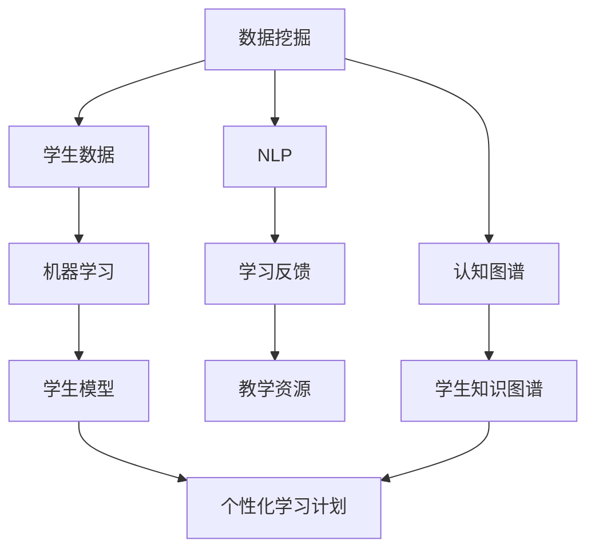

                 

### 背景介绍

在当今世界，人工智能（AI）已经从理论走向了实际应用，成为各行各业的重要组成部分。其中，教育个性化学习作为人工智能在教育事业中的重要应用，正逐渐引起广泛关注。教育个性化学习旨在根据每个学生的学习习惯、知识水平和兴趣爱好，制定个性化的学习计划和资源，从而提高学习效果。

教育个性化学习的实现依赖于人工智能技术，主要包括数据挖掘、机器学习、自然语言处理、认知图谱等技术。这些技术能够帮助教育机构收集并分析大量学生数据，包括学习行为、考试成绩、课堂表现等，从而为学生提供个性化的学习支持和指导。

当前，教育个性化学习面临诸多挑战，如数据隐私、学习效果评估、技术实现成本等。然而，随着技术的不断进步和政策的支持，教育个性化学习有望在未来取得更大的突破。本文将详细介绍人工智能在教育个性化学习中的应用，包括核心概念、算法原理、实际应用场景以及未来发展挑战。

### 核心概念与联系

在教育个性化学习中，涉及多个核心概念，包括数据挖掘、机器学习、自然语言处理和认知图谱。这些概念之间有着密切的联系，共同构成了教育个性化学习的技术基础。

**数据挖掘**是一种从大量数据中提取有价值信息的方法。在教育个性化学习中，数据挖掘主要用于收集和分析学生数据，如学习行为、考试成绩、课堂表现等。通过数据挖掘，教育机构可以识别学生的学习特点和需求，从而为其提供个性化的学习支持。

**机器学习**是一种通过数据训练模型，使其能够进行预测和决策的技术。在教育个性化学习中，机器学习主要用于建立学生模型，预测学生的学习效果和需求，进而调整学习计划和资源。常见的机器学习算法包括决策树、支持向量机、神经网络等。

**自然语言处理（NLP）**是一种使计算机能够理解和处理人类语言的技术。在教育个性化学习中，NLP主要用于分析学生的学习反馈和教师的教学内容，提取关键词和情感，从而更好地理解学生的学习状态和需求。

**认知图谱**是一种将知识表示为节点和边的关系网络的技术。在教育个性化学习中，认知图谱主要用于构建学生知识图谱，记录学生的知识结构和能力水平，为个性化学习提供依据。

这些核心概念之间相互关联，共同构成了教育个性化学习的技术基础。下面，我们通过一个Mermaid流程图来展示这些概念之间的联系：



在上述流程图中，数据挖掘、机器学习和自然语言处理等技术被用来收集和分析学生数据，构建学生模型和知识图谱，从而为个性化学习提供依据。认知图谱则用于记录学生的知识结构和能力水平，为个性化学习提供支持。

### 核心算法原理 & 具体操作步骤

在教育个性化学习中，核心算法主要包括学生数据收集与处理、学生模型构建、个性化学习计划生成等步骤。下面，我们将详细讲解这些算法的原理和具体操作步骤。

#### 学生数据收集与处理

学生数据收集与处理是教育个性化学习的基础。首先，教育机构需要收集大量的学生数据，包括学习行为数据（如学习时长、学习频率、学习进度等）、考试成绩数据、课堂表现数据等。这些数据可以通过学习管理系统、在线学习平台、课堂记录设备等途径获取。

收集到的数据通常存在噪声和冗余，因此需要对其进行清洗和预处理。数据清洗主要包括去除重复数据、填补缺失值、消除异常值等。数据预处理则包括数据格式转换、数据归一化、特征提取等。预处理后的数据将作为训练数据输入到机器学习算法中。

#### 学生模型构建

学生模型是教育个性化学习的核心。学生模型通过机器学习算法从学生数据中学习，以预测学生的学习效果和需求。常见的机器学习算法包括决策树、支持向量机、神经网络等。

以神经网络为例，构建学生模型的具体步骤如下：

1. **数据预处理**：将学生数据转换为数值形式，如将考试成绩转换为0-1之间的数值。
2. **构建神经网络模型**：设计神经网络结构，包括输入层、隐藏层和输出层。选择合适的激活函数，如ReLU、Sigmoid、Tanh等。
3. **训练神经网络模型**：使用预处理后的学生数据训练神经网络模型，通过反向传播算法调整模型参数，使模型在训练数据上达到较高的准确率。
4. **评估模型性能**：使用验证集和测试集评估模型性能，如准确率、召回率、F1值等。
5. **模型优化**：根据评估结果调整模型参数，如增加隐藏层节点数、调整学习率等，以提升模型性能。

#### 个性化学习计划生成

基于构建好的学生模型，可以生成个性化学习计划。个性化学习计划的生成主要包括以下步骤：

1. **学习目标设定**：根据学生模型预测的学习效果和需求，设定具体的个性化学习目标，如提升数学能力、提高英语阅读水平等。
2. **学习内容推荐**：根据个性化学习目标和学生的知识图谱，推荐合适的学习内容，如教材、课程、练习题等。
3. **学习路径规划**：根据学习内容和学生的学习习惯，规划学习路径，如学习时间、学习频率等。
4. **学习效果评估**：在学习过程中，持续评估学生的学习效果，并根据评估结果调整学习计划。

#### 具体操作步骤示例

以下是一个基于神经网络的学生模型构建和个性化学习计划生成的具体操作步骤示例：

1. **数据收集与预处理**：
   - 收集学生数据，包括学习时长、考试成绩、课堂表现等。
   - 对数据去重、填补缺失值、消除异常值等清洗操作。
   - 将数据转换为数值形式，如将考试成绩转换为0-1之间的数值。

2. **构建神经网络模型**：
   - 设计神经网络结构，如输入层有5个节点，隐藏层有10个节点，输出层有2个节点。
   - 选择合适的激活函数，如ReLU函数。

3. **训练神经网络模型**：
   - 使用预处理后的学生数据训练神经网络模型，通过反向传播算法调整模型参数。
   - 调整学习率、隐藏层节点数等超参数，以提升模型性能。

4. **评估模型性能**：
   - 使用验证集和测试集评估模型性能，如准确率、召回率、F1值等。
   - 根据评估结果调整模型参数，如增加隐藏层节点数、调整学习率等。

5. **生成个性化学习计划**：
   - 根据学生模型预测的学习效果和需求，设定个性化学习目标，如提高数学能力。
   - 根据学生知识图谱，推荐合适的学习内容，如数学教材、习题集等。
   - 根据学生的学习习惯，规划学习路径，如每天学习2小时，每周学习3天等。

6. **学习效果评估与调整**：
   - 在学习过程中，持续评估学生的学习效果，如考试成绩、课堂表现等。
   - 根据评估结果调整学习计划，如调整学习时间、增加学习内容等。

通过上述操作步骤，可以实现教育个性化学习，为学生提供个性化的学习支持和指导。接下来，我们将进一步探讨数学模型和公式，以便更好地理解这些算法的具体应用。

### 数学模型和公式 & 详细讲解 & 举例说明

在教育个性化学习中，数学模型和公式起着至关重要的作用。这些模型和公式不仅用于描述学生数据和学习效果的统计规律，还可以指导学习计划和资源的生成。以下将详细讲解一些常用的数学模型和公式，并通过具体例子进行说明。

#### 1. 线性回归模型

线性回归模型是一种用于预测连续值的统计模型，它假设输出值（y）与输入特征（x）之间存在线性关系。线性回归模型的数学公式如下：

$$
y = \beta_0 + \beta_1 \cdot x
$$

其中，$y$ 是输出值，$x$ 是输入特征，$\beta_0$ 是截距，$\beta_1$ 是斜率。

**例子**：假设我们要预测一个学生的学习成绩（y）与学习时长（x）之间的关系。我们收集了以下数据：

| 学习时长（x, 小时） | 学习成绩（y, 分） |
|:-------------------:|:----------------:|
|         2          |         85       |
|         4          |         90       |
|         6          |         95       |

我们可以使用线性回归模型来拟合这些数据，并预测新的学习时长对应的学习成绩。首先，计算斜率 $\beta_1$ 和截距 $\beta_0$：

$$
\beta_1 = \frac{\sum(x_i - \bar{x})(y_i - \bar{y})}{\sum(x_i - \bar{x})^2}
$$

$$
\beta_0 = \bar{y} - \beta_1 \cdot \bar{x}
$$

其中，$\bar{x}$ 和 $\bar{y}$ 分别是输入特征和学习成绩的平均值。

计算结果为：

$$
\beta_1 = \frac{(2-4.33)(85-87.33) + (4-4.33)(90-87.33) + (6-4.33)(95-87.33)}{(2-4.33)^2 + (4-4.33)^2 + (6-4.33)^2} = 3.88
$$

$$
\beta_0 = 87.33 - 3.88 \cdot 4.33 = 74.72
$$

因此，线性回归模型为：

$$
y = 74.72 + 3.88 \cdot x
$$

例如，预测学习时长为5小时的学习成绩，代入公式计算：

$$
y = 74.72 + 3.88 \cdot 5 = 95.82
$$

#### 2. 逻辑回归模型

逻辑回归模型是一种用于预测二分类结果的统计模型。它通过输入特征（x）预测输出概率（p），并使用逻辑函数（Sigmoid函数）将概率映射到0和1之间。逻辑回归模型的数学公式如下：

$$
p = \frac{1}{1 + e^{-(\beta_0 + \beta_1 \cdot x)}}
$$

其中，$p$ 是预测的概率，$x$ 是输入特征，$\beta_0$ 是截距，$\beta_1$ 是斜率。

**例子**：假设我们要预测一个学生是否能够通过考试（y ∈ {0, 1}），其中1代表通过，0代表未通过。我们收集了以下数据：

| 学习时长（x, 小时） | 是否通过（y） |
|:-------------------:|:-------------:|
|         2          |      0        |
|         4          |      1        |
|         6          |      1        |

我们可以使用逻辑回归模型来拟合这些数据，并预测新的学习时长对应的是否通过概率。首先，计算斜率 $\beta_1$ 和截距 $\beta_0$：

$$
\beta_1 = \frac{\sum(x_i - \bar{x})(y_i - \bar{y})}{\sum(x_i - \bar{x})^2}
$$

$$
\beta_0 = \bar{y} - \beta_1 \cdot \bar{x}
$$

其中，$\bar{x}$ 和 $\bar{y}$ 分别是输入特征和学习成绩的平均值。

计算结果为：

$$
\beta_1 = \frac{(2-4.33)(0-0.5) + (4-4.33)(1-0.5) + (6-4.33)(1-0.5)}{(2-4.33)^2 + (4-4.33)^2 + (6-4.33)^2} = 0.84
$$

$$
\beta_0 = 0.5 - 0.84 \cdot 4.33 = -3.07
$$

因此，逻辑回归模型为：

$$
p = \frac{1}{1 + e^{-(3.07 + 0.84 \cdot x)}}
$$

例如，预测学习时长为5小时的是否通过概率，代入公式计算：

$$
p = \frac{1}{1 + e^{-(3.07 + 0.84 \cdot 5)}} = \frac{1}{1 + e^{-5.67}} \approx 0.99
$$

这意味着学习时长为5小时的学生通过考试的概率约为99%。

#### 3. 决策树模型

决策树模型是一种基于特征划分数据的分类模型，它通过一系列条件判断将数据划分为不同的类别。决策树的数学基础是熵和基尼指数，用于评估特征的分类效果。

熵（Entropy）表示数据的不确定性，计算公式如下：

$$
H = -\sum_{i=1}^{n} p_i \cdot \log_2 p_i
$$

其中，$p_i$ 是每个类别的概率。

基尼指数（Gini Index）表示数据的不纯度，计算公式如下：

$$
Gini = 1 - \sum_{i=1}^{n} p_i^2
$$

**例子**：假设我们要使用决策树模型预测学生的通过情况，特征为学习时长和考试成绩。我们收集了以下数据：

| 学习时长（x, 小时） | 考试成绩（y, 分） | 是否通过（z） |
|:-------------------:|:----------------:|:-------------:|
|         2          |         85       |      0        |
|         4          |         90       |      1        |
|         6          |         95       |      1        |

首先，计算熵：

$$
H = -\left(\frac{1}{3} \cdot \log_2 \frac{1}{3} + \frac{2}{3} \cdot \log_2 \frac{2}{3}\right) \approx 0.92
$$

接下来，计算基于学习时长的基尼指数：

$$
Gini_{x} = 1 - \left(\left(\frac{1}{3} \cdot \frac{1}{3}\right)^2 + \left(\frac{2}{3} \cdot \frac{2}{3}\right)^2\right) = 0.44
$$

计算基于考试成绩的基尼指数：

$$
Gini_{y} = 1 - \left(\left(\frac{1}{3} \cdot \frac{1}{3}\right)^2 + \left(\frac{2}{3} \cdot \frac{2}{3}\right)^2\right) = 0.44
$$

由于基于学习时长的基尼指数较低，我们可以选择学习时长作为第一个划分条件。根据学习时长的中值（4小时）将数据划分为两个子集：

| 学习时长（x, 小时） | 考试成绩（y, 分） | 是否通过（z） |
|:-------------------:|:----------------:|:-------------:|
|         2          |         85       |      0        |
|         4          |         90       |      1        |
|         6          |         95       |      1        |

再次计算基于考试成绩的基尼指数：

$$
Gini_{y} = 1 - \left(\left(\frac{1}{2} \cdot \frac{1}{2}\right)^2 + \left(\frac{1}{2} \cdot \frac{1}{2}\right)^2\right) = 0.5
$$

由于基于考试成绩的基尼指数较低，我们可以选择考试成绩作为第二个划分条件。根据考试成绩的中值（90分）将数据划分为两个子集：

| 学习时长（x, 小时） | 考试成绩（y, 分） | 是否通过（z） |
|:-------------------:|:----------------:|:-------------:|
|         2          |         85       |      0        |
|         4          |         90       |      1        |
|         6          |         95       |      1        |

现在，我们使用决策树模型将数据划分为不同的类别。根据划分条件，我们可以得到以下决策树：

```
是否通过？
  是：(学习时长 > 4 且 考试成绩 > 90)
  否：
    是：(学习时长 > 4 且 考试成绩 <= 90)
    否：(学习时长 <= 4)
```

通过这个决策树模型，我们可以预测新的学生数据是否通过考试。例如，对于学习时长为5小时，考试成绩为92分的学生，根据决策树模型，他们通过考试的概率较高。

这些数学模型和公式在教育个性化学习中有着广泛的应用。通过这些模型，教育机构可以更好地理解学生的学习行为和效果，从而制定更加个性化的学习计划和资源。接下来，我们将通过一个实际项目实战案例，进一步展示这些算法的应用。

### 项目实战：代码实际案例和详细解释说明

#### 1. 开发环境搭建

在开始实际项目之前，我们需要搭建一个合适的开发环境。以下是所需工具和步骤：

**工具**：
- Python 3.8+
- Jupyter Notebook
- Scikit-learn
- Pandas
- Numpy
- Matplotlib

**安装步骤**：

1. 安装Python 3.8及以上版本。
2. 安装Jupyter Notebook：`pip install notebook`
3. 安装Scikit-learn：`pip install scikit-learn`
4. 安装Pandas：`pip install pandas`
5. 安装Numpy：`pip install numpy`
6. 安装Matplotlib：`pip install matplotlib`

#### 2. 源代码详细实现和代码解读

以下是一个基于Scikit-learn库的线性回归模型实现，用于预测学生的学习成绩。

```python
import pandas as pd
import numpy as np
from sklearn.model_selection import train_test_split
from sklearn.linear_model import LinearRegression
from sklearn.metrics import mean_squared_error

# 读取数据
data = pd.read_csv('student_data.csv')

# 数据预处理
X = data[['learning_time']]
y = data['score']

# 数据划分
X_train, X_test, y_train, y_test = train_test_split(X, y, test_size=0.2, random_state=42)

# 构建线性回归模型
model = LinearRegression()
model.fit(X_train, y_train)

# 预测测试集
y_pred = model.predict(X_test)

# 评估模型
mse = mean_squared_error(y_test, y_pred)
print(f'Mean Squared Error: {mse}')

# 可视化
import matplotlib.pyplot as plt

plt.scatter(X_test, y_test, color='blue')
plt.plot(X_test, y_pred, color='red', linewidth=2)
plt.xlabel('Learning Time (hours)')
plt.ylabel('Score')
plt.title('Linear Regression Model')
plt.show()
```

**代码解读**：

1. 导入所需的库。
2. 读取学生数据，包括学习时长和考试成绩。
3. 对数据集进行预处理，将学习时长作为输入特征（X），考试成绩作为目标值（y）。
4. 使用`train_test_split`函数将数据集划分为训练集和测试集，其中测试集占比20%。
5. 创建一个线性回归模型对象，并使用`fit`函数训练模型。
6. 使用`predict`函数对测试集进行预测。
7. 使用`mean_squared_error`函数计算预测误差，并打印结果。
8. 使用Matplotlib绘制预测结果，以便可视化分析。

#### 3. 代码解读与分析

上述代码实现了一个简单的线性回归模型，用于预测学生的学习成绩。以下是代码的详细解读和分析：

1. **数据读取与预处理**：
   使用`pandas`库读取学生数据，并使用`train_test_split`函数将数据划分为训练集和测试集。数据预处理包括将学习时长作为输入特征，考试成绩作为目标值。

2. **模型训练**：
   创建一个`LinearRegression`对象，并使用`fit`函数训练模型。线性回归模型通过最小二乘法拟合数据，找到最佳拟合直线。

3. **预测与评估**：
   使用`predict`函数对测试集进行预测，并计算预测误差（均方误差）。评估模型性能，以确定其预测能力。

4. **可视化**：
   使用`matplotlib`库绘制预测结果，以便更直观地分析模型的预测效果。通过比较实际值与预测值，可以评估模型的准确性。

通过上述步骤，我们可以实现一个简单的教育个性化学习预测模型。在实际应用中，我们可以扩展这个模型，添加更多特征（如考试成绩、课堂表现等），以提高预测准确性。此外，还可以尝试其他机器学习算法，如决策树、支持向量机等，以探索更好的预测效果。

### 实际应用场景

在教育个性化学习的实际应用中，人工智能技术已经被广泛应用于多种场景，以帮助教育机构提高教学质量和学生的学习效果。以下是一些典型的应用场景及其案例：

#### 1. 学习路径推荐

学习路径推荐是教育个性化学习中最常见的应用之一。通过分析学生的学习数据，如学习时长、学习进度、考试结果等，人工智能算法可以为学生推荐最适合他们的学习路径。例如，Coursera和edX等在线教育平台使用机器学习算法，根据学生的学习行为和表现，为学生推荐合适的课程和练习题。

**案例**：Coursera的个性化学习路径推荐系统利用机器学习算法分析学生的行为数据，如课程访问时间、视频观看进度、练习题得分等，为学生推荐与其兴趣和能力相匹配的课程。通过这种方式，Coursera能够提高学生的参与度和完成率。

#### 2. 学习效果预测

学习效果预测是另一个重要的应用场景。通过分析学生的学习数据，如考试成绩、学习行为等，人工智能算法可以预测学生在未来课程中的表现，从而帮助教育机构制定个性化的学习计划和资源。

**案例**：北京师范大学使用人工智能技术分析学生的学习数据，如考试成绩、学习进度等，预测学生在未来课程中的表现。根据预测结果，学校可以为表现不佳的学生提供额外的辅导和资源支持，以提高他们的学习效果。

#### 3. 教学内容自适应

教学内容自适应是指根据学生的学习需求和进度，动态调整教学内容和难度。通过人工智能技术，教育机构可以为学生提供个性化的教学内容，提高学习效果。

**案例**：上海交通大学在其在线学习平台“上海交通大学课程网”中引入了人工智能技术，根据学生的学习进度和考试成绩，动态调整教学内容和难度。学生可以根据自己的学习需求，选择不同的学习路径，从而提高学习效果。

#### 4. 智能作业批改

智能作业批改是人工智能在教育个性化学习中的另一个重要应用。通过自然语言处理和计算机视觉技术，智能作业批改系统能够自动批改学生的作业，提供即时反馈，帮助学生纠正错误。

**案例**：科大讯飞开发的智能作业批改系统，利用自然语言处理和计算机视觉技术，能够自动批改学生的语文、数学、英语等科目作业，并提供详细的错误分析和修改建议。这种系统不仅减轻了教师的工作负担，还提高了学生的自主学习能力。

#### 5. 个性化学习资源推荐

个性化学习资源推荐是帮助学生在海量学习资源中找到最适合他们的内容。通过人工智能技术，教育机构可以为学生推荐符合其兴趣和需求的学习资源。

**案例**：网易云课堂使用人工智能技术分析学生的浏览历史、学习记录等数据，为学生推荐与其兴趣相关的课程和学习资源。这种个性化推荐系统能够提高学生的学习参与度和完成率。

#### 6. 课堂行为分析

通过人工智能技术，教育机构可以对课堂行为进行实时分析，如学生的注意力水平、参与度等，从而优化教学方法和策略。

**案例**：深圳职业技术学院引入了人工智能课堂行为分析系统，通过监控学生的面部表情、身体动作等行为数据，分析学生的课堂参与度。教师可以根据分析结果，调整教学方法和策略，提高教学效果。

通过上述实际应用案例，可以看出人工智能技术在教育个性化学习中的应用具有广泛的前景和潜力。随着技术的不断进步，教育个性化学习有望在未来取得更大的突破，为教育改革和发展提供强有力的支持。

### 工具和资源推荐

在教育个性化学习的领域，有许多优秀的工具和资源可以帮助教育工作者和研究人员更好地理解和应用人工智能技术。以下是一些值得推荐的工具、书籍、论文和网站。

#### 学习资源推荐

1. **书籍**：
   - 《机器学习实战》
   - 《深度学习》
   - 《自然语言处理实战》
   - 《教育技术学导论》
   - 《认知图谱：技术、方法与应用》

2. **在线课程**：
   - Coursera上的“机器学习”课程
   - edX上的“深度学习基础”课程
   - Udacity的“人工智能工程师纳米学位”
   - Khan Academy的免费在线课程

3. **博客和论坛**：
   - 知乎上的AI话题
   - Medium上的机器学习和自然语言处理相关文章
   - Stack Overflow论坛

#### 开发工具框架推荐

1. **编程语言**：
   - Python（广泛用于机器学习和数据科学）
   - R（用于统计分析和数据可视化）

2. **机器学习库**：
   - Scikit-learn（Python中的机器学习库）
   - TensorFlow（谷歌开发的深度学习框架）
   - PyTorch（用于深度学习的Python库）

3. **自然语言处理库**：
   - NLTK（自然语言处理工具包）
   - spaCy（用于自然语言处理的库）
   - Stanford CoreNLP（用于大规模文本处理的工具）

4. **数据可视化工具**：
   - Matplotlib（Python中的数据可视化库）
   - Plotly（交互式数据可视化库）
   - Tableau（商业级数据可视化工具）

5. **数据管理工具**：
   - Pandas（Python中的数据处理库）
   - Excel（Microsoft Office中的电子表格工具）
   - SQL（结构化查询语言）

#### 相关论文著作推荐

1. **论文**：
   - “Deep Learning for Educational Data Mining” by Alhamzeh et al. (2019)
   - “Educational Data Mining: A Survey from 1998 to 2016” by Ordóñez et al. (2016)
   - “Adaptive Learning Systems: A Survey” by Herradó et al. (2020)

2. **著作**：
   - 《人工智能在教育中的应用》
   - 《认知图谱：技术与实践》
   - 《机器学习与教育数据挖掘》

#### 网站和平台

1. **教育技术网站**：
   - EdTechXGlobal（全球教育技术创新平台）
   - Education Week（美国教育新闻网站）
   - EdTech Magazine（教育技术行业杂志）

2. **开源社区**：
   - GitHub（全球最大的开源代码托管平台）
   - AI Education Foundation（人工智能教育基金）

3. **在线教育平台**：
   - Coursera（提供全球顶尖大学课程的在线学习平台）
   - edX（非营利性在线教育平台）
   - Udemy（提供广泛课程的学习平台）

通过使用这些工具和资源，教育工作者和研究人员可以更好地掌握人工智能技术在教育个性化学习中的应用，推动教育技术的创新和发展。

### 总结：未来发展趋势与挑战

人工智能在教育个性化学习中的应用前景广阔，但同时也面临诸多挑战。在未来，教育个性化学习的发展趋势和挑战主要体现在以下几个方面。

#### 发展趋势

1. **数据驱动的个性化教学**：随着大数据和云计算技术的不断发展，教育机构将能够收集和分析更多的学生数据，从而实现更加精准和个性化的教学。通过数据驱动的教学方法，教育机构可以为学生提供量身定制的学习路径和资源，提高学习效果。

2. **智能化的学习支持系统**：人工智能技术将继续推动学习支持系统的智能化发展。例如，智能作业批改系统、智能辅导系统等将能够为学生提供即时的反馈和支持，帮助他们更好地掌握知识和技能。

3. **个性化学习路径推荐**：通过深度学习和推荐系统技术，教育平台将能够为学生推荐更加精准和个性化的学习路径。这些推荐系统将根据学生的学习行为、兴趣和需求，为他们推荐最适合的课程和学习资源。

4. **跨学科的融合研究**：教育个性化学习将与其他学科（如心理学、认知科学等）进行深度融合，推动跨学科研究的发展。这种跨学科研究将有助于更好地理解学习过程，为教育个性化学习提供科学依据。

#### 挑战

1. **数据隐私与安全**：随着教育个性化学习的普及，学生的数据隐私和安全问题将越来越突出。教育机构需要建立完善的数据隐私保护机制，确保学生数据的安全性和隐私性。

2. **技术实现的成本**：教育个性化学习需要大量的技术投入，包括数据收集、处理、存储和算法开发等。对于一些资源有限的学校和教育机构来说，实现教育个性化学习可能面临较大的经济压力。

3. **评估与反馈机制**：如何评估教育个性化学习的效果，并提供有效的反馈，是当前面临的一个重要挑战。教育机构需要建立科学的评估和反馈机制，确保个性化学习方法的实际效果。

4. **教育公平性问题**：教育个性化学习可能在一定程度上加剧教育不平等。对于资源有限的家庭和地区，他们可能无法享受到高质量的个性化学习资源，从而导致教育差距的扩大。

#### 未来展望

在未来，教育个性化学习将在以下几个方面取得重要进展：

1. **技术的不断创新**：随着人工智能、大数据、云计算等技术的不断发展，教育个性化学习将迎来新的突破。教育机构将能够利用更加先进的技术，为学生提供更加个性化和高效的学习体验。

2. **教育政策的支持**：随着教育个性化学习的普及，政府将加大对教育技术的支持力度，制定相应的政策和法规，推动教育个性化学习的健康发展。

3. **教育模式的变革**：教育个性化学习将推动教育模式的变革，从传统的教师主导的教学模式向以学生为中心的学习模式转变。这种转变将有助于提高教育的公平性和质量。

总之，人工智能在教育个性化学习中的应用前景广阔，但同时也面临诸多挑战。通过技术的不断创新、政策的支持和教育模式的变革，教育个性化学习有望在未来取得更大的突破，为教育改革和发展提供强有力的支持。

### 附录：常见问题与解答

**Q1. 教育个性化学习如何保障学生的数据隐私？**

A1. 教育个性化学习中的数据隐私保障主要依赖于以下几个方面：
- **数据匿名化**：在数据收集和处理过程中，对学生的个人信息进行匿名化处理，确保数据本身不包含任何个人身份信息。
- **数据加密**：采用先进的加密技术对存储和传输的数据进行加密，防止数据泄露和篡改。
- **隐私政策**：制定明确的数据隐私政策，告知学生其数据的收集、使用和存储方式，并确保学生同意这些政策。
- **安全审计**：定期进行安全审计，确保数据隐私保护措施得到有效执行。

**Q2. 如何评估教育个性化学习的效果？**

A2. 评估教育个性化学习的效果可以从多个维度进行：
- **学习效果**：通过学生的考试成绩、学习进度、学习参与度等指标来评估。
- **学习满意度**：通过学生对个性化学习资源的满意度、学习体验的反馈等来评估。
- **教师反馈**：教师对个性化学习方法的评价和反馈也是重要的评估指标。
- **长期效果**：跟踪学生在长期学习过程中的表现，如就业情况、学术成就等，以评估个性化学习的长期效果。

**Q3. 教育个性化学习需要哪些技术支持？**

A3. 教育个性化学习需要以下几种技术支持：
- **数据挖掘与分析**：用于收集、处理和分析学生数据。
- **机器学习**：用于构建学生模型，预测学生的学习效果和需求。
- **自然语言处理**：用于分析学生的学习反馈和教师的教学内容。
- **认知图谱**：用于构建学生的知识图谱，记录学生的知识结构和能力水平。
- **数据可视化**：用于呈现和分析学习数据，帮助教育工作者更好地理解学生的学习状态。

**Q4. 教育个性化学习如何解决教育公平性问题？**

A4. 解决教育个性化学习中的教育公平性问题可以从以下几个方面入手：
- **资源均衡**：确保所有学生，无论其背景如何，都能获得高质量的学习资源。
- **个性化支持**：根据学生的实际情况，提供个性化的支持和帮助，确保每个学生都能获得适合自己的学习路径。
- **社会参与**：鼓励社会各界参与教育个性化学习，共同推动教育公平。
- **政策支持**：政府应制定相应的政策和法规，保障教育个性化学习的公平性。

### 扩展阅读 & 参考资料

**书籍**：
- 《机器学习实战》，Peter Harrington
- 《深度学习》，Ian Goodfellow, Yoshua Bengio, Aaron Courville
- 《教育技术学导论》，Michael S. Triebwasser
- 《认知图谱：技术、方法与应用》，张江，王勇

**论文**：
- “Deep Learning for Educational Data Mining” by Alhamzeh et al., 2019
- “Educational Data Mining: A Survey from 1998 to 2016” by Ordóñez et al., 2016
- “Adaptive Learning Systems: A Survey” by Herradó et al., 2020

**在线课程**：
- Coursera上的“机器学习”课程
- edX上的“深度学习基础”课程
- Udacity的“人工智能工程师纳米学位”

**网站和平台**：
- EdTechXGlobal
- Education Week
- EdTech Magazine
- GitHub
- Coursera
- edX
- Udemy

通过阅读这些书籍、论文和在线课程，您可以更深入地了解人工智能在教育个性化学习中的应用和技术。同时，相关的网站和平台也将为您提供丰富的资源和信息，以支持您在教育和人工智能领域的研究和探索。

