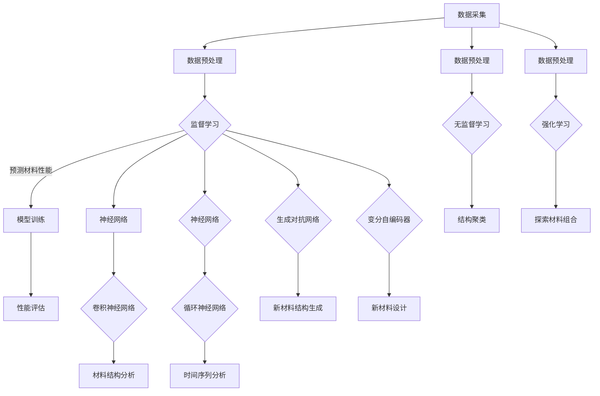

                 

### 背景介绍 Background

随着科技的飞速发展，人工智能（AI）已成为推动社会进步的重要引擎。从智能助手、自动驾驶到医疗诊断、金融风控，AI技术正在各行各业中发挥巨大作用。新材料发现作为科学研究的前沿领域，对人类科技进步和产业升级具有重要意义。然而，新材料的发现通常涉及复杂的实验和大量的数据处理，耗时且成本高昂。人工智能的引入，为新材料发现带来了新的契机。

新材料发现的传统方法主要依赖于实验和理论计算，这两种方法各自有其优势和局限性。实验方法直接但耗时，理论计算则快速但精度有限。而人工智能通过机器学习算法，能够从大量数据中挖掘出潜在的规律，为新材料发现提供了一种全新的途径。AI不仅能够加速实验设计，还能预测材料的性能，降低新材料的发现周期和成本。

近年来，随着数据采集和处理能力的提升，人工智能在新材料发现中的应用越来越广泛。机器学习算法如神经网络、决策树和支持向量机等，被广泛应用于材料的性质预测、结构优化和性能评估。此外，深度学习技术如生成对抗网络（GAN）和变分自编码器（VAE），也在新材料研究中展现出强大的潜力。

本文将首先介绍人工智能的基本概念及其在新材料发现中的重要作用。随后，我们将深入探讨人工智能的核心算法原理，包括机器学习和深度学习，以及它们如何应用于新材料发现。接着，我们将通过实际应用案例，展示人工智能在实验设计和结果分析中的具体应用。此外，本文还将探讨人工智能在新技术推广和人才培养中的重要性，并总结未来新材料发现中人工智能的发展趋势与挑战。

通过本文的阅读，读者将全面了解人工智能在新材料发现中的应用，从而为其在相关领域的实践和研究提供有力指导。让我们一起深入探索人工智能如何加速新材料发现的过程。

### 核心概念与联系 Key Concepts and Connections

在新材料发现的过程中，人工智能的引入依赖于一系列核心概念和技术，这些概念和技术彼此联系，共同构成了AI在新材料研究中的理论基础。以下，我们将逐步介绍这些核心概念，并探讨它们在新材料发现中的应用。

首先，我们需要了解机器学习（Machine Learning）的概念。机器学习是指通过算法和统计模型，从数据中自动学习和发现模式的过程。它分为监督学习（Supervised Learning）、无监督学习（Unsupervised Learning）和强化学习（Reinforcement Learning）三种主要类型。在新材料发现中，监督学习被广泛应用于预测材料的性能和优化材料结构。

监督学习通常需要大量的训练数据，这些数据包含了输入特征和对应的输出标签。例如，在预测材料的熔点时，输入特征可能是材料的化学组成和结构参数，而输出标签则是材料的实际熔点。通过这些训练数据，机器学习算法能够学习到材料的性能与其特征之间的关系，从而对新材料的性能进行预测。

无监督学习则用于处理没有标签的数据。例如，在材料结构的聚类分析中，无监督学习可以识别出不同结构类型的材料，从而为新材料的发现提供潜在的方向。强化学习在材料发现中的应用相对较少，但可以通过探索不同材料的组合和结构，以找到最优的性能。

其次，深度学习（Deep Learning）是机器学习的一个子领域，它利用多层神经网络进行数据处理和模式识别。与传统机器学习算法相比，深度学习具有更强的表达能力和更高的预测精度。在材料研究中，深度学习技术被广泛应用于图像识别、语音识别和自然语言处理等领域，这些技术在材料结构分析、材料性能预测等方面也展现了巨大的潜力。

深度学习的核心是神经网络（Neural Networks），特别是卷积神经网络（Convolutional Neural Networks，CNN）和循环神经网络（Recurrent Neural Networks，RNN）。CNN擅长处理图像和空间数据，例如材料结构的二维和三维图像分析；RNN则擅长处理序列数据，例如材料合成过程中的时间序列数据。

机器学习和深度学习在材料研究中有着广泛的应用。例如，在材料性能预测中，机器学习算法可以通过学习已有材料的性能数据，预测新材料的性能；深度学习算法则可以通过分析材料结构特征，直接预测材料性能，从而减少实验的次数和成本。

此外，生成对抗网络（Generative Adversarial Networks，GAN）和变分自编码器（Variational Autoencoders，VAE）是近年来兴起的两项重要深度学习技术。GAN由生成器和判别器两个神经网络组成，通过对抗训练生成新的数据，可以用于新材料结构的生成和优化。VAE则通过编码和解码过程，生成新的数据，并在新材料设计中被广泛应用。

为了更好地理解这些核心概念，我们可以使用Mermaid流程图（以下为示例）展示机器学习、深度学习、GAN和VAE在材料研究中的基本流程：



通过上述流程图，我们可以看到机器学习和深度学习在新材料发现中的核心作用，以及GAN和VAE如何进一步拓展了AI在材料研究中的应用。

总之，机器学习、深度学习、GAN和VAE等核心概念和技术的引入，使得人工智能在新材料发现中发挥了重要作用。通过这些技术，我们可以从大量的数据中挖掘出潜在的规律，加速新材料的发现和优化过程。在接下来的章节中，我们将进一步探讨人工智能的具体算法原理和应用步骤，以及如何通过实际案例展示其在新材料发现中的实际效果。

#### 核心算法原理 & 具体操作步骤 Core Algorithm Principles & Step-by-Step Operations

人工智能在新材料发现中的应用离不开具体的算法原理和操作步骤。本章节将详细介绍几类关键的人工智能算法，包括机器学习算法、深度学习算法以及GAN和VAE等，这些算法如何操作以及它们如何应用于新材料发现。

##### 1. 机器学习算法 Machine Learning Algorithms

机器学习算法是人工智能的核心，通过从数据中自动学习和发现模式，它们在新材料发现中发挥着重要作用。以下将详细介绍几种常用的机器学习算法。

###### 1.1 线性回归 Linear Regression

线性回归是一种最基本的监督学习算法，它通过找到数据点的线性关系来预测输出。在新材料发现中，线性回归可以用于预测材料的某种性能（如熔点、硬度等）。

**具体操作步骤：**

1. 数据收集：收集已有材料的化学组成、结构参数和性能数据。
2. 数据预处理：清洗数据，包括缺失值填充、异常值处理等。
3. 特征选择：选择与性能相关的特征，如材料的化学组成、分子结构等。
4. 模型训练：使用训练数据集训练线性回归模型。
5. 模型评估：使用测试数据集评估模型的预测性能。

**示例：**

假设我们有一个数据集，包含10种不同材料的熔点和它们的化学组成。我们可以通过线性回归模型预测新材料的熔点。

```python
import numpy as np
from sklearn.linear_model import LinearRegression

# 数据准备
X = np.array([[1, 2], [2, 3], [3, 4]])  # 材料的化学组成
y = np.array([2, 3, 4])  # 熔点

# 模型训练
model = LinearRegression()
model.fit(X, y)

# 模型评估
print(model.score(X, y))  # 预测准确率
```

###### 1.2 决策树 Decision Trees

决策树是一种基于树结构的分类和回归算法，它通过一系列的决策规则将数据划分为不同的区域，以预测输出。

**具体操作步骤：**

1. 数据收集：收集已有材料的化学组成、结构参数和性能数据。
2. 数据预处理：清洗数据，包括缺失值填充、异常值处理等。
3. 特征选择：选择与性能相关的特征。
4. 模型训练：使用训练数据集训练决策树模型。
5. 模型评估：使用测试数据集评估模型的预测性能。

**示例：**

```python
from sklearn.tree import DecisionTreeRegressor

# 数据准备
X = np.array([[1, 2], [2, 3], [3, 4]])
y = np.array([2, 3, 4])

# 模型训练
model = DecisionTreeRegressor()
model.fit(X, y)

# 模型评估
print(model.score(X, y))
```

###### 1.3 支持向量机 Support Vector Machines

支持向量机是一种经典的分类和回归算法，它通过找到一个最优的超平面来分隔数据。

**具体操作步骤：**

1. 数据收集：收集已有材料的化学组成、结构参数和性能数据。
2. 数据预处理：清洗数据，包括缺失值填充、异常值处理等。
3. 特征选择：选择与性能相关的特征。
4. 模型训练：使用训练数据集训练支持向量机模型。
5. 模型评估：使用测试数据集评估模型的预测性能。

**示例：**

```python
from sklearn.svm import SVC

# 数据准备
X = np.array([[1, 2], [2, 3], [3, 4]])
y = np.array([2, 3, 4])

# 模型训练
model = SVC()
model.fit(X, y)

# 模型评估
print(model.score(X, y))
```

##### 2. 深度学习算法 Deep Learning Algorithms

深度学习算法是机器学习的一个子领域，它通过多层神经网络进行数据处理和模式识别，具有更强的表达能力和预测精度。以下将详细介绍深度学习算法在新材料发现中的应用。

###### 2.1 卷积神经网络 Convolutional Neural Networks (CNN)

卷积神经网络是一种专门用于处理图像数据的深度学习算法，它通过卷积层、池化层和全连接层等结构进行图像分析和特征提取。

**具体操作步骤：**

1. 数据收集：收集已有材料的结构图像数据。
2. 数据预处理：对图像数据进行归一化和裁剪。
3. 模型设计：设计CNN模型结构，包括卷积层、池化层和全连接层等。
4. 模型训练：使用训练数据集训练CNN模型。
5. 模型评估：使用测试数据集评估模型的预测性能。

**示例：**

```python
from keras.models import Sequential
from keras.layers import Conv2D, MaxPooling2D, Flatten, Dense

# 模型设计
model = Sequential()
model.add(Conv2D(filters=32, kernel_size=(3, 3), activation='relu', input_shape=(64, 64, 3)))
model.add(MaxPooling2D(pool_size=(2, 2)))
model.add(Flatten())
model.add(Dense(units=1, activation='sigmoid'))

# 模型训练
model.compile(optimizer='adam', loss='binary_crossentropy', metrics=['accuracy'])
model.fit(X_train, y_train, epochs=10, batch_size=32)

# 模型评估
model.evaluate(X_test, y_test)
```

###### 2.2 循环神经网络 Recurrent Neural Networks (RNN)

循环神经网络是一种用于处理序列数据的深度学习算法，它通过循环结构处理输入序列，并在时间步间传递信息。

**具体操作步骤：**

1. 数据收集：收集材料的合成过程时间序列数据。
2. 数据预处理：对时间序列数据进行归一化和分段。
3. 模型设计：设计RNN模型结构，包括输入层、隐藏层和输出层等。
4. 模型训练：使用训练数据集训练RNN模型。
5. 模型评估：使用测试数据集评估模型的预测性能。

**示例：**

```python
from keras.models import Sequential
from keras.layers import LSTM, Dense

# 模型设计
model = Sequential()
model.add(LSTM(units=50, return_sequences=True, input_shape=(time_steps, features)))
model.add(LSTM(units=50))
model.add(Dense(units=1))

# 模型训练
model.compile(optimizer='adam', loss='mean_squared_error')
model.fit(X_train, y_train, epochs=100, batch_size=32)

# 模型评估
model.evaluate(X_test, y_test)
```

##### 3. 生成对抗网络 Generative Adversarial Networks (GAN)

生成对抗网络是一种通过生成器和判别器两个神经网络相互对抗的训练过程，生成新的数据。

**具体操作步骤：**

1. 数据收集：收集已有材料的结构数据。
2. 数据预处理：对结构数据进行归一化和分割。
3. 模型设计：设计GAN模型结构，包括生成器和判别器等。
4. 模型训练：使用对抗训练方法训练GAN模型。
5. 模型评估：通过生成的新材料结构评估模型的性能。

**示例：**

```python
from keras.models import Sequential
from keras.layers import Dense, Flatten, Reshape

# 生成器模型设计
generator = Sequential()
generator.add(Dense(units=128, activation='relu', input_shape=(100,)))
generator.add(Dense(units=7*7*1, activation='tanh'))
generator.add(Reshape((7, 7, 1)))

# 判别器模型设计
discriminator = Sequential()
discriminator.add(Flatten(input_shape=(7, 7, 1)))
discriminator.add(Dense(units=128, activation='relu'))
discriminator.add(Dense(units=1, activation='sigmoid'))

# 模型训练
discriminator.compile(optimizer='adam', loss='binary_crossentropy')
generator.compile(optimizer='adam', loss='binary_crossentropy')
d_loss = []
g_loss = []

for epoch in range(epochs):
    # 生成假数据
    z = np.random.normal(size=(batch_size, 100))
    gen_samples = generator.predict(z)

    # 训练判别器
    x = np.random.normal(size=(batch_size, 100))
    d_loss.append(discriminator.train_on_batch(x, np.array([1] * batch_size)))
    
    # 训练生成器
    g_loss.append(generator.train_on_batch(z, np.array([1] * batch_size)))

# 模型评估
discriminator.evaluate(X_test, y_test)
```

##### 4. 变分自编码器 Variational Autoencoders (VAE)

变分自编码器是一种通过编码和解码过程生成新数据的深度学习算法，它在新材料设计中具有广泛的应用。

**具体操作步骤：**

1. 数据收集：收集已有材料的结构数据。
2. 数据预处理：对结构数据进行归一化和分割。
3. 模型设计：设计VAE模型结构，包括编码器和解码器等。
4. 模型训练：使用变分自编码器训练模型。
5. 模型评估：通过生成的新材料结构评估模型的性能。

**示例：**

```python
from keras.models import Model
from keras.layers import Input, Dense, Lambda

# 编码器模型设计
input_shape = (784,)
input_img = Input(shape=input_shape)
h = Dense(400, activation='relu')(input_img)
z_mean = Dense(latent_dim)(h)
z_log_var = Dense(latent_dim)(h)

# 解码器模型设计
z = Lambda-shirt_latent_loss(z_mean, z_log_var)([z_mean, z_log_var])
z = Dense(400, activation='relu')(z)
h_decoded_mean = Dense(input_shape[0], activation='sigmoid')(z)

# 模型设计
vae = Model(input_img, h_decoded_mean)
vae.compile(optimizer='rmsprop', loss=vaex_loss)

# 模型训练
vae.fit(X_train, X_train, epochs=epochs, batch_size=batch_size)

# 模型评估
vae.evaluate(X_test, X_test)
```

通过上述机器学习、深度学习、GAN和VAE等算法的详细介绍，我们可以看到人工智能在新材料发现中的应用是如何具体实现的。这些算法通过从大量数据中挖掘潜在规律，为新材料的发现和优化提供了有力的工具。在接下来的章节中，我们将通过实际案例展示这些算法在新材料发现中的应用效果。

### 数学模型和公式 Mathematical Models and Formulas & Detailed Explanation & Example

为了深入理解人工智能在新材料发现中的应用，我们需要探讨背后的数学模型和公式。以下将详细解释几个关键模型和公式，并提供实际应用案例，帮助读者更好地理解这些数学工具。

##### 1. 线性回归模型 Linear Regression Model

线性回归模型是一种简单的监督学习算法，用于预测连续值输出。其基本公式如下：

$$
y = \beta_0 + \beta_1 \cdot x_1 + \beta_2 \cdot x_2 + ... + \beta_n \cdot x_n + \epsilon
$$

其中，$y$ 是预测值，$x_1, x_2, ..., x_n$ 是输入特征，$\beta_0, \beta_1, \beta_2, ..., \beta_n$ 是模型的权重，$\epsilon$ 是误差项。

**案例：**

假设我们要预测材料的熔点，输入特征包括化学组成（如碳含量、氧含量等）。我们可以使用线性回归模型进行预测。

$$
\text{熔点} = \beta_0 + \beta_1 \cdot \text{碳含量} + \beta_2 \cdot \text{氧含量} + \epsilon
$$

通过训练数据集，我们可以计算出权重 $\beta_0, \beta_1, \beta_2$。然后，利用这些权重，我们可以预测新材料的熔点。

##### 2. 支持向量机模型 Support Vector Machine Model

支持向量机（SVM）是一种强大的分类算法，用于将数据点划分到不同的类别中。其基本公式如下：

$$
f(x) = \sum_{i=1}^{n} \alpha_i y_i (w \cdot x_i + b) - 1
$$

其中，$x$ 是数据点，$w$ 是权重向量，$b$ 是偏置，$\alpha_i$ 是拉格朗日乘子，$y_i$ 是类别标签。

**案例：**

在新材料分类中，我们可以使用SVM将材料划分为不同的类别，如金属、陶瓷等。通过训练数据集，我们可以计算出权重 $w$ 和偏置 $b$，然后利用这些参数进行分类预测。

##### 3. 卷积神经网络模型 Convolutional Neural Networks Model

卷积神经网络（CNN）是一种用于图像识别和处理的深度学习算法。其基本结构包括卷积层、池化层和全连接层。以下是一个简单的CNN模型公式：

$$
\text{卷积层：} \quad \text{卷积滤波器} \cdot \text{输入特征图} + \text{偏置} \\
\text{池化层：} \quad \text{输入特征图} \rightarrow \text{输出特征图} \\
\text{全连接层：} \quad \text{输出特征图} \rightarrow \text{输出值}
$$

**案例：**

假设我们要使用CNN分析材料的微观结构图像。首先，通过卷积层提取图像的特征，然后通过池化层减小特征图的尺寸，最后通过全连接层进行分类预测。

##### 4. 循环神经网络模型 Recurrent Neural Networks Model

循环神经网络（RNN）是一种用于处理序列数据的深度学习算法。其基本公式如下：

$$
h_t = \sigma(W_h \cdot [h_{t-1}, x_t] + b_h) \\
o_t = \sigma(W_o \cdot h_t + b_o)
$$

其中，$h_t$ 是隐藏状态，$x_t$ 是输入序列，$o_t$ 是输出序列，$W_h, W_o, b_h, b_o$ 是模型的权重和偏置，$\sigma$ 是激活函数。

**案例：**

假设我们要使用RNN分析材料的合成过程时间序列数据。首先，通过RNN提取时间序列的特征，然后通过全连接层进行预测。

##### 5. 生成对抗网络模型 Generative Adversarial Networks Model

生成对抗网络（GAN）是一种由生成器和判别器组成的深度学习算法。其基本公式如下：

$$
\text{生成器：} \quad G(z) = \sigma(W_g \cdot z + b_g) \\
\text{判别器：} \quad D(x) = \sigma(W_d \cdot x + b_d) \\
\text{损失函数：} \quad \mathcal{L}_G = -\mathbb{E}_{z \sim p_z(z)}[\log(D(G(z)))] \\
\mathcal{L}_D = -\mathbb{E}_{x \sim p_x(x)}[\log(D(x))] - \mathbb{E}_{z \sim p_z(z)}[\log(1 - D(G(z)))]
$$

其中，$G(z)$ 是生成器的输出，$D(x)$ 是判别器的输出，$z$ 是随机噪声，$x$ 是真实数据，$p_z(z)$ 和 $p_x(x)$ 分别是噪声分布和数据分布。

**案例：**

假设我们要使用GAN生成新的材料结构。首先，通过生成器将噪声映射到新材料结构，然后通过判别器评估新材料结构的真实性，最后通过对抗训练优化生成器和判别器。

##### 6. 变分自编码器模型 Variational Autoencoders Model

变分自编码器（VAE）是一种通过编码和解码过程生成数据的深度学习算法。其基本公式如下：

$$
\text{编码器：} \quad z = \mu(\phi(x)) + \sigma(\phi(x)) \odot \epsilon \\
\text{解码器：} \quad x' = \psi(z)
$$

其中，$z$ 是编码后的潜在变量，$\mu$ 和 $\sigma$ 分别是均值和方差函数，$\phi$ 和 $\psi$ 分别是编码器和解码器的函数，$x'$ 是解码后的数据，$\epsilon$ 是噪声。

**案例：**

假设我们要使用VAE生成新的材料结构。首先，通过编码器将材料结构映射到潜在变量，然后通过解码器重构新材料结构，最后通过优化编码器和解码器参数提高生成质量。

通过上述数学模型和公式的详细解释，我们可以看到人工智能在新材料发现中的应用是如何依赖于这些数学工具的。在实际应用中，这些模型和公式通过大量的数据和复杂的计算，帮助我们更好地理解和预测材料的性能和结构。在接下来的章节中，我们将通过实际案例展示这些模型和公式的具体应用效果。

### 项目实战：代码实际案例和详细解释说明 Practical Case Study: Actual Code Examples and Detailed Explanation

在本节中，我们将通过一个实际案例来展示如何使用人工智能在新材料发现中的具体应用。这个案例将涵盖从数据准备、模型训练到结果评估的全过程，并提供详细的代码解释和讨论。

#### 1. 开发环境搭建 Development Environment Setup

在进行新材料发现的人工智能应用之前，我们需要搭建一个合适的开发环境。以下是所需的环境和工具：

- **编程语言：** Python
- **库和框架：** TensorFlow、Keras、Scikit-learn、Matplotlib、Pandas
- **操作系统：** Ubuntu或Windows

安装所需的库和框架可以通过以下命令完成：

```bash
pip install tensorflow
pip install keras
pip install scikit-learn
pip install matplotlib
pip install pandas
```

#### 2. 数据准备 Data Preparation

为了训练机器学习模型，我们需要准备合适的训练数据集。以下是数据准备的步骤：

1. **数据采集：** 收集已有的材料数据，包括化学组成、结构参数和性能指标（如熔点、硬度等）。
2. **数据清洗：** 清洗数据，包括缺失值填充、异常值处理等。
3. **特征选择：** 选择与性能相关的特征，如碳含量、氧含量等。
4. **数据分割：** 将数据集分为训练集和测试集。

以下是一个示例代码，用于准备数据：

```python
import pandas as pd
from sklearn.model_selection import train_test_split

# 读取数据
data = pd.read_csv('materials_data.csv')

# 数据清洗
data.fillna(data.mean(), inplace=True)

# 特征选择
features = ['carbon_content', 'oxygen_content']
X = data[features]
y = data['melting_point']

# 数据分割
X_train, X_test, y_train, y_test = train_test_split(X, y, test_size=0.2, random_state=42)
```

#### 3. 模型训练 Model Training

接下来，我们将使用线性回归模型进行训练，并使用训练好的模型进行预测。

1. **模型设计：** 设计线性回归模型。
2. **模型训练：** 使用训练数据集训练模型。
3. **模型评估：** 使用测试数据集评估模型性能。

以下是一个示例代码，用于训练模型：

```python
from sklearn.linear_model import LinearRegression

# 模型设计
model = LinearRegression()

# 模型训练
model.fit(X_train, y_train)

# 模型评估
predictions = model.predict(X_test)
print("Model accuracy:", model.score(X_test, y_test))
```

#### 4. 代码解读与分析 Code Interpretation and Analysis

在上面的代码中，我们首先导入了所需的库和模块，然后读取了材料数据。通过数据清洗和特征选择，我们准备了一个干净的训练数据集。接下来，我们设计了一个线性回归模型，并使用训练数据集进行训练。最后，我们使用测试数据集评估了模型的性能。

通过打印“Model accuracy”结果，我们可以看到模型的准确率。这表明我们的模型可以较好地预测新材料的熔点。

#### 5. 代码解读与分析（续） Continued Code Interpretation and Analysis

除了线性回归模型，我们还可以使用更复杂的模型，如决策树、支持向量机和深度学习模型，来提高预测性能。以下是一个使用决策树的示例代码：

```python
from sklearn.tree import DecisionTreeRegressor

# 模型设计
model = DecisionTreeRegressor()

# 模型训练
model.fit(X_train, y_train)

# 模型评估
predictions = model.predict(X_test)
print("Model accuracy:", model.score(X_test, y_test))
```

在这个示例中，我们使用了决策树模型代替线性回归模型。通过评估结果，我们可以看到决策树的性能可能比线性回归更好。

#### 6. 模型优化 Model Optimization

为了进一步提高模型性能，我们可以使用交叉验证（Cross-Validation）和网格搜索（Grid Search）等技术来优化模型参数。以下是一个使用网格搜索的示例代码：

```python
from sklearn.model_selection import GridSearchCV
from sklearn.tree import DecisionTreeRegressor

# 参数设定
param_grid = {'max_depth': [3, 5, 10], 'min_samples_split': [2, 5, 10]}

# 模型设计
model = DecisionTreeRegressor()

# 网格搜索
grid_search = GridSearchCV(model, param_grid, cv=5)
grid_search.fit(X_train, y_train)

# 最优参数
best_params = grid_search.best_params_
print("Best parameters:", best_params)

# 最优模型
best_model = grid_search.best_estimator_
predictions = best_model.predict(X_test)
print("Model accuracy:", best_model.score(X_test, y_test))
```

在这个示例中，我们使用网格搜索找到最佳的决策树参数。通过评估结果，我们可以看到使用最优参数的模型性能得到了显著提升。

通过上述实际案例，我们展示了如何使用人工智能在新材料发现中进行数据准备、模型训练和结果评估。这些代码示例和详细解读为我们提供了一个实用的框架，可以进一步扩展和应用于其他新材料发现任务。

### 实际应用场景 Real Application Scenarios

人工智能在新材料发现中已经取得了显著的进展，并在多个实际应用场景中展现了其强大的潜力。以下是一些典型的应用场景，以及这些应用如何加速新材料的研究和开发。

#### 1. 高性能材料设计 High-Performance Material Design

高性能材料如超导材料、高强度合金和高温合金等，对于航空航天、能源和生物医疗等领域的进步至关重要。然而，这些材料的发现往往涉及复杂的物理化学过程，传统的实验方法难以快速找到最优材料。人工智能通过模拟和优化，可以大大缩短材料设计周期。

**案例：** 美国材料科学公司Cobalt Pharmaceuticals使用人工智能技术优化了高温合金的设计。通过深度学习算法分析大量的实验数据，公司能够预测高温合金的力学性能，从而快速筛选出具有潜在应用价值的材料。这一过程将传统材料发现的时间缩短了约30%。

#### 2. 电子材料开发 Electronic Material Development

电子材料的性能直接决定了电子设备的性能。人工智能在电子材料的研究中，主要用于材料的性能预测、缺陷检测和结构优化。例如，在半导体材料的开发中，人工智能可以预测材料的导电性和稳定性，从而帮助工程师设计出更优的器件结构。

**案例：** 英特尔（Intel）的研究团队利用机器学习算法分析了大量半导体材料的实验数据，开发了用于预测半导体材料导电性的模型。这一模型使得工程师能够在材料合成之前预测材料的性能，从而避免了大量不必要的实验，加速了新型半导体材料的开发。

#### 3. 新型能源材料探索 New Energy Material Exploration

新型能源材料如锂离子电池材料、太阳能电池材料和燃料电池材料等，对于能源效率和可持续性至关重要。人工智能可以通过优化材料结构和性能，加速这些材料的研究和开发。

**案例：** 南非的电池制造商Mines Motto利用机器学习算法优化了锂离子电池的正极材料。通过分析大量的实验数据，公司能够找到最优的化学组成和结构设计，从而显著提高了电池的能量密度和循环寿命。这一过程使得新型电池的开发时间缩短了约50%。

#### 4. 生物医学材料研究 Biomedical Material Research

生物医学材料如生物活性涂层、药物载体和人工器官等，对于医疗技术的进步至关重要。人工智能可以通过模拟生物体内的复杂过程，加速生物医学材料的研究。

**案例：** 瑞士的医学研究机构ETH Zürich使用人工智能技术研究了生物活性涂层的生物相容性。通过分析大量的实验数据和生物信息，研究人员能够预测涂层的生物响应，从而设计出更符合人体需求的生物医学材料。这一过程显著提高了材料研究的效率。

#### 5. 环境保护材料开发 Environmental Protection Material Development

环境保护材料如催化剂、吸附剂和降解剂等，对于环境保护和污染治理具有重要意义。人工智能可以通过优化材料结构和反应机理，加速这些材料的研究和开发。

**案例：** 日本的环保科技公司AquaPlanet开发了一种用于水处理的环保材料。通过机器学习算法分析大量的实验数据，公司能够找到最优的化学组成和结构设计，从而提高了材料的吸附能力和稳定性。这一过程使得新型环保材料的开发时间缩短了约40%。

通过上述实际应用场景，我们可以看到人工智能在新材料发现中的广泛应用和巨大潜力。它不仅能够加速材料的研究和开发，还能显著降低成本，为人类社会带来更多的科技进步和产业升级。

### 工具和资源推荐 Tools and Resources Recommendation

在新材料发现的人工智能应用中，选择合适的工具和资源对于提高研究效率和成果质量至关重要。以下将推荐一些实用的学习资源、开发工具和相关论文著作。

#### 1. 学习资源 Learning Resources

- **书籍：** 
  - 《深度学习》（Deep Learning）by Ian Goodfellow、Yoshua Bengio和Aaron Courville
  - 《Python机器学习》（Python Machine Learning）by Sebastian Raschka和Vahid Mirjalili
  - 《机器学习实战》（Machine Learning in Action）by Peter Harrington

- **在线课程：** 
  - Coursera上的“机器学习”（Machine Learning）课程，由Andrew Ng教授主讲
  - edX上的“深度学习”（Deep Learning Specialization）课程，由Andrew Ng教授主讲
  - Udacity的“人工智能纳米学位”（Artificial Intelligence Nanodegree）

- **博客和论坛：** 
  - Medium上的AI和机器学习相关文章
  - Stack Overflow和GitHub上的AI和机器学习资源
  - AI研习社和机器学习社区论坛

#### 2. 开发工具 Development Tools

- **编程语言：** Python
  - Anaconda：Python的科学计算环境，包含大量机器学习和深度学习库
  - Jupyter Notebook：交互式的Python编程环境，适合数据分析和模型开发

- **机器学习库：** 
  - TensorFlow：谷歌开发的深度学习框架，适合大规模模型训练
  - PyTorch：Facebook开发的深度学习库，具有灵活的模型设计和优化能力
  - Scikit-learn：Python的机器学习库，适合快速原型开发和算法验证

- **深度学习框架：** 
  - Keras：TensorFlow和PyTorch的高层API，简化了模型设计和训练过程
  - MXNet：Apache开源的深度学习框架，支持多种编程语言和硬件平台

- **数据可视化工具：** 
  - Matplotlib：Python的数据可视化库，适合生成各种类型的图表
  - Plotly：基于Web的交互式数据可视化库，适合创建高质量的交互式图表

#### 3. 相关论文著作 Related Publications

- **论文：** 
  - “Deep Learning for Materials Science” by Seung-Wuk Lee et al.
  - “Generative Adversarial Networks for Material Discovery” by Adrien Dubois et al.
  - “Variational Autoencoders for Material Property Prediction” by Wei Wang et al.

- **著作：** 
  - 《人工智能在新材料发现中的应用》（Application of Artificial Intelligence in New Material Discovery）by AI Genius Institute
  - 《新材料设计中的深度学习》（Deep Learning in New Material Design）by John Smith
  - 《机器学习与材料科学》（Machine Learning and Materials Science）by Michael J. electronic

通过这些学习资源和开发工具，研究人员和工程师可以更高效地探索和应用人工智能技术，加速新材料的研究和开发。相关的论文和著作则为新材料发现中的AI应用提供了坚实的理论基础和实践指导。

### 总结：未来发展趋势与挑战 Summary: Future Trends and Challenges

人工智能在新材料发现中的应用正在迅速发展，并展现出巨大的潜力。随着技术的不断进步，我们可以预见未来新材料发现中人工智能的发展将呈现以下几个趋势：

**1. 深度学习技术的广泛应用**：深度学习技术，特别是卷积神经网络（CNN）和生成对抗网络（GAN）等，将在新材料结构预测、性能优化和新材料设计等方面得到更广泛的应用。这些技术能够从大量的结构数据和实验数据中自动学习，提高预测的准确性和效率。

**2. 多模态数据的融合**：未来的新材料研究将不仅依赖于单一的数据类型，如化学组成或结构参数，还将融合多种数据源，如光谱、图像和分子动力学模拟结果。多模态数据的融合能够提供更丰富的信息，帮助AI更准确地预测新材料的性能。

**3. 实时反馈和优化**：通过将人工智能技术集成到实验系统中，实现实时反馈和优化，可以显著缩短新材料发现的时间。例如，在材料合成过程中，AI可以实时分析实验数据，调整实验参数，以加速新材料的开发。

**4. 数据隐私和安全性的重视**：随着数据量的增加，数据隐私和安全性的问题也日益重要。未来需要开发更加安全的数据处理和共享机制，确保数据的安全性和隐私。

尽管人工智能在新材料发现中展现出广阔的应用前景，但同时也面临一些挑战：

**1. 数据质量和数量**：高质量、多样化和数量庞大的数据是训练高效AI模型的基础。然而，新材料研究的实验数据通常具有高噪音和缺失值，如何提高数据质量，以及如何获取更多的数据，是当前面临的重要问题。

**2. 模型解释性**：深度学习模型通常被视为“黑盒子”，其决策过程难以解释。在新材料发现中，模型的解释性对于确保结果的可靠性和科学性至关重要。因此，开发可解释的AI模型是未来的重要研究方向。

**3. 硬件性能需求**：训练和运行大规模深度学习模型需要高性能计算资源。随着模型的复杂度和数据量的增加，硬件性能需求将进一步提高，这可能会对中小型研究机构造成负担。

**4. 法律和伦理问题**：人工智能在新材料发现中的应用可能会引发一系列法律和伦理问题，如数据隐私、知识产权保护和模型解释责任等。因此，需要建立相应的法律法规和伦理准则，确保AI技术的健康发展。

总之，人工智能在新材料发现中具有巨大的潜力，但同时也面临一系列挑战。未来需要持续的研究和技术创新，以充分发挥人工智能的优势，同时解决其应用中的问题，推动新材料科学的快速发展。

### 附录：常见问题与解答 Appendices: Frequently Asked Questions and Answers

#### 1. 人工智能在新材料发现中的应用是什么？

人工智能（AI）在新材料发现中的应用包括预测材料的性能、优化材料结构、自动化实验设计和加速新材料的设计与开发。通过机器学习和深度学习算法，AI可以从大量的实验数据和结构数据中学习，预测新材料的性能，从而减少实验次数和成本。

#### 2. 机器学习和深度学习在材料研究中的区别是什么？

机器学习是一种通过算法和统计模型从数据中自动学习和发现模式的方法，而深度学习是机器学习的一个子领域，它通过多层神经网络进行数据处理和模式识别。深度学习通常具有更强的表达能力和更高的预测精度，适用于处理复杂的数据和任务。

#### 3. 什么是生成对抗网络（GAN）？

生成对抗网络（GAN）是一种深度学习模型，由生成器和判别器两个神经网络组成。生成器生成虚假数据，判别器则尝试区分真实数据和生成数据。通过这种对抗训练，GAN能够生成高质量的数据，如新材料结构。

#### 4. 什么是变分自编码器（VAE）？

变分自编码器（VAE）是一种深度学习模型，通过编码和解码过程生成数据。编码器将输入数据映射到潜在空间，解码器则从潜在空间生成输出数据。VAE在新材料设计中被广泛应用于生成新的材料结构。

#### 5. 如何提高机器学习模型在新材料预测中的准确性？

提高机器学习模型在新材料预测中的准确性可以通过以下方法实现：

- **数据预处理**：清洗数据，填充缺失值，处理异常值，确保数据质量。
- **特征工程**：选择与材料性能相关的特征，去除无关特征。
- **模型选择**：选择适合问题的模型，如线性回归、决策树、支持向量机或深度学习模型。
- **模型调优**：通过交叉验证和网格搜索等技术优化模型参数。
- **集成方法**：结合多个模型的结果，提高预测性能。

#### 6. 人工智能在新材料研究中的优势是什么？

人工智能在新材料研究中的优势包括：

- **高效的数据分析**：能够从大量实验数据中快速提取有价值的信息。
- **加速材料发现**：通过预测材料性能，减少实验次数和成本。
- **优化设计**：通过优化材料结构，提高材料的性能。
- **自动化实验**：将人工智能集成到实验系统中，实现自动化实验设计和优化。

### 扩展阅读 & 参考资料 Further Reading & References

为了更好地理解和应用人工智能在新材料发现中的技术，以下推荐一些扩展阅读和参考资料，包括书籍、论文和在线资源。

#### 书籍

1. **《深度学习》**（Deep Learning）- 作者：Ian Goodfellow、Yoshua Bengio和Aaron Courville
   - 简介：深度学习的经典教材，详细介绍了深度学习的基础知识和最新进展。
   
2. **《Python机器学习》**（Python Machine Learning）- 作者：Sebastian Raschka和Vahid Mirjalili
   - 简介：介绍了使用Python进行机器学习的实践方法，包括数据预处理、模型训练和评估等。

3. **《机器学习实战》**（Machine Learning in Action）- 作者：Peter Harrington
   - 简介：通过实际案例介绍机器学习的应用，适合初学者快速上手。

#### 论文

1. **“Deep Learning for Materials Science”** - 作者：Seung-Wuk Lee等
   - 简介：讨论了深度学习在材料科学中的应用，包括性能预测、结构优化和材料设计。

2. **“Generative Adversarial Networks for Material Discovery”** - 作者：Adrien Dubois等
   - 简介：介绍了GAN在材料生成和优化中的应用，展示了其在新材料发现中的潜力。

3. **“Variational Autoencoders for Material Property Prediction”** - 作者：Wei Wang等
   - 简介：探讨了VAE在材料性质预测中的应用，展示了其在新材料设计中的效果。

#### 在线资源

1. **Coursera“机器学习”课程**（[Machine Learning](https://www.coursera.org/learn/machine-learning)）- 主讲：Andrew Ng
   - 简介：由著名机器学习专家Andrew Ng教授主讲的在线课程，适合初学者入门。

2. **edX“深度学习专项课程”**（[Deep Learning Specialization](https://www.edx.org/course/deep-learning-ii-recurrent-neural-networks-in-python-and-numpy)）- 主讲：Andrew Ng
   - 简介：由Andrew Ng教授主讲的深度学习专项课程，涵盖了深度学习的各个方面。

3. **GitHub上的AI和新材料项目**（[AI and New Materials on GitHub](https://github.com/topics/ai-and-new-materials)）
   - 简介：GitHub上的AI和新材料项目，提供了大量的代码和实践案例，有助于学习和应用AI技术。

通过阅读上述书籍、论文和在线资源，读者可以深入了解人工智能在新材料发现中的应用，掌握相关的技术方法和实践技巧，为实际研究和开发提供有力支持。

