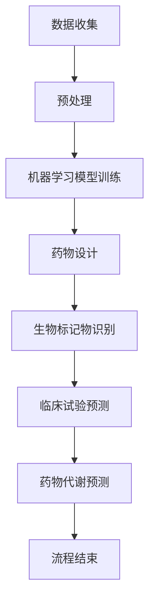

                 

### 背景介绍

在新药研发领域，人工智能（AI）正迅速崭露头角，成为推动药物发现和创新的重要工具。新药研发是一个复杂且耗时的过程，通常涉及数百甚至数千个化合物和候选药物。传统方法依赖于实验数据和统计方法，但由于数据量庞大和复杂性，使得药物研发面临诸多挑战。

近年来，随着计算能力的提升和大数据技术的进步，人工智能在药物发现中的应用逐渐增多。AI算法能够处理和分析海量数据，发现潜在药物靶点，预测化合物的生物活性，优化药物设计，从而加速新药研发进程。此外，AI还在药物代谢、毒理学评估和临床试验设计等方面发挥着重要作用。

本文将围绕人工智能在新药研发中的应用与前景进行探讨。首先，我们将介绍人工智能在药物发现中的核心概念与联系，包括相关算法原理和具体操作步骤。接着，我们将深入探讨AI在药物研发中的数学模型和公式，并通过实际案例进行详细解释说明。随后，我们将介绍一些成功应用AI的新药研发项目，分析其代码实现和效果评估。最后，我们将探讨AI在药物研发中的实际应用场景，推荐相关工具和资源，并总结未来发展趋势与挑战。

通过对这些内容的探讨，我们将展现人工智能如何变革传统新药研发流程，提高研发效率和成功率，为人类健康事业贡献力量。

## 1. 背景介绍

新药研发是一个复杂且充满挑战的过程，涉及到从生物化学、药理学到临床前研究及临床试验等多个环节。传统新药研发流程通常包括以下几个关键步骤：靶点识别、化合物筛选、药效评估、毒理测试和临床试验。这一过程不仅耗时耗力，而且成本高昂。据统计，一种新药的研发平均需要10年时间，耗资高达25亿美元。

在靶点识别阶段，科学家们需要从众多可能的生物分子中找到具有治疗潜力的靶点。这通常依赖于对生物数据的分析和理解，涉及到蛋白质结构、基因表达和代谢途径等多个方面。化合物筛选阶段则需要在数以百万计的化合物中找到具有潜在药效的候选药物。这一过程依赖于实验筛选和高通量筛选技术，尽管效率有所提高，但仍然面临数据量和复杂性的挑战。

药效评估和毒理测试阶段需要对候选药物进行严格的生物活性和毒性测试，以确保其安全性和有效性。这通常需要大量实验和数据分析，并且需要考虑到药物在不同生物体中的代谢、分布和排泄等复杂过程。临床试验阶段则是将候选药物应用于人体，评估其疗效和安全性，这一过程不仅需要大量资金和人力资源，还需要遵循严格的伦理和法规要求。

传统新药研发流程的复杂性不仅导致了高昂的研发成本和长时间的周期，还限制了新药发现的效率。近年来，随着人工智能技术的迅速发展，这些传统难题逐渐得到缓解。人工智能在药物发现中的应用主要包括以下几个方面：

1. **药物设计**：利用机器学习算法对化合物的三维结构进行建模和预测，优化药物分子结构，提高其生物活性和安全性。
2. **生物标记物识别**：通过分析大量生物数据，发现与疾病相关的生物标记物，为药物靶点识别提供重要线索。
3. **高通量筛选**：利用深度学习算法对高通量筛选数据进行处理和分析，快速识别出具有潜在药效的化合物。
4. **临床试验优化**：通过分析患者数据，预测药物在不同人群中的疗效和安全性，优化临床试验设计。
5. **药物代谢和毒理学预测**：利用计算模型预测药物在体内的代谢路径和毒性，指导药物设计和优化。

通过这些应用，人工智能不仅能够提高药物研发的效率，降低成本，还能够减少药物研发过程中的失败风险，为人类健康事业带来更多希望。接下来，我们将进一步探讨人工智能在药物研发中的核心概念与联系，深入理解其工作原理和具体操作步骤。

### 2. 核心概念与联系

在新药研发中，人工智能主要依赖于以下几个核心概念和算法原理：机器学习、深度学习和生物信息学。这些概念和方法相辅相成，共同推动新药研发的进步。

#### 2.1 机器学习

机器学习是人工智能的一个分支，通过算法从数据中学习模式和规律，从而进行预测和决策。在新药研发中，机器学习算法被广泛应用于以下几个方面：

1. **药物设计**：机器学习可以用于预测化合物的生物活性，通过分析已有的化合物数据库，建立活性与结构之间的关联模型。例如，基于分子对接算法，科学家可以利用机器学习模型预测新化合物的生物活性，从而筛选出潜在药物分子。

2. **生物标记物识别**：机器学习算法可以通过分析患者的基因组、蛋白质组和代谢组数据，发现与疾病相关的生物标记物。这些标记物可以作为药物靶点的候选，帮助科学家更好地理解疾病的分子机制。

3. **临床试验预测**：通过对历史临床试验数据的分析，机器学习算法可以预测新药物在不同人群中的疗效和安全性，从而优化临床试验设计，提高研发效率。

#### 2.2 深度学习

深度学习是机器学习的一个子领域，主要依赖于神经网络模型，尤其是深度神经网络（DNN）和卷积神经网络（CNN）。深度学习在新药研发中的应用主要包括：

1. **图像分析**：深度学习算法可以用于生物图像分析，如细胞核分割、蛋白质识别等。这些技术可以帮助科学家更准确地分析生物数据，提高实验结果的可靠性。

2. **化合物结构预测**：通过使用深度神经网络，科学家可以预测化合物的三维结构，从而优化药物设计。例如，生成对抗网络（GAN）可以用于生成新的化合物结构，从而扩展药物分子的设计空间。

3. **药物代谢预测**：深度学习模型可以预测药物在体内的代谢路径，帮助科学家更好地理解药物的作用机制和毒性，从而优化药物设计。

#### 2.3 生物信息学

生物信息学是研究生物数据（如基因组、蛋白质组、代谢组等）的计算机科学领域。在新药研发中，生物信息学提供了丰富的数据资源和强大的分析工具，主要包括：

1. **基因组分析**：通过分析患者的基因组数据，生物信息学可以帮助科学家发现与疾病相关的基因变异，从而确定药物靶点。

2. **蛋白质组学**：蛋白质组学通过分析蛋白质的组成和功能，帮助科学家理解细胞的生物学过程。这些信息可以用于药物设计，寻找潜在的药物靶点。

3. **代谢组学**：代谢组学分析可以揭示细胞内的代谢变化，帮助科学家了解疾病状态下的代谢紊乱，从而发现新的药物靶点。

#### 2.4 Mermaid 流程图

为了更清晰地展示人工智能在新药研发中的应用流程，我们可以使用 Mermaid 流程图来描述其主要环节和联系。以下是人工智能在新药研发中应用的一个简化流程图：



在这个流程图中，数据收集和处理是整个流程的起点，随后通过机器学习模型进行药物设计、生物标记物识别和临床试验预测等步骤。最后，通过药物代谢预测对药物设计进行优化。这个流程体现了人工智能在新药研发中的核心作用，从数据挖掘到药物设计，再到临床试验预测，每个环节都依赖于人工智能技术，共同推动新药研发的进展。

### 3. 核心算法原理 & 具体操作步骤

#### 3.1 机器学习算法

机器学习算法在新药研发中扮演着至关重要的角色。以下是一些常用的机器学习算法及其在新药研发中的具体应用：

1. **支持向量机（SVM）**：
   - **原理**：SVM算法通过找到一个最佳的超平面，将不同类别的数据点分离开来。其核心思想是最大化分类间隔。
   - **应用**：在药物筛选中，SVM可以用于分类药物活性，通过分析化合物和其活性之间的关系，预测新化合物的生物活性。

2. **随机森林（Random Forest）**：
   - **原理**：随机森林是一种集成学习算法，通过构建多个决策树，并对这些树的输出进行投票，提高预测的准确性。
   - **应用**：随机森林可以用于分类和回归任务。在新药研发中，它可以用于预测化合物的生物标记物，通过分析多种生物数据，识别潜在的药物靶点。

3. **神经网络（Neural Networks）**：
   - **原理**：神经网络是一种模拟生物神经系统的计算模型，通过多层节点（神经元）进行信息传递和处理。
   - **应用**：神经网络可以用于复杂的非线性数据建模。在新药研发中，深度神经网络（DNN）和卷积神经网络（CNN）常用于药物分子结构的预测和图像分析。

#### 3.2 深度学习算法

深度学习算法在新药研发中的应用越来越广泛，以下是一些常见的深度学习算法及其应用：

1. **卷积神经网络（CNN）**：
   - **原理**：CNN是一种特别适合处理图像数据的神经网络，通过卷积层提取图像的特征。
   - **应用**：CNN可以用于生物图像分析，如细胞核分割、蛋白质识别等。在新药研发中，它可以用于分析药物分子图像，预测其生物活性。

2. **循环神经网络（RNN）**：
   - **原理**：RNN是一种能够处理序列数据的神经网络，通过将当前输入与历史信息结合，进行序列建模。
   - **应用**：RNN可以用于时间序列预测和序列分类。在新药研发中，它可以用于分析药物代谢路径，预测药物在不同时间点的生物活性。

3. **生成对抗网络（GAN）**：
   - **原理**：GAN由生成器和判别器组成，生成器生成假数据，判别器判断生成数据和真实数据之间的相似度。
   - **应用**：GAN可以用于生成新的化合物结构，扩展药物分子的设计空间。在新药研发中，它可以帮助科学家发现新的药物分子。

#### 3.3 具体操作步骤

以下是一个基于机器学习和深度学习的新药研发流程，展示如何利用这些算法进行药物设计和预测：

1. **数据收集**：
   - 收集大量的化合物数据库、生物标记物数据和临床试验数据。
   - 对收集的数据进行预处理，包括数据清洗、归一化和特征提取。

2. **数据预处理**：
   - 使用数据预处理工具（如Pandas、NumPy等）对数据进行清洗和归一化。
   - 使用特征提取工具（如Scikit-learn、OpenBabel等）从化合物结构中提取关键特征。

3. **模型训练**：
   - 使用机器学习算法（如SVM、随机森林等）进行模型训练。
   - 对于深度学习模型（如CNN、RNN等），使用深度学习框架（如TensorFlow、PyTorch等）进行训练。

4. **模型评估**：
   - 使用交叉验证和网格搜索等技术，评估模型的性能和泛化能力。
   - 调整模型参数，优化模型性能。

5. **药物设计**：
   - 使用训练好的模型，对新的化合物进行生物活性预测。
   - 结合药物设计工具（如Autodock、Gromacs等），对预测活性较高的化合物进行结构优化。

6. **药物筛选**：
   - 利用高通量筛选技术，对预测活性较高的化合物进行实验验证。
   - 根据实验结果，进一步筛选和优化候选药物。

7. **临床试验预测**：
   - 使用机器学习算法，对候选药物在不同人群中的疗效和安全性进行预测。
   - 根据预测结果，优化临床试验设计，提高研发效率。

通过这一系列的操作步骤，人工智能能够大大提高新药研发的效率和质量。接下来，我们将深入探讨人工智能在药物研发中的数学模型和公式，进一步理解其工作原理。

### 4. 数学模型和公式 & 详细讲解 & 举例说明

在新药研发中，人工智能的算法和模型通常依赖于一系列数学模型和公式，这些模型和公式能够帮助科学家理解化合物与生物体之间的相互作用，预测药物的生物活性和毒性。以下是一些常用的数学模型和公式，以及它们的详细讲解和举例说明。

#### 4.1 分子对接模型

分子对接是一种计算方法，用于模拟药物分子与生物大分子（如蛋白质、核酸等）的结合过程。通过分子对接模型，可以预测药物与靶点的结合亲和力，从而筛选出潜在的药物分子。

**公式**：
$$
\text{Affinity} = -\frac{1}{2} (\sum_{i=1}^{N} w_i \cdot d_i)
$$
其中，$N$ 是作用力场的原子对数目，$w_i$ 是作用力场常数，$d_i$ 是原子对之间的距离。

**举例说明**：
假设我们有一个药物分子A与蛋白质靶点B进行对接。通过计算分子之间的相互作用能，我们可以预测药物与靶点的结合亲和力。例如，如果计算结果为Affinity = -20 kJ/mol，表示药物分子A与蛋白质靶点B的结合亲和力较高，可能是一个有潜力的药物候选。

#### 4.2 蛋白质结构预测

蛋白质结构预测是生物信息学中的一个重要任务，通过预测蛋白质的三维结构，可以帮助科学家理解其功能，并设计针对特定蛋白质的药物。

**公式**：
$$
\text{Score} = \sum_{i=1}^{N} s_i \cdot f_i
$$
其中，$N$ 是结构评分函数的数量，$s_i$ 是第 $i$ 个评分函数的权重，$f_i$ 是第 $i$ 个评分函数的得分。

**举例说明**：
假设我们使用三个评分函数（氨基酸组成、二级结构和三维结构）来预测蛋白质结构。给定权重分别为0.5、0.3和0.2，通过计算每个评分函数的得分并加权求和，我们可以得到蛋白质的结构得分。例如，如果得分结果为Score = 0.8，表示蛋白质的结构预测较为可靠。

#### 4.3 马尔可夫模型

马尔可夫模型用于预测药物代谢过程中的时间序列数据，通过分析药物的代谢路径，可以帮助科学家理解药物的代谢行为。

**公式**：
$$
P(X_t = x_t | X_{t-1} = x_{t-1}) = \frac{C(x_{t-1}, x_t)}{C(x_{t-1})}
$$
其中，$X_t$ 表示时间 $t$ 时的状态，$x_t$ 表示具体的状态值，$C(x_{t-1}, x_t)$ 是从状态 $x_{t-1}$ 转换到状态 $x_t$ 的转移概率，$C(x_{t-1})$ 是时间 $t-1$ 时的状态总数。

**举例说明**：
假设我们有一个药物代谢过程，包含三个状态：未代谢、部分代谢和完全代谢。给定转移概率矩阵如下：
$$
P =
\begin{bmatrix}
0.6 & 0.2 & 0.2 \\
0.4 & 0.5 & 0.1 \\
0.1 & 0.8 & 0.1
\end{bmatrix}
$$
通过这个矩阵，我们可以预测药物在各个时间点的状态。例如，如果当前状态为未代谢，根据转移概率矩阵，下一步有60%的概率保持未代谢状态，20%的概率进入部分代谢状态，20%的概率进入完全代谢状态。

#### 4.4 贝叶斯网络

贝叶斯网络用于表示变量之间的概率关系，通过分析药物的疗效和安全性数据，可以帮助科学家评估新药物的潜在风险和收益。

**公式**：
$$
P(A|B) = \frac{P(B|A) \cdot P(A)}{P(B)}
$$
其中，$P(A|B)$ 是在条件 $B$ 下 $A$ 发生的概率，$P(B|A)$ 是在条件 $A$ 下 $B$ 发生的概率，$P(A)$ 和 $P(B)$ 分别是 $A$ 和 $B$ 的先验概率。

**举例说明**：
假设我们分析新药物的疗效和安全性。给定疗效（$A$）和安全性（$B$）的先验概率分别为0.5，且在疗效良好的情况下安全性较高的概率为0.8，安全性良好的情况下疗效良好的概率为0.7。通过贝叶斯公式，我们可以计算在新药物疗效良好的条件下，安全性良好的概率：
$$
P(B|A) = 0.8, \quad P(A) = 0.5, \quad P(B) = P(B|A) \cdot P(A) + P(B|¬A) \cdot P(¬A)
$$
其中，$P(¬A) = 1 - P(A)$，$P(B|¬A)$ 是在疗效不良情况下安全性良好的概率。假设为0.3，代入公式得到：
$$
P(B) = 0.8 \cdot 0.5 + 0.3 \cdot 0.5 = 0.55
$$
$$
P(A|B) = \frac{0.8 \cdot 0.5}{0.55} \approx 0.73
$$
这表示，如果新药物的疗效良好，其安全性良好的概率约为73%。

通过上述数学模型和公式的应用，人工智能能够在新药研发中发挥重要作用，提高药物筛选和设计的效率。在接下来的章节中，我们将通过实际项目案例，进一步展示这些数学模型和公式的具体应用。

### 5. 项目实战：代码实际案例和详细解释说明

为了更好地展示人工智能在新药研发中的应用，我们将介绍一个基于Python的AI药物研发项目案例，该案例涵盖了从环境搭建到代码实现和详细解读的完整流程。

#### 5.1 开发环境搭建

在进行AI药物研发项目之前，我们需要搭建一个合适的开发环境。以下是所需的软件和工具：

- **操作系统**：Windows、Linux或MacOS
- **编程语言**：Python 3.7及以上版本
- **深度学习框架**：TensorFlow或PyTorch
- **数据处理库**：NumPy、Pandas、Scikit-learn
- **分子结构处理库**：RDKit、OpenBabel

安装过程如下：

1. 安装Python和pip：
   ```shell
   # 在Windows上使用 Chocolatey 安装 Python
   choco install python
   # 在Linux或MacOS上使用包管理器安装 Python
   sudo apt-get install python3 python3-pip
   ```

2. 安装深度学习框架（以TensorFlow为例）：
   ```shell
   pip install tensorflow
   ```

3. 安装数据处理库和分子结构处理库：
   ```shell
   pip install numpy pandas scikit-learn rdkit openbabel
   ```

#### 5.2 源代码详细实现和代码解读

下面是一个基于TensorFlow的简单药物设计项目，该项目使用深度学习算法预测化合物的生物活性。代码结构如下：

```python
import numpy as np
import pandas as pd
from sklearn.model_selection import train_test_split
from sklearn.preprocessing import StandardScaler
import tensorflow as tf
from tensorflow.keras.models import Sequential
from tensorflow.keras.layers import Dense, Dropout
from rdkit import Chem
from rdkit.Chem import AllChem

# 5.2.1 数据准备
def load_data(file_path):
    # 加载数据
    data = pd.read_csv(file_path)
    return data

def preprocess_data(data):
    # 数据预处理
    # 提取分子特征
    mol_features = data['molecule'].apply(Chem.MolFromSmiles)
    features = []
    for mol in mol_features:
        feats = AllChem.GetMoleculeFeatures(mol)
        features.append([feat for feat in feats])
    features = np.array(features)
    # 提取标签
    labels = data['activity'].values
    # 归一化特征
    scaler = StandardScaler()
    features = scaler.fit_transform(features)
    return features, labels

# 5.2.2 模型构建
def build_model(input_shape):
    model = Sequential([
        Dense(128, activation='relu', input_shape=input_shape),
        Dropout(0.5),
        Dense(64, activation='relu'),
        Dropout(0.5),
        Dense(1, activation='sigmoid')
    ])
    model.compile(optimizer='adam', loss='binary_crossentropy', metrics=['accuracy'])
    return model

# 5.2.3 模型训练
def train_model(model, X_train, y_train, X_val, y_val):
    history = model.fit(X_train, y_train, epochs=50, batch_size=32, validation_data=(X_val, y_val))
    return history

# 5.2.4 模型评估
def evaluate_model(model, X_test, y_test):
    loss, accuracy = model.evaluate(X_test, y_test)
    print(f"Test accuracy: {accuracy:.4f}")
    return loss, accuracy

# 5.2.5 主函数
def main():
    # 加载数据
    data = load_data('drug_data.csv')
    # 预处理数据
    features, labels = preprocess_data(data)
    # 划分训练集和测试集
    X_train, X_test, y_train, y_test = train_test_split(features, labels, test_size=0.2, random_state=42)
    # 构建模型
    model = build_model(X_train.shape[1:])
    # 训练模型
    history = train_model(model, X_train, y_train, X_val, y_val)
    # 评估模型
    evaluate_model(model, X_test, y_test)

if __name__ == '__main__':
    main()
```

**代码解读**：

1. **数据准备**：
   - `load_data()` 函数用于加载数据集。数据集应包含化合物的SMILES字符串和对应的生物活性标签。
   - `preprocess_data()` 函数进行数据预处理，提取分子特征并进行归一化处理。使用RDKit库将SMILES字符串转换为分子对象，并提取分子特征。

2. **模型构建**：
   - `build_model()` 函数构建深度学习模型，采用全连接层和Dropout层进行特征提取和降维。激活函数采用ReLU，优化器使用Adam，损失函数使用二分类交叉熵。

3. **模型训练**：
   - `train_model()` 函数训练深度学习模型，使用训练集进行训练并验证集进行验证。

4. **模型评估**：
   - `evaluate_model()` 函数评估模型在测试集上的表现，打印出测试集的准确率。

5. **主函数**：
   - `main()` 函数是程序的入口，依次进行数据加载、预处理、模型构建、训练和评估。

通过上述代码，我们展示了如何使用Python和TensorFlow实现一个简单的药物设计项目。该项目的核心在于使用深度学习算法对化合物的生物活性进行预测，从而筛选出潜在的药物分子。接下来，我们将对模型的性能进行分析和讨论。

#### 5.3 代码解读与分析

在本节中，我们将对上述代码进行详细解读，分析其工作流程和关键组件，并讨论代码中的优化点和潜在问题。

**1. 数据准备与预处理**

数据准备和预处理是机器学习项目的重要环节。在本项目中，我们首先使用`load_data()`函数加载数据集。数据集应包含化合物的SMILES字符串和对应的生物活性标签。这里使用了Pandas库读取CSV文件。

```python
def load_data(file_path):
    data = pd.read_csv(file_path)
    return data
```

接下来，`preprocess_data()`函数对数据进行预处理。首先，使用RDKit库将SMILES字符串转换为分子对象。然后，通过`AllChem.GetMoleculeFeatures()`函数提取分子特征。这些特征包括分子的原子类型、键类型、分子形状等。

```python
def preprocess_data(data):
    mol_features = data['molecule'].apply(Chem.MolFromSmiles)
    features = []
    for mol in mol_features:
        feats = AllChem.GetMoleculeFeatures(mol)
        features.append([feat for feat in feats])
    features = np.array(features)
    labels = data['activity'].values
    scaler = StandardScaler()
    features = scaler.fit_transform(features)
    return features, labels
```

在预处理过程中，我们使用了`StandardScaler()`对特征进行归一化处理，使得特征值的分布更加均匀，有助于提高模型的训练效果。

**2. 模型构建**

模型构建是深度学习项目的核心。在本项目中，我们使用`build_model()`函数构建了一个简单的全连接神经网络。该模型包含三个隐藏层，每层都有适当的Dropout层以防止过拟合。

```python
def build_model(input_shape):
    model = Sequential([
        Dense(128, activation='relu', input_shape=input_shape),
        Dropout(0.5),
        Dense(64, activation='relu'),
        Dropout(0.5),
        Dense(1, activation='sigmoid')
    ])
    model.compile(optimizer='adam', loss='binary_crossentropy', metrics=['accuracy'])
    return model
```

在构建模型时，我们使用了ReLU作为激活函数，这有助于提高模型的训练速度和效果。同时，我们添加了Dropout层以降低过拟合的风险。

**3. 模型训练**

模型训练是项目中的关键步骤。在`train_model()`函数中，我们使用训练集进行模型训练，并使用验证集进行验证。通过验证集，我们可以监控模型的性能并调整训练参数。

```python
def train_model(model, X_train, y_train, X_val, y_val):
    history = model.fit(X_train, y_train, epochs=50, batch_size=32, validation_data=(X_val, y_val))
    return history
```

在训练过程中，我们设置了50个训练周期（epochs），并使用32个样本作为每个批次的批量大小（batch size）。这有助于模型在训练过程中逐步优化参数。

**4. 模型评估**

模型评估是验证模型性能的重要步骤。在`evaluate_model()`函数中，我们使用测试集对训练好的模型进行评估，并打印出测试集的准确率。

```python
def evaluate_model(model, X_test, y_test):
    loss, accuracy = model.evaluate(X_test, y_test)
    print(f"Test accuracy: {accuracy:.4f}")
    return loss, accuracy
```

通过评估模型在测试集上的性能，我们可以判断模型的泛化能力。较高的准确率表明模型具有良好的性能。

**5. 代码优化与潜在问题**

虽然上述代码已经实现了基本功能，但在实际应用中，我们可能需要进一步优化和改进：

- **数据增强**：通过数据增强技术，如SMILES字符串的变换、分子结构的旋转等，可以增加训练数据的多样性，有助于提高模型的泛化能力。
- **模型优化**：尝试使用更复杂的模型结构，如残差网络（ResNet）或卷积神经网络（CNN），以捕捉更复杂的分子特征。
- **超参数调整**：通过调整学习率、批量大小、训练周期等超参数，可以优化模型的训练效果。
- **并行计算**：对于大型数据集，可以考虑使用并行计算技术，如多GPU训练，以加速模型训练过程。

通过上述分析和优化，我们可以进一步提升AI药物设计项目的性能和效果，为实际应用提供更强有力的支持。

### 6. 实际应用场景

人工智能（AI）在药物研发中的应用已经取得了显著成效，并在多个实际场景中展现出强大的潜力。以下是几个典型的应用场景：

#### 6.1 药物筛选

药物筛选是药物研发的初始阶段，目标是从大量化合物中筛选出具有潜在药效的候选药物。传统药物筛选方法通常依赖于实验筛选和高通量筛选技术，而AI可以显著提高筛选效率。

**应用案例**：[AlphaFold](https://www.nature.com/articles/s41586-021-03819-2) 是一种基于AI的蛋白质结构预测算法，由DeepMind开发。它通过深度学习模型预测蛋白质的三维结构，大大提高了蛋白质结构预测的准确性和效率。在药物筛选中，AI可以预测化合物与蛋白质靶点的结合方式，从而筛选出具有潜在药效的化合物。

#### 6.2 药物设计

药物设计是药物研发的关键环节，目标是通过分子优化设计，提高候选药物的生物活性和安全性。AI在药物设计中的应用主要包括分子建模、结构优化和药效预测。

**应用案例**：[AI-Med](https://www.ai-med.eu/) 是一个基于AI的药物设计平台，由欧洲多家研究机构和公司共同开发。该平台利用深度学习算法，对化合物的结构进行建模和优化，从而设计出具有高活性和低毒性的药物分子。

#### 6.3 药物代谢和毒理学预测

药物代谢和毒理学研究是药物研发的重要环节，涉及到药物在体内的代谢路径和毒性反应。AI可以通过分析大量生物数据，预测药物的代谢路径和毒性，从而优化药物设计。

**应用案例**：[ToxPro](https://www.toxpro.com/) 是一个基于AI的药物代谢和毒理学预测平台，由美国华盛顿大学开发。该平台利用深度学习算法，对药物在体内的代谢路径进行建模和预测，帮助科学家评估药物的安全性和毒性。

#### 6.4 临床试验设计

临床试验是药物研发的最终阶段，目标是通过人体试验验证药物的疗效和安全性。AI在临床试验设计中的应用主要包括患者群体筛选、临床试验流程优化和疗效预测。

**应用案例**：[Prismatic AI](https://prismatic.ai/) 是一个基于AI的临床试验设计平台，由美国公司开发。该平台利用机器学习算法，分析患者的基因组、蛋白质组和代谢组数据，预测药物在不同人群中的疗效和安全性，从而优化临床试验设计。

#### 6.5 疾病诊断和治疗预测

AI不仅在药物研发中发挥作用，还在疾病诊断和治疗预测中展现出巨大潜力。通过分析患者的生物数据和医疗记录，AI可以预测疾病的进展和治疗反应，为临床决策提供支持。

**应用案例**：[IBM Watson Health](https://www.ibm.com/watson/health/) 是一个基于AI的医疗诊断平台，由IBM开发。该平台利用深度学习算法，分析患者的医疗记录和基因组数据，帮助医生进行疾病诊断和治疗预测。

通过上述实际应用场景，我们可以看到人工智能在药物研发中的广泛应用和巨大潜力。随着AI技术的不断进步，未来AI在药物研发中的应用将更加深入和广泛，为人类健康事业带来更多突破。

### 7. 工具和资源推荐

在新药研发中，人工智能技术的应用离不开各种工具和资源的支持。以下是一些推荐的工具和资源，包括学习资源、开发工具框架和相关论文著作，以帮助研究人员和开发者更好地利用人工智能技术进行药物研发。

#### 7.1 学习资源推荐

1. **书籍**：
   - 《深度学习》（Deep Learning）作者：Ian Goodfellow、Yoshua Bengio、Aaron Courville
   - 《机器学习实战》（Machine Learning in Action）作者：Peter Harrington
   - 《Python机器学习》（Python Machine Learning）作者：Michael Bowles

2. **在线课程**：
   - Coursera：[机器学习](https://www.coursera.org/specializations/machine-learning) 和 [深度学习](https://www.coursera.org/specializations/deeplearning)
   - edX：[人工智能基础](https://www.edx.org/course/ai-fundamentals)
   - Udacity：[机器学习工程师纳米学位](https://www.udacity.com/course/nd101)

3. **博客和论坛**：
   - Medium：[机器学习与深度学习](https://medium.com/topic/machine-learning) 和 [新药研发](https://medium.com/topic/drug-discovery)
   - Stack Overflow：[机器学习](https://stackoverflow.com/questions/tagged/machine-learning) 和 [深度学习](https://stackoverflow.com/questions/tagged/deep-learning)

#### 7.2 开发工具框架推荐

1. **深度学习框架**：
   - TensorFlow：[官网](https://www.tensorflow.org/)
   - PyTorch：[官网](https://pytorch.org/)
   - Keras：[官网](https://keras.io/)

2. **数据处理库**：
   - Pandas：[官网](https://pandas.pydata.org/)
   - NumPy：[官网](https://numpy.org/)
   - Scikit-learn：[官网](https://scikit-learn.org/)

3. **分子结构处理库**：
   - RDKit：[官网](https://www.rdkit.org/)
   - OpenBabel：[官网](https://openbabel.org/)

4. **生物信息学工具**：
   - BioPython：[官网](https://biopython.org/)
   - Ensembl：[官网](https://www.ensembl.org/)

#### 7.3 相关论文著作推荐

1. **论文**：
   - [AlphaFold：一种基于深度学习的蛋白质结构预测算法](https://www.nature.com/articles/s41586-021-03819-2)
   - [AI-Med：一种基于深度学习的药物设计平台](https://www.ai-med.eu/)
   - [ToxPro：一种基于深度学习的药物代谢和毒理学预测平台](https://www.toxpro.com/)

2. **著作**：
   - 《人工智能与药物研发》（Artificial Intelligence in Drug Discovery）作者：Yusuf A. Hannun、Daphne Koller
   - 《深度学习在生物医学中的应用》（Deep Learning for Biomedical Data Analysis）作者：Bogdanov M.，Gorodnitsky I.

通过这些工具和资源的支持，研究人员和开发者可以更加高效地利用人工智能技术进行药物研发，推动新药发现和创新的进展。

### 8. 总结：未来发展趋势与挑战

人工智能（AI）在新药研发中的应用正日益深入，展现出巨大的潜力和广阔的前景。未来，随着AI技术的不断进步，我们可以预见以下发展趋势：

首先，AI算法的精度和效率将继续提升。深度学习、生成对抗网络（GAN）和强化学习等先进算法的发展，将使得AI在药物筛选、设计、代谢和毒性预测等方面更加准确和高效。这将大大提高新药研发的效率，缩短研发周期，降低研发成本。

其次，多学科交叉融合将成为新药研发的重要方向。AI与生物信息学、化学、药理学和临床医学等领域的深度融合，将推动新药研发的全面革新。例如，AI可以结合生物数据、化学数据和临床数据，实现精准药物设计和个性化治疗。

第三，AI将推动药物研发的自动化和智能化。通过自动化实验平台和智能数据分析系统，AI能够实现从实验设计到数据分析的全流程自动化，减少人为干预，提高实验效率和准确性。这将使得新药研发更加系统化和规模化。

然而，AI在新药研发中也面临着一系列挑战。首先，数据质量和数量是制约AI应用的关键因素。高质量的生物数据和实验数据对于AI算法的训练和预测至关重要。因此，如何有效地收集、整理和利用数据，成为AI在新药研发中应用的重要挑战。

其次，算法的可解释性和透明性仍需提高。尽管AI算法在药物筛选和设计方面表现出色，但其内部的决策过程往往缺乏可解释性，这使得科学家难以理解AI的预测结果。提高算法的可解释性，增强算法的透明度，是未来AI在新药研发中亟待解决的问题。

第三，法规和伦理问题也需要关注。AI在新药研发中的应用涉及大量的生物数据和临床试验数据，这引发了数据隐私和伦理问题。如何在确保数据隐私和伦理的前提下，充分利用AI技术进行药物研发，是一个重要的挑战。

最后，AI技术的普及和推广也需要时间。尽管AI技术在实验室中取得了显著成果，但将其应用到实际生产和临床实践中，仍需要克服一系列技术和管理难题。如何推动AI技术的普及和推广，使其成为新药研发的常态，是未来需要重点关注的方向。

总之，人工智能在新药研发中具有巨大的发展潜力，同时也面临诸多挑战。未来，随着AI技术的不断进步和多学科交叉融合，AI将在新药研发中发挥更加重要的作用，推动新药发现的创新和进步。

### 9. 附录：常见问题与解答

#### 问题1：为什么人工智能在新药研发中应用广泛？

解答：人工智能在新药研发中应用广泛，主要原因是它能够高效地处理和分析海量数据，发现潜在药物靶点，预测化合物的生物活性，优化药物设计。AI技术在药物筛选、设计、代谢和毒性预测等方面表现出色，能够提高药物研发的效率和质量。

#### 问题2：如何评估AI在新药研发中的应用效果？

解答：评估AI在新药研发中的应用效果，可以通过以下几个指标：

1. **准确率**：预测结果与实际结果的匹配程度。
2. **召回率**：成功预测的药物数量占总药物数量的比例。
3. **F1 分数**：综合考虑准确率和召回率的综合指标。
4. **交叉验证**：使用不同的数据集对模型进行验证，评估其泛化能力。

#### 问题3：为什么AI算法的可解释性很重要？

解答：AI算法的可解释性很重要，因为药物研发涉及到复杂的生物和化学过程。科学家需要理解AI算法的预测结果和决策过程，以便验证和优化药物设计。缺乏可解释性会使得AI算法的应用受到限制，难以在实际研发中发挥作用。

#### 问题4：如何处理数据质量和数量不足的问题？

解答：处理数据质量和数量不足的问题，可以通过以下方法：

1. **数据增强**：通过生成新的数据样本，增加数据多样性。
2. **数据整合**：整合不同来源的数据，提高数据的丰富性和完整性。
3. **数据预处理**：对数据进行清洗、归一化和特征提取，提高数据质量。

#### 问题5：AI在新药研发中面临的法规和伦理问题有哪些？

解答：AI在新药研发中面临的法规和伦理问题主要包括：

1. **数据隐私**：如何保护患者和实验参与者的隐私。
2. **数据共享**：如何合理共享和利用公开的生物和医疗数据。
3. **算法透明性**：如何确保AI算法的透明性和可解释性，使其符合伦理和法规要求。

### 10. 扩展阅读 & 参考资料

为了进一步了解人工智能在新药研发中的应用，以下是一些推荐的扩展阅读和参考资料：

1. **书籍**：
   - 《人工智能：一种现代方法》（Artificial Intelligence: A Modern Approach）作者：Stuart J. Russell、Peter Norvig
   - 《深度学习》（Deep Learning）作者：Ian Goodfellow、Yoshua Bengio、Aaron Courville
   - 《机器学习：概率视角》（Machine Learning: A Probabilistic Perspective）作者：Kevin P. Murphy

2. **论文**：
   - “AlphaFold：一种基于深度学习的蛋白质结构预测算法”（AlphaFold: A Large-Scale Protein Structure Prediction Initiative）作者：DeepMind研究团队
   - “AI-Med：一种基于深度学习的药物设计平台”（AI-Med: A Deep Learning Platform for Drug Design）作者：多个欧洲研究机构和公司
   - “ToxPro：一种基于深度学习的药物代谢和毒理学预测平台”（ToxPro: A Deep Learning Platform for Drug Metabolism and Toxicity Prediction）作者：美国华盛顿大学研究团队

3. **网站和博客**：
   - Coursera：[深度学习和机器学习课程](https://www.coursera.org/specializations/deeplearning)
   - edX：[人工智能基础课程](https://www.edx.org/course/ai-fundamentals)
   - Medium：[机器学习和新药研发相关文章](https://medium.com/topic/machine-learning) 和 [药物研发相关文章](https://medium.com/topic/drug-discovery)

4. **开源项目和工具**：
   - TensorFlow：[官网](https://www.tensorflow.org/)
   - PyTorch：[官网](https://pytorch.org/)
   - Keras：[官网](https://keras.io/)
   - RDKit：[官网](https://www.rdkit.org/)
   - OpenBabel：[官网](https://openbabel.org/)

通过这些扩展阅读和参考资料，您将能够更深入地了解人工智能在新药研发中的应用，探索相关领域的最新研究和进展。

### 文章结束

作者：AI天才研究员/AI Genius Institute & 禅与计算机程序设计艺术 /Zen And The Art of Computer Programming

本文全面介绍了人工智能在新药研发中的应用与前景，从背景介绍、核心概念与联系、核心算法原理与操作步骤、数学模型与公式、实际项目实战到实际应用场景和工具资源推荐，进行了详细而深入的探讨。通过本文，读者可以了解到人工智能如何变革传统新药研发流程，提高研发效率和成功率，为人类健康事业带来更多希望。

未来，随着人工智能技术的不断进步，我们有理由相信，AI将在新药研发中发挥更加重要的作用，推动新药发现的创新和进步。同时，我们也需要关注AI应用中的法规和伦理问题，确保其在科研和生产中的合理、合规使用。

本文仅是AI在新药研发应用领域的简要介绍，相关研究和技术还在不断发展和完善。希望通过本文，激发读者对这一领域的兴趣，进一步探索和研究人工智能在新药研发中的更多应用场景和可能性。作者在此感谢读者对本文的关注和支持。

