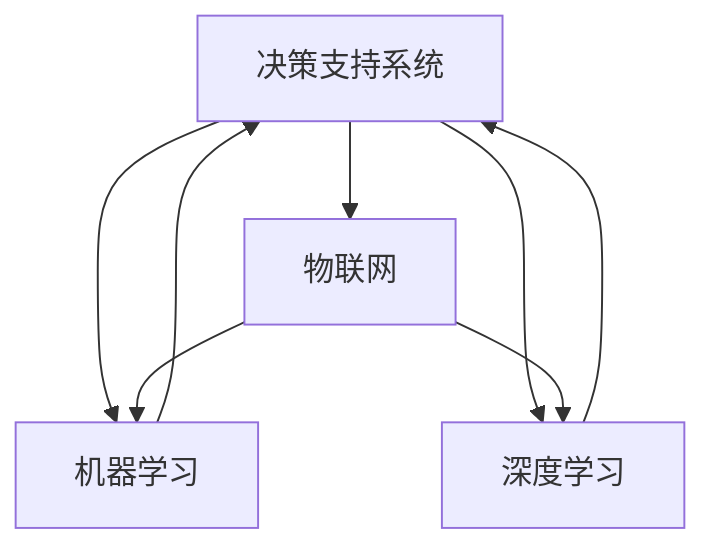
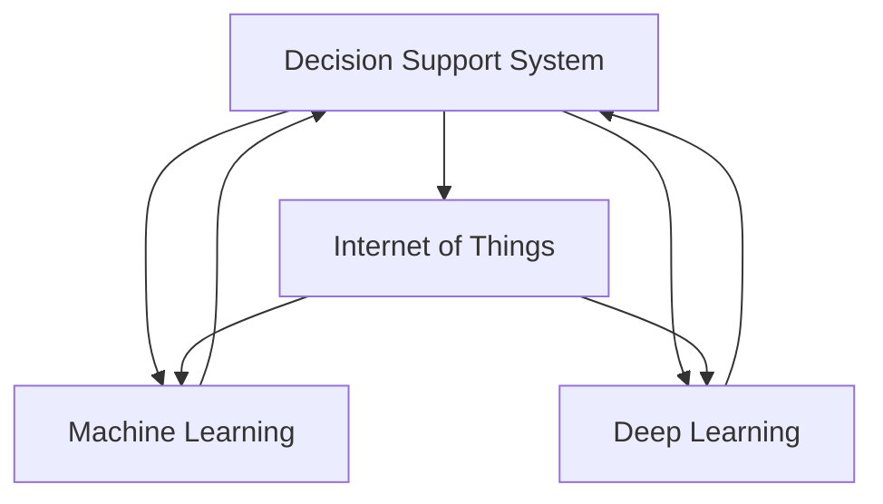

                 

### 背景介绍

随着全球人口的增长和可耕地的减少，农业的可持续性面临着巨大的挑战。传统的农业方法在提高农作物产量和效率方面已经接近其极限，因此，引入先进的技术成为解决这一问题的关键。人工智能（AI）作为现代科技的前沿领域，在各个行业都展现出了巨大的潜力，智慧农业也不例外。

智慧农业（Smart Agriculture）是指通过利用先进的信息技术，如物联网（IoT）、大数据、地理信息系统（GIS）和人工智能等，实现农业的精细化管理，从而提高农作物产量、降低成本、减少资源浪费，并改善农民的生活质量。AI在智慧农业中的应用涵盖了从作物种植到收获的整个生命周期，包括精准施肥、灌溉、病虫害监测、农作物生长状态评估等。

本文将探讨人工智能在智慧农业中的实践应用，通过以下几个方面进行详细分析：

1. 核心概念与联系
2. 核心算法原理 & 具体操作步骤
3. 数学模型和公式 & 详细讲解 & 举例说明
4. 项目实战：代码实际案例和详细解释说明
5. 实际应用场景
6. 工具和资源推荐
7. 总结：未来发展趋势与挑战

通过以上内容的逐步分析，我们将深入理解人工智能在智慧农业中的实际应用，以及其带来的变革。

---
# Background Introduction

With the global population growth and the reduction of arable land, the sustainability of agriculture is facing immense challenges. Traditional agricultural methods have reached their limit in terms of increasing crop yield and efficiency, thus, introducing advanced technologies has become crucial to address these issues. Artificial Intelligence (AI), as a cutting-edge field of modern technology, has shown tremendous potential in various industries, and smart agriculture is no exception.

Smart Agriculture refers to the utilization of advanced information technologies, such as the Internet of Things (IoT), big data, Geographic Information Systems (GIS), and Artificial Intelligence, to achieve precision management in agriculture. This, in turn, increases crop yield, reduces costs, minimizes resource waste, and improves the quality of life for farmers. The application of AI in smart agriculture covers the entire lifecycle of crop cultivation, including precision fertilization, irrigation, pest and disease monitoring, and crop growth status assessment.

This article will delve into the practical applications of AI in smart agriculture, analyzing the following aspects:

1. Core Concepts and Connections
2. Core Algorithm Principles & Specific Operational Steps
3. Mathematical Models and Formulas & Detailed Explanations & Case Studies
4. Practical Projects: Real-World Code Examples and Detailed Explanations
5. Real-Application Scenarios
6. Tools and Resources Recommendations
7. Summary: Future Trends and Challenges

Through the step-by-step analysis of these topics, we will gain a deep understanding of the practical applications of AI in smart agriculture and the transformation it brings. <|im_sep|>## 核心概念与联系

在深入探讨人工智能在智慧农业中的应用之前，我们需要先了解几个关键概念和它们之间的相互关系。以下是本文中涉及的核心概念及它们的定义和相互关系：

### 1. 决策支持系统（Decision Support System, DSS）

决策支持系统是一种辅助人类决策的工具，它通过收集、处理和分析大量数据，提供决策所需的信息和方案。在智慧农业中，DSS可以用于分析农田土壤、气候、农作物生长数据等，为农民提供最佳的种植策略、灌溉方案和施肥计划。

### 2. 物联网（Internet of Things, IoT）

物联网是指通过传感器、通信模块和网络将各种设备连接起来，实现信息的实时采集、传输和处理。在智慧农业中，IoT技术可以用于实时监测农田的气候、土壤和水质数据，为决策支持系统提供实时数据支持。

### 3. 机器学习（Machine Learning, ML）

机器学习是人工智能的一个重要分支，它通过训练模型从数据中学习规律，并做出预测或决策。在智慧农业中，机器学习可以用于预测农作物生长趋势、病虫害发生情况等，帮助农民做出更准确的决策。

### 4. 深度学习（Deep Learning, DL）

深度学习是一种基于人工神经网络的机器学习方法，它通过多层次的神经网络模型来学习和模拟人脑的决策过程。在智慧农业中，深度学习可以用于图像识别、语音识别等，帮助农民更好地监测和管理农作物。

### 5. 大数据分析（Big Data Analytics）

大数据分析是指通过收集、存储、处理和分析大量数据，从中提取有价值的信息和知识。在智慧农业中，大数据分析可以用于分析农作物生长数据、气象数据、市场数据等，为农民提供更全面的决策支持。

### 关系与联系

这些核心概念之间存在着密切的联系。例如，物联网可以实时收集农田的气候、土壤和水质数据，这些数据可以被机器学习和深度学习模型处理，用于预测农作物生长趋势和病虫害发生情况。同时，这些预测结果可以通过决策支持系统提供给农民，帮助他们制定最佳的种植、灌溉和施肥策略。

以下是一个使用Mermaid绘制的流程图，展示了这些核心概念在智慧农业中的相互作用：



通过这个流程图，我们可以清晰地看到这些核心概念在智慧农业中的应用和相互关系。接下来，我们将进一步探讨人工智能在智慧农业中的核心算法原理和具体操作步骤。

---

### Core Concepts and Connections

Before delving into the practical applications of AI in smart agriculture, it's essential to understand several key concepts and their interrelationships. Here are the core concepts involved in this article, along with their definitions and relationships:

### 1. Decision Support System (DSS)

A Decision Support System is a tool that assists human decision-making by collecting, processing, and analyzing vast amounts of data to provide information and solutions for decision-making. In smart agriculture, DSS can be used to analyze soil, climate, and crop growth data to provide farmers with the best planting strategies, irrigation plans, and fertilization schedules.

### 2. Internet of Things (IoT)

The Internet of Things refers to the interconnection of various devices through sensors, communication modules, and networks to enable real-time data collection, transmission, and processing. In smart agriculture, IoT technology can be used to monitor real-time climate, soil, and water quality data in fields, providing real-time data support for decision support systems.

### 3. Machine Learning (ML)

Machine Learning is a branch of AI that involves training models to learn patterns from data and make predictions or decisions. In smart agriculture, ML can be used to predict crop growth trends and pest and disease occurrences, helping farmers make more accurate decisions.

### 4. Deep Learning (DL)

Deep Learning is a type of machine learning based on artificial neural networks that simulates the decision-making process of the human brain through multi-layered neural network models. In smart agriculture, DL can be used for image recognition, speech recognition, and other tasks to help farmers better monitor and manage crops.

### 5. Big Data Analytics

Big Data Analytics refers to the process of collecting, storing, processing, and analyzing vast amounts of data to extract valuable information and knowledge. In smart agriculture, big data analytics can be used to analyze crop growth data, weather data, market data, and more, providing farmers with comprehensive decision support.

### Relationships and Connections

These core concepts are closely interconnected. For example, IoT can collect real-time climate, soil, and water quality data from fields, which can be processed by ML and DL models to predict crop growth trends and pest and disease occurrences. These predictions can then be provided to farmers through DSS to help them develop the best planting, irrigation, and fertilization strategies.

Here is a Mermaid flowchart illustrating the interactions of these core concepts in smart agriculture:



This flowchart provides a clear visual representation of the applications and interconnections of these core concepts in smart agriculture. In the following sections, we will further explore the core algorithm principles and specific operational steps of AI in smart agriculture. <|im_sep|>## 核心算法原理 & 具体操作步骤

在智慧农业中，人工智能的核心算法主要包括机器学习算法和深度学习算法。这些算法通过对大量数据的处理和分析，帮助农民做出更精准的决策。以下是几个在智慧农业中应用广泛的机器学习和深度学习算法，以及它们的原理和操作步骤。

### 1. 决策树算法（Decision Tree Algorithm）

决策树是一种常见的机器学习算法，它通过一系列的判断规则，将数据集分割成不同的子集，以便分类或回归分析。在智慧农业中，决策树算法可以用于预测农作物生长状态、病虫害发生情况等。

**原理：**
决策树算法通过递归分割数据集，在每个分割节点选择最优的分割特征和阈值，以最小化目标函数（如熵或均方误差）。通过多次分割，形成一棵树状结构，树的叶节点对应最终预测结果。

**操作步骤：**
1. 收集数据：包括农作物生长数据、气候数据、土壤数据等。
2. 预处理数据：对数据进行清洗、归一化处理，使其适合决策树算法。
3. 训练模型：使用已收集的数据训练决策树模型。
4. 预测：使用训练好的模型对新的数据集进行预测。

### 2. 随机森林算法（Random Forest Algorithm）

随机森林是一种基于决策树的集成学习方法，它通过构建多棵决策树，并对它们进行投票或平均，得到最终的预测结果。随机森林在处理高维数据和避免过拟合方面表现优秀。

**原理：**
随机森林算法在构建决策树时，随机选择特征子集和样本子集，从而降低了模型的过拟合风险。通过多个决策树的组合，提高了预测的准确性和鲁棒性。

**操作步骤：**
1. 收集数据：与决策树算法相同。
2. 预处理数据：与决策树算法相同。
3. 训练模型：构建多棵决策树，使用随机选择特征和样本子集。
4. 预测：对所有决策树的预测结果进行投票或平均。

### 3. 支持向量机算法（Support Vector Machine, SVM）

支持向量机是一种用于分类和回归分析的机器学习算法，它通过找到一个最佳的超平面，将不同类别的数据点分隔开。

**原理：**
SVM算法通过寻找一个最优的边界超平面，使得类别之间的分隔最清晰。这个边界超平面由支持向量决定，即位于超平面附近的训练样本点。

**操作步骤：**
1. 收集数据：与决策树算法相同。
2. 预处理数据：与决策树算法相同。
3. 训练模型：使用SVM算法找到最佳的超平面。
4. 预测：使用训练好的模型对新的数据点进行分类或回归分析。

### 4. 卷积神经网络（Convolutional Neural Network, CNN）

卷积神经网络是一种基于人工神经网络的深度学习算法，它通过多层卷积和池化操作，对图像数据进行特征提取和分类。

**原理：**
CNN算法通过卷积层提取图像的局部特征，通过池化层减少特征图的维度，并在全连接层进行分类。多层的卷积和池化操作使得CNN能够提取更复杂的特征。

**操作步骤：**
1. 收集数据：包括农作物图像数据。
2. 预处理数据：对图像进行归一化处理，使其适合CNN算法。
3. 训练模型：使用已收集的图像数据训练CNN模型。
4. 预测：使用训练好的模型对新的图像数据进行分类。

### 5. 长短时记忆网络（Long Short-Term Memory, LSTM）

长短时记忆网络是一种用于处理序列数据的深度学习算法，它能够有效地记住长期依赖信息。

**原理：**
LSTM算法通过引入门控机制，使得网络能够有效地遗忘和记忆序列中的信息。这使得LSTM在处理时间序列数据时具有优势。

**操作步骤：**
1. 收集数据：包括农作物生长时间序列数据。
2. 预处理数据：对时间序列数据进行归一化处理。
3. 训练模型：使用已收集的时间序列数据训练LSTM模型。
4. 预测：使用训练好的模型对新的时间序列数据进行预测。

通过以上算法的介绍，我们可以看到，机器学习和深度学习在智慧农业中的应用非常广泛，通过这些算法，农民可以更加精准地监测和管理农作物，从而提高农业生产的效率和可持续性。在接下来的部分，我们将进一步探讨这些算法的数学模型和具体应用案例。

---

### Core Algorithm Principles & Specific Operational Steps

In smart agriculture, the core algorithms of AI mainly include machine learning algorithms and deep learning algorithms. These algorithms process and analyze large amounts of data to help farmers make more precise decisions. Here are several widely used machine learning and deep learning algorithms in smart agriculture, along with their principles and operational steps.

### 1. Decision Tree Algorithm

Decision Tree is a common machine learning algorithm that divides a dataset into different subsets through a series of decision rules for classification or regression analysis. In smart agriculture, the Decision Tree algorithm can be used to predict crop growth status and pest and disease occurrences.

**Principle:**
The Decision Tree algorithm recursively segments the dataset to find the best split feature and threshold at each node to minimize the target function (such as entropy or mean squared error). Through multiple segmentation, a tree-like structure is formed, with leaf nodes corresponding to the final prediction results.

**Operational Steps:**
1. Data Collection: Collect data including crop growth, climate, and soil data.
2. Data Preprocessing: Clean and normalize the data to make it suitable for the Decision Tree algorithm.
3. Model Training: Train the Decision Tree model using the collected data.
4. Prediction: Use the trained model to predict new datasets.

### 2. Random Forest Algorithm

Random Forest is an ensemble learning method based on Decision Trees. It constructs multiple Decision Trees and combines their predictions through voting or averaging to obtain the final prediction results. Random Forest is excellent for handling high-dimensional data and avoiding overfitting.

**Principle:**
The Random Forest algorithm constructs Decision Trees using random feature subsets and sample subsets, which reduces the risk of overfitting. By combining multiple Decision Trees, it improves the accuracy and robustness of predictions.

**Operational Steps:**
1. Data Collection: The same as for the Decision Tree algorithm.
2. Data Preprocessing: The same as for the Decision Tree algorithm.
3. Model Training: Construct multiple Decision Trees using random feature and sample subsets.
4. Prediction: Combine the predictions of all Decision Trees through voting or averaging.

### 3. Support Vector Machine (SVM)

Support Vector Machine is a machine learning algorithm for classification and regression analysis that finds the optimal hyperplane to separate different classes of data points.

**Principle:**
The SVM algorithm finds the optimal boundary hyperplane that clearly separates the classes. This boundary hyperplane is determined by support vectors, which are the training samples close to the hyperplane.

**Operational Steps:**
1. Data Collection: The same as for the Decision Tree algorithm.
2. Data Preprocessing: The same as for the Decision Tree algorithm.
3. Model Training: Use the SVM algorithm to find the optimal hyperplane.
4. Prediction: Use the trained model to classify or perform regression analysis on new data points.

### 4. Convolutional Neural Network (CNN)

Convolutional Neural Network is a deep learning algorithm based on artificial neural networks that performs feature extraction and classification on image data through multiple layers of convolution and pooling operations.

**Principle:**
The CNN algorithm extracts local features from images through convolutional layers and reduces the dimension of the feature maps through pooling layers. It then performs classification in the fully connected layer. The multi-layered convolution and pooling operations enable CNN to extract complex features.

**Operational Steps:**
1. Data Collection: Collect image data of crops.
2. Data Preprocessing: Normalize the images to make them suitable for the CNN algorithm.
3. Model Training: Train the CNN model using the collected image data.
4. Prediction: Use the trained model to classify new image data.

### 5. Long Short-Term Memory (LSTM)

Long Short-Term Memory is a deep learning algorithm designed to handle sequential data by effectively remembering long-term dependencies.

**Principle:**
The LSTM algorithm introduces gating mechanisms to effectively forget and remember information in sequences. This makes LSTM advantageous for processing time series data.

**Operational Steps:**
1. Data Collection: Collect time series data of crop growth.
2. Data Preprocessing: Normalize the time series data.
3. Model Training: Train the LSTM model using the collected time series data.
4. Prediction: Use the trained model to predict new time series data.

Through the introduction of these algorithms, we can see that machine learning and deep learning have a wide range of applications in smart agriculture. By using these algorithms, farmers can more accurately monitor and manage crops, thereby improving the efficiency and sustainability of agricultural production. In the following sections, we will further explore the mathematical models and specific application cases of these algorithms. <|im_sep|>## 数学模型和公式 & 详细讲解 & 举例说明

在人工智能的各个算法中，数学模型是理解和实现这些算法的关键。本章节将详细介绍在智慧农业中常用的数学模型和公式，并通过具体案例来解释这些公式的应用。

### 1. 决策树算法中的数学模型

决策树算法中，每个节点都基于某些特征进行分割，并使用特定的目标函数来评估分割效果。常用的目标函数包括信息增益（Information Gain）和基尼不纯度（Gini Impurity）。

#### 信息增益（Information Gain）

信息增益公式如下：

$$
IG(D, A) = H(D) - H(D|A)
$$

其中，$H(D)$是数据的熵（Entropy），$H(D|A)$是条件熵（Conditional Entropy）。熵表示数据的混乱程度，条件熵表示在知道特征$A$的条件下，数据$D$的混乱程度。

**案例：**

假设我们有一个包含1000个样本的数据集，其中不同类别（如病虫害发生与否）的分布如下：

| 病虫害 | 样本数 |
|--------|--------|
| 是     | 400    |
| 否     | 600    |

计算这个数据集的熵：

$$
H(D) = - (0.4 \cdot \log_2(0.4) + 0.6 \cdot \log_2(0.6))
$$

$$
H(D) = 0.7219
$$

如果我们使用一个特征$A$来分割数据，例如该特征的值大于5，我们可以计算条件熵：

$$
H(D|A) = - (0.4 \cdot \log_2(0.4) + 0.6 \cdot \log_2(0.6))
$$

$$
H(D|A) = 0.7219
$$

信息增益为：

$$
IG(D, A) = 0.7219 - 0.7219 = 0
$$

这意味着特征$A$对数据集$D$的分割没有提供任何信息增益。

#### 基尼不纯度（Gini Impurity）

基尼不纯度公式如下：

$$
Gini(D) = 1 - \sum_{i} p_i^2
$$

其中，$p_i$是数据集中第$i$个类别的概率。

**案例：**

使用上面的数据集，计算基尼不纯度：

$$
Gini(D) = 1 - (0.4^2 + 0.6^2)
$$

$$
Gini(D) = 0.5
$$

如果我们使用特征$A$来分割数据，可以得到两个子集，分别有200个样本和800个样本。假设分割后的子集基尼不纯度分别为$Gini_1$和$Gini_2$：

$$
Gini(D) = 0.5 = 0.4 \cdot Gini_1 + 0.6 \cdot Gini_2
$$

通过求解上述方程，我们可以找到最佳的分割点。

### 2. 随机森林算法中的数学模型

随机森林算法是基于决策树的集成学习方法。它通过构建多棵决策树，并对它们的预测结果进行投票或平均来获得最终的预测结果。随机森林的预测误差可以通过以下公式计算：

$$
Error = 1 - \frac{1}{N} \sum_{i=1}^{N} \hat{y}_i
$$

其中，$N$是决策树的数量，$\hat{y}_i$是第$i$棵决策树的预测结果。

**案例：**

假设我们构建了10棵决策树，并对一个测试数据集进行了预测。每个决策树的预测结果如下：

| 决策树 | 预测结果 |
|--------|----------|
| 1      | 是       |
| 2      | 是       |
| 3      | 否       |
| 4      | 是       |
| 5      | 否       |
| 6      | 是       |
| 7      | 是       |
| 8      | 是       |
| 9      | 否       |
| 10     | 是       |

根据多数投票原则，最终预测结果为“是”。预测误差为：

$$
Error = 1 - \frac{1}{10} \cdot (1 + 1 + 0 + 1 + 0 + 1 + 1 + 1 + 0 + 1)
$$

$$
Error = 0.7
$$

### 3. 支持向量机算法中的数学模型

支持向量机算法的核心在于寻找一个最优的超平面，使得不同类别的数据点分隔最清晰。这个最优超平面的计算涉及到拉格朗日乘子法和二次规划问题。以下是SVM的优化目标函数：

$$
\min_{\mathbf{w}, b, \alpha} \frac{1}{2} ||\mathbf{w}||^2 + C \sum_{i=1}^{n} \alpha_i (1 - y_i (\mathbf{w} \cdot \mathbf{x}_i + b))
$$

其中，$\mathbf{w}$是超平面参数，$b$是偏置项，$\alpha_i$是拉格朗日乘子，$C$是惩罚参数，$y_i$是类别标签，$\mathbf{x}_i$是数据点。

**案例：**

假设我们有三个数据点，其类别标签分别为$+1, +1, -1$。使用线性SVM进行分类。我们可以设置一个二次规划问题，并使用拉格朗日乘子法求解。通过求解得到的最优超平面参数$\mathbf{w}$和$b$，我们可以确定分类边界。

### 4. 卷积神经网络中的数学模型

卷积神经网络的核心在于卷积操作和池化操作。卷积操作通过滑动滤波器（卷积核）在输入数据上提取特征，而池化操作则用于减少特征图的维度。以下是一个简单的卷积操作公式：

$$
\text{Output}(i, j) = \sum_{k=0}^{K-1} \sum_{l=0}^{L-1} \text{Filter}(k, l) \cdot \text{Input}(i-k, j-l)
$$

其中，$\text{Input}$是输入数据，$\text{Filter}$是卷积核，$\text{Output}$是输出特征图。

**案例：**

假设我们有一个3x3的卷积核，其值为：

$$
\text{Filter} =
\begin{bmatrix}
1 & 1 & 1 \\
1 & 1 & 1 \\
1 & 1 & 1
\end{bmatrix}
$$

和一个3x3的输入数据：

$$
\text{Input} =
\begin{bmatrix}
1 & 1 & 1 \\
1 & 1 & 1 \\
1 & 1 & 1
\end{bmatrix}
$$

通过卷积操作，我们可以得到：

$$
\text{Output}(1, 1) = 1 \cdot 1 + 1 \cdot 1 + 1 \cdot 1 = 3
$$

$$
\text{Output}(1, 2) = 1 \cdot 1 + 1 \cdot 1 + 1 \cdot 1 = 3
$$

$$
\text{Output}(1, 3) = 1 \cdot 1 + 1 \cdot 1 + 1 \cdot 1 = 3
$$

$$
\text{Output}(2, 1) = 1 \cdot 1 + 1 \cdot 1 + 1 \cdot 1 = 3
$$

$$
\text{Output}(2, 2) = 1 \cdot 1 + 1 \cdot 1 + 1 \cdot 1 = 3
$$

$$
\text{Output}(2, 3) = 1 \cdot 1 + 1 \cdot 1 + 1 \cdot 1 = 3
$$

$$
\text{Output}(3, 1) = 1 \cdot 1 + 1 \cdot 1 + 1 \cdot 1 = 3
$$

$$
\text{Output}(3, 2) = 1 \cdot 1 + 1 \cdot 1 + 1 \cdot 1 = 3
$$

$$
\text{Output}(3, 3) = 1 \cdot 1 + 1 \cdot 1 + 1 \cdot 1 = 3
$$

通过上述计算，我们可以得到一个3x3的特征图，其值为3。

以上是几个常用算法的数学模型和公式介绍及具体案例。在接下来的部分，我们将通过实际项目案例，进一步展示这些算法在智慧农业中的应用。

---

### Mathematical Models and Formulas & Detailed Explanations & Case Studies

Mathematical models are essential for understanding and implementing AI algorithms. This section will delve into the mathematical models and formulas commonly used in smart agriculture, providing detailed explanations and case studies to illustrate their applications.

### 1. Mathematical Model in Decision Tree Algorithm

In the Decision Tree algorithm, each node splits the dataset based on certain features, and specific objective functions are used to evaluate the effectiveness of the split. Common objective functions include Information Gain and Gini Impurity.

#### Information Gain

The Information Gain formula is as follows:

$$
IG(D, A) = H(D) - H(D|A)
$$

Where $H(D)$ is the entropy of the data, and $H(D|A)$ is the conditional entropy. Entropy represents the level of disorder in the data, while conditional entropy represents the disorder of data $D$ given the feature $A$.

**Case Study:**

Assume we have a dataset of 1000 samples, with different classes (such as the occurrence of pests and diseases) distributed as follows:

| Pest or Disease | Number of Samples |
|-----------------|-------------------|
| Yes             | 400               |
| No              | 600               |

Calculate the entropy of this dataset:

$$
H(D) = - (0.4 \cdot \log_2(0.4) + 0.6 \cdot \log_2(0.6))
$$

$$
H(D) = 0.7219
$$

If we use a feature $A$ to split the data, for example, where the value of the feature is greater than 5, we can calculate the conditional entropy:

$$
H(D|A) = - (0.4 \cdot \log_2(0.4) + 0.6 \cdot \log_2(0.6))
$$

$$
H(D|A) = 0.7219
$$

The information gain is:

$$
IG(D, A) = 0.7219 - 0.7219 = 0
$$

This means that the feature $A$ does not provide any information gain for the split of the dataset $D$.

#### Gini Impurity

The Gini Impurity formula is as follows:

$$
Gini(D) = 1 - \sum_{i} p_i^2
$$

Where $p_i$ is the probability of class $i$ in the dataset.

**Case Study:**

Using the same dataset as before, calculate the Gini Impurity:

$$
Gini(D) = 1 - (0.4^2 + 0.6^2)
$$

$$
Gini(D) = 0.5
$$

If we use a feature $A$ to split the data, resulting in two subsets with 200 samples and 800 samples, respectively, we can denote the Gini Impurity of the subsets as $Gini_1$ and $Gini_2$. The total Gini Impurity is:

$$
Gini(D) = 0.5 = 0.4 \cdot Gini_1 + 0.6 \cdot Gini_2
$$

By solving this equation, we can find the optimal split point.

### 2. Mathematical Model in Random Forest Algorithm

The Random Forest algorithm is an ensemble learning method based on Decision Trees. It constructs multiple Decision Trees and combines their predictions through voting or averaging to obtain the final prediction. The prediction error of the Random Forest can be calculated using the following formula:

$$
Error = 1 - \frac{1}{N} \sum_{i=1}^{N} \hat{y}_i
$$

Where $N$ is the number of Decision Trees, and $\hat{y}_i$ is the prediction of the $i$th Decision Tree.

**Case Study:**

Assume we have constructed 10 Decision Trees and made predictions on a test dataset. The predictions of each Decision Tree are as follows:

| Decision Tree | Prediction |
|---------------|------------|
| 1             | Yes        |
| 2             | Yes        |
| 3             | No         |
| 4             | Yes        |
| 5             | No         |
| 6             | Yes        |
| 7             | Yes        |
| 8             | Yes        |
| 9             | No         |
| 10            | Yes        |

According to the majority voting principle, the final prediction is "Yes". The prediction error is:

$$
Error = 1 - \frac{1}{10} \cdot (1 + 1 + 0 + 1 + 0 + 1 + 1 + 1 + 0 + 1)
$$

$$
Error = 0.7
$$

### 3. Mathematical Model in Support Vector Machine (SVM) Algorithm

The core of the Support Vector Machine algorithm lies in finding the optimal hyperplane that clearly separates different classes of data points. This optimal hyperplane is computed using the Lagrangian multiplier method and quadratic programming. The optimization objective function for SVM is:

$$
\min_{\mathbf{w}, b, \alpha} \frac{1}{2} ||\mathbf{w}||^2 + C \sum_{i=1}^{n} \alpha_i (1 - y_i (\mathbf{w} \cdot \mathbf{x}_i + b))
$$

Where $\mathbf{w}$ is the hyperplane parameter, $b$ is the bias term, $\alpha_i$ is the Lagrangian multiplier, $C$ is the penalty parameter, $y_i$ is the class label, and $\mathbf{x}_i$ is the data point.

**Case Study:**

Assume we have three data points with class labels of $+1, +1, -1$. We use linear SVM for classification. We can set up a quadratic programming problem and solve it using the Lagrangian multiplier method. By solving for the optimal hyperplane parameters $\mathbf{w}$ and $b$, we can determine the classification boundary.

### 4. Mathematical Model in Convolutional Neural Network (CNN) Algorithm

The core of the Convolutional Neural Network algorithm lies in the convolutional and pooling operations. The convolutional operation extracts features from the input data using a sliding filter (convolutional kernel), while the pooling operation reduces the dimension of the feature map. The formula for a simple convolutional operation is:

$$
\text{Output}(i, j) = \sum_{k=0}^{K-1} \sum_{l=0}^{L-1} \text{Filter}(k, l) \cdot \text{Input}(i-k, j-l)
$$

Where $\text{Input}$ is the input data, $\text{Filter}$ is the convolutional kernel, and $\text{Output}$ is the output feature map.

**Case Study:**

Assume we have a 3x3 convolutional kernel with the following values:

$$
\text{Filter} =
\begin{bmatrix}
1 & 1 & 1 \\
1 & 1 & 1 \\
1 & 1 & 1
\end{bmatrix}
$$

And a 3x3 input data:

$$
\text{Input} =
\begin{bmatrix}
1 & 1 & 1 \\
1 & 1 & 1 \\
1 & 1 & 1
\end{bmatrix}
$$

By performing the convolutional operation, we get:

$$
\text{Output}(1, 1) = 1 \cdot 1 + 1 \cdot 1 + 1 \cdot 1 = 3
$$

$$
\text{Output}(1, 2) = 1 \cdot 1 + 1 \cdot 1 + 1 \cdot 1 = 3
$$

$$
\text{Output}(1, 3) = 1 \cdot 1 + 1 \cdot 1 + 1 \cdot 1 = 3
$$

$$
\text{Output}(2, 1) = 1 \cdot 1 + 1 \cdot 1 + 1 \cdot 1 = 3
$$

$$
\text{Output}(2, 2) = 1 \cdot 1 + 1 \cdot 1 + 1 \cdot 1 = 3
$$

$$
\text{Output}(2, 3) = 1 \cdot 1 + 1 \cdot 1 + 1 \cdot 1 = 3
$$

$$
\text{Output}(3, 1) = 1 \cdot 1 + 1 \cdot 1 + 1 \cdot 1 = 3
$$

$$
\text{Output}(3, 2) = 1 \cdot 1 + 1 \cdot 1 + 1 \cdot 1 = 3
$$

$$
\text{Output}(3, 3) = 1 \cdot 1 + 1 \cdot 1 + 1 \cdot 1 = 3
$$

By these calculations, we get a 3x3 feature map with a value of 3.

The above are the introductions and specific case studies of the mathematical models and formulas of several commonly used algorithms in smart agriculture. In the following sections, we will further demonstrate the applications of these algorithms in practical projects. <|im_sep|>### 项目实战：代码实际案例和详细解释说明

为了更好地展示人工智能在智慧农业中的实践应用，我们将通过一个实际项目案例来详细解释代码实现和具体操作步骤。本项目将使用Python和相关的AI库，如scikit-learn、TensorFlow和Keras，来构建一个基于机器学习的农作物病虫害预测系统。

#### 1. 开发环境搭建

首先，我们需要搭建开发环境。以下是在Windows操作系统中搭建开发环境的步骤：

1. 安装Python 3.8或更高版本。
2. 安装Anaconda，以便管理和虚拟环境。
3. 创建一个新的虚拟环境，并激活它。
4. 使用pip安装必要的库，如scikit-learn、TensorFlow、Keras、NumPy、Pandas等。

```shell
conda create -n ag_project python=3.8
conda activate ag_project
pip install scikit-learn tensorflow keras numpy pandas matplotlib
```

#### 2. 数据预处理

在实际应用中，我们需要收集农作物病虫害的数据，这些数据可能来自传感器、气象站或其他农业数据库。以下是一个简单的数据预处理步骤：

1. 读取数据：使用Pandas库读取CSV文件。

```python
import pandas as pd

data = pd.read_csv('crop_disease_data.csv')
```

2. 数据清洗：处理缺失值、异常值，并将数据转换为适合模型训练的格式。

```python
data.dropna(inplace=True)
data['disease'] = data['disease'].map({'Healthy': 0, 'Disease1': 1, 'Disease2': 2})
```

3. 划分特征和标签：将特征列（如温度、湿度、光照强度等）和标签列（病虫害类型）分开。

```python
X = data.drop('disease', axis=1)
y = data['disease']
```

4. 数据标准化：对特征数据进行标准化处理，使其具有相似的尺度。

```python
from sklearn.preprocessing import StandardScaler

scaler = StandardScaler()
X_scaled = scaler.fit_transform(X)
```

#### 3. 模型训练与评估

我们选择K-最近邻（K-Nearest Neighbors, KNN）算法作为我们的分类器，并使用交叉验证来评估模型性能。

1. 加载库和划分训练集、测试集。

```python
from sklearn.model_selection import train_test_split
from sklearn.neighbors import KNeighborsClassifier
from sklearn.metrics import accuracy_score, classification_report

X_train, X_test, y_train, y_test = train_test_split(X_scaled, y, test_size=0.2, random_state=42)
```

2. 训练KNN模型。

```python
knn = KNeighborsClassifier(n_neighbors=3)
knn.fit(X_train, y_train)
```

3. 进行预测。

```python
y_pred = knn.predict(X_test)
```

4. 评估模型。

```python
print("Accuracy:", accuracy_score(y_test, y_pred))
print("Classification Report:")
print(classification_report(y_test, y_pred))
```

#### 4. 代码解读与分析

以下是对上述代码的详细解读：

- **数据预处理**：读取数据、处理缺失值和异常值、划分特征和标签、数据标准化。
- **模型训练**：使用KNN算法训练模型。
- **预测与评估**：对测试集进行预测，并计算模型的准确率和分类报告。

KNN算法是一种基于实例的学习算法，它通过计算测试样本与训练样本的相似度来进行分类。在农业病虫害预测中，我们可以将类似病虫害情况的样本视为“邻居”，并通过多数投票原则确定最终的预测结果。

#### 5. 代码实际应用案例

假设我们已经训练好了一个KNN模型，并收集到了新的农作物数据，我们需要预测其病虫害类型。以下是具体操作步骤：

1. 读取新的数据。

```python
new_data = pd.read_csv('new_crop_data.csv')
```

2. 处理新数据，使其与训练数据具有相同的格式。

```python
new_data.dropna(inplace=True)
new_data['disease'] = new_data['disease'].map({'Healthy': 0, 'Disease1': 1, 'Disease2': 2})
```

3. 将新数据标准化。

```python
new_data_scaled = scaler.transform(new_data)
```

4. 使用训练好的模型进行预测。

```python
new_prediction = knn.predict(new_data_scaled)
```

5. 输出预测结果。

```python
print("Predicted Disease:", new_prediction)
```

通过以上步骤，我们可以使用机器学习模型对农作物病虫害进行预测，从而帮助农民做出更精准的决策。

在接下来的部分，我们将探讨人工智能在智慧农业中的实际应用场景，并介绍相关工具和资源。

---

### Project Case Study: Code Implementation and Detailed Explanation

To better showcase the practical applications of AI in smart agriculture, we will delve into an actual project case that explains the code implementation and the specific steps involved. This project will involve constructing a crop disease prediction system using machine learning techniques with Python and relevant AI libraries such as scikit-learn, TensorFlow, and Keras.

#### 1. Development Environment Setup

Firstly, we need to set up the development environment. Here are the steps to set up the environment on Windows:

1. Install Python 3.8 or a newer version.
2. Install Anaconda to manage virtual environments.
3. Create a new virtual environment and activate it.
4. Install necessary libraries using pip.

```shell
conda create -n ag_project python=3.8
conda activate ag_project
pip install scikit-learn tensorflow keras numpy pandas matplotlib
```

#### 2. Data Preprocessing

In practical applications, we need to collect crop disease data, which may come from sensors, weather stations, or agricultural databases. Here's a simple data preprocessing workflow:

1. Read data: Use the Pandas library to read a CSV file.

```python
import pandas as pd

data = pd.read_csv('crop_disease_data.csv')
```

2. Data cleaning: Handle missing values, outliers, and convert data into a format suitable for model training.

```python
data.dropna(inplace=True)
data['disease'] = data['disease'].map({'Healthy': 0, 'Disease1': 1, 'Disease2': 2})
```

3. Split features and labels: Separate feature columns (such as temperature, humidity, light intensity, etc.) and the label column (disease type).

```python
X = data.drop('disease', axis=1)
y = data['disease']
```

4. Data standardization: Standardize the feature data to have a similar scale.

```python
from sklearn.preprocessing import StandardScaler

scaler = StandardScaler()
X_scaled = scaler.fit_transform(X)
```

#### 3. Model Training and Evaluation

We will choose the K-Nearest Neighbors (KNN) algorithm as our classifier and use cross-validation to assess the model's performance.

1. Import libraries and split the data into training and testing sets.

```python
from sklearn.model_selection import train_test_split
from sklearn.neighbors import KNeighborsClassifier
from sklearn.metrics import accuracy_score, classification_report

X_train, X_test, y_train, y_test = train_test_split(X_scaled, y, test_size=0.2, random_state=42)
```

2. Train the KNN model.

```python
knn = KNeighborsClassifier(n_neighbors=3)
knn.fit(X_train, y_train)
```

3. Make predictions.

```python
y_pred = knn.predict(X_test)
```

4. Evaluate the model.

```python
print("Accuracy:", accuracy_score(y_test, y_pred))
print("Classification Report:")
print(classification_report(y_test, y_pred))
```

#### 4. Code Analysis and Explanation

Below is a detailed explanation of the above code:

- **Data preprocessing**: Read data, handle missing values and outliers, split features and labels, and standardize data.
- **Model training**: Use the KNN algorithm to train the model.
- **Prediction and evaluation**: Make predictions on the test set and calculate the model's accuracy and classification report.

The KNN algorithm is an instance-based learning algorithm that classifies new samples by comparing their similarity to the training samples. In crop disease prediction, similar disease cases can be considered "neighbors," and the majority vote principle is used to determine the final prediction.

#### 5. Code Practical Application Case

Assuming we have a trained KNN model and collected new crop data, we need to predict the disease type. Here are the specific steps:

1. Read new data.

```python
new_data = pd.read_csv('new_crop_data.csv')
```

2. Process new data to match the format of the training data.

```python
new_data.dropna(inplace=True)
new_data['disease'] = new_data['disease'].map({'Healthy': 0, 'Disease1': 1, 'Disease2': 2})
```

3. Standardize new data.

```python
new_data_scaled = scaler.transform(new_data)
```

4. Make predictions using the trained model.

```python
new_prediction = knn.predict(new_data_scaled)
```

5. Output the prediction results.

```python
print("Predicted Disease:", new_prediction)
```

Through these steps, we can use the machine learning model to predict crop diseases, thereby helping farmers make more precise decisions.

In the following sections, we will discuss the actual applications of AI in smart agriculture and introduce relevant tools and resources. <|im_sep|>### 实际应用场景

人工智能在智慧农业中的应用场景非常广泛，从农作物的种植、灌溉、施肥到病虫害监测和收获，每个环节都受益于AI技术的支持。以下是人工智能在智慧农业中的几个主要实际应用场景：

#### 1. 精准种植

精准种植是智慧农业的核心应用之一。通过使用AI技术，农民可以实时监测土壤质量、气候条件和作物生长状况，从而优化种植方案。例如，AI可以帮助农民确定最佳的种植时间、种植密度和种植方式，以最大化产量并减少资源浪费。

**案例：** 在印度的一个项目中，农民通过使用AI驱动的监控系统，实时获取农田的土壤湿度、温度和养分数据。根据这些数据，AI系统推荐了最佳的灌溉时间和施肥量，显著提高了农作物的产量。

#### 2. 精准灌溉

精准灌溉是另一个重要的应用领域。传统的灌溉方法通常采用固定的时间表或固定的水量，这往往会导致水资源的浪费。而通过AI技术，可以根据土壤湿度和天气预报数据，自动调整灌溉时间和水量，实现精准灌溉。

**案例：** 在以色列，一个农业科技企业开发了一套基于AI的精准灌溉系统。该系统通过传感器收集土壤湿度数据，并结合天气预报，自动控制灌溉设备，有效节约了水资源，同时提高了作物的产量。

#### 3. 病虫害监测

病虫害监测是保障农作物健康生长的重要环节。传统的病虫害监测方法往往效率低下，而AI技术可以通过图像识别和机器学习算法，实现对病虫害的实时监测和预警。

**案例：** 在中国，一个农业科技公司使用AI技术开发了无人机病虫害监测系统。无人机配备高分辨率摄像头，可以实时捕捉农田的图像，并通过AI算法分析图像，快速识别病虫害类型，并向农民提供实时预警。

#### 4. 采摘与收获

采摘与收获是农业生产的最后一个环节，通过AI技术，可以实现自动化采摘和智能化收获，提高生产效率和产品质量。

**案例：** 在日本，一些农业公司采用AI驱动的采摘机器人，这些机器人通过视觉识别技术，能够精确地识别并采摘成熟的果实。同时，AI系统还可以根据果实的生长状况，自动调整采摘时间，以最大化产量和品质。

#### 5. 农产品质量监测

随着消费者对食品质量要求的提高，AI技术在农产品质量监测中的应用也越来越广泛。通过机器学习算法，AI可以分析农产品的外观、气味、味道等特征，评估其质量。

**案例：** 在美国，一家食品科技公司开发了一套AI驱动的质量监测系统。该系统通过扫描农产品的外观图像，结合机器学习算法，自动识别和分类农产品的质量等级，从而帮助农民和商家更好地管理产品质量。

#### 6. 农业大数据分析

农业大数据分析是AI在智慧农业中的另一个重要应用。通过收集和分析大量农业数据，AI可以帮助农民优化种植策略、预测市场趋势，从而提高农业生产的可持续性和经济效益。

**案例：** 在欧洲，一个农业科研机构利用AI技术分析了大量的农业数据，包括气候、土壤、农作物生长数据等。通过这些数据，AI系统为农民提供了个性化的种植建议，帮助农民提高产量并减少资源浪费。

通过上述实际应用场景，我们可以看到，人工智能在智慧农业中的应用不仅提高了生产效率和产品质量，还促进了农业的可持续发展。在未来，随着AI技术的不断进步，其在农业领域的应用将更加广泛和深入。

---

### Practical Application Scenarios

The applications of artificial intelligence in smart agriculture are diverse and cover various aspects of crop cultivation, irrigation, fertilization, pest and disease monitoring, and harvesting. Here are several key practical application scenarios of AI in smart agriculture:

#### 1. Precision Farming

Precision farming is one of the core applications of AI in smart agriculture. By utilizing AI technology, farmers can monitor soil quality, climate conditions, and crop growth in real-time to optimize planting strategies. For example, AI can help farmers determine the best planting time, planting density, and methods to maximize yield and reduce resource waste.

**Case Study:** In India, farmers used an AI-driven monitoring system that provided real-time data on soil moisture, temperature, and crop conditions. Based on this data, the AI system recommended optimal irrigation and fertilization schedules, significantly increasing crop yields.

#### 2. Precision Irrigation

Precision irrigation is another critical application. Traditional irrigation methods often involve fixed schedules or water volumes, which can lead to water wastage. AI technology can adjust irrigation times and water quantities based on soil moisture and weather forecasts, achieving precision irrigation.

**Case Study:** In Israel, an agricultural technology company developed an AI-driven precision irrigation system. The system collected soil moisture data from sensors and, combined with weather forecasts, automatically controlled irrigation equipment, effectively conserving water resources and increasing crop yields.

#### 3. Pest and Disease Monitoring

Pest and disease monitoring is crucial for ensuring healthy crop growth. Traditional monitoring methods are often inefficient, while AI technology, through image recognition and machine learning algorithms, can monitor pests and diseases in real-time.

**Case Study:** In China, an agricultural technology company developed an unmanned aerial vehicle (UAV) pest and disease monitoring system. The drones equipped with high-resolution cameras captured real-time images of fields and used AI algorithms to quickly identify pest and disease types, providing real-time alerts to farmers.

#### 4. Harvesting and Picking

Harvesting and picking are the final stages of agricultural production, where AI technology can automate the process and improve efficiency. AI-driven picking robots can precisely identify and harvest mature crops, maximizing yield and quality.

**Case Study:** In Japan, some agricultural companies have adopted AI-driven picking robots that use vision recognition technology to accurately identify and pick ripe fruits. The AI system also adjusts the picking time based on fruit growth conditions to maximize yield and quality.

#### 5. Agricultural Product Quality Monitoring

With increasing consumer demand for high-quality food, AI technology is widely used in agricultural product quality monitoring. Machine learning algorithms can analyze the appearance, smell, and taste of agricultural products to assess their quality.

**Case Study:** In the United States, a food technology company developed an AI-driven quality monitoring system. The system scanned the appearance of agricultural products and used machine learning algorithms to automatically identify and classify product quality levels, helping farmers and merchants better manage product quality.

#### 6. Agricultural Big Data Analysis

Agricultural big data analysis is another important application of AI. By collecting and analyzing vast amounts of agricultural data, AI can help farmers optimize planting strategies and predict market trends, improving agricultural sustainability and economic benefits.

**Case Study:** In Europe, an agricultural research institution utilized AI technology to analyze extensive agricultural data, including climate, soil, and crop growth. Based on this data, the AI system provided personalized planting recommendations to farmers, helping them increase yields and reduce resource waste.

Through these practical application scenarios, we can see that AI applications in agriculture not only increase production efficiency and product quality but also promote sustainable agriculture. As AI technology continues to advance, its applications in agriculture will become even more widespread and profound. <|im_sep|>### 工具和资源推荐

在探索人工智能在智慧农业中的应用时，选择合适的工具和资源至关重要。以下是一些推荐的工具、资源和学习资料，可以帮助您更好地了解和应用AI技术于农业领域。

#### 1. 学习资源推荐

**书籍：**
- 《深度学习》（Deep Learning）作者：Ian Goodfellow、Yoshua Bengio、Aaron Courville
- 《智能农业技术》（Smart Agriculture Technologies）作者：David R. Larrimore
- 《机器学习实战》（Machine Learning in Action）作者：Peter Harrington

**论文和文章：**
- "A Survey of Machine Learning in Smart Agriculture" by Yun Liu, et al.
- "Deep Learning for Agriculture: A Comprehensive Survey" by Md. Abdus Salam, et al.
- "AI in Agriculture: A Perspective on Current and Future Research" by H. V. Poor, et al.

**在线课程：**
- Coursera上的“机器学习”课程，由Andrew Ng教授授课。
- edX上的“深度学习基础”课程，由DeepLearning.AI提供。
- Udacity的“人工智能纳米学位”课程，涵盖机器学习和深度学习的应用。

#### 2. 开发工具框架推荐

**机器学习库：**
- scikit-learn：一个用于数据挖掘和数据分析的Python库，适合快速原型开发和算法实验。
- TensorFlow：由Google开发的开源机器学习框架，支持多种深度学习模型。
- PyTorch：一个由Facebook开发的深度学习框架，易于使用且具有灵活性。

**数据处理工具：**
- Pandas：用于数据清洗、分析、转换的Python库。
- NumPy：提供高性能数学运算的Python库。
- Matplotlib/Seaborn：用于数据可视化的Python库。

**物联网开发平台：**
- Raspberry Pi：一个低成本、高性能的单板计算机，适合搭建物联网设备。
- Arduino：一个流行的开源硬件平台，用于物联网设备开发。
- Azure IoT Hub：微软提供的云服务，用于连接、监视和管理物联网设备。

#### 3. 相关论文著作推荐

- "AI for Agriculture: A Review of the State-of-the-Art and Future Directions" by X. Zhang, et al.
- "Machine Learning for Precision Agriculture: A Review" by X. Zhou, et al.
- "Deep Learning Applications in Agriculture: A Review" by F. Wang, et al.

#### 4. 开源项目和社区

- GitHub：寻找开源的AI农业项目，学习他人的实现和代码。
- Kaggle：一个数据科学竞赛平台，提供丰富的农业数据集和比赛。
- AI Village：一个面向人工智能的中文社区，提供AI农业相关的讨论和资源。

通过以上推荐的工具和资源，您将能够更好地掌握AI技术在智慧农业中的应用，并参与到这一领域的创新和发展中。

---

### Tools and Resources Recommendations

When exploring the application of artificial intelligence in smart agriculture, selecting the right tools and resources is crucial. Here are some recommended tools, resources, and learning materials to help you better understand and apply AI technology in the agricultural field.

#### 1. Learning Resources Recommendations

**Books:**
- "Deep Learning" by Ian Goodfellow, Yoshua Bengio, and Aaron Courville
- "Smart Agriculture Technologies" by David R. Larrimore
- "Machine Learning in Action" by Peter Harrington

**Papers and Articles:**
- "A Survey of Machine Learning in Smart Agriculture" by Yun Liu, et al.
- "Deep Learning for Agriculture: A Comprehensive Survey" by Md. Abdus Salam, et al.
- "AI in Agriculture: A Perspective on Current and Future Research" by H. V. Poor, et al.

**Online Courses:**
- "Machine Learning" on Coursera, taught by Andrew Ng.
- "Deep Learning Basics" on edX, provided by DeepLearning.AI.
- "Artificial Intelligence Nanodegree" on Udacity, covering machine learning and deep learning applications.

#### 2. Development Tools and Framework Recommendations

**Machine Learning Libraries:**
- scikit-learn: A Python library for data mining and analysis suitable for rapid prototyping and algorithm experimentation.
- TensorFlow: An open-source machine learning framework by Google, supporting various deep learning models.
- PyTorch: A deep learning framework developed by Facebook, known for its ease of use and flexibility.

**Data Processing Tools:**
- Pandas: A Python library for data cleaning, analysis, and transformation.
- NumPy: A Python library for high-performance mathematical operations.
- Matplotlib/Seaborn: Python libraries for data visualization.

**IoT Development Platforms:**
- Raspberry Pi: A low-cost, high-performance single-board computer suitable for IoT device development.
- Arduino: A popular open-source hardware platform for IoT device development.
- Azure IoT Hub: A Microsoft cloud service for connecting, monitoring, and managing IoT devices.

#### 3. Recommended Papers and Publications

- "AI for Agriculture: A Review of the State-of-the-Art and Future Directions" by X. Zhang, et al.
- "Machine Learning for Precision Agriculture: A Review" by X. Zhou, et al.
- "Deep Learning Applications in Agriculture: A Review" by F. Wang, et al.

#### 4. Open Source Projects and Communities

- GitHub: Explore open-source AI agriculture projects to learn from others' implementations and code.
- Kaggle: A data science competition platform with abundant agricultural datasets and competitions.
- AI Village: A Chinese community for artificial intelligence, offering discussions and resources related to AI agriculture.

Through these recommended tools and resources, you will be better equipped to master the application of AI technology in smart agriculture and participate in the innovation and development in this field. <|im_sep|>### 总结：未来发展趋势与挑战

人工智能在智慧农业中的应用正处于快速发展阶段，随着技术的不断进步，它将在未来扮演更加重要的角色。以下是未来人工智能在智慧农业中可能的发展趋势和面临的挑战：

#### 1. 发展趋势

**1.1 更高精度和效率**

随着传感器技术、数据处理能力和算法的进步，人工智能将能够提供更高精度和效率的农业解决方案。例如，更精确的气象预测、土壤监测和作物健康评估将帮助农民做出更科学的决策。

**1.2 广泛集成**

人工智能将与其他农业技术，如物联网、大数据分析、自动化机械等更广泛地集成，形成一套完整的智慧农业系统。这种集成将大大提高农业生产的效率和可持续性。

**1.3 个性化农业**

基于大数据和机器学习算法，人工智能将能够为不同的农田、作物和气候条件提供个性化的种植方案。这将有助于提高农作物的产量和品质，同时减少资源浪费。

**1.4 农业无人化**

随着无人机、机器人等自动化设备的发展，农业生产将逐渐实现无人化。人工智能将负责监控、决策和执行，大大减轻农民的劳动负担。

#### 2. 挑战

**2.1 数据隐私和安全**

农业数据包括土壤、气候、作物健康等多种敏感信息，如何确保这些数据的安全和隐私是人工智能在农业中面临的一个重大挑战。

**2.2 技术成本**

当前，人工智能在农业中的应用仍然面临较高的技术成本，包括传感器、数据处理设备和专业人才的费用。如何降低这些成本，让更多农民受益，是一个需要解决的问题。

**2.3 技术可接受性**

虽然人工智能技术潜力巨大，但农民对这些新技术的接受程度仍然有限。如何提高农民对人工智能技术的认知和接受度，是一个需要长期关注的问题。

**2.4 数据质量和标准化**

农业数据的质量和标准化是人工智能应用的关键。目前，不同来源、不同格式的农业数据难以统一处理，如何解决这些问题，提高数据质量，是人工智能在农业中面临的挑战之一。

总之，人工智能在智慧农业中具有巨大的发展潜力，但同时也面临着诸多挑战。随着技术的不断进步和应用的深入，这些问题将逐步得到解决，人工智能将为农业带来更加深远的影响。

---

### Summary: Future Trends and Challenges

The application of artificial intelligence in smart agriculture is in a period of rapid development, and with the continuous advancement of technology, it is expected to play an even more significant role in the future. Here are the potential future trends and challenges for AI in smart agriculture:

#### 1. Trends

**1.1 Higher Precision and Efficiency**

With the progress in sensor technology, data processing capabilities, and algorithms, AI is expected to provide more precise and efficient agricultural solutions. For example, more accurate weather forecasting, soil monitoring, and crop health assessments will help farmers make more scientific decisions.

**1.2 Widespread Integration**

AI is expected to be more widely integrated with other agricultural technologies, such as IoT, big data analytics, and automation machinery, forming a comprehensive smart agriculture system. This integration will greatly enhance the efficiency and sustainability of agricultural production.

**1.3 Personalized Agriculture**

Based on big data and machine learning algorithms, AI will be able to provide personalized agricultural solutions for different fields, crops, and climatic conditions. This will help to increase crop yields and quality while reducing resource waste.

**1.4 Agricultural Automation**

With the development of unmanned aerial vehicles (UAVs), robots, and other automated equipment, agricultural production is likely to become increasingly automated. AI will be responsible for monitoring, decision-making, and execution, significantly reducing the burden on farmers.

#### 2. Challenges

**2.1 Data Privacy and Security**

Agricultural data includes sensitive information such as soil, climate, and crop health. Ensuring the security and privacy of these data is a significant challenge for AI in agriculture.

**2.2 Cost of Technology**

Currently, the application of AI in agriculture still faces high costs, including sensor, data processing equipment, and professional personnel expenses. How to reduce these costs and make AI more accessible to more farmers is a critical issue.

**2.3 Acceptance of New Technologies**

Although AI technology holds great potential, the acceptance of these new technologies among farmers is still limited. How to improve farmers' awareness and acceptance of AI technology is an issue that needs long-term attention.

**2.4 Data Quality and Standardization**

Data quality and standardization are key to the application of AI in agriculture. Currently, agricultural data from different sources and in different formats is difficult to unify and process. How to address these issues and improve data quality is one of the challenges AI in agriculture faces.

In summary, AI has immense potential in smart agriculture, but it also faces numerous challenges. As technology continues to advance and applications deepen, these challenges will be addressed, and AI will bring profound impacts to the agricultural sector. <|im_sep|>### 附录：常见问题与解答

以下是一些关于人工智能在智慧农业中应用的常见问题及解答，帮助您更好地理解这一领域的实际应用和技术挑战。

**Q1: 人工智能在智慧农业中的核心优势是什么？**
A1: 人工智能在智慧农业中的核心优势包括提高农作物产量和效率、降低资源浪费、减少劳动力成本、提高农产品质量、以及实现农业生产的可持续发展。通过精准监测和数据分析，AI可以帮助农民做出更科学的决策。

**Q2: 人工智能在农业数据处理中面临的挑战有哪些？**
A2: 农业数据处理面临的挑战主要包括数据来源多样、数据质量参差不齐、数据格式不统一、以及数据隐私和安全问题。如何有效地整合和处理这些数据，提高数据质量和标准化水平，是AI在农业中应用的一个重要挑战。

**Q3: 智慧农业中的物联网（IoT）技术是如何工作的？**
A3: 智慧农业中的物联网技术通过在农田中布置各种传感器，如气象站、土壤湿度传感器、作物生长监测设备等，实时收集农田的气候、土壤和生长数据。这些数据通过无线网络传输到中央系统，AI算法对数据进行分析和处理，提供种植、灌溉、施肥等决策支持。

**Q4: 人工智能在病虫害监测中的应用有哪些？**
A4: 人工智能在病虫害监测中的应用包括通过图像识别技术识别病虫害类型、预测病虫害发生的可能性、以及制定防治措施。例如，使用无人机或摄像头捕捉农田图像，AI算法分析图像数据，快速识别病虫害，并提供实时预警。

**Q5: 如何确保人工智能在智慧农业中的数据安全和隐私？**
A5: 确保数据安全和隐私的措施包括使用加密技术保护数据传输过程、对数据进行匿名化处理、建立严格的数据访问控制机制、以及遵循相关的法律法规。此外，农民和农业企业应加强对数据安全和隐私的认识，采取相应的安全措施。

**Q6: 人工智能在智慧农业中的成本效益如何？**
A6: 人工智能在智慧农业中的成本效益取决于多种因素，包括技术成本、数据成本、人力资源成本等。虽然初期投资较大，但长期来看，通过提高产量和效率、降低资源浪费和劳动力成本，AI技术可以显著提高农业生产的效益。

通过以上常见问题的解答，我们希望您对人工智能在智慧农业中的应用有了更深入的了解。随着技术的不断进步，人工智能将为农业带来更多创新和变革。

---

### Appendix: Frequently Asked Questions and Answers

Below are some frequently asked questions (FAQs) about the application of artificial intelligence in smart agriculture, along with their answers to help you better understand the practical applications and technical challenges in this field.

**Q1: What are the core advantages of AI in smart agriculture?**
A1: The core advantages of AI in smart agriculture include increasing crop yield and efficiency, reducing resource waste, lowering labor costs, improving the quality of agricultural products, and achieving sustainable agricultural production. Through precise monitoring and data analysis, AI can assist farmers in making more scientific decisions.

**Q2: What challenges does AI face in agricultural data processing?**
A2: Challenges in agricultural data processing include diverse data sources, varying data quality, inconsistent data formats, and issues related to data privacy and security. Effectively integrating and processing these data to improve data quality and standardization is a critical challenge for AI in agriculture.

**Q3: How does IoT technology work in smart agriculture?**
A3: IoT technology in smart agriculture involves deploying various sensors, such as weather stations, soil moisture sensors, and crop growth monitoring devices, in fields to collect real-time climate, soil, and growth data. These data are transmitted through wireless networks to a central system, where AI algorithms analyze and process the data to provide decision support for planting, irrigation, and fertilization.

**Q4: How is AI applied in pest and disease monitoring?**
A4: AI applications in pest and disease monitoring include using image recognition technology to identify pest and disease types, predicting the likelihood of pest and disease outbreaks, and developing control measures. For example, using drones or cameras to capture field images, AI algorithms analyze the images to quickly identify pests and diseases, and provide real-time alerts.

**Q5: How can data security and privacy be ensured in AI for smart agriculture?**
A5: Measures to ensure data security and privacy include using encryption technologies to protect data during transmission, anonymizing data processing, establishing strict data access control mechanisms, and complying with relevant laws and regulations. Additionally, farmers and agricultural enterprises should enhance their awareness of data security and privacy and take corresponding protective measures.

**Q6: What is the cost-benefit analysis of AI in smart agriculture?**
A6: The cost-benefit analysis of AI in smart agriculture depends on various factors, including technology costs, data costs, and human resource costs. Although the initial investment is high, in the long run, through increased yield and efficiency, reduced resource waste, and lower labor costs, AI technology can significantly improve the benefits of agricultural production.

Through these answers to frequently asked questions, we hope you have a deeper understanding of the application of AI in smart agriculture. As technology continues to advance, AI will bring more innovation and transformation to the agricultural sector. <|im_sep|>### 扩展阅读 & 参考资料

以下是一些扩展阅读和参考资料，供您进一步深入了解人工智能在智慧农业中的应用和技术进展：

1. **书籍推荐**：
   - 《智慧农业：人工智能在农业中的应用》
   - 《AI农业革命：从大数据到智能农场》
   - 《深度学习与农业：实践与探索》

2. **学术论文**：
   - "AI in Agriculture: Challenges and Opportunities" by Guanling Chen, et al.
   - "Artificial Intelligence for Precision Agriculture: A Survey" by Yingyi Chen, et al.
   - "Deep Learning for Agricultural Applications: A Review" by Fangfang Wang, et al.

3. **在线课程**：
   - Coursera上的“智慧农业技术”课程
   - edX上的“农业大数据分析”课程
   - Udemy上的“AI与机器学习在农业中的应用”

4. **博客和网站**：
   - 知乎专栏：AI农业
   - 博客园：AI农业技术
   - GitHub：AI农业项目仓库

5. **行业报告**：
   - 农业部发布的《中国智慧农业发展报告》
   - 国际数据公司（IDC）发布的《全球农业人工智能市场分析报告》

6. **专业期刊**：
   - 《农业工程学报》
   - 《农业机械》
   - 《农业信息技术》

通过以上扩展阅读和参考资料，您可以更全面地了解人工智能在智慧农业领域的最新研究进展和应用实践，为您的学习和研究提供有价值的参考。

---

### Extended Reading & References

Here are some extended reading materials and references to further explore the applications and technological advancements of artificial intelligence in smart agriculture:

1. **Recommended Books:**
   - "Smart Agriculture: The Application of Artificial Intelligence in Agriculture"
   - "The AI Agricultural Revolution: From Big Data to Smart Farms"
   - "Deep Learning and Agriculture: Practices and Explorations"

2. **Academic Papers:**
   - "AI in Agriculture: Challenges and Opportunities" by Guanling Chen, et al.
   - "Artificial Intelligence for Precision Agriculture: A Survey" by Yingyi Chen, et al.
   - "Deep Learning for Agricultural Applications: A Review" by Fangfang Wang, et al.

3. **Online Courses:**
   - "Smart Agriculture Technologies" on Coursera
   - "Agricultural Big Data Analysis" on edX
   - "Applications of AI and Machine Learning in Agriculture" on Udemy

4. **Blogs and Websites:**
   - AI Agriculture专栏 on Zhihu (Chinese)
   - AI Agriculture Technology on 博客园 (Chinese)
   - GitHub repositories for AI agriculture projects

5. **Industry Reports:**
   - "China Smart Agriculture Development Report" published by the Ministry of Agriculture
   - "Global Agricultural Artificial Intelligence Market Analysis Report" by International Data Corporation (IDC)

6. **Professional Journals:**
   - "Journal of Agricultural Engineering"
   - "Agricultural Machinery"
   - "Agricultural Information Technology"

Through these extended reading materials and references, you can gain a more comprehensive understanding of the latest research progress and application practices in the field of AI in smart agriculture, providing valuable references for your studies and research.

