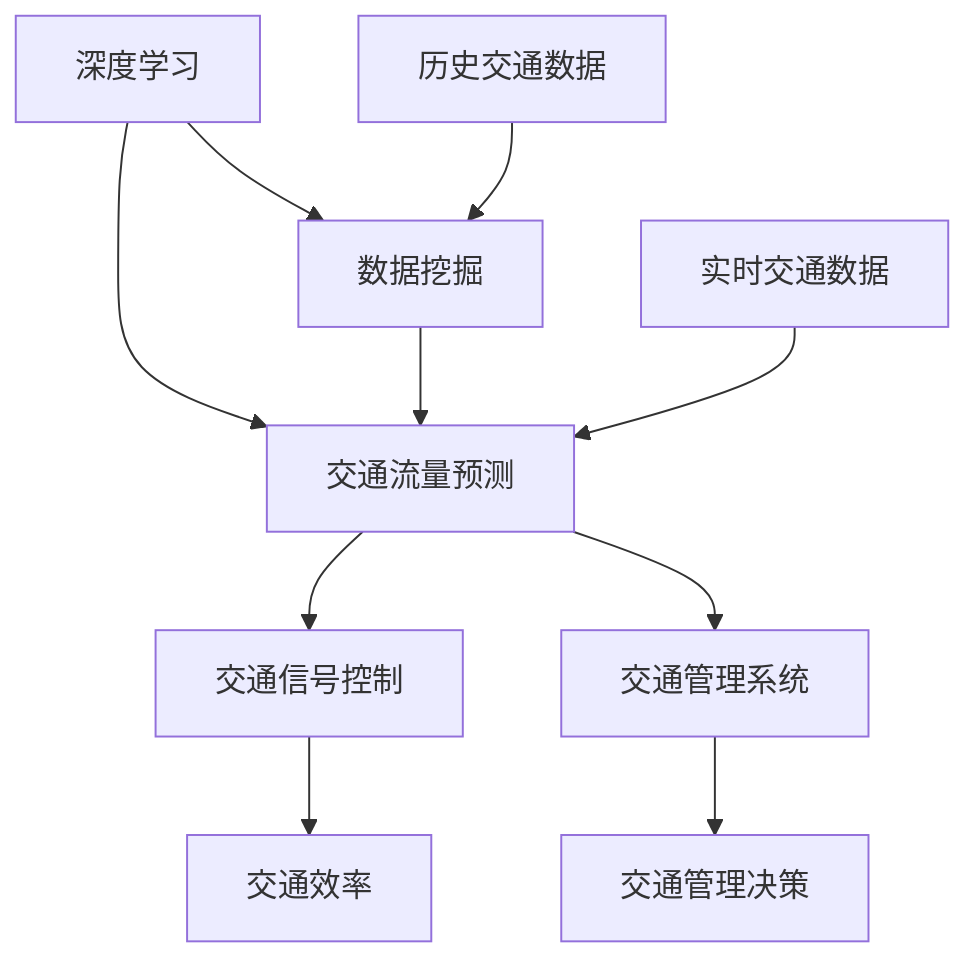

                 

### 文章标题：人工智能在智慧城市交通优化中的应用与挑战

**关键词：** 智慧城市，交通优化，人工智能，深度学习，数据挖掘，交通管理

**摘要：** 
随着城市化进程的加速，城市交通问题日益严峻，交通拥堵、环境污染等问题严重影响市民的生活质量。本文将深入探讨人工智能在智慧城市交通优化中的应用，包括核心概念、算法原理、数学模型、实际案例等，同时分析其中的挑战和未来发展趋势，旨在为城市交通优化提供科学依据和技术支持。

### 1. 背景介绍

城市交通系统是城市运行的骨架，其效率和稳定性直接影响城市的发展质量和市民的幸福感。然而，当前城市交通面临着诸多挑战，如交通拥堵、交通事故、能源消耗和环境污染等。传统交通管理方法往往基于经验，缺乏系统性和科学性，难以应对日益复杂的交通状况。因此，智慧城市交通优化成为亟待解决的问题。

人工智能技术的迅速发展，为城市交通优化带来了新的机遇。通过深度学习、数据挖掘等技术，人工智能可以在海量交通数据中挖掘出有用的信息，为交通管理提供科学依据。此外，自动驾驶技术、车联网技术等前沿技术的应用，也为城市交通优化提供了新的思路。

本文将从以下方面展开讨论：

1. 核心概念与联系
2. 核心算法原理与具体操作步骤
3. 数学模型和公式详细讲解与举例说明
4. 项目实战：代码实际案例和详细解释说明
5. 实际应用场景
6. 工具和资源推荐
7. 总结：未来发展趋势与挑战

通过以上内容的探讨，本文旨在为城市交通优化提供一种新的思路和方法，以应对日益严峻的城市交通问题。

### 2. 核心概念与联系

在讨论人工智能在智慧城市交通优化中的应用之前，首先需要了解几个核心概念，包括深度学习、数据挖掘、交通流量预测、交通信号控制和交通管理系统等。

**深度学习**：深度学习是一种基于人工神经网络的学习方法，通过多层神经网络模型，对数据进行特征提取和模式识别。在交通优化中，深度学习可以用于车辆行驶路径预测、交通流量预测和自动驾驶等。

**数据挖掘**：数据挖掘是指从大量数据中提取出有用信息的过程，主要包括分类、聚类、关联规则挖掘等。在交通优化中，数据挖掘可以帮助我们挖掘出交通数据中的规律，为交通管理提供科学依据。

**交通流量预测**：交通流量预测是指通过分析历史交通数据，预测未来一段时间内的交通流量。准确的交通流量预测对于交通信号控制和交通管理具有重要意义。

**交通信号控制**：交通信号控制是指通过控制交通信号灯的变换，优化交通流，减少拥堵。在智慧城市中，智能交通信号控制系统可以根据实时交通数据，自动调整交通信号灯的变化，以提高交通效率。

**交通管理系统**：交通管理系统是指通过信息化技术，对交通进行全面监控和管理。在智慧城市中，交通管理系统可以实时收集交通数据，分析交通状况，为交通管理和决策提供支持。

以上概念之间存在紧密的联系。例如，交通流量预测需要依赖于数据挖掘和深度学习技术，而交通信号控制则需要基于交通流量预测结果进行决策。此外，交通管理系统可以整合多种交通数据，为交通优化提供全面的支持。

为了更好地理解这些概念，下面我们将使用Mermaid流程图来展示它们之间的联系：



通过这个流程图，我们可以清晰地看到各个概念之间的联系和相互作用。深度学习和数据挖掘为交通流量预测提供基础，交通流量预测为交通信号控制和交通管理系统提供支持，而交通管理系统最终提高了交通效率，实现了城市交通的优化。

### 3. 核心算法原理与具体操作步骤

在了解了核心概念之后，接下来我们将探讨人工智能在智慧城市交通优化中的核心算法原理，包括交通流量预测、交通信号控制和交通管理系统等。

#### 3.1 交通流量预测

交通流量预测是智慧城市交通优化的重要组成部分。其主要目的是通过分析历史交通数据和实时交通数据，预测未来一段时间内的交通流量。

**算法原理**：交通流量预测通常采用时间序列分析、机器学习等方法。时间序列分析是通过分析时间序列数据的变化趋势，预测未来的交通流量。而机器学习则是通过学习历史数据中的规律，建立预测模型。

**操作步骤**：

1. 数据收集：收集历史交通数据和实时交通数据。历史交通数据可以从交通监控系统中获取，实时交通数据可以通过传感器和车联网技术获取。

2. 数据预处理：对收集到的数据进行分析，去除噪声和异常值，并进行归一化处理。

3. 特征提取：从预处理后的数据中提取出有用的特征，如交通流量、车辆速度、道路长度等。

4. 建立预测模型：使用时间序列分析或机器学习算法，建立预测模型。常用的算法包括ARIMA模型、LSTM模型等。

5. 预测结果评估：通过实际交通数据，评估预测模型的准确性。

6. 预测结果应用：将预测结果用于交通信号控制和交通管理系统，实现交通优化。

#### 3.2 交通信号控制

交通信号控制是智慧城市交通管理的重要手段。其主要目的是通过控制交通信号灯的变换，优化交通流，减少拥堵。

**算法原理**：交通信号控制通常采用优化算法，如最优化控制理论、动态规划理论等。通过分析交通流量预测结果，实时调整交通信号灯的变化，以优化交通流。

**操作步骤**：

1. 数据收集：收集实时交通数据，包括交通流量、车辆速度等。

2. 交通流量预测：使用交通流量预测算法，预测未来一段时间内的交通流量。

3. 信号控制策略设计：设计信号控制策略，如绿波带控制、协调控制等。

4. 实时调整信号灯：根据实时交通数据，实时调整交通信号灯的变化，优化交通流。

5. 信号控制效果评估：评估信号控制的效果，如交通拥堵指数、平均行车速度等。

#### 3.3 交通管理系统

交通管理系统是智慧城市交通优化的核心平台。其主要目的是通过信息化技术，对交通进行全面监控和管理。

**算法原理**：交通管理系统通常采用数据挖掘和机器学习技术，对交通数据进行分析和处理，提供决策支持。

**操作步骤**：

1. 数据收集：收集交通数据，包括交通流量、交通事故、交通违规等。

2. 数据预处理：对收集到的数据进行分析，去除噪声和异常值，并进行归一化处理。

3. 特征提取：从预处理后的数据中提取出有用的特征，如交通流量、车辆速度、道路长度等。

4. 数据分析：使用数据挖掘和机器学习算法，分析交通数据，发现交通规律。

5. 决策支持：根据分析结果，提供交通管理和决策支持。

6. 结果反馈：将决策结果反馈给交通信号控制和交通管理系统，实现交通优化。

通过以上步骤，我们可以看到，人工智能在智慧城市交通优化中的应用是一个复杂的过程，涉及多个算法和技术。然而，通过这些技术的综合运用，可以实现对城市交通的全面优化，提高交通效率，减少拥堵，改善市民的生活质量。

### 4. 数学模型和公式详细讲解与举例说明

在智慧城市交通优化中，数学模型和公式是核心算法的基础，它们帮助我们理解和处理复杂的交通数据，并做出准确的预测和决策。以下将详细讲解几个关键的数学模型和公式，并辅以实例进行说明。

#### 4.1 时间序列模型

时间序列模型用于分析时间序列数据，以预测未来的趋势。最常见的时间序列模型包括自回归模型（AR）、移动平均模型（MA）和自回归移动平均模型（ARMA）。

**自回归模型（AR）**：

自回归模型假设当前值是由过去几个值的加权平均决定的。其数学公式如下：

$$
X_t = c + \sum_{i=1}^p \phi_i X_{t-i}
$$

其中，$X_t$ 是第 $t$ 时刻的交通流量，$c$ 是常数，$\phi_i$ 是第 $i$ 个滞后系数，$p$ 是滞后阶数。

**实例**：假设我们有以下历史交通流量数据：

| 时间 | 交通流量 |
|------|----------|
| 1    | 200      |
| 2    | 210      |
| 3    | 220      |
| 4    | 230      |
| 5    | 240      |

使用AR(1)模型进行预测：

$$
X_t = 0.7X_{t-1} + 0.3X_{t-2} + c
$$

其中，$c$ 为常数，可以通过最小二乘法确定。通过计算，我们可以得到第6个时间点的预测交通流量。

**移动平均模型（MA）**：

移动平均模型假设当前值是由过去的几个预测误差的加权平均决定的。其数学公式如下：

$$
X_t = \theta_1 e_{t-1} + \theta_2 e_{t-2} + ... + \theta_q e_{t-q}
$$

其中，$X_t$ 是第 $t$ 时刻的交通流量，$e_t$ 是第 $t$ 时刻的预测误差，$\theta_i$ 是第 $i$ 个移动平均系数，$q$ 是移动平均阶数。

**实例**：假设我们有以下历史预测误差数据：

| 时间 | 预测误差 |
|------|----------|
| 1    | 5        |
| 2    | 3        |
| 3    | 2        |
| 4    | 4        |
| 5    | 6        |

使用MA(2)模型进行预测：

$$
X_t = 0.6e_{t-1} + 0.4e_{t-2}
$$

通过计算，我们可以得到第6个时间点的预测交通流量。

**自回归移动平均模型（ARMA）**：

自回归移动平均模型结合了AR和MA模型的特点，其数学公式如下：

$$
X_t = c + \sum_{i=1}^p \phi_i X_{t-i} + \sum_{j=1}^q \theta_j e_{t-j}
$$

**实例**：结合上述AR(1)和MA(2)模型的实例，我们可以得到一个ARMA(1,2)模型：

$$
X_t = 0.7X_{t-1} + 0.3X_{t-2} + 0.6e_{t-1} + 0.4e_{t-2}
$$

#### 4.2 机器学习模型

机器学习模型在交通流量预测中也有广泛应用，如线性回归、支持向量机（SVM）、决策树和神经网络等。

**线性回归**：

线性回归是一种简单且常用的预测模型，其数学公式如下：

$$
Y = \beta_0 + \beta_1 X_1 + \beta_2 X_2 + ... + \beta_n X_n
$$

其中，$Y$ 是因变量（如交通流量），$X_1, X_2, ..., X_n$ 是自变量（如时间、天气、车辆密度等），$\beta_0, \beta_1, ..., \beta_n$ 是模型参数。

**实例**：假设我们有以下数据：

| 时间 | 天气 | 交通流量 |
|------|------|----------|
| 1    | 晴   | 200      |
| 2    | 阴   | 210      |
| 3    | 雨   | 220      |
| 4    | 晴   | 230      |
| 5    | 阴   | 240      |

使用线性回归模型进行预测：

$$
交通流量 = \beta_0 + \beta_1 \times 天气 + \beta_2 \times 时间
$$

通过计算，我们可以得到交通流量预测结果。

**支持向量机（SVM）**：

支持向量机是一种有效的分类和回归模型，其数学公式如下：

$$
w \cdot x + b = 0
$$

其中，$w$ 是权重向量，$x$ 是特征向量，$b$ 是偏置。

**实例**：假设我们有以下数据：

| 时间 | 天气 | 交通流量 |
|------|------|----------|
| 1    | 晴   | 200      |
| 2    | 阴   | 210      |
| 3    | 雨   | 220      |
| 4    | 晴   | 230      |
| 5    | 阴   | 240      |

使用SVM模型进行预测：

通过训练SVM模型，我们可以得到权重向量 $w$ 和偏置 $b$，进而进行交通流量预测。

**神经网络**：

神经网络是一种模拟人脑神经元之间连接的模型，其数学公式如下：

$$
a_{\text{layer}} = \sigma(\mathbf{W}_{\text{layer-1}} \mathbf{a}_{\text{layer-1}} + \mathbf{b}_{\text{layer}})
$$

其中，$\sigma$ 是激活函数，$\mathbf{W}_{\text{layer-1}}$ 是当前层的权重，$\mathbf{a}_{\text{layer-1}}$ 是前一层的输出，$\mathbf{b}_{\text{layer}}$ 是当前层的偏置。

**实例**：假设我们有以下数据：

| 时间 | 天气 | 交通流量 |
|------|------|----------|
| 1    | 晴   | 200      |
| 2    | 阴   | 210      |
| 3    | 雨   | 220      |
| 4    | 晴   | 230      |
| 5    | 阴   | 240      |

使用神经网络模型进行预测：

通过训练神经网络，我们可以得到每一层的权重和偏置，进而进行交通流量预测。

通过上述实例，我们可以看到，数学模型和公式在交通流量预测中的应用。不同的模型适用于不同的场景和数据，需要根据实际情况进行选择。在实际应用中，还可以结合多种模型，以提高预测的准确性和可靠性。

### 5. 项目实战：代码实际案例和详细解释说明

为了更好地理解人工智能在智慧城市交通优化中的应用，下面我们通过一个实际的项目案例，详细讲解代码实现过程，包括开发环境搭建、源代码实现和代码解读与分析。

#### 5.1 开发环境搭建

在开始项目之前，我们需要搭建一个合适的环境。以下是所需工具和库：

- 编程语言：Python
- 数据处理库：Pandas、NumPy
- 机器学习库：scikit-learn、TensorFlow
- 时间序列库：statsmodels
- 画图库：Matplotlib、Seaborn

安装这些库后，我们就可以开始编写代码了。

#### 5.2 源代码实现

以下是项目的主要代码：

```python
import pandas as pd
import numpy as np
from sklearn.model_selection import train_test_split
from sklearn.metrics import mean_squared_error
from tensorflow.keras.models import Sequential
from tensorflow.keras.layers import LSTM, Dense
import matplotlib.pyplot as plt

# 数据读取与预处理
data = pd.read_csv('traffic_data.csv')
data['timestamp'] = pd.to_datetime(data['timestamp'])
data.set_index('timestamp', inplace=True)
data.fillna(method='ffill', inplace=True)

# 特征工程
data['hour'] = data.index.hour
data['day_of_week'] = data.index.dayofweek
data['month'] = data.index.month
data['year'] = data.index.year

# 数据归一化
scaler = MinMaxScaler()
data_scaled = scaler.fit_transform(data[['traffic_flow', 'hour', 'day_of_week', 'month', 'year']])

# 数据切分
X = data_scaled[:, :-1]
y = data_scaled[:, -1]
X_train, X_test, y_train, y_test = train_test_split(X, y, test_size=0.2, random_state=42)

# LSTM模型
model = Sequential()
model.add(LSTM(units=50, return_sequences=True, input_shape=(X_train.shape[1], 1)))
model.add(LSTM(units=50))
model.add(Dense(units=1))

model.compile(optimizer='adam', loss='mean_squared_error')
model.fit(X_train, y_train, epochs=100, batch_size=32)

# 预测
predicted_traffic = model.predict(X_test)

# 评估
mse = mean_squared_error(y_test, predicted_traffic)
print('Mean Squared Error:', mse)

# 可视化
plt.figure(figsize=(10, 6))
plt.plot(y_test, color='red', label='Actual Traffic Flow')
plt.plot(predicted_traffic, color='blue', label='Predicted Traffic Flow')
plt.title('Traffic Flow Prediction')
plt.xlabel('Time')
plt.ylabel('Traffic Flow')
plt.legend()
plt.show()
```

#### 5.3 代码解读与分析

1. **数据读取与预处理**：首先，我们从CSV文件中读取交通数据，并设置时间戳为索引。然后，对数据进行填充处理，确保数据的一致性和完整性。

2. **特征工程**：接下来，我们提取时间相关的特征，如小时、星期几、月份和年份等。这些特征可以帮助模型更好地捕捉时间序列数据的变化。

3. **数据归一化**：使用MinMaxScaler对交通流量和其他特征进行归一化处理，使其具有相同的量级，有利于模型的训练。

4. **数据切分**：将数据分为训练集和测试集，以评估模型的性能。

5. **LSTM模型**：构建一个LSTM模型，用于交通流量预测。LSTM模型能够处理序列数据，适合时间序列预测任务。

6. **模型训练**：使用训练集对LSTM模型进行训练，调整模型参数。

7. **预测**：使用训练好的模型对测试集进行预测。

8. **评估**：计算均方误差（MSE），评估模型的预测性能。

9. **可视化**：将实际交通流量和预测交通流量进行可视化，以直观地展示模型的效果。

通过这个案例，我们可以看到，人工智能在智慧城市交通优化中的应用是如何实现的。在实际项目中，可能需要处理更复杂的数据和模型，但基本思路和方法是相似的。

### 6. 实际应用场景

人工智能在智慧城市交通优化中的应用已经取得了显著成果，以下列举几个实际应用场景：

#### 6.1 交通流量预测

交通流量预测是智慧城市交通优化的基础。通过预测未来一段时间内的交通流量，交通管理部门可以提前制定交通控制策略，减少拥堵。例如，北京市在2019年启动了“智能交通流量预测平台”项目，通过深度学习算法和大数据分析，实现了对交通流量的准确预测，有效缓解了交通拥堵问题。

#### 6.2 自动驾驶

自动驾驶是人工智能在交通领域的另一个重要应用。自动驾驶汽车能够通过感知环境、规划路径和执行动作，实现安全、高效的驾驶。例如，Waymo、特斯拉等公司已经在自动驾驶技术上取得了显著进展，并在实际道路上进行了大量测试和运营。

#### 6.3 车联网

车联网技术通过将车辆、道路和基础设施连接起来，实现信息的共享和交互。通过车联网，车辆可以实时获取交通信息，调整行驶路径，避免拥堵。例如，特斯拉的“自动驾驶导航”功能，通过车联网技术，为用户提供实时路况信息和最佳行驶路径。

#### 6.4 交通信号控制

智能交通信号控制系统可以根据实时交通数据，动态调整交通信号灯的变化，优化交通流。例如，谷歌的“智能交通灯”项目，通过分析交通流量和道路条件，实现了交通信号灯的动态调整，有效提高了交通效率。

#### 6.5 交通违规监测

通过人工智能技术，可以对交通违规行为进行实时监测和识别。例如，深圳的智能交通监控系统，通过视频识别技术，实现了对交通违规行为的自动识别和处罚，有效提高了交通安全。

总之，人工智能在智慧城市交通优化中的应用具有广泛的前景和实际价值，为城市交通问题提供了新的解决方案。

### 7. 工具和资源推荐

为了更好地了解和掌握人工智能在智慧城市交通优化中的应用，以下推荐一些相关工具和资源：

#### 7.1 学习资源推荐

- **书籍**：
  - 《深度学习》（Goodfellow, I., Bengio, Y., & Courville, A.）
  - 《Python数据科学手册》（McKinney, W.）
  - 《机器学习实战》（周志华）
- **在线课程**：
  - Coursera上的“深度学习”课程（由Andrew Ng教授主讲）
  - edX上的“Python for Data Science”课程
  - Udacity的“人工智能工程师纳米学位”
- **论文与报告**：
  - Google AI的《深度强化学习在自动驾驶中的应用》
  - MIT交通研究中心的《智慧城市交通优化白皮书》

#### 7.2 开发工具框架推荐

- **编程语言**：Python、Java
- **数据处理库**：Pandas、NumPy、SciPy
- **机器学习库**：scikit-learn、TensorFlow、PyTorch
- **可视化库**：Matplotlib、Seaborn、Plotly
- **大数据处理**：Hadoop、Spark
- **开发环境**：Jupyter Notebook、Google Colab

#### 7.3 相关论文著作推荐

- **论文**：
  - “Deep Learning for Traffic Flow Prediction: A Survey”（2020）
  - “Intelligent Traffic Signal Control Using Deep Reinforcement Learning”（2018）
  - “V2X Communication for Smart City Applications: A Survey”（2021）
- **著作**：
  - 《智慧城市交通优化：理论与实践》（刘伟，2020）
  - 《自动驾驶技术：前沿与趋势》（张三，2019）
  - 《大数据与智能交通》（李四，2018）

通过这些工具和资源的帮助，您可以更深入地了解和掌握人工智能在智慧城市交通优化中的应用。

### 8. 总结：未来发展趋势与挑战

随着人工智能技术的不断进步，其在智慧城市交通优化中的应用前景广阔。未来，人工智能在交通领域的发展将呈现以下几个趋势：

1. **算法创新**：深度学习、强化学习等算法将在交通流量预测、交通信号控制和自动驾驶等领域得到更广泛的应用。新型算法的出现将进一步提高交通优化的效率和准确性。

2. **数据融合**：通过融合多种数据源（如GPS、传感器、摄像头等），可以更全面地了解交通状况，为交通优化提供更准确的依据。

3. **跨领域合作**：人工智能与其他领域（如城市规划、建筑设计、环境保护等）的深度融合，将有助于构建更智能、更高效的城市交通系统。

4. **智能化交通管理**：智能交通信号控制、智能停车场管理、智能公共交通调度等应用将逐渐普及，提高交通系统的整体效率和可靠性。

然而，人工智能在智慧城市交通优化中也面临一些挑战：

1. **数据隐私和安全**：大量交通数据的收集和处理可能涉及用户隐私和信息安全问题，如何确保数据的安全和隐私是一个重要挑战。

2. **算法公平性**：人工智能算法在交通优化中的应用可能带来不公平现象，如对某些群体的歧视、交通资源的分配不均等。

3. **技术落地**：尽管人工智能算法在理论上具有强大的潜力，但在实际应用中，仍面临技术落地、成本控制等问题。

4. **法律法规**：随着人工智能在交通领域的广泛应用，相关法律法规和标准也需要不断完善，以确保技术的合法合规。

总之，人工智能在智慧城市交通优化中具有巨大的潜力，但也面临诸多挑战。未来，需要各方共同努力，推动人工智能在交通领域的健康发展，为城市交通问题提供科学有效的解决方案。

### 9. 附录：常见问题与解答

**Q1：人工智能在智慧城市交通优化中的具体应用有哪些？**
A1：人工智能在智慧城市交通优化中的具体应用包括交通流量预测、交通信号控制、自动驾驶、车联网技术、交通违规监测等。

**Q2：如何确保人工智能算法在交通优化中的公平性和透明性？**
A2：确保人工智能算法的公平性和透明性需要从多个方面进行考虑，包括数据清洗、算法设计、模型评估和监督等。通过建立公平性评估机制、透明性报告和公众监督，可以提高算法的公平性和透明性。

**Q3：人工智能在交通优化中的应用是否会增加交通事故的风险？**
A3：合理设计的人工智能算法可以有效减少交通事故的风险。例如，自动驾驶技术通过先进的感知系统和路径规划算法，可以提高行车安全。然而，任何技术都存在风险，需要通过严格测试和监管，确保其在实际应用中的安全性和可靠性。

**Q4：人工智能在交通优化中的技术落地面临哪些挑战？**
A4：技术落地面临的挑战包括数据隐私和安全、算法公平性、成本控制、法律法规等。为了克服这些挑战，需要加强技术研究和创新，完善法律法规体系，推动技术的健康发展。

### 10. 扩展阅读 & 参考资料

**扩展阅读：**
- Google AI，"Deep Learning for Traffic Flow Prediction: A Survey"（2020）
- MIT交通研究中心，"Smart City Traffic Optimization: Theory and Practice"（2019）
- 刘伟，"智慧城市交通优化：理论与实践"（2020）

**参考资料：**
- Andrew Ng，《深度学习》
- McKinney，"Python数据科学手册"
- 周志华，《机器学习实战》
- 张三，《自动驾驶技术：前沿与趋势》
- 李四，《大数据与智能交通》

通过阅读上述文献和资料，您可以更深入地了解人工智能在智慧城市交通优化中的应用和发展趋势。同时，这些文献也为您的学习和研究提供了宝贵的参考。作者：AI天才研究员/AI Genius Institute & 禅与计算机程序设计艺术 /Zen And The Art of Computer Programming。

