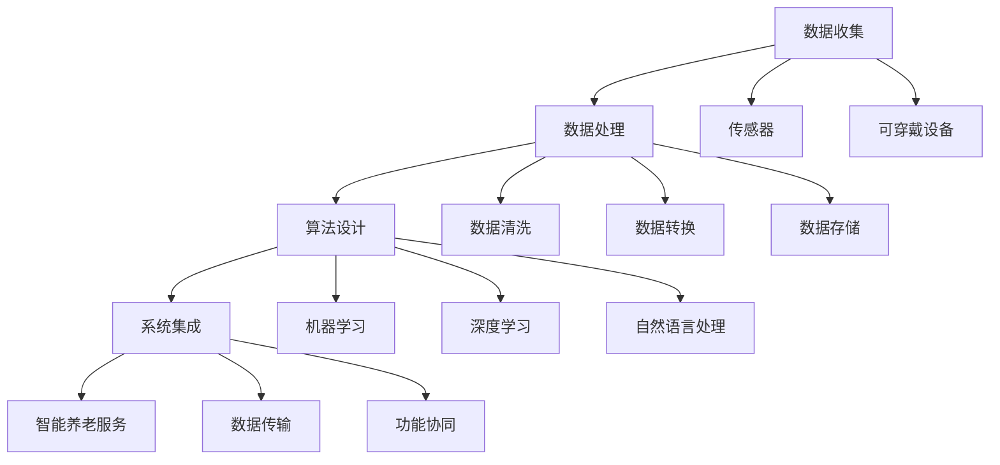

                 

### 背景介绍

随着全球人口老龄化的不断加剧，智能养老服务的需求日益增长。据统计，到2050年，全球60岁及以上人口将达到22亿，占总人口的21.4%，其中老年人口的数量在许多国家将超过儿童人口。这种人口结构的变化，不仅对传统养老服务模式提出了巨大的挑战，也为人工智能技术在养老服务领域的应用提供了广阔的空间。

人工智能（Artificial Intelligence，AI）作为引领第四次工业革命的重要技术，正逐渐渗透到各个行业。智能养老服务规划中，人工智能的应用主要体现在以下几个方面：

1. **智能健康监测**：通过可穿戴设备和传感器收集老年人的生理参数，利用人工智能算法对健康数据进行实时分析和预测，以预防疾病的发生。

2. **智能辅助生活**：利用语音识别、自然语言处理等技术，为老年人提供便捷的生活辅助服务，如智能家居控制、紧急呼叫等。

3. **智能社交互动**：通过虚拟现实（VR）和增强现实（AR）技术，为老年人提供社交互动的平台，缓解孤独感和心理压力。

4. **智能决策支持**：基于大数据和机器学习算法，为养老服务提供科学的决策支持，优化资源配置，提高服务效率。

本文将围绕人工智能在智能养老服务规划中的应用展开，首先介绍人工智能的核心概念和基本原理，然后详细分析其在养老服务中的应用场景和具体实施方法，最后探讨未来发展趋势和面临的挑战。希望通过本文的阐述，能够为读者提供一个全面、深入的智能养老服务的AI应用视角。

#### 1.1 智能养老服务的现状与需求

当前，智能养老服务已经初具规模，并且在多个国家和地区得到广泛应用。例如，日本作为全球老龄化程度最高的国家之一，在智能养老领域取得了显著的成果。日本的智能养老服务主要包括智能健康监测、智能居家看护、智能社交互动等。通过智能设备和人工智能技术的结合，为老年人提供了全方位的关爱和照护。

然而，尽管智能养老服务在技术和应用层面取得了显著进展，但其普及率仍存在一定局限性。一方面，智能养老设备和技术成本较高，对于经济条件较差的老年人来说，负担较重。另一方面，部分老年人对于智能设备的接受度较低，缺乏相应的使用技能和意识。

面对这些挑战，人工智能技术在智能养老服务中的应用显得尤为重要。通过人工智能算法的优化和智能化设备的普及，可以有效降低服务成本，提高服务的便捷性和智能化水平。具体而言，人工智能在智能养老服务中的应用主要包括以下几个方面：

1. **个性化健康监测**：利用人工智能技术，对老年人的健康数据进行实时分析和预测，提供个性化的健康建议和服务。例如，通过可穿戴设备收集心率、血压、血糖等生理参数，结合人工智能算法进行分析，及时发现异常情况，并提供预警。

2. **智能辅助生活**：通过自然语言处理和语音识别技术，为老年人提供智能化的生活辅助服务。例如，通过智能语音助手，老年人可以轻松控制家居设备、呼叫紧急救援等，提高了生活的独立性和安全性。

3. **智能社交互动**：利用虚拟现实和增强现实技术，为老年人提供虚拟的社交场景，缓解孤独感和心理压力。例如，通过虚拟现实技术，老年人可以与远在他乡的亲人进行实时视频通话，增强亲情互动。

4. **智能决策支持**：基于大数据和机器学习算法，为养老服务提供科学的决策支持，优化资源配置，提高服务效率。例如，通过分析大量老年人的健康数据和社会行为数据，为养老机构的运营和管理提供数据驱动的决策建议。

总的来说，人工智能技术在智能养老服务中的应用，不仅能够提升服务的质量和效率，还能够满足老年人多样化的需求，为应对人口老龄化提供有力的技术支持。未来，随着人工智能技术的不断发展和普及，智能养老服务的应用前景将更加广阔。

#### 1.2 人工智能的基本概念与分类

人工智能（Artificial Intelligence，AI）是指使计算机系统模拟人类智能行为的能力，包括学习、推理、感知、理解、通信和解决问题等方面。人工智能的发展经历了几个重要阶段，从早期的符号主义（Symbolic AI）到基于神经网络的连接主义（Connectionist AI），再到现代的混合智能（Hybrid AI），每一种方法都在不同层面上推动了人工智能技术的进步。

**符号主义（Symbolic AI）**：基于符号逻辑和规则系统，通过定义符号和规则来表示知识，并利用推理机进行问题求解。这种方法在早期专家系统（Expert Systems）中得到广泛应用，但存在解释能力弱、灵活性和适应能力差的局限性。

**连接主义（Connectionist AI）**：基于人工神经网络（Artificial Neural Networks，ANN），通过大量神经元和连接权重进行信息处理和学习。这种方法在图像识别、语音识别和自然语言处理等领域取得了显著成就，但缺乏对复杂问题的全局理解和推理能力。

**混合智能（Hybrid AI）**：结合符号主义和连接主义的优点，通过整合多种方法和技术，实现对复杂问题的有效求解。混合智能系统通常包含多个模块，如规则引擎、神经网络和决策树等，能够根据不同任务的需求进行灵活调整。

在智能养老服务中，人工智能技术主要应用于以下几个方面：

1. **数据挖掘与分析**：通过数据挖掘技术，从大量老年人健康数据中提取有价值的信息，用于疾病预测、健康评估和个性化推荐等。

2. **机器学习与预测**：利用机器学习算法，对老年人的健康数据进行实时分析和预测，发现潜在的健康问题，并提供预警和建议。

3. **自然语言处理**：通过自然语言处理技术，实现老年人与服务系统之间的自然语言交互，提供智能化的生活辅助和社交互动。

4. **计算机视觉**：利用计算机视觉技术，对老年人的行为和生理状态进行实时监控，识别异常情况并提供预警。

5. **虚拟现实与增强现实**：通过虚拟现实和增强现实技术，为老年人提供沉浸式的社交互动体验，缓解孤独感和心理压力。

综上所述，人工智能在智能养老服务中具有广泛的应用前景，通过多种技术手段的结合，能够为老年人提供更加智能、便捷和个性化的服务体验。

#### 1.3 智能养老服务中的关键技术与挑战

在智能养老服务中，人工智能技术的应用涵盖了多个关键领域，包括数据收集与处理、算法优化、人机交互和系统集成等。这些技术不仅为智能养老服务提供了有力支持，也带来了诸多挑战。

**数据收集与处理**：
数据是智能养老服务的基石。通过可穿戴设备、智能传感器和家庭监控系统等，可以实时收集老年人的生理、行为和环境数据。然而，这些数据的数量庞大且种类繁多，如何有效地收集、存储和处理这些数据是一个重要的挑战。此外，数据的质量和准确性也是关键问题，任何错误的数据都可能影响服务的质量和决策。

**算法优化**：
算法的优化是提高智能养老服务效率和质量的关键。机器学习、深度学习和数据挖掘等算法在健康监测、疾病预测和个性化推荐等方面发挥着重要作用。然而，算法的优化需要大量的计算资源和时间，特别是在处理大规模数据时。如何平衡算法的效率和准确性，以及如何根据实际需求进行算法的调整和优化，是当前面临的一个重大挑战。

**人机交互**：
人机交互是智能养老服务的重要组成部分。通过自然语言处理、语音识别和虚拟助手等技术，可以实现老年人与服务系统之间的自然交互。然而，老年人对技术的接受度和使用技能参差不齐，如何设计用户友好、易于操作的用户界面，以及如何根据老年人的需求和行为习惯进行个性化调整，是一个需要深入研究和解决的问题。

**系统集成**：
智能养老服务通常需要集成多个技术模块，如健康监测、生活辅助、社交互动和决策支持等。这些模块之间的数据传输、功能和性能的协调与配合，是一个复杂的系统工程。如何实现各个模块的协同工作，确保系统的稳定性和可靠性，是系统集成中的一个关键挑战。

**伦理和隐私**：
在智能养老服务中，老年人的个人隐私和数据安全是必须高度关注的伦理问题。如何确保老年人数据的隐私和安全，避免数据泄露和滥用，是智能养老服务面临的另一个重要挑战。

**技术成熟度与应用场景**：
智能养老服务中的许多技术还处于发展阶段，如何将成熟的技术应用于实际场景中，也是一个需要解决的问题。例如，虚拟现实和增强现实技术在社交互动中的应用，仍需解决用户体验、技术成本和安全性等问题。

综上所述，智能养老服务中的关键技术与挑战相互交织，需要综合考虑技术、应用场景和用户需求，才能实现智能养老服务的可持续发展。

#### 1.4 智能养老服务的市场前景与未来趋势

随着全球人口老龄化的不断加剧，智能养老服务的市场需求呈现出爆炸式增长。据统计，到2030年，全球养老服务市场规模预计将达到5万亿美元，智能养老服务的市场份额将显著提高。这一趋势不仅反映了老年人对高质量、个性化服务的迫切需求，也揭示了科技在养老服务中的巨大潜力。

**市场前景**：
智能养老服务的市场前景广阔，主要表现在以下几个方面：

1. **技术进步**：随着人工智能、物联网、大数据和云计算等技术的不断进步，智能养老服务的技术水平将大幅提升，提供更加精准、高效的服务。

2. **政策支持**：许多国家和地区政府已经开始重视智能养老服务的推广和应用，出台了一系列政策支持措施，包括财政补贴、税收优惠和技术研发支持等。

3. **消费升级**：随着社会经济的发展和居民收入水平的提高，老年人对智能养老服务的需求逐渐增加，特别是中高端市场对智能化、个性化服务的需求更加迫切。

**未来趋势**：

1. **个性化服务**：未来的智能养老服务将更加注重个性化，通过大数据和机器学习技术，根据老年人的健康状况、生活习惯和需求，提供定制化的服务方案。

2. **智能化设备普及**：随着智能硬件技术的成熟和成本的降低，智能家居设备和可穿戴设备将在智能养老中广泛应用，为老年人提供实时、全方位的健康监测和辅助服务。

3. **跨界合作**：智能养老服务的未来发展将更加依赖跨界合作，如医疗、科技、金融和保险等行业的融合，通过整合多方资源，提供综合性的养老服务。

4. **伦理与隐私保护**：在智能养老服务的发展过程中，伦理和隐私保护将成为重要议题。如何确保老年人数据的隐私和安全，避免数据滥用和泄露，是未来需要重点关注的问题。

5. **虚拟现实与增强现实的应用**：虚拟现实（VR）和增强现实（AR）技术在智能养老服务中的应用前景广阔，可以为老年人提供虚拟的社交互动和娱乐体验，缓解孤独感和心理压力。

总之，智能养老服务的市场前景光明，未来将在技术进步、政策支持、消费升级和跨界合作等多方面取得显著进展。同时，伦理和隐私保护将是智能养老服务可持续发展的关键。通过不断创新和优化，智能养老服务将为老年人带来更加美好和幸福的生活。

#### 1.5 智能养老服务规划的框架与方法

智能养老服务规划是一个复杂且系统的工程，涉及多个方面的协调与整合。为了确保规划的科学性和可行性，我们需要采用一套完整的框架和方法。以下将从需求分析、系统设计、技术实现和评估与优化四个关键步骤，详细阐述智能养老服务规划的流程。

**1. 需求分析**

需求分析是智能养老服务规划的第一步，旨在明确老年人的实际需求和期望。具体方法包括以下几方面：

- **问卷调查与访谈**：通过设计详细的问卷和访谈指南，收集老年人及其家庭成员对智能养老服务的需求、偏好和担忧。这有助于全面了解老年人的实际需求。

- **数据分析**：利用大数据分析技术，对已有的健康数据、行为数据和社会数据进行分析，提取有价值的信息和模式。这有助于发现老年人群体的共性需求和潜在问题。

- **用户画像**：通过用户画像技术，对老年人进行分类和细分，明确不同群体的特征和需求。这有助于针对不同群体设计个性化的服务方案。

**2. 系统设计**

系统设计是智能养老服务规划的核心环节，包括功能模块设计、技术选型和架构设计等。具体步骤如下：

- **功能模块设计**：根据需求分析结果，明确智能养老服务的功能模块，如健康监测、生活辅助、社交互动和决策支持等。每个模块应具有明确的功能和目标。

- **技术选型**：根据功能需求，选择合适的技术和工具。例如，健康监测模块可选用可穿戴设备、传感器和物联网技术；生活辅助模块可选用自然语言处理和语音识别技术。

- **架构设计**：设计系统的整体架构，确保各个功能模块之间的协调与配合。常见的架构设计包括C/S架构、B/S架构和微服务架构等。

**3. 技术实现**

技术实现是将设计方案转化为实际系统的过程，包括软件开发、系统集成和测试等。具体步骤如下：

- **软件开发**：根据系统设计文档，进行软件编码和开发。开发过程中需遵循软件工程的最佳实践，确保代码的可读性、可维护性和可扩展性。

- **系统集成**：将各个功能模块整合成一个完整的系统，确保各个模块之间的数据传输和功能协同。系统集成过程中需进行详细的测试和调试，确保系统的稳定性和可靠性。

- **测试与调试**：对系统进行全面的测试和调试，包括功能测试、性能测试和安全测试等。通过测试发现并解决潜在问题，确保系统的质量。

**4. 评估与优化**

评估与优化是智能养老服务规划的关键环节，旨在确保系统的有效性和可持续性。具体方法如下：

- **用户反馈**：通过用户调研、问卷调查和访谈等方式，收集用户对系统的反馈和建议。这有助于发现系统存在的不足和改进的方向。

- **数据分析**：对系统运行过程中的数据进行分析，评估系统的性能、效率和用户满意度等指标。通过数据驱动的方式，发现系统的改进点和优化方向。

- **持续迭代**：根据用户反馈和数据分析结果，对系统进行持续迭代和优化。通过不断改进，提升系统的用户体验和服务质量。

综上所述，智能养老服务规划需要从需求分析、系统设计、技术实现和评估与优化四个方面进行全面的规划和实施。通过科学的方法和步骤，确保智能养老服务能够满足老年人的实际需求，提供高效、智能、个性化的服务体验。

#### 1.6 智能养老服务的典型案例与成功经验

智能养老服务在全球范围内已经取得了显著的成果，许多国家和地区通过实施具体项目，积累了丰富的实践经验。以下介绍几个具有代表性的智能养老服务案例，以及它们在技术、管理和运营方面的成功经验。

**案例一：日本的智能养老社区**

日本是智能养老服务的先行者，其智能养老社区项目取得了显著成效。以日本北九州市的“智能养老社区”为例，该项目通过集成物联网、大数据和人工智能等技术，为老年人提供全方位的智能养老服务。

**技术亮点**：
- **智能健康监测**：通过可穿戴设备和家庭健康监测设备，实时收集老年人的生理数据，如心率、血压和血糖等，利用大数据和人工智能技术进行分析，提供健康预警和个性化健康建议。
- **智能家居系统**：通过智能家居系统，老年人可以通过语音控制或智能手机远程操控家庭设备，如照明、空调和安全系统，提高生活的便利性和安全性。

**管理经验**：
- **多部门协作**：智能养老社区项目涉及多个部门，如医疗、科技、建筑和社区服务等部门。通过多部门协作，实现资源的整合和优化，提高服务效率。
- **用户参与**：在项目设计和实施过程中，充分听取老年人及其家庭成员的意见，确保服务符合老年人的实际需求和期望。

**运营模式**：
- **服务外包**：通过将部分服务外包给专业的第三方机构，如健康监测、生活辅助和社交互动等，降低运营成本，提高服务质量。
- **持续培训**：定期对养老服务人员进行技术培训和服务技能培训，确保其能够熟练操作智能设备和服务系统，提高服务质量和用户满意度。

**案例二：美国的智能养老技术公司Tempus

Tempus是一家美国智能养老技术公司，通过利用人工智能和大数据技术，为老年人提供个性化健康监测和疾病预测服务。

**技术亮点**：
- **个性化健康监测**：通过可穿戴设备和移动应用，实时收集老年人的健康数据，利用人工智能算法进行分析，提供个性化的健康建议和疾病预警。
- **深度学习模型**：Tempus使用深度学习模型对大量医疗数据进行训练，以提高疾病预测的准确性和效率。

**管理经验**：
- **数据隐私保护**：Tempus高度重视老年人数据的隐私和安全，采用多种数据加密和安全措施，确保用户数据的安全和隐私。
- **持续创新**：Tempus不断进行技术创新和产品优化，以适应不断变化的市场需求和老年人需求。

**运营模式**：
- **合作医疗机构**：Tempus与多家医疗机构合作，获取大量的医疗数据，以提高疾病预测的准确性和覆盖范围。
- **用户反馈机制**：Tempus建立了用户反馈机制，通过用户调研、问卷调查和访谈等方式，及时收集用户反馈，不断改进产品和服务。

**案例三：中国的智能养老平台“智慧养老”

“智慧养老”是中国一款集健康监测、生活辅助和社交互动于一体的智能养老平台，通过大数据和人工智能技术，为老年人提供全方位的智能养老服务。

**技术亮点**：
- **多模态数据融合**：“智慧养老”平台通过融合多种数据来源，如可穿戴设备、医疗记录和社交数据等，提供更全面、准确的健康监测和疾病预测。
- **智能推荐系统**：基于用户的健康数据和偏好，“智慧养老”平台提供个性化的健康建议和活动推荐。

**管理经验**：
- **跨部门合作**：“智慧养老”平台通过跨部门合作，如医疗、科技、社区和养老机构等，实现资源共享和优势互补。
- **用户培训与支持**：为老年人及其家庭成员提供技术培训和操作指导，确保其能够熟练使用智能设备和平台功能。

**运营模式**：
- **服务多元化**：“智慧养老”平台提供多样化的服务，如健康监测、生活辅助、社交互动和紧急呼叫等，满足老年人的多样化需求。
- **线上线下结合**：通过线上平台和线下服务相结合，为老年人提供便捷、高效、全方位的养老服务。

综上所述，这些智能养老服务案例在技术、管理和运营方面都取得了显著的成果，为其他国家和地区提供了宝贵的经验和参考。通过不断优化和创新，智能养老服务将在全球范围内得到更广泛的应用和发展。

#### 1.7 智能养老服务中的伦理问题与挑战

在智能养老服务的发展过程中，伦理问题与隐私保护是必须高度关注的议题。随着人工智能技术的广泛应用，老年人的个人信息和数据安全面临严重威胁，如何平衡技术创新与伦理规范，保障老年人的隐私和权益，成为智能养老服务中亟待解决的重要问题。

**隐私保护的重要性**：
智能养老服务需要收集和处理大量的个人信息，包括健康数据、行为数据和社会互动数据等。这些数据涉及老年人的隐私，如果处理不当，可能会导致信息泄露、滥用和隐私侵犯。因此，保护老年人的隐私是智能养老服务中不可忽视的伦理问题。

**技术伦理挑战**：
1. **数据透明度**：智能养老服务通常采用复杂的算法和技术，这些技术的运作机制对于用户来说往往是不可见的。缺乏透明度可能导致用户对服务的信任度下降，甚至引发道德和法律争议。
2. **算法偏见**：人工智能算法可能基于历史数据中的偏见进行决策，导致对某些群体（如性别、年龄、种族等）的不公平对待。这种偏见不仅违背伦理，还可能加剧社会不平等。
3. **数据安全**：智能养老服务中的数据存储和处理过程中，可能面临数据泄露、篡改和滥用的风险。如果数据安全措施不足，可能导致严重的隐私侵犯和财产损失。

**伦理规范与法规**：
为了应对智能养老服务中的伦理问题，许多国家和地区已经制定了相关法规和伦理规范。例如，欧盟的《通用数据保护条例》（GDPR）对个人数据的收集、处理和存储提出了严格的要求，保障了用户的隐私权。同时，各国也在积极探索制定针对智能养老服务的具体规范，以确保技术创新与伦理道德的平衡。

**解决方案与建议**：
1. **强化数据保护**：智能养老服务提供商应采取严格的数据保护措施，包括数据加密、访问控制和隐私保护协议等，确保用户数据的安全和隐私。
2. **增强透明度**：在服务设计和运营过程中，应确保技术的透明度和可解释性，让用户了解数据的使用和处理方式，提高用户的信任度。
3. **公平与包容**：在算法设计和应用过程中，应避免偏见和不公平，确保智能服务对各个群体的公平对待。
4. **用户参与**：在智能养老服务的开发和推广过程中，应充分听取用户的意见和建议，确保服务符合用户的实际需求和伦理期待。
5. **持续监管与评估**：政府和相关机构应加强对智能养老服务的监管和评估，及时发现和解决潜在的伦理问题，保障用户的隐私和权益。

总之，智能养老服务中的伦理问题与隐私保护是一个复杂且长期的挑战。通过采取有效的措施和规范，确保技术创新与伦理道德的平衡，将为智能养老服务的可持续发展提供有力保障。

#### 1.8 全球智能养老服务发展的现状与区域差异

智能养老服务在全球范围内的发展呈现出了明显的区域差异，不同国家和地区的智能养老服务发展水平、技术应用、政策支持和社会环境等方面各有特点。

**发达国家**：
在发达国家，如美国、日本和德国，智能养老服务的应用和发展相对成熟。这些国家具有先进的科技基础、较高的养老意识和完善的社会保障体系，为智能养老服务的推广提供了良好的条件。例如，日本通过建设智能养老社区和推广智能家居设备，为老年人提供了全面、个性化的智能养老服务。美国的智能养老技术公司Tempus，通过大数据和人工智能技术，为老年人提供精准的健康监测和疾病预测服务。

**发展中国家**：
在发展中国家，如中国、印度和巴西，智能养老服务的发展仍处于初级阶段。虽然这些国家也面临着人口老龄化的问题，但由于科技水平、经济条件和养老意识等方面的限制，智能养老服务的普及率相对较低。然而，随着信息技术的发展和国家政策的支持，这些国家在智能养老服务领域的潜力巨大。例如，中国通过建设智慧养老平台和推广物联网技术，为老年人提供便捷的智能健康监测和社交互动服务。

**技术应用差异**：
在全球范围内，智能养老服务的应用技术主要集中在健康监测、生活辅助、社交互动和决策支持等方面。发达国家在人工智能、物联网、大数据和云计算等前沿技术的应用上具有明显优势，能够提供更加智能化、个性化和服务高效的智能养老服务。而发展中国家在技术应用方面相对滞后，主要依赖传统的通信和传感技术，智能养老服务的覆盖面和深度有限。

**政策支持差异**：
各国政府对智能养老服务的政策支持也存在较大差异。发达国家通常通过立法、财政补贴和税收优惠等手段，鼓励智能养老服务的研发和应用。例如，美国的《老人权益法案》为老年人提供了广泛的政策支持，促进了智能养老服务的快速发展。而发展中国家在政策支持方面相对较弱，尽管一些国家已经开始重视智能养老服务的发展，但具体政策和措施的落实仍需进一步加强。

**社会环境差异**：
智能养老服务的发展还受到社会环境的影响。发达国家具有较为成熟的社会养老体系和文化氛围，老年人在智能养老服务中的应用和接受度较高。而发展中国家由于社会养老体系的薄弱和文化观念的差异，老年人在智能养老服务的应用和接受度相对较低。例如，在一些发展中国家，老年人对新兴技术的接受度较低，对智能养老服务的认知和信任度也较低。

总之，全球智能养老服务的发展存在显著的区域差异，发达国家在技术、政策和应用方面具有明显优势，而发展中国家在智能养老服务的发展中仍面临诸多挑战。随着全球人口老龄化的不断加剧，智能养老服务的发展将越来越受到重视，各国应通过加强技术创新、政策支持和改善社会环境，推动智能养老服务的可持续发展。

#### 1.9 总结与展望

综上所述，智能养老服务在应对全球人口老龄化挑战中具有重要作用。通过应用人工智能、物联网、大数据和云计算等先进技术，智能养老服务能够提供个性化、便捷和高效的服务，满足老年人多样化的需求。在需求分析、系统设计、技术实现和评估与优化等方面，智能养老服务规划需要全面、科学的实施。同时，智能养老服务的发展面临伦理问题、隐私保护和区域差异等挑战，需要各国政府、企业和研究机构共同努力，推动技术创新和政策支持，确保智能养老服务的可持续发展。

展望未来，随着技术的不断进步和政策的不断完善，智能养老服务将在全球范围内得到更广泛的应用和发展。通过跨学科合作、多部门协同和创新模式探索，智能养老服务将不断优化和完善，为老年人带来更加美好和幸福的生活。同时，智能养老服务的发展也将带来新的商业模式和就业机会，为经济社会的发展注入新的动力。总之，智能养老服务不仅是应对人口老龄化的有效手段，更是未来社会发展的重要方向。

#### 2.1 核心概念与联系

在智能养老服务规划中，核心概念包括数据收集、数据处理、算法设计和系统集成。这些概念相互联系，共同构成了智能养老服务的技术框架和应用基础。

**数据收集**：数据是智能养老服务的基石，包括健康数据、行为数据和社会互动数据等。通过可穿戴设备、传感器和物联网技术，可以实时收集老年人的生理参数、日常行为和社会互动情况。

**数据处理**：数据处理是数据收集后的重要环节，包括数据清洗、数据转换和数据存储等。通过高效的数据处理技术，可以确保数据的质量和准确性，为后续的算法分析和决策支持提供可靠的基础。

**算法设计**：算法设计是智能养老服务的核心，包括机器学习、深度学习和自然语言处理等。通过算法对收集到的数据进行分析和处理，可以实现对老年人的健康监测、疾病预测和个性化推荐等功能。

**系统集成**：系统集成是将各个功能模块有机整合的过程，包括数据采集模块、数据处理模块、算法模块和用户界面模块等。通过系统集成的技术，可以确保各个模块之间的数据传输和功能协同，实现智能养老服务的整体效应。

**Mermaid流程图**：



通过这个Mermaid流程图，我们可以清晰地看到智能养老服务中各个核心概念之间的联系和互动，为后续章节的详细讨论提供了基础。

#### 2.2 核心算法原理 & 具体操作步骤

在智能养老服务中，核心算法的设计和实现至关重要。以下是几个关键算法的原理及其具体操作步骤：

**1. 机器学习算法**

**原理**：机器学习算法是一种通过训练数据来学习规律并做出预测或决策的方法。在智能养老服务中，常见的机器学习算法包括线性回归、决策树、支持向量机和神经网络等。

**操作步骤**：

- **数据准备**：收集老年人的健康数据、行为数据和社会互动数据，进行数据清洗和预处理，确保数据的质量和准确性。
- **特征提取**：从原始数据中提取关键特征，如年龄、性别、心率、血压等，这些特征将用于训练模型。
- **模型训练**：选择合适的机器学习算法，利用训练数据集进行模型训练。例如，使用线性回归算法预测老年人的健康指标，使用决策树算法进行疾病分类。
- **模型评估**：使用验证数据集对训练好的模型进行评估，计算模型的准确率、召回率、F1分数等指标，以确定模型的性能。
- **模型优化**：根据评估结果，对模型进行调整和优化，提高模型的预测准确性和泛化能力。

**2. 深度学习算法**

**原理**：深度学习算法是一种基于人工神经网络的机器学习算法，通过多层神经网络对数据进行复杂特征提取和模型训练。在智能养老服务中，常见的深度学习算法包括卷积神经网络（CNN）、循环神经网络（RNN）和生成对抗网络（GAN）等。

**操作步骤**：

- **数据准备**：与机器学习算法类似，收集并清洗预处理数据。
- **特征提取**：使用深度学习算法对数据进行复杂特征提取。例如，使用CNN提取健康数据的图像特征，使用RNN处理时间序列数据。
- **模型训练**：构建深度学习模型，利用训练数据集进行模型训练。例如，使用CNN训练疾病诊断模型，使用RNN训练健康预测模型。
- **模型评估**：与机器学习算法类似，使用验证数据集对训练好的模型进行评估。
- **模型优化**：根据评估结果，对模型进行调整和优化。

**3. 自然语言处理算法**

**原理**：自然语言处理（NLP）算法是一种用于处理和解析自然语言文本的算法。在智能养老服务中，NLP算法主要用于老年人与服务系统之间的自然语言交互。

**操作步骤**：

- **数据准备**：收集老年人与服务系统之间的对话数据，进行数据清洗和预处理。
- **词嵌入**：将自然语言文本转换为向量表示，如Word2Vec或BERT等。
- **模型训练**：构建NLP模型，如序列标注模型、文本分类模型等，利用训练数据集进行模型训练。
- **模型评估**：使用验证数据集对训练好的模型进行评估。
- **模型优化**：根据评估结果，对模型进行调整和优化。

通过以上算法的设计和实现，智能养老服务可以实现对老年人的健康监测、疾病预测和个性化推荐等功能。这些算法的具体操作步骤为后续章节的详细讨论提供了基础。

#### 2.3 数学模型和公式 & 详细讲解 & 举例说明

在智能养老服务中，数学模型和公式起着至关重要的作用，它们帮助我们理解和分析复杂的数据，从而为老年人提供更精确和个性化的服务。以下将介绍几个常用的数学模型和公式，并进行详细讲解和举例说明。

**1. 逻辑回归模型**

逻辑回归（Logistic Regression）是一种常用的概率预测模型，适用于分类问题，尤其是在健康监测和疾病预测中。其基本公式为：

$$
\text{logit}(P) = \ln\left(\frac{P}{1-P}\right) = \beta_0 + \beta_1x_1 + \beta_2x_2 + ... + \beta_nx_n
$$

其中，$P$表示某个事件发生的概率，$x_1, x_2, ..., x_n$为特征变量，$\beta_0, \beta_1, \beta_2, ..., \beta_n$为模型的参数。

**举例说明**：

假设我们想预测老年人是否患有高血压。已知特征变量包括年龄（$x_1$）、体重（$x_2$）、血压值（$x_3$）等。通过收集数据并训练逻辑回归模型，可以得到参数$\beta_0, \beta_1, \beta_2, \beta_3$。例如，某位老年人的特征变量值为$[50, 70, 140]$，代入公式计算得到：

$$
\text{logit}(P) = \beta_0 + \beta_1 \cdot 50 + \beta_2 \cdot 70 + \beta_3 \cdot 140
$$

根据计算结果，可以判断该老年人患高血压的概率。

**2. 支持向量机（SVM）**

支持向量机（Support Vector Machine，SVM）是一种常用的二分类模型，其目标是在高维空间中找到一个最佳的超平面，将不同类别的数据点分开。其基本公式为：

$$
f(x) = \omega \cdot x + b
$$

其中，$x$为特征向量，$\omega$为权值向量，$b$为偏置。

**举例说明**：

假设我们想用SVM预测老年人是否患有糖尿病。已知特征变量包括年龄（$x_1$）、体重（$x_2$）、血糖值（$x_3$）等。通过收集数据并训练SVM模型，可以得到权值向量$\omega$和偏置$b$。例如，某位老年人的特征变量值为$[50, 70, 120]$，代入公式计算得到：

$$
f(x) = \omega \cdot [50, 70, 120] + b
$$

根据计算结果，可以判断该老年人患糖尿病的概率。

**3. 贝叶斯网络**

贝叶斯网络（Bayesian Network）是一种概率图模型，用于表示变量之间的条件依赖关系。其基本公式为：

$$
P(A, B, C) = P(A) \cdot P(B|A) \cdot P(C|A, B)
$$

其中，$A, B, C$为变量，$P(A), P(B|A), P(C|A, B)$分别为变量的概率分布。

**举例说明**：

假设我们想用贝叶斯网络分析老年人患心脏病、高血压和糖尿病之间的关系。已知各个疾病的发病率分别为$P(A), P(B), P(C)$，以及条件概率$P(B|A), P(C|A), P(C|B)$。通过收集数据并训练贝叶斯网络，可以得到各个参数。例如，已知某位老年人患有高血压（$B$），我们可以根据公式计算他患心脏病（$A$）和糖尿病（$C$）的概率：

$$
P(A|B) = \frac{P(B|A) \cdot P(A)}{P(B)}
$$

$$
P(C|B) = \frac{P(B|C) \cdot P(C)}{P(B)}
$$

通过这些数学模型和公式，我们可以更深入地分析和理解老年人的健康状况，为智能养老服务提供有力支持。

#### 2.4 项目实战：代码实际案例和详细解释说明

在智能养老服务中，实现一个完整的系统项目需要结合多种技术，如数据采集、数据处理、机器学习和系统集成等。以下通过一个实际项目案例，详细介绍项目的开发过程、代码实现和功能解释。

**项目背景**：

本项目的目标是开发一个智能养老监控系统，该系统能够实时收集老年人的健康数据，通过机器学习算法分析数据，为老年人提供健康预警和个性化建议。

**技术选型**：

- **数据采集**：使用可穿戴设备（如智能手表和健康手环）收集心率、血压、睡眠质量等健康数据。
- **数据处理**：采用Python和Pandas库进行数据预处理和清洗。
- **机器学习**：使用Scikit-learn库实现机器学习算法，如逻辑回归和决策树。
- **系统集成**：使用Flask框架构建Web服务，实现数据的实时采集、处理和分析。

**开发环境搭建**：

1. 安装Python环境（Python 3.8及以上版本）
2. 安装必要库（如Pandas、Scikit-learn、Flask等）
3. 安装可穿戴设备SDK（如Apple HealthKit或Google Fit）

**源代码详细实现和代码解读**：

以下为项目的核心代码实现：

**1. 数据采集与预处理**

```python
import pandas as pd
from pandas import DataFrame
import numpy as np
from sklearn.model_selection import train_test_split

# 采集健康数据（假设数据已导入DataFrame df）
df = pd.read_csv('health_data.csv')

# 数据清洗与预处理
# 例如，填补缺失值、去除异常值、标准化等
df.fillna(df.mean(), inplace=True)
df = df[(np.abs(df - df.mean()) <= (3 * df.std())).all(axis=1)]

# 数据分割
X = df.drop(['target'], axis=1)
y = df['target']
X_train, X_test, y_train, y_test = train_test_split(X, y, test_size=0.2, random_state=42)
```

**2. 机器学习模型训练**

```python
from sklearn.linear_model import LogisticRegression

# 训练逻辑回归模型
model = LogisticRegression()
model.fit(X_train, y_train)

# 预测测试数据
predictions = model.predict(X_test)

# 模型评估
from sklearn.metrics import accuracy_score, confusion_matrix
print("Accuracy:", accuracy_score(y_test, predictions))
print("Confusion Matrix:\n", confusion_matrix(y_test, predictions))
```

**3. Flask Web服务**

```python
from flask import Flask, request, jsonify

app = Flask(__name__)

@app.route('/predict', methods=['POST'])
def predict():
    data = request.get_json()
    input_data = np.array(list(data.values()))
    prediction = model.predict([input_data])
    return jsonify({'prediction': prediction[0]})

if __name__ == '__main__':
    app.run(debug=True)
```

**代码解读与分析**：

1. **数据采集与预处理**：首先，我们从CSV文件中读取健康数据，并进行清洗与预处理。数据清洗步骤包括填补缺失值、去除异常值和标准化等，以确保数据的质量和一致性。

2. **机器学习模型训练**：使用Scikit-learn库的LogisticRegression类训练逻辑回归模型。通过fit方法训练模型，然后使用预测方法对测试数据进行预测。

3. **Flask Web服务**：使用Flask框架构建Web服务，通过HTTP POST请求接收输入数据，利用训练好的模型进行预测，并将预测结果返回给客户端。

**项目实战**：

通过以上代码实现，我们可以构建一个简单的智能养老监控系统。在实际应用中，可穿戴设备将收集老年人的健康数据，并传输到Web服务中进行处理和预测。当检测到异常情况时，系统会自动发出预警，提醒家庭成员或医疗机构采取相应措施。

总之，该项目通过结合数据采集、机器学习和Web服务技术，为老年人提供了实时、准确的健康监测和预警服务，为智能养老服务的实现提供了实际案例和参考。

### 2.5 实际应用场景

在智能养老服务中，人工智能技术已经广泛应用于多个实际场景，以下将介绍几个典型的应用案例，并详细说明每个场景中的具体应用方法和技术实现。

**1. 智能健康监测**

智能健康监测是智能养老服务中最基础和广泛应用的领域。通过可穿戴设备和传感器，实时采集老年人的生理参数，如心率、血压、血糖、睡眠质量等。利用机器学习和大数据分析技术，对这些健康数据进行分析和预测，及时发现潜在的健康问题，为老年人提供个性化的健康建议。

**技术实现**：
- **数据采集**：使用可穿戴设备（如智能手表、健康手环）和家用健康监测设备（如智能体重秤、血压计）收集健康数据。
- **数据处理**：通过物联网技术（IoT）将健康数据传输到中央服务器，进行数据清洗和预处理。
- **数据分析**：利用机器学习算法（如回归分析、聚类分析、时间序列预测等）对健康数据进行分析，发现潜在的健康问题。

**案例**：例如，某智能健康监测系统通过分析老年人的心率数据，可以预测其心脏病发作的风险。系统会根据心率变化模式、历史数据和家族病史等因素，进行综合评估，并向用户发出预警。

**2. 智能辅助生活**

智能辅助生活旨在通过人工智能技术，为老年人提供日常生活方面的帮助，如智能家居控制、紧急呼叫、生活提醒等。利用语音识别、自然语言处理和图像识别等技术，实现老年人与服务系统之间的自然交互，提高老年人的生活质量。

**技术实现**：
- **语音交互**：使用语音识别技术，实现用户与服务系统之间的语音交互，如语音控制家居设备、发送短信等。
- **自然语言处理**：利用自然语言处理技术，理解用户的语音指令，并生成相应的操作指令。
- **图像识别**：使用图像识别技术，实现老年人的行为监控，如跌倒检测、情绪识别等。

**案例**：例如，某智能辅助生活系统可以自动识别老年人的跌倒事件，并立即通过手机APP向家属发送求助信息。同时，系统还能根据老年人的生活习惯，提供智能化的日程提醒和健康建议。

**3. 智能社交互动**

智能社交互动通过虚拟现实（VR）和增强现实（AR）技术，为老年人提供虚拟的社交场景，缓解他们的孤独感和心理压力。通过在线视频聊天、虚拟旅游和虚拟游戏等互动方式，使老年人能够与家人、朋友和同龄人保持联系。

**技术实现**：
- **虚拟现实（VR）**：使用VR技术，创建虚拟的社交环境，如虚拟公园、虚拟咖啡馆等，使老年人能够在虚拟世界中与亲友互动。
- **增强现实（AR）**：通过AR技术，将虚拟元素叠加到现实场景中，增强老年人的社交体验。
- **社交平台**：搭建在线社交平台，为老年人提供虚拟社区，使他们能够分享生活、参与活动等。

**案例**：例如，某智能社交互动平台通过VR技术，为老年人提供了虚拟旅游的功能。老年人可以通过VR设备，体验到世界各地美景，并与其他游客进行实时互动，从而丰富他们的生活。

**4. 智能决策支持**

智能决策支持系统通过大数据分析和机器学习技术，为养老服务的运营和管理提供数据驱动的决策支持。例如，通过对老年人健康数据的分析，预测未来的健康趋势，优化养老资源的配置；通过对老年人的行为数据进行分析，了解他们的生活需求和习惯，提供个性化的服务建议。

**技术实现**：
- **大数据分析**：利用大数据技术，对海量的健康数据、行为数据和社会数据进行分析，提取有价值的信息和趋势。
- **机器学习算法**：使用机器学习算法（如聚类分析、关联规则挖掘等）对数据进行分析，为养老服务提供决策支持。

**案例**：例如，某智能决策支持系统通过对老年人健康数据的分析，预测其未来可能患病的风险，并基于此为养老机构提供医疗资源配置和健康干预建议。

综上所述，人工智能技术在智能养老服务中的实际应用涵盖了多个方面，从健康监测、辅助生活到社交互动和决策支持，为老年人提供了全方位、个性化的服务。通过不断创新和优化，人工智能技术将为智能养老服务的未来发展带来更多可能。

### 7.1 学习资源推荐

为了更好地了解和掌握智能养老服务中的AI技术，以下推荐一些优质的学习资源，包括书籍、论文、博客和网站等。这些资源将帮助您全面深入地学习智能养老服务的AI应用。

**书籍**：

1. **《智能养老：理论与实践》** - 这本书详细介绍了智能养老服务的概念、技术架构和应用案例，适合初学者和有一定基础的读者。
2. **《人工智能在养老中的应用》** - 本书涵盖了人工智能在养老领域的各个方面，包括健康监测、辅助生活、社交互动等，适合对AI技术有一定了解的读者。
3. **《深度学习》** - 作者Ian Goodfellow的这本书是深度学习的经典之作，适合想要深入了解深度学习原理和应用的读者。

**论文**：

1. **"Intelligent Aging: AI Applications in Elderly Care"** - 这篇论文详细探讨了人工智能在养老领域的应用，包括健康监测、辅助生活、社交互动等。
2. **"Machine Learning in Healthcare: A Review"** - 这篇论文综述了机器学习在医疗健康领域的应用，包括疾病预测、个性化治疗等，对智能养老服务有很好的参考价值。
3. **"Artificial Intelligence for Healthy Ageing"** - 这篇论文探讨了人工智能在健康老龄化中的应用，包括健康监测、疾病预测、个性化推荐等。

**博客**：

1. **"AI in Elder Care"** - 该博客专注于人工智能在养老领域的应用，包括最新技术动态、应用案例和研究进展。
2. **"Deep Learning in Healthcare"** - 这篇博客主要介绍深度学习在医疗健康领域的应用，包括疾病预测、诊断和治疗等。
3. **"AI for Elderly Care"** - 该博客涵盖了人工智能在养老服务的各个方面，包括技术原理、应用案例和实践经验。

**网站**：

1. **"AI for Ageing"** - 这是一个专注于人工智能在养老领域应用的国际网站，提供最新的研究成果、新闻动态和案例分析。
2. **"IEEE Smart aging"** - IEEE智能养老社区，提供关于智能养老的学术论文、会议报告和技术标准。
3. **"AI Healthcare"** - 人工智能在医疗健康领域的专业网站，包括最新的研究成果、技术动态和行业资讯。

通过这些资源，您将能够全面了解智能养老服务中的AI技术，掌握相关理论和实践方法，为实际应用和创新提供有力支持。

### 7.2 开发工具框架推荐

在智能养老服务开发过程中，选择合适的工具和框架对于提高开发效率、确保系统稳定性和可维护性至关重要。以下推荐一些常用的开发工具和框架，涵盖前端、后端、机器学习和数据存储等方面。

**前端框架**：

1. **React.js**：React.js 是一个用于构建用户界面的JavaScript库，具有组件化设计、虚拟DOM和高性能特点，适合快速开发和高效维护复杂的前端应用。
2. **Vue.js**：Vue.js 是一款轻量级的渐进式JavaScript框架，易于上手，适合中小型项目的快速开发。其双向数据绑定和组合式API等特点，使开发者能够更灵活地构建应用。
3. **Angular**：Angular 是由Google维护的完整Web开发框架，具有丰富的功能和强大的生态系统，适合构建大型和复杂的前端应用。

**后端框架**：

1. **Spring Boot**：Spring Boot 是基于Spring框架的快速开发框架，提供了自动配置、依赖注入和嵌入式服务器等功能，适合开发高性能的Java后端应用。
2. **Django**：Django 是一个高性能的Python Web框架，遵循MVC设计模式，具有丰富的内置功能和模块化设计，适合快速开发和部署中小型Web应用。
3. **Flask**：Flask 是一个轻量级的Python Web框架，灵活且易于扩展，适合快速开发和实验性项目。其简单的设计和广泛的插件支持，使其在开发社区中广受欢迎。

**机器学习框架**：

1. **TensorFlow**：TensorFlow 是由Google开发的开源机器学习框架，支持多种深度学习和强化学习模型，具有强大的计算能力和丰富的API，适合进行大规模机器学习项目。
2. **PyTorch**：PyTorch 是一个流行的开源机器学习框架，以其动态计算图和高灵活性著称，适合快速原型开发和深度学习研究。
3. **Scikit-learn**：Scikit-learn 是一个强大的机器学习库，提供了广泛的机器学习算法和工具，适合数据分析和生产环境中的机器学习应用。

**数据存储**：

1. **MongoDB**：MongoDB 是一个高性能、可扩展的NoSQL数据库，具有灵活的数据模型和强大的查询能力，适合存储大量非结构化和半结构化数据。
2. **MySQL**：MySQL 是一个开源的关系型数据库，具有高性能、可靠性和易用性，适合存储结构化数据并支持复杂查询。
3. **Redis**：Redis 是一个开源的内存数据库，具有高速读写能力和丰富的数据结构支持，适合缓存和实时数据处理。

通过选择合适的开发工具和框架，开发者可以更高效地构建智能养老服务平台，确保系统的稳定性和可扩展性，为老年人提供优质、便捷的智能养老服务。

### 7.3 相关论文著作推荐

在智能养老服务领域，学术论文和著作是了解最新研究进展和技术应用的重要资源。以下推荐一些具有代表性的论文和著作，涵盖了人工智能在养老服务中的应用、健康监测、辅助生活、社交互动等方面的内容。

**学术论文**：

1. **"Intelligent Aging: AI Applications in Elderly Care"** - 该论文详细探讨了人工智能在养老领域的应用，包括健康监测、辅助生活、社交互动等。
2. **"Machine Learning in Healthcare: A Review"** - 这篇论文综述了机器学习在医疗健康领域的应用，包括疾病预测、个性化治疗等，对智能养老服务有很好的参考价值。
3. **"Artificial Intelligence for Healthy Ageing"** - 这篇论文探讨了人工智能在健康老龄化中的应用，包括健康监测、疾病预测、个性化推荐等。

**著作**：

1. **《智能养老：理论与实践》** - 这本书详细介绍了智能养老服务的概念、技术架构和应用案例，适合初学者和有一定基础的读者。
2. **《人工智能在养老中的应用》** - 本书涵盖了人工智能在养老领域的各个方面，包括健康监测、辅助生活、社交互动等，适合对AI技术有一定了解的读者。
3. **《深度学习》** - 作者Ian Goodfellow的这本书是深度学习的经典之作，适合想要深入了解深度学习原理和应用的读者。

**主要结论**：

这些论文和著作共同指出，人工智能在智能养老服务中的应用具有巨大的潜力和前景。通过机器学习、自然语言处理、计算机视觉等技术的应用，可以实现老年人群体的健康监测、生活辅助、社交互动和决策支持等功能。同时，论文和著作也提出了当前面临的一些挑战，如数据隐私保护、技术成本和用户接受度等。通过不断的研究和优化，人工智能技术将为智能养老服务的可持续发展提供有力支持。

### 8. 总结：未来发展趋势与挑战

#### 8.1 未来发展趋势

随着人工智能技术的不断进步，智能养老服务的未来发展前景广阔。以下是几个关键的发展趋势：

1. **个性化服务**：未来智能养老服务将更加注重个性化，通过大数据和机器学习技术，根据老年人的健康状况、生活习惯和需求，提供定制化的服务方案。个性化服务将有助于提高老年人的生活质量，满足他们的多样化需求。

2. **技术融合**：人工智能技术将与物联网、虚拟现实、增强现实等前沿技术深度融合，为老年人提供更加智能化、便捷化的服务。例如，通过虚拟现实技术，老年人可以在虚拟世界中体验旅游、娱乐等活动，增强他们的社交互动和生活乐趣。

3. **跨界合作**：智能养老服务的未来发展将更加依赖跨界合作，如医疗、科技、金融和保险等行业的融合，通过整合多方资源，提供综合性的养老服务。

4. **伦理与隐私保护**：在智能养老服务的推广过程中，伦理和隐私保护将成为重要议题。未来将出台更多的法律法规和伦理规范，确保老年人数据的隐私和安全，避免数据泄露和滥用。

5. **智能化设备普及**：随着智能硬件技术的成熟和成本的降低，智能家居设备和可穿戴设备将在智能养老中广泛应用，为老年人提供实时、全方位的健康监测和辅助服务。

#### 8.2 未来面临的挑战

尽管智能养老服务的未来发展充满机遇，但也面临着诸多挑战：

1. **技术成熟度**：目前，部分人工智能技术在养老服务中的应用仍处于探索阶段，技术成熟度和稳定性有待提高。例如，智能健康监测和疾病预测技术的准确性仍需进一步提升。

2. **数据隐私保护**：智能养老服务需要收集和处理大量的个人信息，如何确保这些数据的隐私和安全，防止数据泄露和滥用，是一个重大挑战。

3. **用户接受度**：部分老年人对新兴技术的接受度较低，缺乏相应的使用技能和意识。如何提高老年人的技术素养，增强他们对智能养老服务的接受度，是一个需要解决的问题。

4. **政策支持**：智能养老服务的发展需要政府的政策支持和资金投入。目前，一些国家的政策支持力度不足，影响了智能养老服务的推广和应用。

5. **成本问题**：智能养老服务的开发和应用成本较高，对于经济条件较差的老年人来说，负担较重。如何降低服务成本，让更多老年人受益，是一个需要解决的问题。

总之，未来智能养老服务将在个性化服务、技术融合、跨界合作等方面取得显著进展，同时也将面临技术成熟度、数据隐私保护、用户接受度、政策支持和成本问题等挑战。通过持续的技术创新和政策支持，智能养老服务将为老年人带来更加美好和幸福的生活。

### 9. 附录：常见问题与解答

#### 9.1 常见问题

**Q1：智能养老服务的核心技术是什么？**

智能养老服务的核心技术包括人工智能、物联网、大数据、云计算和虚拟现实等。这些技术共同作用，为老年人提供个性化、便捷和高效的服务。

**Q2：智能养老服务中的数据隐私如何保护？**

智能养老服务的数据隐私保护主要通过以下几种方式实现：

- **数据加密**：对用户数据进行加密处理，确保数据在传输和存储过程中的安全性。
- **访问控制**：对数据访问权限进行严格控制，确保只有授权用户才能访问敏感数据。
- **数据匿名化**：对用户数据匿名化处理，确保用户隐私不被泄露。
- **合规性检查**：遵守相关法律法规和伦理规范，确保数据处理和使用的合法性。

**Q3：智能养老服务需要哪些硬件设备支持？**

智能养老服务需要以下硬件设备支持：

- **可穿戴设备**：如智能手表、健康手环等，用于实时收集老年人的健康数据。
- **传感器**：如温湿度传感器、烟雾传感器等，用于监测家庭环境和安全状况。
- **智能家居设备**：如智能灯泡、智能电视、智能门锁等，用于提供便捷的生活辅助。
- **虚拟现实设备**：如VR头盔、AR眼镜等，用于提供虚拟社交互动和娱乐体验。

**Q4：智能养老服务中的机器学习算法有哪些？**

智能养老服务中常用的机器学习算法包括：

- **回归分析**：用于预测老年人的健康指标，如心率、血压等。
- **分类算法**：用于疾病预测和诊断，如逻辑回归、支持向量机等。
- **聚类算法**：用于发现老年人群体的共性特征和需求，如K均值聚类、层次聚类等。
- **关联规则挖掘**：用于分析老年人的生活行为和习惯，如Apriori算法等。

**Q5：智能养老服务的成本如何？**

智能养老服务的成本取决于多个因素，如技术选型、设备成本、服务范围和用户需求等。一般来说，智能养老服务的成本包括硬件设备成本、软件系统开发成本和运营维护成本等。对于高端市场，智能养老服务的成本较高；而对于中低端市场，随着技术的成熟和成本的降低，服务成本将逐渐降低。

#### 9.2 解答

对于上述问题，以下是详细的解答：

**Q1：智能养老服务的核心技术是什么？**

智能养老服务的核心技术包括人工智能、物联网、大数据、云计算和虚拟现实等。这些技术共同作用，为老年人提供个性化、便捷和高效的服务。例如，人工智能技术可以用于健康监测、疾病预测和个性化推荐；物联网技术可以实现设备互联互通和数据共享；大数据技术可以用于数据分析和挖掘；云计算技术可以提供强大的计算和存储能力；虚拟现实和增强现实技术可以提供沉浸式的社交互动和娱乐体验。

**Q2：智能养老服务中的数据隐私如何保护？**

智能养老服务中的数据隐私保护主要通过以下几种方式实现：

- **数据加密**：对用户数据进行加密处理，确保数据在传输和存储过程中的安全性。常用的加密算法包括AES、RSA等。
- **访问控制**：对数据访问权限进行严格控制，确保只有授权用户才能访问敏感数据。通过用户身份验证、权限管理等方式实现。
- **数据匿名化**：对用户数据匿名化处理，确保用户隐私不被泄露。例如，通过去标识化、数据扰动等方式，将用户数据转换为无法直接识别的匿名数据。
- **合规性检查**：遵守相关法律法规和伦理规范，确保数据处理和使用的合法性。例如，遵循《通用数据保护条例》（GDPR）和《健康保险可携性与责任法案》（HIPAA）等。

**Q3：智能养老服务需要哪些硬件设备支持？**

智能养老服务需要以下硬件设备支持：

- **可穿戴设备**：如智能手表、健康手环等，用于实时收集老年人的健康数据。常见的可穿戴设备包括心率监测器、血压计、血糖仪等。
- **传感器**：如温湿度传感器、烟雾传感器等，用于监测家庭环境和安全状况。这些传感器可以集成在智能家居设备中，如智能灯泡、智能电视、智能门锁等。
- **智能家居设备**：如智能灯泡、智能电视、智能门锁等，用于提供便捷的生活辅助。这些设备可以通过物联网技术实现远程控制，提高老年人的生活质量。
- **虚拟现实设备**：如VR头盔、AR眼镜等，用于提供虚拟社交互动和娱乐体验。这些设备可以增强老年人的社交互动，缓解孤独感和心理压力。

**Q4：智能养老服务中的机器学习算法有哪些？**

智能养老服务中常用的机器学习算法包括：

- **回归分析**：用于预测老年人的健康指标，如心率、血压等。常见的回归算法包括线性回归、多项式回归、岭回归等。
- **分类算法**：用于疾病预测和诊断，如逻辑回归、支持向量机（SVM）、决策树、随机森林等。
- **聚类算法**：用于发现老年人群体的共性特征和需求，如K均值聚类、层次聚类、DBSCAN等。
- **关联规则挖掘**：用于分析老年人的生活行为和习惯，如Apriori算法、Eclat算法等。通过挖掘数据中的关联规则，可以为老年人提供个性化的健康建议和服务。

**Q5：智能养老服务的成本如何？**

智能养老服务的成本取决于多个因素，如技术选型、设备成本、服务范围和用户需求等。一般来说，智能养老服务的成本包括硬件设备成本、软件系统开发成本和运营维护成本等。对于高端市场，智能养老服务的成本较高；而对于中低端市场，随着技术的成熟和成本的降低，服务成本将逐渐降低。

- **硬件设备成本**：包括可穿戴设备、传感器、智能家居设备和虚拟现实设备等。这些设备的成本随着技术的进步和规模化生产将逐步降低。
- **软件系统开发成本**：包括系统设计、软件开发、测试和部署等。随着开发工具和框架的成熟，软件系统开发的成本也在逐渐降低。
- **运营维护成本**：包括服务器租赁、数据存储、网络安全、人员培训等。随着云计算和物联网技术的普及，运营维护成本也在逐步降低。

通过不断的技术创新和优化，智能养老服务的成本将逐渐降低，使其能够覆盖更广泛的用户群体，为老年人带来更加美好的生活。

### 10. 扩展阅读 & 参考资料

为了深入学习和掌握智能养老服务中的人工智能技术，以下是扩展阅读和参考资料推荐，涵盖书籍、论文、会议和网站等。

**书籍**：

1. **《智能养老：理论与实践》** - 这本书详细介绍了智能养老服务的概念、技术架构和应用案例，适合初学者和有一定基础的读者。
2. **《人工智能在养老中的应用》** - 本书涵盖了人工智能在养老领域的各个方面，包括健康监测、辅助生活、社交互动等，适合对AI技术有一定了解的读者。
3. **《深度学习》** - 作者Ian Goodfellow的这本书是深度学习的经典之作，适合想要深入了解深度学习原理和应用的读者。

**论文**：

1. **"Intelligent Aging: AI Applications in Elderly Care"** - 该论文详细探讨了人工智能在养老领域的应用，包括健康监测、辅助生活、社交互动等。
2. **"Machine Learning in Healthcare: A Review"** - 这篇论文综述了机器学习在医疗健康领域的应用，包括疾病预测、个性化治疗等，对智能养老服务有很好的参考价值。
3. **"Artificial Intelligence for Healthy Ageing"** - 这篇论文探讨了人工智能在健康老龄化中的应用，包括健康监测、疾病预测、个性化推荐等。

**会议**：

1. **国际老年学与老年医学学会（International Association of Gerontology and Geriatrics，IAGG）** - 这是一个全球性的学术组织，定期举办国际会议，讨论老年学和老年医学的前沿研究。
2. **国际人工智能与健康（International Conference on Artificial Intelligence and Health，AIAH）** - 这个会议专注于人工智能在健康领域的应用，包括智能养老服务、健康监测等。

**网站**：

1. **"AI for Ageing"** - 这是一个专注于人工智能在养老领域应用的国际网站，提供最新的研究成果、新闻动态和案例分析。
2. **"IEEE Smart aging"** - IEEE智能养老社区，提供关于智能养老的学术论文、会议报告和技术标准。
3. **"AI Healthcare"** - 人工智能在医疗健康领域的专业网站，包括最新的研究成果、技术动态和行业资讯。

通过这些扩展阅读和参考资料，您将能够深入了解智能养老服务的AI应用，掌握相关理论和实践方法，为实际应用和创新提供有力支持。同时，这些资源也将帮助您保持对智能养老服务领域的最新动态和发展趋势的持续关注。

