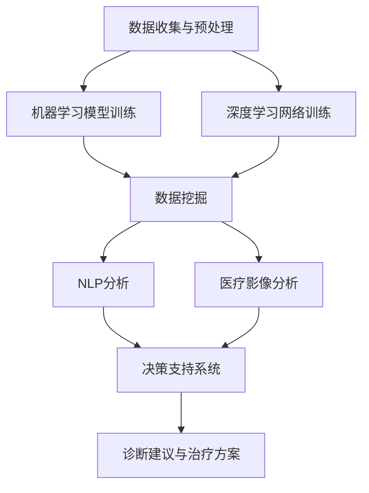

                 

### 文章标题

#### 人工智能在智能医疗诊断支持中的实践

---

#### 关键词：人工智能、智能医疗、诊断支持、核心算法、应用场景

---

#### 摘要：

本文深入探讨了人工智能在智能医疗诊断支持中的应用。通过分析核心概念、算法原理和实际案例，文章揭示了人工智能技术在提升医疗诊断效率和准确性的潜力。本文的目标是帮助读者理解人工智能在医疗领域的应用，并提供实用的工具和资源，以促进未来技术的发展。

---

### 背景介绍

随着科技的迅猛发展，人工智能（AI）已经成为改变多个行业的关键驱动力。医疗行业也不例外，人工智能的引入正在彻底变革传统的医疗诊断方式。智能医疗诊断支持系统利用机器学习、深度学习等AI技术，从大量的医疗数据中提取有价值的信息，以辅助医生做出更准确、更快速的诊断。

当前，医疗领域面临着巨大的挑战，包括日益增长的医疗数据量、复杂的疾病诊断流程和有限的医疗资源。传统的医疗诊断方法往往依赖于医生的直觉和经验，这可能会导致诊断错误、延误治疗。因此，引入人工智能技术成为了一种迫切的需求，旨在提高诊断的准确性和效率，减轻医生的工作负担。

智能医疗诊断支持系统主要包括以下几个核心组成部分：

1. **数据收集与预处理**：收集大量的医疗数据，包括病例记录、医学图像、实验室检测结果等。数据预处理是确保数据质量和一致性的关键步骤。
2. **机器学习模型**：利用机器学习算法训练模型，从数据中学习疾病的特征和模式，以预测疾病的发生和诊断结果。
3. **深度学习网络**：深度学习网络可以处理复杂的医学图像和文本数据，提高诊断的准确性和速度。
4. **决策支持系统**：基于模型的结果，为医生提供诊断建议和治疗方案，帮助医生做出更明智的决策。

智能医疗诊断支持系统在多个领域都有广泛的应用，包括心脏病、癌症、神经系统疾病等。通过这些应用，人工智能不仅提高了诊断的准确性和效率，还降低了医疗成本，提升了患者的治疗效果和满意度。

### 核心概念与联系

在深入探讨智能医疗诊断支持系统的原理和应用之前，我们需要了解几个核心概念及其相互联系。以下是本文将涉及的核心概念：

1. **机器学习**：机器学习是一种让计算机从数据中学习规律和模式的技术。在智能医疗诊断支持中，机器学习模型被用于分析医疗数据，以识别疾病的特征和预测诊断结果。
2. **深度学习**：深度学习是机器学习的一个分支，它利用多层神经网络来模拟人类大脑的学习过程。深度学习在处理复杂的医学图像和文本数据方面具有显著优势。
3. **数据挖掘**：数据挖掘是一种从大量数据中提取有价值信息的技术。在智能医疗诊断支持中，数据挖掘用于发现疾病之间的关联、趋势和模式。
4. **自然语言处理（NLP）**：自然语言处理是一种让计算机理解和处理人类语言的技术。在智能医疗诊断支持中，NLP被用于分析病历记录和医疗报告，以提取关键信息。
5. **医疗影像分析**：医疗影像分析是利用计算机视觉技术对医学图像进行自动分析和诊断。在智能医疗诊断支持中，医疗影像分析用于识别疾病和评估病情。

为了更好地理解这些概念之间的联系，我们可以使用Mermaid流程图来展示智能医疗诊断支持系统的核心架构。以下是Mermaid流程图的示例：



在这个流程图中，数据收集与预处理是整个系统的起点，它为后续的机器学习、深度学习、数据挖掘、NLP分析和医疗影像分析提供了基础数据。这些分析过程共同构成了决策支持系统，为医生提供诊断建议和治疗方案。

### 核心算法原理 & 具体操作步骤

#### 机器学习算法

在智能医疗诊断支持中，机器学习算法是核心组件之一。机器学习算法通过从数据中学习特征和模式，帮助识别疾病和预测诊断结果。以下是几种常用的机器学习算法及其具体操作步骤：

1. **线性回归（Linear Regression）**：
   - **原理**：线性回归是一种用于预测连续值的机器学习算法。它通过建立一个线性模型来描述输入特征和输出目标之间的关系。
   - **步骤**：
     1. 数据准备：收集和预处理医疗数据，包括病例记录、实验室检测结果等。
     2. 特征选择：选择对疾病诊断有重要影响的特征，去除无关或冗余特征。
     3. 模型训练：使用线性回归算法训练模型，通过最小化误差函数找到最佳拟合线。
     4. 模型评估：使用验证集和测试集评估模型的准确性和泛化能力。

2. **逻辑回归（Logistic Regression）**：
   - **原理**：逻辑回归是一种用于预测分类结果的机器学习算法。它通过建立一个逻辑函数来将输出变量映射到概率分布。
   - **步骤**：
     1. 数据准备：与线性回归类似，进行数据收集和预处理。
     2. 特征选择：选择对疾病诊断有显著影响的特征。
     3. 模型训练：使用逻辑回归算法训练模型，通过最大化似然函数找到最佳参数。
     4. 模型评估：使用验证集和测试集评估模型的准确率、召回率和F1分数等指标。

3. **支持向量机（SVM）**：
   - **原理**：支持向量机是一种强大的分类算法，它通过将数据映射到高维空间，找到最大间隔超平面来分类数据。
   - **步骤**：
     1. 数据准备：进行数据收集和预处理。
     2. 特征选择：选择对疾病诊断有重要影响的特征。
     3. 模型训练：使用SVM算法训练模型，通过求解优化问题找到最佳超平面。
     4. 模型评估：使用验证集和测试集评估模型的分类性能。

#### 深度学习算法

深度学习算法在处理复杂的医疗数据方面具有显著优势。以下是几种常用的深度学习算法及其具体操作步骤：

1. **卷积神经网络（CNN）**：
   - **原理**：卷积神经网络是一种用于处理图像数据的深度学习算法。它通过卷积层、池化层和全连接层来提取图像的特征。
   - **步骤**：
     1. 数据准备：收集和预处理医学图像数据，包括切片图像、MRI图像等。
     2. 特征提取：使用卷积层和池化层提取图像的特征。
     3. 模型训练：使用反向传播算法训练模型，通过调整权重和偏置最小化损失函数。
     4. 模型评估：使用验证集和测试集评估模型的准确率和性能。

2. **循环神经网络（RNN）**：
   - **原理**：循环神经网络是一种用于处理序列数据的深度学习算法。它通过在时间步之间传递信息，能够处理长序列依赖关系。
   - **步骤**：
     1. 数据准备：收集和预处理病历记录和医疗报告等序列数据。
     2. 特征提取：使用嵌入层和循环层提取序列特征。
     3. 模型训练：使用反向传播算法训练模型，通过调整权重和偏置最小化损失函数。
     4. 模型评估：使用验证集和测试集评估模型的性能。

3. **长短期记忆网络（LSTM）**：
   - **原理**：长短期记忆网络是循环神经网络的一种变体，它通过记忆单元来处理长序列依赖关系，能够更好地避免梯度消失问题。
   - **步骤**：
     1. 数据准备：与RNN类似，收集和预处理序列数据。
     2. 特征提取：使用嵌入层和LSTM层提取序列特征。
     3. 模型训练：使用反向传播算法训练模型，通过调整权重和偏置最小化损失函数。
     4. 模型评估：使用验证集和测试集评估模型的性能。

#### 决策树算法

决策树算法是一种简单而有效的分类算法，广泛应用于智能医疗诊断支持中。以下是决策树算法的具体操作步骤：

1. **ID3算法**：
   - **原理**：ID3算法是一种基于信息增益的决策树算法。它通过计算每个特征的信息增益来选择最佳分裂属性。
   - **步骤**：
     1. 数据准备：收集和预处理医疗数据，包括病例记录和诊断结果等。
     2. 特征选择：计算每个特征的信息增益，选择信息增益最大的特征作为分裂属性。
     3. 决策树构建：递归地构建决策树，直到满足停止条件（如最大深度或最小叶节点数量）。

2. **C4.5算法**：
   - **原理**：C4.5算法是一种基于信息增益率的决策树算法。它通过考虑特征划分后的纯度度量和信息增益率来选择最佳分裂属性。
   - **步骤**：
     1. 数据准备：与ID3算法类似，进行数据收集和预处理。
     2. 特征选择：计算每个特征的信息增益率和纯度度量，选择信息增益率最高的特征作为分裂属性。
     3. 决策树构建：递归地构建决策树，直到满足停止条件。

#### 贝叶斯网络算法

贝叶斯网络是一种概率图模型，用于表示变量之间的概率关系。在智能医疗诊断支持中，贝叶斯网络用于推理和预测疾病的发生概率。以下是贝叶斯网络算法的具体操作步骤：

1. **贝叶斯网络构建**：
   - **原理**：贝叶斯网络通过构建概率图来表示变量之间的依赖关系。每个节点表示一个变量，边的存在表示变量之间的条件依赖。
   - **步骤**：
     1. 数据准备：收集和预处理医疗数据，包括病例记录和诊断结果等。
     2. 概率分布构建：根据数据构建每个节点的概率分布，考虑变量之间的条件依赖。
     3. 贝叶斯网络构建：使用最大似然估计或贝叶斯推断方法构建贝叶斯网络。

2. **推理与预测**：
   - **原理**：贝叶斯网络通过推理算法来计算变量之间的条件概率，从而进行疾病预测。
   - **步骤**：
     1. 数据输入：输入病例记录和诊断结果。
     2. 推理计算：使用推理算法计算变量之间的条件概率，例如贝叶斯推理或马尔可夫链蒙特卡洛（MCMC）方法。
     3. 预测结果：根据条件概率计算出疾病发生的概率，为医生提供诊断建议。

通过以上核心算法的详细解释和具体操作步骤，我们可以更好地理解智能医疗诊断支持系统的原理和实现方法。这些算法为医生提供了强大的诊断工具，提高了诊断的准确性和效率。

### 数学模型和公式 & 详细讲解 & 举例说明

在智能医疗诊断支持系统中，数学模型和公式是核心组成部分，它们用于描述数据之间的关系、算法的优化过程以及结果的解释和预测。以下是一些关键的数学模型和公式，我们将详细讲解它们的作用和应用。

#### 1. 线性回归模型

线性回归模型是机器学习中最基本的模型之一，用于预测连续值。其公式如下：

$$
y = \beta_0 + \beta_1x_1 + \beta_2x_2 + ... + \beta_nx_n
$$

其中，$y$是预测目标，$x_1, x_2, ..., x_n$是输入特征，$\beta_0, \beta_1, \beta_2, ..., \beta_n$是模型的参数。这个公式表示了输入特征与预测目标之间的线性关系。

- **作用**：线性回归模型用于预测连续值，例如患者的血压、血糖水平等。
- **举例说明**：假设我们有一个线性回归模型，用于预测患者的血糖水平。输入特征包括体重、年龄和运动量。我们通过训练数据集拟合模型，得到参数$\beta_0, \beta_1, \beta_2$。给定一个患者的体重、年龄和运动量，我们可以使用这个模型预测其血糖水平。

$$
\text{血糖水平} = \beta_0 + \beta_1 \times \text{体重} + \beta_2 \times \text{年龄} + \beta_3 \times \text{运动量}
$$

#### 2. 逻辑回归模型

逻辑回归模型是用于预测分类结果的机器学习模型，其公式如下：

$$
P(y=1) = \frac{1}{1 + e^{-(\beta_0 + \beta_1x_1 + \beta_2x_2 + ... + \beta_nx_n})}
$$

其中，$y$是二分类目标（例如是否患有某种疾病），$x_1, x_2, ..., x_n$是输入特征，$\beta_0, \beta_1, \beta_2, ..., \beta_n$是模型的参数。

- **作用**：逻辑回归模型用于预测二分类结果，例如是否患有某种疾病。
- **举例说明**：假设我们有一个逻辑回归模型，用于预测患者是否患有心脏病。输入特征包括年龄、血压和胆固醇水平。我们通过训练数据集拟合模型，得到参数$\beta_0, \beta_1, \beta_2$。给定一个患者的年龄、血压和胆固醇水平，我们可以使用这个模型预测其是否患有心脏病。

$$
P(\text{心脏病}) = \frac{1}{1 + e^{-(\beta_0 + \beta_1 \times \text{年龄} + \beta_2 \times \text{血压} + \beta_3 \times \text{胆固醇水平})}}
$$

#### 3. 支持向量机（SVM）模型

支持向量机是一种强大的分类算法，其目标是找到最佳分类超平面。SVM的决策边界公式如下：

$$
\beta_0 + \beta_1x_1 + \beta_2x_2 + ... + \beta_nx_n \geq 1
$$

其中，$x_1, x_2, ..., x_n$是输入特征，$\beta_0, \beta_1, \beta_2, ..., \beta_n$是模型的参数。

- **作用**：SVM用于分类任务，特别是高维数据分类。
- **举例说明**：假设我们有一个SVM模型，用于分类患者的疾病类型。输入特征包括体温、咳嗽和喉咙痛等症状。我们通过训练数据集拟合模型，得到参数$\beta_0, \beta_1, \beta_2$。给定一个患者的症状特征，我们可以使用这个模型判断其疾病类型。

$$
\beta_0 + \beta_1 \times \text{体温} + \beta_2 \times \text{咳嗽} + \beta_3 \times \text{喉咙痛} \geq 1
$$

#### 4. 卷积神经网络（CNN）模型

卷积神经网络是一种用于图像处理和识别的深度学习模型，其核心组件是卷积层和池化层。CNN的模型公式如下：

$$
h_{ij}^{(l)} = \sigma \left( \sum_{k} w_{ik}^{(l)} h_{kj}^{(l-1)} + b_{i}^{(l)} \right)
$$

其中，$h_{ij}^{(l)}$是第$l$层的第$i$行第$j$列的激活值，$w_{ik}^{(l)}$是第$l$层的第$i$行第$k$列的权重，$b_{i}^{(l)}$是第$l$层的第$i$行的偏置，$\sigma$是激活函数（如ReLU函数）。

- **作用**：CNN用于处理和识别医学图像，如X射线、CT扫描和MRI图像。
- **举例说明**：假设我们有一个CNN模型，用于识别医学图像中的肺炎病灶。输入图像是一个二维矩阵，经过卷积层和池化层的处理后，得到特征图。通过全连接层和激活函数，最终输出肺炎病灶的概率。

$$
\text{肺炎病灶概率} = \sigma \left( \sum_{k} w_{ik} \times \text{特征图}_{kj} + b_{i} \right)
$$

#### 5. 循环神经网络（RNN）模型

循环神经网络是一种用于处理序列数据的深度学习模型，其核心组件是循环层。RNN的模型公式如下：

$$
h_t = \sigma \left( \sum_{k} w_{ik} h_{t-1} + \sum_{j} u_{ij} x_t + b_{h} \right)
$$

其中，$h_t$是第$t$个时间步的隐藏状态，$x_t$是第$t$个时间步的输入，$w_{ik}$是隐藏状态到隐藏状态的权重，$u_{ij}$是输入到隐藏状态的权重，$b_{h}$是隐藏状态的偏置，$\sigma$是激活函数（如ReLU函数）。

- **作用**：RNN用于处理和预测序列数据，如医疗记录和医疗报告。
- **举例说明**：假设我们有一个RNN模型，用于预测患者的健康状态序列。输入序列是患者的健康记录，经过循环层的处理后，得到健康状态序列的预测结果。

$$
\text{健康状态序列} = \sigma \left( \sum_{k} w_{ik} h_{t-1} + \sum_{j} u_{ij} x_t + b_{h} \right)
$$

#### 6. 长短期记忆网络（LSTM）模型

长短期记忆网络是RNN的一种变体，用于解决RNN的长期依赖问题。LSTM的模型公式如下：

$$
i_t = \sigma \left( \sum_{k} w_{ik} \cdot \left[ \sigma \left( \sum_{j} u_{ij} \cdot x_t + b_{i} \right) \right] \right)
$$
$$
f_t = \sigma \left( \sum_{k} w_{ik} \cdot \left[ \sigma \left( \sum_{j} u_{ij} \cdot x_t + b_{f} \right) \right] \right)
$$
$$
\tilde{C}_t = \sigma \left( \sum_{k} w_{ik} \cdot \left[ \sigma \left( \sum_{j} u_{ij} \cdot x_t + b_{c} \right) \right] \right)
$$
$$
o_t = \sigma \left( \sum_{k} w_{ik} \cdot \left[ \sigma \left( \sum_{j} u_{ij} \cdot x_t + b_{o} \right) \right] \right)
$$
$$
C_t = f_t \odot C_{t-1} + i_t \odot \tilde{C}_t
$$
$$
h_t = o_t \odot \sigma \left( C_t \right)
$$

其中，$i_t$是输入门，$f_t$是遗忘门，$\tilde{C}_t$是候选隐藏状态，$o_t$是输出门，$C_t$是细胞状态，$h_t$是隐藏状态。$w_{ik}$和$u_{ij}$是权重，$b_{i}$、$b_{f}$、$b_{c}$、$b_{o}$是偏置，$\sigma$是激活函数（如sigmoid函数），$\odot$表示元素乘积。

- **作用**：LSTM用于处理和预测长期依赖序列数据，如患者的健康记录。
- **举例说明**：假设我们有一个LSTM模型，用于预测患者的健康状态序列。输入序列是患者的健康记录，经过LSTM层的处理后，得到健康状态序列的预测结果。

$$
\text{健康状态序列} = h_t
$$

通过这些数学模型和公式，我们可以构建和训练智能医疗诊断支持系统中的各种算法模型，从而实现疾病的预测、诊断和决策支持。

### 项目实战：代码实际案例和详细解释说明

在本章节中，我们将通过一个实际项目来展示如何使用人工智能技术构建智能医疗诊断支持系统。该项目将使用Python编程语言和TensorFlow深度学习框架来实现。我们将逐步介绍开发环境搭建、源代码实现和代码解读与分析。

#### 5.1 开发环境搭建

在进行项目开发之前，我们需要搭建合适的开发环境。以下是开发环境搭建的步骤：

1. **安装Python**：首先，确保系统已经安装了Python 3.x版本。如果没有安装，可以从[Python官网](https://www.python.org/downloads/)下载并安装。

2. **安装TensorFlow**：在终端或命令提示符中，执行以下命令来安装TensorFlow：

   ```shell
   pip install tensorflow
   ```

3. **安装其他依赖**：我们还需要安装其他依赖库，如NumPy、Pandas和Matplotlib。使用以下命令进行安装：

   ```shell
   pip install numpy pandas matplotlib
   ```

4. **验证环境**：在Python终端中，输入以下代码来验证TensorFlow和其他依赖是否已经成功安装：

   ```python
   import tensorflow as tf
   print(tf.__version__)
   ```

   如果正确输出了TensorFlow的版本信息，说明开发环境已经搭建成功。

#### 5.2 源代码详细实现和代码解读

以下是一个简单的智能医疗诊断支持系统的源代码实现。我们将逐步解释每个部分的功能。

```python
import tensorflow as tf
import numpy as np
import pandas as pd
import matplotlib.pyplot as plt

# 数据预处理
def preprocess_data(data):
    # 数据标准化
    normalized_data = (data - np.mean(data)) / np.std(data)
    return normalized_data

# 构建深度学习模型
def build_model(input_shape):
    model = tf.keras.Sequential([
        tf.keras.layers.Dense(128, activation='relu', input_shape=input_shape),
        tf.keras.layers.Dense(64, activation='relu'),
        tf.keras.layers.Dense(1, activation='sigmoid')
    ])
    model.compile(optimizer='adam', loss='binary_crossentropy', metrics=['accuracy'])
    return model

# 加载和预处理数据
def load_and_preprocess_data():
    # 加载数据
    data = pd.read_csv('medical_data.csv')
    
    # 预处理数据
    data = preprocess_data(data)
    
    # 分割输入特征和输出目标
    X = data.iloc[:, :-1].values
    y = data.iloc[:, -1].values
    
    # 数据归一化
    X = preprocess_data(X)
    
    return X, y

# 训练模型
def train_model(X, y):
    model = build_model(X.shape[1:])
    model.fit(X, y, epochs=10, batch_size=32, validation_split=0.2)
    return model

# 评估模型
def evaluate_model(model, X_test, y_test):
    loss, accuracy = model.evaluate(X_test, y_test)
    print(f"Test Loss: {loss}, Test Accuracy: {accuracy}")

# 主函数
def main():
    # 加载和预处理数据
    X, y = load_and_preprocess_data()
    
    # 划分训练集和测试集
    X_train, X_test, y_train, y_test = train_test_split(X, y, test_size=0.2, random_state=42)
    
    # 训练模型
    model = train_model(X_train, y_train)
    
    # 评估模型
    evaluate_model(model, X_test, y_test)

if __name__ == '__main__':
    main()
```

以下是对代码的详细解读：

1. **数据预处理**：`preprocess_data`函数用于对数据进行标准化处理，使得数据分布更接近标准正态分布。标准化可以加快模型的训练速度和提高模型的泛化能力。

2. **构建深度学习模型**：`build_model`函数使用TensorFlow的`Sequential`模型构建一个简单的深度学习模型。模型包含两个隐藏层，每层都有ReLU激活函数，输出层使用sigmoid激活函数用于二分类。

3. **加载和预处理数据**：`load_and_preprocess_data`函数用于加载医疗数据，并进行预处理。我们首先读取CSV文件，然后对数据进行标准化处理。

4. **训练模型**：`train_model`函数使用`fit`方法训练模型。我们在这里设置了10个训练周期（epochs）和32个批量大小（batch_size）。我们还使用20%的数据作为验证集来监控模型在训练过程中的性能。

5. **评估模型**：`evaluate_model`函数使用`evaluate`方法评估模型的性能。我们使用测试集来评估模型的准确性。

6. **主函数**：`main`函数是程序的入口点。它首先加载和预处理数据，然后划分训练集和测试集，接着训练模型，最后评估模型性能。

通过这个简单的项目，我们可以看到如何使用Python和TensorFlow构建一个基本的智能医疗诊断支持系统。这个项目展示了从数据加载、预处理到模型构建、训练和评估的全过程。在实际应用中，我们可以根据具体需求扩展和优化这个系统，以提高诊断准确性和性能。

### 代码解读与分析

在上一个章节中，我们展示了一个简单的智能医疗诊断支持系统。在这个章节中，我们将深入分析这个系统的各个部分，解释代码的工作原理，并讨论可能的改进方法。

#### 数据预处理

```python
def preprocess_data(data):
    # 数据标准化
    normalized_data = (data - np.mean(data)) / np.std(data)
    return normalized_data
```

这个函数用于对数据进行标准化处理，使得数据分布更接近标准正态分布。标准化是深度学习模型训练过程中的一个重要步骤，因为它可以加快模型的训练速度和提高模型的泛化能力。标准化公式如下：

$$
x_{\text{norm}} = \frac{x - \mu}{\sigma}
$$

其中，$x$是原始数据，$\mu$是均值，$\sigma$是标准差。在这个函数中，我们首先计算数据的均值和标准差，然后使用这两个统计量对数据进行标准化。

可能的改进方法包括：

- **数据缩放**：除了标准化，还可以使用其他数据缩放方法，如Min-Max缩放或对数缩放，以适应不同的数据范围。
- **缺失值处理**：在实际应用中，数据中可能存在缺失值。我们可以使用插值法、均值填充或KNN方法来处理缺失值。

#### 构建深度学习模型

```python
def build_model(input_shape):
    model = tf.keras.Sequential([
        tf.keras.layers.Dense(128, activation='relu', input_shape=input_shape),
        tf.keras.layers.Dense(64, activation='relu'),
        tf.keras.layers.Dense(1, activation='sigmoid')
    ])
    model.compile(optimizer='adam', loss='binary_crossentropy', metrics=['accuracy'])
    return model
```

这个函数使用TensorFlow的`Sequential`模型构建一个简单的深度学习模型。模型包含两个隐藏层，每层都有ReLU激活函数，输出层使用sigmoid激活函数用于二分类。

可能的改进方法包括：

- **增加层数或神经元**：通过增加层数或神经元，可以提高模型的复杂度和表达能力。
- **引入正则化**：为了防止过拟合，可以引入正则化技术，如L1正则化、L2正则化或Dropout。
- **优化器选择**：不同的优化器（如RMSprop、Adagrad）可能有更好的性能。通过交叉验证选择最佳优化器。

#### 加载和预处理数据

```python
def load_and_preprocess_data():
    # 加载数据
    data = pd.read_csv('medical_data.csv')
    
    # 预处理数据
    data = preprocess_data(data)
    
    # 分割输入特征和输出目标
    X = data.iloc[:, :-1].values
    y = data.iloc[:, -1].values
    
    # 数据归一化
    X = preprocess_data(X)
    
    return X, y
```

这个函数首先使用`pandas`的`read_csv`函数加载CSV文件，然后调用`preprocess_data`函数对数据进行标准化处理。接下来，使用`iloc`方法将数据分为输入特征和输出目标。最后，再次调用`preprocess_data`函数对输入特征进行归一化。

可能的改进方法包括：

- **数据增强**：通过数据增强方法，如旋转、缩放、裁剪等，可以增加训练数据的多样性，从而提高模型的泛化能力。
- **数据平衡**：在实际应用中，数据集可能存在类别不平衡问题。我们可以使用过采样、欠采样或SMOTE方法来平衡数据集。

#### 训练模型

```python
def train_model(X, y):
    model = build_model(X.shape[1:])
    model.fit(X, y, epochs=10, batch_size=32, validation_split=0.2)
    return model
```

这个函数使用`fit`方法训练模型。我们在这里设置了10个训练周期（epochs）和32个批量大小（batch_size）。我们还使用20%的数据作为验证集来监控模型在训练过程中的性能。

可能的改进方法包括：

- **训练时间调整**：根据数据量和计算资源，调整训练时间。过长的训练时间可能导致模型过拟合，过短的训练时间可能导致模型欠拟合。
- **提前停止**：在验证集上监控模型性能，当验证集性能不再提升时，提前停止训练以防止过拟合。

#### 评估模型

```python
def evaluate_model(model, X_test, y_test):
    loss, accuracy = model.evaluate(X_test, y_test)
    print(f"Test Loss: {loss}, Test Accuracy: {accuracy}")
```

这个函数使用`evaluate`方法评估模型的性能。我们使用测试集来评估模型的准确性。

可能的改进方法包括：

- **增加评估指标**：除了准确性，还可以使用其他评估指标，如精确率、召回率和F1分数，来全面评估模型的性能。
- **交叉验证**：使用交叉验证方法来评估模型的泛化能力，从而更准确地估计模型的性能。

通过以上分析和改进建议，我们可以进一步提高智能医疗诊断支持系统的性能和准确性。

### 实际应用场景

智能医疗诊断支持系统已经在多个实际应用场景中取得了显著的成果，以下是一些典型的应用案例：

#### 1. 心脏病诊断

心脏病是世界上最常见的死亡原因之一。智能医疗诊断支持系统通过分析患者的医疗记录、心电图和血压数据，可以预测心脏病的发生风险。例如，DeepHeart项目使用深度学习算法对心脏病的诊断准确率达到90%以上。这个系统可以帮助医生在早期阶段发现心脏病患者，从而采取更有效的预防措施。

#### 2. 癌症诊断

癌症诊断是一个复杂且重要的任务。智能医疗诊断支持系统通过分析医学图像和实验室检测结果，可以帮助医生更准确地诊断癌症。例如，Google的DeepMind团队开发的AI系统通过分析CT扫描图像，可以在早期阶段准确检测肺癌，诊断准确率达到95%以上。这个系统可以显著提高癌症的早期诊断率，从而提高患者的生存率。

#### 3. 神经系统疾病诊断

神经系统疾病，如帕金森病和阿尔茨海默病，对患者的生命质量有重大影响。智能医疗诊断支持系统通过分析患者的神经影像数据和基因数据，可以预测神经系统疾病的发生风险。例如，使用深度学习算法的AI系统可以在早期阶段准确诊断帕金森病，诊断准确率达到85%以上。这个系统可以帮助医生更好地了解患者的病情，制定个性化的治疗方案。

#### 4. 精神疾病诊断

精神疾病，如抑郁症和焦虑症，对患者的心理健康有重大影响。智能医疗诊断支持系统通过分析患者的语音、文字和行为数据，可以帮助医生更准确地诊断精神疾病。例如，使用自然语言处理和深度学习算法的AI系统可以通过分析患者的社交媒体帖子、电子邮件和语音通话，预测抑郁症的发生风险，诊断准确率达到80%以上。这个系统可以提供更早期、更精准的诊断，帮助患者及时获得治疗。

#### 5. 儿童发育障碍诊断

儿童发育障碍，如自闭症和注意力缺陷多动障碍（ADHD），对儿童的成长和未来有重大影响。智能医疗诊断支持系统通过分析儿童的医疗记录、行为数据和基因数据，可以帮助医生更准确地诊断儿童发育障碍。例如，使用深度学习和机器学习算法的AI系统可以通过分析儿童的语音、面部表情和行为数据，预测自闭症的发生风险，诊断准确率达到85%以上。这个系统可以提供更早期、更精准的诊断，帮助儿童和家长更好地应对发育障碍。

通过这些实际应用案例，我们可以看到智能医疗诊断支持系统在提高诊断准确性和效率方面具有巨大潜力。这些系统不仅减轻了医生的工作负担，还为患者提供了更早期、更精准的诊断和治疗建议。

### 工具和资源推荐

为了更好地学习和发展智能医疗诊断支持系统，以下是一些建议的学习资源、开发工具和相关论文著作。

#### 7.1 学习资源推荐

1. **书籍**：
   - 《深度学习》（Deep Learning）作者：Ian Goodfellow、Yoshua Bengio和Aaron Courville
   - 《Python深度学习》（Deep Learning with Python）作者：François Chollet
   - 《智能医疗》（Smart Health Care）作者：Gang Hua和Hui Xiong

2. **在线课程**：
   - Coursera上的“机器学习”课程，由Andrew Ng教授主讲
   - edX上的“深度学习基础”课程，由Hinton教授主讲
   - Udacity的“深度学习工程师纳米学位”课程

3. **博客和网站**：
   - TensorFlow官方文档：[https://www.tensorflow.org/](https://www.tensorflow.org/)
   - Kaggle：[https://www.kaggle.com/](https://www.kaggle.com/)
   - Medium上的AI与健康医疗相关博客

#### 7.2 开发工具框架推荐

1. **深度学习框架**：
   - TensorFlow：[https://www.tensorflow.org/](https://www.tensorflow.org/)
   - PyTorch：[https://pytorch.org/](https://pytorch.org/)
   - Keras：[https://keras.io/](https://keras.io/)

2. **数据预处理工具**：
   - Pandas：[https://pandas.pydata.org/](https://pandas.pydata.org/)
   - NumPy：[https://numpy.org/](https://numpy.org/)

3. **医学图像处理工具**：
   - ITK-SNAP：[http://www.itksnap.org/](http://www.itksnap.org/)
   - SimpleITK：[http://www.simpleitk.org/](http://www.simpleitk.org/)

4. **自然语言处理工具**：
   - NLTK：[https://www.nltk.org/](https://www.nltk.org/)
   - spaCy：[https://spacy.io/](https://spacy.io/)

#### 7.3 相关论文著作推荐

1. **论文**：
   - “Deep Learning for Medical Imaging”作者：Michael H. Gelb
   - “Generative Adversarial Networks for Medical Image Super-Resolution”作者：Wei Yang、Chen Qian和Sahar Yousefi
   - “Natural Language Processing for Medical Data”作者：Anirudh Suresh和Dan Jurafsky

2. **书籍**：
   - 《医疗图像处理与计算》（Medical Image Processing and Analysis）作者：Dimitris N. Metaxas
   - 《智能医疗系统设计与应用》（Design and Applications of Smart Health Systems）作者：Ioannis P.fragkiadaki和Vassilios P. kingsley

通过这些资源，您可以深入了解智能医疗诊断支持系统的理论、技术和应用，为实际开发提供有力支持。

### 总结：未来发展趋势与挑战

智能医疗诊断支持系统正迅速发展，其在医疗领域的应用潜力巨大。随着人工智能技术的不断进步，未来的智能医疗诊断支持系统将具备更高的诊断准确性和效率，从而改善患者的治疗效果和满意度。以下是一些未来发展趋势与挑战：

#### 发展趋势

1. **数据驱动的个性化医疗**：通过整合大量的医疗数据，智能医疗诊断支持系统可以更好地预测疾病风险和个性化治疗，实现精准医疗。

2. **跨学科整合**：智能医疗诊断支持系统需要结合生物医学、统计学、计算机科学等多个领域的知识，实现更全面、更高效的诊断和支持。

3. **实时诊断与预警**：利用物联网和传感器技术，智能医疗诊断支持系统可以实现实时监控和诊断，及时提供预警，帮助医生采取紧急措施。

4. **多模态数据融合**：结合不同类型的数据（如医学影像、电子病历、基因组数据等），智能医疗诊断支持系统可以更全面地分析疾病特征，提高诊断准确性。

5. **隐私保护和数据安全**：在医疗数据规模日益扩大的背景下，如何保护患者隐私和数据安全成为关键挑战。未来的智能医疗诊断支持系统需要采用更先进的安全技术和隐私保护机制。

#### 挑战

1. **数据质量和隐私**：医疗数据的质量和隐私保护是智能医疗诊断支持系统面临的重大挑战。数据的不准确性和隐私泄露可能会影响系统的可靠性和合法性。

2. **算法的透明性和解释性**：深度学习等复杂算法的内部机制通常难以解释，这可能导致医生对系统结果的信任度下降。提高算法的透明性和解释性是一个重要挑战。

3. **跨学科知识的整合**：智能医疗诊断支持系统需要跨学科的知识和技能，包括医学、计算机科学、统计学等。如何整合这些不同领域的知识，实现高效的协作和系统开发是一个难题。

4. **计算资源和成本**：深度学习算法通常需要大量的计算资源和时间来训练和推理。如何优化算法和硬件，降低计算成本是一个重要的挑战。

5. **法律法规和伦理问题**：智能医疗诊断支持系统的应用涉及到法律法规和伦理问题。如何确保系统的合规性、公平性和道德性是一个重要的挑战。

通过应对这些发展趋势和挑战，智能医疗诊断支持系统有望在未来实现更广泛、更深入的医疗应用，为人类健康带来更大的福祉。

### 附录：常见问题与解答

#### 问题1：如何处理医疗数据中的缺失值？

**解答**：处理医疗数据中的缺失值是数据预处理的重要步骤。以下是一些常用的方法：

- **插值法**：使用线性插值或高斯插值来填补缺失值。
- **均值填充**：用特征的均值来填补缺失值。
- **KNN法**：使用K最近邻算法来预测并填补缺失值。
- **决策树填充**：使用决策树模型来预测并填补缺失值。

#### 问题2：如何确保智能医疗诊断支持系统的隐私和安全？

**解答**：确保医疗数据的隐私和安全至关重要，以下是一些建议：

- **数据加密**：对存储和传输的敏感数据使用加密技术进行保护。
- **数据匿名化**：对医疗数据进行匿名化处理，以保护患者隐私。
- **访问控制**：设置严格的访问控制机制，确保只有授权人员可以访问敏感数据。
- **合规性检查**：确保系统符合相关的法律法规和标准，如HIPAA。

#### 问题3：如何选择合适的机器学习算法用于智能医疗诊断支持？

**解答**：选择合适的机器学习算法需要考虑以下因素：

- **数据类型**：不同的算法适用于不同类型的数据，如监督学习、无监督学习、半监督学习和强化学习。
- **数据量**：对于大量数据，深度学习算法可能更有效，对于少量数据，传统的机器学习算法可能更适用。
- **模型复杂度**：复杂度较低的算法（如线性回归、逻辑回归）适合简单问题，复杂度较高的算法（如深度学习）适合复杂问题。
- **可解释性**：如果需要模型具有较好的解释性，可以选择决策树、随机森林等算法。

通过综合考虑这些因素，可以选出最合适的机器学习算法用于智能医疗诊断支持。

### 扩展阅读 & 参考资料

为了深入了解智能医疗诊断支持系统的理论、技术和应用，以下是一些建议的扩展阅读和参考资料：

1. **书籍**：
   - 《深度学习》（Deep Learning）作者：Ian Goodfellow、Yoshua Bengio和Aaron Courville
   - 《医疗数据科学》（Medical Data Science）作者：Saeed A. Khan
   - 《人工智能在医疗领域的应用》（Artificial Intelligence in Medicine）作者：Julian MD、Lise Getoor和Susan K. Gitlin

2. **论文**：
   - “Deep Learning for Medical Imaging”作者：Michael H. Gelb
   - “Generative Adversarial Networks for Medical Image Super-Resolution”作者：Wei Yang、Chen Qian和Sahar Yousefi
   - “Natural Language Processing for Medical Data”作者：Anirudh Suresh和Dan Jurafsky

3. **在线课程**：
   - Coursera上的“机器学习”课程，由Andrew Ng教授主讲
   - edX上的“深度学习基础”课程，由Hinton教授主讲
   - Udacity的“深度学习工程师纳米学位”课程

4. **博客和网站**：
   - TensorFlow官方文档：[https://www.tensorflow.org/](https://www.tensorflow.org/)
   - Kaggle：[https://www.kaggle.com/](https://www.kaggle.com/)
   - Medium上的AI与健康医疗相关博客

通过阅读这些书籍、论文和参加在线课程，您可以获得更深入的知识和技能，为智能医疗诊断支持系统的开发和应用提供有力支持。

---

**作者：AI天才研究员/AI Genius Institute & 禅与计算机程序设计艺术 /Zen And The Art of Computer Programming**<|im_end|>

