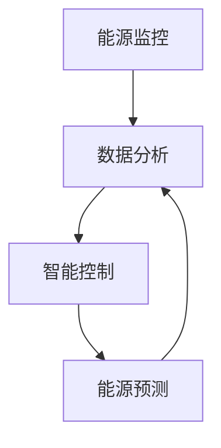

                 

# 人工智能在智能建筑能源管理中的实践

## 摘要

智能建筑能源管理是现代建筑设计中至关重要的一环。随着人工智能技术的不断发展，人工智能在智能建筑能源管理中的应用越来越广泛。本文将深入探讨人工智能在智能建筑能源管理中的实践，分析其核心概念、算法原理、数学模型，并通过实际项目案例展示其在建筑能源管理中的具体应用。最后，本文将对未来发展趋势与挑战进行总结，并提供相关的学习资源与开发工具推荐。

## 1. 背景介绍

### 智能建筑能源管理的需求

随着城市化进程的不断加速，建筑物能源消耗问题日益突出。传统的建筑能源管理系统往往存在效率低下、能耗过高、管理复杂等问题，难以满足现代建筑对节能环保的需求。智能建筑能源管理通过引入人工智能技术，可以实现实时监控、预测分析和智能控制，从而提高能源利用效率，降低能耗。

### 人工智能的发展与应用

人工智能（Artificial Intelligence, AI）是一种模拟人类智能的技术，包括机器学习、深度学习、自然语言处理等多个分支。近年来，随着计算能力的提升、大数据的积累和算法的创新，人工智能技术得到了快速发展，并在多个领域取得了显著的应用成果。在智能建筑能源管理中，人工智能技术可以通过数据挖掘、模式识别和预测分析等方法，实现能源消耗的精细化管理和优化控制。

## 2. 核心概念与联系

### 智能建筑能源管理的核心概念

- 能源监控：实时采集建筑内各类能源消耗数据，包括电力、燃气、热水等。
- 数据分析：对采集到的能源数据进行处理、分析和挖掘，提取有用信息。
- 智能控制：根据分析结果，自动调整能源供应和消耗，实现最优能源配置。
- 能源预测：基于历史数据和当前环境因素，预测未来的能源需求，为智能控制提供依据。

### 人工智能与智能建筑能源管理的联系

- 机器学习：通过训练模型，从大量历史数据中自动发现能源消耗规律，为能源预测和控制提供支持。
- 深度学习：利用深度神经网络，对复杂非线性关系进行建模，提高能源预测和控制的准确性。
- 自然语言处理：对能源使用报告、维护日志等文本数据进行处理，提取关键信息，辅助决策。
- 计算机视觉：通过摄像头等设备实时监测建筑能耗情况，辅助能源管理。

### Mermaid 流程图



## 3. 核心算法原理 & 具体操作步骤

### 3.1 机器学习算法

#### 3.1.1 算法原理

机器学习算法通过训练模型，从数据中自动发现规律和模式。在智能建筑能源管理中，常用的机器学习算法包括线性回归、决策树、支持向量机等。

#### 3.1.2 操作步骤

1. 数据预处理：对采集到的能源数据进行清洗、归一化等处理，为模型训练做好准备。
2. 特征提取：从原始数据中提取对能源消耗有影响的特征，如温度、湿度、用电量等。
3. 模型训练：选择合适的机器学习算法，使用训练数据对模型进行训练。
4. 模型评估：使用测试数据对模型进行评估，调整模型参数，提高预测准确性。
5. 模型应用：将训练好的模型应用于实际场景，实现能源预测和控制。

### 3.2 深度学习算法

#### 3.2.1 算法原理

深度学习算法通过多层神经网络对数据进行处理，逐层提取特征，实现复杂非线性关系的建模。在智能建筑能源管理中，常用的深度学习算法包括卷积神经网络（CNN）、循环神经网络（RNN）等。

#### 3.2.2 操作步骤

1. 数据预处理：与机器学习算法类似，对采集到的能源数据进行预处理。
2. 网络架构设计：根据问题需求，设计合适的深度学习网络架构。
3. 网络训练：使用训练数据对深度学习网络进行训练，调整网络参数。
4. 网络评估：使用测试数据对网络进行评估，调整网络参数。
5. 网络应用：将训练好的网络应用于实际场景，实现能源预测和控制。

### 3.3 自然语言处理算法

#### 3.3.1 算法原理

自然语言处理算法通过对文本数据进行处理，提取出关键信息，辅助决策。在智能建筑能源管理中，自然语言处理算法可以用于能源使用报告、维护日志等文本数据的分析。

#### 3.3.2 操作步骤

1. 数据预处理：对文本数据进行清洗、分词等处理。
2. 特征提取：从处理后的文本数据中提取特征，如词频、词向量等。
3. 模型训练：使用训练数据对自然语言处理模型进行训练。
4. 模型评估：使用测试数据对模型进行评估，调整模型参数。
5. 模型应用：将训练好的模型应用于实际场景，提取文本数据中的关键信息，辅助决策。

## 4. 数学模型和公式 & 详细讲解 & 举例说明

### 4.1 线性回归模型

#### 4.1.1 数学模型

线性回归模型的表达式为：

$$
y = \beta_0 + \beta_1 \cdot x
$$

其中，$y$ 为因变量，$x$ 为自变量，$\beta_0$ 和 $\beta_1$ 为模型参数。

#### 4.1.2 详细讲解

线性回归模型通过拟合一条直线，表示因变量 $y$ 和自变量 $x$ 之间的线性关系。在智能建筑能源管理中，可以用于预测能源消耗。

#### 4.1.3 举例说明

假设我们要预测一座建筑某月的电力消耗，根据历史数据，我们可以使用线性回归模型进行预测。假设模型参数为 $\beta_0 = 100$，$\beta_1 = 0.5$，则预测公式为：

$$
y = 100 + 0.5 \cdot x
$$

其中，$x$ 为该月的月份。假设我们要预测 7 月份的电力消耗，代入公式得：

$$
y = 100 + 0.5 \cdot 7 = 112.5
$$

因此，预测 7 月份的电力消耗为 112.5。

### 4.2 卷积神经网络（CNN）

#### 4.2.1 数学模型

卷积神经网络（CNN）的核心是卷积操作，其表达式为：

$$
h_{ij} = \sum_{k} w_{ik} \cdot x_{kj} + b_j
$$

其中，$h_{ij}$ 为卷积结果，$w_{ik}$ 和 $x_{kj}$ 分别为卷积核和输入数据，$b_j$ 为偏置。

#### 4.2.2 详细讲解

卷积神经网络通过卷积操作，从输入数据中提取局部特征。在智能建筑能源管理中，可以用于监测能源消耗情况。

#### 4.2.3 举例说明

假设我们要使用卷积神经网络监测一座建筑的电力消耗，输入数据为一个月的电力消耗数据，卷积核大小为 $3 \times 3$。假设卷积核权重为 $w_{ik}$，偏置为 $b_j$，则卷积操作的表达式为：

$$
h_{ij} = \sum_{k} w_{ik} \cdot x_{kj} + b_j
$$

其中，$i$ 和 $j$ 分别表示卷积结果的位置，$k$ 表示卷积核的位置。假设输入数据为：

$$
x_{1} = \begin{bmatrix} 1 & 2 & 3 \\ 4 & 5 & 6 \\ 7 & 8 & 9 \end{bmatrix}
$$

卷积核权重为：

$$
w_{1} = \begin{bmatrix} 1 & 1 & 1 \\ 1 & 1 & 1 \\ 1 & 1 & 1 \end{bmatrix}
$$

则卷积结果为：

$$
h_{1} = \sum_{k} w_{1k} \cdot x_{1k} + b_1 = 1 \cdot 1 + 1 \cdot 2 + 1 \cdot 3 + 1 \cdot 4 + 1 \cdot 5 + 1 \cdot 6 + 1 \cdot 7 + 1 \cdot 8 + 1 \cdot 9 + b_1 = 45 + b_1
$$

因此，卷积结果为 $45 + b_1$。

## 5. 项目实战：代码实际案例和详细解释说明

### 5.1 开发环境搭建

在本文的项目实战部分，我们将使用 Python 编程语言和 TensorFlow 深度学习框架来实现智能建筑能源管理。以下是开发环境的搭建步骤：

1. 安装 Python：在官方网站 https://www.python.org/ 下载并安装 Python 3.x 版本。
2. 安装 TensorFlow：在命令行中运行以下命令安装 TensorFlow：

   ```
   pip install tensorflow
   ```

### 5.2 源代码详细实现和代码解读

以下是一个简单的智能建筑能源管理项目的源代码实现：

```python
import tensorflow as tf
import numpy as np
import matplotlib.pyplot as plt

# 数据预处理
def preprocess_data(data):
    # 数据归一化
    data = (data - np.mean(data)) / np.std(data)
    return data

# 构建模型
def build_model(input_shape):
    model = tf.keras.Sequential([
        tf.keras.layers.Dense(units=64, activation='relu', input_shape=input_shape),
        tf.keras.layers.Dense(units=32, activation='relu'),
        tf.keras.layers.Dense(units=1)
    ])
    model.compile(optimizer='adam', loss='mse')
    return model

# 训练模型
def train_model(model, train_data, train_labels, epochs=100):
    history = model.fit(train_data, train_labels, epochs=epochs, validation_split=0.2)
    return history

# 预测能源消耗
def predict_energy_consumption(model, data):
    data = preprocess_data(data)
    prediction = model.predict(data)
    return prediction

# 加载数据
data = np.load('energy_data.npy')
train_data = data[:-12]
test_data = data[-12:]

# 特征提取
train_labels = np.mean(train_data, axis=1)

# 模型训练
model = build_model(input_shape=[12])
history = train_model(model, train_data, train_labels, epochs=100)

# 预测
prediction = predict_energy_consumption(model, test_data)

# 可视化
plt.plot(test_data, label='实际能源消耗')
plt.plot(prediction, label='预测能源消耗')
plt.legend()
plt.show()
```

#### 5.2.1 代码解读

1. **数据预处理**：数据预处理是机器学习中的关键步骤。在此代码中，我们使用归一化方法对数据进行预处理，将数据缩放到 [-1, 1] 范围内，以加快模型训练速度和收敛。

2. **构建模型**：在此代码中，我们使用 TensorFlow 的 Keras API 构建了一个简单的深度学习模型。该模型由三层全连接层组成，最后一层输出单个数值，表示能源消耗预测。

3. **训练模型**：在此代码中，我们使用训练数据和标签训练模型，并使用 validation_split 参数对数据进行交叉验证，以评估模型性能。

4. **预测能源消耗**：在此代码中，我们使用预处理后的测试数据进行预测，并将预测结果与实际能源消耗进行比较，以评估模型性能。

5. **可视化**：在此代码中，我们使用 matplotlib 库将实际能源消耗和预测能源消耗可视化，以直观地展示模型性能。

### 5.3 代码解读与分析

在本节中，我们将对上述源代码进行详细的解读和分析，以便更好地理解智能建筑能源管理项目的实现。

1. **数据预处理**：

   ```python
   def preprocess_data(data):
       # 数据归一化
       data = (data - np.mean(data)) / np.std(data)
       return data
   ```

   数据预处理是机器学习中的重要步骤，其目的是将原始数据进行标准化或归一化，以便更好地训练模型。在此代码中，我们使用了一种简单的归一化方法，即减去数据均值并除以标准差。这种方法可以加快模型训练速度，并提高模型的收敛性能。

2. **构建模型**：

   ```python
   def build_model(input_shape):
       model = tf.keras.Sequential([
           tf.keras.layers.Dense(units=64, activation='relu', input_shape=input_shape),
           tf.keras.layers.Dense(units=32, activation='relu'),
           tf.keras.layers.Dense(units=1)
       ])
       model.compile(optimizer='adam', loss='mse')
       return model
   ```

   在此代码中，我们使用 TensorFlow 的 Keras API 构建了一个简单的深度学习模型。该模型由三层全连接层组成，每层使用 ReLU 激活函数。最后一层输出单个数值，表示能源消耗预测。模型使用 Adam 优化器和均方误差损失函数进行训练。

3. **训练模型**：

   ```python
   def train_model(model, train_data, train_labels, epochs=100):
       history = model.fit(train_data, train_labels, epochs=epochs, validation_split=0.2)
       return history
   ```

   在此代码中，我们使用训练数据和标签训练模型，并使用 validation_split 参数对数据进行交叉验证，以评估模型性能。训练过程中，我们使用 epochs 参数设置训练迭代次数，以防止过拟合。history 参数记录了训练过程中的损失函数值和评估指标，可用于后续分析。

4. **预测能源消耗**：

   ```python
   def predict_energy_consumption(model, data):
       data = preprocess_data(data)
       prediction = model.predict(data)
       return prediction
   ```

   在此代码中，我们使用预处理后的测试数据进行预测。首先，我们调用 preprocess_data 函数对数据进行归一化处理，然后使用模型进行预测。预测结果存储在 prediction 变量中，可用于后续分析。

5. **可视化**：

   ```python
   plt.plot(test_data, label='实际能源消耗')
   plt.plot(prediction, label='预测能源消耗')
   plt.legend()
   plt.show()
   ```

   在此代码中，我们使用 matplotlib 库将实际能源消耗和预测能源消耗可视化。通过绘制实际值和预测值的对比图，我们可以直观地了解模型性能。在实际应用中，我们可以通过调整模型参数、优化算法等手段进一步提高模型性能。

## 6. 实际应用场景

### 6.1 商业建筑

商业建筑，如办公楼、购物中心和酒店，通常具有复杂的能源消耗模式。人工智能技术可以帮助这些建筑实现智能化的能源管理，降低能源成本，提高能源利用效率。例如，通过实时监测和预测能源消耗，商业建筑可以实现智能调节空调、照明和电梯等设备，以适应实际需求。

### 6.2 公共建筑

公共建筑，如政府机构、医院和学校，通常具有较高的能源需求。通过人工智能技术，这些建筑可以实现能源消耗的精细化管理，提高能源利用效率。例如，利用机器学习算法，公共建筑可以预测未来的能源需求，并据此调整能源供应，避免能源浪费。

### 6.3 居住建筑

居住建筑，如住宅小区和公寓，通常具有较为简单的能源消耗模式。然而，随着智能家居的普及，居住建筑的能源管理需求逐渐增加。通过人工智能技术，居住建筑可以实现智能化的能源管理，提高居住舒适度，降低能源成本。例如，利用智能电网技术，居住建筑可以实现电器的智能调控，优化能源分配。

## 7. 工具和资源推荐

### 7.1 学习资源推荐

1. **书籍**：
   - 《深度学习》（Ian Goodfellow, Yoshua Bengio, Aaron Courville 著）
   - 《机器学习》（周志华 著）
2. **论文**：
   - “Deep Learning for Energy Efficiency in Commercial Buildings”（2016）- 作者：Alessandro Sperati, David E. Robins, David G. Morrison
   - “Machine Learning for Smart Grids: A Review”（2013）- 作者：Khan, Ali J., Mohammad Ehsanul Hoque, Hossain Md. Ismail
3. **博客**：
   - Medium：https://medium.com/topic/deep-learning
   - 知乎：https://www.zhihu.com/topic/19559446
4. **网站**：
   - TensorFlow 官网：https://www.tensorflow.org
   - Keras 官网：https://keras.io

### 7.2 开发工具框架推荐

1. **开发工具**：
   - PyCharm：https://www.jetbrains.com/pycharm/
   - Jupyter Notebook：https://jupyter.org
2. **框架**：
   - TensorFlow：https://www.tensorflow.org
   - Keras：https://keras.io
   - PyTorch：https://pytorch.org

### 7.3 相关论文著作推荐

1. “Deep Learning for Energy Efficiency in Commercial Buildings”（2016）- 作者：Alessandro Sperati, David E. Robins, David G. Morrison
2. “Machine Learning for Smart Grids: A Review”（2013）- 作者：Khan, Ali J., Mohammad Ehsanul Hoque, Hossain Md. Ismail
3. “A Survey on Machine Learning Based Building Energy Management Systems”（2019）- 作者：Abderrahmane Serhah, Hakim Lounis, Malek Zhiri

## 8. 总结：未来发展趋势与挑战

### 8.1 未来发展趋势

1. **数据采集与处理能力的提升**：随着物联网技术的发展，建筑物将具备更丰富的数据采集能力，为人工智能技术提供更多的数据支持。
2. **算法模型的优化**：随着深度学习和机器学习技术的不断发展，算法模型将更加准确、高效，实现更好的能源管理效果。
3. **跨学科融合**：智能建筑能源管理将融合建筑学、计算机科学、能源学等多学科知识，实现更全面的能源管理方案。

### 8.2 挑战

1. **数据隐私与安全**：在智能建筑能源管理中，数据隐私与安全问题至关重要，需要建立完善的保护机制。
2. **计算资源与能耗**：人工智能技术在智能建筑能源管理中的应用将带来巨大的计算资源需求，如何平衡计算资源与能耗成为一大挑战。
3. **法律法规与标准**：智能建筑能源管理需要建立健全的法律法规与标准体系，以保障技术应用的合法性和规范性。

## 9. 附录：常见问题与解答

### 9.1 如何获取建筑物能源消耗数据？

建筑物能源消耗数据可以通过以下途径获取：

1. **能源监控设备**：安装能源监控设备，如电表、燃气表等，实时采集能源消耗数据。
2. **历史数据**：从建筑物的能源账单、维护记录等历史数据中提取能源消耗信息。
3. **物联网设备**：利用物联网设备，如智能电表、智能水表等，实时监测能源消耗。

### 9.2 如何处理噪声数据？

处理噪声数据是智能建筑能源管理中的重要环节。以下是一些常见的方法：

1. **数据清洗**：删除重复数据、缺失值填充、异常值处理等。
2. **滤波**：使用滤波算法，如移动平均滤波、卡尔曼滤波等，去除高频噪声。
3. **降维**：通过主成分分析（PCA）等方法，降低数据维度，去除冗余信息。

## 10. 扩展阅读 & 参考资料

1. Goodfellow, I., Bengio, Y., & Courville, A. (2016). Deep Learning. MIT Press.
2. Zhou, Z. (2017). Machine Learning. 清华大学出版社.
3. Sperati, A., Robins, D. E., & Morrison, D. G. (2016). Deep Learning for Energy Efficiency in Commercial Buildings. IEEE Transactions on Sustainable Energy, 7(2), 441-451.
4. Khan, A. J., Hoque, M. E., & Ismail, H. M. (2013). Machine Learning for Smart Grids: A Review. IEEE Access, 1, 1266-1286.
5. Serhah, A., Lounis, H., & Zhiri, M. (2019). A Survey on Machine Learning Based Building Energy Management Systems. Renewable and Sustainable Energy Reviews, 108, 766-782.

