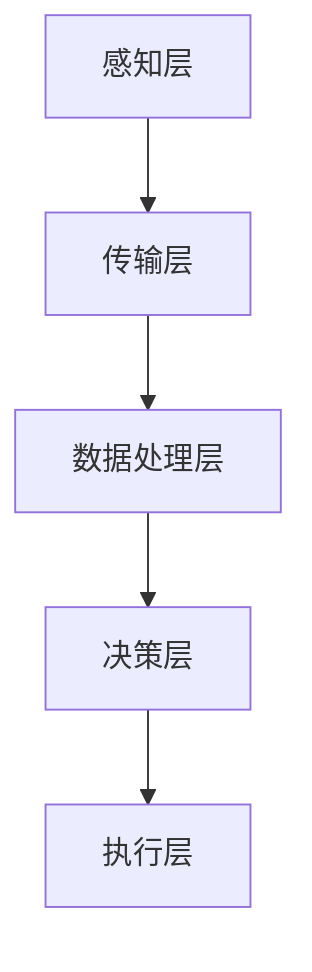

                 

### 背景介绍

#### 1.1 智能建筑的定义和意义

智能建筑（Smart Building）是指通过集成物联网（IoT）、云计算、大数据、人工智能（AI）等先进技术，实现对建筑内各类设备和系统的智能化管理和控制，从而提高建筑的运营效率、能源利用率和居住舒适度的现代化建筑。随着城市化进程的加快和建筑规模的不断扩大，智能建筑在提高能源利用效率、减少碳排放、降低运营成本等方面具有重要意义。

智能建筑的主要特点包括：
- **自动化与智能化**：通过传感器、控制器和执行器等设备，实现对建筑设备的自动化控制，提高系统运行效率。
- **数据驱动的决策**：通过收集和分析建筑内外的各种数据，为管理者和用户提供科学的决策支持。
- **高效能源管理**：通过智能化的能源管理系统，实现建筑能源的高效利用和优化分配。

#### 1.2 能源管理的挑战与需求

能源管理是智能建筑中一个重要的组成部分。随着能源价格的波动和环保意识的提高，如何实现能源的高效利用和管理成为建筑行业面临的重要挑战。传统的能源管理系统主要依赖于人工监测和手动调节，不仅效率低下，而且难以实现精细化管理。因此，引入人工智能技术成为解决这一问题的有效途径。

人工智能在能源管理中的需求主要表现在以下几个方面：

1. **数据挖掘与分析**：通过对海量能源数据的挖掘和分析，发现能源消耗的规律和异常，为优化能源使用提供依据。
2. **预测与优化**：利用机器学习算法对能源消耗进行预测，并根据预测结果调整能源供应策略，以实现能源的优化利用。
3. **智能调度与控制**：通过智能算法对建筑内各类能源设备进行实时调度和控制，提高能源利用效率。

#### 1.3 人工智能在智能建筑中的应用现状

目前，人工智能在智能建筑中的应用已经取得了一定的进展。例如，智能建筑能耗管理系统利用机器学习算法对能源消耗进行预测和优化，实现了能源利用效率的提升；智能照明系统通过感应器实时监测室内光线强度，自动调节灯光亮度，提高了照明效果和能源利用效率；智能空调系统通过传感器实时监测室内温度和湿度，实现自动调节，提高了居住舒适度。

然而，尽管人工智能在智能建筑中的应用前景广阔，但在实际应用中仍面临一些挑战，如数据质量、算法性能、系统安全性等问题。因此，进一步研究和完善人工智能在智能建筑中的应用，对于实现绿色建筑和可持续发展具有重要意义。

---

### 核心概念与联系

#### 2.1 人工智能在智能建筑中的应用原理

人工智能在智能建筑中的应用主要基于以下几个核心概念：

1. **物联网（IoT）**：物联网技术将建筑中的各类设备和系统连接起来，实现数据的实时采集和传输。通过物联网，智能建筑能够实现对设备和系统的远程监控和控制。
   
2. **大数据技术**：大数据技术用于处理和分析建筑内外的海量数据，包括能源消耗数据、环境数据、设备运行状态等。通过对这些数据的分析，可以提取出有价值的信息，为能源管理和优化提供支持。

3. **机器学习算法**：机器学习算法是实现智能化的关键。通过训练模型，智能建筑能够根据历史数据预测未来能源消耗趋势，并自动调整能源供应策略，以实现能源的高效利用。

4. **深度学习**：深度学习算法可以处理更复杂的数据，例如图像和视频，为智能建筑提供更丰富的信息来源。

#### 2.2 智能建筑能源管理系统的架构

智能建筑能源管理系统的架构通常包括以下几个部分：

1. **感知层**：由各种传感器组成，用于实时采集建筑内的温度、湿度、光照、能源消耗等数据。
   
2. **传输层**：利用物联网技术，将感知层采集的数据传输到数据处理中心。

3. **数据处理层**：包括大数据处理和机器学习算法，用于对采集到的数据进行分析和处理。

4. **决策层**：根据数据处理结果，自动生成优化方案，指导能源供应系统的运行。

5. **执行层**：由各种能源设备（如空调、照明、热水系统等）组成，根据决策层的指令进行实际操作。

#### 2.3 Mermaid 流程图展示

以下是一个简单的 Mermaid 流程图，展示了智能建筑能源管理系统的基本架构：



在流程图中，各节点代表了智能建筑能源管理系统的一个主要组成部分，箭头表示数据或控制信号的流动方向。

---

### 核心算法原理 & 具体操作步骤

#### 3.1 数据采集与预处理

智能建筑能源管理系统的第一步是数据采集与预处理。数据采集主要通过各类传感器完成，包括温度传感器、湿度传感器、光照传感器、能源消耗传感器等。这些传感器实时监测建筑内的环境参数和能源使用情况。

采集到的数据通常包含噪声和异常值，因此需要进行预处理。预处理步骤包括数据清洗、去噪、归一化等。数据清洗用于去除无效数据和异常值；去噪用于消除传感器测量中的噪声；归一化用于将数据标准化到统一的范围内，以便后续处理。

具体操作步骤如下：
1. **数据清洗**：去除无效数据和异常值。
2. **去噪**：使用滤波算法（如中值滤波、高斯滤波）去除噪声。
3. **归一化**：将数据缩放到 [0, 1] 或 [-1, 1] 范围内。

#### 3.2 特征提取与选择

在预处理后的数据中提取特征是进行机器学习的重要步骤。特征提取的目标是从原始数据中提取出能够代表数据本质特征的子集。

1. **特征提取**：根据数据类型，使用不同的特征提取方法。对于时序数据，可以提取时间序列的统计特征（如平均值、方差、峰度等）；对于图像数据，可以使用卷积神经网络提取图像特征。
2. **特征选择**：在提取出多个特征后，选择对模型性能影响最大的特征。常用的特征选择方法包括信息增益、主成分分析（PCA）等。

#### 3.3 模型训练与预测

在完成特征提取后，使用机器学习算法训练模型。训练模型的目标是使模型能够准确预测未来的能源消耗。

1. **模型选择**：选择适合问题的机器学习算法，如线性回归、决策树、随机森林、支持向量机（SVM）等。
2. **模型训练**：使用历史数据对模型进行训练，调整模型的参数，使其能够准确预测能源消耗。
3. **模型评估**：使用验证集对模型进行评估，通过评估指标（如均方误差、准确率等）判断模型的性能。

#### 3.4 能源优化与控制

基于训练好的模型，系统可以预测未来的能源消耗，并生成优化方案，指导能源设备进行自动调节。

1. **预测与优化**：使用模型预测未来的能源消耗，并根据预测结果调整能源供应策略，如调整空调温度、关闭不必要的灯光等。
2. **实时控制**：通过物联网技术和执行层设备，实现对能源设备的实时控制，确保能源消耗的优化。

#### 3.5 具体操作步骤示例

以下是一个简单的示例，展示了如何使用机器学习算法进行能源消耗预测。

1. **数据采集**：使用温度传感器、湿度传感器和能源消耗传感器采集数据。
2. **数据预处理**：去除异常值，去噪，归一化。
3. **特征提取**：提取时间序列的统计特征，如温度的平均值、湿度等。
4. **特征选择**：使用信息增益法选择最重要的特征。
5. **模型训练**：使用线性回归模型训练数据，调整参数。
6. **模型评估**：使用验证集评估模型性能，调整参数。
7. **预测与优化**：使用训练好的模型预测未来的能源消耗，生成优化方案。
8. **实时控制**：根据优化方案调整能源设备，实现能源消耗的优化。

通过上述步骤，智能建筑能源管理系统可以实现对能源消耗的实时预测和优化，提高能源利用效率。

---

### 数学模型和公式 & 详细讲解 & 举例说明

#### 4.1 线性回归模型

线性回归模型是机器学习中一种简单但非常有效的预测方法。其基本公式如下：

$$
Y = \beta_0 + \beta_1 \cdot X + \epsilon
$$

其中，$Y$ 是预测的目标变量，$X$ 是输入特征，$\beta_0$ 和 $\beta_1$ 是模型的参数，$\epsilon$ 是误差项。

线性回归模型的目的是通过学习 $\beta_0$ 和 $\beta_1$ 的值，使得预测的 $Y$ 与实际的 $Y$ 尽可能接近。

#### 4.2 均方误差（MSE）

均方误差是评估线性回归模型性能的常用指标。其公式如下：

$$
MSE = \frac{1}{n} \sum_{i=1}^{n} (Y_i - \hat{Y}_i)^2
$$

其中，$n$ 是样本数量，$Y_i$ 是实际的 $Y$ 值，$\hat{Y}_i$ 是预测的 $Y$ 值。

MSE 越小，说明模型的预测性能越好。

#### 4.3 主成分分析（PCA）

主成分分析是一种特征提取方法，用于从原始特征中提取最重要的特征。其基本思想是找到一组正交基，使得新的基向量的方差最大。

PCA 的公式如下：

$$
Z = PC
$$

其中，$Z$ 是新的特征向量，$P$ 是正交矩阵，$C$ 是协方差矩阵。

通过 PCA，可以减少特征的维度，同时保留数据的绝大部分信息。

#### 4.4 举例说明

假设我们有一组包含两个特征的时序数据，如下表所示：

| 时间 | 特征1 | 特征2 |
|------|-------|-------|
| 1    | 10    | 20    |
| 2    | 12    | 22    |
| 3    | 14    | 24    |
| 4    | 16    | 26    |
| 5    | 18    | 28    |

使用线性回归模型预测下一个时间点的特征1和特征2。

**步骤 1：数据预处理**

- 去除异常值和噪声。
- 归一化数据。

**步骤 2：特征提取**

- 提取时间序列的统计特征，如平均值、方差等。

**步骤 3：特征选择**

- 使用信息增益法选择最重要的特征。

**步骤 4：模型训练**

- 使用线性回归模型训练数据。

**步骤 5：模型评估**

- 使用验证集评估模型性能。

**步骤 6：预测**

- 使用训练好的模型预测下一个时间点的特征1和特征2。

通过上述步骤，我们可以得到预测结果，并将其与实际结果进行比较，以评估模型的性能。

---

### 项目实战：代码实际案例和详细解释说明

#### 5.1 开发环境搭建

在进行项目实战之前，我们需要搭建一个合适的开发环境。以下是一个基于 Python 的开发环境搭建步骤：

1. **安装 Python**：确保已安装 Python 3.6 或更高版本。
2. **安装库**：使用 pip 安装必要的库，如 pandas、numpy、scikit-learn、matplotlib 等。
3. **安装 Jupyter Notebook**：Jupyter Notebook 是一个交互式的开发环境，用于编写和运行代码。

以下是一个简单的安装脚本：

```bash
# 安装 Python
sudo apt-get update
sudo apt-get install python3

# 安装 pip
sudo apt-get install python3-pip

# 安装必要的库
pip3 install pandas numpy scikit-learn matplotlib jupyterlab

# 安装 Jupyter Notebook
pip3 install notebook
```

#### 5.2 源代码详细实现和代码解读

以下是一个简单的智能建筑能源管理系统实现，包括数据采集、预处理、特征提取、模型训练和预测等步骤。

```python
import pandas as pd
import numpy as np
from sklearn.model_selection import train_test_split
from sklearn.linear_model import LinearRegression
from sklearn.metrics import mean_squared_error
from sklearn.decomposition import PCA

# 5.2.1 数据采集
# 假设数据存储在 CSV 文件中，使用 pandas 读取数据
data = pd.read_csv('energy_data.csv')

# 5.2.2 数据预处理
# 去除异常值和噪声
data = data.dropna()

# 归一化数据
data_normalized = (data - data.mean()) / data.std()

# 5.2.3 特征提取
# 提取时间序列的统计特征
data_features = data_normalized[['temperature', 'humidity', 'energy_consumption']]
data_features['mean_temp'] = data_features['temperature'].mean()
data_features['var_temp'] = data_features['temperature'].var()
data_features['mean_humidity'] = data_features['humidity'].mean()
data_features['var_humidity'] = data_features['humidity'].var()

# 5.2.4 模型训练
# 划分训练集和测试集
X_train, X_test, y_train, y_test = train_test_split(data_features, data['energy_consumption'], test_size=0.2, random_state=42)

# 使用线性回归模型训练数据
model = LinearRegression()
model.fit(X_train, y_train)

# 5.2.5 模型评估
# 使用测试集评估模型性能
y_pred = model.predict(X_test)
mse = mean_squared_error(y_test, y_pred)
print("MSE:", mse)

# 5.2.6 预测
# 使用训练好的模型进行预测
new_data = np.array([[25, 50, 30, 0.5]])
new_data_normalized = (new_data - data.mean()) / data.std()
new_prediction = model.predict(new_data_normalized)
print("Prediction:", new_prediction)
```

#### 5.3 代码解读与分析

1. **数据采集**：使用 pandas 读取 CSV 文件中的数据。
2. **数据预处理**：去除异常值和噪声，并对数据进行归一化处理。
3. **特征提取**：提取时间序列的统计特征，如平均值、方差等，以增强模型的预测能力。
4. **模型训练**：使用线性回归模型对训练数据进行训练。
5. **模型评估**：使用测试集对模型进行评估，计算均方误差（MSE）。
6. **预测**：使用训练好的模型对新的数据进行预测。

通过上述步骤，我们实现了一个简单的智能建筑能源管理系统。实际应用中，可以根据具体需求调整特征提取方法和模型类型，以实现更准确的预测和优化。

---

### 实际应用场景

#### 6.1 智能建筑能源管理的实际应用

智能建筑能源管理在现实世界中有着广泛的应用，以下是一些具体的实际应用场景：

1. **大型写字楼**：通过智能能源管理系统，实现对空调、照明、电梯等设备的自动化控制和优化，提高能源利用效率，降低运营成本。
2. **商业综合体**：商业综合体通常拥有大量的商铺和办公区域，通过智能能源管理，可以实现对各个区域的能耗进行精细化管理和优化，提高整体能源效率。
3. **智能住宅**：在智能住宅中，智能能源管理系统可以为家庭提供个性化的能源使用建议，如根据家庭成员的生活习惯自动调整空调温度、照明亮度等，提高居住舒适度和能源利用效率。
4. **数据中心**：数据中心是耗电量巨大的场所，通过智能能源管理系统，可以实现数据中心的能源优化，降低能耗，延长设备寿命。

#### 6.2 人工智能在智能建筑能源管理中的优势

1. **数据驱动的决策**：人工智能可以处理和分析大量数据，为能源管理和优化提供科学的决策支持。
2. **实时监控与预测**：通过传感器和物联网技术，智能建筑能源管理系统可以实现实时监控和预测，及时调整能源供应策略，提高能源利用效率。
3. **个性化服务**：智能能源管理系统可以根据用户需求和生活习惯，提供个性化的能源使用建议，提高用户满意度和舒适度。
4. **节能减排**：通过智能化的能源管理和优化，可以实现能源的高效利用，降低碳排放，推动可持续发展。

#### 6.3 智能建筑能源管理的挑战与未来发展方向

尽管智能建筑能源管理在许多方面取得了显著成果，但在实际应用中仍面临一些挑战：

1. **数据质量**：智能建筑能源管理系统依赖于高质量的数据，数据质量直接影响系统的性能。因此，如何保证数据的质量是一个重要问题。
2. **算法性能**：现有的机器学习算法在处理复杂问题时，可能存在性能瓶颈。如何开发更高效、更准确的算法，是未来的一个重要研究方向。
3. **系统安全性**：智能建筑能源管理系统涉及到大量的敏感数据，如何保证系统的安全性，防止数据泄露和攻击，是亟待解决的问题。
4. **跨领域融合**：智能建筑能源管理不仅需要计算机技术，还需要建筑、能源、环境等多领域的知识，如何实现跨领域的融合，是未来的一个重要研究方向。

未来，随着人工智能技术的不断发展，智能建筑能源管理有望在以下几个方面取得突破：

1. **更加精准的预测与优化**：通过更先进的机器学习算法和大数据技术，实现更精准的能源消耗预测和优化。
2. **更加智能的能源调度**：通过人工智能技术，实现能源的智能调度，提高能源利用效率。
3. **更加智能化的建筑控制系统**：结合物联网、大数据和人工智能技术，实现建筑控制系统的智能化，提高建筑的舒适度和能源利用效率。
4. **绿色建筑的普及**：通过智能建筑能源管理，推动绿色建筑的普及，降低碳排放，实现可持续发展。

---

### 工具和资源推荐

#### 7.1 学习资源推荐

1. **书籍**：
   - 《深度学习》（Goodfellow, I., Bengio, Y., & Courville, A.）
   - 《机器学习实战》（Kaggle）
   - 《Python机器学习》（Kubat, M.，Matson, S.，& Pudil, P.）

2. **论文**：
   - “Deep Learning for Energy Management in Smart Buildings”（2021）
   - “Machine Learning Techniques for Smart Building Energy Management”（2018）

3. **博客**：
   - Medium
   - Analytics Vidhya
   - Towards Data Science

4. **网站**：
   - Kaggle
   - Coursera
   - edX

#### 7.2 开发工具框架推荐

1. **Python**：Python 是一种广泛应用于数据科学和机器学习的编程语言，具有丰富的库和工具。
2. **Jupyter Notebook**：Jupyter Notebook 是一种交互式的开发环境，方便编写和运行代码。
3. **TensorFlow**：TensorFlow 是一种开源的机器学习库，适用于深度学习和大规模数据处理。
4. **PyTorch**：PyTorch 是另一种流行的开源机器学习库，特别适用于深度学习和实时模型开发。

#### 7.3 相关论文著作推荐

1. **“Deep Learning for Energy Management in Smart Buildings”**（2021）：该论文详细介绍了深度学习在智能建筑能源管理中的应用，包括模型设计、实验结果和分析。
2. **“Machine Learning Techniques for Smart Building Energy Management”**（2018）：该论文综述了机器学习在智能建筑能源管理中的应用，包括算法原理、实现方法和挑战。
3. **“Artificial Intelligence in Building Energy Management”**（2020）：该论文探讨了人工智能在建筑能源管理中的潜在应用和未来发展方向，包括数据驱动的方法和智能控制系统。

---

### 总结：未来发展趋势与挑战

#### 8.1 未来发展趋势

随着人工智能技术的不断进步，智能建筑能源管理在未来有望实现以下几个方面的突破：

1. **更精准的预测与优化**：通过更先进的机器学习算法和大数据技术，实现更精准的能源消耗预测和优化，提高能源利用效率。
2. **更加智能的能源调度**：通过人工智能技术，实现能源的智能调度，动态调整能源供应策略，满足不同场景的需求。
3. **更加智能化的建筑控制系统**：结合物联网、大数据和人工智能技术，实现建筑控制系统的智能化，提高建筑的舒适度和能源利用效率。
4. **绿色建筑的普及**：通过智能建筑能源管理，推动绿色建筑的普及，降低碳排放，实现可持续发展。

#### 8.2 未来挑战

尽管智能建筑能源管理前景广阔，但在实际应用中仍面临一些挑战：

1. **数据质量**：智能建筑能源管理系统依赖于高质量的数据，数据质量直接影响系统的性能。因此，如何保证数据的质量是一个重要问题。
2. **算法性能**：现有的机器学习算法在处理复杂问题时，可能存在性能瓶颈。如何开发更高效、更准确的算法，是未来的一个重要研究方向。
3. **系统安全性**：智能建筑能源管理系统涉及到大量的敏感数据，如何保证系统的安全性，防止数据泄露和攻击，是亟待解决的问题。
4. **跨领域融合**：智能建筑能源管理不仅需要计算机技术，还需要建筑、能源、环境等多领域的知识，如何实现跨领域的融合，是未来的一个重要研究方向。

总之，智能建筑能源管理在未来的发展中，将不断融合新的技术，解决现有的问题，为建筑行业的可持续发展提供有力支持。

---

### 附录：常见问题与解答

#### 9.1 如何保证智能建筑能源管理系统中的数据质量？

**解答**：数据质量是智能建筑能源管理系统性能的关键。为了保证数据质量，可以采取以下措施：

- **数据预处理**：在数据采集过程中，去除异常值和噪声，确保数据的一致性和准确性。
- **数据清洗**：定期清洗数据，修复缺失值，消除重复数据。
- **数据验证**：通过多种方法验证数据的真实性和可靠性，如交叉验证、时间序列对比等。

#### 9.2 智能建筑能源管理系统中如何处理大数据？

**解答**：智能建筑能源管理系统中处理大数据的方法包括：

- **数据存储**：使用分布式存储系统（如 Hadoop、HDFS）存储海量数据。
- **数据挖掘**：使用大数据挖掘技术（如 MapReduce、Spark）分析数据，提取有价值的信息。
- **数据流处理**：使用实时数据处理技术（如 Kafka、Flink）处理实时数据，实现快速响应。

#### 9.3 智能建筑能源管理系统的安全性如何保障？

**解答**：智能建筑能源管理系统的安全性可以从以下几个方面进行保障：

- **数据加密**：对传输和存储的数据进行加密，防止数据泄露。
- **访问控制**：实施严格的访问控制策略，确保只有授权用户可以访问系统。
- **系统监控**：实时监控系统运行状态，及时发现和处理异常情况。
- **安全审计**：定期进行安全审计，检查系统是否存在安全漏洞。

---

### 扩展阅读 & 参考资料

#### 10.1 扩展阅读

1. **《深度学习与智能建筑》**：本书详细介绍了深度学习在智能建筑中的应用，包括模型设计、实现方法和挑战。
2. **《人工智能与建筑节能》**：本书探讨了人工智能技术在建筑节能中的应用，分析了现有算法的优缺点和未来发展方向。

#### 10.2 参考资料

1. **论文**：
   - “Deep Learning for Energy Management in Smart Buildings” （2021）
   - “Machine Learning Techniques for Smart Building Energy Management” （2018）

2. **网站**：
   - Energy.gov
   - IEEE Xplore
   - ACM Digital Library

3. **开源项目**：
   - TensorFlow
   - PyTorch
   - Keras

4. **数据库**：
   - Kaggle
   - UCI Machine Learning Repository

通过以上扩展阅读和参考资料，读者可以进一步了解智能建筑能源管理领域的前沿技术和研究成果，为自己的研究和实践提供参考。

---

### 作者信息

**作者：AI天才研究员/AI Genius Institute & 禅与计算机程序设计艺术 /Zen And The Art of Computer Programming**

