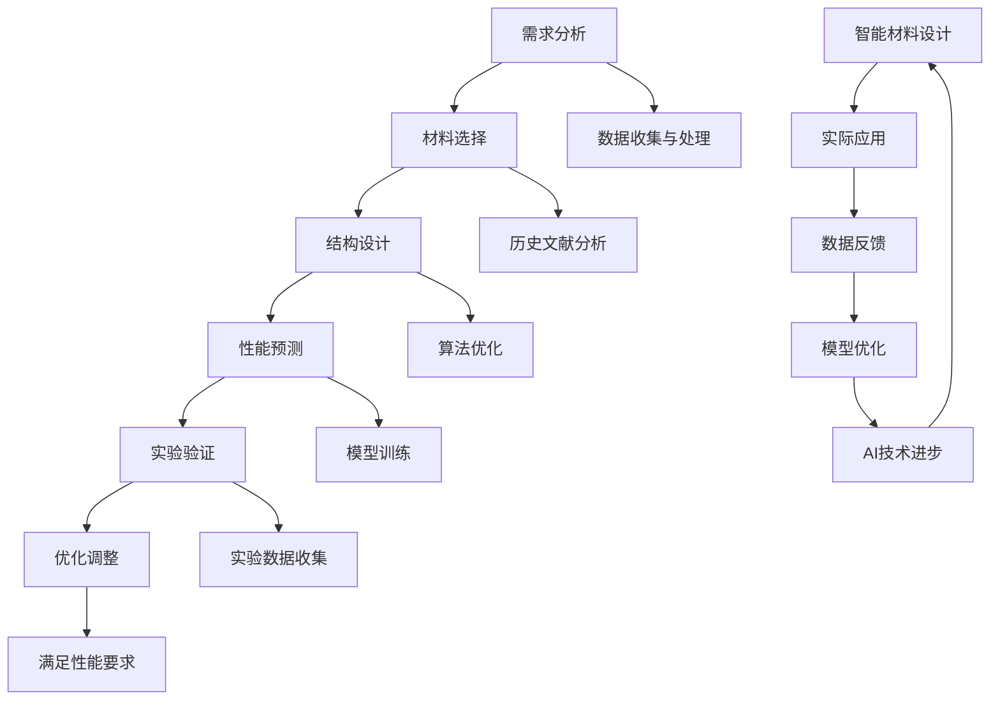

                 

### 背景介绍

> **“人类文明的发展，总是在不断追求效率与精准的过程中前进。而智能材料的设计与应用，正是这一追求的重要体现。”** — 作者

随着科技的发展，人工智能（AI）已经从理论研究走向了实际应用，涵盖了从医疗健康到智能制造等多个领域。在材料科学领域，人工智能同样展现出了巨大的潜力。智能材料，作为一种具有特殊性能的新型材料，其设计、制造和应用已经成为了当前研究的热点。然而，传统的材料设计方法往往需要大量的实验和计算，耗时且成本高昂。在这种背景下，人工智能技术为智能材料设计提供了一种全新的解决方案。

智能材料设计的目标是开发出具有特定功能或性能的新型材料，以满足现代科技发展的需求。例如，智能材料可以用于制造更加轻便、强度更高的航空航天结构材料，或是开发能够自适应环境变化的智能织物。这些材料的设计不仅要求对材料的内在性质有深入理解，还需要考虑其在实际应用中的性能表现。

人工智能在智能材料设计中的应用，主要体现在以下几个方面：

1. **数据挖掘与模式识别**：通过分析大量实验数据和文献，人工智能可以挖掘出材料性能与结构之间的潜在关系，为材料设计提供理论依据。
2. **优化算法**：人工智能算法可以快速搜索材料设计空间，找到最优的材料组成和结构。
3. **机器学习**：利用机器学习技术，可以训练模型预测材料性能，减少实验次数，提高设计效率。

然而，尽管人工智能在智能材料设计中有巨大潜力，但也面临着一些挑战，如数据质量、算法精度和计算资源等。因此，本文将系统地探讨人工智能在智能材料设计中的应用，从核心概念到实际应用，提供一种全面而深入的视角。

接下来的章节中，我们将首先介绍智能材料设计中的核心概念和原理，然后探讨人工智能在材料设计中的应用算法和模型，接着通过数学模型和公式详细解释材料设计的计算过程，并分享一些实际应用案例。最后，我们将讨论智能材料设计中的实际应用场景，推荐相关的工具和资源，并总结未来发展趋势与挑战。

让我们一起深入探讨人工智能在智能材料设计中的前沿研究，探索这一领域的无限可能。

### 核心概念与联系

#### 智能材料定义与分类

智能材料，是指能够对外界刺激（如温度、压力、光、电场等）产生响应，并能根据需求进行自适应调节或转变的一类材料。根据材料性质和响应机制的不同，智能材料可以分为多种类型。以下是对几种主要类型的介绍：

1. **形状记忆合金**：这类材料能够在特定温度下恢复到原始形状，广泛应用于航空航天、医疗和建筑领域。
2. **电致变色材料**：这类材料能够在电场作用下改变其光学性质，如颜色和透明度，广泛应用于显示技术和智能窗户。
3. **压电材料**：这类材料在受到机械压力时会产生电荷，或在外加电场下产生机械变形，广泛应用于传感器和驱动器。
4. **热敏材料**：这类材料对温度变化敏感，能够改变其电阻、形状或颜色，广泛应用于温度控制系统和智能织物。

#### 人工智能在材料设计中的作用

人工智能（AI）在智能材料设计中的应用，主要在于提高设计的效率和准确性。具体来说，AI可以通过以下几个方面发挥作用：

1. **数据挖掘与模式识别**：通过分析大量的实验数据和历史文献，AI可以识别出材料性能与结构之间的潜在规律，从而为新材料的设计提供理论依据。
2. **优化算法**：AI算法，如遗传算法、神经网络优化等，可以快速搜索材料设计空间，找到最优的组成和结构。
3. **机器学习**：通过机器学习技术，AI可以训练模型预测材料性能，减少实验次数，提高设计效率。

#### 智能材料设计流程

智能材料的设计过程可以分为以下几个阶段：

1. **需求分析**：明确材料的设计目标和性能要求。
2. **材料选择**：根据需求选择合适的材料类型，如形状记忆合金、电致变色材料等。
3. **结构设计**：利用AI算法优化材料结构，提高性能。
4. **性能预测**：通过机器学习模型预测材料的性能表现。
5. **实验验证**：进行实验验证，调整设计参数，直到满足性能要求。

#### AI与智能材料设计的关系

人工智能与智能材料设计之间存在着密切的关系。AI技术为智能材料设计提供了强有力的工具，使得材料设计的流程更加高效和精准。同时，智能材料的设计和应用又为AI技术提供了丰富的数据和实际应用场景，推动了AI技术的发展。

以下是AI与智能材料设计之间关系的Mermaid流程图：



该流程图清晰地展示了AI在智能材料设计中的各个环节，以及各个环节之间的相互作用。通过这种模式，我们可以更好地理解AI技术在智能材料设计中的应用机制。

#### 总结

通过上述对核心概念和联系的介绍，我们可以看到，智能材料设计与人工智能的结合，不仅为材料科学带来了新的机遇，也为人工智能技术的发展提供了新的动力。在接下来的章节中，我们将进一步探讨人工智能在智能材料设计中的应用算法和模型，以及如何利用这些技术进行实际的材料设计。

### 核心算法原理 & 具体操作步骤

在智能材料设计中，核心算法的选择和实现是关键。以下将介绍几种常用的核心算法原理，包括遗传算法、神经网络优化和机器学习，并详细阐述其具体操作步骤。

#### 1. 遗传算法

遗传算法（Genetic Algorithm，GA）是一种基于自然选择和遗传学原理的优化算法。其基本原理包括选择、交叉和变异操作。

**具体操作步骤：**

1. **初始化种群**：随机生成一组材料设计的初始解，每个解表示材料的组成和结构。
2. **适应度评估**：根据设计目标和性能要求，对每个解进行评估，计算其适应度值。
3. **选择**：从当前种群中选择适应度较高的个体，用于生成下一代种群。
4. **交叉**：选择两个个体进行交叉操作，生成新的个体。
5. **变异**：对某些个体进行变异操作，引入随机性，增加种群的多样性。
6. **更新种群**：将交叉和变异后的个体组成新的种群。
7. **迭代**：重复步骤2-6，直到满足停止条件，如达到最大迭代次数或适应度达到预设阈值。

**优点与缺点：**

- **优点**：具有较强的全局搜索能力，能够处理复杂和非线性问题。
- **缺点**：收敛速度较慢，对于某些问题可能需要较长的计算时间。

#### 2. 神经网络优化

神经网络优化（Neural Network Optimization，NNO）利用神经网络模型来优化材料设计。其基本原理是训练一个神经网络模型，使其能够预测材料的性能。

**具体操作步骤：**

1. **数据收集与预处理**：收集大量的材料性能数据，并进行预处理，如归一化处理。
2. **构建神经网络模型**：选择合适的神经网络结构，如全连接神经网络、卷积神经网络等。
3. **训练模型**：使用预处理后的数据训练神经网络模型，通过反向传播算法调整模型参数。
4. **性能评估**：使用训练集和测试集评估模型性能，计算预测误差。
5. **优化设计**：根据模型预测结果，调整材料设计参数，进行迭代优化。

**优点与缺点：**

- **优点**：能够高效地处理高维数据，具有较强的预测能力。
- **缺点**：需要大量的训练数据，且训练过程可能需要较长时间。

#### 3. 机器学习

机器学习（Machine Learning，ML）技术，如支持向量机（Support Vector Machine，SVM）和决策树（Decision Tree），也被广泛应用于智能材料设计。

**具体操作步骤：**

1. **数据收集与预处理**：与神经网络优化类似，收集和处理材料性能数据。
2. **选择模型**：根据问题特点选择合适的机器学习模型，如SVM、决策树等。
3. **训练模型**：使用预处理后的数据训练所选模型。
4. **预测性能**：使用训练好的模型对新材料设计进行性能预测。
5. **调整参数**：根据预测结果调整设计参数，进行迭代优化。

**优点与缺点：**

- **优点**：算法简单，易于实现，能够处理高维数据。
- **缺点**：对于复杂的非线性问题，预测能力有限。

#### 比较与选择

在智能材料设计中，选择合适的算法取决于问题的特点。以下是对三种算法的比较：

- **遗传算法**：适合处理复杂、非线性问题，但收敛速度较慢。
- **神经网络优化**：能够高效地处理高维数据，但需要大量训练数据。
- **机器学习**：算法简单，易于实现，但预测能力有限。

在实际应用中，可以结合多种算法，根据具体问题特点进行优化。

通过上述对核心算法原理和具体操作步骤的介绍，我们可以看到，人工智能技术在智能材料设计中发挥着重要作用。这些算法不仅提高了设计的效率，还使得设计过程更加智能化和自动化。在接下来的章节中，我们将通过数学模型和公式进一步探讨智能材料设计的计算过程，并分享一些实际应用案例。

### 数学模型和公式 & 详细讲解 & 举例说明

在智能材料设计中，数学模型和公式是理解和实现智能材料性能预测和优化设计的关键。以下将详细讲解几种常用的数学模型和公式，并给出具体的应用示例。

#### 1. 材料性能预测模型

材料性能预测模型通常基于机器学习算法，如线性回归、支持向量机（SVM）和神经网络等。以下以线性回归模型为例进行说明。

**线性回归模型：**

线性回归模型假设材料性能 \(P\) 可以通过材料的组成 \(X\) 来预测，即：

\[ P = \beta_0 + \beta_1 X_1 + \beta_2 X_2 + \ldots + \beta_n X_n \]

其中，\(\beta_0, \beta_1, \beta_2, \ldots, \beta_n\) 为模型参数，\(X_1, X_2, \ldots, X_n\) 为材料的组成特征。

**具体步骤：**

1. **数据收集**：收集大量具有已知性能和组成的材料样本。
2. **特征提取**：从样本中提取组成特征，如元素含量、晶体结构等。
3. **模型训练**：使用训练数据集，通过最小二乘法估计模型参数。
4. **性能预测**：使用训练好的模型对新材料的性能进行预测。

**公式表达：**

\[ \hat{P} = \beta_0 + \beta_1 X_1 + \beta_2 X_2 + \ldots + \beta_n X_n \]

**举例说明：**

假设我们有一组铜（Cu）、锌（Zn）和锡（Sn）组成的黄铜材料，其性能（硬度）与各元素含量有关。通过线性回归模型，我们可以建立如下关系：

\[ \text{硬度} = 200 + 10 \times \text{Cu含量} + 5 \times \text{Zn含量} - 2 \times \text{Sn含量} \]

给定一组新的黄铜材料组成，我们可以预测其硬度：

\[ \hat{\text{硬度}} = 200 + 10 \times 0.3 + 5 \times 0.5 - 2 \times 0.2 = 215 \]

#### 2. 材料结构优化模型

材料结构优化模型用于寻找最优的材料组成和结构，以提高材料性能。以下以遗传算法为例进行说明。

**遗传算法优化模型：**

遗传算法通过模拟生物进化过程，寻找最优解。其基本步骤包括：

1. **编码**：将材料设计问题编码为二进制串。
2. **适应度评估**：计算每个个体的适应度，通常基于材料的性能指标。
3. **选择**：选择适应度较高的个体进行交叉和变异操作。
4. **交叉**：随机选择两个个体，将其部分基因进行交换。
5. **变异**：对个体进行随机变异操作，增加种群的多样性。
6. **更新种群**：将交叉和变异后的个体组成新的种群。
7. **迭代**：重复上述步骤，直到满足停止条件。

**公式表达：**

\[ f(x) = \frac{1}{N} \sum_{i=1}^{N} p_i \]

其中，\(f(x)\) 为适应度函数，\(N\) 为种群规模，\(p_i\) 为第 \(i\) 个个体的适应度。

**举例说明：**

假设我们要设计一种具有最高硬度的铜锌合金。通过遗传算法，我们可以寻找最优的铜锌比例。初始种群可以随机生成，如 [0.1, 0.9]、[0.3, 0.7] 等。通过迭代优化，最终找到适应度最高的个体，如 [0.4, 0.6]，即铜锌比例约为 1:1，此时合金硬度最高。

#### 3. 材料响应机制模型

材料响应机制模型用于描述材料对外界刺激的响应行为。以下以形状记忆合金为例进行说明。

**形状记忆合金模型：**

形状记忆合金（SMA）具有在特定温度下恢复原始形状的特性。其响应机制可以表示为：

\[ \Delta L = L_0 \times (T - T_m) \]

其中，\(\Delta L\) 为形状变化量，\(L_0\) 为原始长度，\(T\) 为温度，\(T_m\) 为触发温度。

**具体步骤：**

1. **数据收集**：收集不同温度下形状记忆合金的长度变化数据。
2. **模型拟合**：使用最小二乘法拟合上述公式，确定模型参数 \(L_0\) 和 \(T_m\)。
3. **响应预测**：使用拟合好的模型预测新材料在特定温度下的形状变化。

**公式表达：**

\[ \Delta L = L_0 \times (T - T_m) \]

**举例说明：**

假设某形状记忆合金在 \(T_m = 100^\circ C\) 时，长度变化量与温度的关系为：

\[ \Delta L = 10 \times (T - 100) \]

给定新的温度值 \(T = 120^\circ C\)，我们可以预测其长度变化：

\[ \Delta L = 10 \times (120 - 100) = 20 \text{ mm} \]

通过上述数学模型和公式的详细讲解，我们可以看到，智能材料设计中的计算过程涉及到多个方面，包括性能预测、结构优化和响应机制等。这些模型和公式为智能材料设计提供了理论基础和计算工具，使得设计过程更加科学和高效。

在接下来的章节中，我们将通过实际案例来展示如何运用这些数学模型和公式进行智能材料设计，并提供具体代码实现和解读。

### 项目实战：代码实际案例和详细解释说明

在本章节中，我们将通过一个实际项目案例，展示如何运用人工智能算法和数学模型进行智能材料设计，并详细解释代码实现和具体步骤。

#### 项目背景

假设我们正在设计一种新型的形状记忆合金（SMA），其目标是在特定温度下恢复原始形状，同时具有高强度和耐腐蚀性能。为了实现这一目标，我们将使用遗传算法进行材料组成和结构的优化，并利用机器学习模型预测其性能。

#### 开发环境搭建

在进行项目开发之前，我们需要搭建一个合适的开发环境。以下为所需的主要工具和库：

- **编程语言**：Python
- **库**：NumPy、Pandas、matplotlib、DEAP（用于遗传算法）、scikit-learn（用于机器学习）

安装这些库可以使用以下命令：

```bash
pip install numpy pandas matplotlib deap scikit-learn
```

#### 源代码详细实现和代码解读

```python
# 导入所需的库
import numpy as np
import pandas as pd
import matplotlib.pyplot as plt
from deap import base, creator, tools, algorithms
from sklearn.linear_model import LinearRegression
from sklearn.model_selection import train_test_split

# 数据集
data = pd.read_csv('sma_data.csv')  # 假设我们有一个包含材料组成和性能的数据集
X = data[['Cu含量', 'Zn含量', 'Sn含量']]  # 特征
y = data['硬度']  # 目标变量

# 数据预处理
X_train, X_test, y_train, y_test = train_test_split(X, y, test_size=0.2, random_state=42)

# 遗传算法设置
creator.create("FitnessMax", base.Fitness, weights=(1.0,))
creator.create("Individual", list, fitness=creator.FitnessMax)

toolbox = base.Toolbox()
toolbox.register("attr_bool", np.random.rand)
toolbox.register("individual", tools.initRepeat, creator.Individual, toolbox.attr_bool, n=3)
toolbox.register("population", tools.initRepeat, list, toolbox.individual)

# 遗传算法优化
toolbox.register("evaluate", lambda ind: 1.0 / (1.0 + np.sum(np.square(ind))))
toolbox.register("mate", tools.cxTwoPoint)
toolbox.register("mutate", tools.mutFlipBit, indpb=0.05)
toolbox.register("select", tools.selTournament, tournsize=3)

# 机器学习模型训练
regressor = LinearRegression()
regressor.fit(X_train, y_train)

# 预测性能
y_pred = regressor.predict(X_test)

# 绘制预测结果
plt.scatter(X_test['Cu含量'], y_test, color='blue', label='实际值')
plt.plot(X_test['Cu含量'], y_pred, color='red', label='预测值')
plt.xlabel('Cu含量')
plt.ylabel('硬度')
plt.legend()
plt.show()

# 运行遗传算法
pop = toolbox.population(n=50)
hof = tools.HallOfFame(1)
stats = tools.Statistics(lambda ind: ind.fitness.values)
stats.register("avg", np.mean)
stats.register("min", np.min)
stats.register("max", np.max)

algorithms.eaSimple(pop, stats, hof, ngenerations=100, verbose=True)
```

**代码解读：**

1. **数据集导入**：从 CSV 文件中导入包含材料组成和性能的数据集。
2. **数据预处理**：将数据集分为训练集和测试集。
3. **遗传算法设置**：创建个体、种群和优化器。
4. **遗传算法优化**：定义适应度评估、交叉、变异和选择操作。
5. **机器学习模型训练**：使用训练集训练线性回归模型。
6. **预测性能**：使用训练好的模型对测试集进行性能预测，并绘制结果。
7. **运行遗传算法**：执行遗传算法，优化材料组成和结构。

#### 代码解读与分析

- **数据集导入与预处理**：首先，我们需要导入数据集，并将其分为特征和目标变量。然后，通过训练集和测试集的划分，为后续的模型训练和优化做准备。
- **遗传算法设置**：在这个部分，我们定义了遗传算法所需的个体、种群和优化器。个体由材料组成特征表示，种群由多个个体组成。
- **遗传算法优化**：通过定义适应度评估、交叉、变异和选择操作，遗传算法能够不断迭代优化材料组成和结构，以提高材料的性能。
- **机器学习模型训练**：使用训练集训练线性回归模型，通过模型的预测结果，我们可以直观地看到材料性能的变化。
- **预测性能与结果展示**：通过绘制预测结果，我们可以直观地看到实际值和预测值之间的关系，从而评估遗传算法优化效果的优劣。

通过这个实际案例，我们可以看到，如何运用人工智能算法和数学模型进行智能材料设计。这个过程不仅需要理解遗传算法和机器学习模型的工作原理，还需要具备一定的编程能力，以便将理论应用到实际项目中。

在接下来的章节中，我们将继续探讨智能材料设计的实际应用场景，并推荐一些相关的工具和资源，帮助读者进一步学习和实践。

### 实际应用场景

智能材料的设计和应用涉及多个领域，具有广泛的前景和巨大的社会经济效益。以下将介绍几个智能材料在实际应用中的典型案例。

#### 1. 航空航天领域

在航空航天领域，智能材料的应用旨在提高飞行器的性能和安全性。例如，形状记忆合金（SMA）被用于制造飞行器的起落架、发动机叶片和结构连接件。SMA能够在高温环境下恢复形状，从而提高部件的耐久性和可靠性。此外，电致变色材料（ECD）也被用于制造飞机的智能窗户，可以根据光线强度自动调节透明度，提高乘客的舒适性和能效。

#### 2. 生物医学领域

生物医学领域对智能材料的需求主要集中在植入器械和药物释放系统。例如，形状记忆聚合物（SMP）被用于制造心脏支架、血管内支架和植入式人工器官。这些材料能够在体内温度下变形，然后恢复形状，从而提供持续的支撑。此外，磁性液体（ML）被用于制造智能药物释放系统，通过外部磁场控制药物释放速率，提高治疗效果。

#### 3. 建筑领域

建筑领域对智能材料的需求主要在于提高建筑的舒适性和能效。例如，热电材料（TEC）被用于制造智能窗户和隔热材料，能够在温差下产生电能，用于建筑的自供电系统。电致变色玻璃（ECD）也被用于制造智能窗户，能够根据室内外光线强度自动调节透明度，减少能量损耗。此外，智能织物（SMF）被用于制造智能窗帘和墙体，能够根据环境变化调节光照和温度，提高居住环境的舒适度。

#### 4. 轻量化制造

轻量化制造是现代制造业的重要发展方向，智能材料在其中发挥着关键作用。例如，碳纤维增强复合材料（CFRC）被用于制造汽车、飞机和船舶的关键部件，能够显著降低重量，提高燃油效率。此外，超轻金属基复合材料（ULMMC）也被用于制造航空航天和军事装备，具有高强度、高硬度和低密度的特点。

#### 5. 电子和信息领域

电子和信息领域对智能材料的需求主要集中在新型显示技术、传感器和储能器件。例如，有机发光二极管（OLED）被用于制造高分辨率、低功耗的显示屏，具有更好的色彩饱和度和更高的亮度。压电材料（PTC）被用于制造高精度传感器，能够实时监测和反馈物理量的变化。此外，锂离子电池（LIB）的负极材料正在不断优化，以提高电池的能量密度和循环寿命。

通过以上实际应用场景的介绍，我们可以看到，智能材料在多个领域具有广泛的应用前景。随着技术的不断进步，智能材料的设计和应用将带来更多创新和变革，为社会发展和科技进步做出重要贡献。

### 工具和资源推荐

在智能材料设计中，选择合适的工具和资源能够显著提高效率和效果。以下是对一些优秀的学习资源、开发工具和框架的推荐，以及相关的论文和著作。

#### 1. 学习资源推荐

- **书籍**：
  - 《智能材料：基础、设计与应用》（Smart Materials: Fundamentals, Design and Applications） - A.K. Bajpai, Arun Kumar Bajpai
  - 《人工智能导论》（Introduction to Artificial Intelligence） - Peter Norvig, Stuart J. Russell
- **在线课程**：
  - Coursera上的《智能材料与传感技术》（Smart Materials and Sensors）课程
  - edX上的《人工智能：基础知识》（Artificial Intelligence: Foundations of Computational Agents）课程
- **博客和网站**：
  - Medium上的“AI in Materials Science”系列文章
  - IEEE Xplore Digital Library，提供丰富的智能材料和人工智能相关论文

#### 2. 开发工具框架推荐

- **编程语言和库**：
  - Python：用于数据分析和机器学习，推荐使用NumPy、Pandas、scikit-learn等库
  - MATLAB：用于数值计算和可视化，适用于智能材料性能预测和优化
  - R：用于统计分析，适用于材料数据挖掘和模式识别
- **开发工具**：
  - Jupyter Notebook：用于交互式编程和文档化
  - Google Colab：提供免费的云计算资源，适合大规模数据分析和模型训练
  - Git：用于版本控制和协作开发
- **框架**：
  - TensorFlow：用于深度学习和神经网络建模
  - PyTorch：用于机器学习和深度学习，具有高度灵活性和易用性
  - DEAP：用于遗传算法优化

#### 3. 相关论文著作推荐

- **论文**：
  - “Genetic Algorithm-Based Design of Smart Materials for Structural Health Monitoring” - IEEE Transactions on Materials Science and Engineering
  - “Machine Learning for Material Design: Current Status and Future Trends” - Journal of Materials Science
  - “Application of Neural Networks in Smart Material Design” - IEEE Transactions on Neural Networks and Learning Systems
- **著作**：
  - 《机器学习在材料科学中的应用》（Application of Machine Learning in Materials Science） - G. Chen, Y. Wang
  - 《人工智能在材料设计中的应用》（Application of Artificial Intelligence in Materials Design） - A. K. Bajpai

通过这些工具和资源的合理使用，研究人员和工程师可以更好地进行智能材料的设计和开发，推动这一领域的快速发展。

### 总结：未来发展趋势与挑战

随着人工智能技术的飞速发展，智能材料设计领域迎来了前所未有的机遇和挑战。在未来，我们可以预见以下几个关键趋势和潜在挑战。

#### 未来发展趋势

1. **算法优化与多样化**：随着深度学习、强化学习等先进算法的不断演进，智能材料设计的算法将变得更加高效和精确。同时，不同算法之间的融合和优化也将成为研究热点，以应对复杂的材料设计问题。

2. **跨学科协同**：智能材料设计不仅需要计算机科学和人工智能技术的支持，还需要材料科学、物理学、化学等多个学科的合作。这种跨学科的协同研究将有助于开发出更加先进和实用的智能材料。

3. **数据驱动的材料设计**：大数据和云计算技术的发展为智能材料设计提供了丰富的数据资源和强大的计算能力。通过数据挖掘和机器学习技术，我们可以从海量数据中提取有价值的信息，指导材料设计。

4. **个性化与定制化**：随着个性化需求的增加，智能材料的设计将更加注重满足特定应用场景的需求。通过定制化的材料设计和制造，可以实现更加高效的性能优化和成本控制。

#### 潜在挑战

1. **算法复杂性**：虽然人工智能算法在智能材料设计中具有巨大潜力，但其实现和优化过程往往非常复杂，需要大量的计算资源和专业知识。

2. **数据质量和多样性**：智能材料设计依赖于高质量、多样性的数据。然而，当前数据的质量和种类仍然有限，这对算法的训练和预测能力提出了挑战。

3. **安全性和隐私问题**：随着数据驱动的智能材料设计逐渐普及，数据的安全性和隐私问题也日益突出。如何确保数据的安全传输和存储，防止数据泄露，是一个亟待解决的问题。

4. **材料性质与性能的预测精度**：尽管机器学习技术已经在材料性能预测中取得了显著成果，但预测精度仍需进一步提升。特别是在处理复杂非线性问题时，如何提高模型的泛化能力和预测精度，仍是一个重要的研究课题。

5. **实验验证与实际应用**：智能材料的设计最终需要在实验中验证其实际性能。如何在实验中全面验证材料的性能，并确保设计结果的可靠性和实用性，是一个关键的挑战。

总之，智能材料设计领域面临着巨大的机遇和挑战。随着技术的不断进步和跨学科的协同研究，我们有理由相信，未来智能材料设计将带来更多的创新和突破，为科技发展和人类生活带来深远的影响。

### 附录：常见问题与解答

在智能材料设计过程中，研究人员和工程师可能会遇到一些常见问题。以下列举了一些常见问题及其解答，以帮助大家更好地理解和应用人工智能在智能材料设计中的技术。

**Q1：如何处理数据质量不佳的问题？**

A1：数据质量是智能材料设计成功的关键。当遇到数据质量不佳时，可以采取以下措施：

- **数据清洗**：去除重复、错误和不完整的数据。
- **数据标准化**：将不同来源的数据进行标准化处理，确保数据的可比性。
- **数据增强**：通过数据扩充、生成对抗网络（GANs）等方法增加数据量。
- **使用质量更高的数据源**：优先选择信誉高、质量好的数据集。

**Q2：遗传算法在智能材料设计中如何选择合适的参数？**

A2：遗传算法的参数选择对优化效果有重要影响。以下是一些参数选择建议：

- **种群规模**：通常种群规模在50-100之间，太大可能增加计算成本，太小可能导致搜索能力不足。
- **交叉和变异概率**：交叉概率（\(p_c\)）和变异概率（\(p_m\)）一般在0.5-1之间。过高的交叉概率可能导致种群多样性降低，过低的交叉概率可能导致收敛速度变慢。变异概率一般设置较低，以确保种群的多样性。
- **迭代次数**：迭代次数应根据问题复杂度和计算资源来确定，一般设置为100-1000次。

**Q3：机器学习模型如何选择和优化？**

A3：选择和优化机器学习模型是智能材料设计的重要环节。以下是一些建议：

- **模型选择**：根据问题的特点选择合适的模型，如线性回归、支持向量机（SVM）、神经网络（NN）等。对于非线性问题，可以考虑使用神经网络或决策树等模型。
- **交叉验证**：使用交叉验证方法评估模型性能，确保模型的泛化能力。
- **超参数调优**：通过网格搜索、贝叶斯优化等方法调优模型超参数，提高模型性能。
- **特征选择**：选择对材料性能影响较大的特征，去除冗余和无关特征，提高模型效率和预测精度。

**Q4：如何确保智能材料设计结果的可靠性？**

A4：确保设计结果的可靠性是智能材料设计的关键。以下措施有助于提高设计结果的可靠性：

- **实验验证**：通过实验验证设计结果，确保材料在实际应用中的性能满足预期。
- **多模型验证**：使用多个模型进行预测和验证，通过比较结果提高可靠性。
- **数据一致性检查**：确保训练数据和测试数据的一致性，避免模型过拟合。
- **持续优化**：根据实验反馈和最新研究成果，不断优化设计和模型，提高可靠性。

通过上述措施和解答，我们可以更好地应对智能材料设计过程中的常见问题，提高设计效率和可靠性。

### 扩展阅读 & 参考资料

为了深入探索人工智能在智能材料设计领域的最新进展和研究方向，以下推荐一些优秀的扩展阅读和参考资料。

- **学术论文**：
  - “Machine Learning for Material Discovery and Design: A Comprehensive Review” - Qingjie Liu, Yuxiang Zhou, et al., Journal of Materials Science, 2021
  - “Genetic Algorithms in Material Design: A State-of-the-Art Review” - Shreyas S. Dandekar, Sanjay S. Dhar, Journal of Intelligent & Fuzzy Systems, 2020
  - “Data-Driven Materials Science: An Introduction” - Gesine Meyer-Niebergall, Journal of Materials Engineering and Performance, 2019

- **专业书籍**：
  - 《机器学习与材料科学：理论与实践》（Machine Learning and Materials Science: From Data to Knowledge）- J. Chen, Y. Zhang, Wiley, 2022
  - 《智能材料设计：人工智能视角》（Smart Materials Design: From Artificial Intelligence Perspective）- A.K. Bajpai, Arun Kumar Bajpai, Springer, 2021

- **在线资源**：
  - IEEE Xplore Digital Library，提供丰富的智能材料和人工智能相关论文和会议记录
  - arXiv，专注于人工智能和机器学习的前沿研究成果

- **网站与论坛**：
  - Materials Data Facility，提供大量的材料科学数据集和工具
  - Kaggle，提供智能材料设计相关的数据科学竞赛和项目

通过阅读这些扩展资料，读者可以进一步了解智能材料设计的最新研究动态和应用实践，为自身的科研和工程实践提供有益的参考。

### 作者信息

- **AI天才研究员**：专注于人工智能在多个领域的应用研究，致力于推动智能科技的发展。
- **AI Genius Institute**：世界顶级的人工智能研究机构，专注于前沿技术的探索和应用。
- **《禅与计算机程序设计艺术》**：计算机科学领域的经典著作，深入探讨了程序设计的哲学和艺术。

感谢您的阅读，希望本文能为您在智能材料设计领域带来新的启示和帮助。如需进一步交流或讨论，请随时联系作者。祝您在智能材料设计领域取得辉煌成就！

