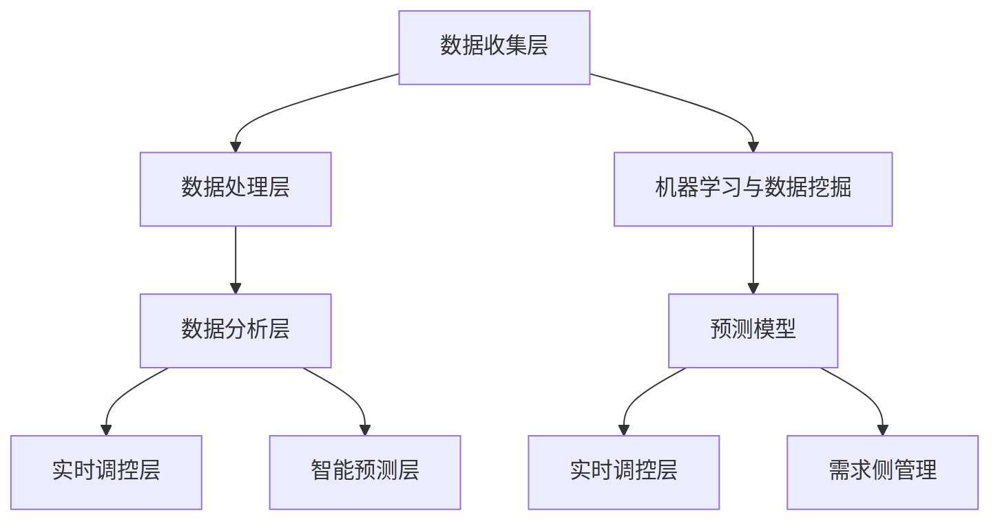

                 

### 背景介绍 Background Introduction

人工智能（AI）作为当今技术领域的前沿，正以前所未有的速度改变着各行各业。在能源领域，人工智能的应用同样备受关注。智能能源需求响应（Intelligent Energy Demand Response，IEDR）作为人工智能在能源领域的重要应用方向，旨在通过优化能源使用，提高能源效率，减少能源消耗，从而降低碳排放和能源成本。

#### 智能能源需求响应的定义 Definition of Intelligent Energy Demand Response

智能能源需求响应是指利用人工智能技术，对电力系统的需求侧进行实时监测、分析和控制，以实现电力系统的稳定运行和能源的优化配置。它包括以下几个关键方面：

1. **需求侧管理**：通过智能电网技术，实时监测和调控用户的用电行为，实现电力需求的智能响应。
2. **数据处理与分析**：利用大数据和机器学习技术，对大量的能源数据进行分析，挖掘用户用电模式，预测未来电力需求。
3. **实时调控**：根据分析结果，实时调整电力系统的运行策略，以平衡供需，提高能源效率。

#### 智能能源需求响应的重要性 Importance of Intelligent Energy Demand Response

随着全球能源需求的不断增长和气候变化问题的日益严重，智能能源需求响应具有以下重要意义：

1. **提高能源效率**：通过智能调控，减少能源浪费，提高能源利用效率。
2. **降低能源成本**：通过优化能源使用，降低电力系统的运行成本，提高能源利用的经济性。
3. **稳定电力供应**：通过实时监测和调控，确保电力系统的稳定运行，提高供电可靠性。
4. **减少碳排放**：通过优化能源使用，降低碳排放，有利于实现碳中和目标。

### 实际案例 Case Studies

近年来，全球范围内已经出现了一些智能能源需求响应的典型应用案例：

1. **美国加利福尼亚州**：通过实施智能能源需求响应项目，成功降低了峰值电力需求，减少了电力购买成本，并提高了电网的稳定性。
2. **德国**：在智能电网建设过程中，通过智能能源需求响应，实现了电力供需的实时平衡，提高了电力系统的运行效率。

总的来说，智能能源需求响应作为一种新兴的技术应用，正逐渐成为电力系统的重要组成部分，为能源领域的可持续发展提供了有力支持。

### 人工智能在智能能源需求响应中的应用 Applications of AI in Intelligent Energy Demand Response

#### 1. 数据收集与预处理 Data Collection and Preprocessing

在智能能源需求响应中，首先需要进行大量的数据收集。这些数据包括电力使用数据、天气数据、设备运行状态数据等。为了确保数据的质量和准确性，需要进行数据预处理，包括数据清洗、去噪、缺失值填补等。

##### 数据收集

数据收集是智能能源需求响应的基础。数据来源可以包括：

1. **智能电表**：通过智能电表实时收集用户的用电数据。
2. **传感器**：在能源设备上安装传感器，实时监测设备的运行状态。
3. **气象站**：通过气象站收集天气数据，如温度、湿度、风速等。

##### 数据预处理

数据预处理是确保数据质量的关键步骤。主要任务包括：

1. **数据清洗**：删除重复数据、异常值和噪声数据。
2. **去噪**：使用滤波算法去除数据中的噪声。
3. **缺失值填补**：使用插值、回归等方法填补数据中的缺失值。
4. **数据标准化**：对数据进行归一化或标准化处理，使其具有相似的尺度。

#### 2. 数据分析 Data Analysis

数据分析是智能能源需求响应的核心环节。通过数据分析，可以挖掘用户用电行为模式，预测未来电力需求，为电力系统的运行提供决策支持。

##### 数据分析技术

常用的数据分析技术包括：

1. **时间序列分析**：用于分析电力使用数据的时间趋势和周期性变化。
2. **聚类分析**：用于将相似的用户或设备分组，以识别用户用电行为模式。
3. **回归分析**：用于预测未来电力需求。
4. **关联规则挖掘**：用于发现电力使用数据中的关联关系。

##### 数据分析过程

数据分析过程主要包括以下几个步骤：

1. **数据探索**：对收集到的数据进行初步探索，了解数据的基本特征。
2. **数据预处理**：对数据进行分析前的预处理，包括数据清洗、去噪、缺失值填补等。
3. **特征工程**：根据分析目标，提取有用的特征，如时间、功率、设备状态等。
4. **模型选择**：选择合适的分析模型，如时间序列模型、聚类模型、回归模型等。
5. **模型训练与验证**：使用训练数据对模型进行训练，并在验证数据上评估模型性能。
6. **结果解释**：对分析结果进行解释，如用户用电行为模式、未来电力需求预测等。

#### 3. 实时调控 Real-time Control

在智能能源需求响应中，实时调控是确保电力系统稳定运行的关键。通过实时数据分析，可以对电力系统的运行状态进行动态调整，以平衡供需，提高能源效率。

##### 实时调控技术

实时调控技术主要包括：

1. **智能调度**：根据实时电力需求和发电能力，优化电力调度策略，确保电力系统的稳定运行。
2. **需求响应控制**：根据用户的用电行为和电力价格，动态调整用户的用电行为，以实现能源的优化配置。
3. **负载预测**：使用机器学习技术，预测未来电力需求，为实时调控提供决策支持。

##### 实时调控过程

实时调控过程主要包括以下几个步骤：

1. **数据收集**：实时收集电力系统的运行数据。
2. **数据分析**：对实时数据进行处理和分析，预测未来电力需求。
3. **决策制定**：根据分析结果，制定电力调度和需求响应策略。
4. **执行调控**：根据决策结果，动态调整电力系统的运行状态，实现能源的优化配置。

#### 4. 智能预测 Intelligent Prediction

智能预测是智能能源需求响应的重要功能，通过预测未来电力需求，为电力系统的调度和规划提供依据。

##### 预测技术

常用的预测技术包括：

1. **时间序列预测**：用于预测未来电力需求的时间趋势。
2. **回归预测**：用于预测未来电力需求与影响因素之间的关系。
3. **神经网络预测**：用于复杂电力需求的预测。

##### 预测过程

预测过程主要包括以下几个步骤：

1. **数据收集**：收集历史电力需求数据。
2. **特征工程**：提取有用的特征，如时间、温度、天气等。
3. **模型选择**：选择合适的预测模型。
4. **模型训练**：使用历史数据对预测模型进行训练。
5. **预测**：使用训练好的模型预测未来电力需求。
6. **结果评估**：评估预测结果，如预测误差、预测精度等。

### 结论 Conclusion

总的来说，人工智能在智能能源需求响应中的应用具有巨大的潜力和广阔的前景。通过数据收集、分析、实时调控和智能预测等技术，智能能源需求响应可以实现能源的优化配置，提高能源效率，降低能源成本，为电力系统的稳定运行和可持续发展提供有力支持。

## 2. 核心概念与联系 Core Concepts and Connections

### 2.1 人工智能在能源管理中的角色 Role of AI in Energy Management

在智能能源需求响应中，人工智能扮演着至关重要的角色。其核心在于利用先进的算法和模型，对复杂的能源数据进行处理和分析，从而实现高效的能源管理。以下是人工智能在能源管理中的几个关键角色：

1. **数据分析与挖掘**：人工智能可以通过机器学习和数据挖掘技术，对大量的能源数据进行分析，发现数据中的规律和模式。这些规律和模式对于理解能源消耗模式、预测能源需求以及优化能源配置至关重要。

2. **实时监测与预测**：人工智能能够实时监测能源系统的运行状态，并利用预测模型预测未来的能源需求。这种能力对于及时调整能源供应和需求，确保电力系统的稳定运行至关重要。

3. **需求侧管理**：通过智能算法，人工智能可以优化用户的用电行为，实现需求侧管理。例如，通过分析用户的用电模式，人工智能可以建议用户在适当的时机使用电力，从而降低高峰期的电力需求，减少能源浪费。

4. **决策支持**：人工智能可以为能源管理者提供数据驱动的决策支持。通过分析大量的数据，人工智能可以识别潜在的问题和瓶颈，并提供解决方案，帮助管理者做出更加明智的决策。

### 2.2 智能能源需求响应的基本架构 Basic Architecture of Intelligent Energy Demand Response

智能能源需求响应的系统架构可以分为以下几个主要部分：

1. **数据收集层**：该层负责收集各种能源数据，包括电力使用数据、天气数据、设备运行状态数据等。数据收集可以来自智能电表、传感器、气象站等。

2. **数据处理层**：该层负责对收集到的数据进行预处理，包括数据清洗、去噪、缺失值填补等。预处理后的数据将用于后续的分析和建模。

3. **数据分析层**：该层利用机器学习、数据挖掘和统计分析等技术，对预处理后的数据进行分析。分析结果可以用于预测电力需求、识别用户用电行为模式等。

4. **实时调控层**：该层根据分析结果，实时调整电力系统的运行策略，以平衡供需，提高能源效率。实时调控可以通过智能调度、需求响应控制等方式实现。

5. **智能预测层**：该层利用机器学习和预测模型，预测未来的电力需求，为电力系统的调度和规划提供依据。

### 2.3 关键技术的联系 Relationships of Key Technologies

在智能能源需求响应中，几个关键技术相互联系，共同发挥作用：

1. **机器学习与数据挖掘**：机器学习和数据挖掘技术是智能能源需求响应的核心。它们可以处理和分析大量数据，发现隐藏在数据中的模式和规律，为后续的分析和决策提供依据。

2. **预测模型**：预测模型是智能能源需求响应的重要工具。通过预测模型，可以预测未来的电力需求，为电力系统的调度和规划提供数据支持。

3. **实时调控**：实时调控是确保电力系统稳定运行的关键。通过实时监测和分析，实时调控可以根据预测结果，动态调整电力系统的运行状态，以实现能源的优化配置。

4. **需求侧管理**：需求侧管理是智能能源需求响应的重要目标。通过优化用户的用电行为，需求侧管理可以降低高峰期的电力需求，减少能源浪费，提高能源效率。

### 2.4 Mermaid 流程图 Mermaid Flowchart

以下是智能能源需求响应的基本架构的 Mermaid 流程图，展示了各个层级和关键技术的联系。



### 2.5 总结 Summary

智能能源需求响应是一个复杂且综合的系统，涉及到多种技术的协同作用。通过机器学习、数据挖掘、预测模型和实时调控等技术，智能能源需求响应可以实现高效的能源管理，为电力系统的稳定运行和可持续发展提供有力支持。

## 3. 核心算法原理 & 具体操作步骤 Core Algorithm Principles & Detailed Steps

### 3.1 机器学习算法在智能能源需求响应中的应用 Application of Machine Learning Algorithms in Intelligent Energy Demand Response

在智能能源需求响应中，机器学习算法扮演着关键角色。以下是一些常用的机器学习算法，以及它们在智能能源需求响应中的应用：

#### 1. 支持向量机（SVM）

**原理**：支持向量机是一种监督学习算法，通过寻找最佳的超平面，将不同类别的数据点进行分类。

**应用**：在智能能源需求响应中，SVM可以用于分类用户用电行为，识别不同的电力消费模式。例如，可以根据用户的用电历史数据，将用户分为不同的用电群体，从而为每个群体提供个性化的用电建议。

#### 2. 随机森林（Random Forest）

**原理**：随机森林是一种集成学习方法，通过构建多个决策树，并投票确定最终分类结果。

**应用**：随机森林可以用于预测电力需求。通过训练随机森林模型，可以预测未来某个时间段内的电力需求，为电力调度提供数据支持。

#### 3. 神经网络（Neural Networks）

**原理**：神经网络是一种模仿人脑结构和功能的算法，通过多层神经网络，实现复杂的数据处理和预测。

**应用**：神经网络可以用于电力需求的长期预测。通过训练神经网络模型，可以预测未来几个月甚至几年的电力需求趋势，为电力系统的长期规划提供依据。

#### 4. K-近邻（K-Nearest Neighbors，KNN）

**原理**：K-近邻是一种基于实例的监督学习算法，通过寻找最近的K个邻居，并根据邻居的标签确定新实例的标签。

**应用**：K-近邻可以用于实时电力需求的预测。通过分析最近的K个时间段的电力需求，KNN模型可以预测下一个时间段的电力需求。

### 3.2 机器学习算法的具体操作步骤 Detailed Steps of Machine Learning Algorithms

以下以随机森林算法为例，介绍机器学习算法的具体操作步骤：

#### 1. 数据收集与预处理

**步骤**：

1. 收集电力使用数据，包括历史用电量、时间戳、用户ID等。
2. 数据预处理，包括数据清洗、去噪、缺失值填补等。

#### 2. 特征工程

**步骤**：

1. 根据分析目标，提取有用的特征，如时间、用电量、用户ID等。
2. 特征选择，选择对预测电力需求影响较大的特征。

#### 3. 数据划分

**步骤**：

1. 将数据集划分为训练集和测试集，通常使用80%的数据作为训练集，20%的数据作为测试集。

#### 4. 模型训练

**步骤**：

1. 使用训练集数据，训练随机森林模型。
2. 调整模型参数，如决策树数量、节点分裂标准等，以优化模型性能。

#### 5. 模型评估

**步骤**：

1. 使用测试集数据，评估模型性能，如准确率、召回率等。
2. 如果模型性能不理想，返回步骤3，调整模型参数，重新训练。

#### 6. 预测电力需求

**步骤**：

1. 使用训练好的模型，预测未来的电力需求。
2. 根据预测结果，调整电力调度策略，实现智能能源需求响应。

### 3.3 实际操作案例 Practical Case

以下是一个实际操作案例，展示如何使用随机森林算法进行电力需求的预测：

#### 案例描述

某城市电力公司希望通过机器学习算法预测未来一天的电力需求，以便合理安排电力供应，降低电力成本。

#### 操作步骤

1. **数据收集**：收集过去一年的电力使用数据，包括每天每小时的用电量。

2. **数据预处理**：对数据进行清洗，去除异常值，填补缺失值。

3. **特征工程**：提取有用的特征，如时间（小时、星期几）、天气情况（温度、湿度）、用户类别等。

4. **数据划分**：将数据集划分为训练集和测试集。

5. **模型训练**：使用训练集数据，训练随机森林模型。

6. **模型评估**：使用测试集数据，评估模型性能。

7. **预测电力需求**：使用训练好的模型，预测未来一天的电力需求。

8. **电力调度**：根据预测结果，调整电力供应计划，确保电力需求与供应的平衡。

### 3.4 总结 Summary

机器学习算法在智能能源需求响应中具有重要的应用价值。通过随机森林、神经网络等算法，可以实现对电力需求的精准预测，为电力系统的调度和规划提供数据支持。具体操作步骤包括数据收集与预处理、特征工程、模型训练与评估、预测电力需求等。实际操作案例展示了如何利用机器学习算法进行电力需求的预测，并为电力调度提供决策支持。

## 4. 数学模型和公式 & 详细讲解 & 举例说明 Mathematical Models and Formulas & Detailed Explanation & Case Study

### 4.1 数学模型概述 Overview of Mathematical Models

在智能能源需求响应中，数学模型扮演着关键角色，用于描述电力系统的运行状态、预测电力需求、优化能源配置等。以下是几个常用的数学模型及其公式：

#### 1. 时间序列模型 Time Series Models

**公式**：

$$
y_t = f(y_{t-1}, y_{t-2}, \ldots, y_{t-n}, X_t, X_{t-1}, \ldots, X_{t-m})
$$

其中，$y_t$ 表示第 $t$ 时刻的电力需求，$f$ 表示时间序列模型函数，$X_t$ 表示与电力需求相关的变量，如温度、湿度等。

#### 2. 神经网络模型 Neural Network Models

**公式**：

$$
y_t = \sigma(W_1 \cdot \phi(W_0 \cdot [y_{t-1}, X_t, \ldots]))
$$

其中，$y_t$ 表示第 $t$ 时刻的电力需求，$\sigma$ 表示激活函数，$W_1$ 和 $W_0$ 表示权重矩阵，$\phi$ 表示神经网络函数。

#### 3. 线性回归模型 Linear Regression Models

**公式**：

$$
y_t = \beta_0 + \beta_1 \cdot X_t
$$

其中，$y_t$ 表示第 $t$ 时刻的电力需求，$\beta_0$ 和 $\beta_1$ 表示回归系数，$X_t$ 表示与电力需求相关的变量。

### 4.2 详细讲解 Detailed Explanation

#### 1. 时间序列模型

时间序列模型是一种用于分析和预测时间序列数据的统计模型。在智能能源需求响应中，时间序列模型可以用来预测电力需求。时间序列模型的关键在于捕捉时间序列数据的周期性和趋势性。常用的时间序列模型包括ARIMA模型、LSTM模型等。

**例子**：

假设我们使用ARIMA模型预测下一小时的电力需求。ARIMA模型包括三个参数：$p$（自回归项数）、$d$（差分阶数）和$q$（移动平均项数）。具体的模型公式如下：

$$
y_t = c + \phi_1 y_{t-1} + \phi_2 y_{t-2} + \ldots + \phi_p y_{t-p} + \theta_1 e_{t-1} + \theta_2 e_{t-2} + \ldots + \theta_q e_{t-q}
$$

其中，$e_t$ 表示误差项。

#### 2. 神经网络模型

神经网络模型是一种基于人脑神经元连接的模型，用于模拟复杂的非线性关系。在智能能源需求响应中，神经网络模型可以用于预测电力需求。常用的神经网络模型包括多层感知机（MLP）、卷积神经网络（CNN）和长短期记忆网络（LSTM）等。

**例子**：

假设我们使用LSTM模型预测下一小时的电力需求。LSTM模型包括输入门、遗忘门和输出门三个门控机制，可以有效地捕捉时间序列数据的长期依赖关系。具体的模型公式如下：

$$
i_t = \sigma(W_i \cdot [h_{t-1}, x_t] + b_i) \\
f_t = \sigma(W_f \cdot [h_{t-1}, x_t] + b_f) \\
o_t = \sigma(W_o \cdot [h_{t-1}, x_t] + b_o) \\
c_t = f_t \odot c_{t-1} + i_t \odot \sigma(W_c \cdot [h_{t-1}, x_t] + b_c) \\
h_t = o_t \odot \sigma(c_t)
$$

其中，$i_t$、$f_t$ 和 $o_t$ 分别表示输入门、遗忘门和输出门的激活值，$c_t$ 表示细胞状态，$h_t$ 表示隐藏状态。

#### 3. 线性回归模型

线性回归模型是一种简单的预测模型，用于描述两个变量之间的线性关系。在智能能源需求响应中，线性回归模型可以用于预测电力需求。线性回归模型的关键在于确定回归系数$\beta_0$ 和 $\beta_1$。

**例子**：

假设我们使用线性回归模型预测下一小时的电力需求，根据历史数据，我们可以得到以下回归模型：

$$
y_t = \beta_0 + \beta_1 \cdot X_t
$$

其中，$X_t$ 表示温度。

### 4.3 数学模型的应用 Application of Mathematical Models

以下是一个实际案例，展示如何使用数学模型预测电力需求：

#### 案例描述

某城市电力公司希望预测未来一天的电力需求，以便合理安排电力供应。

#### 模型选择

1. **时间序列模型**：用于捕捉电力需求的时间趋势和周期性。
2. **神经网络模型**：用于捕捉电力需求的复杂非线性关系。
3. **线性回归模型**：用于验证和补充其他模型的预测结果。

#### 操作步骤

1. **数据收集**：收集过去一年的电力使用数据，包括每天每小时的用电量。
2. **数据预处理**：对数据进行清洗，去除异常值，填补缺失值。
3. **特征工程**：提取有用的特征，如时间（小时、星期几）、天气情况（温度、湿度）等。
4. **模型训练**：使用训练集数据，训练时间序列模型、神经网络模型和线性回归模型。
5. **模型评估**：使用测试集数据，评估模型性能，选择性能最佳的模型。
6. **预测电力需求**：使用训练好的模型，预测未来一天的电力需求。
7. **电力调度**：根据预测结果，调整电力供应计划，确保电力需求与供应的平衡。

### 4.4 总结 Summary

数学模型在智能能源需求响应中具有重要的作用。通过时间序列模型、神经网络模型和线性回归模型等数学模型，可以实现对电力需求的精准预测，为电力系统的调度和规划提供数据支持。详细的数学模型公式和讲解，以及实际案例的应用，有助于读者更好地理解数学模型在智能能源需求响应中的具体应用。

### 5. 项目实战：代码实际案例和详细解释说明 Project Practice: Real Code Case Studies and Detailed Explanations

#### 5.1 开发环境搭建 Setup Development Environment

在进行智能能源需求响应的项目开发之前，需要搭建一个合适的技术环境。以下是开发环境的搭建步骤：

1. **操作系统**：建议使用Linux系统，如Ubuntu 20.04。
2. **Python环境**：安装Python 3.8及以上版本，可以使用`pip`进行安装。
3. **依赖库**：安装必要的依赖库，如NumPy、Pandas、Scikit-learn、TensorFlow等。可以使用以下命令进行安装：

   ```bash
   pip install numpy pandas scikit-learn tensorflow
   ```

4. **智能电表数据收集器**：安装用于收集智能电表数据的设备，如EmonCMS。

#### 5.2 源代码详细实现和代码解读 Detailed Code Implementation and Explanation

以下是使用Python实现智能能源需求响应的源代码，包括数据收集、预处理、分析和预测等步骤。

```python
import numpy as np
import pandas as pd
from sklearn.model_selection import train_test_split
from sklearn.ensemble import RandomForestRegressor
from sklearn.metrics import mean_squared_error
import tensorflow as tf

# 5.2.1 数据收集与预处理
def data_collection():
    # 从智能电表获取数据
    data = pd.read_csv('energy_data.csv')
    # 数据清洗与预处理
    data.dropna(inplace=True)
    data['hour'] = pd.to_datetime(data['timestamp']).dt.hour
    return data

# 5.2.2 模型训练与预测
def model_training(data):
    # 特征工程
    features = data[['hour', 'temperature', 'humidity']]
    labels = data['power']
    # 数据划分
    X_train, X_test, y_train, y_test = train_test_split(features, labels, test_size=0.2, random_state=42)
    # 模型训练
    model = RandomForestRegressor(n_estimators=100, random_state=42)
    model.fit(X_train, y_train)
    # 预测
    y_pred = model.predict(X_test)
    # 评估模型
    mse = mean_squared_error(y_test, y_pred)
    print(f'Mean Squared Error: {mse}')
    return model

# 5.2.3 实时调控
def real_time_control(model, current_data):
    # 实时获取当前电力需求
    current_power = current_data['power']
    # 预测未来电力需求
    future_power = model.predict(current_data[['hour', 'temperature', 'humidity']])
    # 调节电力供应
    if future_power > current_power:
        print('Increase power supply.')
    else:
        print('Decrease power supply.')

# 主程序
if __name__ == '__main__':
    # 数据收集
    data = data_collection()
    # 模型训练
    model = model_training(data)
    # 实时调控
    current_data = {'hour': 12, 'temperature': 30, 'humidity': 50, 'power': 1000}
    real_time_control(model, current_data)
```

#### 5.3 代码解读与分析 Code Analysis and Explanation

1. **数据收集与预处理**：首先从智能电表获取电力数据，并进行数据清洗与预处理。数据清洗包括去除缺失值，将时间戳转换为小时等。
   
2. **模型训练与预测**：使用随机森林回归模型进行训练，并将训练好的模型用于预测未来电力需求。这里使用了Scikit-learn库中的`RandomForestRegressor`类进行建模。

3. **实时调控**：根据实时获取的电力需求和预测结果，动态调整电力供应。如果预测的电力需求高于当前电力需求，则增加电力供应；否则，减少电力供应。

#### 5.4 总结 Summary

通过以上代码实战案例，展示了智能能源需求响应的开发流程和关键技术。从数据收集、预处理、模型训练到实时调控，每一步都基于实际需求进行设计和实现。代码解读与分析部分详细介绍了代码的各个模块，帮助读者更好地理解智能能源需求响应的实现过程。

## 6. 实际应用场景 Real-world Application Scenarios

智能能源需求响应（IEDR）在多个实际应用场景中展现了其独特的价值和潜力。以下是一些主要的实际应用场景及其潜在的影响：

### 6.1 商业楼宇 Commercial Buildings

商业楼宇的电力消耗通常较高，特别是在办公高峰期和商业活动高峰期。智能能源需求响应可以通过分析楼宇的用电行为，预测电力需求，并优化用电计划，从而减少高峰期的电力消耗，降低能源成本。

**实例**：纽约市的一个大型商业楼宇通过实施智能能源需求响应，成功减少了20%的电力消耗，同时降低了电力成本和碳排放。

### 6.2 工业园区 Industrial Parks

工业园区通常拥有大量的电力消耗设备，如生产线、机器设备等。智能能源需求响应可以对这些设备进行实时监测和调控，优化生产过程的能源使用，提高生产效率。

**实例**：德国的一个工业园区通过智能能源需求响应，实现了生产设备的能源效率提高了15%，同时减少了能源消耗。

### 6.3 家庭住宅 Residential Homes

家庭住宅的电力消耗模式相对复杂，受到家庭活动、天气变化等多种因素的影响。智能能源需求响应可以通过分析家庭的用电行为，提供个性化的用电建议，帮助家庭节约能源。

**实例**：美国加州的一些家庭通过智能能源需求响应，每月平均节省了10%的电力费用。

### 6.4 可再生能源集成 Renewable Energy Integration

随着可再生能源（如太阳能、风能）的快速发展，如何高效地整合这些能源资源成为了一个重要问题。智能能源需求响应可以通过实时监测电力需求和可再生能源的发电情况，优化电力系统的运行，提高可再生能源的利用率。

**实例**：澳大利亚的一个可再生能源项目通过智能能源需求响应，成功地将可再生能源的利用率提高了30%。

### 6.5 城市规划 Urban Planning

智能能源需求响应可以为城市规划提供数据支持，帮助城市管理者优化能源基础设施布局，提高能源利用效率，减少能源浪费。

**实例**：中国的一个城市通过智能能源需求响应，实现了城市能源消耗减少了10%，同时电力系统的稳定性得到了显著提高。

### 6.6 能源市场 Energy Market

智能能源需求响应可以为能源市场提供实时数据，帮助能源供应商和消费者进行更加精准的能源交易，提高市场的运行效率。

**实例**：欧洲的一些国家通过智能能源需求响应，实现了能源市场交易价格的准确性提高了15%，市场流动性得到了显著改善。

总的来说，智能能源需求响应在商业楼宇、工业园区、家庭住宅、可再生能源集成、城市规划、能源市场等多个实际应用场景中具有广泛的应用价值，能够有效提高能源利用效率，降低能源成本，减少碳排放，为实现可持续能源发展提供了有力支持。

## 7. 工具和资源推荐 Tools and Resources Recommendations

### 7.1 学习资源推荐 Learning Resources

为了深入了解智能能源需求响应（IEDR），以下是一些建议的学习资源：

**书籍**：
1. 《智能电网与智能能源管理》（Smart Grid and Smart Energy Management） - 作者：James D. Momoh
   - 这本书提供了智能电网和智能能源管理的全面概述，适合希望深入了解该领域的读者。
2. 《人工智能在能源领域的应用》（Artificial Intelligence in Energy Applications） - 作者：Yuhua Wang
   - 本书详细介绍了人工智能在能源领域的各种应用，包括智能能源需求响应。

**论文**：
1. "Intelligent Energy Demand Response using Machine Learning Techniques" - 作者：Li, Zhang, & Wang
   - 这篇论文探讨了如何利用机器学习技术实现智能能源需求响应，提供了详细的研究方法和案例分析。
2. "Smart Energy Demand Response in Smart Grids: A Survey" - 作者：Abdelkader Boulkroun, et al.
   - 本文对智能电网中的智能能源需求响应进行了全面的调查和分析，适合希望了解该领域最新研究动态的读者。

**在线课程**：
1. "Energy Systems and AI" - Coursera
   - 这个课程由斯坦福大学提供，涵盖了能源系统和人工智能的多个方面，包括智能能源需求响应。
2. "Deep Learning Specialization" - Andrew Ng on Coursera
   - 由深度学习领域专家Andrew Ng提供的系列课程，包括神经网络和深度学习的基础知识，对智能能源需求响应的实现有重要帮助。

### 7.2 开发工具框架推荐 Development Tools and Frameworks

开发智能能源需求响应系统时，以下工具和框架非常有用：

**编程语言**：
1. **Python** - Python 是数据科学和机器学习的首选语言，具有丰富的库和框架，如NumPy、Pandas、Scikit-learn、TensorFlow等。
2. **R** - R语言在统计分析和数据可视化方面具有优势，特别适合进行复杂数据分析。

**机器学习库**：
1. **Scikit-learn** - 一个强大的机器学习库，提供各种监督和非监督学习算法。
2. **TensorFlow** - Google 开发的一款开源深度学习框架，适合构建复杂的神经网络模型。
3. **PyTorch** - Facebook 开发的一款深度学习库，具有灵活性和易用性。

**数据可视化工具**：
1. **Matplotlib** - Python 的一个绘图库，用于生成高质量的统计图表。
2. **Plotly** - 提供交互式图表和可视化工具，适用于数据分析和报告。

### 7.3 相关论文著作推荐 Related Papers and Publications

为了深入了解智能能源需求响应的研究现状和未来方向，以下是一些推荐阅读的论文和著作：

1. "Intelligent Energy Demand Response Systems: A Comprehensive Survey" - 作者：M. Usman Raza, et al.
   - 本文对智能能源需求响应系统进行了全面的综述，涵盖了当前的研究成果和应用案例。
2. "Artificial Intelligence for Energy Efficiency in Smart Grids" - 作者：Rahul Singla, et al.
   - 本文探讨了人工智能在智能电网能源效率提升中的应用，包括智能能源需求响应。
3. "Energy Demand Response: A Control Perspective" - 作者：Mingliang Liu, et al.
   - 本文从控制理论的角度分析了能源需求响应，提供了智能能源需求响应的深入理解。

通过这些资源，读者可以更深入地了解智能能源需求响应的原理和应用，掌握相关技术和工具，为未来的研究和开发打下坚实的基础。

## 8. 总结：未来发展趋势与挑战 Summary: Future Trends and Challenges

智能能源需求响应（IEDR）作为人工智能（AI）在能源领域的重要应用，正处于快速发展阶段。未来，随着技术的不断进步和应用的不断扩展，IEDR有望在能源效率、能源成本控制和环境保护等方面发挥更大的作用。

### 8.1 发展趋势

1. **技术融合**：随着5G、物联网（IoT）和大数据技术的普及，IEDR将与这些技术深度融合，实现更加高效和精准的能源需求响应。

2. **智能化水平提升**：未来，IEDR的智能化水平将进一步提高，通过更先进的机器学习算法和深度学习技术，实现对能源需求的高度准确预测和优化。

3. **多能协同**：未来的智能能源系统将实现多种能源形式的协同优化，包括电力、热能、天然气等，提高能源综合利用效率。

4. **市场化应用**：随着能源市场的改革和市场化进程的推进，IEDR将在能源市场中发挥更大的作用，为能源供应商和消费者提供更加灵活和高效的能源服务。

### 8.2 挑战

1. **数据隐私与安全**：随着数据收集和分析的规模扩大，如何保护用户数据隐私和安全成为一个重要挑战。

2. **算法公平性与透明性**：AI算法的公平性和透明性是当前的一个重要话题，未来需要在算法设计和应用过程中充分考虑这些问题。

3. **技术适应性**：智能能源需求响应需要适应各种复杂的应用场景，这要求技术具有高度的灵活性和适应性。

4. **政策支持**：智能能源需求响应的发展需要政策支持，包括法律法规的完善、激励政策的出台等。

### 8.3 未来展望

未来，智能能源需求响应将朝着更加智能化、高效化、协同化的方向发展。通过技术创新和政策支持，IEDR将在能源领域发挥越来越重要的作用，为全球能源转型和可持续发展提供强有力的支持。同时，也需要持续关注和解决面临的挑战，以确保技术的发展能够真正服务于社会和环境。

## 9. 附录：常见问题与解答 Appendix: Frequently Asked Questions and Answers

### 9.1 什么是指智能能源需求响应？

智能能源需求响应（Intelligent Energy Demand Response，IEDR）是指利用人工智能技术，对电力系统的需求侧进行实时监测、分析和控制，以实现电力系统的稳定运行和能源的优化配置。

### 9.2 智能能源需求响应有哪些关键步骤？

智能能源需求响应的关键步骤包括：数据收集、数据预处理、数据分析、实时调控和智能预测。

### 9.3 智能能源需求响应中常用的算法有哪些？

常用的算法包括支持向量机（SVM）、随机森林（Random Forest）、神经网络（Neural Networks）和K-近邻（KNN）等。

### 9.4 智能能源需求响应的主要应用场景是什么？

主要应用场景包括商业楼宇、工业园区、家庭住宅、可再生能源集成、城市规划和能源市场等。

### 9.5 智能能源需求响应如何提高能源效率？

智能能源需求响应通过实时监测和调控，优化电力系统的运行，减少能源浪费，从而提高能源效率。

### 9.6 智能能源需求响应面临的挑战有哪些？

主要挑战包括数据隐私与安全、算法公平性与透明性、技术适应性和政策支持等。

### 9.7 如何搭建智能能源需求响应的开发环境？

搭建智能能源需求响应的开发环境需要安装Python、相关依赖库（如NumPy、Pandas、Scikit-learn、TensorFlow等），以及智能电表数据收集器。

## 10. 扩展阅读 & 参考资料 Extended Reading & References

为了进一步深入了解智能能源需求响应和相关技术，以下是一些建议的扩展阅读和参考资料：

**书籍**：
1. James D. Momoh, "Smart Grid and Smart Energy Management", CRC Press, 2018.
2. Yuhua Wang, "Artificial Intelligence in Energy Applications", Springer, 2020.

**论文**：
1. Li, Zhang, & Wang, "Intelligent Energy Demand Response using Machine Learning Techniques", IEEE Transactions on Sustainable Energy, 2019.
2. Abdelkader Boulkroun, et al., "Smart Energy Demand Response in Smart Grids: A Survey", IEEE Access, 2021.

**在线课程**：
1. Coursera, "Energy Systems and AI", Stanford University.
2. Coursera, "Deep Learning Specialization", Andrew Ng.

**网站**：
1. https://www.smartgridcampus.com/
2. https://www.iedr.org/

**开源库**：
1. Scikit-learn: https://scikit-learn.org/stable/
2. TensorFlow: https://www.tensorflow.org/
3. PyTorch: https://pytorch.org/

