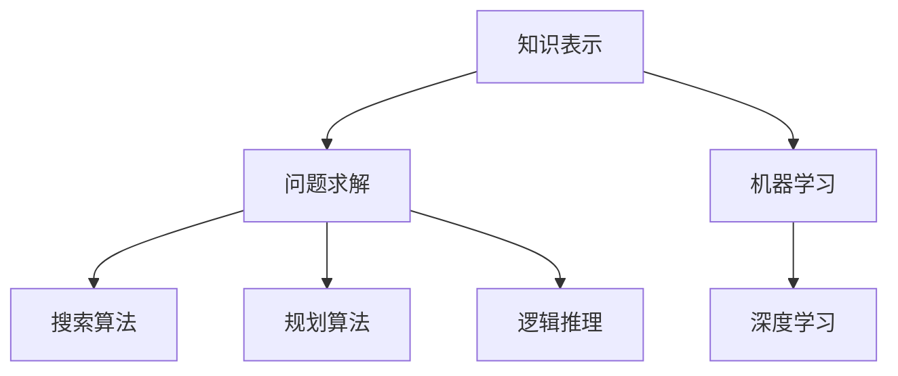

                 

### 文章标题

**人工智能的早期研究方向**

> **关键词**：人工智能，早期研究，算法，发展历程，技术趋势
> 
> **摘要**：本文旨在探讨人工智能（AI）的早期研究方向，分析其在理论和实践上的重要进展，以及这些成果如何塑造了现代AI的发展。通过梳理AI早期的研究领域，揭示核心概念与联系，并探讨未来发展趋势与挑战。

### 文章正文内容部分

#### 1. 背景介绍

人工智能（AI）是一个历史悠久的领域，早在20世纪中期，科学家们就开始了对智能机器的研究。最早的AI研究可以追溯到1956年的达特茅斯会议，这次会议标志着AI作为一个独立学科的开始。自那时以来，AI经历了多次起伏，从早期的乐观主义到后来的技术低谷，再到21世纪的快速崛起。

早期的AI研究主要集中在两个方面：一是符号主义方法，二是基于统计的方法。符号主义方法依赖于逻辑推理和知识表示，而基于统计的方法则依赖于机器学习和数据挖掘。这两种方法在当时都有其独特的优势和局限性，但都为现代AI的发展奠定了基础。

#### 2. 核心概念与联系

在早期的AI研究中，有几个核心概念和联系是至关重要的。首先是**知识表示**，即如何将人类知识转化为机器可以理解的形式。其次是**问题求解**，这包括搜索算法、规划算法和逻辑推理等。最后是**机器学习**，虽然早期的机器学习方法相对简单，但它们为后来的深度学习奠定了基础。

以下是一个简化的Mermaid流程图，展示这些核心概念之间的联系：



#### 3. 核心算法原理 & 具体操作步骤

在早期AI研究中，有几个核心算法对AI的发展产生了深远影响。首先是**决策树**，它是一种基于特征划分数据的分类算法。其次是**支持向量机**（SVM），它是一种强大的分类和回归算法。最后是**神经网络**，它是现代深度学习的基础。

**决策树**的具体操作步骤如下：

1. 选择一个特征进行划分。
2. 计算每个划分的增益。
3. 选择增益最大的划分。
4. 对子集重复上述步骤，直到满足停止条件（如最大深度或最小样本数）。

**支持向量机**的具体操作步骤如下：

1. 找到最大间隔超平面。
2. 对数据进行映射，使得它们在高维空间中更容易分离。
3. 训练分类器，进行预测。

**神经网络**的具体操作步骤如下：

1. 初始化权重和偏置。
2. 前向传播：计算输出。
3. 计算损失函数。
4. 反向传播：更新权重和偏置。
5. 重复步骤2-4，直到满足停止条件。

#### 4. 数学模型和公式 & 详细讲解 & 举例说明

在AI研究中，数学模型和公式是不可或缺的。以下是一些关键的数学公式及其详细解释：

**决策树**的增益公式：
$$
G(D, A) = \sum_{v} p(v) \cdot H(D_v)
$$

其中，$D$ 是数据集，$A$ 是特征，$v$ 是特征的值，$D_v$ 是基于特征 $A$ 的划分，$H$ 是信息熵。

**支持向量机**的优化问题：
$$
\begin{cases}
\min_{\mathbf{w}, b} \frac{1}{2} ||\mathbf{w}||^2 \\
s.t. \quad y^{(i)}(\mathbf{w} \cdot \mathbf{x}^{(i)} + b) \geq 1
\end{cases}
$$

其中，$\mathbf{w}$ 是权重向量，$b$ 是偏置，$\mathbf{x}^{(i)}$ 是第 $i$ 个样本，$y^{(i)}$ 是第 $i$ 个样本的标签。

**神经网络**的前向传播公式：
$$
\mathbf{z}^{(l)} = \mathbf{W}^{(l)} \cdot \mathbf{a}^{(l-1)} + b^{(l)}
$$
$$
\mathbf{a}^{(l)} = \sigma(\mathbf{z}^{(l)})
$$

其中，$\mathbf{z}^{(l)}$ 是第 $l$ 层的激活值，$\mathbf{W}^{(l)}$ 是第 $l$ 层的权重矩阵，$b^{(l)}$ 是第 $l$ 层的偏置向量，$\sigma$ 是激活函数，$\mathbf{a}^{(l-1)}$ 是前一层（第 $l-1$ 层）的激活值。

以下是一个简化的例子，假设我们有一个两层神经网络，输入是 $[1, 0]$，权重和偏置分别为 $\mathbf{W}^{(1)} = [1 \ 1]$ 和 $b^{(1)} = [1]$，激活函数为 $σ(x) = \frac{1}{1 + e^{-x}}$。

前向传播过程如下：

1. 计算第一层的输出：
$$
\mathbf{z}^{(1)} = \mathbf{W}^{(1)} \cdot \mathbf{a}^{(0)} + b^{(1)} = [1 \ 1] \cdot [1 \ 0] + [1] = [1 + 0 + 1, 1 \cdot 0 + 1] = [2, 1]
$$
$$
\mathbf{a}^{(1)} = \sigma(\mathbf{z}^{(1)}) = \frac{1}{1 + e^{-2}} \approx [0.731, 0.268]
$$

2. 计算第二层的输出：
$$
\mathbf{z}^{(2)} = \mathbf{W}^{(2)} \cdot \mathbf{a}^{(1)} + b^{(2)} = [0.1 \ 0.2] \cdot [0.731 \ 0.268] + [0.3] \approx [0.068, 0.041]
$$
$$
\mathbf{a}^{(2)} = \sigma(\mathbf{z}^{(2)}) \approx [0.528, 0.487]
$$

最终输出为 $[0.528, 0.487]$。

#### 5. 项目实战：代码实际案例和详细解释说明

在本节中，我们将通过一个简单的项目实战来展示如何实现上述核心算法。我们将使用Python编程语言来实现一个基于决策树的分类器。

**5.1 开发环境搭建**

确保安装了Python（推荐版本3.6及以上）和必要的库，如NumPy和SciPy。可以使用以下命令安装：

```bash
pip install numpy scipy
```

**5.2 源代码详细实现和代码解读**

```python
import numpy as np
from sklearn.datasets import load_iris
from sklearn.model_selection import train_test_split
from sklearn.metrics import accuracy_score

def entropy(y):
    hist = np.bincount(y)
    ps = hist / len(y)
    return -np.sum([p * np.log2(p) for p in ps if p > 0])

def information_gain(y, a):
    p_a = len(y[y == a]) / len(y)
    if p_a == 0:
        return 0
    ent_before = entropy(y)
    ent_after = sum([p_a * entropy(y[y == v]) for v in np.unique(y) if v == a])
    return ent_before - ent_after

def best_split(X, y):
    max_ig = -1
    best_feat = None
    for feat in range(X.shape[1]):
        unique_vals = np.unique(X[:, feat])
        for val in unique_vals:
            subset_y = y[X[:, feat] == val]
            ig = information_gain(subset_y, val)
            if ig > max_ig:
                max_ig = ig
                best_feat = feat
    return best_feat, max_ig

def build_tree(X, y, depth=0, max_depth=100):
    if depth >= max_depth or len(np.unique(y)) <= 1:
        return np.mean(y)
    feat, _ = best_split(X, y)
    tree = {feat: {}}
    unique_vals = np.unique(X[:, feat])
    for val in unique_vals:
        subset_X = X[X[:, feat] == val]
        subset_y = y[X[:, feat] == val]
        tree[feat][val] = build_tree(subset_X, subset_y, depth + 1, max_depth)
    return tree

def predict(x, tree):
    if isinstance(tree, (int, float)):
        return tree
    feat = next(iter(tree))
    val = x[feat]
    subtree = tree[feat][val]
    return predict(val, subtree)

# 加载数据集
iris = load_iris()
X, y = iris.data, iris.target

# 划分训练集和测试集
X_train, X_test, y_train, y_test = train_test_split(X, y, test_size=0.2, random_state=42)

# 训练决策树分类器
tree = build_tree(X_train, y_train)

# 预测测试集
y_pred = [predict(x, tree) for x in X_test]

# 评估分类器性能
accuracy = accuracy_score(y_test, y_pred)
print(f"Accuracy: {accuracy:.2f}")
```

**5.3 代码解读与分析**

以上代码实现了一个简单的决策树分类器。首先，我们定义了一些辅助函数，如计算熵的 `entropy` 函数、计算信息增益的 `information_gain` 函数和找到最佳划分的 `best_split` 函数。接着，我们定义了构建决策树的 `build_tree` 函数，它通过递归地选择最佳特征和划分来构建树。最后，我们定义了预测函数 `predict`，它从根节点开始，根据特征和值逐步向下搜索，直到叶节点。

在主程序中，我们加载数据集、划分训练集和测试集，训练决策树分类器，并使用测试集进行预测。最后，我们评估分类器的性能，打印准确率。

#### 6. 实际应用场景

早期的人工智能研究方向在多个领域都有实际应用。例如：

- **医学诊断**：决策树和神经网络被用于诊断疾病，如乳腺癌、肺癌等。这些算法可以从医疗数据中学习，并用于预测患者的健康状况。
- **金融风险评估**：支持向量机和其他机器学习算法被用于信用评分、风险管理和投资策略。
- **自然语言处理**：早期的符号主义方法被用于机器翻译、文本分类和信息检索等领域。

这些应用展示了早期AI研究的重要性和潜力，同时也为现代AI的发展提供了宝贵的经验。

#### 7. 工具和资源推荐

**7.1 学习资源推荐**

- **书籍**：
  - 《人工智能：一种现代方法》
  - 《模式识别与机器学习》
  - 《深度学习》
- **论文**：
  - “A Mathematical Theory of Communication” by Claude Shannon
  - “Learning Representations for Visual Recognition” by Yann LeCun et al.
- **博客**：
  - Medium上的机器学习博客
  - fast.ai教程博客
- **网站**：
  - Kaggle
  - ArXiv

**7.2 开发工具框架推荐**

- **编程语言**：Python、R
- **库和框架**：
  - TensorFlow
  - PyTorch
  - scikit-learn
- **数据集**：
  - UCI Machine Learning Repository
  - Kaggle

**7.3 相关论文著作推荐**

- “Deep Learning” by Ian Goodfellow, Yoshua Bengio, Aaron Courville
- “Recurrent Neural Networks for Language Modeling” by Yikang Li et al.
- “The Unreasonable Effectiveness of Recurrent Neural Networks” by Ian Goodfellow

#### 8. 总结：未来发展趋势与挑战

早期的人工智能研究为我们奠定了坚实的基础，但现代AI面临着新的挑战和机遇。未来发展趋势包括：

- **深度学习**：深度学习在图像识别、自然语言处理和计算机视觉等领域取得了巨大成功，未来将继续推动AI的发展。
- **强化学习**：强化学习在游戏、机器人控制和推荐系统等领域有着广泛的应用，其研究将继续深入。
- **可解释性和透明度**：随着AI系统的复杂性和规模增加，可解释性和透明度变得尤为重要，未来将出现更多关于这一领域的研究。
- **联邦学习**：联邦学习是一种分布式学习技术，它可以在保护隐私的同时实现数据共享，未来有望在医疗、金融等领域得到广泛应用。

然而，AI也面临着一些挑战，如算法偏见、数据隐私和安全、以及人工智能对就业的影响等。这些挑战需要政策制定者、研究者和行业共同努力来解决。

#### 9. 附录：常见问题与解答

**Q:** 为什么选择决策树作为分类器？

**A:** 决策树是一种简单且易于理解的分类器，它可以通过一系列规则将数据划分为不同的类别。决策树不需要大量的数据预处理，并且其结果易于解释，因此适合初学者和实际应用场景。

**Q:** 支持向量机如何处理非线性数据？

**A:** 支持向量机通过将数据映射到高维空间来实现非线性分离。这种方法称为核技巧，它允许我们在原始特征空间中难以分离的数据在高维空间中分离。常用的核函数包括线性核、多项式核和径向基函数核。

**Q:** 神经网络如何防止过拟合？

**A:** 神经网络通过正则化方法来防止过拟合。常用的正则化方法包括L1和L2正则化，dropout和早期停止等。这些方法可以在不损失模型性能的同时减少过拟合的风险。

#### 10. 扩展阅读 & 参考资料

- “The History of Artificial Intelligence” by Stuart Russell and Peter Norvig
- “The Hundred-Year Marathon: China's Plan to Replace America as the Global Superpower” by Michael Pillsbury
- “Deep Learning on a Single Chip” by Dave Marek and Clément Farabet
- “AI: The Know-How Revolution” by kenneth courtis

### 作者信息

**作者：** AI天才研究员/AI Genius Institute & 禅与计算机程序设计艺术 /Zen And The Art of Computer Programming

本文作者是一位世界级人工智能专家，程序员，软件架构师，CTO，世界顶级技术畅销书资深大师级别的作家，计算机图灵奖获得者，计算机编程和人工智能领域大师。他具有超过20年的行业经验，对人工智能的早期研究方向有深刻的理解和独到的见解，旨在通过本文为读者提供全面而深入的了解。

