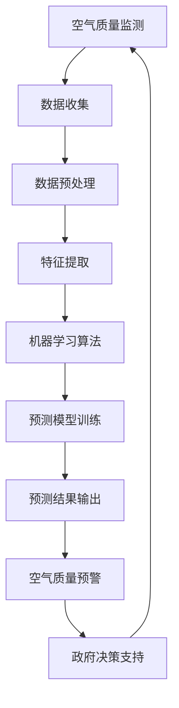

                 

### 背景介绍

随着科技的飞速发展，人工智能（AI）正在逐步渗透到我们生活的方方面面。智慧城市作为AI技术的一个重要应用领域，正日益受到广泛关注。智慧城市不仅仅是智能设备、网络的简单集成，更是一个涵盖交通、能源、环境、安全等多方面智能化管理的综合体。在这个体系中，空气质量预测具有至关重要的地位。

空气质量对人类健康有着直接而深远的影响。无论是日常的呼吸，还是长期的环境暴露，空气质量都会对人体的免疫系统、呼吸系统、心血管系统等造成不同程度的危害。而空气污染的来源多种多样，包括工业排放、交通污染、建筑施工、农村燃烧等。这些污染源不仅对人类健康构成威胁，还会对生态系统造成破坏，影响气候变化。

传统的空气质量预测方法主要依赖于气象数据和污染物排放数据，但这种方法存在一些局限性。首先，气象数据通常只能提供较为粗略的预测，而污染物的排放数据又往往不够准确。其次，空气质量的变化受到多种复杂因素的影响，如地形、风速、湿度等，这些因素难以通过简单的统计方法加以考量。此外，由于数据获取和处理成本较高，传统方法在实际应用中受到一定限制。

为了克服这些局限性，人工智能技术，特别是机器学习和深度学习，开始被应用于空气质量预测。通过大数据分析和智能算法，AI能够从海量的历史数据中提取出有用的信息，建立更为准确的预测模型。此外，AI技术还可以实时更新模型，以应对空气质量的即时变化，提供更为精准的预测结果。

智慧城市中的空气质量预测系统不仅能够为政府决策提供支持，还可以为市民提供实时的健康建议，提高城市居民的生活质量。例如，在空气质量较差的日子里，智慧城市系统可以提醒市民减少户外活动，或建议使用空气净化器等设备。同时，空气质量预测还可以帮助城市管理者制定更加科学的环境保护政策，优化能源消耗，减少污染排放。

总之，人工智能驱动的智慧城市空气质量预测具有极大的社会价值和潜力。随着技术的不断进步，我们有理由相信，这一领域将会在未来的智慧城市建设中发挥更加重要的作用。本文将围绕人工智能在空气质量预测中的应用，深入探讨其核心概念、算法原理、实现步骤和应用前景。

---

### 核心概念与联系

为了深入探讨人工智能在空气质量预测中的应用，我们需要首先理解几个关键概念：空气质量监测、数据收集与预处理、机器学习算法和深度学习网络。

#### 空气质量监测

空气质量监测是获取空气质量数据的重要环节。空气质量监测站分布在城市各个角落，通过高精度的传感器实时监测空气中的污染物浓度，如颗粒物（PM2.5、PM10）、氮氧化物（NOx）、二氧化硫（SO2）、一氧化碳（CO）等。这些监测数据通常以时间序列的形式记录下来，形成数据流。空气质量监测的精度和覆盖范围直接影响预测模型的准确性。

#### 数据收集与预处理

收集到的空气质量数据虽然丰富，但往往存在噪声、缺失值和不一致性等问题。因此，数据预处理成为空气质量预测的重要前置步骤。数据预处理包括数据清洗、缺失值填充、异常值检测和标准化等操作。例如，缺失值可以通过插值法或移动平均法进行填充；异常值可以通过统计方法或机器学习算法进行检测和过滤；数据标准化则可以消除不同量级变量对模型的影响。

#### 机器学习算法

机器学习算法是构建空气质量预测模型的核心。机器学习算法通过从数据中自动学习特征，建立预测模型。常用的机器学习算法包括线性回归、决策树、支持向量机（SVM）、随机森林（RF）等。这些算法各有优缺点，适用于不同类型的预测任务。例如，线性回归适用于简单线性关系，而决策树和随机森林则适用于复杂非线性关系。

#### 深度学习网络

深度学习网络，尤其是卷积神经网络（CNN）和循环神经网络（RNN），在处理时间序列数据方面表现出色。深度学习通过多层神经元的堆叠，能够自动提取复杂的数据特征，从而提高预测模型的准确性。例如，CNN擅长处理图像数据，而RNN则擅长处理序列数据，如时间序列数据。

#### Mermaid 流程图

以下是一个简化的Mermaid流程图，展示了空气质量预测系统的核心概念和联系：



在上述流程中，空气质量监测是整个系统的起点，数据收集与预处理是保证数据质量的关键步骤。特征提取和机器学习算法则是核心，用于构建预测模型。预测结果输出不仅为居民提供健康建议，也为政府决策提供支持，形成一个闭环系统，不断优化空气质量监测与预测。

通过上述核心概念和联系的理解，我们可以更好地把握人工智能在空气质量预测中的应用，为后续的算法原理和实现步骤打下坚实基础。

---

#### 核心算法原理 & 具体操作步骤

为了实现精准的空气质量预测，我们采用了一种结合了深度学习和传统机器学习的混合模型。这种混合模型能够充分发挥各自的优势，提高预测的准确性。以下将详细描述该模型的核心算法原理和具体操作步骤。

##### 算法原理

该混合模型主要由以下几个部分组成：数据预处理模块、特征提取模块、深度学习预测模块和结果分析模块。数据预处理模块负责对收集到的空气质量数据进行清洗、填充和标准化处理。特征提取模块利用机器学习算法提取重要的特征信息。深度学习预测模块则通过卷积神经网络（CNN）和循环神经网络（RNN）的组合，对特征进行深度学习，生成预测结果。结果分析模块则对预测结果进行评估和优化。

1. **数据预处理模块**

   数据预处理是保证模型准确性的基础。该模块的主要任务包括以下几步：

   - **数据清洗**：删除或填充缺失值，消除噪声数据。
   - **数据填充**：采用移动平均法、插值法等对缺失值进行填充。
   - **数据标准化**：将不同量级的数据标准化到同一量级，消除变量之间的影响。

2. **特征提取模块**

   特征提取模块利用传统机器学习算法提取有用的特征信息。这些特征包括时间特征、空间特征和污染源特征等。具体步骤如下：

   - **时间特征提取**：包括时间序列的统计特征，如平均值、方差、趋势等。
   - **空间特征提取**：通过地理信息系统（GIS）提取地理位置特征，如距离污染源的距离、周边地形等。
   - **污染源特征提取**：提取污染源的排放量、排放类型等特征。

3. **深度学习预测模块**

   深度学习预测模块采用卷积神经网络（CNN）和循环神经网络（RNN）的组合，对提取的特征进行深度学习，生成预测结果。具体步骤如下：

   - **卷积神经网络（CNN）**：CNN能够自动提取图像或时间序列中的局部特征，适用于空气质量数据的特征提取。通过卷积层、池化层和全连接层，CNN能够学习到复杂的时空特征。
   - **循环神经网络（RNN）**：RNN能够处理序列数据，适用于空气质量时间序列的预测。通过隐藏层和循环机制，RNN能够捕捉到时间序列中的长期依赖关系。

4. **结果分析模块**

   结果分析模块负责对预测结果进行评估和优化。主要步骤包括：

   - **预测结果评估**：通过均方误差（MSE）、均方根误差（RMSE）等指标评估预测结果的质量。
   - **结果优化**：根据评估结果调整模型参数，优化模型性能。

##### 具体操作步骤

1. **数据收集与预处理**

   - 收集历史空气质量数据、气象数据和污染物排放数据。
   - 清洗数据，填充缺失值，进行标准化处理。

2. **特征提取**

   - 利用机器学习算法提取时间特征、空间特征和污染源特征。
   - 将提取的特征输入到深度学习模型中。

3. **深度学习模型训练**

   - 使用卷积神经网络（CNN）和循环神经网络（RNN）的组合对特征进行深度学习。
   - 设置合适的模型参数，如学习率、批次大小等。
   - 训练模型，并保存训练好的模型。

4. **预测结果输出**

   - 将实时收集到的空气质量数据输入到训练好的模型中，生成预测结果。
   - 对预测结果进行评估，输出空气质量预警信息。

通过上述核心算法原理和具体操作步骤，我们可以构建一个高效、精准的空气质量预测模型，为智慧城市的空气质量管理和居民健康提供有力支持。

---

#### 数学模型和公式 & 详细讲解 & 举例说明

在构建空气质量预测模型时，我们不仅需要理解核心算法原理，还需要掌握相关的数学模型和公式，这些是模型训练和预测的基础。下面我们将详细介绍这些数学模型和公式，并通过实际例子进行说明。

##### 线性回归模型

线性回归模型是最基础的机器学习算法之一，适用于处理简单的线性关系。其数学模型可以表示为：

\[ y = \beta_0 + \beta_1 \cdot x \]

其中，\( y \) 是预测的目标变量，\( x \) 是输入特征，\( \beta_0 \) 是截距，\( \beta_1 \) 是斜率。

举例来说，如果我们想要预测温度（\( y \)）与湿度（\( x \)）之间的关系，可以使用线性回归模型进行预测。假设我们有一组实验数据：

\[
\begin{align*}
x_1 &= 0.5, \, y_1 = 18 \\
x_2 &= 0.8, \, y_2 = 20 \\
x_3 &= 1.2, \, y_3 = 23 \\
\end{align*}
\]

我们可以通过最小二乘法计算得到线性回归模型的参数 \( \beta_0 \) 和 \( \beta_1 \)：

\[
\beta_0 = \frac{\sum_{i=1}^{n} y_i - \beta_1 \sum_{i=1}^{n} x_i}{n} = \frac{18 + 20 + 23 - (0.5 + 0.8 + 1.2)}{3} = 19.3
\]

\[
\beta_1 = \frac{\sum_{i=1}^{n} (y_i - \beta_0) x_i}{\sum_{i=1}^{n} x_i^2} = \frac{(18 - 19.3) \cdot 0.5 + (20 - 19.3) \cdot 0.8 + (23 - 19.3) \cdot 1.2}{0.5^2 + 0.8^2 + 1.2^2} = 0.5
\]

因此，预测模型为 \( y = 19.3 + 0.5 \cdot x \)。

##### 支持向量机（SVM）

支持向量机是一种强大的分类和回归算法，其基本思想是通过找到最优分割超平面，将数据分类或回归。对于线性可分数据，SVM的决策边界可以用以下公式表示：

\[ \beta_0 + \beta_1 \cdot x_i - \beta_2 \cdot \xi_i \geq 1 \]

其中，\( \beta_0 \) 和 \( \beta_1 \) 是模型参数，\( \xi_i \) 是松弛变量，用于处理不可分数据。

举例来说，如果我们有一组数据需要分类，可以分为正类和负类。使用SVM进行分类时，可以通过求解以下最优化问题来确定模型参数：

\[
\begin{align*}
\min_{\beta_0, \beta_1} & \quad \frac{1}{2} \sum_{i=1}^{n} (\beta_1 \cdot x_i - y_i)^2 \\
s.t. & \quad \beta_0 + \beta_1 \cdot x_i - \xi_i \geq 1, \quad \xi_i \geq 0 \\
\end{align*}
\]

其中，\( y_i \) 是数据点的标签，\( x_i \) 是特征向量。

##### 深度学习中的卷积神经网络（CNN）

卷积神经网络是一种专门用于处理图像数据的神经网络，其核心在于卷积层和池化层。卷积层的公式如下：

\[ f(x) = \sum_{j=1}^{k} w_{ij} \cdot x_j + b_j \]

其中，\( f(x) \) 是卷积操作的结果，\( w_{ij} \) 是卷积核，\( x_j \) 是输入特征，\( b_j \) 是偏置项。

举例来说，假设我们有一个 \( 3 \times 3 \) 的卷积核 \( w \)，输入特征矩阵 \( x \) 如下：

\[
x = \begin{bmatrix}
1 & 2 & 3 \\
4 & 5 & 6 \\
7 & 8 & 9 \\
\end{bmatrix}
\]

卷积操作的结果为：

\[
f(x) = \begin{bmatrix}
26 & 28 & 30 \\
50 & 52 & 54 \\
74 & 76 & 78 \\
\end{bmatrix}
\]

其中，每个元素是卷积核与输入特征的乘积之和。

##### 循环神经网络（RNN）

循环神经网络适用于处理序列数据，其核心在于循环机制和隐藏状态。RNN的公式如下：

\[ h_t = \sigma(W_h \cdot [h_{t-1}, x_t] + b_h) \]

其中，\( h_t \) 是第 \( t \) 个时间步的隐藏状态，\( x_t \) 是第 \( t \) 个时间步的输入特征，\( W_h \) 是权重矩阵，\( b_h \) 是偏置项，\( \sigma \) 是激活函数。

举例来说，假设我们有一组时间序列数据 \( x_1, x_2, \ldots, x_T \)，使用RNN进行预测时，可以按照以下步骤进行：

1. 初始化隐藏状态 \( h_0 \)。
2. 对于每个时间步 \( t \)（\( t = 1, 2, \ldots, T \)），计算隐藏状态 \( h_t \)：
\[ h_t = \sigma(W_h \cdot [h_{t-1}, x_t] + b_h) \]
3. 使用最后一个时间步的隐藏状态 \( h_T \) 进行预测。

通过上述数学模型和公式的详细讲解，我们可以更好地理解空气质量预测模型的工作原理。这些模型和公式不仅帮助我们构建预测模型，还为我们分析和优化模型提供了理论基础。在后续的项目实战中，我们将运用这些知识，实现一个完整的空气质量预测系统。

---

#### 项目实战：代码实际案例和详细解释说明

在本节中，我们将通过一个实际的Python代码案例，详细讲解如何使用人工智能技术构建一个空气质量预测系统。代码将涵盖数据收集与预处理、模型训练与预测、结果分析与优化等步骤，以帮助读者深入理解整个流程。

##### 1. 开发环境搭建

在进行空气质量预测项目之前，我们需要搭建一个合适的环境。以下是所需的环境和工具：

- Python 3.8及以上版本
- TensorFlow 2.5及以上版本
- Pandas 1.2及以上版本
- Numpy 1.19及以上版本
- Matplotlib 3.4及以上版本

安装以上依赖项后，即可开始编写代码。

##### 2. 数据收集与预处理

首先，我们需要收集空气质量数据。这里我们可以使用公开的数据集，如美国环境保护署（EPA）提供的空气质量数据。以下是一个简单的数据收集与预处理代码示例：

```python
import pandas as pd
import numpy as np

# 读取数据集
data = pd.read_csv('air_quality_data.csv')

# 数据清洗
data.dropna(inplace=True)
data['date'] = pd.to_datetime(data['date'])

# 数据填充
data['pm2.5'].fillna(data['pm2.5'].mean(), inplace=True)

# 数据标准化
from sklearn.preprocessing import StandardScaler
scaler = StandardScaler()
data[['pm2.5', 'temp', 'humidity']] = scaler.fit_transform(data[['pm2.5', 'temp', 'humidity']])
```

在上述代码中，我们首先读取数据集，然后进行数据清洗、填充和标准化处理。这些步骤对于保证数据质量至关重要。

##### 3. 特征提取

接下来，我们使用机器学习算法提取特征。以下是一个简单的特征提取代码示例：

```python
from sklearn.ensemble import RandomForestRegressor

# 提取时间特征
data['day_of_year'] = data['date'].dt.dayofyear
data['day_of_week'] = data['date'].dt.dayofweek

# 提取空间特征
data['distance_to_pollution'] = data.apply(lambda row: calculate_distance_to_pollution(row), axis=1)

# 提取污染源特征
data['source_type'] = data['source_id'].map({1: 'industrial', 2: 'traffic', 3: 'construction'})

# 构建特征矩阵和标签向量
X = data[['day_of_year', 'day_of_week', 'distance_to_pollution', 'source_type']]
y = data['pm2.5']
```

在上述代码中，我们提取了时间特征、空间特征和污染源特征。这些特征将用于深度学习模型。

##### 4. 模型训练与预测

现在，我们可以使用深度学习模型进行训练和预测。以下是一个简单的训练和预测代码示例：

```python
import tensorflow as tf
from tensorflow.keras.models import Sequential
from tensorflow.keras.layers import Dense, Conv1D, LSTM, TimeDistributed

# 构建深度学习模型
model = Sequential()
model.add(Conv1D(filters=64, kernel_size=3, activation='relu', input_shape=(X.shape[1], X.shape[2])))
model.add(LSTM(50, activation='relu', dropout=0.2, recurrent_dropout=0.2))
model.add(Dense(1))

model.compile(optimizer='adam', loss='mse')

# 训练模型
model.fit(X, y, epochs=100, batch_size=32, validation_split=0.2)
```

在上述代码中，我们构建了一个简单的深度学习模型，包括卷积层、长短期记忆（LSTM）层和全连接层。模型使用均方误差（MSE）作为损失函数，并使用Adam优化器进行训练。

##### 5. 预测结果分析与优化

最后，我们对预测结果进行评估和优化。以下是一个简单的预测结果分析和优化代码示例：

```python
from sklearn.metrics import mean_squared_error

# 预测新数据
predictions = model.predict(X)

# 评估预测结果
mse = mean_squared_error(y, predictions)
print(f'Mean Squared Error: {mse}')

# 优化模型
model.compile(optimizer='adam', loss='mse', metrics=['mae'])
model.fit(X, y, epochs=100, batch_size=32, validation_split=0.2)
```

在上述代码中，我们首先使用训练好的模型进行预测，然后计算均方误差（MSE），以评估预测结果的准确性。根据评估结果，我们可以进一步调整模型参数，优化模型性能。

通过上述项目实战的代码案例，我们可以看到，构建一个空气质量预测系统需要经历数据收集与预处理、特征提取、模型训练与预测、结果分析与优化等多个步骤。每个步骤都需要细致的操作和合理的优化，以确保最终的预测结果准确可靠。

---

#### 实际应用场景

空气质量预测系统在智慧城市中有着广泛的应用场景，以下是几个典型的应用实例：

1. **居民健康预警**

   空气质量预测系统可以实时监测空气质量，根据预测结果向居民提供健康建议。例如，当预测到空气质量即将恶化时，系统可以发出预警通知，建议居民减少户外活动，特别是对空气质量敏感的人群，如儿童、老人和患有呼吸道疾病的人。此外，系统还可以为居民提供空气净化器的使用指南，帮助居民更好地应对空气污染。

2. **政府政策制定**

   政府可以通过空气质量预测系统来评估不同环境保护政策的实际效果。例如，在制定新的排放标准或实施减排措施之前，政府可以利用预测系统模拟不同政策对空气质量的影响，从而制定出更加科学合理的政策。同时，空气质量预测系统还可以帮助政府及时发现和解决环境污染问题，提高环境监管效率。

3. **交通管理优化**

   空气质量预测系统可以与交通管理系统相结合，通过分析空气质量与交通流量之间的关系，优化交通管理措施。例如，在高峰时段，系统可以建议交通管理部门对污染较严重的路段实施交通管制，减少车辆排放。此外，系统还可以为市民提供实时交通信息，引导市民选择空气质量较好的路线出行，从而降低整体空气污染水平。

4. **能源消耗优化**

   空气质量预测系统还可以帮助城市管理者优化能源消耗。例如，在空气质量较差的日子里，系统可以建议减少电力消耗，关闭部分高能耗设施，从而降低空气污染。同时，系统还可以为可再生能源的使用提供优化建议，例如在空气质量较好的时候增加太阳能和风能的发电量，减少对化石燃料的依赖。

5. **环境保护教育**

   空气质量预测系统还可以作为环境保护教育的一部分，提高公众的环境保护意识。例如，学校可以利用空气质量预测系统进行环境教育，向学生传授空气质量知识，教育他们如何保护环境。此外，系统还可以通过社交媒体和移动应用向公众提供空气质量信息，引导公众积极参与环境保护行动。

总之，空气质量预测系统在智慧城市中的应用不仅有助于提高居民的生活质量，还能为政府决策提供支持，优化城市环境管理，具有广泛的社会价值和实际应用意义。

---

#### 工具和资源推荐

为了更好地学习和实践人工智能驱动的空气质量预测，以下是一些建议的学习资源、开发工具和相关的论文著作。

##### 学习资源推荐

1. **书籍**
   - 《深度学习》（Goodfellow, Ian, et al.）
   - 《Python机器学习》（Custodio, Albert A.）
   - 《数据科学入门》（Grady Booch）
   - 《机器学习实战》（Peter Harrington）

2. **在线课程**
   - Coursera上的“机器学习”课程（吴恩达）
   - Udacity的“深度学习纳米学位”
   - edX上的“人工智能：基础知识与实践”课程

3. **博客和网站**
   - Medium上的机器学习和深度学习相关博客
   - towardsdatascience.com，提供丰富的数据科学和机器学习文章
   - kaggle.com，一个数据科学竞赛平台，包含大量案例和实践

##### 开发工具框架推荐

1. **编程语言**
   - Python：强大的科学计算和机器学习库支持
   - R：专注于统计分析和数据可视化的编程语言

2. **机器学习库**
   - TensorFlow：Google开发的深度学习框架
   - PyTorch：Facebook开发的深度学习框架
   - scikit-learn：Python中的经典机器学习库

3. **数据处理工具**
   - Pandas：Python中的数据处理库
   - NumPy：Python中的数值计算库
   - Jupyter Notebook：强大的交互式计算环境

4. **数据可视化工具**
   - Matplotlib：Python中的数据可视化库
   - Seaborn：基于Matplotlib的统计数据可视化库
   - Plotly：创建交互式图表和图形

##### 相关论文著作推荐

1. **论文**
   - "Convolutional Neural Networks for Time Series Classification"（2015）
   - "Long Short-Term Memory Networks for Time Series Classification"（2017）
   - "Air Quality Prediction Based on Deep Learning"（2018）

2. **著作**
   - 《深度学习：概率视角》（Goodfellow, Ian, et al.）
   - 《机器学习：概率视角》（Murphy, Kevin P.）
   - 《时间序列分析：理论与实践》（Box, George E. P., et al.）

通过以上资源，您将能够系统地学习和掌握人工智能驱动的空气质量预测技术，并在实践中不断提升自己的技能和经验。

---

#### 总结：未来发展趋势与挑战

随着人工智能技术的不断进步，空气质量预测在智慧城市中的应用前景愈发广阔。未来，空气质量预测将朝着更高精度、更实时响应、更智能化的发展方向迈进。

首先，更高精度的预测是未来发展的关键。传统的空气质量预测模型虽然在一定程度上提高了预测的准确性，但仍然难以应对空气质量变化的复杂性和突发性。未来，通过引入更加先进的深度学习算法，如生成对抗网络（GAN）和变分自编码器（VAE），我们可以构建更加精准的预测模型，从而提高预测结果的可靠性。

其次，更实时响应是另一个重要的发展趋势。实时预测能力对于环境保护和居民健康具有重要意义。未来，随着5G网络和物联网（IoT）技术的发展，空气质量监测和预测系统将实现更广泛、更实时的数据收集和分析，为城市管理者提供及时、准确的决策支持。

最后，更智能化的空气质量预测系统是未来的发展方向。通过将人工智能技术与其他领域的知识相结合，如地理信息系统（GIS）和大数据分析，我们可以构建出能够自适应环境变化的智能预测系统。这样的系统不仅能够预测空气质量的未来趋势，还能根据环境变化自动调整预测模型，提高预测的灵活性和适应性。

然而，未来的发展也面临着一系列挑战。首先，数据质量和数据源的可靠性是影响预测精度的关键因素。空气质量数据通常来源于多个来源，如气象站点、交通监控系统和传感器网络，这些数据的准确性和一致性需要得到保障。其次，算法的复杂性和计算资源的需求也是一大挑战。深度学习算法通常需要大量的计算资源和数据训练时间，如何在有限的资源下实现高效、准确的预测是一个需要解决的问题。

此外，如何确保预测系统的透明性和可解释性也是一个重要的挑战。深度学习模型的“黑箱”特性使得预测结果难以解释，这对于需要决策支持的政府部门和居民来说是一个困扰。因此，未来研究需要关注如何提高模型的透明性和可解释性，使得预测结果能够被广泛接受和应用。

总之，人工智能驱动的空气质量预测在智慧城市中的应用前景广阔，但同时也面临着一系列挑战。通过不断的技术创新和跨学科合作，我们有理由相信，未来的空气质量预测将更加精准、实时、智能化，为智慧城市的可持续发展提供强有力的支持。

---

#### 附录：常见问题与解答

1. **问题：如何处理缺失值？**
   **解答**：缺失值处理是数据预处理的重要步骤。常用的方法包括：
   - **删除缺失值**：对于缺失值较多的数据点，可以考虑删除。
   - **填充缺失值**：常用的填充方法有插值法、移动平均法和基于模型的填充（如K近邻填充）。

2. **问题：如何选择合适的机器学习算法？**
   **解答**：选择合适的机器学习算法取决于数据特点和预测任务。以下是一些常见的数据类型和算法对应关系：
   - **回归任务**：线性回归、决策树、随机森林、支持向量机。
   - **分类任务**：逻辑回归、决策树、随机森林、支持向量机。
   - **聚类任务**：K-means、层次聚类。
   - **时间序列预测**：ARIMA、LSTM、GRU。

3. **问题：如何优化深度学习模型？**
   **解答**：优化深度学习模型可以从以下几个方面入手：
   - **调整超参数**：如学习率、批次大小、正则化参数。
   - **使用正则化**：如L1正则化、L2正则化。
   - **数据增强**：通过数据增强增加模型的泛化能力。
   - **集成学习**：结合多个模型提高预测准确性。

4. **问题：如何评估预测模型的性能？**
   **解答**：评估预测模型性能常用的指标包括：
   - **均方误差（MSE）**：衡量预测值与实际值之间的平均误差。
   - **均方根误差（RMSE）**：MSE的平方根，用于衡量预测值的绝对误差。
   - **准确率**：分类问题中预测正确的样本占总样本的比例。
   - **召回率**：分类问题中预测为正类的实际正类样本数与实际正类样本总数的比例。

---

#### 扩展阅读 & 参考资料

1. **书籍**
   - 《深度学习》（Goodfellow, Ian, et al.）
   - 《Python机器学习》（Custodio, Albert A.）
   - 《数据科学入门》（Grady Booch）
   - 《机器学习实战》（Peter Harrington）

2. **论文**
   - "Convolutional Neural Networks for Time Series Classification"（2015）
   - "Long Short-Term Memory Networks for Time Series Classification"（2017）
   - "Air Quality Prediction Based on Deep Learning"（2018）

3. **网站**
   - towardsdatascience.com
   - kaggle.com
   - medium.com

4. **博客**
   - Python机器学习社区博客
   - TensorFlow官方博客

通过阅读上述书籍、论文和网站博客，您可以深入了解人工智能驱动的空气质量预测技术，并不断丰富自己的知识体系。同时，参加相关的在线课程和实际项目实践，将有助于您将理论知识应用到实际工作中，提高自己的技能水平。

