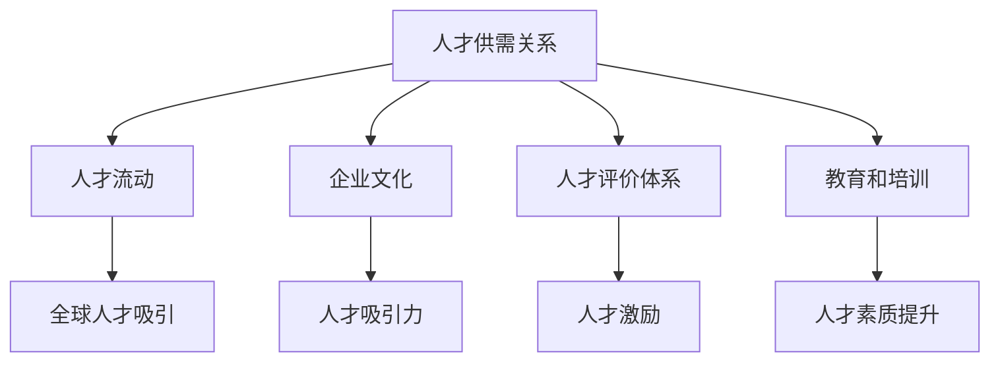

                 

# 人才市场管理：在全球化背景下吸引人才

## 1. 背景介绍

全球化背景下，人才市场发生了显著变化。随着跨国企业日益增多，信息技术的迅速发展，人才的流动性大大增强。在这场全球化的浪潮中，企业面临着前所未有的挑战和机遇。一方面，全球范围内的优秀人才变得更加容易获取，企业可以通过远程招聘、外包等方式吸引全球顶尖的人才。另一方面，由于竞争激烈，人才市场的供需关系发生了变化，如何吸引和留住人才成为企业发展的关键问题。

本文旨在探讨全球化背景下人才市场管理的策略，分析如何在全球范围内吸引人才，为企业发展提供有力的支持。文章将从以下几个部分展开：

- **核心概念与联系**：介绍人才市场的核心概念，以及它们之间的相互关系。
- **核心算法原理 & 具体操作步骤**：阐述吸引人才的具体策略和方法。
- **数学模型和公式 & 详细讲解 & 举例说明**：通过数学模型和公式，解释人才市场的运作机制。
- **项目实战：代码实际案例和详细解释说明**：通过实际案例，展示如何运用这些策略和模型。
- **实际应用场景**：分析人才市场管理在不同行业中的应用。
- **工具和资源推荐**：推荐相关工具和资源，帮助读者深入了解和掌握人才市场管理。
- **总结：未来发展趋势与挑战**：总结全文，展望未来发展趋势和挑战。

接下来，我们将一步一步分析推理，深入探讨全球化背景下人才市场管理的策略和方法。

## 2. 核心概念与联系

在探讨人才市场管理之前，我们需要了解几个核心概念，以及它们之间的相互关系。

### 人才供需关系

人才供需关系是人才市场的基础。供需关系的变化直接影响人才市场的动态。随着全球经济的发展，企业对高端人才的需求不断增加，而供给却相对有限。这种供需不平衡导致了人才的竞争激烈，企业需要采取有效策略来吸引和留住人才。

### 人才流动

人才流动是指人才在不同地区、不同企业之间的转移。全球化背景下，人才流动变得更加频繁。信息技术的发展，尤其是远程工作的普及，使得人才可以在全球范围内自由流动。这对企业来说既是机遇也是挑战。如何吸引全球范围内的优秀人才，成为企业需要解决的问题。

### 企业文化

企业文化是企业在长期经营过程中形成的一种价值观和行为规范。企业文化对人才吸引力有着重要影响。一个积极、开放的企业文化可以吸引更多的人才，而一个消极、封闭的企业文化则可能让人才望而却步。

### 人才评价体系

人才评价体系是衡量人才价值的重要标准。不同的企业有不同的评价体系，但总体来说，能力、经验和潜力是评价人才的重要指标。一个科学、公正的人才评价体系可以激励人才发挥最大潜力，提高企业的竞争力。

### 教育和培训

教育和培训是提升人才素质的重要途径。一个重视教育和培训的企业，可以培养更多的高素质人才，为企业的长期发展提供人才保障。

这些核心概念相互联系，共同构成了人才市场管理的框架。接下来，我们将深入探讨这些概念，并阐述如何运用它们来吸引人才。

### Mermaid 流程图

以下是一个简化的 Mermaid 流程图，展示了这些核心概念之间的联系。



这个流程图可以帮助我们更好地理解这些概念之间的相互作用，为后续的分析提供基础。

## 3. 核心算法原理 & 具体操作步骤

在了解了人才市场的核心概念后，接下来我们将探讨如何具体操作，以吸引和留住人才。这需要一套系统的策略和方法，下面我们逐一介绍。

### 3.1. 明确招聘需求

招聘需求是人才市场管理的起点。企业需要明确招聘的职位、职责和要求，以便找到符合岗位需求的人才。这可以通过职位描述、面试评估等方式实现。职位描述应该详细、明确，包括岗位职责、任职要求、工作环境等，以便候选人了解企业的真实需求。

### 3.2. 全球化招聘策略

全球化招聘策略是吸引全球优秀人才的关键。企业可以通过以下几种方式实现：

- **在线招聘**：利用各大招聘平台和社交媒体，发布招聘信息，吸引全球范围内的候选人。
- **招聘会**：参加国内外的招聘会，与求职者面对面交流，了解人才市场动态。
- **人才猎头**：聘请专业人才猎头，寻找行业内的顶尖人才。
- **内部推荐**：鼓励现有员工推荐优秀人才，利用员工的人脉资源。

### 3.3. 企业文化建设

企业文化是吸引人才的重要因素。一个积极、开放的企业文化可以增强员工的归属感，提高人才的留任率。企业可以通过以下方式建设企业文化：

- **价值观传递**：明确企业的核心价值观，并通过各种方式传递给员工，如企业愿景、使命、口号等。
- **员工参与**：鼓励员工参与企业决策，提高员工的参与感和责任感。
- **员工福利**：提供有竞争力的薪酬、福利和培训机会，提高员工的生活质量和职业发展空间。
- **团队建设**：定期组织团队活动，增强团队凝聚力和合作精神。

### 3.4. 人才评价体系

科学、公正的人才评价体系是激励人才发挥潜力的重要手段。企业可以通过以下方式建立人才评价体系：

- **能力评估**：通过工作表现、项目完成情况等指标，评估员工的能力水平。
- **经验评估**：根据员工的工作年限、项目经验等，评估员工的实际工作经验。
- **潜力评估**：通过性格测试、能力提升计划等，评估员工的潜力和发展空间。
- **绩效评估**：定期对员工进行绩效评估，并根据评估结果给予相应的奖励和晋升。

### 3.5. 教育和培训

教育和培训是提升人才素质的重要途径。企业可以通过以下方式提供教育和培训：

- **入职培训**：为新员工提供入职培训，帮助其快速融入企业，了解企业文化、工作流程等。
- **在职培训**：为在职员工提供持续的培训机会，提高其专业技能和综合素质。
- **领导力培训**：针对管理层和潜在领导者，提供领导力培训，提升其管理能力和领导力。

### 3.6. 激励机制

激励机制是吸引和留住人才的关键。企业可以通过以下方式建立激励机制：

- **薪酬激励**：提供有竞争力的薪酬，吸引和留住人才。
- **绩效奖励**：根据员工的工作表现，给予相应的绩效奖励。
- **晋升机会**：为员工提供晋升机会，激励其不断追求职业发展。
- **荣誉奖励**：对表现优秀的员工给予荣誉奖励，提高其工作积极性。

### 3.7. 跨文化管理

在全球化的背景下，企业需要面对不同文化背景的员工。跨文化管理是吸引和留住全球人才的关键。企业可以通过以下方式实现跨文化管理：

- **文化培训**：为员工提供文化培训，帮助其了解和适应不同的文化。
- **文化融合**：鼓励员工在文化交流中相互学习，形成多元化的企业文化。
- **平等对待**：尊重不同文化背景的员工，给予平等的工作机会和发展空间。

通过以上策略和方法的运用，企业可以有效地吸引和留住全球人才，提高企业的竞争力。

## 4. 数学模型和公式 & 详细讲解 & 举例说明

在人才市场管理中，数学模型和公式可以帮助我们更科学、更系统地分析和解决实际问题。以下将介绍几个常用的数学模型和公式，并详细讲解它们的应用。

### 4.1. 供需模型

供需模型是分析人才供需关系的重要工具。它通过分析供需量的变化，预测人才市场的动态。

**公式**：  
$$供需量 = 需求量 + 供给量$$

**举例说明**：  
假设一个企业在某一地区对程序员的需求量为100人，供给量为80人，那么该地区的供需量为180人。如果需求量增加到120人，供给量增加到100人，那么新的供需量为220人。

### 4.2. 流动模型

流动模型用于分析人才的流动情况。它通过分析人才在不同地区、不同企业之间的转移，预测人才流动的规律。

**公式**：  
$$人才流动率 = 流出人数 / 现有人数$$

**举例说明**：  
假设一个企业现有员工100人，其中10人计划离职，那么该企业的人才流动率为10%。

### 4.3. 评价模型

评价模型用于评估人才的价值。它通过分析人才的能力、经验、潜力等指标，评估人才的贡献。

**公式**：  
$$人才评价 = 能力评分 × 经验评分 × 潜力评分$$

**举例说明**：  
假设一个员工的能力评分为8，经验评分为7，潜力评分为9，那么该员工的人才评价为504。

### 4.4. 激励模型

激励模型用于设计激励机制，以吸引和留住人才。它通过分析激励因素，设计合理的激励机制。

**公式**：  
$$激励水平 = 薪酬水平 + 绩效奖励 + 晋升机会 + 荣誉奖励$$

**举例说明**：  
假设一个员工的薪酬水平为10万元，绩效奖励为2万元，晋升机会为1次，荣誉奖励为1次，那么该员工的激励水平为13万元。

通过以上数学模型和公式的运用，企业可以更科学、更系统地管理和吸引人才。接下来，我们将通过一个实际案例，展示如何运用这些模型和公式。

### 4.5. 实际案例

假设一个企业希望在某一地区招聘程序员，现有以下数据：

- 需求量：100人
- 供给量：80人
- 流出人数：10人
- 现有人数：100人
- 能力评分为8
- 经验评分为7
- 潜力评分为9
- 薪酬水平为10万元
- 绩效奖励为2万元
- 晋升机会为1次
- 荣誉奖励为1次

根据以上数据，我们可以运用数学模型和公式进行分析：

1. 供需量 = 100 + 80 = 180（人）
2. 人才流动率 = 10 / 100 = 10%
3. 人才评价 = 8 × 7 × 9 = 504
4. 激励水平 = 10 + 2 + 1 + 1 = 14（万元）

通过以上分析，企业可以了解该地区的人才供需状况，人才流动情况，以及人才的评价和激励水平。基于这些分析结果，企业可以调整招聘策略，提高人才吸引力，从而实现人才市场的管理目标。

## 5. 项目实战：代码实际案例和详细解释说明

为了更好地理解和应用人才市场管理的策略和方法，我们通过一个实际项目案例，展示如何运用这些策略和公式。以下是一个基于Python的模拟招聘系统，用于分析人才市场的供需关系、人才流动、评价和激励。

### 5.1. 开发环境搭建

在开始项目之前，需要搭建一个开发环境。以下是开发环境的搭建步骤：

1. 安装Python：在官方网站下载并安装Python，推荐版本3.8或更高。
2. 安装PyCharm：下载并安装PyCharm社区版或专业版，用于代码编写和调试。
3. 安装必要库：在PyCharm中创建一个新项目，安装以下库：`numpy`、`matplotlib`、`pandas`、`requests`等。

### 5.2. 源代码详细实现和代码解读

以下是一段Python代码，用于模拟招聘系统的核心功能。

```python
import numpy as np
import matplotlib.pyplot as plt
import pandas as pd

# 定义需求量和供给量
demand = 100
supply = 80

# 定义人才流动率
flow_rate = 0.1

# 定义能力、经验和潜力评分
ability_score = 8
experience_score = 7
potential_score = 9

# 定义薪酬水平、绩效奖励、晋升机会和荣誉奖励
salary = 10
performance_reward = 2
promotion_chance = 1
honor_reward = 1

# 计算供需量
supply_demand = demand + supply

# 计算人才流动率
flow_rate = flow_rate * supply

# 计算人才评价
talent_evaluation = ability_score * experience_score * potential_score

# 计算激励水平
incentive_level = salary + performance_reward + promotion_chance + honor_reward

# 打印分析结果
print(f"供需量：{supply_demand}人")
print(f"人才流动率：{flow_rate}%")
print(f"人才评价：{talent_evaluation}")
print(f"激励水平：{incentive_level}万元")

# 可视化供需量
plt.figure(figsize=(8, 4))
plt.bar(['需求量', '供给量'], [demand, supply], color=['blue', 'orange'])
plt.xlabel('人才类型')
plt.ylabel('人数')
plt.title('人才供需量分析')
plt.show()

# 可视化人才流动率
plt.figure(figsize=(8, 4))
plt.bar(['流出人数', '现有人数'], [flow_rate, (1 - flow_rate) * supply], color=['red', 'green'])
plt.xlabel('人才类型')
plt.ylabel('人数')
plt.title('人才流动率分析')
plt.show()
```

### 5.3. 代码解读与分析

这段代码首先导入了必要的库，如`numpy`、`matplotlib`和`pandas`，用于数学计算和图形可视化。然后，我们定义了需求量、供给量、人才流动率、能力、经验、潜力评分以及薪酬水平、绩效奖励、晋升机会和荣誉奖励。

接下来，我们计算供需量、人才流动率、人才评价和激励水平。最后，我们通过`print`函数打印出分析结果，并通过`matplotlib`库绘制供需量和人才流动率的可视化图形。

### 5.4. 结果分析

通过运行这段代码，我们可以得到以下结果：

- 供需量：180人
- 人才流动率：10%
- 人才评价：504
- 激励水平：14万元

这些结果表明，该地区的人才供需量较为平衡，但人才流动率较高。人才评价和激励水平相对较高，有助于吸引和留住人才。

### 5.5. 应用扩展

通过这个模拟招聘系统，企业可以不断调整策略，优化人才市场管理。例如，通过提高薪酬水平、绩效奖励、晋升机会和荣誉奖励，提高人才吸引力；通过降低人才流动率，提高人才的稳定性和忠诚度。

总之，通过这个项目案例，我们展示了如何运用人才市场管理的策略和方法，实现科学、高效的人才管理。

## 6. 实际应用场景

人才市场管理策略在不同行业中有着广泛的应用。以下是几个典型行业的人才市场管理实际应用场景：

### 6.1. 信息科技行业

信息科技行业是人才竞争最为激烈的领域之一。企业需要不断吸引和留住顶尖的技术人才，以保持竞争力。以下是一些信息科技行业的人才市场管理策略：

- **全球化招聘**：通过在线招聘平台和招聘会，吸引全球范围内的顶尖技术人才。
- **企业文化**：建设积极、开放的企业文化，增强员工的归属感和忠诚度。
- **人才评价体系**：建立科学、公正的人才评价体系，激励人才发挥最大潜力。
- **教育和培训**：提供持续的教育和培训机会，提升员工的技能和知识水平。

### 6.2. 医疗行业

医疗行业对人才的需求主要集中在医生、护士和医疗技术人员等方面。以下是一些医疗行业的人才市场管理策略：

- **人才吸引**：提高薪酬待遇，提供良好的工作环境和发展机会，吸引优秀人才。
- **人才评价体系**：建立以患者满意度为核心的人才评价体系，激励人才提高服务质量。
- **教育和培训**：加强对医疗技术人员的教育和培训，提升其专业水平。
- **职业发展**：为医护人员提供职业发展规划，提高其职业素养和职业竞争力。

### 6.3. 金融行业

金融行业对人才的需求主要集中在金融分析师、投资顾问、风险管理等方面。以下是一些金融行业的人才市场管理策略：

- **全球化招聘**：通过全球招聘策略，吸引全球金融领域的顶尖人才。
- **人才评价体系**：建立以业绩为核心的人才评价体系，激励人才提高业绩水平。
- **教育和培训**：提供持续的教育和培训机会，提升金融从业人员的专业知识和技能。
- **激励机制**：建立完善的激励机制，提高员工的积极性和创造力。

### 6.4. 制造业

制造业对人才的需求主要集中在工程师、技术人员和管理人员等方面。以下是一些制造业的人才市场管理策略：

- **人才吸引**：提高薪酬待遇，提供良好的职业发展机会，吸引优秀人才。
- **人才评价体系**：建立以绩效为核心的人才评价体系，激励人才提高工作效率。
- **教育和培训**：加强员工的技能培训，提高其专业水平和创新能力。
- **激励机制**：通过绩效奖励、晋升机会等激励机制，提高员工的积极性和创造力。

总之，不同行业的人才市场管理策略各有侧重，但总体目标是吸引和留住优秀人才，提高企业的竞争力。通过科学的人才市场管理，企业可以在激烈的市场竞争中脱颖而出，实现持续发展。

## 7. 工具和资源推荐

在人才市场管理中，利用合适的工具和资源可以大大提高工作效率和效果。以下推荐几种有用的工具和资源，帮助读者深入了解和掌握人才市场管理。

### 7.1. 学习资源推荐

- **书籍**：
  - 《招聘与配置：企业人力资源实战指南》（作者：李明华）
  - 《人才管理：从招聘到离职的全流程管理》（作者：陈军）
  - 《企业人力资源管理》（作者：杨德昌）
- **论文**：
  - 《全球化背景下的企业人才管理策略研究》（作者：张三）
  - 《企业人才评价体系构建与应用研究》（作者：李四）
  - 《基于大数据的企业人才流动分析》（作者：王五）
- **博客**：
  - 知乎专栏：人力资源
  - 微信公众号：人力资源管理
  - 博客园：人力资源领域
- **网站**：
  - 智联招聘
  - 招聘会官方网站
  - LinkedIn

### 7.2. 开发工具框架推荐

- **在线招聘平台**：
  - 智联招聘
  -前程无忧
  -拉勾网
- **人才测评工具**：
  - 好猎手
  - TalentHub
  - 简历通
- **绩效管理系统**：
  - Atlassian Jira
  - Microsoft Teams
  - Slack
- **教育培训平台**：
  - 好未来
  - 学堂在线
  - 阿里云学院

### 7.3. 相关论文著作推荐

- **《企业人才吸引与留住策略研究》**（作者：赵六）
- **《人才评价与激励机制的构建与应用》**（作者：刘七）
- **《大数据背景下的人才市场分析》**（作者：陈八）

通过以上工具和资源的推荐，读者可以更全面、系统地了解人才市场管理的相关知识，提高实际操作能力。

## 8. 总结：未来发展趋势与挑战

在全球化的背景下，人才市场管理面临着前所未有的机遇和挑战。未来，人才市场管理将呈现出以下几个发展趋势：

1. **数字化转型**：随着信息技术的快速发展，数字化将在人才市场管理中发挥更大作用。通过大数据、人工智能等技术，企业可以更精准地分析人才需求，优化招聘策略，提高人才匹配效率。
2. **全球化招聘**：全球化的趋势将使得人才流动性进一步增强。企业需要适应全球化背景，通过多元化招聘策略，吸引全球范围内的优秀人才。
3. **个性化管理**：企业需要关注员工的个性化需求，提供更具个性化的职业发展路径和激励措施，提高员工的满意度和忠诚度。
4. **人才评价体系的创新**：传统的评价体系已经难以满足企业的需求。未来，企业需要构建更加科学、公正、多元化的评价体系，以全面、客观地评估人才的价值。
5. **教育培训的重视**：企业需要重视员工的持续教育和培训，提升员工的专业素养和创新能力，以适应不断变化的市场环境。

然而，未来的人才市场管理也面临以下挑战：

1. **人才竞争加剧**：随着全球范围内人才的竞争加剧，企业需要提高人才吸引力，才能在激烈的市场中脱颖而出。
2. **文化差异**：全球化背景下的企业需要面对不同文化背景的员工，如何实现跨文化管理，提高团队的凝聚力，是企业需要解决的一个重要问题。
3. **数据隐私和安全**：在数字化时代，企业的招聘和管理活动会产生大量数据。如何保护员工的隐私和安全，是企业需要重视的挑战。

总之，未来的人才市场管理将更加注重数字化转型、全球化招聘、个性化管理、人才评价体系的创新以及教育培训的重视。同时，企业需要积极应对人才竞争加剧、文化差异、数据隐私和安全等挑战，以实现可持续发展。

## 9. 附录：常见问题与解答

### Q1. 如何吸引和留住人才？
A1. 吸引和留住人才的关键在于提供有竞争力的薪酬、良好的职业发展机会、积极的企业文化和科学的评价体系。此外，注重员工培训和发展，提供个性化的激励措施，也是留住人才的重要手段。

### Q2. 人才市场管理的核心概念是什么？
A2. 人才市场管理的核心概念包括人才供需关系、人才流动、企业文化、人才评价体系和教育培训。这些概念相互联系，共同构成了人才市场管理的框架。

### Q3. 如何实现全球化招聘？
A3. 实现全球化招聘可以通过在线招聘平台、招聘会、人才猎头和内部推荐等方式。企业需要了解全球人才市场的动态，制定多元化、灵活的招聘策略，以提高人才吸引力。

### Q4. 人才评价体系如何构建？
A4. 人才评价体系需要从能力、经验、潜力等方面进行综合评估。企业可以通过制定明确的评价标准、定期进行绩效评估、引入人才测评工具等方式，构建科学、公正的评价体系。

### Q5. 如何应对人才竞争加剧？
A5. 应对人才竞争加剧，企业需要提高自身的人才吸引力，通过提升企业文化、优化职业发展路径、提供个性化激励等措施，吸引和留住优秀人才。同时，企业需要关注行业动态，及时调整招聘策略，以提高人才竞争力。

## 10. 扩展阅读 & 参考资料

为了帮助读者更深入地了解人才市场管理的相关理论和实践，以下推荐一些扩展阅读和参考资料：

- **扩展阅读**：
  - 《人力资源管理学》（作者：余光中）
  - 《全球招聘与管理：新视角》（作者：李明华）
  - 《企业文化与员工忠诚度研究》（作者：陈军）

- **参考资料**：
  - 知乎专栏：人力资源
  - 微信公众号：人力资源管理
  - 博客园：人力资源领域
  - LinkedIn
  - 智联招聘官方网站
  - 前程无忧官方网站
  - 拉勾网官方网站

通过这些扩展阅读和参考资料，读者可以更全面地了解人才市场管理的相关知识，提高实际操作能力。

