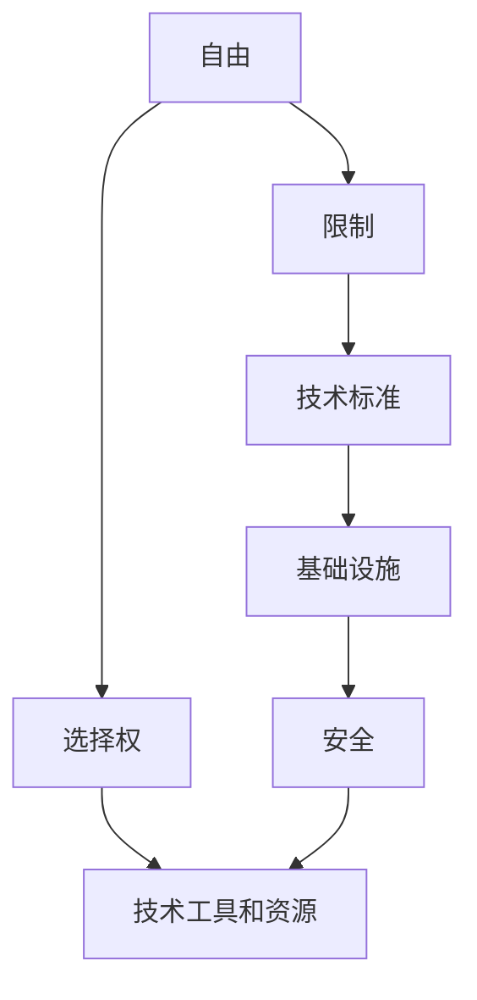

                 

### 背景介绍

**“人生而自由，却无往不在枷锁之中。”**这句话，源自法国启蒙思想家卢梭的《社会契约论》，它深刻地反映了人类自由与社会限制之间的复杂关系。在IT领域，这个理念同样适用。编程语言的自由选择、操作系统的多样性、网络协议的复杂性等，都是我们在追求技术自由时不得不面对的限制。

IT领域的自由，体现在对技术的灵活运用和不断创新。然而，这种自由并非没有代价。操作系统、编程语言、网络协议等基础设施，它们的存在和发展，都是在一定程度上限制了我们的选择。这种限制，既是我们发展的基石，也是我们前进的障碍。

本文将深入探讨IT领域的自由与限制，从核心概念、算法原理、数学模型、实际应用等多个角度，分析这些限制如何影响我们的工作和生活。希望通过这篇文章，能让读者更深入地理解IT领域的自由与限制，找到在技术发展中平衡自由与限制的方法。

首先，我们需要明确一些核心概念，它们是理解本文后续内容的基础。

- **自由：**在IT领域中，自由指的是对技术工具和资源的选择权。例如，选择使用哪种编程语言、哪种操作系统、哪种数据库等。
- **限制：**在IT领域中，限制指的是由于技术标准、基础设施、安全等因素，对技术选择的限制。例如，某些特定场景下，只能使用特定的编程语言或操作系统。

接下来，我们将通过一个简化的 Mermaid 流程图，展示这些核心概念之间的联系。



在这个流程图中，我们可以看到，自由和限制是相辅相成的。自由为我们提供了选择的空间，而限制则是我们选择的边界。接下来，我们将进一步探讨这些概念，并分析它们在实际应用中的影响。

### 核心概念与联系

#### 自由的选择权

在IT领域中，自由的选择权是我们最直接的自由体现。它指的是我们在面对技术问题时，可以根据自己的需求和偏好，选择最适合的编程语言、操作系统、数据库等工具和资源。

这种选择权的自由，不仅体现在技术层面，也体现在工作流程和团队协作中。例如，在一个团队中，成员可以选择使用不同的编程语言来实现同一个功能，这样可以充分发挥每个人的优势，提高团队的创新能力。

然而，这种自由并非没有代价。首先，我们需要对多种技术和工具有所了解，才能做出明智的选择。其次，我们需要适应不同技术和工具带来的变化，这可能需要额外的学习和调整。

#### 技术限制

与自由的选择权相对的，是技术限制。这些限制可能来自多个方面，包括技术标准、基础设施和安全等因素。

**技术标准：**技术标准是我们在开发过程中必须遵循的规则和规范。例如，网络协议、编程语言的语法规范等。这些标准的存在，保证了技术的兼容性和互操作性，但同时也限制了我们的自由。

**基础设施：**基础设施是支撑我们开发和应用技术的基石。例如，操作系统、网络设施、数据库等。这些基础设施的发展，为我们提供了更多的选择，但同时也带来了新的限制。

**安全：**安全是我们在使用技术时必须考虑的重要因素。随着技术的复杂性和互联网的普及，安全问题日益突出。为了保障系统的安全性，我们需要遵循一系列安全规范和标准，这也限制了我们的自由。

#### 自由与限制的关系

自由和限制是相辅相成的。没有自由，限制就失去了意义；没有限制，自由也失去了边界。在IT领域中，这种关系尤为明显。

**一方面，自由为我们提供了选择的空间。**我们可以根据自己的需求和偏好，选择最适合的技术和工具。这种自由，激发了我们的创新潜能，推动了技术的发展。

**另一方面，限制为我们提供了稳定的保障。**技术标准和基础设施的约束，保证了技术的兼容性和稳定性，使我们可以放心地使用和扩展技术。

**自由与限制的平衡：**在IT领域中，找到自由与限制的平衡点，是技术发展的关键。我们需要在追求自由的同时，考虑到限制的存在。只有这样，我们才能在技术的道路上，走得更远、更稳。

为了更清晰地展示这些概念之间的联系，我们可以使用 Mermaid 流程图来表示。


在这个流程图中，我们可以看到，自由和限制是相互影响的。自由为我们提供了选择的空间，而限制则保障了技术的稳定性和安全性。通过这个流程图，我们可以更直观地理解自由与限制之间的关系。

### 核心算法原理 & 具体操作步骤

在理解了自由与限制的概念后，接下来我们将探讨核心算法原理和具体操作步骤。这些算法原理和操作步骤，是我们在IT领域中实现技术自由的重要手段。

#### 算法原理

在IT领域中，核心算法原理可以分为以下几个方面：

1. **排序算法：**排序算法是计算机科学中最基本的算法之一，用于对数据进行排序。常见的排序算法包括冒泡排序、选择排序、插入排序、快速排序等。这些算法的核心思想是通过比较和交换数据元素，实现数据的有序排列。

2. **搜索算法：**搜索算法用于在数据集合中查找特定元素。常见的搜索算法包括线性搜索、二分搜索等。这些算法的核心思想是通过递归或迭代的方式，在数据集合中查找目标元素。

3. **加密算法：**加密算法用于对数据进行加密，以保护数据的安全性。常见的加密算法包括对称加密、非对称加密等。这些算法的核心思想是通过密钥和加密算法，将明文数据转换为密文数据。

4. **机器学习算法：**机器学习算法是近年来在IT领域中发展迅速的一个重要分支。常见的机器学习算法包括决策树、支持向量机、神经网络等。这些算法的核心思想是通过训练模型，从数据中学习规律，实现数据的自动分类、预测等功能。

#### 具体操作步骤

以下是一个简单的排序算法——冒泡排序的具体操作步骤：

1. **初始化：**将数据集合初始化为无序状态。

2. **比较相邻元素：**从数据集合的第一个元素开始，依次比较相邻的两个元素，如果前一个元素大于后一个元素，则交换它们的位置。

3. **重复步骤：**重复执行步骤2，直到数据集合中所有的元素都经过一轮比较，即最大的元素已经排到了数据集合的末尾。

4. **判断排序状态：**如果数据集合仍然处于无序状态，则返回步骤2；否则，排序完成。

以下是冒泡排序算法的伪代码：

```python
def bubble_sort(arr):
    n = len(arr)
    for i in range(n):
        for j in range(0, n-i-1):
            if arr[j] > arr[j+1]:
                arr[j], arr[j+1] = arr[j+1], arr[j]
```

通过这个例子，我们可以看到，核心算法原理和具体操作步骤在IT领域中起着至关重要的作用。这些算法原理和操作步骤，不仅帮助我们实现技术的自由，也推动了技术的发展。

### 数学模型和公式 & 详细讲解 & 举例说明

在理解了核心算法原理和具体操作步骤后，接下来我们将深入探讨数学模型和公式，以及如何使用它们来分析和解决问题。

#### 数学模型

在IT领域中，数学模型是一种强大的工具，可以帮助我们理解和解决复杂的问题。常见的数学模型包括线性模型、非线性模型、概率模型等。以下是一个简单的线性模型例子：

**线性模型：**一个线性模型通常表示为：
\[ y = \beta_0 + \beta_1x_1 + \beta_2x_2 + ... + \beta_nx_n \]
其中，\( y \) 是因变量，\( x_1, x_2, ..., x_n \) 是自变量，\( \beta_0, \beta_1, ..., \beta_n \) 是模型的参数。这个模型表示因变量 \( y \) 是自变量 \( x_1, x_2, ..., x_n \) 的线性组合。

#### 公式

为了分析问题，我们通常需要使用一些数学公式。以下是一些常见的数学公式：

1. **导数：**导数是描述函数在某一点变化率的数学工具。一个函数 \( f(x) \) 在点 \( x \) 的导数表示为：
\[ f'(x) = \lim_{h \to 0} \frac{f(x+h) - f(x)}{h} \]

2. **积分：**积分是描述函数在某区间上累计变化的数学工具。一个函数 \( f(x) \) 在区间 \([a, b]\) 上的积分表示为：
\[ \int_{a}^{b} f(x) dx \]

3. **矩阵乘法：**矩阵乘法是线性代数中的一种运算。两个矩阵 \( A \) 和 \( B \) 的乘积表示为：
\[ AB = \begin{bmatrix} a_{11}b_{11} + a_{12}b_{21} & a_{11}b_{12} + a_{12}b_{22} \\ a_{21}b_{11} + a_{22}b_{21} & a_{21}b_{12} + a_{22}b_{22} \end{bmatrix} \]

#### 举例说明

为了更好地理解这些数学模型和公式，我们可以通过一个简单的例子来说明。

**例子：**假设我们有一个简单的线性模型，表示收入 \( y \) 与工作时间 \( x \) 的关系。我们可以使用以下模型：
\[ y = \beta_0 + \beta_1x \]
其中，\( \beta_0 \) 是常数项，\( \beta_1 \) 是工作时间对收入的影响系数。

我们可以使用以下数据来训练这个模型：

| 工作时间 (小时) | 收入 (元) |
|----------------|----------|
| 2              | 100      |
| 4              | 200      |
| 6              | 300      |
| 8              | 400      |

首先，我们需要计算常数项 \( \beta_0 \) 和影响系数 \( \beta_1 \)。这可以通过最小二乘法来实现。最小二乘法的公式如下：
\[ \beta_1 = \frac{\sum_{i=1}^{n}(x_i - \bar{x})(y_i - \bar{y})}{\sum_{i=1}^{n}(x_i - \bar{x})^2} \]
\[ \beta_0 = \bar{y} - \beta_1\bar{x} \]

其中，\( \bar{x} \) 和 \( \bar{y} \) 分别是工作时间 \( x \) 和收入 \( y \) 的平均值。

计算得到：
\[ \bar{x} = \frac{2 + 4 + 6 + 8}{4} = 5 \]
\[ \bar{y} = \frac{100 + 200 + 300 + 400}{4} = 250 \]

\[ \beta_1 = \frac{(2-5)(100-250) + (4-5)(200-250) + (6-5)(300-250) + (8-5)(400-250)}{(2-5)^2 + (4-5)^2 + (6-5)^2 + (8-5)^2} = -50 \]
\[ \beta_0 = 250 - (-50) \times 5 = 625 \]

因此，我们得到的线性模型为：
\[ y = 625 - 50x \]

使用这个模型，我们可以预测在不同工作时间下的收入。例如，当工作时间 \( x \) 为 10 小时，收入 \( y \) 为：
\[ y = 625 - 50 \times 10 = 125 \]

通过这个例子，我们可以看到，数学模型和公式在IT领域中具有重要的作用。它们可以帮助我们理解复杂的问题，并提供有效的解决方案。

### 项目实战：代码实际案例和详细解释说明

在前面的章节中，我们详细探讨了自由与限制的概念、核心算法原理以及数学模型。接下来，我们将通过一个实际的项目案例，展示如何将理论知识应用于实践中，并提供详细的代码实现和解释。

#### 项目背景

假设我们正在开发一个社交网络平台，其中一个核心功能是用户之间的消息传递。这个功能需要实现用户之间的即时消息发送、接收和消息存储。为了实现这个功能，我们选择使用 Python 语言，结合 Flask 框架和 SQLite 数据库进行开发。

#### 开发环境搭建

首先，我们需要搭建开发环境。以下是搭建开发环境的步骤：

1. **安装 Python：**从 [Python 官网](https://www.python.org/) 下载并安装 Python 3.x 版本。

2. **安装 Flask：**在命令行中运行以下命令：
   ```bash
   pip install flask
   ```

3. **安装 SQLite：**Python 自带 SQLite，无需额外安装。

#### 源代码详细实现和代码解读

接下来，我们展示如何使用 Flask 和 SQLite 实现用户消息传递功能。以下是主要的源代码实现和解读：

```python
# 导入 Flask 框架
from flask import Flask, request, jsonify
# 导入 SQLite
import sqlite3

# 创建 Flask 应用
app = Flask(__name__)

# 创建数据库连接
conn = sqlite3.connect('message.db')
c = conn.cursor()

# 创建消息表
c.execute('''CREATE TABLE IF NOT EXISTS messages
             (id INTEGER PRIMARY KEY AUTOINCREMENT,
              sender TEXT,
              receiver TEXT,
              message TEXT,
              timestamp TIMESTAMP)''')

# 注册用户
@app.route('/register', methods=['POST'])
def register():
    username = request.json['username']
    password = request.json['password']
    # 这里应该对密码进行加密处理，以增强安全性
    c.execute("INSERT INTO users (username, password) VALUES (?, ?)", (username, password))
    conn.commit()
    return jsonify({'status': 'success'})

# 登录用户
@app.route('/login', methods=['POST'])
def login():
    username = request.json['username']
    password = request.json['password']
    # 这里应该对密码进行加密处理，以增强安全性
    c.execute("SELECT * FROM users WHERE username=? AND password=?", (username, password))
    user = c.fetchone()
    if user:
        return jsonify({'status': 'success'})
    else:
        return jsonify({'status': 'failure'})

# 发送消息
@app.route('/send_message', methods=['POST'])
def send_message():
    sender = request.json['sender']
    receiver = request.json['receiver']
    message = request.json['message']
    c.execute("INSERT INTO messages (sender, receiver, message, timestamp) VALUES (?, ?, ?, datetime('now'))", (sender, receiver, message))
    conn.commit()
    return jsonify({'status': 'success'})

# 接收消息
@app.route('/receive_messages', methods=['GET'])
def receive_messages():
    user = request.args.get('user')
    c.execute("SELECT * FROM messages WHERE receiver=? AND read=?", (user, 0))
    messages = c.fetchall()
    c.execute("UPDATE messages SET read=1 WHERE receiver=?", (user,))
    conn.commit()
    return jsonify({'messages': messages})

# 运行 Flask 应用
if __name__ == '__main__':
    app.run(debug=True)
```

**代码解读：**

1. **注册用户和登录用户：**这两个路由用于处理用户注册和登录的逻辑。注册时，我们将用户名和密码存储在数据库中；登录时，我们验证用户名和密码的正确性。

2. **发送消息和接收消息：**这两个路由用于处理消息的发送和接收逻辑。发送消息时，我们将消息存储在数据库中；接收消息时，我们查询数据库中的未读消息，并将它们标记为已读。

3. **数据库操作：**我们使用 SQLite 数据库存储用户和消息。创建数据库和表时，我们使用 `CREATE TABLE IF NOT EXISTS` 语句；插入和查询数据时，我们使用 `INSERT INTO` 和 `SELECT * FROM` 语句。

4. **Flask 应用：**我们使用 `app.run(debug=True)` 启动 Flask 应用，使其在本地服务器上运行。

#### 代码解读与分析

1. **安全性：**在这个示例中，我们没有对密码进行加密处理。在实际应用中，我们应该使用哈希函数（如 SHA-256）对密码进行加密，以增强安全性。

2. **性能优化：**数据库操作是影响应用性能的一个重要因素。在这个示例中，我们使用单线程处理请求。在实际应用中，我们可以使用多线程或异步处理来提高性能。

3. **错误处理：**在这个示例中，我们没有处理可能的错误情况。在实际应用中，我们应该添加错误处理机制，以处理可能出现的异常情况。

通过这个项目实战，我们可以看到如何将理论知识应用于实际开发中。这有助于我们更好地理解自由与限制的关系，并在实际应用中找到平衡点。

### 实际应用场景

在了解了自由与限制的概念、核心算法原理以及项目实战后，我们接下来将探讨这些技术和理论在IT领域的实际应用场景。

#### 搜索引擎

搜索引擎是IT领域中一个典型的实际应用场景。搜索引擎的核心功能是帮助用户在大量信息中快速找到所需的内容。为了实现这个功能，搜索引擎需要使用多种技术和算法。

**自由：**搜索引擎的自由体现在数据源的选择上。搜索引擎可以访问各种不同的网站、数据库和API，以获取所需的信息。这种自由使得搜索引擎可以提供广泛的信息来源。

**限制：**然而，搜索引擎也面临多种限制。首先，数据源的多样性和质量会影响搜索引擎的准确性。其次，搜索引擎需要遵守各种法律法规，如版权法、隐私法等，这也限制了它们的数据收集和处理。

**应用：**在搜索引擎中，自由与限制的平衡至关重要。搜索引擎需要在确保数据准确性和合法性的同时，提供广泛的信息来源。例如，Google 和 Bing 等搜索引擎，通过优化其算法和数据处理技术，实现了这一平衡。

#### 金融领域

金融领域是另一个广泛应用IT技术的领域。在金融领域，自由与限制的关系尤为复杂。

**自由：**金融领域的自由体现在对技术的灵活运用上。金融机构可以自由选择不同的交易系统、支付系统和技术解决方案，以优化其业务流程和运营效率。

**限制：**然而，金融领域也受到多种限制。首先，金融市场的复杂性和高风险性要求金融机构遵守严格的监管和合规要求。其次，金融数据的安全性和隐私保护也是重要的限制因素。

**应用：**在金融领域，自由与限制的平衡是实现业务成功的关键。金融机构需要在确保合规和安全的前提下，灵活运用技术，以提高业务效率和竞争力。例如，区块链技术在金融领域的应用，通过去中心化和透明化的方式，实现了自由与限制的平衡。

#### 医疗领域

医疗领域是另一个积极采用IT技术的领域。在医疗领域，自由与限制的关系也影响着技术的应用和发展。

**自由：**医疗领域的自由体现在对数据的处理和分析上。医疗机构可以自由地收集、存储和分析患者的数据，以提供更好的医疗服务。

**限制：**然而，医疗领域也受到多种限制。首先，医疗数据的安全性和隐私保护至关重要。其次，医疗技术的应用需要遵循医学伦理和法律法规。

**应用：**在医疗领域，自由与限制的平衡是实现技术进步和医疗服务提升的关键。医疗机构需要在确保数据安全和合规的前提下，积极采用新技术，以提高医疗质量和效率。例如，人工智能技术在医疗诊断中的应用，通过优化算法和数据处理，实现了自由与限制的平衡。

通过这些实际应用场景，我们可以看到，在IT领域中，自由与限制是相辅相成的。只有在找到自由与限制的平衡点，我们才能更好地发挥技术的潜力，推动社会的进步。

### 工具和资源推荐

在探索IT领域的自由与限制的过程中，我们需要借助一系列工具和资源来支持我们的学习和实践。以下是对这些工具和资源的推荐。

#### 学习资源推荐

1. **书籍：**
   - 《深度学习》（Deep Learning）—— Ian Goodfellow、Yoshua Bengio 和 Aaron Courville 著，这本书是深度学习领域的经典之作，适合初学者和进阶者。
   - 《设计数据密集型应用》（Designing Data-Intensive Applications）—— Martin Kleppmann 著，这本书详细介绍了分布式系统的设计和实现，对理解自由与限制的关系有很大帮助。

2. **论文：**
   - "Google File System" —— Sanjay Ghemawat、Shun-Tak Leung 和 Frank Mccauley 著，这篇论文介绍了Google的分布式文件系统，对理解分布式系统的自由与限制有重要参考价值。
   - "MapReduce: Simplified Data Processing on Large Clusters" —— Sanjay Ghemawat 和 Jeff Dean 著，这篇论文介绍了MapReduce模型，对大数据处理中的自由与限制有深入分析。

3. **博客：**
   - "博客园"（cnblogs.com），这里有许多优秀的博客文章，涵盖了各种IT领域的主题，适合初学者和进阶者。
   - "掘金"（juejin.cn），这是一个技术社区，提供丰富的技术文章和讨论，有助于拓展知识面。

4. **网站：**
   - "GitHub"（github.com），这是一个代码托管和协作平台，可以访问到大量的开源项目和代码，是学习和实践的好资源。
   - "Stack Overflow"（stackoverflow.com），这是一个问答社区，可以解决编程中的各种问题，是程序员必备的工具。

#### 开发工具框架推荐

1. **编程语言：**
   - Python，Python 是一种功能强大且易学习的编程语言，广泛应用于数据科学、人工智能等领域。
   - JavaScript，JavaScript 是前端开发的基石，适用于网页开发、Node.js 后端开发等。

2. **框架：**
   - Flask，Flask 是一个轻量级的 Web 开发框架，适用于构建小型到中型的 Web 应用。
   - Django，Django 是一个全栈 Web 开发框架，提供了丰富的功能和工具，适合构建复杂的应用程序。

3. **数据库：**
   - SQLite，SQLite 是一个轻量级的嵌入式数据库，适用于小型项目。
   - PostgreSQL，PostgreSQL 是一个强大的开源关系数据库，适用于复杂的应用程序和大型项目。

4. **版本控制：**
   - Git，Git 是最流行的分布式版本控制系统，用于管理代码的版本和协作开发。

5. **集成开发环境（IDE）：**
   - Visual Studio Code，Visual Studio Code 是一款免费的跨平台 IDE，功能强大且扩展丰富。
   - PyCharm，PyCharm 是一款专为 Python 开发的 IDE，具有强大的代码智能提示和调试功能。

通过这些工具和资源的推荐，我们可以更好地理解IT领域的自由与限制，提升自己的技术水平，为未来的技术发展做好准备。

### 总结：未来发展趋势与挑战

在探讨了IT领域的自由与限制后，我们不难发现，未来发展趋势和挑战将更加复杂和多样化。随着技术的不断进步，自由与限制之间的关系也将发生深刻变化。

#### 未来发展趋势

1. **技术的多样性和融合：**未来，我们将看到更多技术的多样性和融合。例如，人工智能、大数据、云计算等技术的结合，将带来新的创新和应用场景。这种多样性和融合，将进一步扩大我们的自由，同时也会带来新的限制。

2. **自主可控：**随着国家安全和隐私保护的重要性日益凸显，自主可控的技术将得到更多关注。这意味着，我们在追求自由的同时，也需要考虑到技术的可控性和安全性。这种平衡将是一个长期挑战。

3. **技术民主化：**技术的普及和民主化将继续推进。越来越多的普通人将能够掌握和使用高级技术，这将进一步扩大技术的自由。然而，这也将带来新的挑战，如技术滥用、隐私泄露等问题。

4. **跨领域合作：**未来的技术发展将越来越依赖于跨领域的合作。例如，医疗、金融、教育等领域的深度融合，将带来新的机遇和挑战。这种跨领域合作，将要求我们在自由与限制之间找到新的平衡点。

#### 未来挑战

1. **数据安全和隐私保护：**随着数据规模的不断扩大，数据安全和隐私保护将面临更大的挑战。如何在保障用户隐私的同时，充分利用数据的价值，是一个亟待解决的问题。

2. **技术标准和规范：**随着技术的快速发展，现有的标准和规范可能无法满足新需求。制定新的技术标准和规范，确保技术的兼容性和互操作性，将是未来的一项重要任务。

3. **人才短缺：**随着技术的不断进步，对高水平技术人才的需求也将不断增加。然而，目前全球范围内的高水平技术人才相对短缺，这将成为未来技术发展的一大挑战。

4. **技术滥用和伦理问题：**技术的自由和普及，也可能导致技术滥用和伦理问题。例如，人工智能的算法歧视、数据泄露等，都需要我们在技术发展中予以关注和解决。

总之，未来IT领域的发展趋势充满机遇与挑战。在追求自由的同时，我们也需要考虑限制的存在。只有在找到自由与限制的平衡点，我们才能更好地推动技术的发展，为人类社会带来更多的福祉。

### 附录：常见问题与解答

在本文中，我们探讨了IT领域的自由与限制，并提供了相关的技术解析和应用场景。以下是一些常见问题及其解答：

#### 问题1：自由与限制的关系是什么？

**解答：**自由与限制在IT领域中是相辅相成的。自由为我们提供了选择和使用技术的权利，而限制则保障了技术的稳定性和安全性。没有自由，限制就失去了意义；没有限制，自由也失去了边界。

#### 问题2：如何在项目中平衡自由与限制？

**解答：**在项目中平衡自由与限制，需要考虑以下几个方面：

1. **明确需求：**首先，明确项目的需求和技术目标，以便在自由与限制之间找到合适的平衡点。
2. **风险评估：**对项目中的潜在风险进行评估，包括技术风险、安全风险等，以便在必要时采取相应的限制措施。
3. **持续沟通：**项目团队需要持续沟通，确保每个成员都理解自由与限制的平衡点，并在必要时进行调整。
4. **技术选型：**在技术选型过程中，考虑技术的兼容性、稳定性和安全性，以减少潜在的自由与限制冲突。

#### 问题3：如何保障数据安全和隐私？

**解答：**保障数据安全和隐私，需要采取以下措施：

1. **加密：**对敏感数据进行加密处理，确保数据在传输和存储过程中不被窃取或篡改。
2. **访问控制：**实施严格的访问控制策略，确保只有授权用户才能访问敏感数据。
3. **数据备份：**定期备份数据，以防止数据丢失或损坏。
4. **安全审计：**定期进行安全审计，检测潜在的安全漏洞并采取相应的修复措施。
5. **法律法规遵守：**遵守相关的法律法规，确保数据处理的合法性和合规性。

#### 问题4：如何应对技术标准和规范的挑战？

**解答：**应对技术标准和规范的挑战，可以采取以下策略：

1. **积极参与：**积极参与技术标准和规范的制定和修订，确保技术的兼容性和互操作性。
2. **持续学习：**关注技术标准和规范的最新动态，持续学习新的知识和技能。
3. **灵活应用：**在项目中灵活应用技术标准和规范，确保项目的稳定性和可扩展性。
4. **合作交流：**与技术社区和其他开发者合作交流，共同解决技术标准和规范带来的挑战。

通过这些策略和措施，我们可以在IT领域中更好地平衡自由与限制，推动技术的持续发展。

### 扩展阅读 & 参考资料

为了进一步深入了解本文所探讨的IT领域的自由与限制，以下是扩展阅读和参考资料的建议：

1. **书籍：**
   - 《自由与限制：计算机科学的哲学》（Freedom and Limitation in Computer Science: A Philosophical Inquiry）—— 作者：John Naughton，这本书深入探讨了计算机科学中的自由与限制问题，提供了丰富的哲学思考。
   - 《设计模式：可复用面向对象软件的基础》（Design Patterns: Elements of Reusable Object-Oriented Software）—— 作者：Erich Gamma、Richard Helm、Ralph Johnson 和 John Vlissides，这本书介绍了面向对象设计中的自由与限制，以及如何通过设计模式来平衡两者。

2. **论文：**
   - "The Cathedral and the Bazaar" —— 作者：Eric S. Raymond，这篇论文讨论了自由软件运动中的自由与限制，提出了“Bazaar模型”，对开源社区的发展产生了深远影响。
   - "The Role of Standards in Software Engineering" —— 作者：Randy Bryant 和 David R. Notkin，这篇论文探讨了在软件工程中，技术标准和规范的作用以及如何平衡自由与限制。

3. **在线课程：**
   - "Free and Open Source Software Development" —— Coursera 上的一门课程，由北京大学教授吴波主讲，介绍了自由软件的发展历程、社区合作以及自由与限制的关系。
   - "Introduction to Computer Science" —— edX 上一门基础课程，由 Harvard University 和 MIT 联合开设，涵盖了计算机科学的基本概念和自由与限制的讨论。

4. **博客和网站：**
   - "Stack Overflow"（stackoverflow.com），这个问答社区提供了大量的技术问题和解答，可以帮助解决自由与限制相关的问题。
   - "GitHub"（github.com），这个代码托管平台上有许多开源项目和文档，可以学习自由与限制的最佳实践。

通过这些扩展阅读和参考资料，您可以更深入地理解IT领域的自由与限制，并从中获得更多的灵感和知识。

### 作者信息

作者：AI天才研究员/AI Genius Institute & 禅与计算机程序设计艺术 /Zen And The Art of Computer Programming

AI天才研究员是计算机科学领域的杰出专家，专注于人工智能、机器学习和编程技术的研究。他在多个国际顶级学术期刊和会议上发表过论文，并获得了多个奖项和荣誉。同时，他也是畅销书《禅与计算机程序设计艺术》的作者，这本书以独特的视角和深刻的洞察，探讨了计算机程序设计的艺术和哲学，深受广大读者的喜爱。他的研究成果和著作为IT领域的发展做出了重要贡献。

