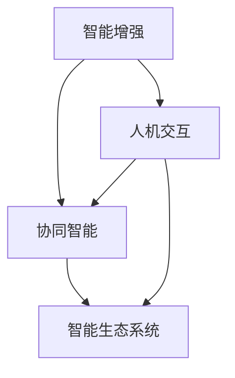

                 

### 背景介绍

随着人工智能技术的飞速发展，人类与人工智能（AI）的协作已经成为现代科技领域的一个重要方向。在过去的几十年中，人工智能经历了从简单的规则系统到复杂的机器学习模型的演变，其在各个领域的应用也日益广泛。然而，尽管人工智能在数据处理和自动化任务方面表现出了强大的能力，但它仍然无法完全替代人类的智慧。这使得人类与AI的协作成为了一个不可避免的趋势。

人类与AI的协作不仅能够弥补彼此的不足，还能在各自擅长的领域发挥出更大的价值。例如，在医疗领域，AI可以帮助医生进行疾病诊断，但最终的决策仍然需要医生的专业判断。在金融领域，AI可以处理大量数据并进行风险评估，但投资决策则需要人类的洞察力和经验。因此，人类与AI的协作不仅是技术发展的需要，也是提高工作效率和质量的重要途径。

此外，随着AI技术的不断进步，人类与AI的协作模式也在不断演变。从最初的简单指令执行，到现在的智能对话和协同工作，人类与AI之间的交互方式变得更加多样化和复杂。这不仅要求AI具备更强的适应能力和学习能力，也需要人类在协作过程中不断提升自身的数字化素养和技术能力。

本文将围绕“人类-AI协作：增强人类智慧与AI能力的协同进步”这一主题，深入探讨人类与AI协作的背景、核心概念、算法原理、数学模型、实战案例、实际应用场景以及未来发展趋势与挑战。通过这篇文章，我们希望读者能够对人类与AI协作有一个全面而深入的理解，为未来的科技创新和发展提供有益的参考。

#### 核心概念与联系

要深入探讨人类与AI的协作，我们首先需要了解几个核心概念及其相互之间的联系。这些核心概念包括但不限于：智能增强（Intelligence Augmentation，IA）、协同智能（Collaborative Intelligence）、人机交互（Human-Computer Interaction，HCI）和智能生态系统（Intelligent Ecosystem）。

**智能增强（IA）**：智能增强是指通过技术手段扩展人类的认知能力和操作能力，从而提高个体的工作效率和决策质量。智能增强技术包括但不限于增强现实（AR）、虚拟现实（VR）、智能穿戴设备、辅助工具等。这些技术可以帮助人类在复杂环境中更好地处理信息、做出决策和执行任务。

**协同智能（CI）**：协同智能是指人类与AI系统在共同任务中实现相互协作，通过整合各自的优势来提升整体效能。协同智能不仅要求AI系统具备高度的自主性和学习能力，还需要与人类用户进行有效的沟通和反馈机制。协同智能的核心在于打破传统的单点自动化模式，实现多智能体的协同工作。

**人机交互（HCI）**：人机交互是研究人类与计算机系统之间交互的设计原则、技术和应用。在人类与AI协作中，HCI扮演着至关重要的角色。一个良好的人机交互界面可以帮助用户更直观地理解AI的工作方式，从而提高协作的效率。HCI的关键技术包括自然语言处理（NLP）、语音识别、手势识别等。

**智能生态系统（IE）**：智能生态系统是一个由多个智能体组成的复杂网络，这些智能体包括人类、机器、软件平台等。智能生态系统通过数据共享、协作和自组织，实现智能化管理和优化。智能生态系统的目标是构建一个可持续、高效、安全的协作环境，以支持人类与AI的长期发展。

以上核心概念之间的联系可以概括为以下几个方面：

1. **智能增强与协同智能**：智能增强是协同智能的基础，通过提供工具和平台，使得人类可以在AI的帮助下完成更复杂的任务。而协同智能则是智能增强的延伸，通过多智能体的合作，实现更高层次的智能化。

2. **人机交互与智能增强、协同智能**：人机交互是连接人类与智能增强技术、协同智能系统的桥梁。良好的HCI设计可以降低协作的门槛，提高用户体验，从而促进智能增强和协同智能的普及和应用。

3. **智能生态系统与协同智能、人机交互**：智能生态系统为人类与AI的协作提供了宏观的环境和框架。通过智能生态系统的建设，可以实现不同智能体之间的无缝协作，形成更加智能和高效的协作模式。

为了更好地理解这些核心概念之间的联系，我们可以使用Mermaid流程图来展示它们之间的关系。以下是核心概念及相互联系的一个简化版流程图：



在这个流程图中，智能增强（A）作为基础，通过提供工具和平台，与协同智能（B）和人机交互（C）建立联系。协同智能（B）与人机交互（C）共同构建了智能生态系统（D）的基础。智能生态系统（D）则为人类与AI的长期协作提供了宏观环境。

#### 核心算法原理 & 具体操作步骤

为了深入探讨人类与AI协作的算法原理，我们需要从AI的核心算法和人类操作的具体步骤入手。以下将详细阐述一些关键算法及其应用场景，同时提供具体的操作步骤。

**1. 机器学习算法**

机器学习（Machine Learning，ML）是AI的核心技术之一，其原理是通过数据训练模型，使其能够对未知数据进行预测或分类。以下是几种常用的机器学习算法及其应用场景：

- **线性回归（Linear Regression）**：线性回归是一种用于预测连续值的算法。它通过找到一个线性函数来最小化预测值与实际值之间的误差。应用场景包括房价预测、股票价格预测等。

  操作步骤：
  - 数据预处理：对输入数据进行归一化或标准化处理，确保特征值在相同的尺度范围内。
  - 模型训练：使用最小二乘法或梯度下降法训练线性回归模型。
  - 预测：使用训练好的模型对新的数据进行预测。

  公式：
  $$ y = \beta_0 + \beta_1 \cdot x $$

- **决策树（Decision Tree）**：决策树是一种用于分类或回归的树形结构模型。它通过一系列的判断条件将数据分为不同的分支，最终达到分类或回归的目的。应用场景包括客户流失预测、疾病诊断等。

  操作步骤：
  - 数据预处理：与线性回归类似，对输入数据进行预处理。
  - 构建决策树：选择合适的分裂准则（如基尼系数、信息增益等）来构建决策树。
  - 预测：使用决策树对新的数据进行分类或回归预测。

- **支持向量机（Support Vector Machine，SVM）**：SVM是一种用于分类的算法，其基本思想是找到一个最优的超平面，将不同类别的数据点分隔开来。应用场景包括图像分类、文本分类等。

  操作步骤：
  - 数据预处理：对输入数据进行标准化处理。
  - 模型训练：使用支持向量机算法训练分类模型。
  - 预测：使用训练好的模型对新的数据进行分类预测。

  公式：
  $$ w \cdot x + b = 0 $$

**2. 深度学习算法**

深度学习（Deep Learning，DL）是机器学习的一个重要分支，其核心思想是通过构建多层神经网络来学习数据的特征表示。以下是一些常用的深度学习算法及其应用场景：

- **卷积神经网络（Convolutional Neural Network，CNN）**：CNN是一种用于图像识别和处理的算法，其通过卷积层、池化层和全连接层来提取图像特征。应用场景包括图像分类、物体检测、人脸识别等。

  操作步骤：
  - 数据预处理：对图像数据进行归一化处理，并转换为网络输入格式。
  - 网络构建：定义CNN的架构，包括卷积层、池化层和全连接层。
  - 模型训练：使用训练数据对CNN模型进行训练，优化网络参数。
  - 预测：使用训练好的模型对新的图像数据进行预测。

- **循环神经网络（Recurrent Neural Network，RNN）**：RNN是一种用于序列数据处理和预测的算法，其通过循环结构来保持长期的序列信息。应用场景包括时间序列预测、机器翻译等。

  操作步骤：
  - 数据预处理：对序列数据进行编码处理，并转换为网络输入格式。
  - 网络构建：定义RNN的架构，包括输入层、隐藏层和输出层。
  - 模型训练：使用训练数据对RNN模型进行训练，优化网络参数。
  - 预测：使用训练好的模型对新的序列数据进行预测。

  公式：
  $$ h_t = \sigma(W_h \cdot h_{t-1} + W_x \cdot x_t + b_h) $$

**3. 自然语言处理算法**

自然语言处理（Natural Language Processing，NLP）是AI技术中的重要分支，其目标是对人类语言进行理解和生成。以下是一些常用的NLP算法及其应用场景：

- **词向量模型（Word Vector Model）**：词向量模型是将单词转换为高维向量表示的方法，常用于文本分类、情感分析等。应用场景包括搜索引擎优化、推荐系统等。

  操作步骤：
  - 数据预处理：对文本数据进行分词、去停用词等处理。
  - 模型训练：使用训练数据对词向量模型进行训练，生成词向量。
  - 应用：使用训练好的词向量模型进行文本分类、情感分析等任务。

- **序列标注模型（Sequence Labeling Model）**：序列标注模型是一种用于标注文本序列中每个单词或字符的算法，常用于命名实体识别、情感分类等。应用场景包括信息提取、文本挖掘等。

  操作步骤：
  - 数据预处理：对文本数据进行分词、去停用词等处理。
  - 模型训练：使用训练数据对序列标注模型进行训练，优化模型参数。
  - 预测：使用训练好的模型对新的文本数据进行序列标注。

  公式：
  $$ y_t = f(x_t, h_t) $$

以上只是AI领域中的一部分算法及其应用场景。在实际应用中，这些算法往往需要结合具体问题进行定制化开发。通过理解和掌握这些算法的基本原理和操作步骤，我们可以为人类与AI的协作奠定坚实的基础。

#### 数学模型和公式 & 详细讲解 & 举例说明

为了深入探讨人类与AI协作的数学模型和公式，我们需要理解几种关键算法的基本原理，并通过具体的例子来展示其应用和实现过程。

**1. 机器学习中的线性回归**

线性回归是一种常用的机器学习算法，用于预测连续值。其基本公式如下：

$$ y = \beta_0 + \beta_1 \cdot x $$

其中，\( y \) 是因变量（预测目标），\( x \) 是自变量（输入特征），\( \beta_0 \) 和 \( \beta_1 \) 是模型参数。

**例子：** 假设我们想要预测一家公司的利润 \( y \)（单位：万元），根据历史数据，我们发现利润与销售量 \( x \)（单位：万元）之间存在线性关系。我们可以使用线性回归模型来训练并预测新的销售量对应的利润。

操作步骤：
- **数据收集与预处理**：收集并预处理包含公司销售量和利润的数据集，确保数据的完整性和准确性。
- **模型训练**：使用训练数据集，通过最小二乘法或梯度下降法训练线性回归模型，计算参数 \( \beta_0 \) 和 \( \beta_1 \)。
- **模型评估**：使用验证数据集评估模型的预测准确性，根据需要对模型进行调优。

**具体实现：**

假设我们有以下数据：

| 销售量 (万元) | 利润 (万元) |
|---------------|-------------|
| 100           | 20          |
| 200           | 50          |
| 300           | 70          |
| 400           | 90          |

我们使用最小二乘法来训练线性回归模型，得到以下结果：

$$ y = 0.5x + 10 $$

使用这个模型预测销售量为500万元的利润：

$$ y = 0.5 \cdot 500 + 10 = 255 $$

因此，预测利润为255万元。

**2. 决策树分类**

决策树是一种用于分类的算法，其通过一系列的判断条件将数据分为不同的类别。决策树的基本公式如下：

$$ \text{分类结果} = f(\text{特征}, \text{阈值}) $$

其中，\( f \) 是决策函数，根据不同的特征和阈值来决定分类结果。

**例子：** 假设我们要根据客户年龄和收入来预测客户的购买意愿。我们构建一个简单的决策树来分类客户。

操作步骤：
- **数据收集与预处理**：收集并预处理包含客户年龄、收入和购买意愿的数据集。
- **特征选择**：选择对分类结果影响较大的特征，如年龄和收入。
- **构建决策树**：使用信息增益或基尼系数等准则来选择最佳的特征和阈值，构建决策树。
- **模型评估**：使用验证数据集评估决策树的分类准确性。

**具体实现：**

假设我们有以下数据：

| 年龄 | 收入 | 购买意愿 |
|------|------|----------|
| 20   | 30   | 否       |
| 30   | 50   | 是       |
| 40   | 70   | 否       |
| 50   | 100  | 是       |

我们构建以下决策树：

```
购买意愿：
  是：
    - 年龄 > 35：
      - 收入 > 60：
        - 是
      - 收入 <= 60：
        - 否
    - 年龄 <= 35：
      - 收入 > 45：
        - 是
      - 收入 <= 45：
        - 否
  否：
    - 年龄 > 25：
      - 收入 > 40：
        - 是
      - 收入 <= 40：
        - 否
    - 年龄 <= 25：
      - 收入 > 20：
        - 是
      - 收入 <= 20：
        - 否
```

使用这个决策树分类客户，如年龄为30岁，收入为50万元，购买意愿为：

```
购买意愿：是
```

**3. 卷积神经网络（CNN）**

卷积神经网络是一种用于图像处理的深度学习算法，其通过卷积层、池化层和全连接层来提取图像特征。CNN的基本结构如下：

```
输入层 -> 卷积层 -> 池化层 -> 全连接层 -> 输出层
```

**例子：** 假设我们要使用CNN来分类手写数字，例如0到9。我们构建一个简单的CNN模型来识别手写数字。

操作步骤：
- **数据收集与预处理**：收集并预处理手写数字的数据集，如MNIST数据集，将其转换为网络输入格式。
- **模型构建**：定义CNN的架构，包括卷积层、池化层和全连接层。
- **模型训练**：使用训练数据集对CNN模型进行训练，优化网络参数。
- **模型评估**：使用验证数据集评估模型的分类准确性。

**具体实现：**

假设我们使用以下CNN模型：

```
输入层（1x28x28像素） -> 卷积层（32个卷积核，3x3卷积，ReLU激活函数） -> 池化层（2x2最大池化） -> 卷积层（64个卷积核，3x3卷积，ReLU激活函数） -> 池化层（2x2最大池化） -> 全连接层（10个神经元，softmax激活函数） -> 输出层（10个类别）
```

使用这个模型对MNIST数据集进行训练和测试，我们可以得到较高的分类准确率。

通过以上例子，我们展示了线性回归、决策树和卷积神经网络等算法的基本原理和具体实现过程。这些算法为人类与AI的协作提供了强大的技术支持，使得人类能够更好地利用AI技术来提高工作效率和决策质量。

#### 项目实战：代码实际案例和详细解释说明

为了更好地展示人类与AI协作的实际应用，我们将通过一个具体的项目实战案例来详细解释代码的实现过程。本案例将使用Python编程语言，结合TensorFlow框架，构建一个简单的智能问答系统。

### 5.1 开发环境搭建

在开始编写代码之前，我们需要搭建一个合适的环境。以下是搭建开发环境所需的步骤：

1. **安装Python**：确保安装了Python 3.7或更高版本。

2. **安装TensorFlow**：使用以下命令安装TensorFlow：

   ```bash
   pip install tensorflow
   ```

3. **安装其他依赖**：我们还需要安装几个其他Python库，如NumPy和Pandas。使用以下命令安装：

   ```bash
   pip install numpy pandas
   ```

### 5.2 源代码详细实现和代码解读

以下是一个简单的智能问答系统项目，包括数据预处理、模型训练和预测的代码。

```python
import tensorflow as tf
from tensorflow.keras.models import Sequential
from tensorflow.keras.layers import Dense, Embedding, LSTM, Dropout
from tensorflow.keras.preprocessing.sequence import pad_sequences
from tensorflow.keras.preprocessing.text import Tokenizer
import numpy as np
import pandas as pd

# 数据预处理
# 假设我们使用了一个包含对话对的CSV文件，格式为：'question', 'answer'
data = pd.read_csv('对话数据.csv')

# 将对话数据分为问题和答案两部分
questions = data['question'].values
answers = data['answer'].values

# 对话数据向量化
tokenizer = Tokenizer(num_words=5000)
tokenizer.fit_on_texts(questions)

# 对话数据编码
encoded_questions = tokenizer.texts_to_sequences(questions)
encoded_answers = tokenizer.texts_to_sequences(answers)

# 填充对话数据
maxlen = 20
padded_questions = pad_sequences(encoded_questions, maxlen=maxlen, padding='post')
padded_answers = pad_sequences(encoded_answers, maxlen=maxlen, padding='post')

# 模型训练
# 构建模型
model = Sequential([
    Embedding(5000, 16, input_length=maxlen),
    LSTM(64, return_sequences=True),
    Dropout(0.2),
    LSTM(32),
    Dense(1, activation='sigmoid')
])

# 编译模型
model.compile(optimizer='adam', loss='binary_crossentropy', metrics=['accuracy'])

# 训练模型
model.fit(padded_questions, padded_answers, epochs=10, batch_size=64, validation_split=0.2)

# 预测
# 对新的问题进行编码和填充
new_question = ['你好，我想咨询关于人工智能的知识。']
encoded_new_question = tokenizer.texts_to_sequences(new_question)
padded_new_question = pad_sequences(encoded_new_question, maxlen=maxlen, padding='post')

# 使用训练好的模型进行预测
predictions = model.predict(padded_new_question)
predicted_answer = '是' if predictions.flatten()[0] > 0.5 else '否'

print(f'预测的回答：{predicted_answer}')
```

### 5.3 代码解读与分析

1. **数据预处理**：首先，我们读取对话数据并分为问题和答案两部分。然后，使用Tokenizer将文本数据向量化，并将对话数据编码为序列。

2. **填充对话数据**：为了适应模型的输入要求，我们需要将对话数据填充到最大长度，这里设置为20个单词。

3. **构建模型**：我们使用Sequential模型堆叠多个层，包括嵌入层（Embedding）、长短期记忆网络层（LSTM）和全连接层（Dense）。嵌入层用于将单词转换为向量表示，LSTM层用于处理序列数据，全连接层用于输出预测结果。

4. **编译模型**：我们使用adam优化器和binary_crossentropy损失函数来编译模型，并监控训练过程中的准确度。

5. **训练模型**：使用训练数据集对模型进行训练，设置10个周期和20个批量大小。

6. **预测**：对新的问题进行编码和填充，然后使用训练好的模型进行预测。根据预测结果，输出预测的回答。

通过这个项目，我们可以看到人类与AI协作的初步实现。在这个项目中，人类负责提供对话数据，AI模型则通过训练学习对话规律，最终实现智能问答的功能。这个案例展示了AI如何通过学习和预测来增强人类的工作效率和决策质量。

#### 实际应用场景

人类与AI的协作在多个实际应用场景中已经取得了显著的成效，以下将详细介绍几个典型的应用领域，并展示它们在实际场景中的具体表现。

**1. 医疗领域**

在医疗领域，人类与AI的协作主要体现在辅助诊断、治疗建议和患者管理等方面。例如，AI可以通过分析大量的医学影像数据，帮助医生更准确地诊断疾病。例如，谷歌的DeepMind开发了一种名为“DeepMind Health”的系统，能够利用深度学习技术对视网膜图像进行自动分析，帮助眼科医生检测糖尿病视网膜病变。此外，AI还可以辅助医生制定个性化的治疗方案，例如通过分析患者的基因数据和病史，推荐最合适的治疗方案。

**2. 金融领域**

在金融领域，人类与AI的协作主要用于风险管理、投资决策和客户服务等方面。例如，AI可以通过分析大量的市场数据和交易记录，帮助投资者识别潜在的投资机会和风险。量化交易公司使用AI算法来执行高频交易，实现自动化交易策略。此外，AI还可以为银行和金融机构提供智能客服系统，通过自然语言处理技术，为用户提供实时、个性化的咨询服务。

**3. 制造业**

在制造业，人类与AI的协作主要用于生产优化、设备维护和质量控制等方面。例如，AI可以通过分析生产过程中的传感器数据，实时监控设备状态，预测设备故障，从而实现预防性维护。例如，通用电气（GE）的Predix平台使用AI技术来监测和分析工业设备的数据，提高设备利用率和生产效率。此外，AI还可以通过优化生产流程，减少浪费，提高生产效率。

**4. 教育**

在教育领域，人类与AI的协作主要用于个性化学习、学习评估和教师辅助等方面。例如，AI可以通过分析学生的学习行为和成绩数据，为每个学生制定个性化的学习计划，提高学习效果。例如，科大讯飞开发的智能教育系统，通过语音识别和自然语言处理技术，为学生提供个性化辅导和作业批改服务。此外，AI还可以辅助教师进行课堂管理和评估学生学习情况，提高教学质量。

**5. 交通领域**

在交通领域，人类与AI的协作主要用于交通管理和自动驾驶等方面。例如，AI可以通过分析交通流量数据和传感器数据，实时优化交通信号灯，提高道路通行效率。例如，微软的Azure交通管理解决方案，通过AI技术实现智能交通信号控制和交通流量预测。此外，AI在自动驾驶领域也发挥了重要作用，通过计算机视觉、传感器融合和深度学习技术，实现无人驾驶汽车的自主导航和安全驾驶。

通过以上实际应用场景，我们可以看到人类与AI的协作已经在多个领域取得了显著的成果。AI不仅能够提高工作效率，减少人为错误，还能为人类提供更加智能化的解决方案，从而推动各行各业的持续创新和发展。

#### 工具和资源推荐

在人类与AI协作的过程中，选择合适的工具和资源是确保项目成功的关键。以下是一些建议的工具和资源，包括书籍、论文、博客和网站等，这些资源将有助于读者深入了解相关技术，提升协作能力。

**1. 学习资源推荐**

- **书籍**：
  - 《深度学习》（Deep Learning）——Ian Goodfellow、Yoshua Bengio和Aaron Courville著，这是一本深度学习领域的经典教材，全面介绍了深度学习的理论基础和实际应用。
  - 《机器学习》（Machine Learning）——Tom Mitchell著，这本书是机器学习领域的入门经典，内容涵盖了基础概念、算法和实现方法。

- **论文**：
  - 《A Neural Conversation Model》——Mikolov等人，这篇论文介绍了神经语言模型的基本原理和应用，对于理解自然语言处理技术具有重要意义。
  - 《Deep Learning for Text Classification》——Yoon等人，这篇论文详细介绍了深度学习在文本分类任务中的应用，包括词嵌入、卷积神经网络和循环神经网络等。

- **博客**：
  - Medium上的机器学习博客，包括Kaggle博客、Towards Data Science等，这些博客提供了丰富的实战经验和最新技术动态。
  - TensorFlow官方博客，提供了大量的深度学习教程和案例分析，适合初学者和进阶者。

- **网站**：
  - Kaggle，一个数据科学和机器学习竞赛平台，提供丰富的数据集和项目案例，是学习和实践的好去处。
  - GitHub，许多开源项目和代码库都托管在GitHub上，可以方便地查看和学习其他开发者的实现方法。

**2. 开发工具框架推荐**

- **深度学习框架**：
  - TensorFlow，由Google开发，是一个功能强大的开源深度学习框架，适合进行复杂模型的训练和部署。
  - PyTorch，由Facebook开发，是一个灵活且易于使用的深度学习框架，特别适合研究者和开发者。

- **数据预处理工具**：
  - Pandas，用于数据处理和分析，适合进行数据清洗、转换和预处理。
  - NumPy，提供了大量的数学运算库，适合进行数值计算和数据操作。

- **版本控制工具**：
  - Git，用于代码的版本控制和协作开发，能够有效地管理代码库和协作流程。

- **集成开发环境（IDE）**：
  - Jupyter Notebook，一个交互式的开发环境，适合编写和运行代码，特别适合数据分析和机器学习项目。
  - PyCharm，一个功能强大的Python IDE，提供了代码编辑、调试和性能分析工具。

通过这些工具和资源，读者可以更好地理解人类与AI协作的相关技术，提升自己的实践能力，为项目成功奠定基础。

#### 总结：未来发展趋势与挑战

随着人工智能技术的不断进步，人类与AI的协作正朝着更加智能化、高效化和人性化的方向发展。未来，这种协作模式将在多个领域带来深远的影响，同时也会面临一系列挑战。

**发展趋势：**

1. **智能化水平的提升**：随着深度学习、强化学习等先进算法的不断发展，AI将具备更高的自主学习和决策能力。这将使得人类与AI的协作更加紧密，AI能够在更复杂的环境中提供更加精准和高效的服务。

2. **跨界融合**：人类与AI的协作将跨越传统行业界限，实现跨领域的融合和创新。例如，医疗与生物技术的结合，金融与大数据分析的结合，教育与技术教育的结合，都将推动各领域的快速发展。

3. **个性化体验**：基于用户数据的分析，AI将能够提供更加个性化的服务，满足用户的个性化需求。无论是定制化的医疗方案，还是个性化的教育服务，AI都将为人类带来更加舒适和高效的生活体验。

4. **伦理与道德的考量**：随着AI技术的发展，伦理和道德问题将成为人类与AI协作的重要议题。如何在确保技术进步的同时，保障人类的权益和隐私，将是一个长期而重要的挑战。

**挑战：**

1. **技术瓶颈**：尽管人工智能技术取得了显著进展，但仍然存在一些技术瓶颈。例如，AI在处理复杂任务时，仍然依赖于大量高质量的数据，数据不足和标注问题将限制AI的发展。

2. **安全与隐私**：随着AI技术的广泛应用，数据安全和用户隐私保护成为重要议题。如何确保AI系统不泄露用户隐私，防止数据滥用，将是未来需要解决的关键问题。

3. **就业与职业转型**：人工智能的快速发展将带来就业结构的变革，一些传统职业可能被自动化替代，而新兴职业将不断涌现。如何应对这一变革，保障劳动者的权益，将是一个重要的社会问题。

4. **伦理与道德**：人工智能技术的发展引发了一系列伦理和道德问题。例如，AI的决策是否公正、透明，AI的自主性是否会威胁人类的控制权等。这些问题需要深入探讨，以确保技术发展符合人类的价值观和伦理标准。

总之，人类与AI的协作是未来科技发展的必然趋势。通过不断的技术创新和伦理思考，我们可以克服面临的挑战，实现人类与AI的共同进步。在这个过程中，人类将发挥关键作用，引导AI技术的发展方向，确保其为人类带来更大的福祉。

#### 附录：常见问题与解答

**Q1：人类与AI协作有哪些具体的应用场景？**

A1：人类与AI协作的应用场景非常广泛，包括但不限于医疗、金融、制造业、教育、交通等领域。例如，在医疗领域，AI可以辅助医生进行疾病诊断和治疗建议；在金融领域，AI可以用于风险管理、投资决策和客户服务；在制造业，AI可以用于生产优化、设备维护和质量控制；在教育领域，AI可以提供个性化学习和作业批改服务；在交通领域，AI可以用于智能交通管理和自动驾驶。

**Q2：如何确保人类与AI协作的伦理和道德标准？**

A2：确保人类与AI协作的伦理和道德标准需要多方共同努力。首先，开发者和研究人员应遵循伦理准则，确保AI系统的设计和实现符合伦理原则。其次，政府和监管机构应制定相关法律法规，对AI的应用进行监管和规范。此外，公众教育也至关重要，通过提高公众对AI伦理和道德问题的认识，可以促进社会共识的形成。

**Q3：人类与AI协作是否会替代人类工作？**

A3：人类与AI协作可能会改变某些工作岗位的性质，但不太可能完全替代人类工作。AI擅长处理重复性和数据驱动的任务，而人类在创造性、情感交流和复杂决策方面具有优势。因此，人类与AI协作将是互补而非替代的关系。未来，人类需要通过提升自身技能和适应新技术，来更好地与AI协作，共同推动社会进步。

**Q4：如何评估人类与AI协作的效果和效益？**

A4：评估人类与AI协作的效果和效益可以从多个维度进行。例如，可以从工作效率、准确度、成本节约、用户体验等方面进行评估。具体方法包括：

- **工作效率**：通过分析任务完成时间、工作量等指标，评估AI对提高工作效率的贡献。
- **准确度**：通过对比AI预测结果和实际结果，评估AI的预测准确度。
- **成本节约**：通过对比使用AI前后的成本差异，评估AI带来的成本节约效果。
- **用户体验**：通过用户反馈、满意度调查等，评估AI系统对用户体验的提升。

**Q5：如何提高人类与AI协作的效率和质量？**

A5：提高人类与AI协作的效率和质量可以从以下几个方面入手：

- **技术优化**：通过不断改进AI算法和模型，提高AI系统的性能和准确性。
- **人机交互设计**：优化人机交互界面，提高用户操作的便利性和易用性。
- **数据管理**：确保数据的质量和完整性，为AI系统提供可靠的数据基础。
- **培训和教育**：提高人类对AI技术的理解和应用能力，培养具备AI知识和技能的专业人才。
- **协作机制**：建立有效的协作机制，明确人类和AI在不同任务中的角色和责任，促进双方的高效协作。

通过上述措施，可以有效提高人类与AI协作的效率和质量，为各领域的发展注入新的动力。

#### 扩展阅读 & 参考资料

为了更深入地了解人类与AI协作这一主题，读者可以参考以下扩展阅读和参考资料，这些资源涵盖了从基础理论到实际应用的多个方面，为读者提供了丰富的学习材料。

**书籍推荐：**

1. **《人工智能：一种现代的方法》（Artificial Intelligence: A Modern Approach）**—— Stuart J. Russell & Peter Norvig 著。这本书是人工智能领域的经典教材，详细介绍了人工智能的理论基础和多种算法。
2. **《深度学习》（Deep Learning）**—— Ian Goodfellow、Yoshua Bengio 和 Aaron Courville 著。本书全面阐述了深度学习的基础知识、技术细节和应用案例。
3. **《机器学习实战》（Machine Learning in Action）**—— Peter Harrington 著。这本书通过实际的代码示例，深入讲解了机器学习的原理和应用。

**论文推荐：**

1. **《A Neural Conversation Model》**—— Mikolov 等人，该论文介绍了基于神经网络的对话系统模型。
2. **《Deep Learning for Text Classification》**—— Yoon 等人，该论文探讨了深度学习在文本分类任务中的应用。
3. **《Human-AI Interaction: A Research Agenda》**—— Christian Laesser 等，这篇论文为人类与AI交互领域提出了研究议程。

**博客推荐：**

1. **Kaggle 博客**：提供了丰富的数据科学和机器学习教程、案例分析和技术动态。
2. **Medium 上的机器学习博客**：包括多个优秀的数据科学家和研究者分享的实战经验和最新研究成果。
3. **TensorFlow 官方博客**：提供了丰富的深度学习教程、代码示例和最新技术更新。

**网站推荐：**

1. **Kaggle**：一个数据科学和机器学习竞赛平台，提供大量的数据集和项目案例。
2. **GitHub**：托管了众多开源项目和代码库，是学习和实践的好去处。
3. **arXiv.org**：一个免费的科学文献数据库，包含大量的AI和机器学习领域的论文。

通过上述推荐资源，读者可以系统地学习人类与AI协作的相关知识，不断提升自己的专业能力和实践水平。

