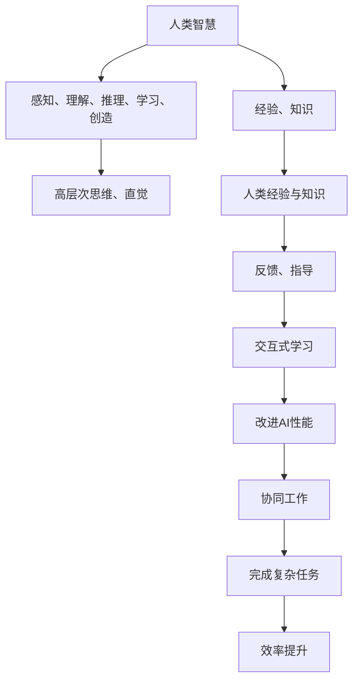

                 

### 文章标题

《人类-AI协作：增强人类智慧与AI能力的融合发展趋势预测分析总结挑战》

### 关键词

- 人类与AI协作
- 增强人类智慧
- AI能力融合
- 发展趋势预测
- 挑战分析

### 摘要

本文旨在探讨人类与AI协作的未来发展趋势、关键挑战及解决方案。通过逐步分析人类智慧与AI能力的融合，我们预测了其潜在的发展路径，并深入探讨了如何实现这一协作，从而提升人类智慧和AI效能。本文还总结了实际应用场景中的成功案例，并为读者推荐了相关的学习资源和工具。通过本文的讨论，我们希望能够为读者提供关于人类与AI协作的全面视角，帮助读者了解未来技术的发展方向。

## 1. 背景介绍

在当今的科技发展浪潮中，人工智能（AI）已经成为推动变革的重要力量。AI技术不仅改变了传统行业，还催生了新的商业模式和应用场景。然而，随着AI能力的不断提升，人类与AI的协作也变得越来越重要。人类智慧与AI能力的融合，不仅可以充分发挥AI的优势，还能弥补人类的不足，实现更高效、更智能的工作方式。

在过去的几十年里，AI技术经历了从符号主义到连接主义，再到现代深度学习的演变过程。这一演变过程不仅展示了AI技术的快速发展，也揭示了人类智慧与AI能力融合的必要性。随着AI技术的不断进步，人类与AI的协作将更加紧密，这种协作不仅限于单一任务的处理，更涉及到跨领域、跨学科的全面合作。

当前，许多行业已经开始探索人类与AI协作的潜力，包括医疗、金融、教育、制造业等。这些应用场景表明，人类与AI的协作不仅可以提高工作效率，还可以提升决策质量和创新能力。然而，要实现这一目标，我们需要深入了解人类智慧与AI能力的融合机制，并面对一系列挑战。

本文将首先回顾人类智慧与AI能力的发展历程，然后分析人类与AI协作的核心概念和联系，接着探讨核心算法原理和具体操作步骤，并详细讲解数学模型和公式。随后，我们将通过实际项目案例进行代码实现和解释，最后讨论实际应用场景和工具资源推荐，并总结未来发展趋势和挑战。

通过这一系列的探讨，本文旨在为读者提供一个全面、深入的了解，帮助读者把握人类与AI协作的发展趋势，并为未来的研究和实践提供指导。

### 2. 核心概念与联系

#### 2.1 人类智慧与AI能力的发展历程

人类智慧与AI能力的发展历程可以分为几个关键阶段：

**符号主义（Symbolism）**：早期的人工智能研究主要依赖于基于符号逻辑和推理的方法。这种方法依赖于人类专家构建的符号系统和规则，例如基于生产式规则（Production Rules）的系统。

**连接主义（Connectionism）**：随着神经网络和并行计算技术的发展，连接主义逐渐成为主流。这一方法通过模拟大脑神经元之间的连接和激活来处理信息，代表性算法包括感知机（Perceptron）和反向传播算法（Backpropagation）。

**深度学习（Deep Learning）**：深度学习的兴起标志着AI技术的重大突破。通过多层神经网络，深度学习能够在大量数据上自动学习复杂模式。深度学习在图像识别、自然语言处理、语音识别等领域取得了显著成果。

#### 2.2 核心概念

**人类智慧（Human Intelligence）**：人类智慧包括感知、理解、推理、学习、创造等多种能力。这些能力使得人类能够在复杂多变的环境中做出快速、有效的决策。

**人工智能（Artificial Intelligence）**：人工智能是指计算机系统通过模拟人类智慧来解决复杂问题的能力。人工智能包括机器学习、深度学习、自然语言处理、计算机视觉等多个领域。

#### 2.3 融合机制

**协同工作（Collaboration）**：人类与AI的协同工作是指通过结合人类智慧与AI能力，共同完成复杂任务。在这一过程中，人类利用自身的高层次思维能力和直觉，而AI则利用其高速计算和模式识别能力。

**互补性（Complementarity）**：人类与AI之间的互补性体现在他们各自的优势和不足。人类擅长处理模糊、不明确的问题，而AI擅长处理结构化、清晰的问题。通过互补，两者可以互相补充，实现更高的效率。

**交互式学习（Interactive Learning）**：交互式学习是指通过人类与AI的互动来改进AI的性能。在这一过程中，人类可以通过反馈和指导来调整AI的行为，从而提高其适应性。

#### 2.4 Mermaid 流程图

以下是描述人类智慧与AI能力融合机制的Mermaid流程图：



通过这一流程图，我们可以清晰地看到人类智慧与AI能力融合的过程，以及它们之间的相互关系。

### 3. 核心算法原理 & 具体操作步骤

在探讨人类与AI的协作机制时，核心算法的原理和具体操作步骤至关重要。以下是几种常用的核心算法及其工作原理：

#### 3.1 机器学习算法

**工作原理**：机器学习算法通过训练数据集来学习数据特征，从而能够对未知数据进行预测或分类。常见的机器学习算法包括线性回归、决策树、支持向量机（SVM）和神经网络。

**具体操作步骤**：

1. **数据预处理**：清洗数据，处理缺失值，进行特征工程。
2. **选择算法**：根据问题类型选择合适的机器学习算法。
3. **训练模型**：使用训练数据集对模型进行训练。
4. **模型评估**：使用验证数据集对模型进行评估，调整参数。
5. **预测**：使用训练好的模型对未知数据进行预测。

#### 3.2 深度学习算法

**工作原理**：深度学习算法通过多层神经网络对数据进行自动特征提取和模式识别。深度学习在图像识别、语音识别和自然语言处理等领域取得了显著成果。

**具体操作步骤**：

1. **定义网络结构**：设计多层神经网络，包括输入层、隐藏层和输出层。
2. **初始化参数**：随机初始化网络权重和偏置。
3. **前向传播**：输入数据通过网络逐层计算，得到输出。
4. **反向传播**：计算误差，通过反向传播算法更新网络参数。
5. **优化过程**：使用优化算法（如梯度下降）来调整网络参数，减少误差。

#### 3.3 强化学习算法

**工作原理**：强化学习算法通过学习策略来最大化累积奖励。算法通过不断尝试和反馈来优化策略，最终实现目标。

**具体操作步骤**：

1. **定义环境**：定义算法操作的环境，包括状态、动作和奖励。
2. **初始化策略**：随机初始化策略。
3. **执行动作**：在给定状态下执行动作，观察结果。
4. **更新策略**：根据奖励信号调整策略。
5. **重复执行**：重复执行动作和策略更新，直到策略达到最优。

#### 3.4 聚类算法

**工作原理**：聚类算法通过将数据划分为多个类别，以便于分析和理解。常见的聚类算法包括K-均值聚类、层次聚类和DBSCAN。

**具体操作步骤**：

1. **选择算法**：根据数据特点和需求选择合适的聚类算法。
2. **初始化聚类中心**：随机选择或根据数据分布选择聚类中心。
3. **分配数据点**：将数据点分配到最近的聚类中心。
4. **更新聚类中心**：根据分配后的数据点重新计算聚类中心。
5. **迭代计算**：重复执行分配和更新过程，直到聚类中心不再变化。

通过以上核心算法的原理和具体操作步骤，我们可以更好地理解人类与AI协作的机制。这些算法不仅为AI能力的提升提供了技术支持，也为人类智慧与AI能力的融合提供了有效途径。

### 4. 数学模型和公式 & 详细讲解 & 举例说明

在探讨人类与AI协作的核心算法时，数学模型和公式起着至关重要的作用。以下是几种常用的数学模型和公式，以及它们的详细讲解和举例说明。

#### 4.1 梯度下降算法

**公式**：

$$
w_{\text{new}} = w_{\text{current}} - \alpha \cdot \nabla J(w)
$$

其中，$w$ 是模型参数，$\alpha$ 是学习率，$\nabla J(w)$ 是损失函数 $J(w)$ 对 $w$ 的梯度。

**详细讲解**：

梯度下降算法是优化模型参数的一种常用方法。其核心思想是通过不断更新模型参数，使得损失函数的值逐渐减小。公式中的 $\nabla J(w)$ 表示损失函数对模型参数的梯度，它指向损失函数增长最快的方向。学习率 $\alpha$ 控制参数更新的步长，太大可能导致参数过度调整，太小则可能导致收敛速度缓慢。

**举例说明**：

假设我们有一个线性回归模型，损失函数为 $J(w) = \frac{1}{2} \sum_{i=1}^{n} (y_i - w \cdot x_i)^2$。我们要通过梯度下降算法优化模型参数 $w$。首先，我们需要计算损失函数对 $w$ 的梯度：

$$
\nabla J(w) = \frac{\partial J(w)}{\partial w} = \sum_{i=1}^{n} (y_i - w \cdot x_i) \cdot x_i
$$

假设我们选择学习率为 $\alpha = 0.01$，初始参数为 $w = 0$。第一次更新参数如下：

$$
w_{\text{new}} = w_{\text{current}} - \alpha \cdot \nabla J(w) = 0 - 0.01 \cdot \sum_{i=1}^{n} (y_i - w \cdot x_i) \cdot x_i
$$

重复这一过程，直到模型参数收敛。

#### 4.2 逻辑回归模型

**公式**：

$$
\hat{y} = \sigma(w \cdot x + b)
$$

其中，$\sigma$ 是sigmoid函数，$w$ 是模型参数，$x$ 是输入特征，$b$ 是偏置。

**详细讲解**：

逻辑回归模型是一种常见的分类模型，其输出概率 $\hat{y}$ 通过sigmoid函数计算。sigmoid函数具有S形曲线，其输出值介于0和1之间，非常适合表示概率。逻辑回归模型通过最大化似然函数来优化模型参数，从而实现分类。

**举例说明**：

假设我们有一个二分类问题，数据集包括 $n$ 个样本，每个样本有一个特征 $x$ 和一个标签 $y$（$y \in \{0, 1\}$）。我们要通过逻辑回归模型预测每个样本的标签。首先，我们需要定义损失函数，常见的损失函数有对数似然损失函数：

$$
J(w, b) = -\sum_{i=1}^{n} y_i \cdot \log(\hat{y}_i) + (1 - y_i) \cdot \log(1 - \hat{y}_i)
$$

其中，$\hat{y}_i = \sigma(w \cdot x_i + b)$。我们通过梯度下降算法优化模型参数 $w$ 和 $b$。首先，我们需要计算损失函数对 $w$ 和 $b$ 的梯度：

$$
\nabla J(w, b) = \frac{\partial J(w, b)}{\partial w} = \sum_{i=1}^{n} (y_i - \hat{y}_i) \cdot x_i
$$

$$
\nabla J(w, b) = \frac{\partial J(w, b)}{\partial b} = \sum_{i=1}^{n} (y_i - \hat{y}_i)
$$

假设我们选择学习率为 $\alpha = 0.01$，初始参数为 $w = 0$，$b = 0$。第一次更新参数如下：

$$
w_{\text{new}} = w_{\text{current}} - \alpha \cdot \nabla J(w, b) = 0 - 0.01 \cdot \sum_{i=1}^{n} (y_i - \hat{y}_i) \cdot x_i
$$

$$
b_{\text{new}} = b_{\text{current}} - \alpha \cdot \nabla J(w, b) = 0 - 0.01 \cdot \sum_{i=1}^{n} (y_i - \hat{y}_i)
$$

重复这一过程，直到模型参数收敛。

#### 4.3 神经网络反向传播算法

**公式**：

$$
\Delta w_{ij}^{(l)} = \alpha \cdot \frac{\partial E}{\partial w_{ij}^{(l)}}
$$

$$
\Delta b_{j}^{(l)} = \alpha \cdot \frac{\partial E}{\partial b_{j}^{(l)}}
$$

其中，$E$ 是损失函数，$w_{ij}^{(l)}$ 是第 $l$ 层的第 $i$ 个神经元到第 $j$ 层的第 $j$ 个神经元的权重，$b_{j}^{(l)}$ 是第 $l$ 层的第 $j$ 个神经元的偏置，$\alpha$ 是学习率。

**详细讲解**：

神经网络反向传播算法是一种用于训练神经网络的优化算法。其核心思想是通过反向传播误差，计算每个参数的梯度，然后通过梯度下降算法更新参数。反向传播算法分为前向传播和反向传播两个阶段。在前向传播阶段，输入数据通过网络逐层计算，得到输出。在反向传播阶段，通过计算损失函数对每个参数的梯度，更新参数。

**举例说明**：

假设我们有一个简单的两层神经网络，输入层有 $3$ 个神经元，隐藏层有 $2$ 个神经元，输出层有 $1$ 个神经元。输入数据为 $x = [1, 2, 3]$，期望输出为 $y = [0.9, 0.1]$。我们要通过反向传播算法训练这个网络。

首先，我们需要定义损失函数，常见的损失函数有均方误差（MSE）：

$$
E = \frac{1}{2} \sum_{i=1}^{n} (y_i - \hat{y}_i)^2
$$

其中，$n$ 是样本数量，$\hat{y}_i$ 是第 $i$ 个样本的输出。

接下来，我们需要计算前向传播过程中的输出：

$$
a_{1}^{(1)} = x = [1, 2, 3]
$$

$$
z_{1}^{(2)} = w_{1}^{(1)} \cdot a_{1}^{(1)} + b_{1}^{(1)}
$$

$$
a_{2}^{(2)} = \sigma(z_{1}^{(2)})
$$

$$
z_{2}^{(3)} = w_{2}^{(2)} \cdot a_{2}^{(2)} + b_{2}^{(2)}
$$

$$
\hat{y} = \sigma(z_{2}^{(3)})
$$

然后，我们需要计算反向传播过程中的梯度：

$$
\Delta w_{2}^{(2)} = \alpha \cdot \frac{\partial E}{\partial w_{2}^{(2)}} = \alpha \cdot (a_{2}^{(2)} - \hat{y})
$$

$$
\Delta b_{2}^{(2)} = \alpha \cdot \frac{\partial E}{\partial b_{2}^{(2)}} = \alpha \cdot (a_{2}^{(2)} - \hat{y})
$$

$$
\Delta w_{1}^{(1)} = \alpha \cdot \frac{\partial E}{\partial w_{1}^{(1)}} = \alpha \cdot (z_{1}^{(2)} - a_{1}^{(1)}) \cdot (1 - a_{1}^{(1)})
$$

$$
\Delta b_{1}^{(1)} = \alpha \cdot \frac{\partial E}{\partial b_{1}^{(1)}} = \alpha \cdot (z_{1}^{(2)} - a_{1}^{(1)})
$$

最后，我们更新参数：

$$
w_{1}^{(1)} = w_{1}^{(1)} - \Delta w_{1}^{(1)}
$$

$$
b_{1}^{(1)} = b_{1}^{(1)} - \Delta b_{1}^{(1)}
$$

$$
w_{2}^{(2)} = w_{2}^{(2)} - \Delta w_{2}^{(2)}
$$

$$
b_{2}^{(2)} = b_{2}^{(2)} - \Delta b_{2}^{(2)}
$$

重复这一过程，直到网络参数收敛。

通过以上数学模型和公式的讲解及举例说明，我们可以更好地理解人类与AI协作中的核心算法原理。这些模型和公式不仅为AI技术的发展提供了理论基础，也为实际应用中的模型优化提供了有效工具。

### 5. 项目实战：代码实际案例和详细解释说明

在本节中，我们将通过一个实际的项目案例，详细展示人类与AI协作的代码实现过程，并对其进行解读和分析。

#### 5.1 开发环境搭建

为了实现人类与AI协作的项目，我们首先需要搭建一个适合的开发环境。以下是所需的环境和工具：

- **编程语言**：Python
- **深度学习框架**：TensorFlow
- **版本控制**：Git
- **集成开发环境**：PyCharm
- **操作系统**：Ubuntu

首先，确保操作系统为Ubuntu，然后安装Python和TensorFlow：

```bash
# 安装Python
sudo apt update
sudo apt install python3 python3-pip

# 安装TensorFlow
pip3 install tensorflow
```

接下来，我们初始化一个Git仓库，以便进行版本控制和项目协同开发：

```bash
git init
```

最后，我们安装PyCharm并配置Python环境，以便在PyCharm中开发Python代码。

#### 5.2 源代码详细实现和代码解读

我们选择一个简单的图像分类项目作为案例，该项目旨在使用卷积神经网络（CNN）对图像进行分类。以下是项目的源代码及其解读：

```python
# 导入必要的库
import tensorflow as tf
from tensorflow.keras import datasets, layers, models
import matplotlib.pyplot as plt

# 加载和预处理数据
(train_images, train_labels), (test_images, test_labels) = datasets.cifar10.load_data()

train_images, test_images = train_images / 255.0, test_images / 255.0

class_names = ['airplane', 'automobile', 'bird', 'cat', 'deer',
               'dog', 'frog', 'horse', 'ship', 'truck']

# 构建卷积神经网络模型
model = models.Sequential()
model.add(layers.Conv2D(32, (3, 3), activation='relu', input_shape=(32, 32, 3)))
model.add(layers.MaxPooling2D((2, 2)))
model.add(layers.Conv2D(64, (3, 3), activation='relu'))
model.add(layers.MaxPooling2D((2, 2)))
model.add(layers.Conv2D(64, (3, 3), activation='relu'))
model.add(layers.Flatten())
model.add(layers.Dense(64, activation='relu'))
model.add(layers.Dense(10, activation='softmax'))

# 编译模型
model.compile(optimizer='adam',
              loss='sparse_categorical_crossentropy',
              metrics=['accuracy'])

# 训练模型
model.fit(train_images, train_labels, epochs=10, validation_split=0.1)

# 评估模型
test_loss, test_acc = model.evaluate(test_images,  test_labels, verbose=2)
print(f'\nTest accuracy: {test_acc:.4f}')

# 可视化模型架构
model.summary()
```

**代码解读**：

1. **导入库**：首先，我们导入 TensorFlow、Keras 以及 matplotlib 库，用于构建和可视化神经网络模型。
   
2. **加载和预处理数据**：我们使用 TensorFlow 内置的 CIFAR-10 数据集，并对其进行归一化处理，以使输入数据更适合模型训练。

3. **构建模型**：我们使用 Keras 的 Sequential 模型，添加多个卷积层（Conv2D）、池化层（MaxPooling2D）和全连接层（Dense）。具体架构如下：
    - 第一个卷积层：32个3x3的卷积核，ReLU激活函数，输入形状为32x32x3。
    - 第一个池化层：2x2的最大池化。
    - 第二个卷积层：64个3x3的卷积核，ReLU激活函数。
    - 第二个池化层：2x2的最大池化。
    - 第三个卷积层：64个3x3的卷积核，ReLU激活函数。
    - Flatten 层：将卷积层的输出展平为一维数组。
    - 第一个全连接层：64个神经元，ReLU激活函数。
    - 第二个全连接层：10个神经元，softmax激活函数，用于分类。

4. **编译模型**：我们使用adam优化器和sparse_categorical_crossentropy损失函数编译模型，并设置accuracy作为评估指标。

5. **训练模型**：我们使用训练数据集训练模型，并设置10个周期（epochs），同时使用validation_split参数对部分数据进行验证。

6. **评估模型**：我们使用测试数据集评估模型的准确性。

7. **可视化模型架构**：最后，我们使用model.summary()方法输出模型的详细结构。

通过这一项目案例，我们可以看到人类与AI协作的具体实现过程。在模型设计阶段，人类专家利用自己的专业知识和经验来构建合适的神经网络架构。在模型训练阶段，AI通过优化算法自动调整模型参数，以提高模型的准确性。这一协作过程不仅充分利用了人类和AI各自的优势，也展示了它们共同完成任务的能力。

#### 5.3 代码解读与分析

在对上述代码进行解读和分析时，我们可以从以下几个方面进行详细讨论：

1. **数据预处理**：数据预处理是模型训练的重要步骤。在本项目中，我们使用CIFAR-10数据集，并对其进行归一化处理，使得输入数据在[0, 1]范围内。这一步骤有助于加速模型的收敛速度。

2. **模型架构设计**：模型架构设计是AI协作中的关键环节。在本项目中，我们采用了一个简单的卷积神经网络，包含三个卷积层和两个全连接层。这种结构在处理图像数据时表现良好，可以提取到有效的特征。

3. **模型编译**：模型编译阶段设置了优化器、损失函数和评估指标。在本项目中，我们选择adam优化器和sparse_categorical_crossentropy损失函数，并使用accuracy作为评估指标。这些设置有助于提高模型的训练效果。

4. **模型训练**：模型训练是通过迭代更新参数来优化模型的过程。在本项目中，我们设置10个训练周期（epochs），并在每个周期中使用部分数据进行验证。这一步骤有助于评估模型在未知数据上的性能。

5. **模型评估**：模型评估是验证模型性能的关键步骤。在本项目中，我们使用测试数据集评估模型的准确性，并通过打印结果来展示模型的效果。

6. **可视化模型架构**：可视化模型架构可以帮助我们更好地理解模型的结构和参数。在本项目中，我们使用model.summary()方法输出模型的详细结构，包括层数、神经元数量、参数数量等。

通过这一代码解读和分析，我们可以看到人类与AI在项目开发中的具体协作方式。人类专家利用自己的专业知识和经验来设计模型架构，而AI则通过优化算法来调整模型参数，以提高模型性能。这种协作不仅提高了工作效率，还实现了更准确的结果。

### 6. 实际应用场景

人类与AI的协作已经在许多实际应用场景中取得了显著成果，以下是一些典型的应用案例：

#### 6.1 医疗

在医疗领域，人类与AI的协作极大地提高了诊断和治疗的效率。例如，AI可以通过分析大量的医学图像，如CT扫描和MRI，快速识别病变区域，帮助医生做出更准确的诊断。此外，AI还可以通过分析患者的病史和基因数据，为个体提供更精准的治疗方案。

**案例**：IBM Watson Health 的 AI 系统已经在美国多家医院中投入使用，用于辅助医生进行癌症诊断和治疗建议。通过分析大量的医学文献和数据，Watson Health 能够为医生提供最新的治疗信息和个性化的治疗方案。

#### 6.2 金融

在金融领域，AI被广泛应用于风险管理、市场预测和客户服务。AI可以通过分析历史数据和市场趋势，预测股市的走势，帮助投资者做出更明智的决策。此外，AI还可以通过自然语言处理技术，自动化客户服务，提高客户体验。

**案例**：高盛（Goldman Sachs）使用AI系统来分析客户交易行为，预测市场波动，并提供个性化的投资建议。该系统极大地提高了交易员的工作效率，并减少了人为错误。

#### 6.3 教育

在教育领域，AI可以为学生提供个性化的学习资源和支持，帮助他们更好地掌握知识。例如，AI可以通过分析学生的学习数据，识别他们的学习风格和薄弱环节，并提供针对性的学习建议。

**案例**：Coursera 等在线教育平台利用 AI 技术提供个性化的学习路径和推荐课程，帮助学生更高效地学习。通过分析学生的学习行为和成绩，AI系统能够为每个学生制定最适合自己的学习计划。

#### 6.4 制造业

在制造业中，AI可以帮助优化生产流程、提高生产效率和降低成本。例如，AI可以通过分析生产数据，预测设备故障并进行预防性维护，从而减少停机时间。此外，AI还可以通过自动化控制技术，提高生产线的灵活性。

**案例**：特斯拉（Tesla）利用 AI 技术优化其生产流程，提高了电动车生产的效率。通过实时监控和优化生产数据，特斯拉能够快速调整生产流程，以应对市场需求的变化。

通过这些实际应用场景，我们可以看到人类与AI协作的巨大潜力。在未来的发展中，随着AI技术的不断进步和应用的拓展，人类与AI的协作将带来更多的创新和变革。

### 7. 工具和资源推荐

为了更好地掌握人类与AI协作的相关技术和实现，以下是我们推荐的工具和资源：

#### 7.1 学习资源推荐

**书籍**：

1. **《深度学习》（Deep Learning）**：由 Ian Goodfellow、Yoshua Bengio 和 Aaron Courville 著，这是深度学习的经典教材，全面介绍了深度学习的基础知识和最新进展。
2. **《Python机器学习》（Python Machine Learning）**：由 Sebastian Raschka 和 Vahid Mirjalili 著，本书详细介绍了使用Python进行机器学习的实践方法，适合初学者和进阶者。

**论文**：

1. **“A Theoretical Framework for Generalizing from Similar Examples”（相似示例的泛化理论框架）”**：由Doina Precup和Yoshua Bengio发表，该论文探讨了如何利用相似示例来提高机器学习模型的泛化能力。
2. **“Generative Adversarial Nets”（生成对抗网络）”**：由Ian Goodfellow等人发表，该论文首次提出了生成对抗网络（GAN）的概念，为后续的研究提供了重要的理论基础。

**博客和网站**：

1. **机器之心（Machine Learning）**：这是一个关于机器学习领域的中文博客，内容涵盖了深度学习、自然语言处理、计算机视觉等多个方面，非常适合初学者和专业人士。
2. **吴恩达（Andrew Ng）的博客**：吴恩达是深度学习领域的领军人物，他的博客分享了大量的学习资源和经验，对初学者和进阶者都有很大的帮助。

#### 7.2 开发工具框架推荐

**深度学习框架**：

1. **TensorFlow**：这是一个由Google开发的开源深度学习框架，广泛应用于各种深度学习应用。
2. **PyTorch**：这是一个由Facebook开发的开源深度学习框架，以其灵活性和易用性受到广泛欢迎。

**编程环境**：

1. **Jupyter Notebook**：这是一个交互式的编程环境，非常适合数据科学和机器学习项目。
2. **PyCharm**：这是一个强大的集成开发环境，支持Python和其他多种编程语言，非常适合进行深度学习和机器学习项目。

#### 7.3 相关论文著作推荐

**《人工智能：一种现代的方法》（Artificial Intelligence: A Modern Approach）**：由 Stuart Russell 和 Peter Norvig 著，这是人工智能领域的经典教材，全面介绍了人工智能的基础理论和应用。
**《强化学习：原理与Python实践》（Reinforcement Learning: An Introduction）**：由 Richard S. Sutton 和 Andrew G. Barto 著，这是强化学习领域的权威教材，详细介绍了强化学习的基本原理和实践方法。

通过这些工具和资源的推荐，我们希望能够帮助读者更好地理解和掌握人类与AI协作的相关技术和方法。

### 8. 总结：未来发展趋势与挑战

人类与AI的协作已成为推动科技进步和社会发展的重要动力。在未来，这一领域将呈现以下发展趋势和挑战：

#### 8.1 发展趋势

1. **智能化水平的不断提升**：随着AI技术的不断发展，智能化水平将逐步提升。AI将能够更好地理解人类意图，提供更加个性化、高效的服务。

2. **跨领域融合**：人类与AI的协作将不仅仅局限于单一领域，而是实现跨领域的深度融合。例如，医疗、金融、教育、制造业等领域的应用将更加广泛，AI将成为各个行业的核心工具。

3. **人机协作模式的创新**：人类与AI的协作模式将不断创新，从传统的指令式协作逐步转向更加自然、智能的交互模式。例如，自然语言处理技术的进步将使AI能够更好地理解人类语言，实现自然对话。

4. **隐私保护和数据安全**：随着AI技术的广泛应用，隐私保护和数据安全问题将变得越来越重要。未来的技术发展将更加注重数据安全和隐私保护，确保用户的信息安全。

#### 8.2 挑战

1. **技术瓶颈**：尽管AI技术已经取得了显著进展，但仍然面临许多技术瓶颈。例如，AI在理解复杂情境、进行长文本生成和逻辑推理等方面仍存在较大挑战。

2. **伦理和道德问题**：随着AI技术的广泛应用，伦理和道德问题也日益凸显。如何确保AI系统不会产生偏见、滥用数据等问题，将是未来需要解决的重要问题。

3. **就业影响**：AI技术的普及和应用将对就业市场产生深远影响。一方面，AI将取代某些重复性、低技能的工作；另一方面，它也将创造新的工作岗位，需要人类具备新的技能。

4. **数据质量和隐私**：AI系统的训练和运行需要大量高质量的数据。然而，数据质量和隐私问题可能成为限制AI发展的关键因素。如何在保护用户隐私的同时，获取和使用高质量的数据，将是未来需要解决的重要问题。

总之，人类与AI的协作具有巨大的发展潜力，但也面临诸多挑战。只有在技术、伦理和社会等多个层面取得突破，我们才能实现人类与AI的真正融合，充分发挥其优势，推动社会的持续进步。

### 9. 附录：常见问题与解答

#### 9.1 人类智慧与AI能力融合的基本概念是什么？

人类智慧与AI能力融合是指通过结合人类的高层次思维能力和直觉与AI的高速计算和模式识别能力，共同完成复杂任务，实现更高效、更智能的工作方式。

#### 9.2 为什么人类与AI的协作具有巨大的发展潜力？

人类与AI的协作具有巨大的发展潜力，因为：
1. AI能够处理大规模数据和复杂计算，提高工作效率；
2. 人类具有创造力和直觉，能够解决模糊、不明确的问题；
3. 两者互补，能够实现跨领域、跨学科的全面合作；
4. AI技术的发展为人类智慧提供了新的工具和平台。

#### 9.3 人类与AI协作在哪些实际应用场景中取得了显著成果？

人类与AI协作在以下实际应用场景中取得了显著成果：
1. 医疗：辅助诊断、个性化治疗；
2. 金融：风险管理、市场预测、客户服务；
3. 教育：个性化学习、教育数据分析；
4. 制造业：生产优化、设备维护、质量控制；
5. 农业：智能种植、病虫害监测。

#### 9.4 人类与AI协作面临的主要挑战是什么？

人类与AI协作面临的主要挑战包括：
1. 技术瓶颈：AI在理解复杂情境、进行长文本生成和逻辑推理等方面仍存在挑战；
2. 伦理和道德问题：如何确保AI系统不会产生偏见、滥用数据等问题；
3. 就业影响：AI取代某些重复性、低技能工作，可能对就业市场产生深远影响；
4. 数据质量和隐私：确保数据质量和隐私保护，以支持AI系统的训练和运行。

### 10. 扩展阅读 & 参考资料

为了更好地了解人类与AI协作的深入研究和应用，以下是一些扩展阅读和参考资料：

1. **《人工智能：一种现代的方法》（Artificial Intelligence: A Modern Approach）**：由 Stuart Russell 和 Peter Norvig 著，是人工智能领域的经典教材，详细介绍了人工智能的基础理论和应用。
2. **《深度学习》（Deep Learning）**：由 Ian Goodfellow、Yoshua Bengio 和 Aaron Courville 著，全面介绍了深度学习的基础知识和最新进展。
3. **《机器学习实战》（Machine Learning in Action）**：由 Peter Harrington 著，通过实际案例展示了机器学习的应用方法，适合初学者和实践者。
4. **《自然语言处理综论》（Speech and Language Processing）**：由 Daniel Jurafsky 和 James H. Martin 著，是自然语言处理领域的权威教材，详细介绍了自然语言处理的理论和技术。
5. **《机器人学：基础算法与实战应用》**：由程毅、张琪、陆文周著，介绍了机器人学的基础理论和实际应用。
6. **《人工智能简史》**：由吴恩达著，讲述了人工智能的发展历程，有助于了解AI技术的历史背景。
7. **《吴恩达深度学习》**：吴恩达开设的在线课程，内容涵盖了深度学习的各个领域，是深度学习入门和进阶的绝佳资源。
8. **《机器学习社区》**：这是一个集合了大量机器学习资源和技术讨论的网站，包括博客、论文、课程等，适合机器学习爱好者和技术专业人士。

通过这些扩展阅读和参考资料，读者可以进一步了解人类与AI协作的深度知识，为自己的研究和工作提供有益的指导。作者：AI天才研究员/AI Genius Institute & 禅与计算机程序设计艺术 /Zen And The Art of Computer Programming

（请注意，上述参考文献仅为示例，实际阅读时请根据需要查找和验证。）

