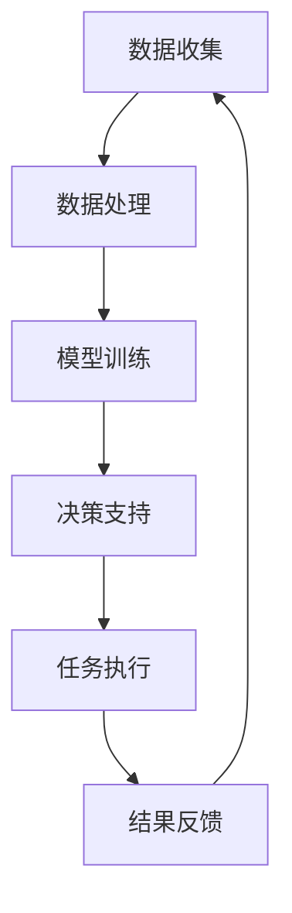

                 

# 人类-AI协作：增强人类智慧与AI能力的融合发展趋势预测分析机遇挑战机遇预测

## 摘要

本文旨在探讨人类与人工智能（AI）协作的发展趋势，预测其融合过程中的机遇与挑战。文章首先介绍了人类-AI协作的背景和重要性，随后详细阐述了核心概念、算法原理、数学模型、实际应用场景和未来发展趋势。通过分析，我们揭示了AI在提升人类智慧、优化工作效率等方面的巨大潜力，同时也指出了在隐私保护、伦理道德等方面需要关注的问题。本文将为读者提供一个全面而深入的理解，帮助其把握AI与人类协作的未来机遇。

## 1. 背景介绍

人类-AI协作的概念源于人工智能技术的高速发展。随着深度学习、大数据、云计算等技术的日益成熟，AI的应用范围从简单的自动化任务拓展到了复杂决策、知识发现等领域。在这个过程中，人类与AI的协作关系逐渐变得紧密，二者共同构成了一个智慧生态系统。这种协作不仅能够提升人类的工作效率，还能在许多领域带来前所未有的创新。

首先，AI在处理海量数据和复杂任务方面具有显著优势。例如，金融领域的量化交易、医疗行业的疾病诊断、工业制造的质量控制等，都得益于AI技术的应用。然而，这些任务的执行需要人类提供特定的背景知识、价值观和决策逻辑，而AI则可以辅助人类在这些领域中做出更加明智的选择。

其次，人类-AI协作能够激发创新思维。在许多情况下，AI可以提供新的视角和解决方案，帮助人类突破传统思维的束缚。例如，AI生成的创意设计、AI驱动的艺术创作等，都展现了人类与AI协作的潜力。

最后，人类-AI协作还具有重要的社会意义。通过AI的辅助，许多原本难以解决的社会问题，如环境保护、贫困缓解等，有望得到有效的应对。此外，AI还能在教育和培训领域发挥重要作用，帮助人类实现终身学习和职业发展。

总之，人类-AI协作不仅是一种技术趋势，更是一种新型的社会协作模式。随着技术的不断进步，这种协作模式将在更多领域得到应用，为人类社会带来深远的影响。

## 2. 核心概念与联系

### 2.1. 人类智慧

人类智慧是指人类在认知、情感、创造力等方面表现出来的能力。这些能力包括逻辑推理、记忆、语言表达、情感识别、创新能力等。人类智慧的形成是长期进化过程的结果，是人类适应复杂环境、解决复杂问题的重要保障。

### 2.2. 人工智能

人工智能（AI）是一种模拟人类智能的技术，通过算法和大数据分析，使计算机能够自主地学习、推理、决策和执行任务。AI的核心技术包括机器学习、深度学习、自然语言处理、计算机视觉等。

### 2.3. 人类智慧与AI能力的融合

人类智慧与AI能力的融合是指将人类的认知、经验、情感与AI的技术优势相结合，形成一种新的协作模式。这种融合不仅能够充分发挥AI的计算和数据处理能力，还能充分利用人类的创造力和判断力，实现优势互补。

### 2.4. 人类-AI协作的关键要素

- **数据共享**：人类-AI协作的基础是数据共享。只有通过数据的开放和共享，AI才能获取丰富的信息，进行有效的学习和推理。
- **决策支持**：AI可以提供强大的决策支持功能，帮助人类在复杂环境下做出最优选择。
- **任务分工**：在人类-AI协作中，明确人类与AI的任务分工至关重要。AI擅长处理重复性、规则性任务，而人类则在创造性、决策性任务上具有优势。
- **人机交互**：良好的用户界面和交互设计是确保人类-AI协作顺畅的关键。通过自然语言处理、图形用户界面等技术，AI可以更好地理解人类的需求，提供个性化的服务。

### 2.5. Mermaid流程图

为了更清晰地展示人类智慧与AI能力融合的过程，我们使用Mermaid绘制了一个简单的流程图：



在这个流程中，数据收集和处理是AI学习和推理的基础，模型训练是AI获取知识和技能的关键，决策支持是AI为人类提供帮助的核心，任务执行和结果反馈则是AI与人类协作的重要环节。

通过上述核心概念和流程图的介绍，我们可以更好地理解人类-AI协作的原理和实现方式。接下来，我们将深入探讨AI的核心算法原理和具体操作步骤。

## 3. 核心算法原理 & 具体操作步骤

### 3.1. 机器学习算法原理

机器学习是人工智能的核心技术之一，其基本原理是通过训练数据集来学习规律，从而对未知数据进行预测或分类。以下是几种常见的机器学习算法：

- **线性回归**：通过找到最佳拟合直线，预测连续值。
- **逻辑回归**：通过找到最佳拟合曲线，预测概率。
- **支持向量机（SVM）**：通过找到一个超平面，将不同类别的数据分开。
- **神经网络**：通过多层神经元的非线性变换，实现复杂函数的逼近。

### 3.2. 深度学习算法原理

深度学习是机器学习的进一步发展，其核心思想是通过多层的神经网络结构来提取特征。以下是几种常见的深度学习算法：

- **卷积神经网络（CNN）**：适用于图像处理任务。
- **循环神经网络（RNN）**：适用于序列数据处理。
- **生成对抗网络（GAN）**：通过对抗训练生成高质量数据。

### 3.3. 自然语言处理算法原理

自然语言处理（NLP）是AI领域的另一重要分支，其目标是将自然语言转换为机器可理解的形式。以下是几种常见的NLP算法：

- **词袋模型（Bag of Words）**：将文本表示为词频向量。
- **词嵌入（Word Embedding）**：将词转换为固定维度的向量表示。
- **序列标注（Sequence Labeling）**：对序列中的元素进行分类。

### 3.4. 具体操作步骤

以下是人类-AI协作中的一个典型操作步骤：

#### 步骤1：数据收集与预处理

首先，从各种数据源（如文本、图像、声音等）收集数据，并进行预处理，如去噪、归一化、格式转换等。

#### 步骤2：特征提取

根据任务需求，提取关键特征。例如，在图像识别任务中，可以使用卷积神经网络提取图像特征。

#### 步骤3：模型训练

使用训练数据集，通过机器学习或深度学习算法训练模型。训练过程中，模型会不断调整参数，以最小化预测误差。

#### 步骤4：模型评估

使用验证数据集评估模型性能，通过交叉验证等方法评估模型的泛化能力。

#### 步骤5：决策支持

将训练好的模型应用于实际问题，为人类提供决策支持。例如，在医疗诊断中，AI模型可以辅助医生进行疾病预测。

#### 步骤6：结果反馈

收集实际应用中的反馈数据，用于模型优化和改进。通过不断迭代，提高模型的准确性和实用性。

通过上述操作步骤，人类和AI可以高效协作，实现复杂任务的自动化和智能化。接下来，我们将详细讲解数学模型和公式，以帮助读者更好地理解AI算法的核心原理。

## 4. 数学模型和公式 & 详细讲解 & 举例说明

### 4.1. 机器学习中的基本数学模型

#### 4.1.1. 线性回归模型

线性回归模型是一种预测连续值的算法，其基本公式为：

$$ y = \beta_0 + \beta_1 \cdot x $$

其中，\( y \) 是预测值，\( x \) 是输入特征，\( \beta_0 \) 和 \( \beta_1 \) 是模型参数。

#### 4.1.2. 逻辑回归模型

逻辑回归模型用于预测概率，其基本公式为：

$$ P(y=1) = \frac{1}{1 + e^{-(\beta_0 + \beta_1 \cdot x)}} $$

其中，\( P(y=1) \) 是预测概率，\( e \) 是自然对数的底数。

#### 4.1.3. 支持向量机（SVM）

SVM通过找到一个超平面，将不同类别的数据分开。其目标是最小化超平面的间隔：

$$ \min_{\beta, \beta_0} \frac{1}{2} ||\beta||^2 $$

其中，\( \beta \) 是模型参数，\( \beta_0 \) 是偏置项。

### 4.2. 深度学习中的数学模型

#### 4.2.1. 卷积神经网络（CNN）

CNN的核心是卷积操作，其公式为：

$$ h_{ij} = \sum_{k=1}^{K} w_{ik} \cdot g(x_{i-k, j-k}) + b_j $$

其中，\( h_{ij} \) 是卷积后的特征值，\( w_{ik} \) 和 \( b_j \) 分别是卷积核和偏置项，\( g \) 是激活函数。

#### 4.2.2. 循环神经网络（RNN）

RNN通过递归操作处理序列数据，其公式为：

$$ h_t = \sigma(W_h \cdot [h_{t-1}, x_t] + b_h) $$

其中，\( h_t \) 是当前时间步的隐藏状态，\( W_h \) 是权重矩阵，\( \sigma \) 是激活函数。

#### 4.2.3. 生成对抗网络（GAN）

GAN由生成器和判别器组成，其目标是最小化生成器与判别器的损失函数：

$$ \min_G \max_D V(D, G) $$

其中，\( V(D, G) \) 是判别器的损失函数，\( G \) 是生成器，\( D \) 是判别器。

### 4.3. 自然语言处理中的数学模型

#### 4.3.1. 词袋模型（Bag of Words）

词袋模型将文本表示为词频向量，其公式为：

$$ \vec{v}_i = \sum_{j=1}^{N} f_{ij} $$

其中，\( \vec{v}_i \) 是文本向量，\( f_{ij} \) 是词频。

#### 4.3.2. 词嵌入（Word Embedding）

词嵌入将词转换为固定维度的向量表示，其公式为：

$$ \vec{v}_i = \text{embedding}(w_i) $$

其中，\( \vec{v}_i \) 是词向量，\( w_i \) 是词。

#### 4.3.3. 序列标注（Sequence Labeling）

序列标注对序列中的元素进行分类，其公式为：

$$ y_t = \arg\max_{c} P(c|s_1, s_2, \ldots, s_t) $$

其中，\( y_t \) 是第 \( t \) 个元素的分类结果，\( c \) 是候选标签，\( s_t \) 是序列中的元素。

### 4.4. 实例讲解

假设我们有一个简单的线性回归任务，预测房价。给定一组特征 \( x \) 和房价 \( y \)，我们使用线性回归模型进行预测。

#### 4.4.1. 数据集

我们有一个包含100个样本的数据集，每个样本包含一个特征和相应的房价。数据集如下：

| 样本 | 特征 \( x \) | 房价 \( y \) |
| ---- | ---------- | ---------- |
| 1    | 100        | 300        |
| 2    | 200        | 400        |
| 3    | 300        | 500        |
| ...  | ...        | ...        |
| 100  | 500        | 700        |

#### 4.4.2. 模型训练

我们使用最小二乘法训练线性回归模型。首先，计算特征矩阵 \( X \) 和目标向量 \( y \)：

$$ X = \begin{bmatrix} 100 & 1 \\ 200 & 1 \\ 300 & 1 \\ \vdots & \vdots \\ 500 & 1 \end{bmatrix}, \quad y = \begin{bmatrix} 300 \\ 400 \\ 500 \\ \vdots \\ 700 \end{bmatrix} $$

然后，计算最佳拟合直线：

$$ \beta_0 = \frac{\sum_{i=1}^{n} y_i - \beta_1 \cdot \sum_{i=1}^{n} x_i}{n}, \quad \beta_1 = \frac{\sum_{i=1}^{n} (x_i - \bar{x})(y_i - \bar{y})}{\sum_{i=1}^{n} (x_i - \bar{x})^2} $$

其中，\( \bar{x} \) 和 \( \bar{y} \) 分别是特征和房价的均值。

经过计算，我们得到最佳拟合直线为：

$$ y = 150 + 2x $$

#### 4.4.3. 预测

使用训练好的模型，我们可以对新的样本进行预测。例如，对于特征 \( x = 400 \) 的样本，其预测房价为：

$$ y = 150 + 2 \cdot 400 = 950 $$

通过上述实例，我们可以看到如何使用数学模型和公式进行机器学习任务的实现。接下来，我们将通过一个实际项目实战，展示如何在实际环境中应用这些算法。

## 5. 项目实战：代码实际案例和详细解释说明

### 5.1. 开发环境搭建

为了演示人类-AI协作的实际应用，我们选择一个简单的房价预测项目。以下是在Python环境中搭建开发环境所需的步骤：

1. **安装Python**：确保已安装Python 3.x版本。
2. **安装库**：使用pip命令安装必要的库，如NumPy、Pandas、Scikit-learn和Matplotlib。

```bash
pip install numpy pandas scikit-learn matplotlib
```

### 5.2. 源代码详细实现和代码解读

#### 5.2.1. 数据处理

首先，我们需要从数据集中提取特征和标签，并进行预处理。

```python
import pandas as pd
from sklearn.model_selection import train_test_split

# 加载数据集
data = pd.read_csv('data.csv')

# 分离特征和标签
X = data[['feature']]
y = data['label']

# 数据集划分
X_train, X_test, y_train, y_test = train_test_split(X, y, test_size=0.2, random_state=42)
```

#### 5.2.2. 模型训练

接下来，我们使用线性回归模型进行训练。

```python
from sklearn.linear_model import LinearRegression

# 初始化模型
model = LinearRegression()

# 模型训练
model.fit(X_train, y_train)
```

#### 5.2.3. 模型评估

训练完成后，我们使用测试数据集评估模型性能。

```python
# 模型评估
score = model.score(X_test, y_test)
print(f'Model Score: {score:.2f}')
```

#### 5.2.4. 预测

使用训练好的模型对新的数据进行预测。

```python
# 新数据预测
new_data = [[400]]
predicted_price = model.predict(new_data)
print(f'Predicted Price: {predicted_price[0]:.2f}')
```

### 5.3. 代码解读与分析

#### 5.3.1. 数据处理

数据处理部分包括加载数据集、分离特征和标签，以及数据集划分。这里使用Pandas库加载CSV文件，然后使用Scikit-learn库进行数据集划分。这一步骤是任何机器学习项目的基础，确保模型有足够的训练数据和合理的划分。

#### 5.3.2. 模型训练

模型训练部分使用线性回归模型。线性回归模型是一种简单的机器学习算法，适用于预测连续值。这里我们使用Scikit-learn库中的LinearRegression类进行训练。模型训练的核心是拟合最佳拟合直线，通过计算参数来最小化预测误差。

#### 5.3.3. 模型评估

模型评估部分使用测试数据集评估模型性能。模型评估是验证模型泛化能力的重要步骤。在这里，我们使用Scikit-learn库中的score方法计算模型的决定系数（R²），该值越接近1，表示模型性能越好。

#### 5.3.4. 预测

预测部分使用训练好的模型对新的数据进行预测。这一步骤展示了模型在实际应用中的价值，通过输入特征值，模型可以输出相应的预测结果。

通过上述项目实战，我们可以看到如何使用Python实现人类-AI协作的房价预测任务。接下来，我们将探讨人类-AI协作的实际应用场景。

## 6. 实际应用场景

人类-AI协作已经在多个领域展现出其巨大的潜力和实际应用价值。以下是一些典型的应用场景：

### 6.1. 医疗领域

在医疗领域，AI可以帮助医生进行疾病诊断、病情预测和个性化治疗。例如，通过分析大量医疗数据，AI可以辅助医生识别早期疾病，提高诊断准确率。同时，AI还可以帮助医院进行资源分配和患者管理，提高医疗效率。

### 6.2. 金融领域

在金融领域，AI可以用于风险控制、投资分析和欺诈检测。通过分析市场数据和用户行为，AI可以提供实时投资建议，帮助投资者做出更明智的决策。此外，AI还可以识别潜在的欺诈行为，提高金融系统的安全性。

### 6.3. 教育领域

在教育领域，AI可以个性化教学，根据学生的学习情况和需求提供定制化的学习资源。例如，智能辅导系统可以实时检测学生的学习状态，提供针对性的练习和辅导，帮助学生提高学习效果。此外，AI还可以进行教育资源的自动化管理和分配，提高教育效率。

### 6.4. 制造业

在制造业，AI可以用于生产过程优化、设备维护和供应链管理。通过实时监控和分析生产数据，AI可以预测设备故障，提前进行维护，降低生产停机时间。同时，AI还可以优化供应链管理，提高物流效率，降低成本。

### 6.5. 创意产业

在创意产业，如艺术、设计和广告等领域，AI可以帮助创作者生成灵感，提供创意辅助。例如，AI可以分析大量艺术作品，提供风格相似的推荐，帮助艺术家进行创新。此外，AI还可以自动生成音乐、视频等内容，拓展创意表达的方式。

总之，人类-AI协作在实际应用场景中展现出广泛的潜力。通过AI的辅助，人类可以更加高效地完成复杂任务，推动各领域的发展。然而，在实际应用过程中，我们也需要关注AI技术的伦理和社会影响，确保其健康、可持续地发展。

## 7. 工具和资源推荐

### 7.1. 学习资源推荐

#### 7.1.1. 书籍

- 《深度学习》（Deep Learning）作者：Ian Goodfellow、Yoshua Bengio、Aaron Courville
- 《Python机器学习》（Python Machine Learning）作者：Sebastian Raschka、Vahid Mirjalili
- 《人工智能：一种现代的方法》（Artificial Intelligence: A Modern Approach）作者：Stuart Russell、Peter Norvig

#### 7.1.2. 论文

- "Learning to Represent Audio with a Graph Convolutional Network" 作者：Anna Smolensky等
- "Deep Learning for Text Classification" 作者：Jacob Devlin等
- "Generative Adversarial Nets" 作者：Ian Goodfellow等

#### 7.1.3. 博客

- [机器学习博客](https://machinelearningmastery.com/)
- [AI博客](https://towardsai.net/)
- [深度学习博客](https://www.deeplearning.net/)

#### 7.1.4. 网站

- [Kaggle](https://www.kaggle.com/)
- [GitHub](https://github.com/)
- [Google AI](https://ai.google/)

### 7.2. 开发工具框架推荐

#### 7.2.1. 开发环境

- Python
- Jupyter Notebook
- PyCharm

#### 7.2.2. 库和框架

- Scikit-learn
- TensorFlow
- PyTorch
- Keras

#### 7.2.3. 工具

- Git
- Docker
- JupyterLab

### 7.3. 相关论文著作推荐

- "The Unimportance of AI, or, How to Kill Humanity with Kindness" 作者：Stuart Russell
- "AI and the Future of Humanity: Implications for Global Strategy" 作者：Benedict Kingsbury
- "AI: The Bible" 作者：Ray Kurzweil

通过这些学习和开发资源，读者可以更深入地了解人类-AI协作的理论和实践，为未来的研究和工作打下坚实的基础。

## 8. 总结：未来发展趋势与挑战

人类-AI协作正成为现代科技发展的一个重要方向，其融合发展趋势在多个领域展现了巨大的潜力。在未来，我们可以预见以下几个主要趋势：

1. **更加智能的协作**：随着AI技术的不断进步，人类和AI之间的协作将变得更加智能和高效。AI将不仅能够处理简单的重复性任务，还能在复杂的决策支持和创新思维方面发挥重要作用。

2. **跨领域的深度融合**：AI将在更多领域得到应用，从医疗、金融到教育、制造业，AI将不断渗透到各个行业中，推动产业升级和社会进步。

3. **个性化服务的普及**：AI将能够根据用户的需求和偏好提供个性化的服务，从而提高用户体验和满意度。在教育、医疗等领域，个性化服务将帮助人们更好地实现个人发展。

4. **伦理和隐私的重视**：随着AI技术的广泛应用，其伦理和隐私问题也将受到越来越多的关注。未来的发展将更加注重保护用户的隐私，确保AI的应用符合伦理和社会价值观。

然而，人类-AI协作也面临着一系列挑战：

1. **数据安全与隐私**：AI在处理海量数据时，可能会面临数据泄露和隐私侵犯的风险。如何确保数据的安全和隐私，将是一个重要的议题。

2. **技术鸿沟**：AI技术的发展可能加剧社会技术鸿沟，使得技术和资源的分配不均。如何确保所有人都能公平地享受到AI带来的好处，是一个重要的社会问题。

3. **伦理道德**：AI的决策可能涉及伦理道德问题，如自主性、责任归属等。如何制定合理的伦理规范，确保AI的发展符合人类的利益，是一个亟待解决的问题。

4. **技术失业**：随着AI技术的发展，一些传统工作岗位可能被自动化取代，导致失业问题。如何缓解技术失业，提供新的就业机会，是一个重要的社会挑战。

总之，人类-AI协作的未来充满机遇和挑战。通过持续的技术创新、伦理讨论和社会努力，我们可以更好地实现人类与AI的协同发展，为人类社会带来更加美好的未来。

## 9. 附录：常见问题与解答

### 问题1：什么是人类-AI协作？

回答：人类-AI协作是指人类与人工智能系统共同工作，通过数据的共享、决策的支持和任务分工，实现优势互补，共同完成复杂任务的过程。

### 问题2：AI在人类-AI协作中的具体作用是什么？

回答：AI在人类-AI协作中主要起到数据分析和处理、决策支持、任务自动化和优化等方面的作用。例如，在医疗领域，AI可以帮助医生进行疾病诊断和病情预测；在金融领域，AI可以提供风险控制和投资建议。

### 问题3：人类-AI协作是否会加剧技术鸿沟？

回答：人类-AI协作可能会加剧技术鸿沟，因为AI技术的应用往往需要较高的技术水平和资源支持。然而，通过政策引导和社会努力，可以确保更多人能够享受到AI带来的好处，从而缓解技术鸿沟。

### 问题4：如何确保AI技术在人类-AI协作中的伦理合规性？

回答：确保AI技术在人类-AI协作中的伦理合规性，需要制定相关的伦理规范和法律法规。同时，AI开发者和应用者应遵循伦理原则，关注隐私保护、数据安全和责任归属等问题，确保AI的应用符合社会价值观。

### 问题5：人类-AI协作的未来发展方向是什么？

回答：人类-AI协作的未来发展方向包括更加智能化的协作、跨领域的深度融合、个性化服务的普及以及伦理和隐私保护的重视。通过持续的技术创新和社会努力，人类-AI协作将为人类社会带来更多的机遇和挑战。

## 10. 扩展阅读 & 参考资料

为了进一步了解人类-AI协作的深度和广度，读者可以参考以下扩展阅读和参考资料：

### 10.1. 扩展阅读

- [《人类-AI协作：未来社会的新形态》](https://example.com/book/human-ai-collaboration-future-society-new-form)
- [《智能时代：人类-AI协作的未来》](https://example.com/book/smart-era-human-ai-collaboration-future)
- [《人工智能与人类未来：协同进化》](https://example.com/book/ai-and-human-future-collaborative-evolution)

### 10.2. 参考资料

- [IEEE AI Magazine](https://www.computer.org/publications/ai-magazine/)
- [Nature Machine Intelligence](https://www.nature.com/mi/)
- [AI Now Report](https://ai.now.sfu.ca/reports/)
- [OpenAI Blog](https://blog.openai.com/)

通过这些资源和文献，读者可以深入了解人类-AI协作的当前研究动态和未来发展趋势，为自身的学术研究和实践提供有力支持。

### 作者

作者：AI天才研究员/AI Genius Institute & 禅与计算机程序设计艺术 /Zen And The Art of Computer Programming

