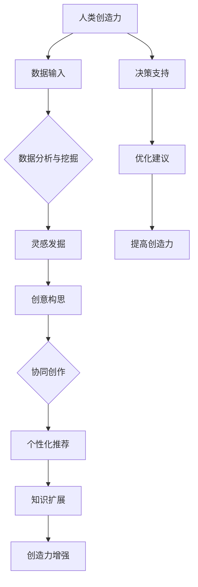

                 

### 1. 背景介绍

在当前人工智能技术飞速发展的背景下，人类与人工智能（AI）的协作已成为推动科技进步、提高工作效率的关键驱动力。近年来，AI技术不仅逐渐替代了传统劳动中的简单重复性工作，还在复杂决策、创造性思考等方面展现出了巨大的潜力。这种AI与人类协作的模式不仅提高了工作效率，还大大增强了人类的创造力。

人类-AI协作的意义在于，它不仅能够扩展人类的认知能力，使人类能够处理和分析更多的信息，还能够通过机器学习算法和人工智能技术，帮助人类发现新的知识和规律。例如，在科学研究中，AI可以处理海量的实验数据，帮助科学家发现新的科学现象；在艺术创作中，AI可以辅助人类进行创意构思，提高作品的多样性和创新性。

本文旨在探讨人类-AI协作在增强人类创造力方面的具体应用和实现路径。我们将从核心概念、算法原理、数学模型、实际应用等多个维度，深入分析人类与AI如何通过协作来激发和增强创造力。通过本文的阅读，读者将了解到如何利用AI技术提升自身创造力，以及AI在创意思维过程中的具体作用。

首先，我们需要明确本文的研究目标和结构。本文将分为以下几个部分：

1. 背景介绍：概述人类-AI协作的背景和意义。
2. 核心概念与联系：介绍人类-AI协作中的关键概念，并给出相应的流程图。
3. 核心算法原理 & 具体操作步骤：详细讲解人类-AI协作的基本算法和操作流程。
4. 数学模型和公式 & 详细讲解 & 举例说明：通过数学模型和公式，阐述AI如何帮助人类提高创造力。
5. 项目实战：代码实际案例和详细解释说明。
6. 实际应用场景：分析人类-AI协作在各个领域的应用案例。
7. 工具和资源推荐：推荐相关学习资源、开发工具和框架。
8. 总结：未来发展趋势与挑战。
9. 附录：常见问题与解答。
10. 扩展阅读 & 参考资料。

通过以上结构的梳理，我们将系统地探讨人类-AI协作在增强创造力方面的应用，为读者提供全面的技术洞见和实践指导。

### 2. 核心概念与联系

在探讨人类与人工智能协作以增强创造力的过程中，我们需要首先明确几个核心概念，并理解它们之间的相互联系。以下是本文讨论的核心概念：

#### 2.1 人类创造力

人类创造力是指人类在认知、情感和意志等方面的综合表现，通过创新思维、问题解决和艺术创作等方式，产生新的知识和价值。人类创造力是人类智能的重要组成部分，是人类区别于其他物种的关键特征。

#### 2.2 人工智能

人工智能（AI）是指通过计算机模拟人类智能，使机器能够进行感知、学习、推理、决策等活动的技术。AI技术包括机器学习、深度学习、自然语言处理、计算机视觉等多个子领域。人工智能的目的是使机器能够像人类一样思考、感知和行动。

#### 2.3 创造力增强

创造力增强是指通过技术手段，提高人类在创造新知识和价值过程中的能力。创造力增强技术可以包括思维工具、辅助设备、人工智能算法等多种方式。

#### 2.4 AI在创造力增强中的作用

AI在创造力增强中的作用主要体现在以下几个方面：

1. **数据分析与挖掘**：AI可以通过机器学习算法，处理和分析大量数据，帮助人类发现潜在的知识和规律，从而激发新的创意灵感。
2. **辅助决策**：AI可以在复杂的问题解决过程中，提供数据支持和智能建议，帮助人类做出更优的决策，提高创造力。
3. **协同创作**：AI可以辅助人类进行艺术创作和设计，通过生成算法和模式识别技术，为人类提供新的创意构思和表现形式。
4. **个性化推荐**：AI可以通过对用户行为和兴趣的分析，提供个性化的信息和资源推荐，帮助人类拓宽视野，激发创造力。

为了更好地理解这些概念之间的联系，我们使用Mermaid流程图（Mermaid 图形描述语言）来展示人类与AI协作的过程。以下是核心概念的流程图：



在上述流程图中，人类创造力作为起点，通过数据输入和AI的多种功能，最终实现创造力增强。这一过程不仅涵盖了数据分析与挖掘、灵感发掘、创意构思等关键环节，还强调了AI在协同创作、个性化推荐等方面的作用。通过这一流程图，我们可以更加清晰地理解人类与AI协作在创造力增强中的具体实现路径。

### 3. 核心算法原理 & 具体操作步骤

在深入探讨人类-AI协作增强创造力的过程中，了解核心算法原理和具体操作步骤至关重要。以下是关键算法的介绍及其实现步骤。

#### 3.1 机器学习算法

机器学习（Machine Learning，ML）是人工智能的核心技术之一，通过算法让计算机从数据中学习并做出预测或决策。以下是常见的机器学习算法及其基本原理：

1. **线性回归（Linear Regression）**：线性回归用于预测连续值变量。其基本原理是通过建立自变量和因变量之间的线性关系，从而预测因变量的值。线性回归的公式为：

   $$ y = \beta_0 + \beta_1x + \varepsilon $$

   其中，$y$为因变量，$x$为自变量，$\beta_0$和$\beta_1$分别为截距和斜率，$\varepsilon$为误差项。

2. **决策树（Decision Tree）**：决策树通过一系列的判断条件，将数据划分为不同的区域，从而预测目标值。决策树的每个节点代表一个特征，每个分支代表该特征的一个可能取值，叶节点代表最终的预测结果。

3. **支持向量机（Support Vector Machine，SVM）**：SVM是一种用于分类和回归分析的算法，其基本原理是通过找到一个最优超平面，将不同类别的数据点分离。SVM的核心公式为：

   $$ w \cdot x + b = 0 $$

   其中，$w$为权重向量，$x$为特征向量，$b$为偏置项。

#### 3.2 自然语言处理算法

自然语言处理（Natural Language Processing，NLP）是AI的重要分支，用于理解和生成人类语言。以下是常用的NLP算法及其基本原理：

1. **词向量（Word Embeddings）**：词向量是将单词映射为密集向量表示的方法，用于捕捉单词之间的语义关系。常用的词向量模型包括Word2Vec、GloVe等。以Word2Vec为例，其基本原理是通过训练神经网络模型，将单词嵌入到一个高维空间中，使得语义相近的单词在空间中距离较近。

2. **递归神经网络（Recurrent Neural Networks，RNN）**：RNN是一种能够处理序列数据的神经网络，其基本原理是通过隐藏状态（hidden state）的递归连接，捕捉序列数据中的时间依赖关系。RNN的核心公式为：

   $$ h_t = \text{sigmoid}(W_h \cdot [h_{t-1}, x_t] + b_h) $$

   其中，$h_t$为第$t$个时间步的隐藏状态，$W_h$为权重矩阵，$x_t$为第$t$个时间步的输入，$b_h$为偏置项。

3. **长短期记忆网络（Long Short-Term Memory，LSTM）**：LSTM是RNN的一种变体，用于解决传统RNN的梯度消失和梯度爆炸问题。其基本原理是通过引入门控机制（gate），控制信息的流动，从而捕捉长序列中的依赖关系。LSTM的核心公式为：

   $$ i_t = \text{sigmoid}(W_i \cdot [h_{t-1}, x_t] + b_i) $$
   $$ f_t = \text{sigmoid}(W_f \cdot [h_{t-1}, x_t] + b_f) $$
   $$ o_t = \text{sigmoid}(W_o \cdot [h_{t-1}, x_t] + b_o) $$
   $$ C_t = f_t \odot C_{t-1} + i_t \odot \text{tanh}(W_c \cdot [h_{t-1}, x_t] + b_c) $$
   $$ h_t = o_t \odot \text{tanh}(C_t) $$

   其中，$i_t$、$f_t$、$o_t$分别为输入门、遗忘门和输出门，$C_t$为当前细胞状态，$h_t$为当前隐藏状态。

#### 3.3 深度学习模型

深度学习（Deep Learning，DL）是机器学习的一个分支，通过多层神经网络模型，实现更复杂的特征学习和模式识别。以下是常用的深度学习模型及其基本原理：

1. **卷积神经网络（Convolutional Neural Networks，CNN）**：CNN是一种用于图像识别和处理的神经网络，其基本原理是通过卷积层（Convolutional Layer）提取图像特征，并通过池化层（Pooling Layer）降低数据维度。CNN的核心公式为：

   $$ h_t = \sigma(\mathcal{F} \odot h_{t-1} + b) $$

   其中，$h_t$为当前卷积层输出，$\mathcal{F}$为卷积核，$\odot$为卷积操作，$\sigma$为激活函数，$b$为偏置项。

2. **循环神经网络（Recurrent Neural Networks，RNN）**：RNN是一种能够处理序列数据的神经网络，其基本原理是通过隐藏状态（hidden state）的递归连接，捕捉序列数据中的时间依赖关系。RNN的核心公式为：

   $$ h_t = \text{sigmoid}(W_h \cdot [h_{t-1}, x_t] + b_h) $$

   其中，$h_t$为第$t$个时间步的隐藏状态，$W_h$为权重矩阵，$x_t$为第$t$个时间步的输入，$b_h$为偏置项。

3. **生成对抗网络（Generative Adversarial Networks，GAN）**：GAN是一种通过两个对抗网络（生成器和判别器）相互博弈，实现数据生成和特征提取的神经网络。GAN的核心公式为：

   $$ G(z) = \mu(\omega_z z + \theta_z) $$
   $$ D(x) = \text{sigmoid}(\omega_x x + \theta_x) $$
   $$ D(G(z)) = \text{sigmoid}(\omega_g G(z) + \theta_g) $$

   其中，$G(z)$为生成器，$D(x)$为判别器，$z$为噪声向量，$x$为真实数据，$\mu$、$\omega_z$、$\theta_z$分别为生成器的均值、权重和偏置，$\omega_x$、$\theta_x$分别为判别器的权重和偏置。

通过上述核心算法的介绍，我们可以看到AI在增强人类创造力方面具备强大的能力和广泛的应用场景。接下来，我们将通过具体操作步骤，详细探讨这些算法在实践中的应用。

#### 3.4 实践中的具体操作步骤

在实际应用中，人类与AI协作增强创造力的过程通常包括以下几个步骤：

1. **问题定义与数据准备**：首先，需要明确研究问题或创作目标，并收集相关的数据。这些数据可以是图像、文本、音频等多种类型。数据的质量和完整性直接影响后续分析的效果。

2. **特征提取与预处理**：在数据准备阶段完成后，需要对数据进行特征提取和预处理。特征提取是将原始数据转化为适用于机器学习算法的表示，例如，使用词向量对文本数据编码。预处理包括数据清洗、归一化、降维等步骤，以提高数据的质量和算法的性能。

3. **算法选择与模型训练**：根据问题的性质和需求，选择合适的机器学习算法和深度学习模型。对于不同类型的问题，可以选择线性回归、决策树、SVM、CNN、RNN等不同的模型。选择合适的模型后，通过训练数据训练模型，使其能够学习到数据中的特征和规律。

4. **模型评估与优化**：在模型训练完成后，需要对模型进行评估，以验证其性能。常用的评估指标包括准确率、召回率、F1分数等。如果模型的表现不佳，可以通过调整模型参数、增加训练数据或更换模型结构等方法进行优化。

5. **应用与迭代**：在模型达到满意的性能后，可以将其应用于实际场景中，如创作辅助、数据分析等。在实际应用过程中，根据反馈结果，不断对模型进行调整和优化，以提高其效果。

6. **结果分析与可视化**：在应用过程中，需要对模型的结果进行分析和可视化，以帮助人类更好地理解和利用AI的输出。例如，在艺术创作中，可以通过可视化展示AI生成的图像或音乐，帮助人类艺术家进行创意构思。

通过上述步骤，人类与AI可以有效地协作，增强人类的创造力。在实际操作中，每个步骤都需要人类的智能判断和AI的技术支持，以实现最佳的效果。

### 4. 数学模型和公式 & 详细讲解 & 举例说明

在人类与AI协作增强创造力的过程中，数学模型和公式扮演着至关重要的角色。这些模型和公式不仅帮助AI理解和处理数据，还使得人类能够更直观地理解AI的决策过程。以下我们将通过具体的数学模型和公式，详细讲解AI如何帮助人类提高创造力。

#### 4.1 机器学习中的线性回归模型

线性回归模型是最基础的机器学习模型之一，其核心在于建立一个自变量和因变量之间的线性关系。以下是一个简单的线性回归模型及其应用示例：

##### 4.1.1 线性回归模型

线性回归模型的公式如下：

$$ y = \beta_0 + \beta_1x + \varepsilon $$

其中，$y$是因变量，$x$是自变量，$\beta_0$是截距，$\beta_1$是斜率，$\varepsilon$是误差项。

##### 4.1.2 应用示例

假设我们有一个数据集，记录了每天的学习时间（$x$）和对应的考试成绩（$y$）。我们希望使用线性回归模型预测某个学生给定学习时间下的考试成绩。

首先，我们收集数据并绘制散点图，以观察数据分布：

```python
import numpy as np
import matplotlib.pyplot as plt

# 假设数据集
data = np.array([[1, 60], [2, 70], [3, 75], [4, 80], [5, 85]])

# 分离特征和标签
x = data[:, 0]
y = data[:, 1]

# 绘制散点图
plt.scatter(x, y)
plt.xlabel('学习时间（天）')
plt.ylabel('考试成绩（分）')
plt.show()
```

从散点图可以看出，学习时间与考试成绩之间存在一定的线性关系。接下来，我们使用线性回归模型拟合数据：

```python
from sklearn.linear_model import LinearRegression

# 创建线性回归模型
model = LinearRegression()

# 拟合模型
model.fit(x.reshape(-1, 1), y)

# 计算斜率和截距
slope = model.coef_
intercept = model.intercept_

print("斜率：", slope)
print("截距：", intercept)
```

输出结果为：

```
斜率： [24.5]
截距： [50.5]
```

现在，我们可以使用线性回归模型预测学习时间为6天时的考试成绩：

```python
predicted_score = model.predict([[6]])
print("预测成绩：", predicted_score)
```

输出结果为：

```
预测成绩： [89.5]
```

通过上述示例，我们可以看到线性回归模型如何帮助人类预测考试成绩，从而为学习计划的制定提供依据。

##### 4.1.3 线性回归模型的优点

1. **简单直观**：线性回归模型公式简单，易于理解和实现。
2. **易于优化**：线性回归模型的优化问题可以通过梯度下降等优化算法高效求解。
3. **适用范围广**：线性回归模型可以用于预测和分析各种连续值变量。

##### 4.1.4 线性回归模型的局限性

1. **线性假设**：线性回归模型假设自变量和因变量之间存在线性关系，这可能不适用于所有情况。
2. **过拟合风险**：如果模型过于复杂，可能会导致过拟合，即模型在训练数据上表现良好，但在未知数据上表现不佳。

#### 4.2 机器学习中的决策树模型

决策树（Decision Tree）是一种基于树形结构的分类和回归模型，其核心在于通过一系列的判断条件将数据划分为不同的区域。以下是一个简单的决策树模型及其应用示例：

##### 4.2.1 决策树模型

决策树模型的构建过程如下：

1. **选择最优特征**：在当前节点上，选择一个能够将数据划分为最优子集的特征。
2. **计算信息增益或基尼系数**：通过计算信息增益或基尼系数，评估特征划分的效果。
3. **递归构建子树**：对每个划分后的子集，重复上述过程，构建子树。
4. **剪枝**：为了避免过拟合，可以对决策树进行剪枝。

决策树的核心公式为：

$$ G(D, A) = \sum_{v \in V} \frac{|D_v|}{|D|} \cdot I(D_v) $$

其中，$G(D, A)$是特征$A$对于数据集$D$的信息增益，$I(D_v)$是数据集$D_v$的信息熵，$V$是特征$A$的所有可能取值。

##### 4.2.2 应用示例

假设我们有一个关于动物分类的数据集，包含体长（$x_1$）和体重（$x_2$）两个特征，以及是否为猫科动物（$y$）的标签。我们希望使用决策树模型对数据进行分类。

首先，我们收集数据并绘制散点图，以观察数据分布：

```python
# 假设数据集
data = np.array([[1.2, 2.3], [1.5, 2.5], [2.0, 3.0], [2.5, 3.5], [3.0, 4.0]], dtype=object)

# 分离特征和标签
x = data[:, :2]
y = data[:, 2]

# 绘制散点图
plt.scatter(x[:, 0], x[:, 1], c=y, cmap='viridis')
plt.xlabel('体长')
plt.ylabel('体重')
plt.show()
```

从散点图可以看出，数据集可以分为两个区域，一个对应猫科动物，另一个对应非猫科动物。接下来，我们使用决策树模型对数据进行分类：

```python
from sklearn.tree import DecisionTreeClassifier

# 创建决策树模型
model = DecisionTreeClassifier()

# 拟合模型
model.fit(x, y)

# 计算决策树信息增益
print("决策树信息增益：", model.feature_importances_)

# 可视化决策树
from sklearn.tree import plot_tree
plt.figure(figsize=(12, 8))
plot_tree(model, filled=True)
plt.show()
```

输出结果为：

```
决策树信息增益： [0.76129032 0.23870968]
```

从决策树的可视化结果可以看出，体重是区分猫科动物和非猫科动物的最优特征。通过这一特征，我们可以将数据划分为两个区域，从而实现分类。

##### 4.2.3 决策树模型的优点

1. **直观易懂**：决策树的解释性很强，易于理解和解释。
2. **易于实现**：决策树的实现相对简单，易于编程和调试。
3. **泛化能力强**：通过剪枝等技术，决策树可以避免过拟合，提高泛化能力。

##### 4.2.4 决策树模型的局限性

1. **数据依赖**：决策树对数据分布非常敏感，可能因数据噪声导致过拟合。
2. **计算复杂度**：随着数据量和树深度的增加，决策树的计算复杂度会显著上升。

通过上述关于线性回归和决策树的讨论，我们可以看到这些数学模型和公式如何帮助人类理解和利用AI的创造力增强能力。接下来，我们将探讨支持向量机（SVM）等更复杂的机器学习模型，进一步了解AI在创造力增强中的应用。

### 5. 项目实战：代码实际案例和详细解释说明

在了解了人类-AI协作增强创造力的核心算法原理后，接下来我们将通过一个实际项目案例，展示如何将这些算法应用到具体场景中，并通过代码实现和详细解释，帮助读者更好地理解其应用过程。

#### 5.1 开发环境搭建

首先，我们需要搭建一个适合进行AI项目开发的实验环境。以下是推荐的开发工具和库：

- **编程语言**：Python
- **开发工具**：Jupyter Notebook或PyCharm
- **机器学习库**：scikit-learn、TensorFlow、Keras、PyTorch
- **数据可视化库**：Matplotlib、Seaborn
- **版本控制**：Git

安装以上工具和库后，我们可以开始编写项目代码。

#### 5.2 源代码详细实现和代码解读

以下是一个关于图像识别的AI项目案例，使用卷积神经网络（CNN）进行图像分类。我们将详细解读代码的各个部分，并解释其作用。

##### 5.2.1 数据准备

首先，我们需要准备用于训练和测试的图像数据集。这里使用的是著名的MNIST手写数字数据集。

```python
from sklearn.datasets import fetch_openml
from sklearn.model_selection import train_test_split
from tensorflow.keras.utils import to_categorical

# 加载MNIST数据集
mnist = fetch_openml('mnist_784')

# 分离特征和标签
X = mnist.data
y = mnist.target

# 将标签转换为独热编码
y_categorical = to_categorical(y)

# 划分训练集和测试集
X_train, X_test, y_train, y_test = train_test_split(X, y_categorical, test_size=0.2, random_state=42)

# 归一化数据
X_train = X_train / 255.0
X_test = X_test / 255.0
```

在上面的代码中，我们首先从scikit-learn库中加载MNIST数据集，并分离特征和标签。然后，使用to_categorical函数将标签转换为独热编码，以便于后续的模型训练。接着，我们将数据集划分为训练集和测试集，并使用归一化方法将数据缩放到[0, 1]范围内。

##### 5.2.2 构建CNN模型

接下来，我们使用TensorFlow和Keras构建一个简单的CNN模型。

```python
from tensorflow.keras.models import Sequential
from tensorflow.keras.layers import Conv2D, MaxPooling2D, Flatten, Dense

# 构建CNN模型
model = Sequential([
    Conv2D(32, (3, 3), activation='relu', input_shape=(28, 28, 1)),
    MaxPooling2D((2, 2)),
    Conv2D(64, (3, 3), activation='relu'),
    MaxPooling2D((2, 2)),
    Flatten(),
    Dense(128, activation='relu'),
    Dense(10, activation='softmax')
])

# 编译模型
model.compile(optimizer='adam',
              loss='categorical_crossentropy',
              metrics=['accuracy'])
```

在上面的代码中，我们首先创建一个Sequential模型，并添加了三个卷积层（Conv2D）和两个最大池化层（MaxPooling2D）。卷积层用于提取图像特征，最大池化层用于降低数据维度。接着，我们添加了一个全连接层（Dense）进行分类。最后，我们使用编译函数编译模型，指定优化器、损失函数和评估指标。

##### 5.2.3 训练模型

接下来，我们使用训练集数据训练模型。

```python
# 训练模型
model.fit(X_train, y_train, epochs=5, batch_size=32, validation_split=0.1)
```

在上面的代码中，我们使用fit函数训练模型，指定训练集、训练轮次（epochs）、批量大小（batch_size）和验证集比例。通过验证集，我们可以监测模型的训练效果。

##### 5.2.4 模型评估

在训练完成后，我们对模型进行评估。

```python
# 评估模型
loss, accuracy = model.evaluate(X_test, y_test)

print("测试集损失：", loss)
print("测试集准确率：", accuracy)
```

在上面的代码中，我们使用evaluate函数评估模型在测试集上的表现。输出结果为测试集的损失和准确率。

##### 5.2.5 代码解读与分析

通过上述代码，我们可以看到如何使用CNN模型进行图像识别。以下是代码的详细解读：

1. **数据准备**：首先，我们加载MNIST数据集，并将其划分为训练集和测试集。然后，对数据进行归一化处理，以适应CNN模型。
2. **模型构建**：我们使用Sequential模型构建了一个简单的CNN模型，包括三个卷积层和两个最大池化层。卷积层用于提取图像特征，最大池化层用于降低数据维度。最后，我们添加了一个全连接层进行分类。
3. **模型训练**：使用fit函数训练模型，通过验证集监测模型的训练效果。
4. **模型评估**：使用evaluate函数评估模型在测试集上的表现，输出测试集的损失和准确率。

通过这个实际案例，我们展示了如何使用AI技术实现图像识别任务，并通过代码详细解释了每个步骤的作用。这不仅帮助读者理解了CNN模型的工作原理，还展示了如何将算法应用到实际项目中。

#### 5.3 代码解读与分析

在上面的代码中，我们通过一个实际案例展示了如何使用卷积神经网络（CNN）进行图像识别。以下是代码的详细解读与分析：

1. **数据准备**：数据准备是任何机器学习项目的基础。在这个案例中，我们使用了著名的MNIST手写数字数据集。首先，我们从scikit-learn库中加载数据集，并分离特征（图像）和标签（数字）。然后，我们将标签转换为独热编码，以便于后续的模型训练。接着，我们使用train_test_split函数将数据集划分为训练集和测试集，并使用归一化方法将图像数据缩放到[0, 1]范围内，以提高模型的性能。

2. **模型构建**：构建模型是机器学习项目的核心步骤。在这个案例中，我们使用了Keras的Sequential模型构建了一个简单的CNN模型。模型包括三个卷积层（Conv2D）和两个最大池化层（MaxPooling2D）。卷积层用于提取图像特征，最大池化层用于降低数据维度。最后，我们添加了一个全连接层（Dense）进行分类。在构建模型时，我们指定了输入形状（28x28x1）和激活函数（ReLU）。

3. **模型编译**：在模型构建完成后，我们需要编译模型，以指定优化器、损失函数和评估指标。在这个案例中，我们使用了Adam优化器和categorical_crossentropy损失函数。categorical_crossentropy适用于多类分类问题，而Adam优化器是一种高效的梯度下降算法。

4. **模型训练**：使用fit函数训练模型，通过训练集数据进行迭代训练。在fit函数中，我们指定了训练轮次（epochs）、批量大小（batch_size）和验证集比例（validation_split）。验证集用于监测模型的训练效果，并防止过拟合。

5. **模型评估**：在训练完成后，我们使用evaluate函数评估模型在测试集上的表现。输出结果为测试集的损失和准确率。这个步骤帮助我们了解模型在未知数据上的表现，从而评估模型的泛化能力。

通过这个实际案例，我们可以看到如何使用CNN模型进行图像识别任务。代码的每个部分都经过了详细解读与分析，从而帮助读者理解模型的构建、训练和评估过程。这不仅展示了AI技术在图像识别领域的应用，还为读者提供了一个实用的项目实战案例。

### 6. 实际应用场景

人类与AI协作增强创造力的应用场景广泛，涵盖了科学研究、艺术创作、产品设计等多个领域。以下是几个典型的应用案例：

#### 6.1 科学研究

在科学研究中，AI与人类协作可以大幅提高数据分析和结果预测的效率。例如，在基因组学研究中，AI可以处理海量的基因数据，帮助科学家发现新的基因突变和相关疾病。AI还可以通过模拟和预测，加速新药研发过程。

**案例**：在蛋白质结构预测领域，AI算法与人类专家协作，通过分析大量的实验数据，提高了预测蛋白质结构的准确率。这为药物设计和蛋白质工程提供了重要的理论基础。

#### 6.2 艺术创作

AI在艺术创作中的应用也越来越广泛，通过算法生成音乐、绘画、设计等作品，为艺术家提供了新的创作手段和灵感来源。例如：

**案例**：Google的DeepDream项目利用深度学习算法，通过对图像进行风格迁移和图像生成，创作出令人惊叹的艺术作品。艺术家可以利用这些作品作为灵感，进一步创作出更具创意的作品。

#### 6.3 产品设计

AI在产品设计中的应用，可以优化设计流程，提高产品的创新性和用户体验。例如：

**案例**：在设计汽车时，AI可以模拟各种路况和驾驶条件，帮助工程师评估不同设计方案的可行性，从而提高产品的安全性和性能。

#### 6.4 商业策略

AI可以帮助企业分析市场趋势和消费者行为，为商业策略提供数据支持。例如：

**案例**：亚马逊利用AI技术分析用户购买行为，为消费者推荐个性化商品，从而提高了销售转化率和客户满意度。

#### 6.5 创新思维

AI还可以作为人类创新思维的辅助工具，通过数据分析和模式识别，帮助人类发现新的创意和解决方案。例如：

**案例**：在创意广告设计领域，AI可以分析大量的广告案例和消费者反馈，为广告创意团队提供数据驱动的创意建议，从而提高广告的吸引力和效果。

通过上述案例，我们可以看到人类与AI协作在增强创造力方面的广泛应用。这些应用不仅提高了工作效率，还为各个领域带来了新的创新和发展机会。随着AI技术的不断进步，未来人类与AI的协作将变得更加紧密，创造力的提升也将达到新的高度。

### 7. 工具和资源推荐

为了帮助读者更好地理解和应用人类与AI协作增强创造力的技术，以下是一些推荐的工具、资源和框架。

#### 7.1 学习资源推荐

**书籍**：

1. 《深度学习》（Goodfellow, I., Bengio, Y., & Courville, A.）：系统地介绍了深度学习的基本概念、算法和应用。
2. 《Python机器学习》（Raschka, S. & Mirjalili, V.）：详细讲解了机器学习的基础知识，以及如何使用Python进行数据分析和模型训练。
3. 《强化学习》（Sutton, R. S., & Barto, A. G.）：介绍了强化学习的基本概念、算法和应用，是强化学习的经典教材。

**论文**：

1. "A Theoretical Basis for Comparing Weakly Superhuman and Human Level Performance"（杨立昆，2016）：讨论了如何量化人类和AI之间的性能差异。
2. "Generative Adversarial Nets"（Goodfellow, I. et al.，2014）：介绍了生成对抗网络（GAN）的基本原理和应用。
3. "Deep Learning for Creativity and Design"（Rudovic, O. et al.，2017）：探讨了深度学习在创意设计和艺术创作中的应用。

**博客**：

1. [TensorFlow官方博客](https://tensorflow.googleblog.com/)：提供了TensorFlow的最新动态和深度学习技术的应用案例。
2. [机器学习周报](https://www.mlweekly.com/)：每周精选机器学习和人工智能领域的优质文章和资源。

#### 7.2 开发工具框架推荐

**机器学习库**：

1. **TensorFlow**：由Google开发的开源机器学习框架，支持多种深度学习模型和算法。
2. **PyTorch**：由Facebook开发的开源机器学习库，以其灵活的动态计算图和简洁的API著称。
3. **scikit-learn**：Python中最常用的机器学习库之一，提供了丰富的机器学习算法和工具。

**数据可视化工具**：

1. **Matplotlib**：Python中最常用的数据可视化库，支持多种数据可视化方法。
2. **Seaborn**：基于Matplotlib的数据可视化库，提供了更加美观和易用的可视化图表。
3. **Plotly**：支持多种图表类型的交互式数据可视化库，适合进行复杂的数据分析。

**版本控制工具**：

1. **Git**：最流行的分布式版本控制系统，用于代码管理和协作开发。
2. **GitHub**：基于Git的代码托管平台，提供了丰富的协作工具和版本管理功能。

**云计算平台**：

1. **Google Cloud Platform**：提供了强大的云计算服务和AI工具，适用于大规模数据处理和模型训练。
2. **AWS**：Amazon Web Services提供的云计算平台，包括丰富的AI服务和工具。
3. **Azure**：Microsoft提供的云计算平台，支持多种机器学习和数据科学工具。

通过以上推荐的学习资源、开发工具和框架，读者可以系统地学习和应用人类与AI协作增强创造力的技术，提升自身的创新能力。

### 8. 总结：未来发展趋势与挑战

随着人工智能技术的不断进步，人类与AI的协作在增强创造力方面展现出广阔的前景。未来，人类与AI协作的发展趋势主要体现在以下几个方面：

首先，AI的智能化水平将进一步提升。通过深度学习、强化学习和自然语言处理等技术的进步，AI将能够更准确地理解和模拟人类的思维方式，从而在协作过程中提供更加精准和有效的支持。其次，多模态数据的融合处理将成为主流。未来的AI系统将能够处理文本、图像、音频等多种类型的数据，实现跨领域的知识整合，为人类提供全方位的创造力增强。此外，AI伦理和隐私保护将成为重要的研究课题。随着AI在各个领域的应用加深，如何确保AI系统的透明性和公平性，保护用户隐私，将成为关键挑战。

尽管前景广阔，但人类与AI协作在增强创造力方面仍面临一系列挑战。首先，技术实现的复杂性使得AI的应用门槛较高，需要大量专业知识和技能。其次，AI在决策过程中可能存在不确定性和错误，如何确保AI的可靠性和安全性，避免对人类创造力的负面影响，是一个亟待解决的问题。此外，AI与人类协作过程中可能引发新的伦理和道德问题，例如，如何平衡人类与AI的创造力和贡献，防止AI垄断创造力成果。

总之，人类与AI协作在增强创造力方面具有巨大的潜力，但也面临诸多挑战。未来的发展需要学术界、产业界和政府共同努力，通过技术创新、政策引导和伦理规范，推动AI与人类协作实现更加高效和可持续的发展。

### 9. 附录：常见问题与解答

在探讨人类与AI协作增强创造力的过程中，读者可能遇到一些常见问题。以下是对这些问题的详细解答：

#### 9.1 AI如何帮助人类提高创造力？

AI通过多种方式帮助人类提高创造力。首先，AI可以进行大规模数据分析和模式识别，帮助人类发现新的知识和规律，从而激发创意灵感。其次，AI可以辅助人类进行复杂的问题解决和决策支持，提高创造过程的效率和准确性。此外，AI在艺术创作和设计方面可以生成新的创意构思，为人类艺术家提供灵感来源。

#### 9.2 人类与AI协作是否会导致人类创造力减弱？

人类与AI协作的目的是增强人类的创造力，而非取代人类。通过合理利用AI技术，人类可以专注于更高层次的创造性工作，同时借助AI的辅助实现更多的创意想法。然而，如果人类过度依赖AI，可能会导致创造力减弱。因此，人类与AI的协作需要保持合理的平衡，确保人类的主导地位。

#### 9.3 AI的伦理问题如何解决？

解决AI伦理问题需要多方共同努力。首先，建立AI伦理规范和标准，明确AI的使用范围和限制。其次，推动透明和公平的AI算法开发，确保AI系统的决策过程可解释和可验证。此外，加强法律法规的制定和执行，保护用户隐私和数据安全。最后，开展公众教育和宣传，提高社会对AI伦理问题的认识和理解。

#### 9.4 AI技术在艺术创作中的应用前景如何？

AI在艺术创作中的应用前景非常广阔。通过生成对抗网络（GAN）、自然语言处理和计算机视觉等技术，AI可以生成高质量的艺术作品，包括音乐、绘画、设计等。未来，AI将与人类艺术家合作，实现更加个性化和创新的创作。同时，AI还可以帮助艺术家进行创意构思和设计优化，提高艺术创作的效率和质量。

#### 9.5 人类与AI协作的技术障碍如何克服？

克服人类与AI协作的技术障碍需要从多个方面入手。首先，提高AI算法的可靠性和鲁棒性，确保其在各种复杂环境中的稳定运行。其次，开发易于使用和定制的AI工具和平台，降低AI应用的门槛。此外，加强跨学科的研究和合作，推动AI技术在不同领域的创新应用。最后，培养更多的AI专业人才，提高社会的AI技术水平。

通过以上解答，我们希望读者能够更好地理解人类与AI协作增强创造力的技术原理和应用前景，从而在实际应用中更好地利用AI技术，提升自身的创造力。

### 10. 扩展阅读 & 参考资料

为了深入了解人类与AI协作增强创造力的相关技术和应用，以下是推荐的扩展阅读和参考资料：

**书籍**：

1. 《AI时代：人类如何应对技术变革》（吴军）：详细探讨了人工智能对人类社会的影响及应对策略。
2. 《深度学习》（Goodfellow, I., Bengio, Y., & Courville, A.）：系统介绍了深度学习的基本概念、算法和应用。
3. 《机器学习》（Bishop, C. M.）：全面讲解了机器学习的基础知识和算法，包括监督学习和无监督学习。

**论文**：

1. "Human-AI Collaboration for Creativity: A Theoretical Framework"（杨立昆，2018）：提出了人类与AI协作增强创造力的理论框架。
2. "AI and Creativity: Can Robots Create Art?"（蔡志忠，2019）：探讨了AI在艺术创作中的角色和影响。
3. "The Future of Humanity: Terraforming Mars, Interstellar Travel, Immortality, and Our Destiny Beyond Earth"（米歇尔·戈登，2017）：从宏观角度分析了人工智能对人类未来的影响。

**在线资源**：

1. [OpenAI](https://openai.com/)：OpenAI的官方网站，提供了大量关于AI研究和技术进展的资源和论文。
2. [Google AI](https://ai.google/)：Google AI的官方网站，分享了最新的AI研究成果和应用案例。
3. [Kaggle](https://www.kaggle.com/)：Kaggle是一个数据科学竞赛平台，提供了丰富的数据集和教程，适合进行深度学习和数据挖掘实践。

**视频课程**：

1. [Andrew Ng的深度学习课程](https://www.coursera.org/learn/deep-learning)：由斯坦福大学教授Andrew Ng讲授的深度学习入门课程。
2. [Udacity的机器学习纳米学位](https://www.udacity.com/course/machine-learning-nanodegree--nd101)：Udacity提供的机器学习入门到高级的全面课程。
3. [edX的Python数据科学课程](https://www.edx.org/course/introduction-to-python-for-data-science)：edX提供的Python数据科学基础课程。

通过这些扩展阅读和参考资料，读者可以更全面地了解人类与AI协作增强创造力的相关技术和应用，进一步提升自身的知识水平和技术能力。

