                 

# {文章标题}

## 人类智能与人工智能的关系

### 关键词：人工智能，人类智能，机器学习，神经网络，智能模拟

### 摘要

本文将探讨人类智能与人工智能之间的关系，从历史背景、核心概念、算法原理、数学模型、实际应用等方面进行分析。我们将深入探讨人工智能如何模拟人类智能，以及在未来可能面临的挑战和趋势。通过本文的阅读，读者将更好地理解人工智能与人类智能的互动关系，以及它们在技术进步和社会发展中的重要作用。

## 1. 背景介绍

人类智能是一个复杂且多层次的系统，它涵盖了认知、情感、行为等多个方面。在过去的几千年里，人类通过观察、思考、学习和创造，逐步构建了对世界的认知体系。随着计算机技术的飞速发展，人工智能逐渐成为研究的热点。人工智能（Artificial Intelligence，简称AI）是一门旨在模拟、扩展和扩展人类智能的学科。

人工智能的历史可以追溯到20世纪50年代，当时科学家们开始探索如何让计算机具备类似于人类的智能。1956年，约翰·麦卡锡（John McCarthy）等人在达特茅斯会议上首次提出了人工智能的概念。自那时以来，人工智能领域取得了许多重要的进展，包括专家系统、自然语言处理、机器学习和深度学习等。

在人工智能的发展过程中，人类智能始终是一个重要的参考和目标。人类智能的多样性和复杂性为人工智能的研究提供了丰富的灵感和借鉴。例如，机器学习算法通过模拟人类的学习过程，逐步提高计算机的智能水平。神经网络作为一种重要的机器学习模型，其结构和工作原理与生物神经元的连接方式类似，这使得人工智能能够在某些方面模拟人类智能。

## 2. 核心概念与联系

### 2.1 人类智能的基本概念

人类智能是一个多维度的概念，可以从不同的角度进行理解和描述。以下是几个常见的人类智能维度：

1. **认知能力**：包括记忆、推理、判断、思考等。认知能力是人类进行信息处理和决策的重要基础。
2. **语言能力**：包括语言理解、表达和沟通。语言是人类交流和思维的重要工具。
3. **感知能力**：包括视觉、听觉、触觉等。感知能力是人类获取外界信息的重要途径。
4. **学习能力**：包括适应新环境、解决问题和获取新知识。学习能力是人类不断进步和发展的关键。
5. **情感能力**：包括情绪识别、情感表达和情感调节。情感能力是人类社会交往和心理健康的基石。

### 2.2 人工智能的基本概念

人工智能是一个旨在模拟、扩展和扩展人类智能的学科。人工智能可以从不同的层次和角度进行理解和描述。以下是几个常见的人工智能维度：

1. **感知能力**：包括图像识别、语音识别和自然语言处理等。感知能力是人工智能获取和理解外界信息的重要手段。
2. **认知能力**：包括问题解决、推理和决策等。认知能力是人工智能模拟人类智能的核心。
3. **学习能力**：包括机器学习和深度学习等。学习能力是人工智能不断提高自身能力的重要途径。
4. **行动能力**：包括自动化控制和机器人等。行动能力是人工智能在实际应用中发挥作用的关键。

### 2.3 人类智能与人工智能的联系

人类智能与人工智能之间存在密切的联系和互动。以下是几个方面的联系：

1. **技术借鉴**：人工智能在很多方面借鉴了人类智能的原理和方法。例如，神经网络的结构和工作原理与生物神经元的连接方式类似，这使得人工智能能够在某些方面模拟人类智能。
2. **算法改进**：人工智能的研究不断推动算法的改进和优化。例如，机器学习算法通过模拟人类的学习过程，逐步提高计算机的智能水平。
3. **应用创新**：人工智能在各个领域的应用不断拓展，为人类带来新的技术和解决方案。例如，自动驾驶技术、智能家居和医疗诊断等。
4. **人机协作**：人工智能与人类智能的结合，可以创造出更高效、更智能的系统和工具。例如，智能助手、机器人助理和智能客服等。

### 2.4 Mermaid 流程图

以下是人类智能与人工智能的联系的 Mermaid 流程图：

```mermaid
graph TD
    A[人类智能] --> B[感知能力]
    A --> C[认知能力]
    A --> D[学习能力]
    A --> E[情感能力]
    A --> F[语言能力]
    B --> G[图像识别]
    B --> H[语音识别]
    B --> I[自然语言处理]
    C --> J[问题解决]
    C --> K[推理]
    C --> L[决策]
    D --> M[机器学习]
    D --> N[深度学习]
    E --> O[情绪识别]
    E --> P[情感表达]
    E --> Q[情感调节]
    F --> R[语言理解]
    F --> S[语言表达]
    F --> T[沟通]
    G --> U[自动驾驶技术]
    G --> V[智能家居]
    G --> W[医疗诊断]
    H --> X[智能助手]
    H --> Y[机器人助理]
    H --> Z[智能客服]
    I --> AA[感知能力]
    I --> BB[认知能力]
    I --> CC[学习能力]
    I --> DD[行动能力]
    J --> EE[问题解决]
    J --> FF[推理]
    J --> GG[决策]
    K --> HH[机器学习]
    K --> II[深度学习]
    L --> JJ[自动化控制]
    L --> KK[机器人]
    M --> LL[自然语言处理]
    M --> NN[图像识别]
    M --> OO[语音识别]
    N --> PP[情感能力]
    N --> QQ[语言能力]
    O --> RR[情感识别]
    O --> SS[情感表达]
    O --> TT[情感调节]
    P --> UU[情绪识别]
    P --> VV[情感表达]
    P --> WW[情感调节]
    Q --> XX[语言理解]
    Q --> YY[语言表达]
    Q --> ZZ[沟通]
    R --> AA[图像识别]
    R --> BB[语音识别]
    R --> CC[自然语言处理]
    S --> DD[问题解决]
    S --> EE[推理]
    S --> FF[决策]
    T --> GG[机器学习]
    T --> HH[深度学习]
    U --> II[自动化控制]
    U --> JJ[机器人]
    V --> KK[感知能力]
    V --> LL[认知能力]
    V --> NN[学习能力]
    W --> MM[情感能力]
    W --> NN[语言能力]
    X --> OO[情感能力]
    X --> PP[语言能力]
    Y --> QQ[感知能力]
    Y --> RR[认知能力]
    Y --> SS[学习能力]
    Z --> TT[情感能力]
    Z --> UU[语言能力]
```



## 3. 核心算法原理 & 具体操作步骤

### 3.1 机器学习算法原理

机器学习是人工智能的一个重要分支，它通过让计算机从数据中学习，从而实现自动识别模式和预测结果。以下是几种常见的机器学习算法：

1. **线性回归**：线性回归是一种用于预测连续值的算法。它的核心思想是通过建立一个线性方程，来拟合输入数据和输出值之间的关系。具体操作步骤如下：

    - 数据预处理：对输入数据进行清洗、归一化等处理。
    - 模型建立：根据数据特点，选择合适的线性回归模型。
    - 模型训练：使用训练数据，通过梯度下降等优化算法，训练出模型参数。
    - 模型评估：使用测试数据，对模型进行评估和优化。

2. **决策树**：决策树是一种基于树形结构进行分类或回归的算法。它的核心思想是通过一系列的决策规则，将数据集划分为多个子集，并在每个子集中进行分类或回归。具体操作步骤如下：

    - 数据预处理：对输入数据进行清洗、归一化等处理。
    - 特征选择：选择对分类或回归任务有重要影响的特征。
    - 决策树建立：根据特征值，建立决策树模型。
    - 模型训练：使用训练数据，训练出决策树模型。
    - 模型评估：使用测试数据，对模型进行评估和优化。

3. **支持向量机（SVM）**：支持向量机是一种基于间隔最大化原则进行分类的算法。它的核心思想是通过找到一个最佳的超平面，将数据集划分为不同的类别。具体操作步骤如下：

    - 数据预处理：对输入数据进行清洗、归一化等处理。
    - 特征选择：选择对分类任务有重要影响的特征。
    - SVM模型建立：根据数据特点，选择合适的支持向量机模型。
    - 模型训练：使用训练数据，训练出SVM模型。
    - 模型评估：使用测试数据，对模型进行评估和优化。

### 3.2 深度学习算法原理

深度学习是一种基于多层神经网络进行学习的算法。它的核心思想是通过多层神经元的连接和激活函数，将输入数据逐步转换为更复杂的特征表示。以下是几种常见的深度学习算法：

1. **卷积神经网络（CNN）**：卷积神经网络是一种用于图像识别的深度学习算法。它的核心思想是通过卷积层、池化层和全连接层等结构，提取图像中的特征。具体操作步骤如下：

    - 数据预处理：对输入图像数据进行清洗、归一化等处理。
    - 网络结构建立：根据数据特点，设计合适的卷积神经网络结构。
    - 网络训练：使用训练数据，通过反向传播算法训练出神经网络模型。
    - 模型评估：使用测试数据，对模型进行评估和优化。

2. **循环神经网络（RNN）**：循环神经网络是一种用于序列数据处理的深度学习算法。它的核心思想是通过循环结构，将前一个时刻的输出作为当前时刻的输入。具体操作步骤如下：

    - 数据预处理：对输入序列数据进行清洗、归一化等处理。
    - 网络结构建立：根据数据特点，设计合适的循环神经网络结构。
    - 网络训练：使用训练数据，通过反向传播算法训练出神经网络模型。
    - 模型评估：使用测试数据，对模型进行评估和优化。

3. **生成对抗网络（GAN）**：生成对抗网络是一种用于生成对抗的深度学习算法。它的核心思想是通过生成器和判别器的对抗训练，生成逼真的数据。具体操作步骤如下：

    - 数据预处理：对输入数据进行清洗、归一化等处理。
    - 网络结构建立：根据数据特点，设计合适的生成对抗网络结构。
    - 网络训练：使用训练数据，通过对抗训练训练出生成器和判别器模型。
    - 模型评估：使用测试数据，对模型进行评估和优化。

## 4. 数学模型和公式 & 详细讲解 & 举例说明

### 4.1 线性回归模型

线性回归是一种用于预测连续值的机器学习算法。它的数学模型可以表示为：

$$
y = \beta_0 + \beta_1 x
$$

其中，$y$ 是输出值，$x$ 是输入值，$\beta_0$ 和 $\beta_1$ 是模型参数。

为了训练出最佳模型，我们需要最小化损失函数。损失函数可以表示为：

$$
J(\theta) = \frac{1}{2m} \sum_{i=1}^{m} (h_\theta(x^{(i)}) - y^{(i)})^2
$$

其中，$m$ 是训练数据集中的样本数量，$h_\theta(x)$ 是模型的预测值，$y^{(i)}$ 是实际的输出值。

为了求解最佳模型参数，我们可以使用梯度下降算法：

$$
\theta_j := \theta_j - \alpha \frac{\partial J(\theta)}{\partial \theta_j}
$$

其中，$\alpha$ 是学习率，$\theta_j$ 是模型参数的更新值。

### 4.2 决策树模型

决策树是一种用于分类或回归的机器学习算法。它的数学模型可以表示为：

$$
y = g(\theta_0 + \sum_{j=1}^{J} \theta_j x_j)
$$

其中，$y$ 是输出值，$x_j$ 是输入特征，$g(x)$ 是激活函数，$\theta_j$ 是模型参数。

为了训练出最佳模型，我们需要最小化损失函数。损失函数可以表示为：

$$
J(\theta) = \frac{1}{m} \sum_{i=1}^{m} L(y^{(i)}, g(\theta_0 + \sum_{j=1}^{J} \theta_j x_j^{(i)}))
$$

其中，$m$ 是训练数据集中的样本数量，$L(y, \hat{y})$ 是损失函数，$\hat{y}$ 是模型的预测值。

为了求解最佳模型参数，我们可以使用梯度下降算法：

$$
\theta_j := \theta_j - \alpha \frac{\partial J(\theta)}{\partial \theta_j}
$$

### 4.3 支持向量机（SVM）模型

支持向量机是一种用于分类的机器学习算法。它的数学模型可以表示为：

$$
w \cdot x + b = y
$$

其中，$w$ 是权重向量，$x$ 是输入特征，$b$ 是偏置项，$y$ 是输出值。

为了训练出最佳模型，我们需要最大化分类间隔：

$$
\max_{w, b} \frac{1}{2} ||w||^2
$$

同时，我们需要满足松弛变量 $\xi_i \geq 0$，即：

$$
y_i (w \cdot x_i + b) \geq 1 - \xi_i
$$

为了求解最佳模型参数，我们可以使用拉格朗日乘子法。

### 4.4 举例说明

#### 4.4.1 线性回归举例

假设我们有一个训练数据集，包括输入值 $x$ 和输出值 $y$。我们想要训练一个线性回归模型来预测输出值。

数据集：

$$
\begin{array}{c|c}
x & y \\
\hline
1 & 2 \\
2 & 3 \\
3 & 4 \\
\end{array}
$$

我们可以使用最小二乘法来求解最佳模型参数。

首先，计算输入值和输出值的平均值：

$$
\bar{x} = \frac{1+2+3}{3} = 2 \\
\bar{y} = \frac{2+3+4}{3} = 3
$$

然后，计算斜率 $\beta_1$：

$$
\beta_1 = \frac{\sum_{i=1}^{m} (x_i - \bar{x})(y_i - \bar{y})}{\sum_{i=1}^{m} (x_i - \bar{x})^2}
$$

最后，计算截距 $\beta_0$：

$$
\beta_0 = \bar{y} - \beta_1 \bar{x}
$$

根据以上计算，我们得到最佳模型参数：

$$
\beta_1 = 1 \\
\beta_0 = 1
$$

因此，线性回归模型为：

$$
y = x + 1
$$

我们可以使用该模型来预测新的输入值 $x$ 的输出值 $y$。

#### 4.4.2 决策树举例

假设我们有一个训练数据集，包括输入特征 $x_1, x_2, x_3$ 和输出值 $y$。我们想要训练一个决策树模型来预测输出值。

数据集：

$$
\begin{array}{c|c|c|c}
x_1 & x_2 & x_3 & y \\
\hline
1 & 2 & 3 & 0 \\
2 & 3 & 4 & 1 \\
3 & 4 & 5 & 0 \\
\end{array}
$$

我们可以使用信息增益来选择最佳特征进行划分。

首先，计算每个特征的熵：

$$
H(y) = -\sum_{i=1}^{2} p_i \log_2 p_i \\
H(x_1) = -\sum_{i=1}^{2} p_i \log_2 p_i \\
H(x_2) = -\sum_{i=1}^{2} p_i \log_2 p_i \\
H(x_3) = -\sum_{i=1}^{2} p_i \log_2 p_i
$$

其中，$p_i$ 是特征 $x_i$ 的概率。

然后，计算每个特征的信息增益：

$$
I(y, x_1) = H(y) - H(y|x_1) \\
I(y, x_2) = H(y) - H(y|x_2) \\
I(y, x_3) = H(y) - H(y|x_3)
$$

根据信息增益，我们可以选择信息增益最大的特征进行划分。例如，如果 $I(y, x_1)$ 是最大的，那么我们选择 $x_1$ 进行划分。

#### 4.4.3 支持向量机（SVM）举例

假设我们有一个训练数据集，包括输入特征 $x$ 和输出值 $y$。我们想要训练一个SVM模型来预测输出值。

数据集：

$$
\begin{array}{c|c}
x & y \\
\hline
1 & 0 \\
2 & 1 \\
3 & 0 \\
\end{array}
$$

我们可以使用线性SVM来分类数据。

首先，计算输入值和输出值的均值：

$$
\bar{x} = \frac{1+2+3}{3} = 2 \\
\bar{y} = \frac{0+1+0}{3} = 0
$$

然后，计算权重向量 $w$ 和偏置项 $b$：

$$
w = \frac{1}{2} \sum_{i=1}^{3} (y_i - \bar{y}) x_i \\
b = \bar{y} - w \bar{x}
$$

根据以上计算，我们得到最佳模型参数：

$$
w = 1 \\
b = 0
$$

因此，线性SVM模型为：

$$
w \cdot x + b = y \\
1 \cdot x + 0 = y \\
x = y
$$

我们可以使用该模型来预测新的输入值 $x$ 的输出值 $y$。

## 5. 项目实战：代码实际案例和详细解释说明

### 5.1 开发环境搭建

在开始项目实战之前，我们需要搭建一个合适的开发环境。以下是一个基于Python的机器学习项目的开发环境搭建步骤：

1. 安装Python：访问Python官方网站（https://www.python.org/），下载并安装Python 3.x版本。
2. 安装Jupyter Notebook：在命令行中运行以下命令安装Jupyter Notebook：

   ```
   pip install notebook
   ```

3. 安装机器学习库：安装常用的机器学习库，如NumPy、Pandas、Scikit-learn等：

   ```
   pip install numpy pandas scikit-learn
   ```

4. 安装可视化库：安装用于数据可视化的库，如Matplotlib、Seaborn等：

   ```
   pip install matplotlib seaborn
   ```

### 5.2 源代码详细实现和代码解读

下面是一个简单的线性回归项目的源代码示例，我们将对代码进行详细解读：

```python
import numpy as np
import pandas as pd
import matplotlib.pyplot as plt
from sklearn.linear_model import LinearRegression

# 数据预处理
def preprocess_data(data):
    # 添加一列全1的偏置项
    data["bias"] = 1
    # 将数据转化为NumPy数组
    data_array = data.values
    # 分割输入特征和输出值
    X = data_array[:, :-1]
    y = data_array[:, -1]
    return X, y

# 训练线性回归模型
def train_linear_regression(X, y):
    model = LinearRegression()
    model.fit(X, y)
    return model

# 预测新数据
def predict_new_data(model, new_data):
    return model.predict(new_data)

# 可视化结果
def visualize_results(model, X, y):
    plt.scatter(X[:, 0], y)
    plt.plot(X[:, 0], model.predict(X), color="red")
    plt.xlabel("Input Feature")
    plt.ylabel("Output Value")
    plt.show()

# 主函数
def main():
    # 加载数据
    data = pd.read_csv("data.csv")
    # 预处理数据
    X, y = preprocess_data(data)
    # 训练模型
    model = train_linear_regression(X, y)
    # 预测新数据
    new_data = np.array([[2, 1]])
    prediction = predict_new_data(model, new_data)
    print("Prediction:", prediction)
    # 可视化结果
    visualize_results(model, X, y)

if __name__ == "__main__":
    main()
```

#### 代码解读

1. **导入库**：首先，我们导入常用的Python库，包括NumPy、Pandas、Matplotlib和Scikit-learn。
2. **数据预处理**：数据预处理是机器学习项目的重要步骤。在这个函数中，我们添加一列全1的偏置项，将数据转化为NumPy数组，并分割输入特征和输出值。
3. **训练线性回归模型**：在这个函数中，我们使用Scikit-learn的线性回归库来训练模型。我们创建一个LinearRegression对象，并使用fit方法训练模型。
4. **预测新数据**：在这个函数中，我们使用训练好的模型来预测新的输入数据。我们使用predict方法来获取预测结果。
5. **可视化结果**：在这个函数中，我们使用Matplotlib库将输入特征和输出值的散点图，以及模型的预测结果绘制出来。
6. **主函数**：在主函数中，我们加载数据，预处理数据，训练模型，预测新数据，并可视化结果。

### 5.3 代码解读与分析

在这段代码中，我们实现了一个简单的线性回归项目。代码分为几个部分：数据预处理、模型训练、预测新数据和可视化结果。

1. **数据预处理**：数据预处理是机器学习项目的重要步骤。在这个项目中，我们首先添加一列全1的偏置项，使得线性回归模型能够适应线性模型。然后，我们将数据转化为NumPy数组，并分割输入特征和输出值。这一步骤是确保数据格式正确，以便后续训练和预测的关键。
   
2. **模型训练**：我们使用Scikit-learn的线性回归库来训练模型。在这个项目中，我们创建一个LinearRegression对象，并使用fit方法训练模型。fit方法会根据输入特征和输出值，计算最佳模型参数，使得模型的预测值与实际输出值之间的误差最小。

3. **预测新数据**：在这个项目中，我们使用训练好的模型来预测新的输入数据。我们使用predict方法来获取预测结果。这个步骤是验证模型是否能够对新数据进行准确的预测。

4. **可视化结果**：可视化结果可以帮助我们直观地了解模型的性能和预测效果。在这个项目中，我们使用Matplotlib库将输入特征和输出值的散点图，以及模型的预测结果绘制出来。这有助于我们分析模型的预测能力，以及识别可能存在的问题。

通过这段代码，我们可以实现一个简单的线性回归项目，并对代码进行解读和分析。这有助于我们理解线性回归模型的原理和应用，以及如何使用Python进行机器学习项目的开发。

## 6. 实际应用场景

人工智能在各个领域都有广泛的应用，从工业自动化到医疗诊断，从金融分析到自动驾驶，人工智能正在改变我们的生活方式。以下是一些人工智能在实际应用场景中的具体实例：

### 6.1 工业自动化

工业自动化是人工智能应用的一个重要领域。通过使用人工智能，工厂可以实现生产过程的自动化，从而提高生产效率，降低成本。例如，机器人可以自动组装电子元件，检测产品质量，甚至进行复杂的维修工作。人工智能在工业自动化中的应用，使得工厂能够实现高效、精准和稳定的生产。

### 6.2 医疗诊断

人工智能在医疗诊断中的应用越来越广泛。通过使用深度学习和计算机视觉技术，人工智能可以辅助医生进行疾病诊断。例如，人工智能可以分析医学影像，如X光片、CT扫描和MRI，检测出癌症、骨折等疾病。此外，人工智能还可以用于药物研发，预测药物与疾病之间的相互作用。

### 6.3 金融分析

金融分析是人工智能应用的另一个重要领域。人工智能可以分析大量的金融数据，识别市场趋势，预测股票价格，从而帮助投资者做出更明智的投资决策。例如，量化交易策略利用人工智能，通过分析历史数据，自动进行交易。此外，人工智能还可以用于风险管理，识别潜在的金融风险。

### 6.4 自动驾驶

自动驾驶是人工智能应用的前沿领域。通过使用人工智能，汽车可以实现自动驾驶，从而提高行车安全性，减少交通事故。例如，自动驾驶汽车可以实时分析路况，预测车辆的运动轨迹，进行自动避障和换道。此外，自动驾驶还可以提高交通效率，减少交通拥堵。

### 6.5 智能家居

智能家居是人工智能在家庭中的应用。通过使用人工智能，家庭设备可以实现智能化，如智能音箱、智能灯泡、智能空调等。智能家居系统可以通过语音控制、远程监控和自动化操作，为用户提供更便捷、舒适和节能的生活方式。

### 6.6 教育

人工智能在教育领域的应用也越来越广泛。通过使用人工智能，教育机构可以实现个性化教学，为每个学生提供适合其水平和兴趣的课程。例如，智能辅导系统可以根据学生的学习情况，自动生成个性化的练习题，提供针对性的辅导。此外，人工智能还可以用于学习分析，识别学生的学习困难，提供针对性的解决方案。

### 6.7 娱乐

人工智能在娱乐领域的应用也不断拓展。例如，智能音响可以通过语音识别和自然语言处理技术，为用户提供音乐推荐、语音助手等服务。此外，人工智能还可以用于游戏开发，实现更加智能的游戏AI对手，提高游戏的趣味性和挑战性。

总之，人工智能在各个领域的应用，正在不断拓展和深化，为我们的生活带来诸多便利和改变。随着技术的不断发展，人工智能将发挥更大的作用，推动社会进步和科技创新。

## 7. 工具和资源推荐

### 7.1 学习资源推荐

要深入了解人工智能和机器学习，以下是一些推荐的学习资源：

- **书籍**：
  - 《Python机器学习》（作者：塞巴斯蒂安·拉斯泰格）
  - 《深度学习》（作者：伊恩·古德费洛、约书亚·本吉奥、亚伦·库维尔）
  - 《机器学习实战》（作者：Peter Harrington）

- **在线课程**：
  - Coursera的《机器学习》（吴恩达教授主讲）
  - edX的《深度学习导论》（作者：伊恩·古德费洛）
  - Udacity的《人工智能纳米学位》

- **博客和网站**：
  - Medium的机器学习和深度学习专题
  - ArXiv.org，人工智能和机器学习的最新论文和研究成果
  - AI 研究院（AI Research Institutes）的官方博客

### 7.2 开发工具框架推荐

在进行人工智能和机器学习项目开发时，以下是一些实用的开发工具和框架：

- **编程语言**：
  - Python：广泛用于人工智能和机器学习项目开发的编程语言，具有丰富的库和框架支持。
  - R：专门用于统计分析和数据科学的编程语言，适合处理复杂数据分析任务。

- **库和框架**：
  - NumPy：用于高性能科学计算和数据分析的库。
  - Pandas：用于数据处理和分析的库，适用于处理结构化数据。
  - Scikit-learn：用于机器学习和数据挖掘的库，提供了丰富的算法和工具。
  - TensorFlow：谷歌开发的开源机器学习框架，支持深度学习和其他机器学习算法。
  - PyTorch：由Facebook开发的开源深度学习框架，具有灵活性和易用性。

- **IDE**：
  - Jupyter Notebook：用于交互式数据分析和机器学习项目开发的IDE。
  - PyCharm：适用于Python编程的多功能IDE，提供了丰富的工具和插件。

### 7.3 相关论文著作推荐

为了深入研究和理解人工智能和机器学习的最新进展，以下是一些推荐的相关论文和著作：

- **论文**：
  - "A Brief History of Machine Learning"（机器学习简史）
  - "Deep Learning"（深度学习）
  - "Large-scale Gradient Descent in High-dimensional Linear Models"（高维线性模型中的大规模梯度下降）

- **著作**：
  - 《人工智能：一种现代的方法》（作者：斯图尔特·罗素、彼得·诺维格）
  - 《机器学习》（作者：汤姆·米切尔）
  - 《深度学习》（作者：伊恩·古德费洛、约书亚·本吉奥、亚伦·库维尔）

通过这些资源和工具，读者可以系统地学习和掌握人工智能和机器学习的知识，为未来的研究和应用奠定坚实的基础。

## 8. 总结：未来发展趋势与挑战

### 8.1 未来发展趋势

随着人工智能技术的不断发展，我们可以预见以下几大趋势：

1. **算法的进步**：人工智能的核心在于算法的创新。未来，机器学习算法将变得更加高效、灵活和智能，能够应对更加复杂的问题。
2. **跨界融合**：人工智能与其他领域（如生物、物理、化学等）的融合，将产生新的交叉学科，推动科技革命和社会进步。
3. **智能自动化**：人工智能将在更多领域实现自动化，提高生产效率和生活质量。例如，智能家居、自动驾驶和工业自动化等领域将迎来更加广泛的应用。
4. **人机协作**：人工智能将与人类更加紧密地协作，共同解决复杂问题。这种协作将使得人工智能在提高工作效率、降低成本和提升生活质量方面发挥更大的作用。

### 8.2 面临的挑战

尽管人工智能有着广阔的发展前景，但同时也面临着诸多挑战：

1. **数据隐私和安全**：人工智能的应用依赖于大量数据，这可能导致数据隐私和安全问题。如何平衡数据利用与隐私保护，是未来需要解决的重要课题。
2. **伦理问题**：人工智能在决策过程中可能会面临伦理困境。例如，自动驾驶汽车在紧急情况下如何做出最优决策，以及机器学习算法在招聘、信贷等方面的公平性问题。
3. **技术依赖**：过度依赖人工智能可能导致人类技能的退化，使得人类在某些方面变得无能。因此，如何确保人工智能与人类共同发展，避免技术失业等问题，是未来需要关注的重要问题。
4. **公平和透明性**：人工智能系统可能会存在偏见和不公平性。如何确保人工智能系统的公平性和透明性，使其符合道德和法律规定，是未来需要解决的重要挑战。

### 8.3 应对策略

为了应对这些挑战，我们可以采取以下策略：

1. **加强法律法规建设**：制定相关法律法规，确保人工智能的公平、透明和安全。
2. **加强伦理教育和培训**：提高公众对人工智能伦理问题的认识，培养具备人工智能伦理素养的专业人才。
3. **加强跨界合作**：鼓励人工智能与其他领域的融合，促进科技创新和社会进步。
4. **注重人机协作**：推动人工智能与人类更加紧密的协作，实现优势互补，提高整体效率。

总之，人工智能的发展既是机遇也是挑战。通过采取有效策略，我们有望克服这些挑战，实现人工智能的可持续发展，为社会带来更多福祉。

## 9. 附录：常见问题与解答

### 9.1 人工智能是什么？

人工智能（Artificial Intelligence，简称AI）是一门旨在模拟、扩展和扩展人类智能的学科。它通过计算机程序和算法，使机器能够模拟人类的行为和思维，从而实现智能化的决策和任务执行。

### 9.2 人工智能有哪些应用领域？

人工智能的应用领域非常广泛，包括但不限于以下几个方面：

- **工业自动化**：在制造业、物流等领域实现自动化生产。
- **医疗诊断**：辅助医生进行疾病诊断和治疗。
- **金融分析**：用于风险评估、股票预测等。
- **自动驾驶**：实现无人驾驶汽车和自动驾驶技术。
- **智能家居**：实现家居设备的智能化管理。
- **教育**：个性化教学和学习分析。
- **娱乐**：智能音响、游戏AI等。

### 9.3 人工智能如何模拟人类智能？

人工智能通过以下几种方式模拟人类智能：

- **机器学习**：通过从数据中学习，使计算机具备自我改进和适应新环境的能力。
- **深度学习**：通过多层神经网络，模拟人类大脑的神经元连接方式，提取和表示复杂特征。
- **自然语言处理**：通过理解和生成自然语言，实现人机交互。
- **计算机视觉**：通过图像识别和物体检测，模拟人类的视觉感知能力。

### 9.4 人工智能与人类智能的区别是什么？

人工智能与人类智能的区别主要体现在以下几个方面：

- **学习能力**：人类智能具有强大的学习能力，能够从多种来源和环境中学习。人工智能的学习能力相对较弱，主要依赖于数据驱动的学习。
- **情感和意识**：人类智能具有情感和意识，能够体验情感和自我意识。人工智能目前尚未具备情感和意识。
- **适应能力**：人类智能具有很强的适应能力，能够应对各种复杂和不确定的环境。人工智能的适应能力相对较弱，主要依赖于预先设计和训练的算法。
- **创造性**：人类智能具有高度的创造力，能够进行创新和发现。人工智能的创造性相对较低，主要依赖于现有算法和数据的创新应用。

### 9.5 人工智能的发展面临哪些挑战？

人工智能的发展面临以下几大挑战：

- **数据隐私和安全**：人工智能依赖于大量数据，这可能导致数据隐私和安全问题。
- **伦理问题**：人工智能在决策过程中可能会面临伦理困境。
- **技术依赖**：过度依赖人工智能可能导致人类技能的退化。
- **公平和透明性**：人工智能系统可能会存在偏见和不公平性。

### 9.6 如何应对人工智能的发展挑战？

为了应对人工智能的发展挑战，可以采取以下策略：

- **加强法律法规建设**：制定相关法律法规，确保人工智能的公平、透明和安全。
- **加强伦理教育和培训**：提高公众对人工智能伦理问题的认识，培养具备人工智能伦理素养的专业人才。
- **加强跨界合作**：鼓励人工智能与其他领域的融合，促进科技创新和社会进步。
- **注重人机协作**：推动人工智能与人类更加紧密的协作，实现优势互补，提高整体效率。

## 10. 扩展阅读 & 参考资料

为了深入了解人工智能与人类智能的关系，以下是几篇推荐的扩展阅读和参考资料：

- **论文**：
  - "Machine Learning: A Probabilistic Perspective"（作者：Kevin P. Murphy）
  - "Deep Learning"（作者：Ian Goodfellow、Yoshua Bengio、Aaron Courville）
  - "A Theoretical Framework for Hierarchical Reinforcement Learning"（作者：John N. Tsitsiklis、Bert Kappen）

- **书籍**：
  - "Artificial Intelligence: A Modern Approach"（作者：Stuart Russell、Peter Norvig）
  - "Machine Learning Yearning"（作者：Andrew Ng）
  - "Python Machine Learning"（作者：Sebastian Raschka）

- **博客和网站**：
  - AI 研究院（AI Research Institutes）的官方博客
  - Medium的机器学习和深度学习专题
  - ArXiv.org，人工智能和机器学习的最新论文和研究成果

通过阅读这些参考资料，读者可以进一步深入了解人工智能与人类智能的关系，以及相关领域的最新研究进展。同时，这些资料也为读者提供了丰富的学习和实践资源，有助于在实际项目中应用人工智能技术。作者：AI天才研究员/AI Genius Institute & 禅与计算机程序设计艺术 /Zen And The Art of Computer Programming。

