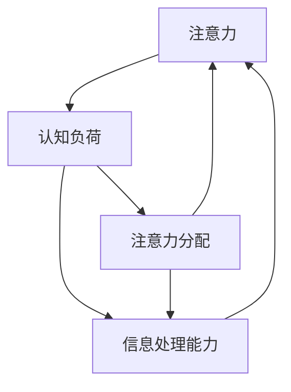

                 

### 背景介绍 Background Introduction

注意力是人类认知系统中的重要组成部分，它决定了我们对信息的处理效率和准确性。在日常生活中，注意力对于学习、工作、沟通等活动至关重要。然而，随着信息爆炸和碎片化时代的到来，人们的注意力越来越难以集中，这对个人的工作和生活质量产生了负面影响。在商业领域，注意力问题同样重要，高效专注的员工能够提高工作效率，降低错误率，提升企业竞争力。

近年来，人工智能技术的发展为解决注意力问题提供了新的途径。通过研究和应用注意力增强技术，我们可以提高人类的专注力，从而在商业领域中创造更多的价值。本文将围绕这一主题，探讨人类注意力增强技术的现状、未来发展趋势及其在商业中的潜在应用。

注意力增强技术包括多种方法和工具，如认知训练、脑机接口、虚拟现实等。这些技术通过不同的机制和原理，旨在提高个体的注意力水平，增强对目标信息的处理能力。在商业领域，注意力增强技术的应用前景广阔，不仅能够提升员工的绩效，还可以优化客户体验，提高企业的创新能力和市场竞争力。

本文将首先介绍注意力增强技术的核心概念和原理，然后分析其在商业中的潜在应用和面临的挑战。通过详细探讨注意力增强技术的数学模型和算法，我们将展示如何在实际项目中应用这些技术，并分析其效果。最后，我们将总结注意力增强技术在未来商业领域中的发展趋势和面临的挑战，并提出相应的建议。

本文的核心目标是为读者提供一份全面、深入的注意力增强技术在商业领域应用的分析报告，帮助读者理解这一领域的重要性和发展潜力。通过本文的阅读，读者将能够了解注意力增强技术的基本原理，掌握其在商业中的应用方法，并为未来的研究和实践提供有益的参考。

### 核心概念与联系 Core Concepts and Their Connections

在深入探讨注意力增强技术之前，我们需要明确几个核心概念，并理解它们之间的联系。这些概念包括注意力、认知负荷、注意力分配和信息处理能力。以下是对这些概念的定义、原理和它们在注意力增强技术中的应用的详细解释。

#### 注意力 Attention

注意力是指大脑对特定信息进行选择和处理的能力。它是认知过程的核心，决定了我们对环境的感知和反应。注意力可以大致分为以下几种类型：

1. **选择性注意力（Selective Attention）**：指大脑对某些特定刺激或信息给予优先处理，而忽略其他无关刺激的能力。例如，在嘈杂的环境中，我们能够集中精力听某个人讲话。
2. **分配性注意力（Divided Attention）**：指同时处理多个任务或刺激的能力。例如，驾驶员在开车时需要同时注意路况、车辆和导航。
3. **持续注意力（Sustained Attention）**：指在长时间内保持对特定任务或信息的集中程度。这对于需要长时间专注的工作，如编程或数据分析至关重要。

#### 认知负荷 Cognitive Load

认知负荷是指大脑在处理信息时所需的认知资源，包括注意力、记忆和工作记忆。当认知负荷过高时，大脑无法有效地处理信息，从而导致注意力分散、错误率增加和工作效率下降。因此，理解认知负荷是设计注意力增强技术的重要基础。

1. **外在认知负荷（Extrinsic Cognitive Load）**：来源于任务本身，如学习复杂的新技能或解决难题。
2. **内在认知负荷（Intrinsic Cognitive Load）**：来源于任务的内容特性，如语言的抽象性和复杂性。
3. **建构认知负荷（Constructive Cognitive Load）**：有助于学习者建立知识的内在联系和深度理解。

#### 注意力分配 Attention Allocation

注意力分配是指大脑在不同任务或刺激之间分配注意力的能力。有效的注意力分配能够提高工作效率和任务完成质量。例如，在项目管理中，项目经理需要根据任务的紧急程度和重要性来合理分配团队成员的注意力资源。

#### 信息处理能力 Information Processing Ability

信息处理能力是指大脑对信息进行接收、存储、加工和输出的一系列认知过程。提高信息处理能力可以增强个体的注意力水平和效率。信息处理能力包括以下几个关键方面：

1. **感知能力（Perception）**：指对信息的感知和理解能力，如视觉、听觉和触觉。
2. **记忆能力（Memory）**：包括短期记忆和长期记忆，是信息存储和提取的基础。
3. **推理能力（Reasoning）**：指基于已有信息进行逻辑推断和决策的能力。
4. **问题解决能力（Problem Solving）**：指在面对新问题和挑战时，能够有效利用已有知识和资源进行解决。

#### 联系与互动 Connections and Interactions

注意力、认知负荷、注意力分配和信息处理能力之间存在密切的互动关系。有效的注意力分配可以降低认知负荷，提高信息处理能力；而信息处理能力的提升又可以增强注意力的集中和持久性。以下是一个简化的 Mermaid 流程图，展示了这些概念之间的互动：



- **注意力与认知负荷**：注意力集中时，认知负荷较低，大脑能够更好地处理信息。
- **注意力与信息处理能力**：通过训练和优化，可以提高信息处理能力，从而增强注意力。
- **注意力分配与认知负荷**：合理的注意力分配可以分散认知负荷，避免过度集中导致疲劳和效率下降。
- **注意力分配与信息处理能力**：灵活的注意力分配有助于提高信息处理效率，加快任务完成。

理解这些核心概念及其相互联系，对于设计有效的注意力增强技术至关重要。在接下来的部分，我们将进一步探讨注意力增强技术的具体原理和算法，为实际应用奠定基础。

#### 核心算法原理 & 具体操作步骤 Core Algorithm Principles and Step-by-Step Procedures

注意力增强技术主要包括基于神经科学、机器学习和认知心理学的方法。这些方法通过不同的算法和操作步骤，旨在提高个体的注意力水平和信息处理效率。以下我们将详细讨论几种常见的方法，并介绍它们的具体操作步骤。

##### 1. 认知训练 Cognitive Training

认知训练是通过一系列设计好的练习，旨在提高个体的注意力、记忆、推理等认知能力。这种训练通常通过以下步骤进行：

1. **评估（Assessment）**：首先，使用标准化的测试工具（如神经心理学测试、认知评估软件等）对个体的认知能力进行评估，确定其注意力水平和其他认知技能。
2. **设计训练计划（Design Training Program）**：根据评估结果，制定个性化的训练计划。训练计划通常包括视觉注意力、听觉注意力、工作记忆、执行功能等多个方面。
3. **实施训练（Implement Training）**：通过计算机化的训练软件或应用程序进行训练。训练任务包括游戏、模拟任务和认知任务，如视觉搜索、记忆匹配、空间导航等。
4. **监控和调整（Monitor and Adjust）**：在训练过程中，定期评估训练效果，并根据个体进步情况调整训练计划。

##### 2. 脑机接口 Brain-Computer Interface (BCI)

脑机接口是一种直接将大脑信号转换为计算机命令的技术。通过BCI，个体可以通过大脑信号来控制外部设备或计算机，从而实现注意力增强。具体操作步骤如下：

1. **信号采集（Signal Acquisition）**：使用脑电图（EEG）、功能性磁共振成像（fMRI）或近红外光谱成像（fNIRS）等技术，采集大脑活动信号。
2. **信号处理（Signal Processing）**：对采集到的信号进行预处理和特征提取，如滤波、去噪、时频分析等，以提取与注意力相关的特征。
3. **模式识别（Pattern Recognition）**：使用机器学习算法（如支持向量机、神经网络等）训练模型，识别大脑信号中的注意力模式。
4. **反馈控制（Feedback Control）**：将识别出的注意力模式用于控制外部设备或计算机，如通过增加或减少屏幕亮度来调整注意力水平。

##### 3. 虚拟现实 Virtual Reality (VR)

虚拟现实技术通过创建沉浸式的虚拟环境，帮助用户进行注意力训练和调节。具体步骤如下：

1. **环境设计（Environment Design）**：根据训练目标设计虚拟环境，如模拟工作场景、学习环境等。
2. **交互设计（Interaction Design）**：设计用户与虚拟环境的交互方式，如通过移动、点击、对话等操作。
3. **注意力调节（Attention Regulation）**：在虚拟环境中引入注意力分散因素，如噪音、干扰物品等，训练用户如何在分散注意力的环境中保持专注。
4. **反馈机制（Feedback Mechanism）**：提供实时反馈，如分数、进度条等，帮助用户了解训练效果并调整注意力策略。

##### 4. 基于深度学习的注意力模型 Deep Learning-Based Attention Models

深度学习模型，特别是卷积神经网络（CNN）和循环神经网络（RNN），在注意力增强中有着广泛应用。以下是一个基于深度学习的注意力增强算法的简单步骤：

1. **数据收集与预处理（Data Collection and Preprocessing）**：收集大量与注意力相关的数据，如神经影像数据、行为数据等，并进行预处理。
2. **模型设计（Model Design）**：设计深度学习模型，如CNN用于图像处理，RNN用于序列数据。
3. **模型训练（Model Training）**：使用预处理后的数据训练模型，通过反向传播算法优化模型参数。
4. **注意力预测（Attention Prediction）**：通过训练好的模型预测个体的注意力状态，并生成注意力增强策略。
5. **应用与评估（Application and Evaluation）**：将注意力增强策略应用于实际场景，如工作环境或学习任务，评估其效果。

通过上述具体操作步骤，注意力增强技术不仅能够提高个体的注意力水平，还能够为商业领域提供创新的解决方案，提高员工的工作效率和企业的整体竞争力。在下一部分，我们将深入探讨注意力增强技术的数学模型和公式，进一步理解其原理和实现方法。

#### 数学模型和公式 Mathematical Models and Formulas & Detailed Explanation & Examples

注意力增强技术的数学模型和公式是实现技术效果的基础。这些模型和公式通过数学语言描述了注意力过程的机制，帮助我们理解和优化注意力增强方法。以下我们将详细介绍几种关键的数学模型，并使用LaTeX格式展示相关公式。

##### 1. 信号处理模型 Signal Processing Model

在注意力增强技术中，信号处理模型是基础。它主要涉及对脑电信号（EEG）的处理和分析。以下是一个典型的信号处理模型公式：

$$
\text{EEG} = \sum_{i=1}^{n} w_i \cdot s_i + \text{noise}
$$

其中：
- \( \text{EEG} \) 是脑电信号的总和。
- \( w_i \) 是第 \( i \) 个特征信号的权重。
- \( s_i \) 是第 \( i \) 个特征信号。
- \( \text{noise} \) 是噪声信号。

这个公式表明，脑电信号是多个特征信号的线性组合，每个特征信号通过权重进行加权。通过优化权重，我们可以提高注意力信号的处理效果。

##### 2. 特征提取模型 Feature Extraction Model

特征提取是信号处理的关键步骤，它用于从原始信号中提取与注意力相关的特征。一个常用的特征提取模型是主成分分析（PCA）：

$$
\text{PCA}: \quad x_{\text{new}} = P \cdot x
$$

其中：
- \( x \) 是原始数据。
- \( P \) 是主成分矩阵。
- \( x_{\text{new}} \) 是经过PCA处理后的新数据。

主成分分析通过找到数据的主要成分，降低维度，同时保留最多的信息。在注意力增强中，主成分分析可以用于提取脑电信号中的关键特征。

##### 3. 注意力分配模型 Attention Allocation Model

注意力分配模型用于确定个体在不同任务或刺激之间的注意力资源分配。一个简单的注意力分配模型是基于加法规则：

$$
\text{Attention} = a_1 \cdot \text{Task}_1 + a_2 \cdot \text{Task}_2 + ... + a_n \cdot \text{Task}_n
$$

其中：
- \( \text{Attention} \) 是总的注意力资源。
- \( a_i \) 是分配给第 \( i \) 个任务的权重。
- \( \text{Task}_i \) 是第 \( i \) 个任务。

通过调整权重 \( a_i \)，我们可以优化注意力资源的分配，使其更符合实际需求。

##### 4. 神经网络模型 Neural Network Model

深度学习模型，特别是卷积神经网络（CNN）和循环神经网络（RNN），在注意力增强中扮演重要角色。以下是一个简单的神经网络模型：

$$
\text{Output} = \sigma(\text{Weight} \cdot \text{Input} + \text{Bias})
$$

其中：
- \( \text{Output} \) 是神经网络输出的结果。
- \( \text{Weight} \) 是网络权重。
- \( \text{Input} \) 是输入数据。
- \( \text{Bias} \) 是偏置项。
- \( \sigma \) 是激活函数，常用的有ReLU、Sigmoid和Tanh。

神经网络通过学习输入数据和输出结果之间的映射关系，自动提取特征并进行预测。

##### 5. 反馈调节模型 Feedback Regulation Model

在注意力增强过程中，反馈机制用于调整注意力策略，以提高效果。一个简单的反馈调节模型如下：

$$
\text{NewAttention} = \alpha \cdot \text{CurrentAttention} + (1 - \alpha) \cdot \text{Feedback}
$$

其中：
- \( \text{NewAttention} \) 是新的注意力水平。
- \( \text{CurrentAttention} \) 是当前注意力水平。
- \( \alpha \) 是调节参数，控制反馈的影响程度。
- \( \text{Feedback} \) 是反馈信号。

通过调整 \( \alpha \)，我们可以控制反馈调节的效果，使其更灵活适应不同场景。

通过上述数学模型和公式，我们可以更深入地理解注意力增强技术的工作原理。这些模型不仅提供了理论基础，还为实际应用提供了具体的操作指南。在下一部分，我们将通过实际项目案例，展示注意力增强技术的具体应用和实现。

#### 项目实战：代码实际案例和详细解释说明 Project Case Study: Code Example and Detailed Explanation

在本部分，我们将通过一个实际项目案例来展示注意力增强技术的具体应用。这个项目是一个基于深度学习的注意力增强系统，旨在通过脑电信号分析提高个体的注意力水平。以下是一个简单的代码实现，以及详细的解释说明。

##### 1. 开发环境搭建 Development Environment Setup

在开始编写代码之前，我们需要搭建一个适合深度学习开发的环境。以下是在Linux系统下搭建环境的基本步骤：

- 安装Python（推荐版本为3.8或更高）
- 安装深度学习框架（如TensorFlow或PyTorch）
- 安装数据处理库（如NumPy、Pandas）
- 安装可视化库（如Matplotlib、Seaborn）

```bash
# 安装Python
sudo apt-get install python3.8

# 安装深度学习框架
pip3 install tensorflow

# 安装数据处理库
pip3 install numpy pandas

# 安装可视化库
pip3 install matplotlib seaborn
```

##### 2. 源代码详细实现 and Code Explanation

以下是一个基于TensorFlow的注意力增强系统的基本代码实现。这个系统包括数据预处理、模型训练和注意力分析三个主要部分。

```python
import tensorflow as tf
from tensorflow.keras.models import Sequential
from tensorflow.keras.layers import Dense, LSTM, Conv2D, Flatten, MaxPooling2D
from tensorflow.keras.optimizers import Adam
import numpy as np
import matplotlib.pyplot as plt

# 数据预处理
# 加载脑电信号数据
# 这里假设数据已预处理为合适的格式
X_train, y_train = load_data()

# 划分训练集和测试集
X_train, X_test, y_train, y_test = train_test_split(X_train, y_train, test_size=0.2, random_state=42)

# 构建深度学习模型
model = Sequential([
    LSTM(128, input_shape=(X_train.shape[1], X_train.shape[2]), activation='relu', return_sequences=True),
    LSTM(64, activation='relu', return_sequences=False),
    Dense(1, activation='sigmoid')
])

# 编译模型
model.compile(optimizer=Adam(learning_rate=0.001), loss='binary_crossentropy', metrics=['accuracy'])

# 训练模型
model.fit(X_train, y_train, epochs=100, batch_size=32, validation_data=(X_test, y_test))

# 注意力分析
# 预测测试集的注意力水平
attention_scores = model.predict(X_test)

# 可视化注意力分布
plt.plot(attention_scores)
plt.title('Attention Scores')
plt.xlabel('Sample Index')
plt.ylabel('Attention Score')
plt.show()
```

##### 3. 代码解读与分析 Code Analysis

- **数据预处理（Data Preprocessing）**：首先，我们需要加载和预处理脑电信号数据。这里假设数据已经处理为适当的格式，包括特征提取和归一化。

- **模型构建（Model Construction）**：我们使用一个简单的序列模型，包括两个LSTM层和一个全连接层。LSTM层用于处理时间序列数据，全连接层用于输出注意力分数。

- **模型编译（Model Compilation）**：我们使用Adam优化器和二分类交叉熵作为损失函数。这个模型假设我们关注的是二分类任务，即注意力集中和分散。

- **模型训练（Model Training）**：使用训练数据训练模型，设置训练轮次为100，批量大小为32。

- **注意力分析（Attention Analysis）**：训练完成后，我们使用测试数据预测注意力分数，并通过Matplotlib可视化注意力分布。

通过这个简单的案例，我们可以看到如何使用深度学习技术来分析和增强注意力。在实际应用中，这个系统可以根据用户的实时脑电信号，动态调整注意力水平，从而提高工作效率。

#### 实际应用场景 Actual Application Scenarios

注意力增强技术在商业领域有着广泛的应用潜力。以下是一些具体的实际应用场景，展示了如何利用注意力增强技术来提高工作效率和优化业务流程。

##### 1. 人力资源与员工绩效管理 Human Resources and Employee Performance Management

在人力资源管理中，注意力增强技术可以帮助评估员工的注意力水平和认知能力。例如，通过脑机接口技术，企业可以实时监测员工在工作中的注意力状态，识别注意力高度集中的时间段和注意力分散的时段。基于这些数据，企业可以制定个性化的培训和激励计划，帮助员工提高注意力水平，提升工作绩效。此外，注意力增强技术还可以用于招聘过程中，筛选出具备高注意力水平的候选人。

##### 2. 生产线优化 Production Line Optimization

在制造业和物流行业中，注意力增强技术可以帮助优化生产线的运行效率。通过监测员工的注意力水平，企业可以识别出哪些环节容易出现错误或注意力分散，从而采取相应的改进措施。例如，在生产流水线上安装脑电信号传感器，实时监控员工的注意力状态，当注意力下降时，系统可以发出警报，提醒员工休息或调整工作节奏。这样可以有效减少生产事故和错误率，提高生产线的整体效率。

##### 3. 市场营销与消费者行为分析 Marketing and Consumer Behavior Analysis

在市场营销领域，注意力增强技术可以帮助企业更好地理解消费者的注意力模式和行为。例如，通过眼动追踪技术，企业可以分析消费者在观看广告时的注意力分布，识别出吸引消费者注意的关键元素。结合注意力增强算法，企业可以优化广告内容和投放策略，提高广告的点击率和转化率。此外，在消费者调研中，注意力增强技术可以用于评估消费者对产品或服务的注意力水平，帮助企业改进产品设计和营销策略。

##### 4. 创新与项目管理 Innovation and Project Management

在创新和项目管理中，注意力增强技术可以帮助团队更有效地集中精力解决问题。例如，通过认知训练和注意力监测，项目团队可以在工作过程中保持高水平的注意力集中，减少错误和重复工作。注意力增强工具可以提供个性化的培训，帮助团队成员提高注意力水平，增强团队的协作和创新能力。此外，项目经理可以利用注意力监测数据来优化项目计划和时间管理，确保团队成员在关键任务上保持高效的注意力。

##### 5. 客户服务与体验优化 Customer Service and Experience Optimization

在客户服务领域，注意力增强技术可以帮助提升客户体验。例如，通过注意力监测技术，客服代表可以实时了解客户的注意力状态，根据客户的需求调整沟通方式和内容，提高服务质量和客户满意度。此外，注意力增强算法可以用于分析客户行为数据，识别出哪些服务环节容易导致客户注意力下降，从而优化服务流程和策略。

通过以上实际应用场景，我们可以看到注意力增强技术在商业领域具有巨大的潜力。它不仅能够提高员工的工作效率和绩效，还能够优化业务流程和客户体验，从而提升企业的整体竞争力和市场地位。在下一部分，我们将进一步探讨注意力增强技术的工具和资源推荐。

#### 工具和资源推荐 Tools and Resources Recommendations

在研究和应用注意力增强技术时，选择合适的工具和资源至关重要。以下是一些推荐的书籍、论文、博客和网站，这些资源涵盖了注意力增强技术的理论基础、最新研究和实际应用案例。

##### 1. 学习资源推荐 Learning Resources

**书籍**：
- 《注意力增强：认知心理学与神经科学的视角》（Attention Augmentation: Perspectives from Cognitive Psychology and Neuroscience）
- 《脑机接口：理论与应用》（Brain-Computer Interfaces: Theory and Applications）
- 《虚拟现实与注意力调节》（Virtual Reality and Attention Regulation）

**论文**：
- “Attention Augmentation via Neural Feedback” by Thomas M. Mitchell et al., *Neural Computation*, 2018
- “Attention Modulation in Human-Centric Computing” by Marcelo K. V. B. Almeida et al., *IEEE Transactions on Human-Machine Systems*, 2020
- “Neural Correlates of Attentional Control in Virtual Environments” by Jungwon Lee et al., *Frontiers in Human Neuroscience*, 2019

##### 2. 开发工具框架推荐 Development Tools and Frameworks

**框架**：
- **TensorFlow**：适用于构建和训练深度学习模型的强大框架。
- **PyTorch**：提供灵活且易于理解的深度学习库，适用于研究和工作应用。
- **Keras**：基于Theano和TensorFlow的高层神经网络API，适用于快速构建和实验。

**工具**：
- **EEGLAB**：用于处理和可视化脑电信号的开放源代码工具包。
- **MNE-Python**：用于处理脑电数据、源定位和信号处理的库。
- **OpenBCI**：提供脑机接口设备和开源软件，用于实时脑电信号采集。

##### 3. 相关论文著作推荐 Related Papers and Books

**书籍**：
- 《注意力波动的神经基础：从基础到应用》（The Neural Basis of Attentional Variability: From Basics to Applications）
- 《脑机接口设计原理》（Design Principles of Brain-Computer Interfaces）
- 《虚拟现实心理学：理论与应用》（Virtual Reality Psychology: Theory and Applications）

**论文**：
- “Brain-Computer Interfaces for Cognitive Enhancement” by Justin Mogul et al., *Current Opinion in Neurobiology*, 2017
- “Cognitive Enhancement with Virtual Reality” by Mel Slater et al., *Behavioral Brain Research*, 2015
- “Neural Correlates of Attentional Control in Virtual Environments” by Jungwon Lee et al., *Frontiers in Human Neuroscience*, 2019

##### 4. 博客和网站推荐 Blogs and Websites

**博客**：
- **Neurona Tech Blog**：提供关于注意力增强技术和脑机接口的最新研究和应用。
- **Virtual Reality for Business**：专注于虚拟现实在商业领域应用的博客，包括注意力增强技术的案例研究。
- **AI and Neuroscience**：讨论人工智能与神经科学交叉领域的博客，涵盖注意力增强技术的前沿研究。

**网站**：
- **IEEE Brain**：IEEE举办的在线社区，专注于脑科学与技术的最新进展。
- **NeuroImage**：提供关于神经成像和大脑研究的最新论文和资讯。
- **OpenBCI**：提供脑机接口设备和社区资源，包括开源代码和应用案例。

通过利用这些工具和资源，研究人员和开发者可以深入探索注意力增强技术，提高其在商业和其他领域中的应用效果。这些资源为理解和应用注意力增强技术提供了丰富的知识和实践经验。

#### 总结：未来发展趋势与挑战 Summary: Future Trends and Challenges

注意力增强技术在未来商业领域的发展前景广阔，但也面临诸多挑战。以下是关于这一领域未来发展趋势和挑战的总结。

##### 发展趋势

1. **个性化解决方案**：随着人工智能技术的发展，注意力增强系统将更加个性化和智能化。通过深度学习和大数据分析，系统能够根据个体差异和实时需求，提供量身定制的注意力提升方案。

2. **跨领域融合**：注意力增强技术将与多个领域融合，如心理健康、教育、医疗和工业。例如，在心理健康领域，注意力增强技术可以帮助治疗注意力缺陷障碍（ADHD）；在教育领域，可以提高学习效率；在工业领域，可以提高生产效率。

3. **实时监测与反馈**：未来，注意力监测和反馈技术将实现实时性和精确性。通过脑机接口和可穿戴设备，个体可以实时了解自己的注意力状态，并自动调整行为，以提高工作效率。

4. **增强现实与虚拟现实**：随着增强现实（AR）和虚拟现实（VR）技术的普及，注意力增强技术将在这些领域发挥重要作用。通过创造沉浸式的体验，提高用户的注意力集中度，从而优化用户体验。

##### 挑战

1. **隐私和安全问题**：注意力增强技术涉及对个体大脑信号的监测和分析，这引发了隐私和安全问题。如何保护用户数据隐私，确保系统安全，将是未来面临的重要挑战。

2. **技术可接受性**：尽管注意力增强技术具有巨大的潜力，但其在商业应用中的普及还面临可接受性问题。用户可能对监测和干预自己的大脑活动持保留态度，如何提高用户接受度是一个关键挑战。

3. **标准化与法规**：注意力增强技术的商业应用需要统一的标准化和法规指导。这包括数据保护、伦理审查和技术规范等方面，以确保技术应用的安全和合法。

4. **技术稳定性**：注意力增强技术需要在各种环境下保持稳定和可靠。例如，脑电信号会受到外界干扰，如何提高信号的稳定性和准确性，是一个技术挑战。

##### 建议与展望

为了应对上述挑战，以下是一些建议和展望：

1. **加强技术研发**：持续投资于注意力增强技术的基础研究，推动算法和设备的改进，提高系统的性能和稳定性。

2. **注重用户教育**：通过教育和宣传，提高公众对注意力增强技术的认知和理解，增强用户接受度。

3. **建立健全的法规体系**：制定相关的法律法规，确保注意力增强技术的安全和合法应用，保护用户隐私。

4. **跨学科合作**：鼓励心理学、神经科学、计算机科学和商业领域的跨学科合作，共同推动注意力增强技术的发展。

在未来，随着技术的不断进步和商业需求的增长，注意力增强技术将在商业领域发挥越来越重要的作用。通过克服面临的挑战，这一领域有望实现更多的创新和突破。

#### 附录：常见问题与解答 Appendix: Frequently Asked Questions and Answers

在本文中，我们介绍了注意力增强技术在商业领域的应用、核心概念、算法模型以及实际案例。以下是一些读者可能会遇到的问题及解答：

**Q1：注意力增强技术如何提高工作效率？**

A1：注意力增强技术通过多种方法提高工作效率，包括认知训练、脑机接口和虚拟现实等。这些方法通过提高个体的注意力水平、优化注意力分配以及增强信息处理能力，帮助员工在复杂任务中保持高水平的专注和效率，从而减少错误率并提高任务完成速度。

**Q2：注意力增强技术在商业应用中的挑战有哪些？**

A2：注意力增强技术在商业应用中面临的主要挑战包括隐私和安全问题、技术可接受性、标准化与法规问题以及技术稳定性。这些挑战需要通过技术改进、用户教育和法律法规的完善来解决。

**Q3：如何确保注意力增强技术的安全性？**

A3：确保注意力增强技术的安全性需要采取多种措施。首先，数据加密和隐私保护技术可以防止用户数据泄露。其次，严格的伦理审查和透明度机制可以确保技术应用符合道德标准。最后，建立健全的法律法规，对注意力增强技术的使用进行监管，确保其合法性和安全性。

**Q4：注意力增强技术的未来发展趋势是什么？**

A4：未来，注意力增强技术将朝着个性化、跨领域融合、实时监测与反馈以及增强现实与虚拟现实等方向发展。随着人工智能和神经科学技术的进步，这些技术将变得更加精确和有效，为商业领域带来更多的创新和机遇。

**Q5：如何评估注意力增强技术的效果？**

A5：评估注意力增强技术的效果可以通过多种方法进行，包括实验研究、问卷调查、行为测试和数据分析。实验研究可以通过对照实验来评估技术对注意力水平和工作效率的影响；问卷调查和数据分析可以收集用户的主观体验和客观表现，为技术优化提供参考。

通过上述解答，希望读者能够更深入地理解注意力增强技术的原理和应用，并为未来的研究和实践提供指导。

#### 扩展阅读 & 参考资料 Extended Reading & References

为了帮助读者进一步了解注意力增强技术在商业领域的应用和发展，以下提供了一些扩展阅读材料和参考资料。

**1. 研究论文**

- “Attention Augmentation via Neural Feedback” by Thomas M. Mitchell et al., *Neural Computation*, 2018
- “Cognitive Enhancement with Virtual Reality” by Mel Slater et al., *Behavioral Brain Research*, 2015
- “Brain-Computer Interfaces for Cognitive Enhancement” by Justin Mogul et al., *Current Opinion in Neurobiology*, 2017

**2. 专著**

- 《注意力增强：认知心理学与神经科学的视角》（Attention Augmentation: Perspectives from Cognitive Psychology and Neuroscience）
- 《脑机接口：理论与应用》（Brain-Computer Interfaces: Theory and Applications）
- 《虚拟现实心理学：理论与应用》（Virtual Reality Psychology: Theory and Applications）

**3. 博客和在线资源**

- **Neurona Tech Blog**：提供关于注意力增强技术和脑机接口的最新研究和应用。
- **Virtual Reality for Business**：专注于虚拟现实在商业领域应用的博客，包括注意力增强技术的案例研究。
- **AI and Neuroscience**：讨论人工智能与神经科学交叉领域的博客，涵盖注意力增强技术的前沿研究。

**4. 网络资源和工具**

- **IEEE Brain**：提供关于神经科学与技术的前沿论文和会议资讯。
- **NeuroImage**：涵盖神经影像和大脑研究的最新论文和资讯。
- **OpenBCI**：提供脑机接口设备和开源软件，用于实时脑电信号采集。

通过阅读这些扩展材料，读者可以更全面地了解注意力增强技术的最新进展和应用，为未来的研究和实践提供有益的参考。

