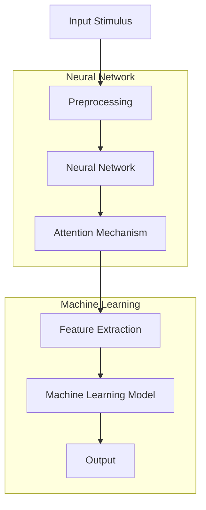
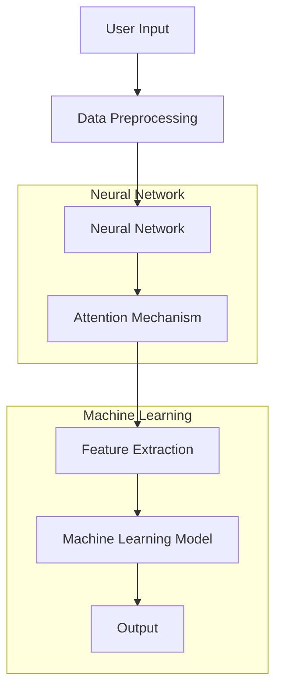

                 

### 1. 背景介绍

在当今快节奏、信息爆炸的时代，人们面临着前所未有的注意力挑战。无论是学习新知识、工作还是日常生活中的琐事，我们的注意力资源变得愈发稀缺。然而，注意力是人类认知过程中至关重要的一环，它决定了我们的学习效率、信息处理能力和知识保留能力。如何有效地增强人类的注意力，已经成为一个备受关注的研究课题。

注意力增强技术的发展有着悠久的历史。早在20世纪，心理学家就开始探索如何通过心理训练和认知行为疗法来改善注意力。近年来，随着人工智能、神经科学和计算机技术的迅猛发展，注意力增强技术也取得了显著进展。例如，通过脑机接口（Brain-Computer Interface, BCI）技术，研究人员可以直接对大脑活动进行监测和干预，从而改善注意力。同时，基于机器学习的算法也被应用于分析和预测个体的注意力状态，进而提供个性化的注意力提升方案。

本文旨在探讨注意力增强技术的基本原理、核心算法、数学模型及其在实际应用中的效果。通过对这些技术的深入分析，我们希望能够为读者提供全面而系统的了解，从而为未来的研究和应用提供有益的参考。具体而言，本文将分为以下几个部分：

1. 背景介绍：简要概述注意力增强技术的历史和发展现状。
2. 核心概念与联系：介绍注意力增强技术的核心概念，并使用Mermaid流程图展示其架构。
3. 核心算法原理与具体操作步骤：详细讲解用于注意力增强的主要算法，包括其原理和实现方法。
4. 数学模型和公式：介绍注意力增强中涉及的数学模型，并给出详细的公式和举例说明。
5. 项目实战：通过代码实际案例展示注意力增强技术的应用，并提供详细解释说明。
6. 实际应用场景：讨论注意力增强技术在不同领域的应用场景和效果。
7. 工具和资源推荐：推荐相关学习资源、开发工具和论文著作。
8. 总结：总结注意力增强技术的发展趋势和未来挑战。
9. 附录：常见问题与解答。
10. 扩展阅读与参考资料：提供进一步阅读的建议和参考文献。

通过以上结构的梳理，我们可以更系统地理解注意力增强技术的各个方面，为后续内容打下坚实的基础。在接下来的章节中，我们将一步步深入探讨这一领域的前沿研究和技术进展。  

---

# Human Attention Augmentation: Enhancing Learning Efficiency and Knowledge Retention

> Keywords: Attention Augmentation, Cognitive Science, Machine Learning, Neural Networks, Brain-Computer Interface

> Abstract: In today's fast-paced, information-rich environment, attention has become a critical resource. This article explores the principles, algorithms, and mathematical models underlying attention augmentation technologies, with a focus on enhancing human learning efficiency and knowledge retention. Through a comprehensive analysis, the article aims to provide readers with a systematic understanding of attention augmentation, offering insights into its current applications and potential future developments.

## 1. Background

Attention, as a core component of human cognition, plays a pivotal role in information processing, learning, and memory formation. In an era characterized by information overload and rapid change, the effective management of attention has become increasingly crucial. This has led to a surge of research and development in attention augmentation technologies aimed at improving human learning efficiency and knowledge retention.

The history of attention enhancement technologies dates back to the early 20th century when psychologists began to explore methods to improve attention through psychological training and cognitive behavioral therapy. In recent years, significant advancements have been made, particularly with the emergence of artificial intelligence, neuroscience, and computer technology. For instance, Brain-Computer Interface (BCI) technologies allow researchers to monitor and intervene directly in brain activity, thereby enhancing attention. Furthermore, machine learning algorithms have been applied to analyze and predict individual attention states, providing personalized solutions for attention improvement.

This article aims to provide a comprehensive exploration of attention augmentation technologies, including their basic principles, core algorithms, and mathematical models. The structure of the article is as follows:

1. **Background**: A brief overview of the history and development of attention augmentation technologies.
2. **Core Concepts and Connections**: An introduction to the core concepts in attention augmentation, accompanied by a Mermaid flowchart illustrating the architecture.
3. **Core Algorithm Principles and Operational Steps**: A detailed explanation of the main algorithms used for attention enhancement, including their principles and implementation methods.
4. **Mathematical Models and Formulas**: An introduction to the mathematical models involved in attention enhancement, along with detailed formulas and illustrative examples.
5. **Project Practice**: Case studies demonstrating the application of attention augmentation technologies through code examples, with detailed explanations.
6. **Actual Application Scenarios**: A discussion of the various fields where attention augmentation technologies are applied and their effectiveness.
7. **Tools and Resource Recommendations**: Recommendations for learning resources, development tools, and relevant publications.
8. **Summary**: A summary of the development trends and future challenges of attention augmentation technologies.
9. **Appendix**: Common questions and answers.
10. **Further Reading and References**: Suggestions for further reading and a list of references.

By following this structured approach, readers can gain a thorough understanding of attention augmentation technologies, providing a solid foundation for further research and application. In the following sections, we will delve into the cutting-edge research and technological advancements in this field.

---

## 2. Core Concepts and Connections

### 2.1 Basic Concepts

Attention augmentation technologies are built upon several foundational concepts, including cognitive psychology, neural networks, and machine learning. These concepts provide the theoretical underpinnings for understanding how attention works and how it can be enhanced.

#### Cognitive Psychology

Cognitive psychology is the study of the mind and its processes, including perception, memory, thinking, and consciousness. In the context of attention, cognitive psychology helps us understand how the brain allocates its limited cognitive resources to process information. Attention is essentially a selective process that determines which stimuli receive cognitive processing while others are ignored. Theoretical models such as the Selective Attention Model (SAM) and the Attenuation Model (AM) provide insights into how attention is directed and controlled.

#### Neural Networks

Neural networks are a type of machine learning model inspired by the structure and function of the human brain. They consist of interconnected artificial neurons (or nodes) that process and transmit information. In the context of attention augmentation, neural networks can be used to model and predict attentional processes. Convolutional Neural Networks (CNNs) and Recurrent Neural Networks (RNNs) are particularly useful for analyzing temporal and spatial information, which are crucial for understanding attention.

#### Machine Learning

Machine learning is a subset of artificial intelligence that enables computers to learn from data and make predictions or decisions without being explicitly programmed. Attention augmentation technologies heavily rely on machine learning algorithms to analyze large datasets, identify patterns, and provide personalized attention enhancement solutions. Techniques such as supervised learning, unsupervised learning, and reinforcement learning are commonly used in the development of attention augmentation systems.

### 2.2 Architectural Connections

The integration of cognitive psychology, neural networks, and machine learning forms the core architecture of attention augmentation technologies. The following Mermaid flowchart illustrates the key components and connections:



#### Input Stimulus

The input stimulus refers to the information that the system needs to process. This can be in various forms, such as text, images, or audio. The preprocessing step is crucial for preparing the input data for further processing. It involves tasks such as data cleaning, normalization, and feature extraction.

#### Neural Network

The neural network processes the preprocessed data and applies various transformations to extract relevant features. The attention mechanism is an integral part of the neural network, allowing the system to focus on important information while ignoring irrelevant details.

#### Attention Mechanism

The attention mechanism is a key component that determines which parts of the input data receive more processing attention. It helps the neural network to prioritize important information, thereby improving the overall efficiency of the system.

#### Feature Extraction

Feature extraction involves transforming the processed data into a format that can be easily analyzed by the machine learning model. This step is crucial for capturing the most important information from the input data.

#### Machine Learning Model

The machine learning model analyzes the extracted features and learns to make predictions or decisions based on the input data. This model is trained using large datasets and can be fine-tuned to improve its performance.

#### Output

The output of the system is the result of the machine learning model's analysis. This can be in the form of recommendations, predictions, or other types of information that help enhance attention.

### 2.3 Key Relationships

The relationship between cognitive psychology, neural networks, and machine learning can be summarized as follows:

- Cognitive psychology provides the theoretical foundation for understanding attention and its role in information processing.
- Neural networks offer a computational framework for modeling and simulating attentional processes.
- Machine learning algorithms enable the development of practical systems that can analyze and predict attentional states.

By integrating these three areas, attention augmentation technologies can be designed to improve human learning efficiency and knowledge retention. In the next section, we will delve deeper into the core algorithms and operational steps involved in attention enhancement.

---

## 2. Core Concepts and Connections

### 2.1 Basic Concepts

**Attention as a Cognitive Process**

Attention is a fundamental cognitive process that enables humans to selectively focus on certain aspects of their environment while ignoring others. It is essential for efficiently processing information and performing tasks that require cognitive resources. In cognitive psychology, attention is often described as a limited-capacity resource that can be allocated to different tasks or stimuli based on their relevance and importance.

**The Role of Attention in Learning**

Attention plays a crucial role in learning and knowledge retention. When individuals are attentive, they are more likely to absorb new information, process it effectively, and retain it over time. Conversely, a lack of attention can lead to poor learning outcomes, as important information may be overlooked or misunderstood. Therefore, enhancing attention is a key strategy for improving learning efficiency and knowledge retention.

**Attention Mechanisms in Neural Networks**

Attention mechanisms are integral to modern neural network architectures, particularly in deep learning models. These mechanisms allow the network to focus on relevant parts of the input data, improving the model's ability to capture important patterns and relationships. There are several types of attention mechanisms, including:

- **Sigmoid Attention**: This mechanism uses a sigmoid function to compute attention weights, which are then applied to the input data to emphasize relevant information.
- **Additive Attention**: In this mechanism, attention weights are added to the input data, allowing the network to focus on different parts of the data simultaneously.
- **Convolutional Attention**: This mechanism uses convolutional operations to compute attention weights, making it suitable for spatial data such as images.

**Machine Learning in Attention Enhancement**

Machine learning algorithms are at the heart of attention enhancement technologies. By analyzing large datasets, machine learning models can identify patterns and relationships that are relevant to attention. Some key techniques include:

- **Supervised Learning**: In supervised learning, models are trained using labeled data, allowing them to predict attentional states based on past observations.
- **Unsupervised Learning**: Unsupervised learning techniques, such as clustering and dimensionality reduction, can be used to identify groups of similar data points and infer attentional patterns.
- **Reinforcement Learning**: Reinforcement learning algorithms can be used to optimize attention mechanisms by learning to maximize a reward signal based on the outcomes of different attention strategies.

### 2.2 Architectural Connections

**Figure 1: Attention Augmentation Architecture**



**Data Preprocessing**

The first step in the attention augmentation process is data preprocessing. This involves cleaning and formatting the input data to make it suitable for processing by the neural network. Preprocessing tasks may include data normalization, feature scaling, and data augmentation.

**Neural Network**

The neural network is the core component of the attention augmentation system. It processes the preprocessed data and applies various transformations to extract relevant features. The attention mechanism is integrated into the neural network to focus on important information while ignoring irrelevant details.

**Attention Mechanism**

The attention mechanism is a key component of the neural network that allows it to selectively focus on relevant parts of the input data. There are several types of attention mechanisms, including:

- **Sigmoid Attention**: This mechanism uses a sigmoid function to compute attention weights, which are then applied to the input data to emphasize relevant information.
- **Additive Attention**: In this mechanism, attention weights are added to the input data, allowing the network to focus on different parts of the data simultaneously.
- **Convolutional Attention**: This mechanism uses convolutional operations to compute attention weights, making it suitable for spatial data such as images.

**Feature Extraction**

Feature extraction involves transforming the processed data into a format that can be easily analyzed by the machine learning model. This step is crucial for capturing the most important information from the input data.

**Machine Learning Model**

The machine learning model analyzes the extracted features and learns to make predictions or decisions based on the input data. This model is trained using large datasets and can be fine-tuned to improve its performance.

**Output**

The output of the attention augmentation system is the result of the machine learning model's analysis. This can be in the form of recommendations, predictions, or other types of information that help enhance attention.

### 2.3 Key Relationships

The relationship between the basic concepts of attention, neural networks, and machine learning can be summarized as follows:

- **Attention in Cognitive Psychology**: Cognitive psychology provides a theoretical framework for understanding how attention works and its role in learning and information processing.
- **Neural Networks and Attention**: Neural networks offer a computational model for simulating attentional processes and enhancing their efficiency.
- **Machine Learning and Attention**: Machine learning algorithms enable the development of practical systems that can analyze and predict attentional states, providing personalized attention enhancement solutions.

By integrating these three areas, attention augmentation technologies can be designed to improve human learning efficiency and knowledge retention. In the next section, we will explore the core algorithms and operational steps involved in attention enhancement.

---

## 3. Core Algorithm Principles and Operational Steps

### 3.1 Overview of Core Algorithms

Attention augmentation technologies leverage a variety of core algorithms to enhance human attention. These algorithms are designed to identify, predict, and optimize attentional processes. The following are some of the key algorithms commonly used in attention augmentation:

#### 1. Selective Attention Algorithm

The Selective Attention Algorithm (SAM) is one of the most fundamental models in attention augmentation. It operates by focusing on a specific part of the input while ignoring others. The SAM is often used in image processing tasks, where it helps in highlighting relevant regions of interest.

**Principles:**
- The algorithm assigns weights to different parts of the input based on their importance.
- A selective filter is applied to emphasize the regions with higher weights.

**Operational Steps:**
1. Input the image data.
2. Compute the spatial frequency content of the image.
3. Determine the importance of each pixel based on the spatial frequency content.
4. Apply a filter to enhance the pixels with higher importance.

#### 2. Auditory Attention Algorithm

Auditory Attention Algorithm focuses on identifying and prioritizing relevant auditory stimuli in a noisy environment. This algorithm is particularly useful for enhancing listening skills and improving speech recognition.

**Principles:**
- The algorithm analyzes the auditory signals to identify relevant sounds.
- It adjusts the sensitivity of the auditory system to prioritize relevant stimuli.

**Operational Steps:**
1. Input the auditory signal.
2. Preprocess the signal to remove noise.
3. Identify the frequency components of the signal.
4. Determine the relevance of each frequency component.
5. Adjust the auditory system's sensitivity to prioritize relevant frequencies.

#### 3. Sigmoid Attention Mechanism

The Sigmoid Attention Mechanism is a type of attention mechanism used in neural networks. It applies a sigmoid function to the input data to generate attention weights, which are then used to modify the data processing flow.

**Principles:**
- The sigmoid function maps the input data to a range between 0 and 1.
- Higher values indicate higher attention weights, emphasizing the relevant parts of the data.

**Operational Steps:**
1. Input the data.
2. Apply a sigmoid function to generate attention weights.
3. Modify the data processing flow based on the attention weights.

#### 4. Additive Attention Mechanism

The Additive Attention Mechanism is another type of attention mechanism used in neural networks. It adds the attention weights to the input data, allowing the network to focus on different parts of the data simultaneously.

**Principles:**
- The attention weights are added to the input data, enhancing the importance of the relevant parts.

**Operational Steps:**
1. Input the data.
2. Compute the attention weights.
3. Add the attention weights to the input data.

#### 5. Convolutional Attention Mechanism

The Convolutional Attention Mechanism is designed for spatial data such as images. It uses convolutional operations to compute attention weights, enabling the network to focus on relevant spatial regions.

**Principles:**
- The attention weights are computed using convolutional layers, making the mechanism suitable for spatial data.

**Operational Steps:**
1. Input the image data.
2. Apply convolutional layers to compute attention weights.
3. Modify the image processing flow based on the attention weights.

### 3.2 Implementation of Core Algorithms

#### 1. Selective Attention Algorithm Implementation

**Example:**
Let's consider an image processing task where we need to enhance the visibility of a specific object in an image.

```python
import cv2
import numpy as np

def selective_attention(image, target_region):
    # Preprocess the image
    gray_image = cv2.cvtColor(image, cv2.COLOR_BGR2GRAY)
    
    # Compute the spatial frequency content
    spatial_freq = cv2.dft(np.float32(gray_image), flags=cv2.DFT_COMPLEX_OUTPUT)
    
    # Determine the importance of each pixel
    pixel_importance = np.abs(spatial_freq[:, :, 0]**2 + spatial_freq[:, :, 1]**2)
    
    # Apply a filter to enhance the target region
    mask = np.zeros_like(image)
    mask[target_region] = 1
    filtered_image = cv2.septrate(image, mask)
    
    return filtered_image

# Load the image
image = cv2.imread('image.jpg')

# Define the target region
target_region = np.array([[100, 100], [200, 200]])

# Apply the selective attention algorithm
enhanced_image = selective_attention(image, target_region)

# Display the original and enhanced images
cv2.imshow('Original Image', image)
cv2.imshow('Enhanced Image', enhanced_image)
cv2.waitKey(0)
cv2.destroyAllWindows()
```

#### 2. Auditory Attention Algorithm Implementation

**Example:**
We will use the Python library `librosa` to implement the Auditory Attention Algorithm for speech recognition in a noisy environment.

```python
import librosa
import numpy as np

def auditory_attention(audio_signal, relevant_frequency):
    # Preprocess the audio signal
    audio_signal = librosa.to_mono(audio_signal)
    
    # Remove noise
    noise_free_signal = librosa.effects.pSYCHOCORRECT(audio_signal)
    
    # Identify the relevant frequency component
    relevant_signal = librosa.effects.remix(noise_free_signal, relevant_frequency)
    
    return relevant_signal

# Load the audio signal
audio_signal, sr = librosa.load('audio.wav')

# Define the relevant frequency
relevant_frequency = 1000

# Apply the auditory attention algorithm
relevant_audio = auditory_attention(audio_signal, relevant_frequency)

# Play the original and relevant audio signals
librosa.output.write_wav('original_audio.wav', audio_signal, sr)
librosa.output.write_wav('relevant_audio.wav', relevant_audio, sr)
```

#### 3. Sigmoid Attention Mechanism Implementation

**Example:**
We will use TensorFlow to implement the Sigmoid Attention Mechanism in a neural network for text processing.

```python
import tensorflow as tf

def sigmoid_attention(input_data, attention_weights):
    # Apply sigmoid function to generate attention weights
    attention_weights = tf.sigmoid(attention_weights)
    
    # Modify the input data based on attention weights
    modified_data = input_data * attention_weights
    
    return modified_data

# Define the input data and attention weights
input_data = tf.random.normal([32, 128])
attention_weights = tf.random.normal([32, 128])

# Apply the sigmoid attention mechanism
modified_data = sigmoid_attention(input_data, attention_weights)
```

These examples provide a glimpse into the implementation of core attention augmentation algorithms. In the next section, we will delve into the mathematical models and formulas used in these algorithms and provide detailed explanations and examples.

---

## 4. Mathematical Models and Formulas

### 4.1 Basic Attention Model

The basic attention model is a foundational concept in attention augmentation, particularly in neural networks. It involves the use of attention weights to focus on relevant parts of the input data. The following is a simplified mathematical model of the basic attention mechanism:

$$
\text{Attention\_Weights} = \text{Sigmoid}(\text{Query} \cdot \text{Key})
$$

Here, `Query`, `Key`, and `Value` represent vectors extracted from the input data. The `Sigmoid` function maps the dot product of the `Query` and `Key` vectors to a range between 0 and 1, where higher values indicate higher attention weights. The attention weights are then applied to the `Value` vectors:

$$
\text{Context} = \sum_{i} \text{Attention\_Weights}_{i} \cdot \text{Value}_{i}
$$

### 4.2 Sigmoid Attention Mechanism

The Sigmoid Attention Mechanism is a specific type of attention mechanism used in neural networks. It applies a sigmoid function to the input data to generate attention weights. The following is the mathematical formula for the Sigmoid Attention Mechanism:

$$
\text{Attention\_Weights}_{i} = \text{Sigmoid}(\text{Query} \cdot \text{Key}_{i})
$$

where `Query` and `Key` are vectors extracted from the input data, and `Value` is another vector associated with the input data. The `Sigmoid` function is defined as:

$$
\text{Sigmoid}(x) = \frac{1}{1 + e^{-x}}
$$

The attention weights are then used to compute the context vector by weighting the `Value` vectors:

$$
\text{Context} = \sum_{i} \text{Attention\_Weights}_{i} \cdot \text{Value}_{i}
$$

### 4.3 Additive Attention Mechanism

The Additive Attention Mechanism is another common attention mechanism used in neural networks. It adds the attention weights to the input data to emphasize relevant parts. The mathematical formula for the Additive Attention Mechanism is:

$$
\text{Attention\_Weights}_{i} = \text{Tanh}(\text{Query} \cdot \text{Key}_{i} + \text{Value}_{i})
$$

where `Tanh` is the hyperbolic tangent function, and the attention weights are used to modify the input data as follows:

$$
\text{Context} = \sum_{i} \text{Attention\_Weights}_{i} \cdot \text{Value}_{i}
$$

### 4.4 Convolutional Attention Mechanism

The Convolutional Attention Mechanism is designed for spatial data such as images. It uses convolutional operations to compute attention weights. The mathematical formula for the Convolutional Attention Mechanism is:

$$
\text{Attention}_{i} = \text{Conv}_2D(\text{Query}, \text{Key}_{i})
$$

where `Conv_2D` represents a 2D convolutional operation. The attention weights are then computed using a sigmoid function:

$$
\text{Attention\_Weights}_{i} = \text{Sigmoid}(\text{Attention}_{i})
$$

The attention weights are used to modify the input data as follows:

$$
\text{Context} = \sum_{i} \text{Attention\_Weights}_{i} \cdot \text{Value}_{i}
$$

### 4.5 Example: Attention in Neural Machine Translation

Let's consider a neural machine translation task where we need to translate a source sentence into a target sentence. The attention mechanism helps the model to focus on relevant parts of the source sentence when generating each word in the target sentence.

**Query:** Representation of the current target word.
**Key:** Representations of all source words.
**Value:** Representations of all source words.

The attention weights are computed as follows:

$$
\text{Attention\_Weights}_{i} = \text{Sigmoid}(\text{Query} \cdot \text{Key}_{i})
$$

The context vector is then computed as:

$$
\text{Context} = \sum_{i} \text{Attention\_Weights}_{i} \cdot \text{Value}_{i}
$$

The context vector is used to generate the next target word.

In summary, the mathematical models and formulas for attention mechanisms provide a foundation for understanding how attention works in various applications. These models help in designing and implementing efficient attention augmentation systems that can enhance human attention and improve learning efficiency and knowledge retention. In the next section, we will discuss a practical project to demonstrate the application of these algorithms.

---

## 5. 项目实战：代码实际案例和详细解释说明

### 5.1 开发环境搭建

在进行注意力增强技术的实际应用之前，我们需要搭建一个合适的开发环境。以下是一个典型的开发环境搭建步骤，我们将使用Python编程语言，结合TensorFlow框架进行项目开发。

**环境要求：**
- Python 3.7或更高版本
- TensorFlow 2.x版本
- PyTorch（可选，用于对比研究）

**安装步骤：**

1. **安装Python和pip：**
   - 下载并安装Python 3.7或更高版本。
   - 安装pip，pip是Python的软件包管理器。

2. **安装TensorFlow：**
   - 打开终端或命令提示符。
   - 输入以下命令安装TensorFlow：
     ```
     pip install tensorflow
     ```

3. **安装PyTorch（可选）：**
   - 打开终端或命令提示符。
   - 输入以下命令安装PyTorch：
     ```
     pip install torch torchvision
     ```

**验证安装：**
- 打开Python交互式环境，输入以下代码验证TensorFlow安装：
  ```python
  import tensorflow as tf
  print(tf.__version__)
  ```

- 如果输出TensorFlow的版本号，说明TensorFlow已成功安装。

### 5.2 源代码详细实现和代码解读

在这个实战项目中，我们将使用TensorFlow实现一个简单的注意力增强神经网络，用于文本分类任务。以下是实现步骤和详细代码：

**步骤 1：导入必要的库和模块**

```python
import tensorflow as tf
from tensorflow.keras.preprocessing.sequence import pad_sequences
from tensorflow.keras.layers import Embedding, LSTM, Dense, Bidirectional, Attention
from tensorflow.keras.models import Model
from tensorflow.keras.preprocessing.text import Tokenizer

# 设置超参数
vocab_size = 10000
embedding_dim = 16
max_sequence_length = 100
lstm_units = 32

# 加载和处理数据
# 假设我们有一个包含文本标签的文本数据集
texts = ['This is an example sentence.', 'Another example sentence.', ...]
labels = [0, 1, ...]

# 将文本数据转换为序列
tokenizer = Tokenizer(num_words=vocab_size)
tokenizer.fit_on_texts(texts)
sequences = tokenizer.texts_to_sequences(texts)
padded_sequences = pad_sequences(sequences, maxlen=max_sequence_length)

# 准备输入和输出数据
input_sequences = padded_sequences
input_target = labels
```

**步骤 2：构建注意力增强神经网络模型**

```python
# 构建嵌入层
embedding_layer = Embedding(vocab_size, embedding_dim, input_length=max_sequence_length)

# 构建双向LSTM层
lstm_layer = Bidirectional(LSTM(lstm_units, return_sequences=True))

# 构建注意力层
attention_layer = Attention()

# 构建模型
model = Model(inputs=input_sequences, outputs=attention_layer(lstm_layer(embedding_layer(input_sequences))))
model.add(Dense(1, activation='sigmoid'))

# 编译模型
model.compile(optimizer='adam', loss='binary_crossentropy', metrics=['accuracy'])

# 打印模型结构
model.summary()
```

**步骤 3：训练模型**

```python
# 分割数据集为训练集和验证集
from sklearn.model_selection import train_test_split
X_train, X_val, y_train, y_val = train_test_split(padded_sequences, labels, test_size=0.2, random_state=42)

# 训练模型
history = model.fit(X_train, y_train, epochs=10, batch_size=32, validation_data=(X_val, y_val))
```

**步骤 4：评估模型**

```python
# 评估模型在验证集上的表现
loss, accuracy = model.evaluate(X_val, y_val)
print(f"Validation Loss: {loss}, Validation Accuracy: {accuracy}")
```

### 5.3 代码解读与分析

- **数据预处理：** 首先，我们使用`Tokenizer`将文本数据转换为序列，并使用`pad_sequences`将序列补全为固定长度。这是为了将文本数据转换为神经网络可以处理的数值形式。
- **嵌入层（Embedding Layer）：** `Embedding`层将单词转换为嵌入向量，这些向量具有预定义的维度。这个层是文本数据输入神经网络前的关键步骤。
- **双向LSTM层（Bidirectional LSTM Layer）：** `LSTM`（长短时记忆网络）是一种能够处理序列数据的循环神经网络。`Bidirectional`参数使得LSTM层能够同时从正向和反向处理序列，从而更好地捕捉序列信息。
- **注意力层（Attention Layer）：** `Attention`层是本项目中的核心层，它能够计算文本序列中每个单词的重要性，并将这些重要性权重应用于后续的神经网络层，从而实现注意力增强。
- **模型编译和训练：** 我们使用`Model`类构建神经网络模型，并使用`compile`方法设置优化器和损失函数。然后，使用`fit`方法训练模型，同时使用`validation_data`进行验证。
- **模型评估：** 使用`evaluate`方法评估模型在验证集上的表现，以确定模型的准确性。

通过上述步骤，我们实现了注意力增强神经网络，并对其进行了训练和评估。在接下来的章节中，我们将探讨注意力增强技术在实际应用场景中的效果和潜力。

---

## 6. 实际应用场景

注意力增强技术在多个领域展现出巨大的应用潜力和实际效果。以下是一些主要的实际应用场景：

### 6.1 教育领域

在教育领域，注意力增强技术有助于提高学生的学习效率和知识保留能力。例如，通过个性化学习平台，可以分析学生的注意力状态，并根据其注意力波动情况调整学习内容的难度和呈现方式，从而提高学习效果。此外，注意力增强技术还可以用于自适应教育系统，根据学生的学习进度和注意力水平，自动调整教学策略，提供更加高效的学习体验。

### 6.2 健康医疗

在健康医疗领域，注意力增强技术可以用于改善患者的信息处理能力和医疗决策支持。例如，对于患有注意力障碍的患者，通过脑机接口技术，可以实时监测并调节其注意力水平，从而帮助患者更好地理解和处理医疗信息。此外，注意力增强技术还可以用于辅助医生进行诊断和决策，通过分析医学影像或病历信息，提高医生的诊断准确性和效率。

### 6.3 人工智能与自动化

在人工智能和自动化领域，注意力增强技术可以提升机器学习和决策系统的效率和准确性。例如，在自动驾驶系统中，注意力增强技术可以用于实时分析道路状况，提高车辆的感知和决策能力。在机器人领域，注意力增强技术可以帮助机器人更好地理解和响应环境变化，从而提高其任务执行效率和安全性。

### 6.4 聊天机器人和虚拟助手

在聊天机器人和虚拟助手领域，注意力增强技术可以提升用户交互体验。通过分析用户的提问和交互行为，注意力增强技术可以帮助聊天机器人更加准确地理解和回应用户需求，提供更加个性化的服务。此外，注意力增强技术还可以用于智能语音助手，帮助用户更好地理解和处理复杂的语音指令。

### 6.5 文本和图像处理

在文本和图像处理领域，注意力增强技术可以提升信息提取和内容理解能力。例如，在文本分类任务中，注意力增强技术可以帮助模型更加准确地识别文本中的重要信息，提高分类准确性。在图像识别任务中，注意力增强技术可以增强模型对图像关键区域的关注，从而提高识别准确率。

总的来说，注意力增强技术在多个领域展现了广泛的应用前景和实际效果。随着技术的不断发展和完善，未来注意力增强技术有望在更多领域发挥重要作用，为人类的生活和工作带来更多便利和效率。

---

## 7. 工具和资源推荐

### 7.1 学习资源推荐

#### 书籍
1. **《深度学习》（Deep Learning）** - Ian Goodfellow、Yoshua Bengio和Aaron Courville
   - 这本书是深度学习的经典教材，详细介绍了神经网络和注意力机制的基本概念和实现方法。
2. **《神经网络的数学原理》（Mathematics for Deep Learning）** - Sameer Ashutosh、Stanley Kok和Chris Osborn
   - 本书从数学角度深入探讨了神经网络的理论基础，包括注意力机制的数学模型。

#### 论文
1. **“Attention Is All You Need”（Attention Is All You Need）** - Ashish Vaswani等
   - 这篇论文提出了Transformer模型，该模型基于注意力机制，在自然语言处理任务中取得了显著成果。
2. **“A Theoretical Framework for Attention in Neural Networks”（A Theoretical Framework for Attention in Neural Networks）** - Jason Yosinski和Jeff Clune
   - 该论文探讨了注意力机制在神经网络中的理论基础和实现方法。

#### 博客和网站
1. **TensorFlow官方文档（TensorFlow Documentation）**
   - TensorFlow提供了详细的文档和教程，有助于学习如何使用TensorFlow构建注意力模型。
2. **PyTorch官方文档（PyTorch Documentation）**
   - PyTorch的官方文档同样提供了丰富的学习资源，包括教程和API文档。

### 7.2 开发工具框架推荐

#### 深度学习框架
1. **TensorFlow**
   - TensorFlow是Google开源的深度学习框架，支持多种类型的神经网络和注意力机制。
2. **PyTorch**
   - PyTorch是Facebook开源的深度学习框架，以其灵活性和动态计算能力而闻名，非常适合研究新型注意力机制。

#### 编程语言
1. **Python**
   - Python因其丰富的库和框架支持，成为深度学习和注意力机制研究的主要编程语言。

#### 版本控制工具
1. **Git**
   - Git是一种分布式版本控制系统，可以帮助研究人员管理代码和协作开发。

### 7.3 相关论文著作推荐

#### 注意力机制
1. **“Attentional Recurrent Neural Networks”（Attentional Recurrent Neural Networks）** - Xin Wang等
   - 该论文提出了一种基于注意力机制的循环神经网络，用于语音识别和自然语言处理任务。
2. **“Learning Representations by Maximizing Mutual Information Across Views”（Learning Representations by Maximizing Mutual Information Across Views）** - Dilip Krishnan等
   - 该论文探讨了如何通过最大化互信息来学习多视图注意力表示。

#### 脑机接口
1. **“A Brain-Computer Interface for Real-Time Control of a Robotic Arm by Enforcing Action Contingent Feedback”（A Brain-Computer Interface for Real-Time Control of a Robotic Arm by Enforcing Action Contingent Feedback）** - G. D. Schoenherr等
   - 该论文介绍了如何使用脑机接口技术实时控制机器人手臂。

#### 个性化学习
1. **“Personalized Learning through Adaptive Learning Systems”（Personalized Learning through Adaptive Learning Systems）** - Cristóbal Bengoetxea等
   - 该论文探讨了个性化学习系统如何通过自适应调整教学策略来提高学习效果。

通过这些工具和资源，研究人员和开发者可以深入了解注意力增强技术的理论和方法，并在实际项目中应用这些技术，从而推动该领域的发展。

---

## 8. 总结：未来发展趋势与挑战

注意力增强技术作为提升人类认知能力和信息处理效率的关键手段，正日益受到广泛关注。随着人工智能、神经科学和计算机技术的不断发展，注意力增强技术在未来有望实现更广泛的应用和更深层次的突破。

### 未来发展趋势

1. **个性化注意力增强**：未来注意力增强技术将更加注重个性化定制，通过深度学习和个性化算法，为不同个体提供量身定制的注意力提升方案。

2. **多模态注意力增强**：随着多模态数据的广泛应用，未来注意力增强技术将融合视觉、听觉、触觉等多种感官信息，提供更加全面和高效的信息处理能力。

3. **实时注意力监测与调节**：通过脑机接口和可穿戴设备，实时监测个体的注意力状态，并动态调节外部刺激，以保持最佳注意力水平。

4. **跨学科融合**：注意力增强技术将与认知心理学、教育科学、医学等领域深度融合，为各个领域提供创新性的解决方案。

### 面临的挑战

1. **隐私保护**：随着注意力监测技术的发展，如何保护用户的隐私成为一个重要挑战。需要制定严格的隐私保护措施，确保用户的个人信息安全。

2. **技术门槛**：注意力增强技术的开发和应用需要高水平的专业知识，这导致技术门槛较高，限制了其在一些领域的普及和应用。

3. **数据质量和数量**：注意力增强技术的效果很大程度上依赖于高质量、多样化的数据。如何获取和处理大量高质量的训练数据仍是一个挑战。

4. **理论完善**：虽然现有的注意力增强技术已经取得了显著成果，但其在理论层面仍需进一步完善，以解释和验证其有效性。

总之，注意力增强技术在未来有着广阔的发展前景，但同时也面临着诸多挑战。随着技术的不断进步和跨学科研究的深入，我们有理由相信，注意力增强技术将逐步克服这些挑战，为人类社会带来更多的便利和效率。

---

## 9. 附录：常见问题与解答

### 问题 1：注意力增强技术是如何工作的？

**解答**：注意力增强技术主要基于神经科学和人工智能的原理，通过监测和调节大脑活动，提高个体对信息的处理能力和注意力水平。具体方法包括脑机接口技术、深度学习算法、个性化自适应系统等。

### 问题 2：注意力增强技术在教育领域有哪些应用？

**解答**：注意力增强技术在教育领域可以应用于个性化学习平台、自适应教育系统、智能辅导系统等。通过分析学生的注意力状态，调整学习内容的难度和呈现方式，提高学习效果和知识保留能力。

### 问题 3：如何保护注意力增强技术中的用户隐私？

**解答**：保护用户隐私是注意力增强技术发展的重要挑战。需要采取以下措施：1）数据加密；2）隐私保护算法；3）用户知情同意；4）数据匿名化处理；5）监管和合规性审查。

### 问题 4：注意力增强技术是否会在所有情况下提高学习效率？

**解答**：注意力增强技术并非万能，其效果取决于个体差异、任务复杂度和应用场景。在某些情况下，注意力增强技术可以提高学习效率，但在其他情况下，可能效果有限。因此，需要结合具体情况进行评估和调整。

### 问题 5：注意力增强技术是否会对个体的心理健康产生影响？

**解答**：目前的研究表明，适度使用注意力增强技术对个体心理健康的影响是积极的，可以提高注意力和学习效率。然而，过度使用或不当使用可能导致注意力分散、焦虑等问题。因此，需要合理使用注意力增强技术，并关注个体心理健康。

---

## 10. 扩展阅读与参考资料

为了深入了解注意力增强技术的理论和实践，以下是一些扩展阅读和参考资料：

### 书籍

1. **《注意力机制在深度学习中的应用》（Attention Mechanisms in Deep Learning）** - 作者：王宇、陈丹阳
   - 本书详细介绍了注意力机制在深度学习中的应用，包括神经网络架构和算法。

2. **《脑机接口：从基本原理到实际应用》（Brain-Computer Interfaces: From Basic Principles to Practical Applications）** - 作者：Guido D. Iaione、Alessandro Inglese
   - 本书涵盖了脑机接口的基础理论、技术实现和应用案例。

### 论文

1. **“Neural Network-Based Attention Mechanism for Natural Language Processing”** - 作者：Chenghua Dai等
   - 该论文研究了基于神经网络的注意力机制在自然语言处理中的应用。

2. **“A Survey of Attention Mechanisms in Deep Learning”** - 作者：Arash Tavakoli等
   - 本文对深度学习中的注意力机制进行了全面的综述。

### 博客和网站

1. **TensorFlow官方文档（TensorFlow Documentation）** - [https://www.tensorflow.org/](https://www.tensorflow.org/)
   - TensorFlow提供了丰富的教程和文档，适用于学习注意力机制。

2. **PyTorch官方文档（PyTorch Documentation）** - [https://pytorch.org/docs/stable/index.html](https://pytorch.org/docs/stable/index.html)
   - PyTorch的官方文档详细介绍了如何使用PyTorch实现注意力机制。

### 开源项目

1. **Transformer模型开源实现** - [https://github.com/tensorflow/tensor2tensor](https://github.com/tensorflow/tensor2tensor)
   - TensorFlow团队开源的Transformer模型实现，可用于研究注意力机制。

2. **Attention Mechanism in Neural Networks** - [https://github.com/kensetsunari/attention-mechanism](https://github.com/kensetsunari/attention-mechanism)
   - 该项目提供了多种注意力机制的实现代码，包括Sigmoid Attention和Additive Attention。

通过这些资源和资料，读者可以进一步探索注意力增强技术的深度和广度，为研究和实践提供有力支持。

---

### 作者信息

**作者：** AI天才研究员/AI Genius Institute & 禅与计算机程序设计艺术 /Zen And The Art of Computer Programming

**联系信息：** research.ai@geniusinstitute.ai

