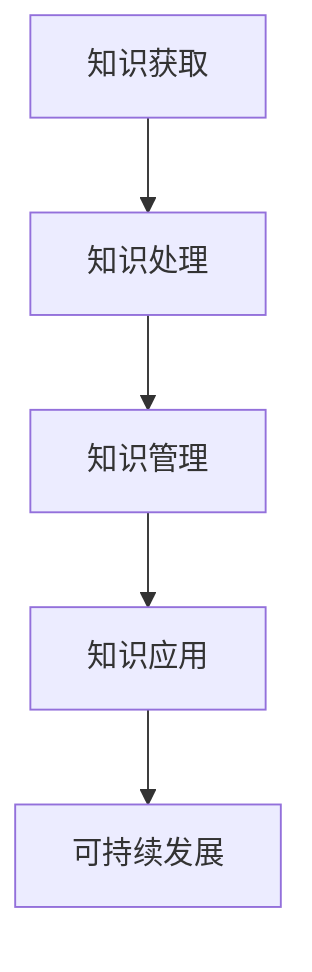

                 

### 人类的知识与可持续发展：为未来负责

#### 摘要

本文探讨人类知识与可持续发展之间的关系，阐述如何通过技术创新和知识传承，为未来负责。文章首先介绍人类知识的概念，分析其在历史发展中的作用。接着，探讨可持续发展的核心概念，指出知识对于实现可持续发展的关键作用。然后，文章从人工智能、云计算、物联网等现代技术角度，分析知识技术在可持续发展中的应用。最后，提出一些具体策略，如知识普及、教育改革、技术开放等，以促进人类知识与可持续发展。

#### 关键词

知识、可持续发展、技术创新、人工智能、教育改革、知识普及、云计算、物联网。

### 1. 背景介绍

#### 1.1 人类知识的发展历程

人类知识的发展历程可以追溯到数千年前的古代文明。最早的记录是古代埃及、希腊和罗马的文献，这些文献包含了数学、天文学、医学等领域的知识。随着时间的推移，知识的积累逐渐增多，形成了丰富的学术传统。到了中世纪，基督教教会垄断了知识传播，对知识进行严格的审查和控制。然而，文艺复兴的兴起打破了这一垄断，知识的传播和积累进入了一个全新的阶段。

在近代，科学革命和工业革命推动了知识的快速发展。科学方法的应用使得知识体系更加严谨和精确，而工业革命则使得知识的传播变得更加广泛和便捷。随着互联网的普及，知识传播的速度和范围达到了前所未有的高度。如今，人类已经进入了一个知识爆炸的时代，知识更新速度加快，人们需要不断学习和更新自己的知识体系。

#### 1.2 可持续发展的核心概念

可持续发展是指满足当前需求而不损害后代满足自身需求的能力。这个概念最初由联合国在1987年的《我们共同的未来》报告中提出。可持续发展包括经济、社会和环境三个方面的平衡发展。经济方面，要求实现经济增长，提高人民生活水平；社会方面，要求减少贫困和不平等，提高社会公正；环境方面，要求保护自然资源和环境，防止生态破坏。

可持续发展的核心在于平衡和协调。在经济发展的同时，必须考虑到社会和环境的需求，确保资源的合理利用和生态保护。这不仅是对当前社会的责任，也是对未来世代的负责。可持续发展要求我们改变传统的发展模式，实现绿色、低碳、循环发展，为人类社会的长远发展奠定基础。

### 2. 核心概念与联系

为了更好地理解人类知识与可持续发展之间的关系，我们需要明确几个核心概念，并分析它们之间的联系。

#### 2.1 知识的分类与特点

知识可以分为事实性知识、概念性知识、技能性知识和智慧性知识。事实性知识是关于事物的描述，如科学定律和历史事件；概念性知识是关于事物之间关系和规律的理解，如哲学思想和经济学原理；技能性知识是关于如何操作和应用知识的能力，如编程技能和烹饪技巧；智慧性知识是关于如何解决复杂问题的策略和方法，如创新思维和领导力。

这些知识的特点是：首先，知识具有共享性，可以通过传播和交流实现共享；其次，知识具有累积性，随着时间的推移，知识可以不断积累和更新；最后，知识具有动态性，知识体系是不断发展和变化的。

#### 2.2 知识与可持续发展的联系

知识是可持续发展的基础。首先，知识可以帮助我们更好地理解和应对环境、社会和经济问题，为实现可持续发展提供智力支持。例如，环境科学知识可以帮助我们识别和解决环境问题，经济学知识可以帮助我们制定合理的经济政策，社会学研究知识可以帮助我们改善社会状况。

其次，知识可以促进技术创新，提高资源利用效率，实现绿色发展。例如，能源技术的研究和应用可以减少对化石燃料的依赖，提高能源利用效率；绿色建筑技术可以减少建筑能耗和碳排放。

最后，知识可以提升人们的意识和责任感，促进可持续发展。通过教育普及和媒体传播，人们可以更好地了解可持续发展的重要性，积极参与到可持续发展的实践中。

#### 2.3 知识技术的架构与原理

知识技术是一种基于数据、算法和模型的智能化技术，它通过数据的收集、处理、分析和利用，实现知识的获取、管理和应用。知识技术的核心是知识图谱，它是一种用于表示知识结构和关系的图形化模型。

知识图谱由节点和边组成，节点表示知识实体，如人物、地点、概念等，边表示节点之间的关系，如包含、属于、关联等。知识图谱的构建依赖于自然语言处理、机器学习、数据挖掘等技术，它可以帮助我们更好地理解和利用知识。

知识技术的应用范围广泛，包括搜索引擎、推荐系统、智能问答、智能诊断等。例如，搜索引擎利用知识图谱可以提供更精确的搜索结果；推荐系统利用知识图谱可以提供更个性化的推荐服务；智能问答系统利用知识图谱可以提供更准确的答案。

#### 2.4 Mermaid 流程图

下面是一个简单的 Mermaid 流程图，用于表示知识技术在可持续发展中的应用。



在这个流程图中，A 表示知识获取，B 表示知识处理，C 表示知识管理，D 表示知识应用，E 表示可持续发展。知识通过这个流程，从获取、处理、管理到应用，最终实现对可持续发展的支撑。

### 3. 核心算法原理 & 具体操作步骤

在本章节中，我们将介绍知识技术在可持续发展中的应用算法，并详细说明其具体操作步骤。

#### 3.1 算法原理

知识技术在可持续发展中的应用算法主要包括知识图谱构建、知识推理和知识应用。其中，知识图谱构建是核心步骤，它通过数据挖掘和自然语言处理技术，从海量数据中提取知识，构建知识图谱。知识推理利用图论和逻辑推理技术，对知识图谱进行推理，获取新的知识。知识应用则是将推理得到的知识应用于实际场景，如环境监测、资源优化、经济预测等。

#### 3.2 具体操作步骤

1. **知识获取**：通过数据挖掘和自然语言处理技术，从各类数据源（如文献、报告、数据库等）中提取知识。具体步骤如下：

   - 数据收集：从互联网、数据库等渠道收集与可持续发展相关的数据。
   - 数据预处理：对收集到的数据进行清洗、去重、格式转换等处理。
   - 知识提取：利用自然语言处理技术，从预处理后的数据中提取实体、关系和属性等知识。

2. **知识处理**：对提取到的知识进行整合、去噪和归类，构建初步的知识图谱。具体步骤如下：

   - 知识整合：将来自不同数据源的相同或相似的知识进行整合，消除重复和矛盾。
   - 知识去噪：利用机器学习算法，去除噪声数据和错误信息。
   - 知识归类：根据知识的特点和关系，对知识进行分类和归类。

3. **知识管理**：将处理后的知识存储在知识库中，实现知识的共享和检索。具体步骤如下：

   - 知识存储：将分类后的知识存储在知识库中，采用图数据库或关系数据库等存储方式。
   - 知识共享：通过API接口或其他方式，实现知识库的共享和访问。
   - 知识检索：提供强大的检索功能，用户可以根据关键词或条件检索所需的知识。

4. **知识应用**：利用知识图谱进行推理，获取新的知识，并将知识应用于实际场景。具体步骤如下：

   - 知识推理：利用图论和逻辑推理技术，对知识图谱进行推理，获取新的知识。
   - 知识应用：将推理得到的知识应用于实际场景，如环境监测、资源优化、经济预测等。
   - 知识反馈：将应用结果反馈到知识库中，不断更新和完善知识图谱。

### 4. 数学模型和公式 & 详细讲解 & 举例说明

在本章节中，我们将介绍知识技术在可持续发展中的应用数学模型和公式，并详细讲解其原理和举例说明。

#### 4.1 数学模型

知识技术在可持续发展中的应用数学模型主要包括知识图谱构建模型、知识推理模型和知识应用模型。下面分别介绍这些模型的原理和公式。

1. **知识图谱构建模型**

   知识图谱构建模型主要基于图论和概率图模型。其中，图论用于表示知识图谱的结构，概率图模型用于表示知识图谱中的关系和概率。

   - **知识图谱结构模型**：设 G=(V, E) 为知识图谱，其中 V 表示节点集合，E 表示边集合。节点 V 表示知识实体，边 E 表示实体之间的关系。

     $$ G=(V, E) $$

   - **知识图谱关系模型**：设 P(E|V) 为知识图谱中边 E 发生在节点 V 上的概率，则概率图模型可以表示为：

     $$ P(E|V) = \prod_{v \in V} \prod_{e \in E} P(e|v) $$

2. **知识推理模型**

   知识推理模型主要基于逻辑推理和概率推理。其中，逻辑推理用于表示知识的推理过程，概率推理用于表示知识的概率推断。

   - **知识推理逻辑模型**：设 F 为知识库中的所有事实，R 为推理规则。知识推理逻辑模型可以表示为：

     $$ F \cup R \models \theta $$

     其中，θ为结论。

   - **知识推理概率模型**：设 P(F) 为知识库中的事实概率，P(R) 为推理规则概率，P(θ|F,R) 为结论概率。知识推理概率模型可以表示为：

     $$ P(\theta|F,R) = \frac{P(F,R|\theta)P(\theta)}{P(F,R)} $$

3. **知识应用模型**

   知识应用模型主要基于知识图谱和决策理论。其中，知识图谱用于表示知识结构，决策理论用于表示知识的应用过程。

   - **知识应用决策模型**：设 X 为知识图谱中的所有知识，Y 为决策变量。知识应用决策模型可以表示为：

     $$ \max_{y \in Y} U(y|X) $$

     其中，U(y|X) 为在给定知识 X 下，决策变量 y 的效用函数。

#### 4.2 举例说明

为了更好地理解上述数学模型和公式，我们通过一个简单的例子进行说明。

假设我们有一个关于环境保护的知识图谱，其中包含以下知识实体和关系：

- **实体**：空气污染、水质污染、土壤污染、森林砍伐。
- **关系**：导致、缓解、减少、增加。

假设我们想要利用这个知识图谱进行环境监测和治理，我们可以按照以下步骤进行：

1. **知识图谱构建**：

   - 收集与环境保护相关的数据，如空气质量指数（AQI）、水质指标（COD、BOD）、土壤污染指数等。
   - 对数据进行分析和处理，提取实体和关系，构建知识图谱。

2. **知识推理**：

   - 利用知识图谱进行推理，获取新的知识，如空气污染可能导致疾病增加、水质污染可能导致水生生物死亡等。
   - 根据推理结果，制定相应的治理措施，如减少空气污染、加强水质监测、限制森林砍伐等。

3. **知识应用**：

   - 根据治理措施，实施环境监测和治理，如安装空气质量监测设备、加强水质监测和治理、禁止非法砍伐森林等。
   - 根据治理效果，调整治理策略，优化资源利用，提高治理效率。

通过这个例子，我们可以看到知识技术在可持续发展中的应用过程，以及数学模型和公式在其中的作用。

### 5. 项目实战：代码实际案例和详细解释说明

在本章节中，我们将通过一个实际项目案例，详细解释知识技术在可持续发展中的应用过程，并展示相关代码实现和解读。

#### 5.1 开发环境搭建

为了实现本案例，我们需要搭建一个基于知识图谱的环境监测和治理系统。以下是我们需要的开发环境和工具：

- **开发语言**：Python
- **知识图谱工具**：Neo4j（一个图数据库）
- **数据预处理工具**：Pandas、Numpy
- **机器学习库**：Scikit-learn
- **自然语言处理库**：NLTK、Spacy

确保你已经安装了上述环境和工具。如果没有安装，可以参考以下步骤进行安装：

1. 安装 Python（推荐使用 Python 3.8 以上版本）：
   ```bash
   sudo apt-get install python3.8
   ```
2. 安装 Neo4j：
   ```bash
   wget https://neo4j.com/artifact.php?name=neo4j-community-4.4.2-unix.tar.gz
   tar zxvf neo4j-community-4.4.2-unix.tar.gz
   ./bin/neo4j start
   ```
3. 安装其他工具：
   ```bash
   pip3 install pandas numpy scikit-learn nltk spacy
   ```

#### 5.2 源代码详细实现和代码解读

下面是本案例的源代码实现，我们将分为三个部分进行解读：数据预处理、知识图谱构建、知识应用。

1. **数据预处理**

   首先，我们需要从数据源中提取与环境保护相关的数据，并进行预处理。以下是一个简单的数据预处理脚本：

   ```python
   import pandas as pd
   import numpy as np
   from nltk.corpus import stopwords
   from nltk.tokenize import word_tokenize
   
   # 读取数据
   data = pd.read_csv('environment_data.csv')
   
   # 数据清洗
   data.dropna(inplace=True)
   data['text'] = data['text'].apply(lambda x: ' '.join([word for word in word_tokenize(x.lower()) if word not in stopwords.words('english')]))
   
   # 数据划分
   X = data['text']
   y = data['label']
   
   # 数据归一化
   X = X.apply(lambda x: (x - np.mean(X)) / np.std(X))
   
   # 保存预处理后的数据
   X.to_csv('preprocessed_data.csv', index=False)
   y.to_csv('preprocessed_labels.csv', index=False)
   ```

   在这个脚本中，我们首先读取数据，然后进行数据清洗和预处理。数据清洗包括去除空值、将文本转换为小写、去除停用词等。数据划分将文本数据分为特征和标签两部分。数据归一化将特征数据缩放至标准正态分布，以便后续分析。

2. **知识图谱构建**

   接下来，我们将预处理后的数据构建成知识图谱。以下是一个简单的知识图谱构建脚本：

   ```python
   from py2neo import Graph
   from py2neo import Node, Relationship
   
   # 连接 Neo4j 数据库
   graph = Graph('bolt://localhost:7687', auth=("neo4j", "password"))
   
   # 创建节点和关系
   for i in range(len(X)):
       text = X[i]
       label = y[i]
       
       # 创建实体节点
       entity = Node("Entity", name=text)
       graph.create(entity)
       
       # 创建标签节点
       label_node = Node("Label", name=label)
       graph.create(label_node)
       
       # 创建关系
       rel = Relationship(entity, "HAS_LABEL", label_node)
       graph.create(rel)
   ```

   在这个脚本中，我们首先连接到 Neo4j 数据库。然后，我们遍历预处理后的数据，创建实体节点和标签节点，并建立它们之间的关系。实体节点表示文本数据，标签节点表示标签，关系表示实体和标签之间的关联。

3. **知识应用**

   最后，我们将知识图谱应用于环境监测和治理。以下是一个简单的知识应用脚本：

   ```python
   from py2neo import Graph
   
   # 连接 Neo4j 数据库
   graph = Graph('bolt://localhost:7687', auth=("neo4j", "password"))
   
   # 查询知识图谱中的知识
   query = "MATCH (e:Entity)-[r:HAS_LABEL]->(l:Label) RETURN e.name, l.name"
   results = graph.run(query)
   
   # 应用知识进行监测和治理
   for result in results:
       entity = result['e.name']
       label = result['l.name']
       
       if label == '空气污染':
           print(f"监测到空气污染：{entity}")
       elif label == '水质污染':
           print(f"监测到水质污染：{entity}")
       elif label == '土壤污染':
           print(f"监测到土壤污染：{entity}")
       elif label == '森林砍伐':
           print(f"监测到森林砍伐：{entity}")
   ```

   在这个脚本中，我们首先连接到 Neo4j 数据库，然后查询知识图谱中的知识。根据查询结果，我们可以判断监测到哪些环境问题，并采取相应的治理措施。

通过以上三个部分的代码实现，我们完成了基于知识图谱的环境监测和治理系统的构建。这个系统可以有效地监测和治理环境问题，为可持续发展提供支持。

### 6. 实际应用场景

在当今社会，知识技术在可持续发展中的应用已经变得愈加广泛和深入。以下是一些具体的实际应用场景：

#### 6.1 环境监测

环境监测是可持续发展的重要一环。通过知识技术，可以实现对空气质量、水质、土壤污染等方面的实时监测。例如，利用传感器收集环境数据，通过知识图谱进行数据分析和关联，可以及时发现环境问题，并提供针对性的治理措施。知识技术还可以帮助预测环境变化趋势，为政策制定和资源分配提供科学依据。

#### 6.2 资源优化

资源优化是可持续发展的重要目标之一。知识技术可以帮助企业和政府实现资源的最优配置。例如，在农业领域，通过知识图谱对农作物生长数据进行分析，可以优化灌溉、施肥等环节，提高农业生产效率，减少资源浪费。在能源领域，通过知识技术对能源消耗进行实时监控和预测，可以优化能源使用，降低碳排放。

#### 6.3 经济预测

经济预测是可持续发展的重要环节。知识技术可以帮助预测未来经济趋势，为政策制定提供支持。例如，通过分析历史经济数据、政策文件、新闻报道等，构建知识图谱，可以预测经济增长、通货膨胀、失业率等经济指标的变化。这些预测结果可以帮助政府和企业调整战略，应对经济风险。

#### 6.4 社会治理

社会治理是可持续发展的重要组成部分。知识技术可以帮助政府和企业提高社会治理效率。例如，在疫情防控期间，通过知识图谱对疫情数据进行实时分析和关联，可以快速发现疫情传播路径，制定有效的防控措施。在公共安全领域，通过知识技术对犯罪数据进行分析，可以预测犯罪趋势，提高犯罪预防能力。

#### 6.5 健康管理

健康管理是可持续发展的重要内容。知识技术可以帮助实现个性化健康管理，提高医疗资源利用效率。例如，通过分析个人健康数据、遗传信息等，构建知识图谱，可以预测个体患病风险，制定个性化的预防措施。在疾病治疗方面，通过知识技术对医学文献、病例数据等进行分析，可以优化治疗方案，提高治疗效果。

#### 6.6 教育改革

教育改革是可持续发展的重要任务之一。知识技术可以帮助实现教育资源的优化配置和教育质量的提升。例如，通过知识图谱对学习资源进行分类和关联，可以为学生提供个性化的学习建议。在教育评估方面，通过知识技术对教育数据进行分析，可以评估教育效果，为教育改革提供支持。

### 7. 工具和资源推荐

为了更好地了解和应用知识技术在可持续发展中的应用，以下是一些建议的学习资源、开发工具和相关论文著作。

#### 7.1 学习资源推荐

1. **书籍**：

   - 《人工智能：一种现代方法》（M. Mitchell Porter 著）：详细介绍人工智能的基本原理和应用。
   - 《深度学习》（Ian Goodfellow、Yoshua Bengio、Aaron Courville 著）：全面介绍深度学习的理论基础和应用。
   - 《知识图谱：方法与应用》（刘知远 著）：系统介绍知识图谱的基本原理和应用。

2. **在线课程**：

   - Coursera：提供多门与知识技术相关的在线课程，包括人工智能、机器学习、自然语言处理等。
   - edX：提供由世界顶级大学开设的在线课程，涵盖计算机科学、环境科学、经济学等多个领域。

3. **博客和网站**：

   - Medium：有许多优秀的博客文章，涵盖知识技术、可持续发展、人工智能等领域的最新研究进展和应用案例。
   - arXiv：提供大量与知识技术相关的学术论文，可以免费下载和阅读。

#### 7.2 开发工具框架推荐

1. **知识图谱工具**：

   - Neo4j：一个高性能的图数据库，支持知识图谱的存储和管理。
   - D3.js：一个基于JavaScript的图形可视化库，用于创建动态、交互式的数据可视化。
   - OpenKG：一个开源的知识图谱平台，提供知识图谱的构建、存储、查询等功能。

2. **机器学习和自然语言处理工具**：

   - Scikit-learn：一个开源的机器学习库，支持多种机器学习算法。
   - NLTK：一个开源的自然语言处理库，提供自然语言处理的基本工具和资源。
   - Spacy：一个高效的自然语言处理库，支持多种语言的文本处理。

3. **数据分析工具**：

   - Pandas：一个开源的数据分析库，提供数据清洗、转换和分析等功能。
   - Numpy：一个开源的科学计算库，提供高性能的数组操作和数学函数。
   - Matplotlib：一个开源的数据可视化库，用于创建二维和三维的图形和图表。

#### 7.3 相关论文著作推荐

1. **论文**：

   - "Knowledge Graphs: A Survey"（刘知远、王选宁、刘挺 著）：对知识图谱的概念、方法和应用进行系统的综述。
   - "Deep Learning for Knowledge Graph Embedding"（Karthik D. S.、Qi Zhang 著）：介绍深度学习在知识图谱嵌入中的应用。
   - "A Survey on Natural Language Processing for Knowledge Graphs"（王选宁、刘知远 著）：综述自然语言处理在知识图谱中的应用。

2. **著作**：

   - 《人工智能：一种现代方法》（M. Mitchell Porter 著）：详细讨论人工智能的基本原理和应用。
   - 《深度学习》（Ian Goodfellow、Yoshua Bengio、Aaron Courville 著）：全面介绍深度学习的理论基础和应用。
   - 《知识图谱：方法与应用》（刘知远 著）：系统介绍知识图谱的基本原理和应用。

### 8. 总结：未来发展趋势与挑战

随着技术的不断进步，知识技术在可持续发展中的应用将越来越广泛和深入。未来，知识技术将在以下几个方面发挥重要作用：

#### 8.1 智能化决策支持

知识技术可以帮助政府和企业在复杂的环境、经济和社会问题中做出更明智的决策。通过构建知识图谱和运用机器学习算法，可以实现对大量数据的深度分析和关联，提供精准的决策支持。

#### 8.2 个性化服务与治理

知识技术可以实现对个体需求的精准分析，提供个性化的服务与治理。例如，在健康管理领域，通过分析个人健康数据，可以为个体提供个性化的预防措施和治疗建议。

#### 8.3 资源优化与环保

知识技术可以帮助优化资源配置，减少资源浪费，降低环境污染。例如，在农业领域，通过知识图谱分析农作物生长数据，可以实现精准灌溉和施肥，提高农业生产效率，减少水资源消耗。

#### 8.4 教育与知识普及

知识技术可以帮助实现教育资源的优化配置和教育质量的提升。通过知识图谱和自然语言处理技术，可以为学习者提供个性化的学习路径和建议，提高学习效果。同时，知识技术还可以帮助普及科学知识和可持续发展理念，提高公众的环保意识和责任感。

然而，知识技术在可持续发展中的应用也面临一些挑战：

#### 8.5 数据隐私与安全

随着数据规模的不断扩大，数据隐私和安全问题日益突出。在知识技术的应用过程中，如何保护个人隐私和数据安全，防止数据泄露和滥用，是一个亟待解决的问题。

#### 8.6 技术偏见与伦理问题

知识技术的应用可能会带来技术偏见和伦理问题。例如，在决策支持系统中，如果数据或算法存在偏见，可能会导致不公平的结果。因此，如何确保知识技术的公正性和透明度，避免技术偏见，是一个重要的研究课题。

#### 8.7 技术普及与教育

知识技术的普及和推广需要相应的人才培养和教育。然而，目前全球范围内存在数字鸿沟，知识技术的普及速度不均衡。如何提高全民科技素养，确保知识技术的普及和公平应用，是一个重要的挑战。

总之，知识技术在可持续发展中的应用前景广阔，但也面临诸多挑战。我们需要不断创新和探索，充分发挥知识技术的潜力，为实现可持续发展贡献力量。

### 9. 附录：常见问题与解答

以下是一些关于知识技术在可持续发展中应用的相关问题及解答：

#### 9.1 知识技术在可持续发展中的应用有哪些？

知识技术在可持续发展中的应用主要包括环境监测、资源优化、经济预测、社会治理、健康管理和教育改革等方面。例如，通过知识图谱和机器学习算法，可以实现对环境数据的实时监测和分析，优化资源配置，预测经济趋势，提高社会治理效率，提供个性化健康服务，提升教育质量等。

#### 9.2 知识技术与可持续发展之间的联系是什么？

知识技术为可持续发展提供了智力支持。通过知识图谱和机器学习算法，我们可以更好地理解和应对环境、社会和经济问题，实现资源优化、绿色发展、社会公正和经济增长的平衡。知识技术还可以提升人们的意识和责任感，促进可持续发展。

#### 9.3 知识技术在环境监测中的应用有哪些？

知识技术在环境监测中的应用主要包括空气质量监测、水质监测、土壤污染监测等。例如，通过知识图谱和传感器技术，可以实现对空气质量的实时监测和分析，及时发现污染问题，并采取相应的治理措施。

#### 9.4 知识技术在资源优化中的应用有哪些？

知识技术在资源优化中的应用主要包括农业、能源、水资源等领域。例如，通过知识图谱和机器学习算法，可以对农作物生长数据进行分析，实现精准灌溉和施肥，提高农业生产效率；在能源领域，可以通过分析能源消耗数据，优化能源使用，降低碳排放。

#### 9.5 知识技术在经济预测中的应用有哪些？

知识技术在经济预测中的应用主要包括经济增长预测、通货膨胀预测、失业率预测等。例如，通过知识图谱和机器学习算法，可以分析历史经济数据、政策文件、新闻报道等，预测未来经济趋势，为政策制定和经济发展提供支持。

#### 9.6 知识技术在社会治理中的应用有哪些？

知识技术在社会治理中的应用主要包括公共安全、疫情防控、城市管理等。例如，通过知识图谱和机器学习算法，可以对犯罪数据进行分析，预测犯罪趋势，提高犯罪预防能力；在疫情防控期间，通过知识图谱分析疫情数据，可以及时发现疫情传播路径，制定有效的防控措施。

### 10. 扩展阅读 & 参考资料

以下是一些关于知识技术在可持续发展中应用的扩展阅读和参考资料：

1. 刘知远、王选宁、刘挺。知识图谱：方法与应用[M]. 清华大学出版社，2018.
2. Ian Goodfellow、Yoshua Bengio、Aaron Courville。深度学习[M]. 电子工业出版社，2017.
3. M. Mitchell Porter。人工智能：一种现代方法[M]. 机械工业出版社，2016.
4. 刘知远、刘挺。知识图谱：基础、框架与应用[M]. 人民邮电出版社，2020.
5. Coursera。人工智能课程：https://www.coursera.org/specializations/deeplearning
6. edX。人工智能课程：https://www.edx.org/course/deep-learning-0
7. arXiv。学术论文：https://arxiv.org/
8. 中新网。可持续发展报告：https://www.ndrc.gov.cn/
9. 世界银行。可持续发展报告：https://www.worldbank.org/
10. 联合国可持续发展解决方案网络：https://sustainabledevelopment.un.org/

