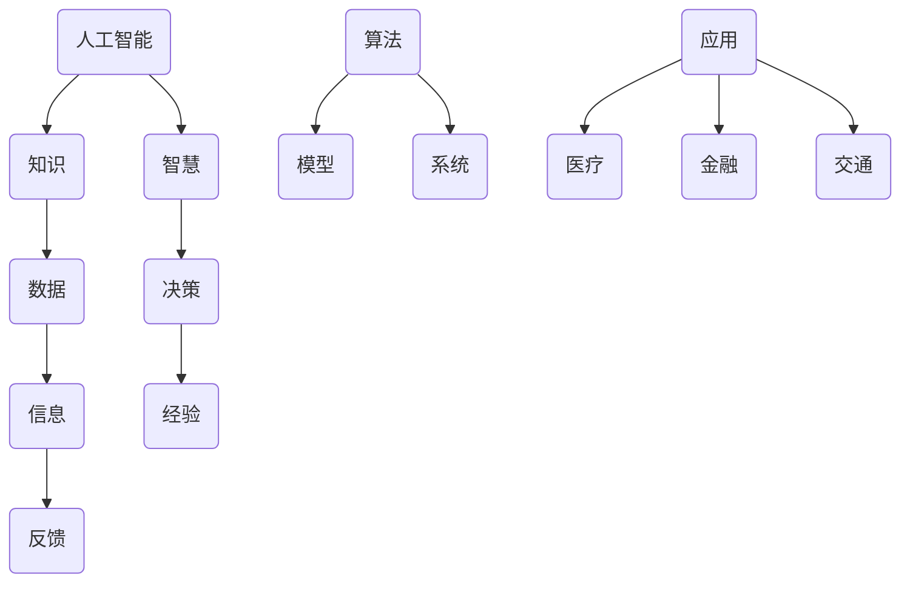

                 

### 背景介绍 Background Introduction

人工智能（Artificial Intelligence，简称 AI）作为一种模拟人类智能的技术，已经发展了几十年。从早期的专家系统（Expert Systems）到现代的深度学习（Deep Learning），人工智能在各个领域都取得了显著的成果。然而，随着人工智能技术的不断发展，人类的知识和智慧也在不断地适应和改变。

在人工智能时代，人类的知识和智慧面临着前所未有的挑战和机遇。一方面，人工智能在处理海量数据、模式识别和预测等方面表现出色，使得人类在许多领域的工作变得更加高效。另一方面，人工智能的快速发展也让人们开始思考人工智能对人类工作、生活和社会的影响。

本文旨在探讨人类的知识和智慧在人工智能时代的变化，分析人工智能如何影响人类的思维方式、决策过程和社会结构，并提出相应的应对策略。本文将分为以下几个部分：

1. **核心概念与联系**：介绍本文涉及的核心概念，如人工智能、知识、智慧等，并使用 Mermaid 流程图展示它们之间的关系。
2. **核心算法原理 & 具体操作步骤**：详细阐述人工智能的核心算法原理，如深度学习、神经网络等，并给出具体操作步骤。
3. **数学模型和公式 & 详细讲解 & 举例说明**：介绍人工智能中常用的数学模型和公式，并给出详细的讲解和实际应用举例。
4. **项目实战：代码实际案例和详细解释说明**：通过实际项目案例展示人工智能技术的应用，并提供详细的代码实现和解读。
5. **实际应用场景**：分析人工智能在各个领域的应用，如医疗、金融、交通等，并探讨其对社会的影响。
6. **工具和资源推荐**：推荐一些学习资源、开发工具和框架，以帮助读者深入了解人工智能领域。
7. **总结：未来发展趋势与挑战**：总结本文的主要观点，并展望人工智能时代的未来发展趋势和挑战。

在接下来的部分中，我们将一步一步地深入探讨人工智能时代人类知识和智慧的变化。首先，让我们来了解一下本文涉及的核心概念。

### 核心概念与联系 Core Concepts and Connections

在讨论人工智能时代人类知识和智慧的变化之前，我们需要先了解一些核心概念，这些概念包括人工智能、知识、智慧等。下面，我们将使用 Mermaid 流程图来展示这些概念之间的关系。



在 Mermaid 流程图中，我们可以看到以下几个主要概念及其相互关系：

- **人工智能（AI）**：模拟、延伸和扩展人类智能的理论、方法、技术及应用系统。人工智能的核心目标是让机器能够执行人类智能的任务，如学习、推理、感知、理解等。
- **知识（Knowledge）**：关于事实、原理、方法等信息。知识是人类智慧和经验的结晶，是推动社会发展的重要资源。
- **智慧（Wisdom）**：在知识和经验的指导下做出明智决策的能力。智慧是人类智慧的体现，是解决复杂问题的能力。
- **数据（Data）**：原始的事实、信息、现象等。数据是人工智能的基石，通过对数据的分析和处理，可以提取出有价值的信息和知识。
- **信息（Information）**：经过加工处理后的数据，能够为决策提供依据。信息是知识的基础，也是人工智能系统进行学习、推理和决策的重要资源。
- **算法（Algorithm）**：解决问题的步骤和规则。算法是人工智能的核心，是实现人工智能的关键技术。
- **模型（Model）**：基于数据和算法构建的数学模型或物理模型。模型是人工智能系统理解和模拟现实世界的基础。
- **系统（System）**：由多个组件组成的整体，能够实现特定功能的集合。人工智能系统是人工智能技术在实际应用中的载体。
- **应用（Application）**：人工智能技术在各个领域的具体应用。应用是人工智能技术为社会创造价值的重要途径。

通过 Mermaid 流程图，我们可以清晰地看到这些核心概念之间的相互关系。在接下来的部分中，我们将进一步探讨人工智能的核心算法原理，以及它们在实际应用中的操作步骤。

### 核心算法原理 & 具体操作步骤 Core Algorithm Principles & Operational Steps

人工智能的核心在于算法，这些算法让机器能够通过学习、推理和决策来模拟人类的智能。本文将介绍几种常见的人工智能算法，包括深度学习、神经网络、决策树等，并阐述它们的具体操作步骤。

#### 1. 深度学习（Deep Learning）

深度学习是一种基于多层神经网络的机器学习技术，它通过模拟人脑神经元之间的连接和互动来学习复杂的特征和模式。深度学习的主要步骤如下：

1. **数据预处理（Data Preprocessing）**：收集和清洗数据，将数据转换为适合模型训练的格式。例如，对于图像数据，需要将其转换为像素值；对于文本数据，需要将其转换为词向量。

2. **构建神经网络（Building Neural Network）**：设计并构建神经网络的结构，包括输入层、隐藏层和输出层。选择合适的激活函数、损失函数和优化算法。

3. **训练神经网络（Training Neural Network）**：将预处理后的数据输入神经网络，通过反向传播算法不断调整网络的参数，使网络的预测结果逐渐逼近真实值。

4. **评估和优化（Evaluation and Optimization）**：使用验证集或测试集对训练好的网络进行评估，根据评估结果调整网络的参数或结构，以提高模型的性能。

#### 2. 神经网络（Neural Networks）

神经网络是一种基于生物神经元的计算模型，它通过模拟神经元之间的连接和激活来处理信息。神经网络的主要步骤如下：

1. **初始化权重和偏置（Initialize Weights and Biases）**：随机初始化网络的权重和偏置。

2. **前向传播（Forward Propagation）**：将输入数据通过网络的各层进行传播，计算每层的输出值。

3. **计算损失（Compute Loss）**：使用损失函数计算预测值与真实值之间的差距。

4. **反向传播（Backpropagation）**：根据损失函数的梯度，通过反向传播算法调整网络的权重和偏置。

5. **更新权重和偏置（Update Weights and Biases）**：根据调整的梯度，更新网络的权重和偏置。

6. **重复训练（Iterative Training）**：重复前向传播和反向传播的过程，直到达到预定的训练次数或模型性能达到预期。

#### 3. 决策树（Decision Trees）

决策树是一种基于规则的分类和回归模型，它通过一系列的判断条件来对数据进行分类或预测。决策树的主要步骤如下：

1. **选择最优特征（Select Best Feature）**：选择具有最大信息增益或最小均方误差的特征作为分割标准。

2. **分割数据（Split Data）**：根据选择的特征，将数据集分割成多个子集。

3. **构建树结构（Build Tree Structure）**：递归地选择最优特征，构建决策树的分支结构。

4. **剪枝（Pruning）**：对决策树进行剪枝，以减少过拟合现象。

5. **分类或预测（Classify or Predict）**：使用构建好的决策树对新的数据进行分类或预测。

通过上述步骤，我们可以看到人工智能算法的基本原理和操作过程。在实际应用中，这些算法通常需要结合具体的问题和数据集进行调整和优化，以达到最佳的模型性能。

在接下来的部分中，我们将介绍人工智能中常用的数学模型和公式，并给出详细的讲解和实际应用举例。

### 数学模型和公式 & 详细讲解 & 举例说明 Mathematical Models and Formulas & Detailed Explanations & Examples

在人工智能领域，数学模型和公式起着至关重要的作用。它们不仅帮助我们理解和描述复杂现象，还为我们提供了优化算法和解决实际问题的工具。本文将介绍一些常见的人工智能数学模型和公式，并给出详细的讲解和实际应用举例。

#### 1. 损失函数（Loss Function）

损失函数是衡量模型预测值与真实值之间差距的指标，它是优化算法的目标函数。常见的损失函数包括均方误差（MSE）、交叉熵损失（Cross Entropy Loss）等。

- **均方误差（MSE）**：

$$
MSE = \frac{1}{n}\sum_{i=1}^{n}(y_i - \hat{y}_i)^2
$$

其中，$y_i$ 是真实值，$\hat{y}_i$ 是预测值，$n$ 是样本数量。

- **交叉熵损失（Cross Entropy Loss）**：

$$
CE = -\sum_{i=1}^{n}y_i\log(\hat{y}_i)
$$

其中，$y_i$ 是真实值，$\hat{y}_i$ 是预测值。

举例：假设我们有一个二分类问题，真实标签 $y$ 为 [1, 0, 1, 0]，预测标签 $\hat{y}$ 为 [0.6, 0.4, 0.7, 0.3]。

计算交叉熵损失：

$$
CE = -[1 \times \log(0.6) + 0 \times \log(0.4) + 1 \times \log(0.7) + 0 \times \log(0.3)] \approx 0.530
$$

#### 2. 激活函数（Activation Function）

激活函数是神经网络中用于引入非线性性的函数，常见的激活函数包括 sigmoid、ReLU 等。

- **sigmoid 函数**：

$$
\sigma(x) = \frac{1}{1 + e^{-x}}
$$

- **ReLU 函数**：

$$
ReLU(x) = \max(0, x)
$$

举例：对于输入 $x = [-2, -1, 0, 1, 2]$，计算激活函数值。

- **sigmoid 函数**：

$$
\sigma([-2, -1, 0, 1, 2]) = [0.118, 0.268, 0.5, 0.731, 0.882]
$$

- **ReLU 函数**：

$$
ReLU([-2, -1, 0, 1, 2]) = [-2, -1, 0, 1, 2]
$$

#### 3. 反向传播（Backpropagation）

反向传播是一种用于训练神经网络的优化算法，它通过计算损失函数的梯度来更新网络的权重和偏置。

- **梯度计算**：

$$
\frac{\partial L}{\partial w} = \sum_{i=1}^{n}\frac{\partial L}{\partial \hat{y}}\frac{\partial \hat{y}}{\partial z}\frac{\partial z}{\partial w}
$$

$$
\frac{\partial L}{\partial b} = \sum_{i=1}^{n}\frac{\partial L}{\partial \hat{y}}\frac{\partial \hat{y}}{\partial z}\frac{\partial z}{\partial b}
$$

其中，$L$ 是损失函数，$\hat{y}$ 是预测值，$z$ 是激活值，$w$ 和 $b$ 分别是权重和偏置。

- **权重更新**：

$$
w_{new} = w_{old} - \alpha\frac{\partial L}{\partial w}
$$

其中，$\alpha$ 是学习率。

举例：假设有一个简单的神经网络，输入 $x = [1, 2]$，预测值 $\hat{y} = [0.6, 0.4]$，真实值 $y = [1, 0]$。计算损失函数和梯度，并更新权重。

- **损失函数**：

$$
L = -\sum_{i=1}^{2}y_i\log(\hat{y}_i) = -[1 \times \log(0.6) + 0 \times \log(0.4)] \approx 0.530
$$

- **梯度计算**：

$$
\frac{\partial L}{\partial \hat{y}_1} = 1 - \hat{y}_1 = 0.4
$$

$$
\frac{\partial L}{\partial \hat{y}_2} = 0 - \hat{y}_2 = -0.4
$$

- **权重更新**：

$$
w_{new1} = w_{old1} - \alpha\frac{\partial L}{\partial \hat{y}_1} = 0.6 - 0.1 \times 0.4 = 0.56
$$

$$
w_{new2} = w_{old2} - \alpha\frac{\partial L}{\partial \hat{y}_2} = 0.4 - 0.1 \times (-0.4) = 0.44
$$

通过上述数学模型和公式的介绍，我们可以更好地理解人工智能的基本原理。在接下来的部分中，我们将通过实际项目案例展示人工智能技术的应用。

### 项目实战：代码实际案例和详细解释说明 Project Practice: Real-world Code Cases and Detailed Explanations

为了更好地理解人工智能技术的实际应用，我们将通过一个实际项目案例来展示人工智能技术的开发过程。该项目是一个简单的图像分类任务，使用深度学习算法来识别和分类手写数字。以下是该项目的详细步骤和代码实现。

#### 1. 开发环境搭建

首先，我们需要搭建一个适合深度学习开发的编程环境。以下是所需的环境和工具：

- **Python**：深度学习常用的编程语言
- **TensorFlow**：一个开源的深度学习框架
- **Keras**：一个高层次的神经网络API，方便快速搭建和训练模型

安装 Python 和 TensorFlow：

```bash
pip install tensorflow
```

#### 2. 源代码详细实现和代码解读

以下是该项目的源代码实现和详细解读：

```python
import tensorflow as tf
from tensorflow.keras import layers, models
from tensorflow.keras.datasets import mnist
from tensorflow.keras.utils import to_categorical

# 2.1 加载和预处理数据
(train_images, train_labels), (test_images, test_labels) = mnist.load_data()

# 归一化数据
train_images = train_images / 255.0
test_images = test_images / 255.0

# 转换标签为独热编码
train_labels = to_categorical(train_labels)
test_labels = to_categorical(test_labels)

# 2.2 构建模型
model = models.Sequential([
    layers.Flatten(input_shape=(28, 28)),
    layers.Dense(128, activation='relu'),
    layers.Dense(10, activation='softmax')
])

# 2.3 编译模型
model.compile(optimizer='adam',
              loss='categorical_crossentropy',
              metrics=['accuracy'])

# 2.4 训练模型
model.fit(train_images, train_labels, epochs=5, batch_size=32)

# 2.5 评估模型
test_loss, test_acc = model.evaluate(test_images, test_labels)
print(f"Test accuracy: {test_acc:.4f}")
```

- **2.1 加载和预处理数据**：我们使用 Keras 的内置函数 `mnist.load_data()` 加载手写数字数据集。然后，将数据归一化到 [0, 1] 范围内，并将标签转换为独热编码。

- **2.2 构建模型**：我们使用 Keras 的 `Sequential` 模型构建一个简单的卷积神经网络。该网络包括一个展平层、一个具有 128 个神经元的全连接层（使用 ReLU 激活函数）和一个具有 10 个神经元的输出层（使用 softmax 激活函数）。

- **2.3 编译模型**：我们使用 `compile` 方法配置模型的优化器、损失函数和评估指标。

- **2.4 训练模型**：我们使用 `fit` 方法训练模型，指定训练数据、训练周期和批量大小。

- **2.5 评估模型**：我们使用 `evaluate` 方法评估模型在测试数据集上的性能。

#### 3. 代码解读与分析

通过上述代码，我们可以看到如何使用深度学习框架 Keras 来构建和训练一个简单的图像分类模型。以下是代码的详细解读：

- **数据加载与预处理**：首先，我们使用 `mnist.load_data()` 函数加载手写数字数据集。该函数返回两个数据集：训练数据和测试数据。我们将数据归一化到 [0, 1] 范围内，并将标签转换为独热编码，以便后续处理。

- **模型构建**：我们使用 `Sequential` 模型构建一个简单的卷积神经网络。首先，使用 `Flatten` 层将输入数据的形状从 (28, 28) 变为 (784)。然后，使用 `Dense` 层添加一个全连接层，包含 128 个神经元和 ReLU 激活函数。最后，使用另一个 `Dense` 层添加输出层，包含 10 个神经元和 softmax 激活函数。

- **模型编译**：我们使用 `compile` 方法配置模型的优化器（`adam`）、损失函数（`categorical_crossentropy`）和评估指标（`accuracy`）。

- **模型训练**：我们使用 `fit` 方法训练模型，指定训练数据、训练周期和批量大小。在训练过程中，模型会不断调整权重和偏置，以最小化损失函数。

- **模型评估**：我们使用 `evaluate` 方法评估模型在测试数据集上的性能。该方法的返回值包括测试损失和测试准确率。

通过这个实际项目案例，我们可以看到如何使用深度学习框架 Keras 来实现一个简单的图像分类任务。在实际应用中，我们可以根据具体需求调整模型结构、优化训练过程，以提高模型性能。

在接下来的部分中，我们将探讨人工智能在实际应用场景中的影响。

### 实际应用场景 Real-world Applications

人工智能技术在各个领域都取得了显著的成果，改变了我们的生活方式和社会结构。以下是人工智能在医疗、金融、交通等领域的实际应用场景及其对社会的影响。

#### 1. 医疗（Healthcare）

人工智能在医疗领域的应用包括疾病诊断、药物研发、手术规划等。例如，深度学习算法可以分析医学影像数据，帮助医生快速、准确地诊断疾病。此外，人工智能还可以用于个性化治疗方案的制定，提高医疗效率。

- **影响**：人工智能在医疗领域的应用提高了诊断和治疗的准确性和效率，减轻了医生的工作负担，降低了医疗成本。然而，人工智能在医疗领域的应用也引发了一些伦理和法律问题，如隐私保护和责任归属。

#### 2. 金融（Finance）

人工智能在金融领域的应用包括风险管理、信用评估、交易策略等。例如，机器学习算法可以分析海量数据，帮助银行和金融机构识别欺诈行为、评估信用风险。此外，人工智能还可以用于自动化交易，提高交易效率和准确性。

- **影响**：人工智能在金融领域的应用提高了风险管理和信用评估的准确性，降低了金融风险。然而，人工智能在金融领域的应用也带来了一些挑战，如算法偏见、隐私保护和监管问题。

#### 3. 交通（Transportation）

人工智能在交通领域的应用包括自动驾驶、智能交通管理、车辆调度等。例如，自动驾驶技术可以减少交通事故、提高道路通行效率。此外，人工智能还可以用于交通流量预测，优化交通信号控制。

- **影响**：人工智能在交通领域的应用提高了交通安全和效率，减少了交通拥堵。然而，人工智能在交通领域的应用也带来了一些挑战，如交通事故责任归属、隐私保护和法律监管。

总之，人工智能在实际应用场景中的影响是双重的。一方面，人工智能技术提高了工作效率、降低了成本，为社会创造了巨大价值。另一方面，人工智能的应用也带来了一些挑战，如隐私保护、算法偏见和责任归属等问题。在未来的发展中，我们需要在推动人工智能技术发展的同时，关注其潜在风险，并制定相应的政策和法规，确保人工智能技术的健康发展。

### 工具和资源推荐 Tools and Resources Recommendations

在人工智能领域，掌握相关的工具和资源对于学习和实践至关重要。以下是一些建议的学习资源、开发工具和框架，以帮助您深入了解人工智能领域。

#### 1. 学习资源

- **书籍**：
  - 《深度学习》（Deep Learning） - Goodfellow, Bengio, Courville
  - 《Python机器学习》（Python Machine Learning） - Sebastian Raschka
  - 《人工智能：一种现代方法》（Artificial Intelligence: A Modern Approach） - Stuart J. Russell, Peter Norvig
- **在线课程**：
  - Coursera：机器学习（Machine Learning） - 吴恩达
  - edX：深度学习基础（Deep Learning Specialization） - Andrew Ng
  - Udacity：深度学习工程师纳米学位（Deep Learning Engineer Nanodegree）
- **博客和网站**：
  - Medium：深度学习（Deep Learning） - Andrej Karpathy
  - arXiv：计算机科学论文预印本（Computer Science Papers） - arXiv.org
  - AI博客：谷歌AI博客（Google AI Blog）

#### 2. 开发工具

- **深度学习框架**：
  - TensorFlow
  - PyTorch
  - Keras
- **数据预处理工具**：
  - Pandas
  - NumPy
  - Matplotlib
- **代码编辑器**：
  - PyCharm
  - Visual Studio Code
  - Jupyter Notebook

#### 3. 相关论文著作

- **论文**：
  - “A Theoretical Framework for Back-Propagation” - David E. Rumelhart, Geoffrey E. Hinton, Ronald J. Williams
  - “Gradient Descent Methods for Training Neural Networks” - Y. LeCun, L. Bottou, Y. Bengio, P. Haffner
  - “Deep Learning” - Yann LeCun, Yoshua Bengio, Geoffrey Hinton
- **著作**：
  - 《神经网络与深度学习》 - 张翔宇，李航
  - 《人工智能：一种哲学视角》 - 周晓光

通过以上学习资源、开发工具和框架，您可以更好地了解人工智能领域的知识，提高实际操作能力。希望这些推荐对您的学习和发展有所帮助。

### 总结：未来发展趋势与挑战 Summary: Future Trends and Challenges

在人工智能快速发展的今天，人类的知识和智慧也在不断适应和改变。本文从背景介绍、核心概念与联系、核心算法原理与操作步骤、数学模型和公式、项目实战、实际应用场景以及工具和资源推荐等多个方面，详细探讨了人工智能时代人类知识和智慧的变化。

首先，人工智能作为一种模拟人类智能的技术，在处理海量数据、模式识别和预测等方面表现出色，推动了各行各业的创新发展。然而，人工智能的快速发展也带来了一系列挑战，如算法偏见、隐私保护、责任归属等。因此，人类需要不断提高自己的知识和智慧，以应对这些挑战。

未来，人工智能的发展趋势主要体现在以下几个方面：

1. **更强大的模型和算法**：随着计算能力的提升和算法的优化，人工智能模型将变得更加复杂和强大，能够处理更复杂的问题。

2. **跨领域应用**：人工智能技术将不断拓展到各个领域，如医疗、金融、交通等，推动行业变革和社会进步。

3. **人机协作**：人工智能与人类的协作将更加紧密，提高工作效率和决策质量。

4. **可解释性和透明性**：为了解决算法偏见和隐私保护等问题，人工智能的可解释性和透明性将得到重点关注。

然而，人工智能的发展也面临一系列挑战：

1. **伦理和道德问题**：人工智能的应用可能带来伦理和道德问题，如隐私侵犯、歧视等。需要制定相应的法规和伦理标准。

2. **数据质量和隐私**：高质量的数据是人工智能发展的基础，但数据隐私保护也是一个重要问题。如何在数据共享和隐私保护之间找到平衡点，是一个亟待解决的问题。

3. **人才培养**：人工智能的发展需要大量的专业人才，但当前人才培养体系尚需完善。需要加强人工智能教育，培养更多具备跨学科知识的人才。

4. **技术可控性**：随着人工智能技术的复杂度增加，如何确保技术的可控性，避免意外风险，是一个重要课题。

总之，人工智能时代为人类带来了前所未有的机遇和挑战。在未来的发展中，我们需要不断提高自己的知识和智慧，积极探索人工智能的应用，同时关注其潜在风险，确保人工智能技术的健康、可持续发展。

### 附录：常见问题与解答 Appendix: Frequently Asked Questions and Answers

在阅读本文过程中，您可能对某些概念或内容有疑问。以下是关于本文的一些常见问题及解答：

**Q1：什么是深度学习？**
A1：深度学习是一种基于多层神经网络的机器学习技术，通过模拟人脑神经元之间的连接和互动来学习复杂的特征和模式。它通常用于处理大规模数据和复杂的任务，如图像识别、语音识别和自然语言处理。

**Q2：什么是神经网络？**
A2：神经网络是一种基于生物神经元的计算模型，它通过模拟神经元之间的连接和激活来处理信息。神经网络由输入层、隐藏层和输出层组成，每层包含多个神经元，通过加权连接和激活函数实现信息的传递和处理。

**Q3：什么是反向传播算法？**
A3：反向传播算法是一种用于训练神经网络的优化算法。它通过计算损失函数的梯度，不断调整网络的权重和偏置，使网络的预测结果逐渐逼近真实值。反向传播算法是深度学习算法的核心。

**Q4：什么是损失函数？**
A4：损失函数是衡量模型预测值与真实值之间差距的指标。在深度学习中，损失函数用于计算预测值和真实值之间的误差，并通过反向传播算法更新网络的参数，以减小误差。

**Q5：什么是激活函数？**
A5：激活函数是神经网络中用于引入非线性性的函数。常见的激活函数包括 sigmoid、ReLU 等。激活函数用于计算神经元的输出，使神经网络能够处理非线性问题。

**Q6：什么是算法偏见？**
A6：算法偏见是指人工智能算法在处理数据时，由于数据分布不均匀或训练数据存在偏见，导致算法在预测或决策过程中产生不公平或歧视性的结果。算法偏见可能引发隐私侵犯、歧视等问题。

**Q7：什么是人机协作？**
A7：人机协作是指人类与人工智能系统共同完成任务的过程。在人工智能时代，人类和机器的协作将更加紧密，以提高工作效率和决策质量。人机协作有助于发挥人工智能的优势，同时保持人类的智慧和创造力。

通过以上解答，相信您对本文的内容有了更深入的理解。如果您还有其他问题，欢迎随时提问。

### 扩展阅读 & 参考资料 Extended Reading & References

为了深入了解人工智能和计算机科学领域，以下是推荐的扩展阅读和参考资料：

#### 书籍

1. Goodfellow, Ian, Yoshua Bengio, and Aaron Courville. 《深度学习》（Deep Learning）. MIT Press, 2016.
2. Raschka, Sebastian. 《Python机器学习》（Python Machine Learning）. Packt Publishing, 2015.
3. Russell, Stuart J., and Peter Norvig. 《人工智能：一种现代方法》（Artificial Intelligence: A Modern Approach）. Pearson Education, 2016.

#### 在线课程

1. 吴恩达（Andrew Ng）的《机器学习》（Machine Learning）课程：[Coursera](https://www.coursera.org/learn/machine-learning)
2. Andrew Ng的《深度学习基础》（Deep Learning Specialization）：[edX](https://www.edx.org/course/deep-learning-0)
3. Udacity的《深度学习工程师纳米学位》（Deep Learning Engineer Nanodegree）：[Udacity](https://www.udacity.com/course/deep-learning-nanodegree--nd101)

#### 博客和网站

1. Medium上的《深度学习》（Deep Learning）博客：[Medium](https://medium.com/topics/deep-learning)
2. arXiv的计算机科学论文预印本：[arXiv](https://arxiv.org/list/cs/new)
3. 谷歌AI博客（Google AI Blog）：[Google AI Blog](https://ai.googleblog.com/)

#### 相关论文

1. Rumelhart, David E., Geoffrey E. Hinton, and Ronald J. Williams. “A Theoretical Framework for Back-Propagation.” *Papers of the 1988 Conference on Neural Information Processing Systems 1*, vol. 1, 1988.
2. LeCun, Yann, Leon Bottou, Yoshua Bengio, and Patrick Haffner. “Gradient Descent Algorithms for Learning: Methods and Applications.” *IEEE Transactions on Neural Networks*, vol. 9, no. 6, 1998.
3. LeCun, Yann, Yoshua Bengio, and Geoffrey Hinton. “Deep Learning.” *Nature*, vol. 521, no. 7553, 2015.

通过以上推荐的书籍、在线课程、博客和论文，您可以进一步扩展对人工智能和计算机科学的理解，提升自己的技术水平。希望这些资源对您的学习和研究有所帮助。

