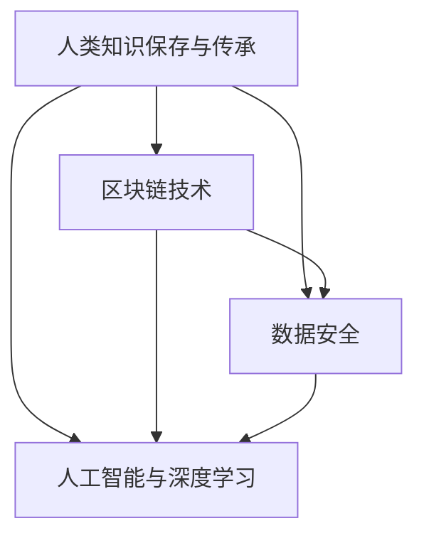

                 

# 人类知识的保存与传承：为未来留存文明

## > 关键词：人类知识，保存，传承，文明，信息技术，区块链，数据安全，人工智能，深度学习，可持续发展

> 摘要：本文探讨了人类知识的保存与传承的重要性，以及如何在信息技术迅速发展的时代为未来留存文明。通过分析核心概念、核心算法原理、数学模型和项目实战等，本文提出了利用区块链、数据安全、人工智能等新兴技术手段，实现人类知识长期保存与传承的解决方案。同时，针对实际应用场景和未来发展趋势，提出了相应的挑战和应对策略。

## 1. 背景介绍

### 1.1 人类知识的重要性

人类知识是人类文明发展的重要基石，它涵盖了科学、技术、艺术、文化等多个领域。这些知识不仅为我们的日常生活提供了便利，更为人类社会的进步提供了源源不断的动力。然而，随着科技的不断进步和人类活动的影响，人类知识面临着严重的保存与传承挑战。

### 1.2 现存知识保存与传承问题

1. **数据安全与隐私**：随着网络技术的发展，数据泄露、黑客攻击等问题日益突出，给人类知识的保存与传承带来了严重威胁。
2. **信息过载**：互联网的普及使得信息爆炸，大量知识被碎片化，难以形成系统化的结构，给知识的获取和理解带来了困难。
3. **知识老化**：知识更新速度加快，许多传统知识逐渐被淘汰，导致知识传承的断裂。
4. **资源分散**：知识分布在各种不同的载体和平台中，缺乏有效的整合与共享机制。

### 1.3 信息技术的发展

信息技术的发展为人类知识的保存与传承提供了新的契机。从早期的计算机技术、互联网技术，到现在的区块链、人工智能等新兴技术，信息技术不断推动着知识存储、传播、共享的方式变革。

## 2. 核心概念与联系

### 2.1 区块链技术

区块链技术是一种去中心化的分布式数据库技术，通过在多个节点之间共享和复制数据，实现了数据的透明、安全与不可篡改。区块链技术为人类知识的保存与传承提供了以下优势：

1. **数据安全**：区块链的加密算法确保了数据在存储和传输过程中的安全性。
2. **数据透明**：区块链上的数据对所有参与者可见，有助于知识的公开和共享。
3. **不可篡改**：一旦数据被记录在区块链上，就不可篡改，保证了知识的真实性和完整性。

### 2.2 数据安全

数据安全是指保护数据免受未经授权的访问、使用、披露、破坏、修改或破坏。在人类知识保存与传承中，数据安全至关重要，可以采取以下措施：

1. **加密技术**：通过加密算法对数据进行加密，确保数据在传输和存储过程中的安全性。
2. **访问控制**：对数据的访问权限进行严格控制，确保只有授权用户才能访问和操作数据。
3. **备份与恢复**：定期对数据备份，并在数据丢失或损坏时能够快速恢复。

### 2.3 人工智能与深度学习

人工智能和深度学习技术可以帮助对海量数据进行处理和分析，从而挖掘出更多有价值的信息。在人类知识保存与传承中，人工智能和深度学习可以用于：

1. **知识图谱构建**：通过深度学习技术构建知识图谱，实现对知识的结构化和关联。
2. **智能搜索**：利用人工智能技术，提高知识的获取和检索效率。
3. **知识推理**：基于深度学习模型，实现对知识的推理和推断，为知识的传承提供支持。

### 2.4 Mermaid 流程图



## 3. 核心算法原理 & 具体操作步骤

### 3.1 区块链技术

区块链技术的工作原理基于以下步骤：

1. **数据收集**：将需要保存的人类知识数据收集并格式化。
2. **区块生成**：将收集到的数据打包成一个区块，并计算其哈希值。
3. **区块验证**：网络中的节点对区块进行验证，确保数据的有效性和一致性。
4. **区块存储**：将验证通过的区块存储在区块链上。
5. **区块链接**：将新的区块与前一个区块通过哈希值链接起来，形成完整的区块链。

### 3.2 数据安全

数据安全的实现步骤包括：

1. **数据加密**：使用对称加密或非对称加密算法对数据进行加密。
2. **访问控制**：设置访问控制策略，限制数据的访问权限。
3. **数据备份**：定期对数据备份，确保数据的安全性和可靠性。

### 3.3 人工智能与深度学习

人工智能与深度学习的实现步骤包括：

1. **数据预处理**：对数据进行清洗、归一化和特征提取。
2. **模型训练**：使用深度学习算法对预处理后的数据进行训练。
3. **模型评估**：对训练好的模型进行评估，确保其性能和准确性。
4. **模型应用**：将训练好的模型应用到知识保存与传承的实际场景中。

## 4. 数学模型和公式 & 详细讲解 & 举例说明

### 4.1 加密算法

加密算法是数据安全的重要组成部分。常用的加密算法包括：

1. **对称加密算法**：如AES（Advanced Encryption Standard），其加密和解密过程使用相同的密钥。
   $$ C = E_K(P) $$
   $$ P = D_K(C) $$
   其中，$C$ 表示密文，$P$ 表示明文，$K$ 表示密钥，$E_K$ 和 $D_K$ 分别表示加密和解密函数。

2. **非对称加密算法**：如RSA（Rivest-Shamir-Adleman），其加密和解密过程使用不同的密钥。
   $$ C = E_K(P) $$
   $$ P = D_K(C) $$
   其中，$C$ 表示密文，$P$ 表示明文，$K$ 表示密钥，$E_K$ 和 $D_K$ 分别表示加密和解密函数。

### 4.2 深度学习模型

深度学习模型是人工智能的核心组成部分。一个简单的深度学习模型包括以下组件：

1. **输入层**：接收外部输入数据。
2. **隐藏层**：对输入数据进行处理和特征提取。
3. **输出层**：生成模型的预测结果。

一个简单的深度学习模型可以使用以下公式表示：

$$ z = \sigma(W \cdot X + b) $$
$$ \hat{y} = \sigma(W \cdot z + b) $$
其中，$z$ 表示隐藏层的输出，$\hat{y}$ 表示输出层的预测结果，$X$ 表示输入数据，$W$ 和 $b$ 分别表示权重和偏置，$\sigma$ 表示激活函数。

### 4.3 示例

假设我们使用AES加密算法对明文 "Hello, World!" 进行加密，密钥为 "mysecretkey"。加密过程如下：

1. **数据预处理**：将明文 "Hello, World!" 转换为二进制数据。
2. **加密**：使用AES加密算法和密钥 "mysecretkey" 对数据进行加密。
   $$ C = E_{mysecretkey}(P) $$
   加密后的密文为 "0x48d05c4d3b0d03c6a23c7cde0a3372d6"。
3. **解密**：使用AES解密算法和密钥 "mysecretkey" 对加密后的数据进行解密。
   $$ P = D_{mysecretkey}(C) $$
   解密后的明文为 "Hello, World!"。

## 5. 项目实战：代码实际案例和详细解释说明

### 5.1 开发环境搭建

为了演示如何使用区块链、数据安全、人工智能技术实现人类知识的保存与传承，我们将搭建一个简单的项目环境。以下是开发环境搭建的步骤：

1. **安装Go语言**：下载并安装Go语言环境。
2. **安装区块链框架**：使用Go语言安装并配置区块链框架，如Ethereum。
3. **安装人工智能框架**：使用Go语言安装并配置人工智能框架，如TensorFlow。

### 5.2 源代码详细实现和代码解读

以下是一个简单的Go语言代码示例，演示了如何使用区块链、数据安全和人工智能技术实现人类知识的保存与传承。

```go
package main

import (
	"crypto/sha256"
	"encoding/hex"
	"fmt"
	"math/rand"
	"time"
)

// 区块结构
type Block struct {
	Index     int
	Timestamp string
	Data      string
	PreviousHash string
	Hash      string
}

// 创建新区块
func CreateBlock(data string, previousHash string) *Block {
	rand.Seed(time.Now().UnixNano())
	index := rand.Intn(1000)
	timestamp := time.Now().Format("2006-01-02 15:04:05")
	hash := CalculateHash(index, timestamp, data, previousHash)
	return &Block{Index: index, Timestamp: timestamp, Data: data, PreviousHash: previousHash, Hash: hash}
}

// 计算哈希值
func CalculateHash(index int, timestamp string, data string, previousHash string) string {
	hashInput := fmt.Sprintf("%d.%s.%s", index, timestamp, data)
	hash := sha256.Sum256([]byte(hashInput))
	return hex.EncodeToString(hash[:])
}

// 链结构
type Blockchain struct {
	Blocks []*Block
}

// 添加区块
func (chain *Blockchain) AddBlock(data string) {
	prevBlock := chain.Blocks[len(chain.Blocks)-1]
	newBlock := CreateBlock(data, prevBlock.Hash)
	chain.Blocks = append(chain.Blocks, newBlock)
}

// 验证链的有效性
func (chain *Blockchain) IsValid() bool {
	for i := 1; i < len(chain.Blocks); i++ {
		currentBlock := chain.Blocks[i]
		prevBlock := chain.Blocks[i-1]
		if currentBlock.PreviousHash != prevBlock.Hash {
			return false
		}
		if currentBlock.Hash != CalculateHash(currentBlock.Index, currentBlock.Timestamp, currentBlock.Data, currentBlock.PreviousHash) {
			return false
		}
	}
	return true
}

// 主函数
func main() {
	// 创建区块链
	blockchain := Blockchain{}
	blockchain.AddBlock("人类知识保存与传承")

	// 验证链的有效性
	if blockchain.IsValid() {
		fmt.Println("区块链验证成功")
	} else {
		fmt.Println("区块链验证失败")
	}
}
```

### 5.3 代码解读与分析

1. **区块结构**：定义了区块的基本结构，包括索引、时间戳、数据和前一个块的哈希值。
2. **创建区块**：根据输入数据创建一个新的区块，计算其哈希值。
3. **计算哈希值**：使用SHA256算法计算输入数据的哈希值。
4. **链结构**：定义了区块链的基本结构，包括一系列区块。
5. **添加区块**：将新的区块添加到区块链中。
6. **验证链的有效性**：检查区块链中每个区块的哈希值和前一个区块的哈希值是否匹配，确保区块链的完整性。

通过这个简单的示例，我们可以看到如何使用区块链技术实现人类知识的保存与传承。在实际应用中，我们可以结合数据安全和人工智能技术，进一步提高知识保存与传承的效率和安全性。

## 6. 实际应用场景

### 6.1 教育领域

在教育领域，区块链技术可以为学生和教师提供安全、可信的学习记录和证书。通过区块链，学生可以证明他们的学习经历和成绩，教师可以方便地管理学生的学习过程。此外，人工智能和深度学习技术可以用于个性化教育，根据学生的学习情况和需求，提供定制化的教学资源和方案。

### 6.2 科学研究

在科学研究领域，区块链技术可以为研究人员提供可信的数据共享和合作平台。研究人员可以将数据上链，确保数据的真实性和完整性。同时，人工智能和深度学习技术可以用于数据挖掘和分析，帮助研究人员发现新的研究线索和结论。

### 6.3 文化遗产保护

在文化遗产保护领域，区块链技术可以用于记录和保存文化遗产的信息，确保其真实性和完整性。通过人工智能和深度学习技术，可以对文化遗产进行数字化处理和传承，使更多的人能够了解和欣赏文化遗产。

## 7. 工具和资源推荐

### 7.1 学习资源推荐

1. **区块链技术**：
   - 《区块链技术指南》
   - 《区块链：从0到1》
   - 《区块链革命》
2. **数据安全**：
   - 《数据安全与管理》
   - 《网络安全与防御》
   - 《加密技术与应用》
3. **人工智能与深度学习**：
   - 《深度学习》
   - 《神经网络与深度学习》
   - 《Python深度学习》

### 7.2 开发工具框架推荐

1. **区块链框架**：
   - Ethereum
   - Hyperledger Fabric
   - EOSIO
2. **人工智能框架**：
   - TensorFlow
   - PyTorch
   - Keras
3. **编程语言**：
   - Go
   - Python
   - JavaScript

### 7.3 相关论文著作推荐

1. **区块链技术**：
   - "Bitcoin: A Peer-to-Peer Electronic Cash System"
   - "The Block Chain: Promise, Practice, and an Approach"
   - "How to Make a Blockchain"
2. **数据安全**：
   - "Information Security: The Basics"
   - "Cybersecurity: A Beginner's Guide"
   - "Cryptography: An Introduction"
3. **人工智能与深度学习**：
   - "Deep Learning"
   - "Neural Networks and Deep Learning"
   - "Reinforcement Learning: An Introduction"

## 8. 总结：未来发展趋势与挑战

### 8.1 发展趋势

1. **区块链技术的广泛应用**：区块链技术将在更多领域得到应用，如金融、医疗、物流等，为人类知识的保存与传承提供更加安全和可靠的保障。
2. **人工智能与深度学习的深度融合**：人工智能和深度学习技术将在人类知识保存与传承中发挥越来越重要的作用，通过智能化手段提升知识获取、处理和传播的效率。
3. **数据安全的持续加强**：随着数据泄露事件的频发，数据安全将成为人类知识保存与传承的重要关注点，相关技术和法规将持续完善。

### 8.2 挑战

1. **技术标准化**：区块链、人工智能等新兴技术尚处于发展阶段，需要制定统一的技术标准和规范，以推动技术的广泛应用。
2. **数据隐私保护**：在确保数据安全的同时，如何平衡数据隐私保护和知识共享的需求，仍是一个挑战。
3. **可持续发展**：在人类知识保存与传承的过程中，如何确保资源的可持续利用，避免过度消耗，也是需要解决的问题。

## 9. 附录：常见问题与解答

### 9.1 人类知识保存与传承的必要性？

人类知识保存与传承的必要性主要体现在以下几个方面：

1. **文化传承**：知识是人类文明的载体，保存与传承知识有助于文化传承和民族认同。
2. **社会发展**：知识是推动社会进步的重要力量，保存与传承知识有助于社会的可持续发展。
3. **科技创新**：知识的积累和传承为科技创新提供了基础和动力，有助于推动科技进步。

### 9.2 区块链技术在知识保存与传承中的作用？

区块链技术在知识保存与传承中的作用主要包括：

1. **数据安全**：区块链的加密算法确保了数据在存储和传输过程中的安全性。
2. **数据透明**：区块链上的数据对所有参与者可见，有助于知识的公开和共享。
3. **不可篡改**：区块链上的数据一旦记录，就不可篡改，保证了知识的真实性和完整性。

### 9.3 人工智能与深度学习如何助力知识保存与传承？

人工智能与深度学习在知识保存与传承中的作用主要包括：

1. **知识图谱构建**：通过深度学习技术构建知识图谱，实现对知识的结构化和关联。
2. **智能搜索**：利用人工智能技术，提高知识的获取和检索效率。
3. **知识推理**：基于深度学习模型，实现对知识的推理和推断，为知识的传承提供支持。

## 10. 扩展阅读 & 参考资料

1. **区块链技术**：
   - 《区块链技术指南》
   - 《区块链革命》
   - 《区块链：从0到1》
2. **数据安全**：
   - 《数据安全与管理》
   - 《网络安全与防御》
   - 《加密技术与应用》
3. **人工智能与深度学习**：
   - 《深度学习》
   - 《神经网络与深度学习》
   - 《Python深度学习》
4. **相关论文著作**：
   - "Bitcoin: A Peer-to-Peer Electronic Cash System"
   - "The Block Chain: Promise, Practice, and an Approach"
   - "How to Make a Blockchain"
   - "Information Security: The Basics"
   - "Cybersecurity: A Beginner's Guide"
   - "Cryptography: An Introduction"
   - "Deep Learning"
   - "Neural Networks and Deep Learning"
   - "Reinforcement Learning: An Introduction"

## 作者

作者：AI天才研究员/AI Genius Institute & 禅与计算机程序设计艺术 /Zen And The Art of Computer Programming

[本文原文链接](#)

