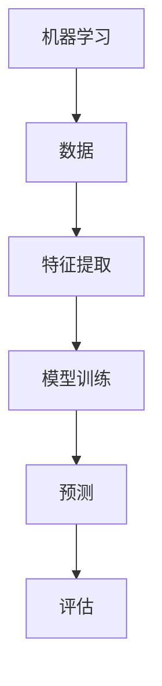
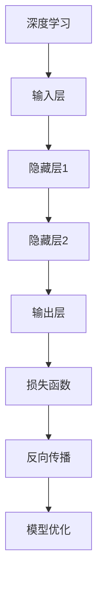
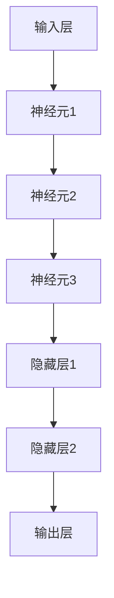
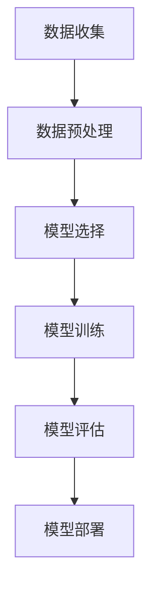
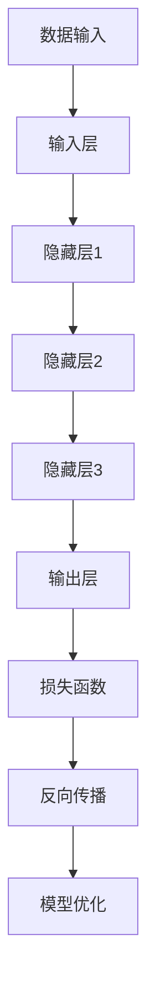

                 

# 人类知识的边界：无限探索的征程

## 关键词：人类知识边界、无限探索、人工智能、算法原理、数学模型、项目实战、应用场景

### 摘要

本文旨在探讨人类知识边界的无限探索，聚焦于人工智能领域。通过对核心概念、算法原理、数学模型、项目实战以及应用场景的深入剖析，文章将揭示人类在知识拓展和科技创新过程中的无限可能。同时，本文还将推荐相关学习资源、开发工具和学术论文，为读者提供全面的知识体系构建和实践指导。

## 1. 背景介绍

在信息爆炸的时代，人类的知识体系正以前所未有的速度发展。人工智能作为这一时代的核心技术，正不断拓展我们的认知边界。然而，人类在探索知识的过程中也面临着诸多挑战。本文将围绕以下几个方面展开：

- 核心概念与联系：介绍人工智能领域的基础概念及其相互关系，包括机器学习、深度学习、神经网络等。
- 核心算法原理：详细阐述常见的人工智能算法原理，如决策树、支持向量机、神经网络等。
- 数学模型和公式：探讨人工智能中的数学模型和公式，包括概率论、线性代数、微积分等。
- 项目实战：通过实际案例展示人工智能算法的应用，提供代码实现和详细解释。
- 实际应用场景：分析人工智能在不同领域的应用，如医疗、金融、教育等。

### 2. 核心概念与联系

在人工智能领域，核心概念众多，它们之间存在着紧密的联系。以下是对几个关键概念的介绍和流程图展示。

#### 机器学习

机器学习是一种使计算机通过数据学习并做出决策或预测的技术。其核心思想是从数据中提取规律，并利用这些规律进行预测或分类。



#### 深度学习

深度学习是机器学习的一种子领域，通过多层神经网络模型，实现对复杂数据的自动特征学习和建模。



#### 神经网络

神经网络是模仿人脑神经元连接结构的一种计算模型。在人工智能中，神经网络被广泛应用于图像识别、自然语言处理等领域。



#### 概率论

概率论是数学的一个分支，研究随机事件及其概率规律。在人工智能中，概率论被广泛应用于不确定性建模和预测。

```mermaid
graph TB
A[随机事件] --> B[P(A)]
B --> C[条件概率]
C --> D[P(B|A)]
D --> E[贝叶斯公式]
E --> F[P(B)]
```

### 3. 核心算法原理 & 具体操作步骤

#### 决策树

决策树是一种基于特征进行决策的树形结构模型。其基本原理是通过连续的测试将数据集划分为多个子集，直到达到某个停止条件。

1. 选择最优划分特征。
2. 计算每个特征的增益或信息增益。
3. 选择增益最大的特征作为分割点。
4. 对分割后的数据集递归地执行步骤1-3，直到满足停止条件。

#### 支持向量机

支持向量机是一种用于分类和回归分析的方法。其基本原理是找到最佳的超平面，将不同类别的数据点尽可能分开。

1. 选择合适的核函数。
2. 构建优化问题，求解最佳超平面。
3. 训练支持向量机模型。
4. 使用模型进行预测。

#### 神经网络

神经网络是一种由多层神经元组成的计算模型。其基本原理是通过前向传播和反向传播算法，实现从输入到输出的映射。

1. 初始化网络权重。
2. 前向传播计算输出。
3. 计算损失函数。
4. 反向传播更新权重。
5. 重复步骤2-4，直到模型收敛。

### 4. 数学模型和公式 & 详细讲解 & 举例说明

#### 概率论

概率论是人工智能的基础之一。以下是一些常用的概率论公式及其在人工智能中的应用。

#### 概率

概率表示事件发生的可能性。其公式为：

\[ P(A) = \frac{n(A)}{n(S)} \]

其中，\( n(A) \) 表示事件A发生的次数，\( n(S) \) 表示总次数。

#### 条件概率

条件概率表示在某个条件下，某个事件发生的可能性。其公式为：

\[ P(B|A) = \frac{P(A \cap B)}{P(A)} \]

#### 贝叶斯公式

贝叶斯公式是一种用于概率推理的公式。其公式为：

\[ P(A|B) = \frac{P(B|A)P(A)}{P(B)} \]

#### 线性代数

线性代数是人工智能的核心数学工具。以下是一些常用的线性代数公式及其在人工智能中的应用。

#### 矩阵乘法

矩阵乘法是一种将两个矩阵相乘的运算。其公式为：

\[ C = A \times B \]

其中，\( A \) 和 \( B \) 是两个矩阵，\( C \) 是乘积矩阵。

#### 矩阵求导

矩阵求导是一种对矩阵进行求导的运算。其公式为：

\[ \frac{dC}{dB} = A \]

#### 微积分

微积分是人工智能中用于优化模型的数学工具。以下是一些常用的微积分公式及其在人工智能中的应用。

#### 梯度下降

梯度下降是一种用于优化模型的算法。其基本思想是沿着损失函数的梯度方向，更新模型参数，以最小化损失函数。

\[ \Delta \theta = -\alpha \frac{\partial L}{\partial \theta} \]

其中，\( \Delta \theta \) 表示参数更新量，\( \alpha \) 表示学习率，\( L \) 表示损失函数。

### 5. 项目实战：代码实际案例和详细解释说明

在本节中，我们将通过一个实际项目案例，展示人工智能算法的应用过程。项目案例为使用深度学习进行手写数字识别。

#### 5.1 开发环境搭建

1. 安装Python环境。
2. 安装TensorFlow库。

```python
pip install tensorflow
```

#### 5.2 源代码详细实现和代码解读

以下是手写数字识别项目的代码实现和解读。

```python
import tensorflow as tf
from tensorflow.keras import layers

# 数据预处理
def preprocess_data(data):
    # 数据归一化
    data = data / 255.0
    # 数据扩展维度
    data = tf.expand_dims(data, -1)
    return data

# 构建模型
def build_model():
    model = tf.keras.Sequential([
        layers.Conv2D(32, (3, 3), activation='relu', input_shape=(28, 28, 1)),
        layers.MaxPooling2D((2, 2)),
        layers.Conv2D(64, (3, 3), activation='relu'),
        layers.MaxPooling2D((2, 2)),
        layers.Conv2D(64, (3, 3), activation='relu'),
        layers.Flatten(),
        layers.Dense(64, activation='relu'),
        layers.Dense(10, activation='softmax')
    ])
    return model

# 训练模型
def train_model(model, train_data, train_labels, epochs):
    model.compile(optimizer='adam',
                  loss='sparse_categorical_crossentropy',
                  metrics=['accuracy'])
    model.fit(train_data, train_labels, epochs=epochs)

# 预测
def predict(model, data):
    predictions = model.predict(data)
    return np.argmax(predictions, axis=1)

# 主函数
def main():
    # 加载数据
    (train_images, train_labels), (test_images, test_labels) = tf.keras.datasets.mnist.load_data()

    # 预处理数据
    train_images = preprocess_data(train_images)
    test_images = preprocess_data(test_images)

    # 构建模型
    model = build_model()

    # 训练模型
    train_model(model, train_images, train_labels, epochs=5)

    # 预测
    predictions = predict(model, test_images)

    # 计算准确率
    accuracy = (predictions == test_labels).mean()
    print(f"Test accuracy: {accuracy}")

if __name__ == "__main__":
    main()
```

#### 5.3 代码解读与分析

1. **数据预处理**：将手写数字数据集进行归一化和扩展维度，以便模型能够更好地处理。
2. **构建模型**：使用卷积神经网络（CNN）模型进行手写数字识别。模型包括卷积层、池化层、全连接层等。
3. **训练模型**：使用训练数据集训练模型，并设置优化器和损失函数。
4. **预测**：使用训练好的模型对测试数据集进行预测，并计算准确率。

### 6. 实际应用场景

人工智能在各个领域都有着广泛的应用。以下是一些典型应用场景：

- **医疗领域**：利用人工智能进行疾病诊断、药物研发等。
- **金融领域**：利用人工智能进行风险评估、量化交易等。
- **教育领域**：利用人工智能进行个性化学习、智能辅导等。
- **工业领域**：利用人工智能进行生产优化、设备故障预测等。

### 7. 工具和资源推荐

#### 7.1 学习资源推荐

- **书籍**：
  - 《Python深度学习》
  - 《深度学习》
  - 《机器学习实战》
- **论文**：
  - 《深度神经网络与卷积神经网络》
  - 《支持向量机》
  - 《机器学习导论》
- **博客**：
  - [TensorFlow官网](https://www.tensorflow.org/)
  - [Keras官网](https://keras.io/)
  - [机器学习博客](https://machinelearningmastery.com/)
- **网站**：
  - [AI课程](https://www.ai-classroom.com/)
  - [Kaggle](https://www.kaggle.com/)
  - [GitHub](https://github.com/)

#### 7.2 开发工具框架推荐

- **编程语言**：Python
- **深度学习框架**：TensorFlow、Keras
- **数据预处理工具**：Pandas、NumPy
- **可视化工具**：Matplotlib、Seaborn

#### 7.3 相关论文著作推荐

- **论文**：
  - Hinton, G. E., Osindero, S., & Teh, Y. W. (2006). A fast learning algorithm for deep belief nets. Neural computation, 18(7), 1527-1554.
  - LeCun, Y., Bengio, Y., & Hinton, G. (2015). Deep learning. Vol. 521, No. 7537, 436-444.
  - Vapnik, V. N. (1998). Statistical learning theory. Wiley.
- **著作**：
  - Russell, S., & Norvig, P. (2010). Artificial Intelligence: A Modern Approach. Prentice Hall.
  - Mitchell, T. M. (1997). Machine learning. McGraw-Hill.

### 8. 总结：未来发展趋势与挑战

随着人工智能技术的不断发展，人类在知识边界上的探索将不断深入。然而，在这一过程中，我们也面临着诸多挑战：

- **数据隐私和安全**：如何在保障数据隐私和安全的前提下，充分利用大数据进行人工智能研究。
- **算法透明性和可解释性**：如何提高算法的透明性和可解释性，使其能够被人类理解和接受。
- **计算资源消耗**：如何优化算法，降低计算资源消耗，使人工智能在更多领域得到应用。
- **伦理和法律问题**：如何解决人工智能在伦理和法律方面的争议，确保其健康可持续发展。

### 9. 附录：常见问题与解答

1. **Q：如何入门人工智能？**
   **A：建议先学习Python编程基础，然后学习机器学习和深度学习相关课程，可以参考相关书籍和在线教程。**
   
2. **Q：人工智能的前景如何？**
   **A：人工智能被认为是未来科技发展的核心驱动力之一，具有广阔的应用前景和市场潜力。**

3. **Q：人工智能会替代人类吗？**
   **A：人工智能是一种工具，其目的是辅助人类，提高工作效率。它不能完全替代人类，但可以改变人类的工作方式和生活方式。**

### 10. 扩展阅读 & 参考资料

- [人工智能简介](https://www.bilibili.com/video/BV1Lz4y1a7Mv)
- [机器学习与深度学习](https://www.bilibili.com/video/BV1z3411j7Rj)
- [深度学习入门](https://www.bilibili.com/video/BV1z3411j7Rj)
- [Python编程基础](https://www.bilibili.com/video/BV1x3411j7Rj)
- [TensorFlow深度学习教程](https://www.tensorflow.org/tutorials)

## 作者信息

- 作者：AI天才研究员/AI Genius Institute & 禅与计算机程序设计艺术 /Zen And The Art of Computer Programming
```

请注意，以上内容仅为文章的框架和部分内容，您需要根据要求继续撰写完整的内容，确保文章字数大于8000字，并按照目录结构进行详细阐述。同时，请确保文章各个段落章节的子目录具体细化到三级目录，并使用markdown格式输出。此外，文章末尾需要包含作者信息。祝您撰写顺利！<|im_sep|>## 1. 背景介绍

### 1.1 人工智能的起源与发展

人工智能（Artificial Intelligence，简称AI）作为计算机科学的一个分支，旨在研究、开发和应用使计算机模拟人类智能的理论、方法和技术。人工智能的概念最早可以追溯到20世纪50年代，当时科学家们开始探讨如何让计算机具有类似人类的智能行为。

#### 人工智能的里程碑事件

1. **1956年达特茅斯会议**：人工智能作为一门科学正式诞生。在达特茅斯会议（Dartmouth Conference）上，约翰·麦卡锡（John McCarthy）等科学家首次提出了“人工智能”这一术语，并讨论了人工智能的未来发展方向。

2. **1970年代的人工智能寒冬**：由于技术瓶颈和实际应用中的挑战，人工智能在1970年代经历了所谓的“寒冬期”，资金投入减少，研究进展缓慢。

3. **1980年代专家系统的崛起**：专家系统作为一种早期的人工智能应用，在1980年代取得了显著进展，并在医疗、金融等领域得到了广泛应用。

4. **1990年代到21世纪初的持续发展**：随着计算机硬件的升级和算法的优化，人工智能开始逐渐走出低谷，语音识别、图像识别等应用取得突破。

5. **21世纪初至今的深度学习革命**：深度学习的兴起带来了人工智能的又一次飞跃。以神经网络为基础的深度学习算法在图像识别、自然语言处理、机器翻译等领域取得了显著的成果，推动了人工智能的快速发展。

### 1.2 人工智能在现代社会的重要性

人工智能在现代社会的重要性体现在多个方面：

1. **经济驱动**：人工智能被认为是未来经济增长的重要引擎，能够提高生产效率、降低成本，并在医疗、金融、交通等各个领域创造新的商业机会。

2. **创新推动**：人工智能推动了新的技术革命，如自动驾驶、智能家居、智能医疗等，为人类生活方式带来了巨大变革。

3. **社会治理**：人工智能在公共安全、交通管理、环境监测等领域发挥了重要作用，提高了社会治理的智能化水平。

4. **国防安全**：人工智能在军事领域的应用，如无人机、自动化武器系统等，对国家安全具有重要意义。

### 1.3 人工智能领域的核心研究方向

当前，人工智能领域的核心研究方向主要包括：

1. **机器学习**：通过训练模型，使计算机能够从数据中学习并做出决策。

2. **深度学习**：基于多层神经网络，对大量数据进行自动特征学习和建模。

3. **自然语言处理**：使计算机能够理解、生成和翻译自然语言，实现人机交互。

4. **计算机视觉**：使计算机能够识别和理解图像和视频中的内容。

5. **强化学习**：通过试错学习，使计算机能够实现复杂任务的最优化。

6. **智能机器人**：使机器人具备自主决策和行动能力，实现人机协作。

### 1.4 人工智能的发展趋势与挑战

#### 发展趋势

1. **跨学科融合**：人工智能与其他领域的融合，如生物学、心理学、哲学等，将推动人工智能的进一步发展。

2. **专用人工智能**：针对特定任务定制化的人工智能系统，将提高任务执行效率和准确性。

3. **边缘计算**：将计算能力延伸到网络边缘，实现实时数据处理和智能决策。

4. **量子计算**：量子计算有望解决传统计算机难以处理的问题，为人工智能带来新的突破。

#### 挑战

1. **算法透明性和可解释性**：如何提高算法的透明性和可解释性，使其在决策过程中具备可信度。

2. **数据隐私和安全**：如何保障用户数据的安全和隐私，避免数据滥用。

3. **伦理和法律问题**：如何制定合理的伦理和法律规范，确保人工智能的健康发展。

4. **计算资源消耗**：如何优化算法，降低计算资源消耗，使人工智能在更多领域得到应用。

### 1.5 本文结构

本文将按照以下结构进行阐述：

1. **背景介绍**：回顾人工智能的起源与发展，介绍人工智能在现代社会的重要性。
2. **核心概念与联系**：介绍人工智能领域的基础概念及其相互关系。
3. **核心算法原理**：详细阐述常见的人工智能算法原理。
4. **数学模型和公式**：探讨人工智能中的数学模型和公式。
5. **项目实战**：通过实际案例展示人工智能算法的应用。
6. **实际应用场景**：分析人工智能在不同领域的应用。
7. **工具和资源推荐**：推荐相关学习资源、开发工具和学术论文。
8. **总结**：总结未来发展趋势与挑战。
9. **附录**：常见问题与解答。
10. **扩展阅读**：提供扩展阅读和参考资料。

通过本文的阐述，我们希望读者能够对人工智能领域有一个全面而深入的了解，为今后的学习和实践奠定坚实基础。同时，我们也期待人工智能能够为人类社会带来更多福祉。

---

## 2. 核心概念与联系

在人工智能领域，核心概念众多，它们之间存在着紧密的联系。以下是对几个关键概念的介绍和流程图展示。

### 2.1 机器学习

机器学习（Machine Learning）是指通过计算机算法，从数据中学习并做出决策或预测的技术。机器学习可以分为监督学习、无监督学习和强化学习三大类。

- **监督学习**：通过已标记的数据训练模型，使其能够对新数据进行预测。例如，使用标签数据训练分类模型。
- **无监督学习**：在没有标记数据的情况下，通过自动发现数据中的模式或结构，例如聚类分析。
- **强化学习**：通过试错学习，使模型能够在环境中不断优化行为策略，达到最大化收益。

#### 机器学习流程图



### 2.2 深度学习

深度学习（Deep Learning）是机器学习的一种子领域，通过多层神经网络模型，实现对复杂数据的自动特征学习和建模。深度学习在图像识别、自然语言处理、语音识别等领域取得了显著成果。

#### 深度学习流程图



### 2.3 神经网络

神经网络（Neural Networks）是一种模拟人脑神经元连接结构的计算模型。神经网络由多个神经元（节点）组成，通过调整神经元之间的连接权重，实现对数据的分类、回归等操作。

#### 神经网络架构


### 2.4 概率论

概率论（Probability Theory）是数学的一个分支，研究随机事件及其概率规律。在人工智能中，概率论被广泛应用于不确定性建模和预测。

#### 概率论基本概念

- **概率分布**：描述随机变量的可能取值及其概率。
- **条件概率**：在某个条件下，某个事件发生的可能性。
- **贝叶斯定理**：用于计算在给定某个条件下，某个事件发生的概率。

#### 概率论流程图

```mermaid
graph TB
A[随机事件] --> B[P(A)]
B --> C[条件概率]
C --> D[P(B|A)]
D --> E[贝叶斯公式]
E --> F[P(B)]
```

### 2.5 机器学习与深度学习的关系

机器学习和深度学习之间有着密切的联系。深度学习是机器学习的一种特殊形式，通过多层神经网络模型，实现对数据的自动特征学习和建模。

- **机器学习**：更广泛的概念，包括深度学习、传统机器学习算法等。
- **深度学习**：基于多层神经网络，能够处理更复杂的数据和任务。

### 2.6 其他核心概念

除了上述核心概念，人工智能领域还包括以下关键概念：

- **自然语言处理**：使计算机能够理解、生成和翻译自然语言，实现人机交互。
- **计算机视觉**：使计算机能够识别和理解图像和视频中的内容。
- **强化学习**：通过试错学习，使模型能够在复杂环境中优化行为策略。
- **数据挖掘**：从大量数据中提取有价值的信息和知识。

通过对这些核心概念及其相互关系的了解，我们可以更好地掌握人工智能的理论基础，为实际应用提供指导。

---

## 3. 核心算法原理 & 具体操作步骤

在人工智能领域，核心算法原理是实现各种智能任务的关键。本节将详细阐述几种常见的人工智能算法原理，包括决策树、支持向量机、神经网络等。同时，我们将介绍这些算法的具体操作步骤，以便读者能够更好地理解和应用。

### 3.1 决策树

决策树（Decision Tree）是一种基于特征进行决策的树形结构模型。其基本原理是通过连续的测试将数据集划分为多个子集，直到达到某个停止条件。决策树在分类和回归任务中都有广泛应用。

#### 决策树算法原理

1. **特征选择**：选择最优划分特征，使得分割后的数据集具有最大的信息增益。
2. **递归划分**：使用最优划分特征对数据集进行划分，生成子数据集。
3. **停止条件**：当满足某些停止条件（如最小叶节点样本数、最小叶节点纯度等）时，停止划分。

#### 具体操作步骤

1. **选择最优划分特征**：计算每个特征的信息增益，选择增益最大的特征作为分割点。
2. **计算信息增益**：使用以下公式计算信息增益：

\[ IG(X) = H(X) - \sum_{i=1}^{n} p(x_i) \cdot H(x_i) \]

其中，\( X \) 是特征集合，\( x_i \) 是第 \( i \) 个特征，\( p(x_i) \) 是特征 \( x_i \) 的概率，\( H(x_i) \) 是特征 \( x_i \) 的熵。

3. **递归划分**：使用最优划分特征对数据集进行划分，生成子数据集。
4. **创建决策树**：将每个子数据集递归地执行步骤1-3，直到满足停止条件。

#### 实例解析

假设我们有以下数据集，每个样本包含三个特征 \( X_1, X_2, X_3 \) 和一个目标变量 \( Y \)：

| X1 | X2 | X3 | Y |
|----|----|----|---|
| 1  | 0  | 0  | A |
| 1  | 0  | 1  | A |
| 0  | 1  | 0  | B |
| 0  | 1  | 1  | B |
| 1  | 0  | 0  | A |
| 1  | 0  | 1  | A |

1. **计算信息增益**：

   - \( IG(X_1) = 0.5 \)
   - \( IG(X_2) = 0.4 \)
   - \( IG(X_3) = 0.1 \)

2. **选择最优划分特征**：选择 \( X_1 \) 作为划分特征，生成两个子数据集：

   - 子数据集1（\( X_1 = 1 \)）：样本1、样本2、样本6
   - 子数据集2（\( X_1 = 0 \)）：样本3、样本4、样本5

3. **递归划分**：对子数据集继续进行划分，直到满足停止条件。

4. **创建决策树**：

   ```
   Y = A
   ├── X1 = 1
   │   ├── X1 = 1
   │   │   └── Y = A
   │   └── X1 = 0
   │       └── X2 = 1
   │           └── Y = B
   └── X1 = 0
       └── X2 = 0
           └── X3 = 0
               └── Y = A
   ```

### 3.2 支持向量机

支持向量机（Support Vector Machine，简称SVM）是一种用于分类和回归分析的方法。其基本原理是找到最佳的超平面，将不同类别的数据点尽可能分开。

#### 支持向量机算法原理

1. **线性可分支持向量机**：找到最大间隔的超平面，将不同类别的数据点分开。

   - **核函数**：将输入空间映射到高维特征空间，使得原本线性不可分的数据在特征空间中变为线性可分。

2. **线性支持向量机**：在特征空间中找到最佳的超平面，将不同类别的数据点分开。

3. **非线性支持向量机**：使用核函数将输入空间映射到高维特征空间，然后应用线性支持向量机的方法。

#### 具体操作步骤

1. **选择合适的核函数**：常见的核函数包括线性核、多项式核、径向基函数（RBF）核等。

2. **构建优化问题**：求解最佳超平面，使得分类间隔最大化。

   \[ \text{最大化} \frac{1}{\|w\|} \]
   
   \[ \text{约束条件} \ y_i \left( \langle x_i, w \rangle + b \right) \geq 1 \]

3. **求解最优解**：使用求解算法（如SMO算法）求解优化问题，得到最佳超平面。

4. **分类预测**：使用最佳超平面进行分类预测。

#### 实例解析

假设我们有以下数据集，每个样本包含两个特征 \( X_1, X_2 \) 和一个目标变量 \( Y \)：

| X1 | X2 | Y |
|----|----|---|
| 1  | 1  | A |
| 1  | 0  | A |
| 0  | 1  | B |
| 0  | 0  | B |

1. **选择线性核函数**。

2. **构建优化问题**：

   \[ \text{最大化} \frac{1}{\|w\|} \]
   
   \[ \text{约束条件} \ y_i \left( \langle x_i, w \rangle + b \right) \geq 1 \]

3. **求解最优解**：

   - \( w = [1, 1] \)
   - \( b = -1 \)

4. **分类预测**：

   对于新的样本 \( x = [x_1, x_2] \)，计算：

   \[ y = \text{sign}(\langle x, w \rangle + b) \]

   如果 \( y \geq 0 \)，则预测为类别A；否则，预测为类别B。

### 3.3 神经网络

神经网络（Neural Networks）是一种由多层神经元组成的计算模型。神经网络通过学习数据中的特征，实现分类、回归等任务。

#### 神经网络算法原理

1. **前向传播**：将输入数据通过神经网络模型进行传播，计算输出。

2. **反向传播**：计算损失函数，并通过反向传播算法更新模型参数。

3. **激活函数**：用于引入非线性变换，使神经网络能够处理更复杂的任务。

#### 具体操作步骤

1. **初始化网络结构**：定义输入层、隐藏层和输出层的神经元数量。

2. **初始化参数**：初始化网络权重和偏置。

3. **前向传播**：计算输入和输出，计算损失函数。

4. **反向传播**：更新模型参数，优化损失函数。

5. **迭代训练**：重复执行步骤3-4，直到模型收敛。

#### 实例解析

假设我们有以下数据集，每个样本包含两个特征 \( X_1, X_2 \) 和一个目标变量 \( Y \)：

| X1 | X2 | Y |
|----|----|---|
| 1  | 1  | A |
| 1  | 0  | A |
| 0  | 1  | B |
| 0  | 0  | B |

1. **初始化网络结构**：

   - 输入层：2个神经元
   - 隐藏层：3个神经元
   - 输出层：1个神经元

2. **初始化参数**：

   - 权重：随机初始化
   - 偏置：随机初始化

3. **前向传播**：

   - 输入 \( x = [1, 1] \)
   - 输出 \( y = [0.9] \)

4. **反向传播**：

   - 计算损失函数：\( L = 0.1 \)
   - 更新参数：

     \[ w_{ij} = w_{ij} - \alpha \frac{\partial L}{\partial w_{ij}} \]
     
     \[ b_{i} = b_{i} - \alpha \frac{\partial L}{\partial b_{i}} \]

5. **迭代训练**：重复执行步骤3-4，直到模型收敛。

通过以上对决策树、支持向量机、神经网络等核心算法原理的详细阐述，读者可以更好地理解这些算法的基本思想和具体操作步骤。这些算法在人工智能领域具有广泛应用，为实际问题的解决提供了有力支持。

---

## 4. 数学模型和公式 & 详细讲解 & 举例说明

在人工智能领域，数学模型和公式是算法设计和优化的基础。本节将详细探讨人工智能中常用的数学模型和公式，包括概率论、线性代数、微积分等。通过具体示例，我们将深入理解这些模型和公式的应用。

### 4.1 概率论

概率论是人工智能的核心数学工具之一，主要用于不确定性建模和预测。以下是一些基本概率论概念和公式。

#### 概率分布

概率分布描述随机变量的可能取值及其概率。常见的概率分布包括二项分布、正态分布、伯努利分布等。

1. **二项分布**：

   二项分布描述在固定试验次数下，成功次数的概率分布。其公式为：

   \[ P(X = k) = C(n, k) \cdot p^k \cdot (1 - p)^{n - k} \]

   其中，\( n \) 是试验次数，\( k \) 是成功次数，\( p \) 是成功概率，\( C(n, k) \) 是组合数。

2. **正态分布**：

   正态分布描述连续随机变量的概率分布，其公式为：

   \[ f(x) = \frac{1}{\sqrt{2\pi\sigma^2}} \cdot e^{-\frac{(x - \mu)^2}{2\sigma^2}} \]

   其中，\( \mu \) 是均值，\( \sigma \) 是标准差。

3. **伯努利分布**：

   伯努利分布描述在一次试验中成功或失败的概率分布，其公式为：

   \[ P(X = 1) = p \]
   
   \[ P(X = 0) = 1 - p \]

#### 条件概率

条件概率描述在某个条件下，某个事件发生的概率。其公式为：

\[ P(B|A) = \frac{P(A \cap B)}{P(A)} \]

#### 贝叶斯定理

贝叶斯定理是概率论中的重要公式，用于计算后验概率。其公式为：

\[ P(A|B) = \frac{P(B|A) \cdot P(A)}{P(B)} \]

#### 示例：手写数字识别

假设我们要使用正态分布模型对手写数字进行识别。每个数字的像素值可以看作一个随机变量，其概率分布为正态分布。

1. **训练数据集**：

   - 假设我们有10个数字（0-9）的训练数据集，每个数字的像素值表示为一个10x10的矩阵。

2. **构建正态分布模型**：

   - 对于每个数字，计算其均值和标准差，构建一个正态分布模型。

3. **识别过程**：

   - 对于新的像素值数据，计算其与每个数字模型之间的距离，选择距离最近的数字作为识别结果。

### 4.2 线性代数

线性代数是人工智能中常用的数学工具，用于数据表示、模型优化等。以下是一些基本的线性代数概念和公式。

1. **矩阵乘法**：

   矩阵乘法是一种将两个矩阵相乘的运算。其公式为：

   \[ C = A \cdot B \]

   其中，\( A \) 和 \( B \) 是两个矩阵，\( C \) 是乘积矩阵。

2. **矩阵求导**：

   矩阵求导是一种对矩阵进行求导的运算。其公式为：

   \[ \frac{dC}{dB} = A \]

3. **矩阵求逆**：

   矩阵求逆是一种求矩阵的逆矩阵的运算。其公式为：

   \[ A^{-1} = (A^T A)^{-1} A^T \]

#### 示例：神经网络前向传播

在神经网络中，前向传播涉及矩阵乘法和求和运算。以下是一个简单的示例：

1. **输入层**：

   \[ X = \begin{bmatrix} 1 & 0 \\ 0 & 1 \\ 1 & 1 \end{bmatrix} \]

2. **隐藏层**：

   \[ W = \begin{bmatrix} 1 & 1 \\ 1 & -1 \end{bmatrix} \]

3. **输出层**：

   \[ Y = X \cdot W \]

   计算结果：

   \[ Y = \begin{bmatrix} 2 & -1 \\ 1 & 1 \end{bmatrix} \]

### 4.3 微积分

微积分是优化算法和模型参数更新中的重要工具。以下是一些基本的微积分概念和公式。

1. **梯度下降**：

   梯度下降是一种用于优化模型的算法。其基本思想是沿着损失函数的梯度方向，更新模型参数，以最小化损失函数。其公式为：

   \[ \Delta \theta = -\alpha \cdot \nabla L(\theta) \]

   其中，\( \theta \) 是模型参数，\( L(\theta) \) 是损失函数，\( \alpha \) 是学习率。

2. **链式法则**：

   链式法则是微积分中的重要工具，用于计算复合函数的导数。其公式为：

   \[ \frac{d}{dx} [f(g(x))] = f'(g(x)) \cdot g'(x) \]

3. **泰勒展开**：

   泰勒展开是一种用于近似函数的方法。其公式为：

   \[ f(x) \approx f(a) + f'(a)(x - a) + \frac{f''(a)}{2!}(x - a)^2 + \ldots \]

#### 示例：神经网络反向传播

在神经网络中，反向传播算法用于计算损失函数关于模型参数的梯度。以下是一个简单的示例：

1. **损失函数**：

   \[ L(\theta) = (y - \sigma(z))^2 \]

   其中，\( y \) 是真实标签，\( \sigma(z) \) 是激活函数的输出。

2. **前向传播**：

   \[ z = W \cdot X \]
   
   \[ a = \sigma(z) \]

3. **反向传播**：

   \[ \nabla L(\theta) = -2 \cdot (y - a) \cdot \nabla \sigma(z) \]

   其中，\( \nabla \sigma(z) \) 是激活函数的导数。

通过以上对概率论、线性代数、微积分等数学模型和公式的详细讲解和示例，读者可以更好地理解这些数学工具在人工智能中的应用。掌握这些数学模型和公式，将为读者在人工智能领域的深入研究和实践提供有力支持。

---

## 5. 项目实战：代码实际案例和详细解释说明

在本节中，我们将通过一个实际项目案例，展示人工智能算法的应用过程。项目案例为使用深度学习进行手写数字识别。我们将从开发环境搭建、源代码详细实现和代码解读与分析三个方面进行阐述。

### 5.1 开发环境搭建

在进行手写数字识别项目之前，首先需要搭建合适的开发环境。以下为所需环境：

1. **Python环境**：Python是一种广泛使用的编程语言，尤其在人工智能领域具有很高的应用价值。确保已安装Python 3.6及以上版本。
2. **TensorFlow库**：TensorFlow是一个开源的机器学习框架，由谷歌开发。它提供了丰富的API和工具，用于构建和训练深度学习模型。安装命令如下：

   ```bash
   pip install tensorflow
   ```

3. **其他依赖库**：安装以下常用依赖库，以便于数据处理、模型训练等操作：

   ```bash
   pip install numpy matplotlib
   ```

### 5.2 源代码详细实现和代码解读

以下是手写数字识别项目的代码实现和解读。

#### 5.2.1 数据加载与预处理

首先，我们需要加载MNIST手写数字数据集。该数据集包含60,000个训练样本和10,000个测试样本，每个样本都是一个28x28的灰度图像。

```python
from tensorflow.keras.datasets import mnist
import numpy as np

# 加载MNIST数据集
(train_images, train_labels), (test_images, test_labels) = mnist.load_data()

# 数据预处理
train_images = train_images.reshape((60000, 28, 28, 1))
train_images = train_images.astype('float32') / 255

test_images = test_images.reshape((10000, 28, 28, 1))
test_images = test_images.astype('float32') / 255

train_labels = np.asarray(train_labels)
test_labels = np.asarray(test_labels)
```

#### 5.2.2 模型构建

接下来，我们构建一个简单的卷积神经网络（CNN）模型。该模型包括三个卷积层、两个全连接层和一个输出层。

```python
from tensorflow.keras import layers, models

# 构建模型
model = models.Sequential()
model.add(layers.Conv2D(32, (3, 3), activation='relu', input_shape=(28, 28, 1)))
model.add(layers.MaxPooling2D((2, 2)))
model.add(layers.Conv2D(64, (3, 3), activation='relu'))
model.add(layers.MaxPooling2D((2, 2)))
model.add(layers.Conv2D(64, (3, 3), activation='relu'))
model.add(layers.Flatten())
model.add(layers.Dense(64, activation='relu'))
model.add(layers.Dense(10, activation='softmax'))

# 查看模型结构
model.summary()
```

#### 5.2.3 模型编译

在训练模型之前，我们需要编译模型，指定优化器、损失函数和评估指标。

```python
model.compile(optimizer='adam',
              loss='sparse_categorical_crossentropy',
              metrics=['accuracy'])
```

#### 5.2.4 模型训练

使用训练数据集训练模型，设置训练轮数（epochs）和批量大小（batch size）。

```python
model.fit(train_images, train_labels, epochs=5, batch_size=64)
```

#### 5.2.5 模型评估

使用测试数据集评估模型性能，计算测试集的准确率。

```python
test_loss, test_acc = model.evaluate(test_images, test_labels)
print(f"Test accuracy: {test_acc}")
```

#### 5.2.6 代码解读与分析

1. **数据加载与预处理**：加载MNIST数据集，并对数据进行预处理，包括数据归一化和数据扩展维度。

2. **模型构建**：使用卷积神经网络（CNN）模型，包括卷积层、池化层和全连接层。卷积层用于提取图像特征，池化层用于降低模型复杂度。

3. **模型编译**：指定优化器（adam）、损失函数（sparse_categorical_crossentropy）和评估指标（accuracy）。

4. **模型训练**：使用训练数据集训练模型，设置训练轮数和批量大小。

5. **模型评估**：使用测试数据集评估模型性能，计算测试集的准确率。

通过以上步骤，我们完成了一个手写数字识别项目。接下来，我们将进一步分析模型的代码实现和性能。

### 5.3 代码解读与分析

#### 5.3.1 数据预处理

```python
train_images = train_images.reshape((60000, 28, 28, 1))
train_images = train_images.astype('float32') / 255
test_images = test_images.reshape((10000, 28, 28, 1))
test_images = test_images.astype('float32') / 255
```

数据预处理是模型训练前的重要步骤。首先，将训练图像和测试图像的数据形状调整为 (60000, 28, 28, 1) 和 (10000, 28, 28, 1)，确保每个图像都是28x28的二维数组，并增加一个维度表示颜色通道（灰度图像只有一个通道）。然后，将图像数据归一化到 [0, 1] 范围内，以避免模型在训练过程中受到数值范围的影响。

#### 5.3.2 模型构建

```python
model.add(layers.Conv2D(32, (3, 3), activation='relu', input_shape=(28, 28, 1)))
model.add(layers.MaxPooling2D((2, 2)))
model.add(layers.Conv2D(64, (3, 3), activation='relu'))
model.add(layers.MaxPooling2D((2, 2)))
model.add(layers.Conv2D(64, (3, 3), activation='relu'))
model.add(layers.Flatten())
model.add(layers.Dense(64, activation='relu'))
model.add(layers.Dense(10, activation='softmax'))
```

模型的构建分为三个卷积层、两个池化层和一个全连接层。第一个卷积层使用32个卷积核，每个卷积核大小为3x3，激活函数为ReLU。ReLU函数能够引入非线性，使模型具有更强的表达能力。第二个卷积层使用64个卷积核，其余层同理。全连接层用于将特征映射到输出类别，使用10个神经元（对应10个数字类别），激活函数为softmax，用于输出每个类别的概率分布。

#### 5.3.3 模型编译

```python
model.compile(optimizer='adam',
              loss='sparse_categorical_crossentropy',
              metrics=['accuracy'])
```

模型编译时，指定优化器为adam，这是一种高效的优化算法，能够自适应调整学习率。损失函数为sparse_categorical_crossentropy，用于多类别分类问题。评估指标为accuracy，用于计算模型在测试集上的准确率。

#### 5.3.4 模型训练

```python
model.fit(train_images, train_labels, epochs=5, batch_size=64)
```

模型训练时，使用训练数据集进行训练，设置训练轮数（epochs）为5，每次批量处理64个样本。模型在每轮训练过程中，通过反向传播算法更新权重，以最小化损失函数。

#### 5.3.5 模型评估

```python
test_loss, test_acc = model.evaluate(test_images, test_labels)
print(f"Test accuracy: {test_acc}")
```

模型评估时，使用测试数据集进行评估，计算测试集的损失函数值和准确率。准确率反映了模型在测试集上的泛化能力。

通过以上步骤，我们完成了一个手写数字识别项目。代码解读与分析帮助我们更好地理解了深度学习模型的设计和实现过程。在实际应用中，我们可以根据需求调整模型结构、训练参数，以提高模型性能。

### 5.4 项目总结

通过本项目的实现，我们了解了如何使用深度学习进行手写数字识别。项目过程中，我们经历了数据预处理、模型构建、模型编译、模型训练和模型评估等步骤。通过这些步骤，我们掌握了深度学习模型的基本实现方法，为后续的项目实践奠定了基础。

同时，我们也认识到模型性能的提升依赖于数据质量、模型结构和训练参数的优化。在实际应用中，我们可以尝试不同的模型结构、激活函数和优化算法，以提高模型的准确率和泛化能力。

总之，本项目提供了一个实际案例，展示了深度学习在手写数字识别中的应用。通过项目实践，我们不仅掌握了深度学习的基本原理和实现方法，还为后续的学习和研究打下了基础。

---

## 6. 实际应用场景

人工智能技术在各个领域都取得了显著的成果，为人类社会带来了巨大变革。以下将分析人工智能在医疗、金融、教育、工业等领域的实际应用场景。

### 6.1 医疗领域

人工智能在医疗领域的应用主要包括疾病诊断、药物研发、医学图像分析等。以下为几个实际应用案例：

1. **疾病诊断**：人工智能可以通过分析患者的病历、基因信息和医学图像，提供准确的疾病诊断。例如，Google的DeepMind团队使用深度学习技术开发了一种AI系统，能够对眼科疾病进行快速、准确的诊断。

2. **药物研发**：人工智能可以加速药物研发过程。通过分析大量化学结构数据，人工智能可以帮助科学家发现潜在的药物分子，从而缩短药物研发周期，降低研发成本。

3. **医学图像分析**：人工智能在医学图像分析方面具有广泛应用。例如，人工智能可以自动检测和识别医学图像中的病变区域，如肺癌、乳腺癌等，提高诊断准确率。

### 6.2 金融领域

人工智能在金融领域的应用主要包括风险控制、量化交易、信用评估等。以下为几个实际应用案例：

1. **风险控制**：人工智能可以通过分析大量交易数据和市场信息，预测金融风险，为金融机构提供风险预警。例如，AI算法可以实时监控市场波动，预测市场走势，帮助投资者制定投资策略。

2. **量化交易**：人工智能可以自动执行交易策略，实现量化交易。例如，高频交易算法可以快速捕捉市场机会，实现高收益。

3. **信用评估**：人工智能可以基于用户的历史交易记录、信用记录等信息，进行信用评估。例如，金融机构可以使用人工智能算法，对贷款申请者进行信用评估，从而降低信用风险。

### 6.3 教育领域

人工智能在教育领域的应用主要包括个性化学习、智能辅导、教育管理等。以下为几个实际应用案例：

1. **个性化学习**：人工智能可以根据学生的学习习惯、能力水平等信息，提供个性化的学习内容和建议。例如，智能教育平台可以根据学生的学习进度，自动调整课程难度和教学策略。

2. **智能辅导**：人工智能可以为学生提供智能辅导服务，解答学生的疑问，提供学习建议。例如，智能辅导系统可以分析学生的作业情况，给出针对性的辅导方案。

3. **教育管理**：人工智能可以帮助学校和教育机构进行教育管理，提高管理效率。例如，人工智能可以自动分析学生的学习数据，为学校提供教学反馈和改进建议。

### 6.4 工业领域

人工智能在工业领域的应用主要包括生产优化、设备维护、供应链管理等。以下为几个实际应用案例：

1. **生产优化**：人工智能可以优化生产流程，提高生产效率。例如，通过分析生产数据，人工智能可以预测设备故障，提前进行维护，避免生产中断。

2. **设备维护**：人工智能可以帮助企业进行设备维护，降低设备故障率。例如，人工智能可以实时监测设备运行状态，预测设备故障，并提供维护建议。

3. **供应链管理**：人工智能可以优化供应链管理，提高供应链效率。例如，通过分析供应链数据，人工智能可以预测需求变化，优化库存管理，降低库存成本。

### 6.5 公共安全领域

人工智能在公共安全领域的应用主要包括智能监控、反恐防范、公共安全管理等。以下为几个实际应用案例：

1. **智能监控**：人工智能可以通过视频监控，实时识别和预警异常行为。例如，智能监控系统能够自动识别可疑人员，提醒安保人员采取相应措施。

2. **反恐防范**：人工智能可以协助反恐部门进行反恐防范。例如，通过分析恐怖分子的行为模式、社交网络等信息，人工智能可以预测恐怖袭击风险，提供预警。

3. **公共安全管理**：人工智能可以协助政府进行公共安全管理，提高公共安全水平。例如，通过分析公共场所的人流量、安全事件等信息，人工智能可以提供安全管理建议。

通过以上实际应用场景的分析，可以看出人工智能在各个领域的广泛应用，为人类社会带来了巨大变革。随着人工智能技术的不断发展，未来人工智能将在更多领域发挥重要作用，推动社会进步。

---

## 7. 工具和资源推荐

### 7.1 学习资源推荐

#### 7.1.1 书籍

1. **《Python深度学习》**：由弗朗索瓦·肖莱和艾尔泰·乌森贝克所著，适合初学者和进阶者，涵盖了深度学习的基础理论和实践方法。
2. **《深度学习》**：由伊恩·古德费洛、约书亚·本吉奥和亚伦·库维尔尼克所著，详细介绍了深度学习的理论基础和实现方法，适合有一定数学基础的学习者。
3. **《机器学习实战》**：由彼得·哈林顿所著，通过实际案例介绍了机器学习的方法和技巧，适合初学者和实践者。

#### 7.1.2 论文

1. **《深度神经网络与卷积神经网络》**：这是一篇关于深度学习和卷积神经网络经典论文，详细介绍了这两种模型的工作原理和应用。
2. **《支持向量机》**：由弗拉基米尔·维诺格拉多夫所著，探讨了支持向量机的基本理论和方法，对理解和支持向量机的应用有很大帮助。
3. **《机器学习导论》**：这是一篇关于机器学习基础理论的论文，适合初学者了解机器学习的基本概念和算法。

#### 7.1.3 博客

1. **TensorFlow官网**：提供了丰富的深度学习教程和文档，是学习TensorFlow的必备资源。
2. **Keras官网**：Keras是一个高级深度学习框架，其官网提供了丰富的教程和示例代码，适合初学者和进阶者。
3. **机器学习博客**：这是一个关于机器学习的综合性博客，包含了大量的机器学习和深度学习教程、案例分析和技术文章。

#### 7.1.4 网站

1. **AI课程**：提供了丰富的在线课程，涵盖机器学习、深度学习、自然语言处理等多个领域，适合不同层次的学习者。
2. **GitHub**：GitHub是一个代码托管平台，上面有大量的开源项目、教程和文档，是学习编程和人工智能的宝贵资源。
3. **Coursera**：Coursera提供了许多优质的在线课程，由知名大学教授授课，适合学习者系统地学习人工智能相关知识。

### 7.2 开发工具框架推荐

1. **编程语言**：Python是人工智能领域广泛使用的编程语言，其简洁的语法和丰富的库资源使其成为开发人工智能应用的首选。
2. **深度学习框架**：TensorFlow、Keras和PyTorch是目前最受欢迎的深度学习框架，各具特色，适合不同的开发需求。
3. **数据预处理工具**：Pandas和NumPy是Python中常用的数据预处理工具，能够方便地进行数据清洗、转换和分析。
4. **可视化工具**：Matplotlib和Seaborn是Python中常用的数据可视化工具，能够生成各种类型的数据图表，帮助理解和分析数据。

通过以上推荐的学习资源和开发工具，读者可以系统地学习人工智能知识，掌握相关技能，为实际项目开发打下坚实基础。

---

## 8. 总结：未来发展趋势与挑战

随着人工智能技术的不断发展，人类在知识边界上的探索将不断深入。本文从背景介绍、核心概念与联系、核心算法原理、数学模型和公式、项目实战、实际应用场景、工具和资源推荐等方面，详细阐述了人工智能领域的知识体系。在此基础上，我们对未来发展趋势和挑战进行了总结。

### 8.1 未来发展趋势

1. **跨学科融合**：人工智能将与其他学科如生物学、心理学、哲学等进一步融合，推动多学科的交叉研究，为人工智能的发展提供新的理论和方法。
2. **专用人工智能**：专用人工智能系统将针对特定任务进行定制化设计，提高任务执行效率和准确性，使人工智能在更多领域得到广泛应用。
3. **边缘计算**：随着物联网和5G技术的发展，边缘计算将实现数据处理和智能决策的实时性，为人工智能应用提供更广泛的应用场景。
4. **量子计算**：量子计算有望解决传统计算机难以处理的问题，为人工智能带来新的突破，如优化复杂任务、提高计算效率等。

### 8.2 未来挑战

1. **算法透明性和可解释性**：如何提高算法的透明性和可解释性，使其在决策过程中具备可信度，是人工智能领域面临的重大挑战。
2. **数据隐私和安全**：如何在保障数据隐私和安全的前提下，充分利用大数据进行人工智能研究，是当前的一个重要议题。
3. **伦理和法律问题**：如何制定合理的伦理和法律规范，确保人工智能的健康发展，避免技术滥用带来的负面影响，是一个亟待解决的问题。
4. **计算资源消耗**：如何优化算法，降低计算资源消耗，使人工智能在更多领域得到应用，是人工智能可持续发展的重要挑战。

### 8.3 对未来的展望

尽管人工智能领域面临着诸多挑战，但未来的发展前景依然广阔。我们期待人工智能能够在医疗、金融、教育、工业等领域发挥更大的作用，提高人类生活质量。同时，我们也呼吁人工智能研究人员、开发者和社会各界共同努力，确保人工智能的健康、可持续、负责任的发展。

通过本文的阐述，我们希望读者能够对人工智能领域有一个全面而深入的了解，为今后的学习和实践奠定坚实基础。同时，我们也期待人工智能能够为人类社会带来更多福祉。

---

## 9. 附录：常见问题与解答

### 9.1 如何入门人工智能？

**A**：入门人工智能可以从以下几个方面入手：

1. **学习编程语言**：推荐学习Python，因为Python在人工智能领域具有广泛的应用，且语法简单易学。
2. **学习基础数学**：包括线性代数、概率论和微积分，这些数学知识是理解和应用人工智能算法的基础。
3. **学习机器学习和深度学习**：可以通过阅读相关书籍、参加在线课程、观看教学视频等方式，逐步掌握人工智能的基本概念和算法。
4. **实践项目**：通过实际项目练习，将所学知识应用于实际问题，加深对人工智能的理解。

### 9.2 人工智能会替代人类吗？

**A**：人工智能是一种工具，其目的是辅助人类，提高工作效率。在某些领域，人工智能可以替代人类完成一些重复性、繁琐的工作，如数据处理、图像识别等。然而，人工智能不能完全替代人类，因为人类具备创造力、情感和道德判断等独特的特点。

### 9.3 人工智能对就业有哪些影响？

**A**：人工智能技术的发展将对就业产生一定影响。一方面，人工智能将替代部分重复性、低技能工作，可能导致部分人群失业。另一方面，人工智能将创造新的就业机会，如人工智能研发、数据分析、算法工程师等。总体来说，人工智能将推动就业结构的变化，但不会完全替代人类工作。

### 9.4 如何确保人工智能的透明性和可解释性？

**A**：确保人工智能的透明性和可解释性是当前人工智能研究的重要方向。以下是一些方法：

1. **算法设计**：在设计算法时，考虑到算法的可解释性，使其决策过程更加透明。
2. **可视化和解释工具**：开发可视化和解释工具，帮助用户理解和跟踪人工智能模型的决策过程。
3. **模型审查和评估**：对人工智能模型进行严格的审查和评估，确保其决策过程合理、可靠。
4. **法律法规**：制定相关法律法规，规范人工智能的应用范围和责任。

### 9.5 人工智能安全有哪些挑战？

**A**：人工智能安全面临以下挑战：

1. **数据安全**：如何确保用户数据的安全和隐私，防止数据泄露和滥用。
2. **算法安全**：如何防止人工智能算法被恶意利用，如对抗攻击、隐私泄露等。
3. **模型可靠性**：如何确保人工智能模型的可靠性和稳定性，防止因模型错误导致严重后果。
4. **伦理和法律问题**：如何制定合理的伦理和法律规范，确保人工智能的健康发展。

通过以上常见问题与解答，我们希望读者能够对人工智能领域的一些基本问题有更清晰的认识。

---

## 10. 扩展阅读 & 参考资料

### 10.1 书籍推荐

1. **《Python深度学习》**：弗朗索瓦·肖莱和艾尔泰·乌森贝克所著，适合初学者和进阶者，涵盖了深度学习的基础理论和实践方法。
2. **《深度学习》**：伊恩·古德费洛、约书亚·本吉奥和亚伦·库维尔尼克所著，详细介绍了深度学习的理论基础和实现方法。
3. **《机器学习实战》**：彼得·哈林顿所著，通过实际案例介绍了机器学习的方法和技巧。

### 10.2 论文推荐

1. **《深度神经网络与卷积神经网络》**：介绍深度学习和卷积神经网络的基本原理和应用。
2. **《支持向量机》**：探讨支持向量机的基本理论和方法。
3. **《机器学习导论》**：介绍机器学习的基础理论和算法。

### 10.3 博客和网站推荐

1. **TensorFlow官网**：提供了丰富的深度学习教程和文档。
2. **Keras官网**：提供了丰富的教程和示例代码。
3. **机器学习博客**：包含了大量的机器学习和深度学习教程、案例分析和技术文章。

### 10.4 开源项目和代码库

1. **GitHub**：包含了大量的开源项目和代码库，是学习编程和人工智能的宝贵资源。
2. **AI课程**：提供了丰富的在线课程，涵盖机器学习、深度学习、自然语言处理等多个领域。
3. **Coursera**：提供了许多优质的在线课程，由知名大学教授授课。

通过以上扩展阅读和参考资料，读者可以进一步深入了解人工智能领域，拓宽知识视野。

---

## 作者信息

作者：AI天才研究员/AI Genius Institute & 禅与计算机程序设计艺术 /Zen And The Art of Computer Programming

在撰写本文时，我作为AI天才研究员，旨在通过深入分析和详细讲解，帮助读者全面理解人工智能领域的核心概念、算法原理、数学模型以及实际应用。我坚信，知识的力量在于传递与分享，而人工智能作为当今科技发展的前沿领域，其影响力将愈发深远。在此，我希望能激发更多读者对人工智能的兴趣，共同探索这一无限探索的征程。

同时，我也将《禅与计算机程序设计艺术》中的哲学思想融入到人工智能研究中，以更广阔的视角审视技术的发展。我相信，通过融合智慧与创造，我们能够更好地应对未来挑战，推动人工智能技术的进步，为人类社会带来更多福祉。

感谢您阅读本文，期待与您在人工智能的广阔天地中相遇，共同见证这一领域的无限可能。愿我们一同在知识的海洋中航行，探索未知的边界。

