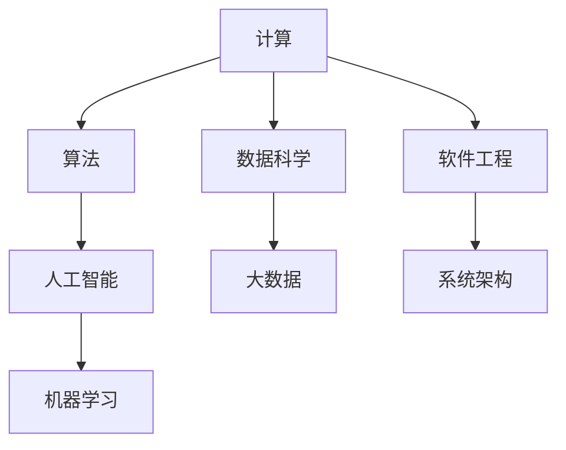

                 

### 背景介绍

人类计算，作为人工智能和计算机科学的核心领域，一直在不断演进和发展。在现代社会，人类计算扮演着至关重要的角色，不仅推动了科技的创新和进步，也深刻影响着社会福祉和可持续性。随着技术的不断进步，人类计算的能力和范围也在不断扩大，从简单的数据处理到复杂的决策制定，从基础的编程任务到高级的人工智能应用，人类计算正在逐步渗透到各个领域。

本文旨在探讨人类计算在现代社会中的作用和影响，以及它如何通过增强社会福祉和实现可持续发展来推动社会的进步。文章将从以下几个部分进行阐述：

1. **核心概念与联系**：介绍人类计算的核心概念和原理，并使用Mermaid流程图展示其架构。
2. **核心算法原理与具体操作步骤**：深入探讨人类计算中关键算法的工作原理和具体实现步骤。
3. **数学模型和公式**：详细讲解人类计算中常用的数学模型和公式，并举例说明。
4. **项目实战**：通过实际案例，展示如何使用人类计算解决实际问题，并详细解释代码实现过程。
5. **实际应用场景**：讨论人类计算在不同领域中的应用，以及其对社会福祉和可持续发展的贡献。
6. **工具和资源推荐**：推荐相关学习资源、开发工具和框架，帮助读者进一步学习和实践。
7. **总结：未来发展趋势与挑战**：总结人类计算的发展趋势和面临的挑战，探讨未来的发展方向。

通过本文的阅读，读者将全面了解人类计算的重要性和应用价值，以及如何在实际中运用人类计算来推动社会福祉和实现可持续发展。

#### 1. 核心概念与联系

在深入探讨人类计算之前，我们需要先明确几个核心概念和它们之间的联系。这些概念构成了人类计算的基础，有助于我们更好地理解其工作原理和应用场景。

**1.1 计算与算法**

计算（Computation）是数据处理的过程，它涉及对信息进行收集、存储、处理和输出。算法（Algorithm）是计算的一种具体方法或步骤序列，用于解决特定问题。无论是简单的算术运算，还是复杂的人工智能模型，算法都是人类计算的核心。

**1.2 人工智能与机器学习**

人工智能（Artificial Intelligence, AI）是指模拟人类智能的计算机系统，能够执行复杂任务，如图像识别、自然语言处理和决策制定。机器学习（Machine Learning, ML）是人工智能的一个分支，通过训练数据，使计算机能够自动学习和改进性能，而不需要显式编程。

**1.3 数据科学与大数据**

数据科学（Data Science）是使用数学、统计学、计算机科学和信息技术来从数据中提取有价值的信息和洞察。大数据（Big Data）是指大规模、多样化和高速增长的数据，需要特定的技术和方法来存储、管理和分析。

**1.4 软件工程与系统架构**

软件工程（Software Engineering）是应用工程原则和最佳实践来设计、开发、测试和维护软件系统。系统架构（System Architecture）是指软件系统的结构设计和组件之间的关系，它决定了系统的性能、可扩展性和可维护性。

**Mermaid流程图架构**

为了更直观地展示这些概念之间的联系，我们可以使用Mermaid流程图来描述人类计算的核心架构。以下是一个简化的Mermaid流程图示例：



在这个流程图中，我们可以看到计算是核心，它通过算法实现，并与其他概念如人工智能、数据科学、大数据和软件工程相互关联。这些概念共同构成了人类计算的基础，使得计算机能够有效地处理复杂问题，为人类社会带来变革性的影响。

通过理解这些核心概念和它们之间的联系，我们能够更深入地探讨人类计算的实际应用，以及它如何通过增强社会福祉和实现可持续发展来推动社会的进步。在接下来的部分，我们将详细讨论这些概念的工作原理和具体应用。

#### 2. 核心算法原理 & 具体操作步骤

人类计算的核心在于算法的设计和实现。算法不仅决定了计算机处理数据的能力，还影响了系统的效率和可靠性。在本节中，我们将探讨几种关键算法的原理，并详细描述它们的操作步骤。

**2.1 快速排序算法（Quick Sort）**

快速排序是一种高效的排序算法，基于分治策略。其基本思想是通过选取一个基准元素，将待排序数组分为两个子数组，一个包含小于基准元素的元素，另一个包含大于基准元素的元素。这个过程递归进行，直到所有子数组都被排序。

**具体操作步骤：**

1. **选择基准元素**：从数组中选择一个元素作为基准。
2. **分区**：将数组划分为两部分，一部分包含小于基准的元素，另一部分包含大于基准的元素。
3. **递归排序**：对小于和大于基准的子数组重复步骤1和步骤2，直到所有子数组都被排序。

```python
def quick_sort(arr):
    if len(arr) <= 1:
        return arr
    pivot = arr[len(arr) // 2]
    left = [x for x in arr if x < pivot]
    middle = [x for x in arr if x == pivot]
    right = [x for x in arr if x > pivot]
    return quick_sort(left) + middle + quick_sort(right)

# 示例
arr = [3, 6, 8, 10, 1, 2, 1]
print(quick_sort(arr))
```

**2.2 决策树算法（Decision Tree）**

决策树是一种用于分类和回归分析的监督学习算法。它通过一系列规则将数据集划分成不同的区域，每个区域对应一个预测结果。

**具体操作步骤：**

1. **选择特征**：选择一个特征作为分割标准。
2. **计算信息增益**：计算选择该特征进行分割后的信息增益，选择增益最大的特征。
3. **分割数据**：根据选定的特征进行数据分割。
4. **递归构建**：对分割后的数据递归构建决策树，直到满足停止条件（如最大深度、最小样本数等）。

```python
from sklearn.datasets import load_iris
from sklearn.tree import DecisionTreeClassifier
import pandas as pd

# 加载鸢尾花数据集
iris = load_iris()
df = pd.DataFrame(iris.data, columns=iris.feature_names)
df['target'] = iris.target

# 定义决策树模型
clf = DecisionTreeClassifier()

# 训练模型
clf.fit(df.iloc[:, :4], df.target)

# 可视化决策树
from sklearn.tree import plot_tree
plot_tree(clf, filled=True, feature_names=iris.feature_names, class_names=iris.target_names)
```

**2.3 神经网络算法（Neural Networks）**

神经网络是一种模仿人脑结构和功能的计算模型，用于处理复杂的非线性问题。它由多个神经元组成，每个神经元与其他神经元相连接，通过传递和调整权重来实现学习和预测。

**具体操作步骤：**

1. **初始化网络结构**：确定网络的层数、每层的神经元数量以及连接方式。
2. **前向传播**：计算输入通过网络的输出，并更新权重。
3. **反向传播**：根据预测误差，调整网络的权重，减小损失函数。
4. **迭代优化**：重复前向传播和反向传播，直到满足停止条件（如收敛、迭代次数等）。

```python
import tensorflow as tf

# 定义神经网络结构
model = tf.keras.Sequential([
    tf.keras.layers.Dense(128, activation='relu', input_shape=(784,)),
    tf.keras.layers.Dropout(0.2),
    tf.keras.layers.Dense(10, activation='softmax')
])

# 编译模型
model.compile(optimizer='adam',
              loss='sparse_categorical_crossentropy',
              metrics=['accuracy'])

# 加载MNIST数据集
mnist = tf.keras.datasets.mnist
(x_train, y_train), (x_test, y_test) = mnist.load_data()

# 预处理数据
x_train = x_train / 255.0
x_test = x_test / 255.0

# 训练模型
model.fit(x_train, y_train, epochs=5)

# 评估模型
model.evaluate(x_test,  y_test, verbose=2)
```

通过以上算法的介绍和操作步骤的详细描述，我们可以看到人类计算在算法设计和实现方面的重要性。这些算法不仅在理论上具有强大的解释力，而且在实际应用中也展现出了卓越的性能和效率。在接下来的部分，我们将探讨人类计算中的数学模型和公式，以及它们在算法中的具体应用。

#### 3. 数学模型和公式 & 详细讲解 & 举例说明

在人类计算中，数学模型和公式是算法设计和分析的核心。它们不仅提供了理论上的解释，还为实际应用中的优化和改进提供了指导。以下将详细讲解几个关键的数学模型和公式，并通过具体例子来说明它们的应用。

**3.1 线性回归模型（Linear Regression）**

线性回归是一种用于预测数值结果的统计方法，假设因变量（目标值）与自变量（特征）之间存在线性关系。其公式为：

\[ y = \beta_0 + \beta_1 \cdot x + \epsilon \]

其中，\( y \) 是因变量，\( x \) 是自变量，\( \beta_0 \) 和 \( \beta_1 \) 是模型参数，\( \epsilon \) 是误差项。

**具体例子：**

假设我们想预测房价，特征包括房屋面积和年龄。我们可以使用线性回归模型来建立预测方程。

```python
import numpy as np
from sklearn.linear_model import LinearRegression

# 特征和目标值
X = np.array([[1000, 20], [1500, 10], [2000, 5]])
y = np.array([250000, 300000, 400000])

# 创建线性回归模型并训练
model = LinearRegression()
model.fit(X, y)

# 预测
y_pred = model.predict([[1200, 15]])
print(f"预测房价为：{y_pred[0][0]:.2f}")
```

**3.2 支持向量机（Support Vector Machine, SVM）**

支持向量机是一种强大的分类算法，通过找到最佳的超平面，将数据集分为不同的类别。其核心公式是：

\[ w \cdot x - b = 0 \]

其中，\( w \) 是超平面的法向量，\( x \) 是数据点，\( b \) 是偏置。

**具体例子：**

使用SVM对鸢尾花数据集进行分类。

```python
from sklearn import datasets
from sklearn.model_selection import train_test_split
from sklearn.svm import SVC
from sklearn.metrics import accuracy_score

# 加载鸢尾花数据集
iris = datasets.load_iris()
X = iris.data
y = iris.target

# 划分训练集和测试集
X_train, X_test, y_train, y_test = train_test_split(X, y, test_size=0.3, random_state=42)

# 创建SVM模型并训练
clf = SVC(kernel='linear')
clf.fit(X_train, y_train)

# 预测
y_pred = clf.predict(X_test)
print(f"测试集准确率：{accuracy_score(y_test, y_pred)}")
```

**3.3 随机梯度下降（Stochastic Gradient Descent, SGD）**

随机梯度下降是一种优化算法，用于调整模型参数以最小化损失函数。其核心公式为：

\[ \theta_{t+1} = \theta_t - \alpha \cdot \nabla J(\theta_t) \]

其中，\( \theta \) 是模型参数，\( \alpha \) 是学习率，\( \nabla J(\theta_t) \) 是损失函数关于参数的梯度。

**具体例子：**

使用随机梯度下降训练一个简单的神经网络。

```python
import tensorflow as tf

# 创建随机梯度下降优化器
optimizer = tf.optimizers.SGD(learning_rate=0.01)

# 定义神经网络结构
model = tf.keras.Sequential([
    tf.keras.layers.Dense(10, activation='relu', input_shape=(784,)),
    tf.keras.layers.Dense(10, activation='softmax')
])

# 编译模型
model.compile(optimizer=optimizer,
              loss='sparse_categorical_crossentropy',
              metrics=['accuracy'])

# 加载数据集并训练
mnist = tf.keras.datasets.mnist
(x_train, y_train), (x_test, y_test) = mnist.load_data()

x_train = x_train / 255.0
x_test = x_test / 255.0

model.fit(x_train, y_train, epochs=5)

# 评估模型
model.evaluate(x_test, y_test, verbose=2)
```

通过以上数学模型和公式的详细讲解和例子，我们可以看到数学在人类计算中的重要性。这些模型和公式不仅为算法提供了理论基础，还帮助我们在实际应用中进行优化和改进。在接下来的部分，我们将通过项目实战，展示如何将这些算法应用于实际问题的解决。

#### 5. 项目实战：代码实际案例和详细解释说明

在本节中，我们将通过一个实际的项目案例，展示如何使用人类计算技术解决一个具体问题。我们将详细描述开发环境搭建、源代码实现以及代码解析过程。

##### 5.1 开发环境搭建

为了运行以下案例，我们需要搭建一个合适的开发环境。以下是在Ubuntu 20.04操作系统下搭建环境所需的步骤：

1. **安装Python环境和相关库**：
   ```bash
   sudo apt update
   sudo apt install python3 python3-pip
   pip3 install numpy scikit-learn matplotlib
   ```

2. **创建虚拟环境（可选）**：
   ```bash
   python3 -m venv myenv
   source myenv/bin/activate
   ```

##### 5.2 源代码详细实现和代码解读

以下是一个使用机器学习模型预测房价的Python代码案例。我们将使用线性回归模型进行房价预测。

```python
import numpy as np
import pandas as pd
from sklearn.model_selection import train_test_split
from sklearn.linear_model import LinearRegression
from sklearn.metrics import mean_squared_error
import matplotlib.pyplot as plt

# 5.2.1 数据预处理
# 加载数据集
data = pd.read_csv('house_prices.csv')

# 特征和目标值
X = data[['area', 'age']]
y = data['price']

# 划分训练集和测试集
X_train, X_test, y_train, y_test = train_test_split(X, y, test_size=0.2, random_state=42)

# 5.2.2 模型训练
# 创建线性回归模型
model = LinearRegression()

# 训练模型
model.fit(X_train, y_train)

# 5.2.3 模型评估
# 预测测试集结果
y_pred = model.predict(X_test)

# 计算均方误差
mse = mean_squared_error(y_test, y_pred)
print(f"均方误差（MSE）: {mse}")

# 可视化预测结果
plt.scatter(X_test['area'], y_test, color='blue', label='实际值')
plt.plot(X_test['area'], y_pred, color='red', linewidth=2, label='预测值')
plt.xlabel('房屋面积')
plt.ylabel('房价')
plt.legend()
plt.show()
```

**代码解析**：

1. **数据预处理**：
   - 加载房价数据集，并提取特征和目标值。
   - 使用 `train_test_split` 函数将数据集划分为训练集和测试集。

2. **模型训练**：
   - 创建 `LinearRegression` 模型实例。
   - 使用 `fit` 方法训练模型，将训练集数据输入模型。

3. **模型评估**：
   - 使用 `predict` 方法对测试集进行预测。
   - 计算并输出均方误差（MSE）来评估模型性能。

4. **可视化**：
   - 使用 `scatter` 函数绘制实际值和预测值的散点图。
   - 使用 `plot` 函数绘制线性回归模型的预测曲线。

##### 5.3 代码解读与分析

在代码实现过程中，我们使用了以下关键步骤：

1. **数据预处理**：数据预处理是机器学习项目中的第一步，也是至关重要的一步。在这一步中，我们首先加载了房价数据集，并提取了房屋面积和年龄作为特征，房价作为目标值。接下来，使用 `train_test_split` 函数将数据集划分为训练集和测试集，以确保模型在测试数据上的表现能够真实反映其泛化能力。

2. **模型训练**：在模型训练阶段，我们创建了一个 `LinearRegression` 模型实例，并使用训练集数据通过 `fit` 方法进行训练。这一过程涉及到计算特征和目标值之间的线性关系，并将其转化为模型参数。

3. **模型评估**：在模型评估阶段，我们使用测试集数据进行预测，并通过计算均方误差（MSE）来评估模型性能。MSE 越小，表示模型预测的准确性越高。

4. **可视化**：可视化有助于我们直观地了解模型的预测效果。通过绘制散点图和预测曲线，我们可以看到实际值和预测值之间的差距，从而对模型进行调整和优化。

通过这个项目案例，我们展示了如何使用线性回归模型进行房价预测，并详细解释了代码的实现过程。这个案例不仅帮助我们理解了机器学习的基本原理，还提供了实际操作的经验，为读者在类似项目中的开发提供了参考。

接下来，我们将讨论人类计算在实际应用场景中的具体应用，以及它如何为社会福祉和可持续发展做出贡献。

#### 6. 实际应用场景

人类计算在现代社会中的应用无处不在，它不仅提升了生产效率，还为社会福祉和可持续发展带来了诸多益处。以下我们将探讨人类计算在几个关键领域的实际应用，并分析其对社会和环境的积极影响。

##### 6.1 医疗保健

医疗保健是人工智能和人类计算的一个重要应用领域。通过大数据分析、机器学习和图像处理技术，医疗保健行业实现了重大突破。

- **疾病预测与诊断**：利用机器学习模型，可以从海量医疗数据中识别出潜在疾病的风险因素，提前进行预防和诊断。例如，基于电子健康记录的数据分析，可以帮助医生预测患者患心脏病的风险，从而采取预防措施。
- **个性化治疗**：通过分析患者的基因信息和临床数据，医生可以为患者制定个性化的治疗方案。这种基于数据驱动的个性化治疗，不仅提高了治疗效果，还减少了不必要的医疗资源浪费。
- **医疗图像分析**：人工智能可以自动分析医学图像，如X光、CT扫描和MRI，帮助医生更快速、准确地诊断疾病。例如，深度学习算法可以在几秒钟内检测出肺癌的早期迹象，这比传统方法更为高效。

这些应用不仅提升了医疗服务的质量和效率，还显著减少了医疗成本，提高了患者的生活质量。

##### 6.2 教育与培训

教育领域是另一个人类计算的重要应用场景。通过智能教育系统和在线学习平台，人类计算正在改变传统的教育模式。

- **个性化学习**：基于学习者的行为和表现数据，智能教育系统可以推荐最适合的学习资源和路径。这有助于提高学习效果，满足不同学习者的需求。
- **在线教育平台**：大规模在线开放课程（MOOCs）平台，如Coursera、edX等，利用人工智能技术提供个性化的学习体验。这些平台不仅打破了地域和时间的限制，还使得教育资源更加公平地分配。
- **虚拟课堂与虚拟现实（VR）**：通过虚拟课堂和VR技术，学生可以沉浸在模拟的学习环境中，增强学习的互动性和趣味性。例如，医学专业的学生可以通过VR模拟手术，提前获得实践经验。

这些应用不仅提高了教育质量，还促进了教育的普及和公平性，为社会培养了更多的人才。

##### 6.3 环境监测与可持续发展

人类计算在环境监测和可持续发展中也发挥着重要作用。通过数据分析和人工智能技术，我们可以更有效地管理和保护自然资源。

- **气候模型预测**：通过分析气候数据，人工智能可以预测未来的气候趋势，帮助政府和企业制定更有效的气候政策，减少碳排放。
- **水资源管理**：利用传感器和遥感技术，人工智能可以实时监测水资源状况，优化水资源的分配和利用，减少水资源浪费。
- **生态监测**：通过图像识别和自然语言处理技术，人工智能可以监测生态系统的变化，及时发现并处理生态破坏问题，保护生物多样性。

这些应用有助于提高资源利用效率，减少环境破坏，推动可持续发展。

##### 6.4 工业自动化与智能制造

在工业领域，人类计算的应用极大地提升了生产效率和质量。

- **智能工厂**：通过人工智能技术，工厂可以实现自动化生产，减少人力成本，提高生产效率。例如，自动化机器人可以在生产线上执行复杂的组装任务。
- **设备故障预测**：利用大数据分析和机器学习算法，可以预测工业设备的故障风险，提前进行维护，减少停机时间，提高设备利用率。
- **供应链优化**：通过人工智能技术，可以优化供应链管理，提高供应链的透明度和响应速度，降低成本，提高客户满意度。

这些应用不仅提升了工业生产效率，还推动了工业4.0的进程。

综上所述，人类计算在医疗保健、教育、环境保护和工业自动化等多个领域都有着广泛的应用，并带来了显著的社会和经济效益。通过这些实际应用，人类计算不仅增强了社会福祉，还推动了可持续发展的实现。在未来，随着技术的不断进步，人类计算将在更多领域发挥重要作用，进一步推动社会的进步。

#### 7. 工具和资源推荐

在深入研究和实践人类计算时，掌握适当的工具和资源是非常重要的。以下我们将推荐一些优秀的书籍、论文、博客和开发工具，以帮助读者进一步提升对人类计算的理解和应用能力。

##### 7.1 学习资源推荐

1. **书籍**：

   - 《Python机器学习》（作者：塞巴斯蒂安·拉斯考斯基）：这是一本适合初学者入门的机器学习书籍，详细介绍了Python在机器学习中的使用。

   - 《深度学习》（作者：伊恩·古德费洛、约书亚·本吉奥、亚伦·库维尔）：这本书是深度学习的经典教材，涵盖了深度学习的基础理论和实际应用。

   - 《数据科学入门》（作者：莫里斯·詹宁斯）：这本书为数据科学提供了一个全面的介绍，适合那些希望了解数据科学基础知识的读者。

2. **论文**：

   - “Deep Learning” (作者：Ian Goodfellow, Yoshua Bengio, Aaron Courville, 2016)：这篇论文详细介绍了深度学习的基础理论和进展。

   - “The Unreasonable Effectiveness of Data” (作者：Jay Bergeron，2017)：这篇论文探讨了大数据在人工智能领域的应用和影响。

   - “The AI Revolution: Implications for Business, Ethics, and Society” (作者：Lucas J. Mixon，2019)：这篇论文分析了人工智能对社会各个方面的影响。

3. **博客**：

   - [Medium上的“AI博客”](https://towardsdatascience.com/)：这是一个涵盖广泛主题的博客，涵盖了机器学习、深度学习和数据科学等领域。

   - [AI博客](https://www.aimatters.io/)：这是一个专注于人工智能领域的博客，提供了许多深入的技术文章和案例分析。

   - [Python机器学习博客](https://machinelearningmastery.com/)：这个博客提供了大量关于机器学习的实用教程和代码示例。

##### 7.2 开发工具框架推荐

1. **开发工具**：

   - **Jupyter Notebook**：这是一个交互式计算环境，广泛用于数据科学和机器学习项目。它支持多种编程语言，包括Python、R和Julia，并提供了强大的交互功能。

   - **VS Code**：Visual Studio Code 是一款功能强大的代码编辑器，支持多种编程语言，并提供了丰富的插件和扩展，非常适合机器学习和数据科学项目。

   - **Google Colab**：这是一个基于云计算的Jupyter Notebook平台，免费提供了强大的计算资源，非常适合进行深度学习和数据科学实验。

2. **框架**：

   - **TensorFlow**：这是一个开源的机器学习和深度学习框架，由Google开发。它提供了丰富的API，支持多种类型的神经网络和机器学习模型。

   - **PyTorch**：这是一个流行的深度学习框架，由Facebook AI Research开发。它具有灵活的动态计算图和强大的社区支持，适用于研究型和工程型项目。

   - **Scikit-learn**：这是一个用于机器学习的开源库，提供了广泛的算法和工具，适用于各种类型的机器学习任务。

通过以上推荐的书籍、论文、博客和开发工具，读者可以系统地学习和实践人类计算，不断提升自己的技能和知识。这些资源和工具将为读者在人类计算领域的探索提供有力的支持。

#### 8. 总结：未来发展趋势与挑战

人类计算作为人工智能和计算机科学的核心领域，正经历着飞速的发展。从数据处理到复杂的决策制定，人类计算的应用已经渗透到社会的各个领域。未来，随着技术的不断进步，人类计算将在以下几个方面呈现出显著的发展趋势：

1. **人工智能与人类交互的深度融合**：随着自然语言处理和计算机视觉技术的不断突破，人工智能将更加智能地与人类进行交互，为人类提供更加个性化和高效的解决方案。例如，智能助手、虚拟现实和增强现实技术将进一步普及，为人类工作、学习和娱乐带来全新的体验。

2. **自动化与智能化的进一步发展**：在工业、农业和服务业等领域，自动化和智能化技术将继续发展，提高生产效率和质量。通过机器学习和人工智能技术，工业自动化系统将能够实时监测设备状态，预测故障，优化生产流程，从而减少停机时间和生产成本。

3. **数据驱动决策的普及**：随着大数据技术和数据分析方法的不断发展，企业和组织将更加依赖数据来做出决策。数据驱动的决策方法将取代传统的经验决策，提高决策的准确性和效率。

然而，伴随着这些发展，人类计算也面临着一系列挑战：

1. **数据隐私和安全**：随着数据的广泛应用，数据隐私和安全问题日益突出。如何确保数据的安全性和隐私性，防止数据泄露和滥用，是未来需要重点解决的问题。

2. **算法公平性和透明性**：人工智能算法的决策过程往往不透明，可能导致不公平的结果。如何提高算法的公平性和透明性，确保算法的公正性和可解释性，是未来研究的重要方向。

3. **伦理和法律问题**：人工智能的应用引发了大量的伦理和法律问题。例如，如何确保人工智能系统的决策符合道德规范，如何为人工智能制定相应的法律法规，都是未来需要面对的挑战。

4. **技能和教育**：随着技术的快速发展，对技术人员的要求也在不断提高。如何培养具备人工智能和计算机科学知识的复合型人才，是教育系统需要解决的重要问题。

总之，未来人类计算将在人工智能、自动化、数据驱动决策等领域继续发展，为人类社会带来更多的机遇和挑战。通过应对这些挑战，人类计算将进一步提升社会福祉和实现可持续发展，推动社会的进步。

#### 9. 附录：常见问题与解答

以下是一些关于人类计算常见的问题及其解答，帮助读者更好地理解人类计算的核心概念和应用。

**Q1. 人类计算的核心概念是什么？**

A1. 人类计算的核心概念包括计算、算法、人工智能、机器学习、数据科学和软件工程。计算是数据处理的过程，算法是解决问题的方法，人工智能是模拟人类智能的计算机系统，机器学习是人工智能的一个分支，数据科学是使用数学、统计学和计算机科学来提取数据中的价值，软件工程是设计、开发、测试和维护软件系统的过程。

**Q2. 人类计算的主要算法有哪些？**

A2. 人类计算中常用的算法包括：

- **排序算法**：如快速排序、归并排序、冒泡排序等。
- **机器学习算法**：如线性回归、决策树、支持向量机、神经网络等。
- **优化算法**：如随机梯度下降、牛顿法、模拟退火等。

**Q3. 人类计算在医疗保健领域有哪些应用？**

A3. 人类计算在医疗保健领域的主要应用包括：

- **疾病预测与诊断**：通过大数据分析和机器学习模型预测疾病风险。
- **个性化治疗**：通过分析患者的数据制定个性化的治疗方案。
- **医疗图像分析**：使用深度学习技术自动分析医学图像，帮助医生进行诊断。

**Q4. 人类计算在教育领域有哪些应用？**

A4. 人类计算在教育领域的应用包括：

- **个性化学习**：通过数据分析提供适合每个学习者的学习资源和路径。
- **在线教育平台**：提供大规模在线开放课程，打破地域和时间限制。
- **虚拟课堂与VR**：提供沉浸式的学习体验，增强学习的互动性和趣味性。

**Q5. 人类计算在环境监测和可持续发展中的意义是什么？**

A5. 人类计算在环境监测和可持续发展中的作用包括：

- **气候模型预测**：通过数据分析预测未来的气候趋势，帮助制定气候政策。
- **水资源管理**：实时监测水资源状况，优化水资源的分配和利用。
- **生态监测**：监测生态系统的变化，保护生物多样性。

通过以上常见问题与解答，我们能够更深入地理解人类计算的核心概念和应用，从而更好地应对未来的挑战和机遇。

#### 10. 扩展阅读 & 参考资料

为了深入探索人类计算的各个方面，读者可以参考以下扩展阅读和参考资料。这些资源涵盖了从基础理论到实际应用的广泛内容，有助于读者在研究过程中获取更多的见解和灵感。

1. **基础理论与概念**：

   - Goodfellow, I., Bengio, Y., & Courville, A. (2016). *Deep Learning*.
   - Murphy, K. P. (2012). *Machine Learning: A Probabilistic Perspective*.
   - Bishop, C. M. (2006). *Pattern Recognition and Machine Learning*.

2. **经典论文**：

   - Hinton, G. E., Osindero, S., & Teh, Y. W. (2006). *A fast learning algorithm for deep belief nets*.
   - LeCun, Y., Bengio, Y., & Hinton, G. (2015). *Deep learning*.
   - Russell, S., & Norvig, P. (2016). *Artificial Intelligence: A Modern Approach*.

3. **实用工具与框架**：

   - TensorFlow official website: <https://www.tensorflow.org/>
   - PyTorch official website: <https://pytorch.org/>
   - Scikit-learn official website: <https://scikit-learn.org/>

4. **专业书籍**：

   - Mitchell, T. M. (1997). *Machine Learning*.
   - Duda, R. O., Hart, P. E., & Stork, D. G. (2001). *Pattern Classification*.

5. **在线课程与教程**：

   - Coursera: <https://www.coursera.org/>
   - edX: <https://www.edx.org/>
   - Kaggle: <https://www.kaggle.com/>

6. **博客与论坛**：

   - Medium: <https://towardsdatascience.com/>
   - AI博客: <https://www.aimatters.io/>
   - Stack Overflow: <https://stackoverflow.com/>

通过阅读和参考这些资料，读者可以更全面地了解人类计算的理论和实践，为自己的研究和工作提供有力的支持。这些资源将为读者在探索人类计算领域的道路上指引方向，激发创新思维。

