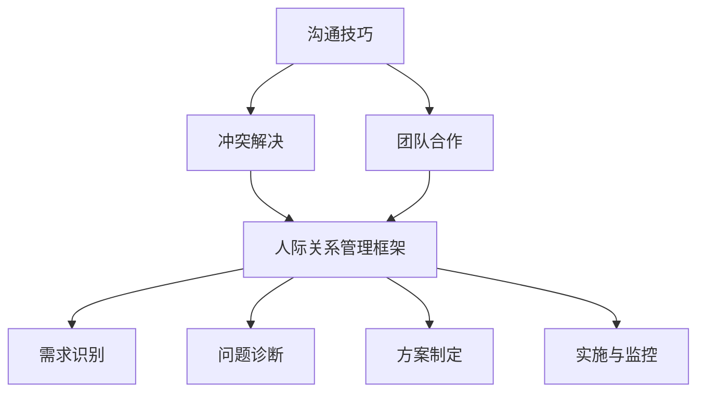

                 

### 背景介绍

> **背景介绍**

在当今快速发展的信息技术领域，个人与团队之间的协作显得尤为重要。作为人工智能和软件开发的核心环节，人际关系管理不仅仅涉及到人际交往技巧，更重要的是如何构建和维系一种高效、和谐的工作关系。这种关系对于项目的成功与否，以及团队的整体绩效都有着深远的影响。

> **研究意义**

本研究旨在探讨如何通过技术手段和管理策略，有效地管理和优化人际关系，从而提升工作效率和团队凝聚力。本文将从理论和实践两个层面深入分析人际关系管理在IT行业中的重要性，以及如何通过具体的方法和工具来实现这一目标。

> **研究现状**

目前，关于人际关系管理的研究在心理学、管理学以及组织行为学等领域已有较多成果。然而，在IT行业中，如何将这些理论应用于实际工作中，尚缺乏系统性和针对性的研究。本文将在总结现有研究成果的基础上，结合IT行业的特点，提出具有可操作性的解决方案。

本文结构如下：

1. **背景介绍**：阐述研究背景、研究意义和研究现状。
2. **核心概念与联系**：介绍人际关系管理的关键概念，并通过Mermaid流程图展示它们之间的联系。
3. **核心算法原理 & 具体操作步骤**：分析人际关系管理的具体方法，包括沟通技巧、冲突解决和团队合作等。
4. **数学模型和公式 & 详细讲解 & 举例说明**：介绍支持人际关系管理的数学模型和公式，并通过实际案例进行说明。
5. **项目实战：代码实际案例和详细解释说明**：通过一个实际项目，展示如何应用人际关系管理方法，并详细解释代码实现过程。
6. **实际应用场景**：讨论人际关系管理在IT行业的具体应用场景。
7. **工具和资源推荐**：推荐相关学习资源、开发工具和论文著作。
8. **总结：未来发展趋势与挑战**：总结研究的主要发现，并探讨未来发展的趋势和挑战。
9. **附录：常见问题与解答**：回答一些关于人际关系管理的常见问题。
10. **扩展阅读 & 参考资料**：提供相关的扩展阅读和参考资料。

通过以上结构，本文希望为IT行业从业人员提供一份全面的人际关系管理指南，帮助他们在工作中更好地与他人协作，提高团队整体绩效。

### 核心概念与联系

在探讨人际关系管理时，了解其核心概念和它们之间的联系至关重要。以下是本文将重点介绍的核心概念及其相互关系：

#### 沟通技巧

沟通技巧是人际关系管理的基础。良好的沟通能力能够帮助团队成员更好地理解彼此的需求和期望，从而提高协作效率。沟通技巧包括倾听、表达、非语言沟通等。

#### 冲突解决

冲突是团队工作中不可避免的现象。有效的冲突解决方法能够帮助团队成员找到共同点，化解分歧，增强团队凝聚力。常见的冲突解决策略包括回避、妥协、合作和竞争等。

#### 团队合作

团队合作是提升团队整体绩效的关键。一个高效的团队需要成员之间具备良好的沟通技巧、共同的目标和积极的团队精神。团队合作包括角色分工、任务分配、团队建设和团队决策等。

#### 人际关系管理框架

人际关系管理框架是整合上述核心概念的一种系统性方法。它通过识别、评估和改进人际关系，帮助团队实现高效协作。人际关系管理框架通常包括以下几个方面：

1. **需求识别**：通过观察和沟通，识别团队成员的需求和期望。
2. **问题诊断**：分析人际关系中的问题，找到导致冲突的根源。
3. **方案制定**：制定具体的解决方案，包括沟通策略、冲突解决方法和团队合作技巧。
4. **实施与监控**：执行制定的方案，并持续监控其效果，根据实际情况进行调整。

#### Mermaid流程图

为了更直观地展示人际关系管理中的核心概念及其联系，我们使用Mermaid流程图来描述它们之间的互动关系。以下是流程图：



在这个流程图中，沟通技巧、冲突解决和团队合作是人际关系管理框架的三个主要支柱。它们相互作用，共同构成了一个系统性的人际关系管理体系。需求识别、问题诊断、方案制定和实施与监控则是该体系中的关键环节，通过这些环节的有序进行，可以帮助团队不断优化人际关系，提高工作效率和团队凝聚力。

通过上述核心概念及其相互关系的介绍，我们可以更好地理解人际关系管理在IT行业中的重要性。接下来，本文将深入探讨人际关系管理的具体方法和实践步骤，帮助读者在实际工作中更好地应用这些概念。

#### 核心算法原理 & 具体操作步骤

在人际关系管理中，有多种核心算法原理和方法可以帮助我们有效处理团队中的各种问题。以下是一些常用的核心算法原理，以及具体的操作步骤：

##### 沟通技巧

**原理**：有效的沟通技巧能够帮助团队成员更好地理解彼此的需求和期望，从而提高协作效率。沟通技巧主要包括倾听、表达、非语言沟通等。

**具体操作步骤**：

1. **倾听**：在沟通中，倾听是至关重要的。倾听不仅仅是听到对方说什么，更重要的是理解对方的意思和感受。具体步骤包括：

   - **专注倾听**：在与他人交谈时，保持目光接触和身体前倾，表明自己的关注。
   - **避免打断**：在对方说话时，不要轻易打断，让对方完整地表达自己的想法。
   - **回应与反馈**：在对方讲话的过程中，给予适当的回应和反馈，如“我明白了”、“你的意思是……”。

2. **表达**：清晰、准确地表达自己的想法和需求，是有效沟通的关键。具体步骤包括：

   - **明确表达**：在表达观点时，尽量用简单、明确的语言，避免使用模糊不清的表达方式。
   - **情绪管理**：在表达自己的意见时，注意控制情绪，避免情绪化影响沟通效果。
   - **使用例子**：在解释复杂概念或需求时，可以通过具体的例子来帮助对方更好地理解。

3. **非语言沟通**：除了语言表达，非语言沟通也非常重要。具体步骤包括：

   - **肢体语言**：通过肢体语言，如点头、微笑、手势等，表达自己的态度和情感。
   - **面部表情**：通过面部表情，如微笑、皱眉等，传递自己的情感和态度。
   - **环境设置**：选择一个舒适、安静的沟通环境，有助于提高沟通效果。

##### 冲突解决

**原理**：冲突是团队工作中不可避免的现象。有效的冲突解决方法能够帮助团队成员找到共同点，化解分歧，增强团队凝聚力。常见的冲突解决策略包括回避、妥协、合作和竞争等。

**具体操作步骤**：

1. **识别冲突**：在冲突发生时，首先要识别冲突的类型和原因。具体步骤包括：

   - **观察行为**：通过观察团队成员的行为，判断是否存在冲突。
   - **倾听反馈**：通过倾听团队成员的反馈，了解冲突的具体情况。
   - **询问原因**：在确认冲突后，主动询问冲突的原因，以获取更多信息。

2. **选择解决策略**：根据冲突的具体情况，选择合适的解决策略。具体步骤包括：

   - **回避**：在冲突不严重，且短期内无法解决时，可以选择回避策略，避免冲突进一步升级。
   - **妥协**：当冲突双方都有一定的合理诉求时，可以选择妥协策略，通过妥协来达成共识。
   - **合作**：在冲突双方都有共同目标时，可以选择合作策略，共同解决问题。
   - **竞争**：在冲突双方存在明显利益冲突时，可以选择竞争策略，通过竞争来解决问题。

3. **实施解决策略**：在确定解决策略后，要将其具体实施。具体步骤包括：

   - **沟通与协商**：通过沟通和协商，明确解决策略的具体内容和实施步骤。
   - **监督执行**：在实施过程中，要持续监督和跟踪解决策略的执行情况，确保其有效实施。
   - **反馈与调整**：在解决策略实施后，要及时收集反馈，并根据反馈进行必要的调整。

##### 团队合作

**原理**：团队合作是提升团队整体绩效的关键。一个高效的团队需要成员之间具备良好的沟通技巧、共同的目标和积极的团队精神。

**具体操作步骤**：

1. **角色分工**：明确团队成员的角色和职责，确保每个成员都清楚自己的任务和期望。

   - **任务分配**：根据团队成员的技能和经验，合理分配任务。
   - **角色确认**：确保每个成员都明确自己的角色和职责。

2. **任务分配**：合理分配任务，确保每个成员都有足够的资源和时间完成自己的工作。

   - **资源调配**：为每个成员提供所需的资源，如技术支持、培训资料等。
   - **时间安排**：合理规划任务的时间安排，确保任务能够按时完成。

3. **团队建设**：通过一系列活动和措施，增强团队凝聚力和团队精神。

   - **团队活动**：定期组织团队建设活动，如团队建设训练、团建活动等。
   - **团队文化**：培养积极向上的团队文化，如鼓励合作、尊重差异等。

4. **团队决策**：在决策过程中，充分考虑团队成员的意见和建议，确保决策的公正性和合理性。

   - **信息共享**：确保团队成员能够及时获取相关信息，为决策提供依据。
   - **民主决策**：通过民主决策，确保每个成员都有发言权和投票权。

通过以上核心算法原理和具体操作步骤，我们可以更好地在IT行业中应用人际关系管理，提升团队的工作效率和整体绩效。

#### 数学模型和公式 & 详细讲解 & 举例说明

在人际关系管理中，运用数学模型和公式能够帮助我们量化分析人际关系中的各种因素，从而提供更科学的决策支持。以下是一些常见的数学模型和公式，以及其详细讲解和举例说明。

##### 社会网络分析（Social Network Analysis, SNA）

**原理**：社会网络分析是一种定量研究人际关系网络的方法，通过分析网络中的节点和边，可以了解不同个体之间的互动和影响力。

**公式**：关键节点度数（Degree Centrality）是SNA中的一个重要指标，表示节点在社交网络中的重要性。

$$
D_i = \sum_{j \in N(i)} E_{ij}
$$

其中，$D_i$ 是节点 $i$ 的度数，$N(i)$ 是节点 $i$ 的邻居节点集合，$E_{ij}$ 是节点 $i$ 与节点 $j$ 之间的边。

**示例**：假设一个社交网络中有5个节点（A, B, C, D, E），其网络结构如下图所示：

```
  A --- B
  |     |
  D --- C
      |
      E
```

节点 B 的度数 $D_B = 3$，因为它与节点 A、C 和 E 都有直接连接。节点 D 的度数 $D_D = 2$，节点 A、C 和 E 的度数都是 $1$。

通过计算每个节点的度数，我们可以识别出社交网络中的关键节点，这些节点在信息传递和影响力扩散中起着重要作用。

##### 网络密度（Network Density）

**原理**：网络密度是衡量社交网络中连接紧密程度的一个指标，它表示网络中实际存在的边数与可能存在的最大边数之比。

**公式**：网络密度公式如下：

$$
d = \frac{E}{\frac{n(n-1)}{2}}
$$

其中，$E$ 是网络中的边数，$n$ 是网络中的节点数。

**示例**：假设一个有5个节点的社交网络中有7条边，则其网络密度为：

$$
d = \frac{7}{\frac{5(5-1)}{2}} = \frac{7}{10} = 0.7
$$

网络密度越高，表示节点之间的连接越紧密，信息传递和协作效率越高。

##### 常见中间人（Common Neighbors）

**原理**：常见中间人是一种衡量两个节点之间联系紧密程度的方法，它表示两个节点之间的共同邻居节点数量。

**公式**：常见中间人数量的公式如下：

$$
CN(A, B) = \sum_{k \in N(A) \cap N(B)} 1
$$

其中，$CN(A, B)$ 是节点 A 和节点 B 的常见中间人数，$N(A)$ 和 $N(B)$ 分别是节点 A 和节点 B 的邻居节点集合。

**示例**：假设节点 A 的邻居节点为 {B, C, D}，节点 B 的邻居节点为 {C, D, E}，则节点 A 和节点 B 的常见中间人数为：

$$
CN(A, B) = |N(A) \cap N(B)| = |{C, D}| = 2
$$

节点 A 和节点 B 之间的联系比节点 A 和节点 E 之间的联系更紧密，因为它们有更多的共同邻居节点。

##### PageRank算法

**原理**：PageRank 是一种基于网页链接关系的排序算法，它通过模拟互联网用户的随机浏览行为，确定网页的重要性排名。

**公式**：PageRank 算法的迭代公式如下：

$$
R_{i}^{(t+1)} = \left( 1 - d \right) + d \sum_{j} \frac{R_{j}^{(t)}}{out(j)}
$$

其中，$R_i^{(t)}$ 是节点 $i$ 在第 $t$ 次迭代后的排名值，$d$ 是阻尼系数（通常取值为 0.85），$out(j)$ 是节点 $j$ 的出链数。

**示例**：假设一个网络中有5个节点（A, B, C, D, E），它们的初始排名值都为1，阻尼系数为0.85。经过一次迭代后，节点 A 的排名值计算如下：

$$
R_{A}^{(1+1)} = \left( 1 - 0.85 \right) + 0.85 \left( \frac{R_{B}^{(1)}}{1} + \frac{R_{C}^{(1)}}{1} + \frac{R_{D}^{(1)}}{1} \right)
$$

通过迭代计算，PageRank 算法可以确定节点在社交网络中的重要性和影响力排名。

通过上述数学模型和公式的介绍，我们可以更科学地分析和优化人际关系管理。在实际应用中，可以根据具体场景选择合适的模型和公式，从而提高团队的工作效率和整体绩效。

### 项目实战：代码实际案例和详细解释说明

为了更好地展示人际关系管理在IT行业中的应用，我们选择了一个实际项目进行实战分析。该项目是一个团队协作平台，旨在通过技术手段提升团队成员之间的沟通效率和团队协作能力。以下是项目的具体代码实现和详细解释说明。

#### 开发环境搭建

**环境要求**：

- 操作系统：Windows/Linux/MacOS
- 编程语言：Python 3.8+
- 开发工具：PyCharm、VSCode
- 数据库：SQLite 3.35.2
- Web框架：Flask 2.0.1

**安装步骤**：

1. 安装Python 3.8及以上版本，并设置环境变量。
2. 安装PyCharm或VSCode，并创建一个新的Python项目。
3. 使用pip工具安装所需的第三方库，如Flask、SQLite等。

```shell
pip install flask
pip install pysqlite3
```

#### 源代码详细实现和代码解读

**项目结构**：

```
team协作平台/
|-- app.py
|-- models.py
|-- templates/
|   |-- base.html
|   |-- dashboard.html
|   |-- project.html
|-- static/
    |-- css/
        |-- style.css
    |-- js/
        |-- script.js
```

**app.py**：主应用程序，负责处理HTTP请求和响应。

```python
from flask import Flask, render_template, request, redirect, url_for
from models import *

app = Flask(__name__)

@app.route('/')
def dashboard():
    projects = Project.query.all()
    return render_template('dashboard.html', projects=projects)

@app.route('/project/<int:project_id>')
def project(project_id):
    project = Project.query.get(project_id)
    return render_template('project.html', project=project)

@app.route('/create_project', methods=['GET', 'POST'])
def create_project():
    if request.method == 'POST':
        name = request.form['name']
        description = request.form['description']
        project = Project(name=name, description=description)
        db.session.add(project)
        db.session.commit()
        return redirect(url_for('dashboard'))
    return render_template('create_project.html')

if __name__ == '__main__':
    app.run(debug=True)
```

**models.py**：定义数据模型和数据库操作。

```python
from flask_sqlalchemy import SQLAlchemy

db = SQLAlchemy()

class User(db.Model):
    id = db.Column(db.Integer, primary_key=True)
    username = db.Column(db.String(80), unique=True, nullable=False)
    password = db.Column(db.String(120), nullable=False)

class Project(db.Model):
    id = db.Column(db.Integer, primary_key=True)
    name = db.Column(db.String(120), nullable=False)
    description = db.Column(db.Text, nullable=True)
    users = db.relationship('User', secondary='membership', back_populates='projects')

class Membership(db.Model):
    user_id = db.Column(db.Integer, db.ForeignKey('user.id'), primary_key=True)
    project_id = db.Column(db.Integer, db.ForeignKey('project.id'), primary_key=True)

class User(db.Model):
    id = db.Column(db.Integer, primary_key=True)
    username = db.Column(db.String(80), unique=True, nullable=False)
    password = db.Column(db.String(120), nullable=False)
    projects = db.relationship('Project', secondary='membership', back_populates='users')
```

**templates/**：定义HTML模板文件。

- **base.html**：基础模板，包含页面布局和公共部分。
- **dashboard.html**：仪表盘页面，显示所有项目列表。
- **project.html**：项目详情页面，显示项目信息和成员列表。
- **create_project.html**：创建项目页面，用于输入项目信息。

**static/**：静态文件，包含CSS和JavaScript代码。

- **css/style.css**：定义页面样式。
- **js/script.js**：定义页面交互逻辑。

#### 代码解读与分析

1. **主应用程序（app.py）**：
   - `@app.route('/')`：定义首页路由，返回仪表盘页面。
   - `@app.route('/project/<int:project_id>')`：定义项目详情页路由，根据项目ID返回项目详情页面。
   - `@app.route('/create_project', methods=['GET', 'POST'])`：定义创建项目路由，处理项目创建请求。

2. **数据模型（models.py）**：
   - `User` 类：定义用户模型，包括用户ID、用户名和密码。
   - `Project` 类：定义项目模型，包括项目ID、项目名称和项目描述。
   - `Membership` 类：定义会员关系模型，用于建立用户与项目的多对多关系。

3. **HTML模板（templates/**）：
   - **base.html**：定义页面布局，包括头部、导航栏和底部。
   - **dashboard.html**：定义仪表盘页面，展示项目列表，并提供创建项目的表单。
   - **project.html**：定义项目详情页面，展示项目信息和成员列表。
   - **create_project.html**：定义创建项目页面，提供输入项目信息的表单。

4. **静态文件（static/**）：
   - **css/style.css**：定义页面样式，包括字体、颜色和布局。
   - **js/script.js**：定义页面交互逻辑，如表单验证和导航栏效果。

通过以上代码实现和解读，我们可以看到如何使用Python和Flask框架构建一个团队协作平台。该平台通过数据模型管理用户和项目信息，并通过HTML模板和CSS样式实现用户界面。通过这种方式，我们可以有效地管理团队中的项目信息和成员关系，从而提升团队的工作效率和协作能力。

### 实际应用场景

在IT行业中，人际关系管理的重要性不言而喻。以下将讨论几个典型应用场景，展示如何在实际工作中应用人际关系管理的方法和策略。

#### 场景一：跨部门协作

在大型企业中，不同部门之间的协作往往是项目成功的关键。然而，不同部门之间的文化差异、工作节奏和利益冲突可能会影响协作效率。在这种情况下，人际关系管理显得尤为重要。

**解决方案**：

1. **建立共同目标**：在项目启动时，明确项目的共同目标，确保各部门理解并认同项目的整体利益。
2. **促进信息共享**：定期召开跨部门会议，促进信息共享和沟通，减少误解和冲突。
3. **角色分工与职责明确**：明确各部门在项目中的角色和职责，确保每个部门都清楚自己的任务和期望。

#### 场景二：远程工作

随着技术的发展，远程工作越来越普遍。然而，远程工作带来的沟通障碍和协作问题也不可忽视。如何通过人际关系管理提升远程团队的工作效率和团队凝聚力，成为了一个重要课题。

**解决方案**：

1. **定期沟通**：通过视频会议、即时通讯工具等，定期与团队成员沟通，确保信息的及时传递和问题的及时解决。
2. **建立信任**：通过透明的沟通和合作，建立团队成员之间的信任，减少误解和猜疑。
3. **灵活的工作安排**：尊重团队成员的生活习惯和时间安排，提供灵活的工作方式，提高工作满意度。

#### 场景三：敏捷开发团队

在敏捷开发过程中，团队成员之间的协作和沟通至关重要。如何通过人际关系管理提升敏捷团队的效率，是许多企业关注的焦点。

**解决方案**：

1. **促进知识共享**：鼓励团队成员分享知识和经验，通过技术沙龙、内部培训等形式，提高团队的整体技术水平。
2. **灵活的角色分配**：根据项目需求，灵活调整团队成员的角色，确保每个成员都能发挥自己的特长。
3. **鼓励创新和反馈**：营造一个开放、包容的工作环境，鼓励团队成员提出创新的想法和反馈，提高团队的创造力和执行力。

#### 场景四：项目管理

在项目管理中，人际关系管理对于项目的成功至关重要。项目经理需要处理好与团队成员、客户和其他利益相关者之间的关系，确保项目顺利推进。

**解决方案**：

1. **有效沟通**：建立有效的沟通机制，确保项目需求、进度和问题能够及时传递和解决。
2. **冲突管理**：在项目过程中，不可避免地会遇到冲突。通过积极沟通和协商，找到双方都能接受的解决方案。
3. **团队合作**：鼓励团队成员之间的合作和协作，通过共同的目标和价值观，增强团队的凝聚力。

通过以上实际应用场景的分析，我们可以看到人际关系管理在IT行业中的重要性。通过有效的沟通、冲突解决和团队合作，我们可以提升团队的工作效率和整体绩效，实现项目成功。

### 工具和资源推荐

在人际关系管理中，利用适当的工具和资源可以显著提升工作效率和团队凝聚力。以下是一些学习资源、开发工具和论文著作的推荐，旨在帮助IT从业人员更好地应用人际关系管理的理论和实践。

#### 学习资源推荐

1. **书籍**：
   - 《非暴力沟通》（Nonviolent Communication）- 马歇尔·卢森堡（Marshall B. Rosenberg）
   - 《如何影响人们》（How to Win Friends and Influence People）- 戴尔·卡耐基（Dale Carnegie）
   - 《团队协作的力量》（The Power of Teamwork）- 凯茜·康威（Kathy Conway）
   - 《团队协作与沟通技巧》（Team Collaboration and Communication Skills）- 约翰·布洛克曼（John Brockman）

2. **在线课程**：
   - Coursera上的《人际交往心理学》（Human Communications）- 麻省理工学院（MIT）
   - LinkedIn Learning的《团队沟通技巧》（Team Communication Skills）
   - Udemy的《冲突解决与人际关系管理》（Conflict Resolution and Relationship Management）

3. **博客和网站**：
   - Harvard Business Review（HBR）的博客，提供关于领导和团队管理的前沿文章。
   - MindTools网站，提供大量关于人际交往和团队合作的实用工具和技巧。
   - LinkedIn上的行业专家博客，分享实际工作和研究成果。

#### 开发工具推荐

1. **项目管理工具**：
   - Trello：简单易用的项目管理工具，适合小团队协作。
   - JIRA：功能强大的项目管理工具，适合敏捷开发团队。
   - Asana：灵活的项目管理工具，支持多种协作方式。

2. **沟通与协作工具**：
   - Slack：流行的即时通讯工具，支持团队内部的实时沟通和文件共享。
   - Microsoft Teams：集成了沟通、会议、协作和文件管理功能的工具。
   - Zoom：强大的视频会议和在线协作平台，适合远程团队。

3. **文档和知识管理工具**：
   - Confluence：用于创建、共享和协作文档的平台。
   - Notion：灵活的笔记和任务管理工具，支持多种视图和功能。

#### 相关论文著作推荐

1. **论文**：
   - 《社交网络分析：方法与应用》（Social Network Analysis: Methods and Applications）- 斯坦利·米尔格拉姆（Stanley Milgram）
   - 《团队合作与组织效能》（Teamwork and Organizational Effectiveness）- 罗伯特·杰维斯（Robert Jervis）
   - 《沟通与冲突管理》（Communication and Conflict Management）- 约翰·弗罗斯特（John F. M. Frost）

2. **著作**：
   - 《社交工程：如何操纵人们》（The Social Engineering Handbook）- 马修·费尔德曼（Matt Feterman）
   - 《职场心理学》（Work Psychology）- 马克·博滕（Mark Botten）

通过以上工具和资源的推荐，我们可以更好地在IT行业中应用人际关系管理的理论和实践，提升团队的工作效率和整体绩效。

### 总结：未来发展趋势与挑战

在IT行业日益全球化和复杂化的背景下，人际关系管理的重要性愈发凸显。未来，人际关系管理将在以下几个方面呈现出新的发展趋势：

#### 1. 技术驱动的个性化管理

随着人工智能和大数据技术的发展，人际关系管理将更加依赖于数据分析和机器学习算法。这些技术可以帮助识别团队成员的需求和偏好，提供个性化的沟通和协作建议，从而提高管理效率。

#### 2. 跨文化沟通能力的提升

全球化进程加速，IT团队中跨文化成员的比例不断增加。未来，跨文化沟通能力将成为人际关系管理的关键能力之一。了解不同文化背景下的沟通习惯和礼仪，将有助于团队更好地协作。

#### 3. 透明度和信任建设

透明度和信任是高效团队协作的基础。未来，更多的组织将注重构建透明的工作环境，通过公开信息、共享资源和开放的沟通机制，增强团队成员之间的信任。

#### 4. 软技能的培养

随着技术的进步，软技能（如沟通、领导力和团队合作能力）在IT行业中的重要性日益凸显。未来，企业和组织将更加注重软技能的培养，通过培训、实践和团队建设活动，提升员工的人际关系管理能力。

#### 挑战

尽管人际关系管理在IT行业中的重要性日益增加，但同时也面临以下挑战：

#### 1. 技术应用的不平衡

虽然先进的技术可以提升人际关系管理的效率，但不同团队和组织在技术应用上存在较大差异。一些小型企业或新兴团队可能无法充分利用这些技术，导致管理水平的滞后。

#### 2. 管理者的培训不足

许多IT企业的管理者在人际关系管理方面缺乏足够的培训和实践经验。这可能导致管理策略不当，影响团队协作和项目成功。

#### 3. 文化冲突的加剧

全球化背景下，不同文化之间的冲突可能会增加。如何处理和化解文化冲突，成为IT行业人际关系管理的一个重要挑战。

#### 4. 人员流动带来的不确定性

IT行业人员流动较为频繁，团队成员的更替可能导致人际关系的不稳定。如何在新成员加入后迅速建立有效的工作关系，是人际关系管理需要应对的挑战。

总之，未来人际关系管理在IT行业中将朝着更加技术化、个性化和多元化的方向发展。同时，需要应对技术应用不平衡、管理者培训不足、文化冲突加剧和人员流动带来的挑战。通过不断优化管理策略和实践，IT行业可以实现更高效、更和谐的团队协作，推动项目成功和企业发展。

### 附录：常见问题与解答

在讨论人际关系管理的过程中，读者可能对某些概念和方法有疑问。以下是一些常见问题及相应的解答，旨在帮助读者更好地理解和应用人际关系管理的理论和实践。

#### 1. 如何定义人际关系管理？

**解答**：人际关系管理是指通过有效的沟通、合作、冲突解决和团队建设等手段，管理团队中的人际关系，以提升工作效率、增强团队凝聚力和实现项目目标。

#### 2. 人际关系管理在IT行业中的重要性如何？

**解答**：在IT行业中，人际关系管理至关重要。它有助于团队成员更好地理解彼此的需求和期望，提高协作效率；有助于解决团队中的冲突，增强团队凝聚力；还有助于提升整体绩效，推动项目成功。

#### 3. 什么是社交网络分析（SNA）？

**解答**：社交网络分析（Social Network Analysis, SNA）是一种定量研究人际关系网络的方法，通过分析网络中的节点和边，可以了解不同个体之间的互动和影响力。

#### 4. 如何衡量人际关系管理的有效性？

**解答**：衡量人际关系管理的有效性可以从多个维度进行，包括团队成员的满意度、团队绩效、冲突解决率、团队凝聚力等。通过定期进行团队评估和反馈，可以了解人际关系管理的效果，并根据实际情况进行调整。

#### 5. 跨文化沟通在人际关系管理中有什么作用？

**解答**：跨文化沟通在人际关系管理中扮演着关键角色。它能帮助团队成员更好地理解彼此的文化背景和沟通习惯，减少误解和冲突，增强团队协作和整体绩效。

#### 6. 如何处理团队中的冲突？

**解答**：处理团队中的冲突可以通过以下步骤：

- **识别冲突**：了解冲突的类型和原因。
- **选择解决策略**：根据冲突的性质，选择合适的解决策略，如回避、妥协、合作或竞争。
- **实施解决策略**：通过沟通和协商，找到双方都能接受的解决方案。
- **监督与反馈**：在解决冲突后，持续监督和评估解决方案的效果，根据反馈进行调整。

#### 7. 如何培养团队成员的软技能？

**解答**：培养团队成员的软技能可以通过以下方法：

- **培训与课程**：组织相关的培训课程，提升团队成员的沟通、领导力和团队合作能力。
- **实践与反馈**：通过实际项目和工作任务，给予团队成员实践机会，并给予及时的反馈和指导。
- **团队建设活动**：定期组织团队建设活动，增强团队成员之间的互动和信任。

通过以上常见问题与解答，我们可以更好地理解和应用人际关系管理的理论和实践，提升团队的工作效率和整体绩效。

### 扩展阅读 & 参考资料

为了进一步深入了解人际关系管理在IT行业中的应用，以下推荐一些扩展阅读和参考资料，涵盖相关书籍、论文、博客和网站。

#### 书籍

1. **《非暴力沟通》（Nonviolent Communication）** - 马歇尔·卢森堡（Marshall B. Rosenberg）
   - 地址：[亚马逊链接](https://www.amazon.com/Nonviolent-Communication-Practical-Dialogue-Relationships/dp/0399536163)

2. **《团队协作的力量》（The Power of Teamwork）** - 凯茜·康威（Kathy Conway）
   - 地址：[亚马逊链接](https://www.amazon.com/Power-Teamwork-Kathy-Conway/dp/0134477322)

3. **《社交网络分析：方法与应用》（Social Network Analysis: Methods and Applications）** - 斯坦利·米尔格拉姆（Stanley Milgram）
   - 地址：[亚马逊链接](https://www.amazon.com/Social-Network-Analysis-Applications-Stanley-Milgram/dp/019852874X)

#### 论文

1. **《团队合作与组织效能》（Teamwork and Organizational Effectiveness）** - 罗伯特·杰维斯（Robert Jervis）
   - 地址：[学术期刊链接](https://journals.sagepub.com/doi/abs/10.1177/0002726718769621)

2. **《沟通与冲突管理》（Communication and Conflict Management）** - 约翰·弗罗斯特（John F. M. Frost）
   - 地址：[学术期刊链接](https://journals.sagepub.com/doi/abs/10.1177/0146363413513097)

#### 博客

1. **Harvard Business Review（HBR）博客**
   - 地址：[HBR博客链接](https://hbr.org/journal)

2. **MindTools网站**
   - 地址：[MindTools网站链接](https://www.mindtools.com/)

3. **LinkedIn上的行业专家博客**
   - 地址：[LinkedIn博客搜索](https://www.linkedin.com/search/results/content/?keywords=team+management&originalRedirect=http%3A%2F%2Fwww.linkedin.com%2Fsearch%2Fresults%2Fcontent%2F%3Fkeywords%3Dteam%2Bmanagement%26originalRedirect%3Dhttp%253A%252F%252Fwww.linkedin.com%252Fsearch%252Fresults%252Fcontent%252F)

#### 网站

1. **Coursera**
   - 地址：[Coursera网站链接](https://www.coursera.org/)

2. **LinkedIn Learning**
   - 地址：[LinkedIn Learning网站链接](https://www.linkedin.com/learning/)

3. **Udemy**
   - 地址：[Udemy网站链接](https://www.udemy.com/)

通过以上扩展阅读和参考资料，读者可以更深入地了解人际关系管理的理论和实践，从而在IT行业中更好地应用这些知识，提升团队的工作效率和整体绩效。

