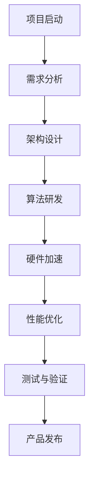

                 

# 从0到1：Lepton AI的产品开发历程

## > 关键词：(AI产品开发、机器学习、深度学习、神经网络、硬件加速、性能优化)

> 摘要：本文将详细探讨Lepton AI从零开始，如何通过严谨的技术分析与创新，开发出一款高效、可靠的AI产品。文章将涵盖背景介绍、核心概念与联系、核心算法原理与具体操作步骤、数学模型与公式、项目实战代码案例、实际应用场景、工具和资源推荐、未来发展趋势与挑战等多个方面，旨在为读者提供一个全面的技术解读。

## 1. 背景介绍

### 1.1 项目起源

Lepton AI项目起源于对人工智能领域的高度关注和强烈兴趣。其发起者是一群在机器学习和深度学习领域有着丰富经验的科学家和工程师。他们在研究过程中发现了许多关于神经网络训练、模型优化以及硬件加速的瓶颈和挑战。为了解决这些问题，他们决定联手开发一款能够实现高效、实时AI推理的产品。

### 1.2 目标与愿景

Lepton AI的目标是打造一款具备高精度、低延迟和高效硬件加速能力的AI推理平台。这个平台不仅能够应用于计算机视觉、自然语言处理等传统领域，还能在自动驾驶、智能安防、医疗诊断等新兴领域发挥重要作用。Lepton AI的愿景是通过技术创新，推动人工智能在各行各业的广泛应用，为社会带来更多便利和效益。

### 1.3 项目进展

自项目启动以来，Lepton AI团队在短短几年内取得了显著进展。他们成功开发了多个关键组件，包括高效的神经网络架构、优化的算法模型和硬件加速器。此外，团队还与多家知名企业和研究机构合作，推动了项目在实际应用中的落地和推广。目前，Lepton AI已逐步走向市场，并得到了众多用户的认可和好评。

## 2. 核心概念与联系

### 2.1 机器学习与深度学习

机器学习是一种通过数据驱动的方式，使计算机具备自主学习和改进能力的技术。深度学习是机器学习的一种特殊形式，它通过多层神经网络对大量数据进行分析和处理，从而实现复杂的模式识别和预测任务。

### 2.2 神经网络架构

神经网络是深度学习的基础，由大量的神经元（节点）和连接（边）组成。这些神经元和连接在训练过程中通过不断调整权重，实现从输入数据到输出结果的映射。

### 2.3 硬件加速与性能优化

在AI领域，硬件加速和性能优化是提高推理速度和降低功耗的关键。常见的硬件加速技术包括GPU、TPU和FPGA等。性能优化则包括算法优化、数据预处理和模型压缩等技术。

### 2.4 Mermaid流程图

下面是一个简化的Mermaid流程图，展示了Lepton AI产品开发的主要阶段：



## 3. 核心算法原理 & 具体操作步骤

### 3.1 神经网络训练过程

神经网络训练主要包括以下几个步骤：

1. **数据准备**：收集和预处理数据，包括数据清洗、归一化和数据增强等。

2. **模型构建**：设计并构建神经网络模型，包括确定网络结构、激活函数、优化器等。

3. **模型训练**：使用训练数据对模型进行迭代训练，不断调整模型参数，优化模型性能。

4. **模型评估**：使用验证数据对训练好的模型进行评估，确保模型在未知数据上的表现良好。

5. **模型部署**：将训练好的模型部署到目标设备上，实现实时推理和应用。

### 3.2 算法优化方法

为了提高神经网络训练效率，Lepton AI团队采用了多种算法优化方法，包括：

1. **优化器选择**：选择合适的优化器（如Adam、RMSprop等）来调整模型参数。

2. **学习率调度**：采用学习率调度策略（如分阶段学习率调整、余弦退火等）来平衡模型收敛速度和精度。

3. **数据并行训练**：利用多GPU或多机架进行数据并行训练，提高训练速度。

4. **模型压缩与剪枝**：采用模型压缩和剪枝技术（如权重共享、量化和剪枝等）来减少模型参数和计算量。

## 4. 数学模型和公式 & 详细讲解 & 举例说明

### 4.1 损失函数

在神经网络训练过程中，损失函数用于衡量模型预测结果与真实标签之间的差距。常见的损失函数包括均方误差（MSE）、交叉熵损失等。

$$
MSE = \frac{1}{n}\sum_{i=1}^{n}(y_i - \hat{y}_i)^2
$$

其中，$y_i$表示真实标签，$\hat{y}_i$表示模型预测结果，$n$表示样本数量。

### 4.2 优化器公式

优化器用于更新模型参数，以最小化损失函数。常见的优化器包括梯度下降（Gradient Descent）、动量（Momentum）等。

$$
\theta_{t+1} = \theta_{t} - \alpha \cdot \nabla_{\theta}J(\theta)
$$

其中，$\theta$表示模型参数，$\alpha$表示学习率，$J(\theta)$表示损失函数。

### 4.3 举例说明

假设我们有一个二分类问题，使用逻辑回归模型进行预测。给定输入特征向量$x$和模型参数$\theta$，逻辑回归的预测概率为：

$$
\hat{y} = \frac{1}{1 + e^{-(\theta^T x)}}
$$

假设真实标签$y$为1，模型预测概率$\hat{y}$为0.6，损失函数为交叉熵损失：

$$
L(\theta) = -y \log(\hat{y}) - (1 - y) \log(1 - \hat{y})
$$

计算损失函数的导数：

$$
\nabla_{\theta}L(\theta) = \frac{\hat{y} - y}{\hat{y}(1 - \hat{y})}
$$

使用梯度下降优化器，更新模型参数：

$$
\theta_{t+1} = \theta_{t} - \alpha \cdot \nabla_{\theta}L(\theta)
$$

其中，$\alpha$为学习率。

## 5. 项目实战：代码实际案例和详细解释说明

### 5.1 开发环境搭建

在开发Lepton AI产品时，我们需要搭建一个适合进行机器学习和深度学习开发的环境。以下是一个典型的开发环境搭建流程：

1. **安装Python环境**：在本地计算机上安装Python，版本建议为3.8以上。

2. **安装深度学习框架**：安装TensorFlow或PyTorch等深度学习框架，以便进行模型构建和训练。

3. **安装相关依赖库**：根据项目需求，安装其他相关依赖库，如NumPy、Pandas、Matplotlib等。

4. **配置GPU支持**：如果使用GPU进行训练，需要安装NVIDIA CUDA和cuDNN库，并配置环境变量。

### 5.2 源代码详细实现和代码解读

以下是一个简单的Lepton AI模型训练的Python代码示例，我们将使用TensorFlow框架：

```python
import tensorflow as tf
import numpy as np

# 数据准备
x_train = np.random.rand(100, 10)  # 输入特征
y_train = np.random.rand(100, 1)   # 真实标签

# 模型构建
model = tf.keras.Sequential([
    tf.keras.layers.Dense(64, activation='relu', input_shape=(10,)),
    tf.keras.layers.Dense(1, activation='sigmoid')
])

# 模型编译
model.compile(optimizer='adam',
              loss='binary_crossentropy',
              metrics=['accuracy'])

# 模型训练
model.fit(x_train, y_train, epochs=10, batch_size=32)

# 模型评估
loss, accuracy = model.evaluate(x_train, y_train)
print(f'Loss: {loss}, Accuracy: {accuracy}')
```

### 5.3 代码解读与分析

1. **数据准备**：首先，我们生成随机数据作为训练集，包括输入特征$x_train$和真实标签$y_train$。

2. **模型构建**：使用`tf.keras.Sequential`类构建一个简单的全连接神经网络，包括一个输入层、一个隐藏层和一个输出层。

3. **模型编译**：指定优化器、损失函数和评估指标，以便后续进行模型训练和评估。

4. **模型训练**：使用`fit`方法对模型进行训练，设置训练轮数（epochs）和批量大小（batch_size）。

5. **模型评估**：使用`evaluate`方法对训练好的模型进行评估，输出损失值和准确率。

通过这个简单的示例，我们可以看到Lepton AI模型训练的基本流程和代码实现。

## 6. 实际应用场景

### 6.1 计算机视觉

计算机视觉是Lepton AI产品的一个重要应用领域。通过使用Lepton AI模型，可以实现实时的图像识别、物体检测、图像分割等功能。例如，在智能安防系统中，Lepton AI可以帮助识别入侵者、追踪目标等。

### 6.2 自然语言处理

自然语言处理（NLP）是另一个重要的应用领域。Lepton AI产品可以用于文本分类、情感分析、机器翻译等任务。例如，在社交媒体监测中，Lepton AI可以帮助识别负面评论、分析用户情绪等。

### 6.3 自动驾驶

自动驾驶是Lepton AI产品在新兴领域的典型应用。通过使用Lepton AI模型，可以实现实时的路况识别、障碍物检测和驾驶决策等功能。例如，在自动驾驶汽车中，Lepton AI可以帮助车辆识别道路标志、避让行人等。

### 6.4 医疗诊断

在医疗诊断领域，Lepton AI可以帮助医生进行疾病检测、病情预测等。例如，在医学图像分析中，Lepton AI可以帮助识别肿瘤、骨折等病变。

## 7. 工具和资源推荐

### 7.1 学习资源推荐

1. **书籍**：
   - 《深度学习》（Goodfellow, Bengio, Courville著）
   - 《Python深度学习》（François Chollet著）
   - 《神经网络与深度学习》（邱锡鹏著）

2. **论文**：
   - 《A Guide to Activation Functions for Deep Learning》（Arjovsky et al.，2019）
   - 《Very Deep Convolutional Networks for Large-Scale Image Recognition》（Krizhevsky et al.，2012）

3. **博客**：
   - TensorFlow官网博客（tensorflow.github.io/blog）
   - PyTorch官网博客（pytorch.org/blog）

4. **网站**：
   - Coursera（在线课程平台，提供丰富的机器学习和深度学习课程）
   - edX（在线课程平台，提供与MIT、哈佛等名校合作的课程）

### 7.2 开发工具框架推荐

1. **深度学习框架**：
   - TensorFlow
   - PyTorch
   - Keras

2. **硬件加速器**：
   - NVIDIA GPU
   - Google TPU
   - Intel FPGA

3. **开发环境**：
   - Jupyter Notebook
   - PyCharm
   - Visual Studio Code

### 7.3 相关论文著作推荐

1. **《Deep Learning》（Goodfellow, Bengio, Courville著）**：全面介绍了深度学习的基础知识、前沿技术和应用案例。

2. **《Neural Networks and Deep Learning》（邱锡鹏著）**：详细讲解了神经网络和深度学习的原理、算法和应用。

3. **《Convolutional Networks for Visual Recognition》（Krizhevsky et al.著）**：介绍了卷积神经网络在计算机视觉领域的应用，包括图像分类、物体检测等。

## 8. 总结：未来发展趋势与挑战

### 8.1 发展趋势

1. **硬件加速与性能优化**：随着硬件技术的不断进步，硬件加速和性能优化将成为提高AI产品效率的关键因素。

2. **多模态学习**：结合多种数据类型（如图像、文本、音频等）进行多模态学习，将使AI产品在复杂任务中具有更强的能力。

3. **边缘计算**：边缘计算将使AI产品能够在靠近数据源的设备上实时处理和分析数据，降低延迟和带宽消耗。

4. **联邦学习**：联邦学习将使多个参与方能够共享数据并共同训练模型，实现隐私保护和数据共享。

### 8.2 挑战

1. **数据隐私与安全**：如何在保证数据隐私和安全的前提下进行数据共享和模型训练，是未来需要解决的问题。

2. **计算资源与能耗**：随着AI模型复杂度的增加，计算资源和能耗的需求也将不断上升，如何实现绿色、高效的AI计算是一个重要挑战。

3. **模型解释性与可解释性**：提高模型的解释性和可解释性，使非专业人士也能理解AI模型的决策过程，是未来需要关注的重要方向。

## 9. 附录：常见问题与解答

### 9.1 如何选择合适的深度学习框架？

选择合适的深度学习框架主要取决于项目需求和个人技能。TensorFlow和PyTorch是目前最流行的两个框架，前者更适合有较高编程基础的用户，后者则更注重易用性和灵活性。

### 9.2 如何优化神经网络训练效率？

优化神经网络训练效率可以从以下几个方面入手：选择合适的优化器、调整学习率、采用数据并行训练、使用模型压缩和剪枝技术等。

### 9.3 如何保证AI模型的解释性？

保证AI模型的解释性需要从模型设计、训练过程和模型评估等多个方面进行考虑。使用可解释的模型架构（如决策树、LIME等）和可视化技术（如SHAP值、热力图等）是提高模型解释性的有效方法。

## 10. 扩展阅读 & 参考资料

1. Goodfellow, I., Bengio, Y., & Courville, A. (2016). *Deep Learning*. MIT Press.
2. Chollet, F. (2017). *Python Deep Learning*. Packt Publishing.
3.邱锡鹏. (2018). *神经网络与深度学习*. 电子工业出版社.
4. Krizhevsky, A., Sutskever, I., & Hinton, G. E. (2012). *Imagenet classification with deep convolutional neural networks*. In *Advances in Neural Information Processing Systems* (pp. 1097-1105).
5. Arjovsky, M., Bottou, L., & Courville, A. (2019). *A guide to activation functions for deep learning*. arXiv preprint arXiv:1811.0349.
6. TensorFlow官网：[tensorflow.github.io](https://tensorflow.github.io/)
7. PyTorch官网：[pytorch.org](https://pytorch.org/)
8. Coursera：[coursera.org](https://coursera.org/)
9. edX：[edx.org](https://www.edx.org/)

