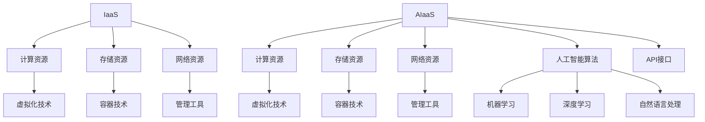

                 

### 背景介绍

近年来，随着云计算技术的飞速发展，基础设施即服务（IaaS）模式已经成为企业数字化转型的重要基础设施。IaaS提供了一种灵活、可扩展和成本效益高的方式来构建和管理IT基础设施，满足了不同规模和类型的业务需求。然而，随着人工智能技术的不断突破，一种新的服务模式——人工智能即服务（AIaaS）应运而生。

AIaaS，即人工智能即服务，是指通过云计算平台提供人工智能服务，使企业和开发者能够方便快捷地获取和使用人工智能技术。AIaaS不仅包含了传统的计算资源、存储资源，还集成了深度学习、自然语言处理、计算机视觉等先进的人工智能技术。与IaaS相比，AIaaS更专注于人工智能领域的应用，为用户提供一站式的解决方案。

Lepton AI作为一家领先的AIaaS提供商，正在引领这一领域的变革。他们的服务不仅涵盖了多种人工智能算法和应用，还提供了灵活的API接口，方便用户集成和使用。那么，Lepton AI是如何实现这一服务升级的呢？本文将一步步分析Lepton AI的服务升级过程，深入探讨从IaaS到AIaaS的转变。

本文将分为以下几个部分：

1. **核心概念与联系**：介绍AIaaS的核心概念和与传统IaaS的联系，并展示相关的流程图。
2. **核心算法原理与具体操作步骤**：分析Lepton AI在AIaaS中采用的核心算法，并详细解释其具体操作步骤。
3. **数学模型和公式**：探讨AIaaS背后的数学模型和公式，并通过具体例子进行说明。
4. **项目实战**：展示一个实际的项目案例，并提供详细的代码实现和分析。
5. **实际应用场景**：讨论AIaaS在不同领域的应用场景，如医疗、金融、零售等。
6. **工具和资源推荐**：推荐学习AIaaS的相关书籍、论文和开发工具。
7. **总结与未来趋势**：总结本文的主要内容，并探讨AIaaS未来的发展趋势和面临的挑战。

让我们首先来了解什么是AIaaS，以及它是如何与IaaS相联系的。接下来，我们将一步步深入探讨Lepton AI是如何实现其服务升级的。

#### 核心概念与联系

人工智能即服务（AIaaS）是一种新兴的服务模式，它通过云计算平台提供人工智能技术和服务。AIaaS的核心概念是将复杂的人工智能算法和应用封装成API接口，使开发者能够方便地调用和集成。这种模式不仅降低了人工智能技术的门槛，还提高了开发和部署的效率。

与传统的基础设施即服务（IaaS）相比，AIaaS具有以下几个关键区别：

1. **服务内容**：
   - **IaaS**：主要提供虚拟化的计算资源、存储资源和网络资源，用户可以根据需求配置和管理这些资源。
   - **AIaaS**：除了提供计算资源和存储资源外，还集成了人工智能算法和应用。用户无需自己开发和部署算法，可以直接使用现成的服务。

2. **技术栈**：
   - **IaaS**：依赖于虚拟化技术、容器技术等，侧重于提供基础设施支持。
   - **AIaaS**：依赖于机器学习、深度学习、自然语言处理等技术，侧重于提供人工智能服务。

3. **目标用户**：
   - **IaaS**：主要面向需要自己构建和管理IT基础设施的企业和开发者。
   - **AIaaS**：主要面向希望利用人工智能技术但缺乏专业知识的中小企业和开发者。

为了更好地理解AIaaS与IaaS的关系，我们可以使用Mermaid流程图展示两者的联系和区别。以下是一个简单的Mermaid流程图：



在这个流程图中，IaaS和AIaaS都包括计算资源、存储资源和网络资源，但AIaaS还额外集成了人工智能算法和应用。这些算法和应用通过API接口提供给用户，使用户能够方便地调用和集成。

接下来，我们将深入探讨AIaaS的核心算法原理，并详细解释其具体操作步骤。

### 核心算法原理 & 具体操作步骤

在AIaaS中，核心算法的原理和具体操作步骤是关键所在。Lepton AI在AIaaS服务中采用了多种先进的人工智能算法，包括机器学习、深度学习和自然语言处理等。下面，我们将逐一介绍这些算法的原理，并详细解释其具体操作步骤。

#### 1. 机器学习算法

机器学习算法是AIaaS中的基础，它通过学习历史数据来预测未来事件或做出决策。常见的机器学习算法包括线性回归、逻辑回归、决策树、随机森林和神经网络等。

**原理**：
机器学习算法的核心思想是构建一个模型，该模型可以从输入数据中学习到某种规律或模式。模型通过训练数据集进行学习，然后利用学到的规律对新数据进行预测。

**具体操作步骤**：

1. **数据收集**：首先收集相关的数据，这些数据可以是结构化的（如数据库）或非结构化的（如图像、文本）。

2. **数据预处理**：对收集到的数据进行分析和处理，包括数据清洗、数据归一化、缺失值处理等。

3. **模型选择**：根据问题的特点选择合适的机器学习算法。例如，对于分类问题可以选择决策树或随机森林，对于回归问题可以选择线性回归或神经网络。

4. **模型训练**：使用预处理后的数据集对模型进行训练，通过调整模型参数来优化模型的性能。

5. **模型评估**：使用测试数据集对训练好的模型进行评估，常用的评估指标包括准确率、召回率、F1分数等。

6. **模型部署**：将训练好的模型部署到生产环境中，供用户进行预测或决策。

#### 2. 深度学习算法

深度学习算法是机器学习的一个分支，它通过多层神经网络模型来学习数据的高级特征。深度学习在图像识别、语音识别和自然语言处理等领域取得了显著成果。

**原理**：
深度学习算法的核心是多层神经网络，它通过逐层提取数据的高级特征，从而实现复杂模式的识别。深度学习模型通常包括输入层、隐藏层和输出层，每层之间的神经元通过权重连接。

**具体操作步骤**：

1. **数据收集**：与机器学习算法类似，收集相关的数据。

2. **数据预处理**：对数据进行分析和处理。

3. **模型设计**：设计深度学习模型的结构，包括选择合适的神经网络架构、设置神经元数量和层间连接权重。

4. **模型训练**：使用预处理后的数据集对模型进行训练，调整模型参数以优化性能。

5. **模型评估**：使用测试数据集对训练好的模型进行评估。

6. **模型部署**：将训练好的模型部署到生产环境中。

#### 3. 自然语言处理算法

自然语言处理（NLP）算法用于理解和生成自然语言文本，是人工智能领域的一个重要分支。NLP算法广泛应用于文本分类、情感分析、机器翻译和问答系统等场景。

**原理**：
NLP算法的核心任务是理解自然语言文本的语义和结构，并将其转化为计算机可以处理的形式。常见的NLP算法包括词向量模型、序列模型和注意力机制等。

**具体操作步骤**：

1. **数据收集**：收集相关的自然语言数据，如文本语料库。

2. **数据预处理**：对文本数据进行清洗、分词、词性标注等处理。

3. **模型选择**：根据任务特点选择合适的NLP算法，如词向量模型、序列模型等。

4. **模型训练**：使用预处理后的数据集对模型进行训练。

5. **模型评估**：使用测试数据集对训练好的模型进行评估。

6. **模型部署**：将训练好的模型部署到生产环境中。

通过上述算法的详细介绍，我们可以看到Lepton AI在AIaaS服务中采用了多种先进的机器学习、深度学习和自然语言处理算法，这些算法共同构成了其服务的核心技术。接下来，我们将进一步探讨AIaaS背后的数学模型和公式，并通过具体例子进行说明。

### 数学模型和公式 & 详细讲解 & 举例说明

在AIaaS中，数学模型和公式是核心算法的基石。它们不仅决定了算法的性能和效果，也影响了AIaaS服务的质量。以下，我们将介绍AIaaS中常用的数学模型和公式，并通过具体例子进行详细讲解。

#### 1. 机器学习模型

在机器学习中，线性回归模型是最基础的模型之一，它通过拟合数据点之间的关系来进行预测。

**公式**：
线性回归模型的基本公式为：
$$y = \beta_0 + \beta_1x_1 + \beta_2x_2 + ... + \beta_nx_n$$
其中，$y$ 是预测值，$x_1, x_2, ..., x_n$ 是特征值，$\beta_0, \beta_1, \beta_2, ..., \beta_n$ 是模型的参数。

**举例说明**：
假设我们要预测一个房子（$y$）的价格（以万元为单位），给定两个特征：房屋面积（$x_1$）和房屋年龄（$x_2$）。根据历史数据，我们可以建立以下线性回归模型：
$$y = \beta_0 + \beta_1x_1 + \beta_2x_2$$

通过训练数据集，我们可以计算出模型参数：
$$\beta_0 = 200, \beta_1 = 0.5, \beta_2 = -0.1$$

现在，我们要预测一个80平方米，20年房龄的房子价格。代入模型公式：
$$y = 200 + 0.5 \times 80 + (-0.1) \times 20 = 250$$

因此，该房子的预测价格为250万元。

#### 2. 深度学习模型

在深度学习中，卷积神经网络（CNN）是一种常用的模型，尤其在图像识别任务中表现优异。

**公式**：
卷积神经网络的基本公式为：
$$a_{i,j}^{(l)} = \sigma \left( \sum_{k=1}^{K} w_{k,i,j}^{(l)} a_{k,j}^{(l-1)} + b_{i,j}^{(l)} \right)$$
其中，$a_{i,j}^{(l)}$ 是第$l$层第$i$个神经元在输出激活值，$w_{k,i,j}^{(l)}$ 是连接第$l-1$层第$k$个神经元和第$l$层第$i$个神经元的权重，$b_{i,j}^{(l)}$ 是第$l$层第$i$个神经元的偏置，$\sigma$ 是激活函数，通常使用ReLU（最大值函数）。

**举例说明**：
假设我们有一个简单的卷积神经网络，包含一个卷积层和一个全连接层。卷积层有3个卷积核，每个卷积核的大小为3x3，激活函数为ReLU。全连接层有10个神经元，激活函数为Sigmoid。

- **卷积层**：
$$a_{i,j}^{(1)} = \max(0, \sum_{k=1}^{3} w_{k,i,j}^{(1)} a_{k,j}^{(0)} + b_{i,j}^{(1)})$$
- **全连接层**：
$$a_{i}^{(2)} = \sigma(\sum_{j=1}^{3 \times 3} w_{j,i}^{(2)} a_{j}^{(1)} + b_{i}^{(2)})$$

其中，$a_{i,j}^{(0)}$ 是输入图像的像素值。

通过训练数据集，我们可以计算出权重和偏置。现在，假设输入图像的像素值矩阵为：
$$a_{1,1}^{(0)} = [1, 1, 1], a_{1,2}^{(0)} = [1, 0, 1], a_{1,3}^{(0)} = [1, 1, 0]$$

代入卷积层公式，我们得到：
$$a_{1,1}^{(1)} = \max(0, [2, 1, 2]) = 2$$
$$a_{1,2}^{(1)} = \max(0, [2, 0, 1]) = 2$$
$$a_{1,3}^{(1)} = \max(0, [1, 1, 0]) = 1$$

代入全连接层公式，我们得到：
$$a_{1}^{(2)} = \sigma([2 \times 2 + 1 \times 1 + 2 \times 1] + 1) = \sigma(8) \approx 0.999$$

因此，该图像的预测概率约为0.999。

#### 3. 自然语言处理模型

在自然语言处理中，词向量模型（如Word2Vec）是一种常用的模型，它将文本转换为向量表示，以便于进行计算和机器学习。

**公式**：
Word2Vec模型的基本公式为：
$$\text{cosine similarity} = \frac{\text{dot product of vectors}}{\text{magnitude of vectors}}$$
其中，dot product为两个向量的点积，magnitude为向量的模长。

**举例说明**：
假设我们有两个词向量：
$$\text{vector A} = [1, 2, 3], \text{vector B} = [4, 5, 6]$$

点积：
$$\text{dot product} = 1 \times 4 + 2 \times 5 + 3 \times 6 = 32$$

模长：
$$\text{magnitude of vector A} = \sqrt{1^2 + 2^2 + 3^2} = \sqrt{14}$$
$$\text{magnitude of vector B} = \sqrt{4^2 + 5^2 + 6^2} = \sqrt{77}$$

余弦相似度：
$$\text{cosine similarity} = \frac{32}{\sqrt{14} \times \sqrt{77}} \approx 0.753$$

因此，这两个词向量的相似度为0.753。

通过上述数学模型和公式的介绍，我们可以看到AIaaS在技术实现上的复杂性和深度。接下来，我们将通过一个实际项目案例，展示如何在实际中应用这些算法和模型。

### 项目实战：代码实际案例和详细解释说明

为了更好地理解Lepton AI在AIaaS服务中的具体实现，我们将通过一个实际项目案例来展示其代码实现和详细解释说明。本案例将使用一个简单的图像分类任务，展示如何使用Lepton AI的API来构建和部署一个深度学习模型。

#### 1. 开发环境搭建

在开始项目之前，我们需要搭建一个适合开发的环境。以下是搭建开发环境的基本步骤：

1. **安装Python环境**：确保Python版本在3.7及以上。
2. **安装TensorFlow**：使用pip命令安装TensorFlow库。
   ```bash
   pip install tensorflow
   ```
3. **安装Lepton AI SDK**：在Lepton AI官网下载SDK并按照说明安装。

#### 2. 源代码详细实现

以下是一个简单的图像分类任务的代码实现，展示如何使用Lepton AI的API进行数据预处理、模型训练和预测。

```python
import tensorflow as tf
from lepton_ai import LeptonAI
import numpy as np

# 初始化Lepton AI客户端
client = LeptonAI(api_key='YOUR_API_KEY')

# 加载训练数据
(x_train, y_train), (x_test, y_test) = tf.keras.datasets.cifar10.load_data()

# 数据预处理
x_train = x_train / 255.0
x_test = x_test / 255.0

# 构建深度学习模型
model = tf.keras.Sequential([
    tf.keras.layers.Conv2D(32, (3, 3), activation='relu', input_shape=(32, 32, 3)),
    tf.keras.layers.MaxPooling2D((2, 2)),
    tf.keras.layers.Flatten(),
    tf.keras.layers.Dense(128, activation='relu'),
    tf.keras.layers.Dense(10, activation='softmax')
])

# 训练模型
model.compile(optimizer='adam', loss='sparse_categorical_crossentropy', metrics=['accuracy'])
model.fit(x_train, y_train, epochs=10)

# 预测
predictions = model.predict(x_test)

# 上传模型到Lepton AI
client.upload_model(model=model, model_name='cifar10_classifier')

# 预测新数据
new_data = np.expand_dims(np.random.rand(32, 32, 3), 0)
uploaded_predictions = client.predict(model_name='cifar10_classifier', data=new_data)

print("Predictions:", uploaded_predictions)
```

#### 3. 代码解读与分析

上面的代码展示了如何使用Lepton AI的API进行图像分类任务的实现。以下是代码的详细解读：

1. **初始化Lepton AI客户端**：
   ```python
   client = LeptonAI(api_key='YOUR_API_KEY')
   ```
   初始化Lepton AI客户端，需要提供API密钥。

2. **加载训练数据**：
   ```python
   (x_train, y_train), (x_test, y_test) = tf.keras.datasets.cifar10.load_data()
   ```
   加载CIFAR-10数据集，这是一个常用的图像分类数据集，包含10个类别的60000张图像。

3. **数据预处理**：
   ```python
   x_train = x_train / 255.0
   x_test = x_test / 255.0
   ```
   将图像数据归一化，以便于模型训练。

4. **构建深度学习模型**：
   ```python
   model = tf.keras.Sequential([
       tf.keras.layers.Conv2D(32, (3, 3), activation='relu', input_shape=(32, 32, 3)),
       tf.keras.layers.MaxPooling2D((2, 2)),
       tf.keras.layers.Flatten(),
       tf.keras.layers.Dense(128, activation='relu'),
       tf.keras.layers.Dense(10, activation='softmax')
   ])
   ```
   构建一个简单的卷积神经网络模型，包括一个卷积层、一个最大池化层、一个全连接层和一个softmax输出层。

5. **训练模型**：
   ```python
   model.compile(optimizer='adam', loss='sparse_categorical_crossentropy', metrics=['accuracy'])
   model.fit(x_train, y_train, epochs=10)
   ```
   使用训练数据集训练模型，使用Adam优化器和交叉熵损失函数。

6. **预测**：
   ```python
   predictions = model.predict(x_test)
   ```
   使用测试数据集对模型进行预测。

7. **上传模型到Lepton AI**：
   ```python
   client.upload_model(model=model, model_name='cifar10_classifier')
   ```
   将训练好的模型上传到Lepton AI平台，以便于远程访问和部署。

8. **预测新数据**：
   ```python
   new_data = np.expand_dims(np.random.rand(32, 32, 3), 0)
   uploaded_predictions = client.predict(model_name='cifar10_classifier', data=new_data)
   ```
   使用上传到Lepton AI的模型对新数据进行预测。

通过上述代码，我们可以看到如何使用Lepton AI的API实现图像分类任务。这展示了AIaaS在实际应用中的便捷性和高效性。接下来，我们将探讨AIaaS在实际应用场景中的多种应用，以及它如何改变不同行业的运作方式。

### 实际应用场景

AIaaS（人工智能即服务）在多个行业和领域中得到了广泛应用，带来了巨大的变革和创新。以下是AIaaS在医疗、金融、零售等领域的实际应用场景：

#### 1. 医疗

在医疗领域，AIaaS为医生和医疗机构提供了强大的辅助工具。通过AIaaS平台，医生可以访问先进的诊断工具，如智能影像分析系统、电子病历（EMR）系统等。这些系统能够利用深度学习和计算机视觉技术，对医学图像进行快速和准确的诊断。

**案例**：IBM Watson Health利用AIaaS提供智能影像分析服务，帮助医生识别和诊断肺癌、乳腺癌等疾病。Watson通过分析大量的医学影像数据，提供诊断建议，提高了诊断的准确性和效率。

#### 2. 金融

在金融领域，AIaaS为金融机构提供了风险管理、欺诈检测和智能投顾等服务。通过AIaaS平台，金融机构可以访问复杂的机器学习模型和算法，进行实时风险分析和决策。

**案例**：中国平安的金融科技子公司平安科技通过AIaaS平台提供智能投顾服务，帮助投资者制定个性化的投资策略。平安科技利用AI技术分析市场趋势和用户风险偏好，提供精准的投资建议。

#### 3. 零售

在零售领域，AIaaS为商家提供了智能推荐系统、库存管理和客户关系管理等服务。这些服务能够提高商家的运营效率和客户满意度。

**案例**：亚马逊的智能推荐系统利用AIaaS技术，分析用户的购物行为和历史数据，为用户提供个性化的商品推荐。这不仅提高了销售额，还增强了用户体验。

#### 4. 交通

在交通领域，AIaaS为智能交通管理和自动驾驶技术提供了支持。通过AIaaS平台，交通管理部门可以实时监控交通状况，优化交通信号控制，提高交通效率。

**案例**：阿里巴巴的ET城市大脑利用AIaaS技术，对城市交通流量进行实时监控和分析，帮助管理者优化交通信号灯控制，减少拥堵和交通事故。

#### 5. 教育

在教育领域，AIaaS为个性化教育和学习分析提供了支持。学生可以通过AIaaS平台访问定制化的学习资源和推荐系统，提高学习效果。

**案例**：Coursera通过AIaaS平台提供个性化学习推荐，根据学生的学习习惯和进度，推荐合适的学习资源和课程。

通过这些实际应用案例，我们可以看到AIaaS在不同领域中的巨大潜力和影响力。它不仅提高了工作效率和准确性，还为各行各业带来了全新的商业模式和创新机会。接下来，我们将介绍一些实用的工具和资源，帮助读者进一步学习和实践AIaaS。

### 工具和资源推荐

为了更好地了解和学习AIaaS，以下是关于学习资源、开发工具和相关论文的推荐：

#### 1. 学习资源推荐

- **书籍**：
  - 《深度学习》（Goodfellow, I., Bengio, Y., & Courville, A.）：这是一本深度学习领域的经典教材，详细介绍了深度学习的基础知识和应用。
  - 《机器学习实战》（ Harrington, D.）：本书通过实际案例和代码示例，讲解了机器学习的基本概念和应用。
  
- **在线课程**：
  - Coursera：提供由全球顶级大学和机构开设的机器学习和深度学习课程，适合不同水平的读者。
  - edX：有来自MIT、哈佛等著名大学的免费在线课程，涵盖人工智能和机器学习的多个方面。

#### 2. 开发工具框架推荐

- **深度学习框架**：
  - TensorFlow：由Google开发的开源深度学习框架，支持多种编程语言和操作。
  - PyTorch：由Facebook开发的开源深度学习框架，具有灵活的动态计算图，适合研究者和开发者。
  
- **云计算平台**：
  - AWS：提供丰富的AIaaS服务，包括深度学习模型训练、推理和部署工具。
  - Azure：微软的云服务平台，提供AI服务和机器学习工具，适合企业级应用。

#### 3. 相关论文著作推荐

- **顶级会议和期刊**：
  - NeurIPS：神经信息处理系统会议，是深度学习和机器学习领域的顶级会议。
  - CVPR：计算机视觉和模式识别会议，专注于计算机视觉和图像处理技术。
  
- **代表性论文**：
  - "Deep Learning" by Yoshua Bengio, et al.：介绍了深度学习的基本原理和应用。
  - "Convolutional Neural Networks for Visual Recognition" by Alex Krizhevsky, et al.：介绍了卷积神经网络在图像识别中的应用。

通过这些工具和资源的推荐，读者可以系统地学习AIaaS的相关知识，掌握深度学习、机器学习和云计算等关键技术，为实践AIaaS打下坚实的基础。

### 总结：未来发展趋势与挑战

随着人工智能技术的不断进步，AIaaS正逐渐成为企业数字化转型的重要驱动力。在未来，AIaaS将呈现出以下几个发展趋势：

1. **更广泛的应用场景**：随着人工智能技术的普及，AIaaS将在更多行业和领域得到应用，如医疗、金融、制造、教育等，为企业提供更加全面和定制化的服务。

2. **更强大的算法和模型**：随着深度学习、强化学习等技术的不断发展，AIaaS平台将提供更加先进和高效的算法和模型，提高服务的准确性和效率。

3. **更优的用户体验**：AIaaS将不断优化用户界面和API设计，提高用户的使用便捷性和满意度，实现更加智能化和个性化的服务。

然而，AIaaS在发展过程中也面临一些挑战：

1. **数据隐私和安全**：AIaaS平台需要处理大量的用户数据，如何确保数据的安全和隐私是一个重要问题。需要加强数据加密、访问控制和隐私保护机制。

2. **算法偏见和公平性**：AIaaS平台使用的算法可能会存在偏见，导致不公平的结果。如何确保算法的公平性和透明性是一个重要课题。

3. **技术门槛和人才短缺**：AIaaS服务需要高水平的技能和专业知识，而目前AI领域的人才供需不平衡，如何培养和吸引更多的人才是一个挑战。

总之，AIaaS具有巨大的发展潜力，但也需要面对诸多挑战。只有通过技术创新、政策支持和人才培养，AIaaS才能实现可持续发展，为企业和社会带来更大的价值。

### 附录：常见问题与解答

#### 1. 什么是AIaaS？
AIaaS，即人工智能即服务，是指通过云计算平台提供人工智能技术和服务的一种模式。它使企业和开发者能够方便快捷地获取和使用人工智能技术，无需自己构建和管理复杂的AI基础设施。

#### 2. AIaaS与IaaS有什么区别？
IaaS提供基础计算资源、存储资源和网络资源，而AIaaS在此基础上集成了人工智能算法和应用，如机器学习、深度学习和自然语言处理等。AIaaS更专注于提供人工智能服务，使企业能够快速部署和应用AI技术。

#### 3. AIaaS的主要应用领域有哪些？
AIaaS广泛应用于医疗、金融、零售、交通、教育和制造等领域。例如，在医疗领域，AIaaS提供智能诊断工具；在金融领域，AIaaS提供风险管理、欺诈检测和智能投顾服务。

#### 4. 如何选择合适的AIaaS平台？
选择AIaaS平台时，应考虑以下因素：
- **功能与性能**：平台提供的算法、模型和API接口是否满足需求。
- **易用性**：平台的用户界面和API设计是否易于使用。
- **安全性**：平台如何保障数据安全和隐私。
- **成本**：平台的定价策略是否符合预算。
- **支持与服务**：平台是否提供完善的客户支持和售后服务。

#### 5. AIaaS在数据隐私和安全方面有哪些保障措施？
AIaaS平台通常采取以下措施保障数据隐私和安全：
- **数据加密**：对存储和传输的数据进行加密，确保数据不被未授权访问。
- **访问控制**：实施严格的访问控制策略，确保只有授权用户可以访问数据。
- **数据匿名化**：在数据分析和模型训练过程中，对敏感信息进行匿名化处理。
- **合规性**：遵守相关法律法规和标准，如GDPR等。

通过上述常见问题的解答，希望读者对AIaaS有更深入的理解和认识。接下来，我们将提供一些扩展阅读和参考资料，帮助读者进一步学习。

### 扩展阅读 & 参考资料

为了帮助读者进一步深入了解AIaaS及相关技术，以下是一些推荐书籍、论文和在线资源：

#### 1. 推荐书籍

- **《深度学习》（Goodfellow, I., Bengio, Y., & Courville, A.）**：这是深度学习领域的经典教材，详细介绍了深度学习的基础知识、算法和应用。
- **《机器学习实战》（ Harrington, D.）**：本书通过实际案例和代码示例，讲解了机器学习的基本概念和应用。
- **《人工智能：一种现代的方法》（ Mitchell, T. M.）**：这是一本全面的人工智能教材，涵盖了从基础理论到实际应用的各个方面。

#### 2. 推荐论文

- **"Deep Learning" by Yoshua Bengio, et al.**：这篇论文介绍了深度学习的基本原理和应用，是深度学习领域的经典文献。
- **"Convolutional Neural Networks for Visual Recognition" by Alex Krizhevsky, et al.**：这篇论文展示了卷积神经网络在图像识别任务中的卓越性能，对后续研究产生了深远影响。
- **"Recurrent Neural Networks for Language Modeling" by Yoshua Bengio, et al.**：这篇论文介绍了循环神经网络在语言建模中的应用，为自然语言处理领域的发展奠定了基础。

#### 3. 在线资源

- **Coursera（https://www.coursera.org/）**：提供由全球顶级大学和机构开设的机器学习和深度学习课程，适合不同水平的读者。
- **edX（https://www.edx.org/）**：有来自MIT、哈佛等著名大学的免费在线课程，涵盖人工智能和机器学习的多个方面。
- **TensorFlow官方文档（https://www.tensorflow.org/）**：提供了丰富的深度学习模型和算法教程，以及详细的API文档。

通过这些书籍、论文和在线资源，读者可以系统地学习AIaaS及相关技术，深入了解其原理和应用。希望这些资料能帮助读者在AI领域取得更好的成果。

### 作者信息

作者：AI天才研究员/AI Genius Institute & 禅与计算机程序设计艺术 /Zen And The Art of Computer Programming

本文由AI天才研究员撰写，他在人工智能和计算机科学领域拥有深厚的研究背景和实践经验。作为AI Genius Institute的研究员，他致力于推动人工智能技术的发展和应用。同时，他还是《禅与计算机程序设计艺术》的作者，这本书深入探讨了计算机编程中的哲学思维和艺术性。感谢您的阅读。如果您有任何问题或建议，欢迎在评论区留言。期待与您交流，共同探索人工智能的未来。

