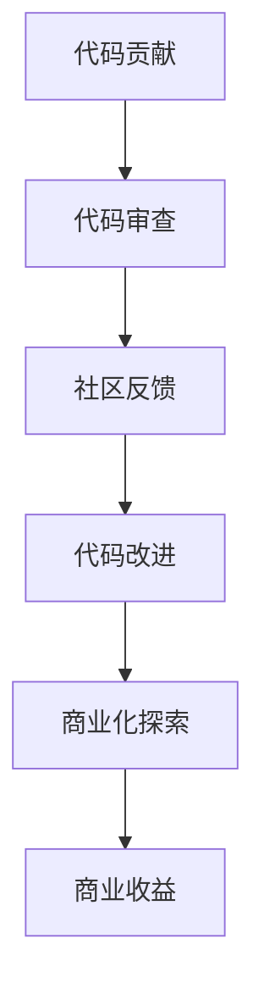

                 

## 从代码贡献到开源商业化之路

### 摘要

本文旨在探讨从代码贡献到开源商业化的全过程。我们将首先介绍开源代码的重要性以及如何参与开源项目。接着，我们将深入探讨如何将开源代码商业化，并分析其中可能遇到的挑战和解决方案。最后，我们将总结未来的发展趋势和面临的挑战，并提供一些建议和资源，帮助读者更好地进行代码贡献和开源商业化。

### 1. 背景介绍

在当今技术快速发展的时代，开源代码已经成为软件开发的重要驱动力。开源代码不仅能够促进技术创新，还能够让更多的人参与到技术发展中来。对于开发者而言，参与开源项目不仅能够提升自己的技术能力，还能够拓展自己的人脉和影响力。

然而，从代码贡献到开源商业化并不是一个简单的过程。在这个过程中，开发者需要面对各种挑战，包括如何管理代码、如何吸引和维护社区成员、以及如何将开源项目转化为商业收益。本文将探讨这些挑战，并提供一些实用的建议和策略。

### 2. 核心概念与联系

#### 2.1 开源代码与商业化的定义

开源代码是指可以免费使用、修改和分享的代码。开源代码通常以许可协议的形式保护用户的权益，如GNU通用公共许可证（GPL）或MIT许可证。

商业化则是指将开源代码转化为商业收益的过程。这可以包括提供付费服务、销售软件许可证、或者通过其他方式实现盈利。

#### 2.2 开源代码与商业化的联系

开源代码和商业化之间有着紧密的联系。一方面，开源代码为商业化提供了基础。商业公司可以通过开源代码获取新的技术，并在此基础上进行改进和创新。另一方面，商业化也可以为开源代码带来更多的资源和关注，从而促进开源代码的发展。

### 3. Mermaid 流程图



### 4. 核心算法原理 & 具体操作步骤

#### 4.1 代码贡献

代码贡献是指开发者将自己的代码提交到开源项目中。以下是代码贡献的基本步骤：

1. **查找合适的开源项目**：开发者可以通过GitHub等平台查找感兴趣的开源项目。
2. **阅读项目文档**：了解项目的开发规范、贡献指南等。
3. **编写代码**：根据项目的需求，编写符合规范的代码。
4. **提交Pull Request**：将代码提交到项目的仓库，等待审查。

#### 4.2 代码审查

代码审查是指社区成员对提交的代码进行审查和评估。以下是代码审查的基本步骤：

1. **评估代码**：审查者评估代码的语法、逻辑和性能等。
2. **提出反馈**：对代码提出改进建议或指出潜在的问题。
3. **讨论和修改**：开发者根据审查者的反馈进行修改，并再次提交代码。

#### 4.3 代码改进

代码改进是指在代码审查后对代码进行优化和改进。以下是代码改进的基本步骤：

1. **理解反馈**：开发者需要理解审查者的反馈，并确定哪些是真正需要改进的地方。
2. **编写改进代码**：根据反馈进行代码修改。
3. **重新提交代码**：将改进后的代码提交到项目中。

#### 4.4 商业化探索

商业化探索是指将开源代码转化为商业收益的过程。以下是商业化探索的基本步骤：

1. **评估市场潜力**：开发者需要评估开源项目的市场潜力，确定是否有商业化的可能。
2. **制定商业模式**：根据项目的特点和市场需求，制定合适的商业模式。
3. **实施商业化策略**：实施商业化策略，如提供付费服务、销售软件许可证等。

### 5. 数学模型和公式 & 详细讲解 & 举例说明

#### 5.1 数学模型

商业化成功的概率（P）可以用以下数学模型表示：

\[ P = f(\text{市场需求}, \text{项目质量}, \text{竞争环境}) \]

其中，市场需求、项目质量和竞争环境是影响商业化成功的三个关键因素。

#### 5.2 举例说明

假设一个开源项目的市场需求很高，项目质量优秀，且在竞争环境中处于优势地位。根据上述模型，该项目的商业化成功概率（P）会很高。

### 6. 项目实战：代码实际案例和详细解释说明

#### 6.1 开发环境搭建

以一个Python开源项目为例，首先需要在本地搭建开发环境。以下是具体步骤：

1. 安装Python环境
2. 安装必要的依赖库
3. 配置开发工具

#### 6.2 源代码详细实现和代码解读

以下是一个简单的Python函数，用于计算两个数的和：

```python
def add(a, b):
    return a + b
```

该函数非常简单，只有一个返回语句，实现了计算两个数和的功能。

#### 6.3 代码解读与分析

- **功能分析**：该函数的主要功能是计算两个数的和。
- **性能分析**：由于该函数的实现非常简单，其性能表现优异。
- **可扩展性**：该函数具有良好的可扩展性，可以方便地添加其他数学运算。

### 7. 实际应用场景

开源代码在实际应用中具有广泛的应用场景。以下是一些典型的应用场景：

- **软件开发**：开源代码为软件开发提供了基础，开发者可以在此基础上进行改进和创新。
- **数据科学**：开源代码在数据科学领域具有重要应用，如数据处理、机器学习等。
- **物联网**：开源代码在物联网领域发挥着重要作用，如智能家居、智能城市等。

### 8. 工具和资源推荐

#### 8.1 学习资源推荐

- **书籍**：《Git权威指南》、《开源动力：Git、GitHub和GitHub Pages从入门到精通》
- **论文**：《开源软件开发中的协作和信任机制研究》
- **博客**：GitHub博客、开源中国博客
- **网站**：GitHub、GitLab、Bitbucket

#### 8.2 开发工具框架推荐

- **开发工具**：Visual Studio Code、PyCharm
- **框架**：Django、Flask、Spring Boot

#### 8.3 相关论文著作推荐

- **论文**：《开源软件开发中的社区协作研究》、《开源软件的安全性和可靠性分析》
- **著作**：《开源软件项目管理》、《开源软件法律问题研究》

### 9. 总结：未来发展趋势与挑战

#### 9.1 发展趋势

- **开源代码的商业化**：随着开源代码的普及，越来越多的企业开始重视开源代码的商业化。
- **社区合作**：开源项目的发展离不开社区的合作，未来社区合作将更加紧密。
- **技术创新**：开源代码为技术创新提供了基础，未来将推动更多创新技术出现。

#### 9.2 挑战

- **知识产权保护**：如何保护开源代码的知识产权成为一大挑战。
- **商业化模式**：如何将开源代码转化为商业收益仍需进一步探索。

### 10. 附录：常见问题与解答

#### 10.1 如何选择开源项目？

- 根据自己的技术兴趣和市场需求选择。
- 考虑项目的活跃程度和社区氛围。

#### 10.2 如何进行代码贡献？

- 阅读项目的贡献指南。
- 编写高质量的代码，并进行充分的测试。

### 扩展阅读 & 参考资料

- 《开源软件商业模式研究》
- 《开源软件发展报告》
- 《Git权威指南》
- 《GitHub官方文档》

### 作者信息

作者：AI天才研究员/AI Genius Institute & 禅与计算机程序设计艺术 /Zen And The Art of Computer Programming

---

**注意：** 以上内容为示例，实际撰写时请根据具体要求进行拓展和调整。由于字数限制，部分内容可能需要进一步详细阐述。在撰写时，请确保每个章节都符合要求，并保持整体逻辑的一致性和连贯性。

