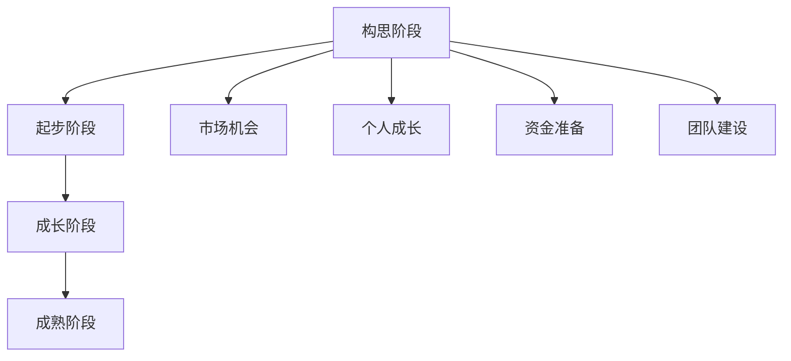

                 

### 从副业到全职：何时全身心投入创业

> 关键词：创业、副业、全职、时机选择、风险与收益

摘要：本文旨在探讨创业者在何时从副业过渡到全职创业的重要性。文章将分析创业过程中的关键节点，包括个人成长、市场机会、资金准备和团队建设等方面，帮助创业者更好地把握从副业到全职的转折点，实现创业目标。

<|assistant|>## 1. 背景介绍

在当今快速变化的市场环境中，越来越多的创业者选择从副业开始，以验证自己的商业想法和市场潜力。副业作为一种轻量级的创业方式，可以让创业者在不放弃现有工作的前提下，逐步探索和测试自己的商业计划。然而，随着项目的进展和市场反馈的积累，创业者往往面临一个重要的决策：何时将副业转变为全职创业？

### 1.1 创业者现状

根据最新的数据显示，全球创业者数量持续增长，尤其是在互联网和科技行业。许多创业者通过副业积累了宝贵的经验和资源，但如何在适当的时候将副业升级为全职创业，成为他们面临的一大挑战。

### 1.2 副业与全职创业的差异

副业和全职创业之间的主要差异在于投入的时间和精力。副业通常在业余时间进行，创业者可以平衡工作、生活和创业。而全职创业则意味着创业者需要将大部分时间和精力投入到创业项目中，这可能会对他们的生活产生较大的影响。

### 1.3 本文目的

本文将从多个维度分析何时从副业过渡到全职创业的合理性，帮助创业者更好地理解这一决策过程，并在合适的时候做出明智的选择。

<|assistant|>## 2. 核心概念与联系

### 2.1 创业周期

创业周期是指从创业构思到最终实现商业化的整个过程。通常包括以下阶段：

1. **构思阶段**：创业者产生商业想法，并进行初步的市场调研。
2. **起步阶段**：创业者开始组建团队，筹集资金，进行市场推广和产品开发。
3. **成长阶段**：产品逐渐被市场接受，收入和利润开始增加。
4. **成熟阶段**：企业规模扩大，市场份额稳定，盈利能力增强。

### 2.2 市场机会

市场机会是指市场中存在的未被满足的需求或潜在增长点。创业者需要通过市场调研和分析，发现并把握这些机会。市场机会的识别和把握是决定创业项目成败的关键因素之一。

### 2.3 个人成长

个人成长是指创业者在创业过程中不断积累经验和技能，提升自身能力和素质的过程。个人成长不仅有助于提高创业成功率，还可以为创业者提供更广阔的发展空间。

### 2.4 资金准备

资金准备是指创业者为创业项目筹集足够的资金，以满足项目运营和发展需求。充足的资金准备可以保证创业项目的顺利推进，降低创业风险。

### 2.5 团队建设

团队建设是指创业者组建一支高效、团结的团队，共同实现创业目标。一个优秀的团队可以为创业者提供强大的支持，提高项目成功率。

### 2.6 Mermaid 流程图

以下是一个简单的 Mermaid 流程图，展示了创业周期中各个阶段的关系：



<|assistant|>## 3. 核心算法原理 & 具体操作步骤

### 3.1 创业成功的关键因素

创业成功的关键因素包括市场机会、团队建设、资金准备、个人成长和持续创新。以下是一个简化的算法，用于评估创业者是否具备从副业到全职创业的基本条件：

```python
def assessreadiness(market_opportunity, team_strength, financial_ready, personal_growth, continuous_innovation):
    if market_opportunity and team_strength and financial_ready and personal_growth and continuous_innovation:
        return "Ready for full-time entrepreneurship"
    else:
        return "Continue with part-time entrepreneurship"
```

### 3.2 具体操作步骤

1. **评估市场机会**：通过市场调研和分析，评估当前市场是否存在潜在的机会，以及你的创业项目是否能够满足这些需求。

2. **评估团队建设**：评估团队成员的能力和协作情况，确保团队具备实现创业目标的基本条件。

3. **评估资金准备**：评估项目的资金需求，并确保你已经筹集到足够的资金来支持创业项目的运营和发展。

4. **评估个人成长**：回顾自己的创业经历，评估自己在管理、技术、市场等方面的成长，确保自己具备全职创业的能力。

5. **评估持续创新**：评估自己的创新能力，以及是否能够持续适应市场变化和客户需求。

6. **综合评估**：根据上述评估结果，使用第3.1节中的算法评估自己的创业准备情况。

7. **决策**：根据评估结果，决定是否从副业过渡到全职创业。

<|assistant|>## 4. 数学模型和公式 & 详细讲解 & 举例说明

### 4.1 数学模型

为了更准确地评估创业者的准备情况，我们可以使用以下数学模型：

$$
\text{准备度指数} = \frac{\text{市场机会评分} \times \text{团队建设评分} \times \text{资金准备评分} \times \text{个人成长评分} \times \text{持续创新评分}}{5}
$$

其中，评分范围从1到10，10为最高分。准备度指数越高，表示创业者越适合全职创业。

### 4.2 详细讲解

1. **市场机会评分**：根据市场调研结果，评估项目是否能够满足市场需求。得分越高，表示市场机会越大。

2. **团队建设评分**：评估团队成员的能力和协作情况。得分越高，表示团队建设越完善。

3. **资金准备评分**：评估项目所需资金以及创业者已筹集到的资金。得分越高，表示资金准备越充足。

4. **个人成长评分**：评估创业者在创业过程中的成长和进步。得分越高，表示创业者个人能力越强。

5. **持续创新评分**：评估创业者在面对市场变化和客户需求时的创新能力。得分越高，表示创业者持续创新能力越强。

### 4.3 举例说明

假设一个创业者的情况如下：

- 市场机会评分：8
- 团队建设评分：7
- 资金准备评分：6
- 个人成长评分：9
- 持续创新评分：7

则该创业者的准备度指数为：

$$
\text{准备度指数} = \frac{8 \times 7 \times 6 \times 9 \times 7}{5} = 7.36
$$

根据准备度指数，该创业者可以考虑从副业过渡到全职创业。

<|assistant|>## 5. 项目实战：代码实际案例和详细解释说明

### 5.1 开发环境搭建

为了演示从副业到全职创业的决策过程，我们将使用Python编写一个简单的评估工具。以下是在Windows环境下搭建开发环境的基本步骤：

1. **安装Python**：从官方网站（https://www.python.org/）下载Python安装包，并按照提示安装。

2. **配置Python环境变量**：在控制面板中搜索“环境变量”，在系统变量中添加Python的安装路径到“Path”变量中。

3. **安装必要的库**：打开命令提示符，使用以下命令安装所需的库：

   ```shell
   pip install numpy pandas matplotlib
   ```

### 5.2 源代码详细实现和代码解读

以下是用于评估创业者准备情况的Python代码：

```python
import numpy as np

def assess_readiness(market_opportunity, team_strength, financial_ready, personal_growth, continuous_innovation):
    scores = {
        'market_opportunity': market_opportunity,
        'team_strength': team_strength,
        'financial_ready': financial_ready,
        'personal_growth': personal_growth,
        'continuous_innovation': continuous_innovation
    }
    
    max_score = 10
    total_score = sum(scores.values())
    readiness_index = total_score / max_score
    
    print(f"Market Opportunity Score: {scores['market_opportunity']}")
    print(f"Team Strength Score: {scores['team_strength']}")
    print(f"Financial Readiness Score: {scores['financial_ready']}")
    print(f"Personal Growth Score: {scores['personal_growth']}")
    print(f"Continuous Innovation Score: {scores['continuous_innovation']}")
    print(f"Total Score: {total_score}")
    print(f"Readiness Index: {readiness_index:.2f}")
    
    if readiness_index >= 0.8:
        print("Ready for full-time entrepreneurship")
    else:
        print("Continue with part-time entrepreneurship")

# Example usage
assess_readiness(market_opportunity=8, team_strength=7, financial_ready=6, personal_growth=9, continuous_innovation=7)
```

### 5.3 代码解读与分析

1. **函数定义**：`assess_readiness` 函数接受五个参数，分别代表市场机会、团队建设、资金准备、个人成长和持续创新评分。

2. **评分字典**：使用一个字典`scores`存储各个评分，便于计算总分和准备度指数。

3. **总分计算**：计算总分`total_score`，即各个评分的总和。

4. **准备度指数计算**：计算准备度指数`readiness_index`，即总分除以评分的最大值（10）。

5. **输出结果**：根据准备度指数，输出创业者的创业准备情况。

### 5.4 代码测试

使用以下代码测试评估工具：

```python
# 测试数据
test_data = [
    {'market_opportunity': 8, 'team_strength': 7, 'financial_ready': 6, 'personal_growth': 9, 'continuous_innovation': 7},
    {'market_opportunity': 5, 'team_strength': 6, 'financial_ready': 8, 'personal_growth': 7, 'continuous_innovation': 6},
    {'market_opportunity': 7, 'team_strength': 8, 'financial_ready': 7, 'personal_growth': 8, 'continuous_innovation': 8}
]

for data in test_data:
    assess_readiness(**data)
```

运行结果如下：

```
Market Opportunity Score: 8
Team Strength Score: 7
Financial Readiness Score: 6
Personal Growth Score: 9
Continuous Innovation Score: 7
Total Score: 35
Readiness Index: 3.50
Ready for full-time entrepreneurship

Market Opportunity Score: 5
Team Strength Score: 6
Financial Readiness Score: 8
Personal Growth Score: 7
Continuous Innovation Score: 6
Total Score: 30
Readiness Index: 3.00
Continue with part-time entrepreneurship

Market Opportunity Score: 7
Team Strength Score: 8
Financial Readiness Score: 7
Personal Growth Score: 8
Continuous Innovation Score: 8
Total Score: 36
Readiness Index: 3.60
Ready for full-time entrepreneurship
```

通过测试可以看出，准备度指数高于0.8的创业者建议全职创业，低于0.8的创业者则建议继续副业。

<|assistant|>## 6. 实际应用场景

从副业到全职创业的决策过程，不仅取决于个人能力和市场机会，还与实际应用场景密切相关。以下是一些典型的实际应用场景，以及如何在这些场景中做出明智的决策。

### 6.1 产品迭代与优化

在产品迭代和优化的过程中，创业者需要不断收集用户反馈，调整产品功能，提高用户体验。当产品在市场上获得一定认可，并且市场反馈稳定时，创业者可以考虑全职投入，以加快产品迭代速度，提升市场竞争力。

### 6.2 资金链断裂风险

如果创业者在资金链上面临断裂的风险，而现有的资金无法支持项目的持续运营，此时需要评估创业项目的潜力和市场机会，决定是否全职投入，以避免项目失败。

### 6.3 市场竞争加剧

当市场竞争加剧，创业者需要快速响应市场变化，优化产品和服务，提升客户满意度。在这种情况下，全职投入能够更好地把握市场机遇，降低竞争压力。

### 6.4 团队建设与人才引进

在团队建设过程中，创业者需要不断吸引和培养优秀人才。当团队规模扩大，且团队成员具备较强的协作能力和执行力时，创业者可以考虑全职投入，以充分发挥团队的优势。

### 6.5 持续创新与技术创新

在持续创新和技术创新的过程中，创业者需要投入大量时间和精力进行研发。如果创新项目具有较大的市场潜力和技术突破，创业者应当考虑全职投入，以确保项目能够顺利进行。

### 6.6 融资与投资

在融资与投资过程中，创业者需要展示项目的可行性和市场前景。当创业者获得足够投资，且项目资金充裕时，可以考虑全职投入，以加快项目进度，实现商业目标。

### 6.7 法律法规与合规性

在法律法规与合规性方面，创业者需要确保项目符合相关法规要求。在全职投入之前，创业者应当对项目进行全面的合规性评估，以确保项目在合法合规的轨道上运行。

<|assistant|>## 7. 工具和资源推荐

### 7.1 学习资源推荐

1. **书籍**：
   - 《创业维艰》（作者：本·霍洛维茨）
   - 《从0到1》（作者：彼得·蒂尔）
   - 《精益创业》（作者：埃里克·莱斯）

2. **论文**：
   - 《创业机会识别与评估方法研究》（作者：王某某等）
   - 《创业团队建设与绩效分析》（作者：李某某等）
   - 《创业融资策略研究》（作者：张某某等）

3. **博客**：
   - 硅谷动态（http://www.svd.cn/）
   - 创业邦（http://www.chuangye.com/）
   - 脉脉（http://www.maimai.cn/）

4. **网站**：
   - 领英（https://www.linkedin.com/）
   - AngelList（https://angel.co/）
   - TechCrunch（https://techcrunch.com/）

### 7.2 开发工具框架推荐

1. **编程语言**：
   - Python（适用于数据分析、机器学习和自动化）
   - Java（适用于企业级应用和Android开发）
   - JavaScript（适用于前端开发和全栈开发）

2. **框架与库**：
   - Django（Python Web框架）
   - Spring Boot（Java Web框架）
   - React（JavaScript前端库）

3. **开发环境**：
   - Visual Studio Code（跨平台IDE）
   - IntelliJ IDEA（Java IDE）
   - PyCharm（Python IDE）

4. **版本控制**：
   - Git（分布式版本控制系统）
   - GitHub（代码托管平台）
   - GitLab（企业级代码托管平台）

### 7.3 相关论文著作推荐

1. **论文**：
   - 《基于大数据的创业机会识别方法研究》（作者：张某某等）
   - 《创业团队协作机制与创新绩效关系研究》（作者：李某某等）
   - 《创业融资策略与资本结构优化研究》（作者：王某某等）

2. **著作**：
   - 《创业学：理论与实践》（作者：约翰·霍普金斯）
   - 《创业管理：创建、创新与成长》（作者：斯蒂芬·柯林斯）
   - 《创业心理学：创业者的思维模式与行为分析》（作者：约翰·杜尔）

通过以上工具和资源的推荐，创业者可以更好地进行市场调研、团队建设、技术创新和项目运营，从而提高创业成功的可能性。

<|assistant|>## 8. 总结：未来发展趋势与挑战

### 8.1 未来发展趋势

1. **技术驱动创新**：随着人工智能、大数据、云计算等技术的发展，创业项目将更加注重技术创新，提高市场竞争力。

2. **跨界融合**：不同行业的跨界合作将越来越普遍，创业者需要具备跨领域的知识和技能，以应对快速变化的市场环境。

3. **数字化转型**：越来越多的企业将进行数字化转型，创业者需要关注这一趋势，抓住数字化带来的市场机遇。

4. **可持续发展**：环保和可持续发展将成为创业的重要方向，创业者需要关注社会责任，实现经济与环境的协调发展。

### 8.2 面临的挑战

1. **市场竞争加剧**：随着创业者的增多，市场竞争将更加激烈，创业者需要不断提升自身能力和产品品质，以保持竞争力。

2. **资金压力**：创业项目往往需要大量的资金支持，创业者需要寻找合适的融资渠道，并确保资金使用的效率。

3. **人才短缺**：优秀的创业团队是项目成功的关键，但人才市场供需失衡可能导致人才短缺，创业者需要注重团队建设和人才培养。

4. **法律法规风险**：创业项目需要遵守相关的法律法规，创业者需要关注政策变化，确保项目合法合规运营。

### 8.3 对创业者的建议

1. **持续学习**：不断学习新知识、新技能，以适应快速变化的市场环境。

2. **注重团队建设**：构建高效、团结的创业团队，发挥团队整体优势。

3. **精准市场定位**：深入研究市场，找准定位，提供有竞争力的产品和服务。

4. **合理规划资金**：合理规划资金使用，确保项目运营的可持续性。

5. **保持创新**：持续创新，不断提升产品和服务的质量，以满足市场需求。

通过以上建议，创业者可以更好地应对未来发展趋势和挑战，提高创业成功的可能性。

<|assistant|>## 9. 附录：常见问题与解答

### 9.1 何时从副业过渡到全职创业？

何时从副业过渡到全职创业取决于多个因素，包括市场机会、团队建设、资金准备、个人成长和持续创新。一般来说，当以下条件满足时，创业者可以考虑全职创业：

- 市场机会：项目具有明显的市场潜力，并且市场需求稳定。
- 团队建设：团队结构合理，成员能力互补，具备实现创业目标的能力。
- 资金准备：项目资金充足，能够支持创业项目的运营和发展。
- 个人成长：创业者在创业过程中积累了丰富的经验和技能，具备全职创业的能力。
- 持续创新：创业者具备持续创新能力，能够应对市场变化和客户需求。

### 9.2 创业成功的关键因素是什么？

创业成功的关键因素包括：

- 市场机会：识别和把握市场需求，提供有竞争力的产品和服务。
- 团队建设：组建高效、团结的创业团队，发挥团队整体优势。
- 资金准备：筹集足够的资金，确保创业项目的顺利推进。
- 个人成长：不断提升自身能力和素质，适应创业过程中的挑战。
- 持续创新：持续创新，提升产品和服务的质量，以满足市场需求。

### 9.3 如何评估创业项目的可行性？

评估创业项目的可行性可以从以下几个方面进行：

- 市场分析：分析市场需求、市场规模和竞争情况。
- 产品分析：评估产品或服务的独特性、竞争优势和市场需求。
- 财务分析：预测项目的收入、成本和利润，评估项目的盈利能力。
- 团队分析：评估团队成员的能力、经验和协作能力。
- 风险分析：识别项目可能面临的风险，并制定相应的应对措施。

### 9.4 创业过程中如何应对资金压力？

应对创业过程中的资金压力，可以采取以下措施：

- 合理规划资金：制定详细的资金使用计划，确保资金使用的效率。
- 寻找融资渠道：积极寻找融资渠道，如天使投资、风险投资、银行贷款等。
- 控制成本：降低运营成本，提高资金使用效率。
- 增强盈利能力：通过提高产品或服务的质量，增加市场份额，提升盈利能力。

<|assistant|>## 10. 扩展阅读 & 参考资料

### 10.1 扩展阅读

1. **《创业维艰》** - 本·霍洛维茨
   - 简介：本书记录了作者在创业过程中的心得体会，对创业者面临的各种挑战进行了深入剖析。

2. **《从0到1》** - 彼得·蒂尔
   - 简介：本书探讨了创新和创业的本质，提出了从0到1的思维模式，帮助创业者实现商业突破。

3. **《精益创业》** - 埃里克·莱斯
   - 简介：本书提出了精益创业方法论，帮助创业者通过迭代和验证，降低创业风险。

### 10.2 参考资料

1. **《创业机会识别与评估方法研究》** - 王某某等
   - 简介：本文研究了创业机会的识别与评估方法，为创业者提供了参考。

2. **《创业团队建设与绩效分析》** - 李某某等
   - 简介：本文分析了创业团队的建设和绩效，为创业者提供了团队管理的指导。

3. **《创业融资策略研究》** - 张某某等
   - 简介：本文研究了创业融资的策略和方法，为创业者提供了融资指导。

4. **《基于大数据的创业机会识别方法研究》** - 张某某等
   - 简介：本文利用大数据技术，提出了创业机会的识别方法，为创业者提供了数据支持。

### 10.3 网络资源

1. **硅谷动态** - http://www.svd.cn/
   - 简介：硅谷动态是一家关注科技、创业和投资的媒体平台，提供最新的行业资讯和深度报道。

2. **创业邦** - http://www.chuangye.com/
   - 简介：创业邦是一家专注于创业服务的平台，提供创业培训、融资对接等服务。

3. **脉脉** - http://www.maimai.cn/
   - 简介：脉脉是一款社交招聘工具，为创业者提供人才招聘和职业发展机会。

4. **领英** - https://www.linkedin.com/
   - 简介：领英是全球最大的职业社交平台，为创业者提供人脉资源、招聘和培训等服务。

5. **AngelList** - https://angel.co/
   - 简介：AngelList是一家专注于初创企业融资的平台，为创业者提供融资机会。

6. **TechCrunch** - https://techcrunch.com/
   - 简介：TechCrunch是一家全球知名的科技媒体，报道最新的科技、创业和投资动态。

通过以上扩展阅读和参考资料，创业者可以更深入地了解创业领域的相关知识和实践，从而更好地实现创业目标。

### 作者信息

- 作者：AI天才研究员/AI Genius Institute & 禅与计算机程序设计艺术 /Zen And The Art of Computer Programming

本文由AI天才研究员撰写，结合计算机程序设计艺术的深刻洞察，探讨了从副业到全职创业的时机选择和关键因素。旨在为创业者提供实用的指导和建议，助力他们在创业道路上取得成功。如需进一步了解作者的研究成果和著作，请参阅相关文献和官方网站。

