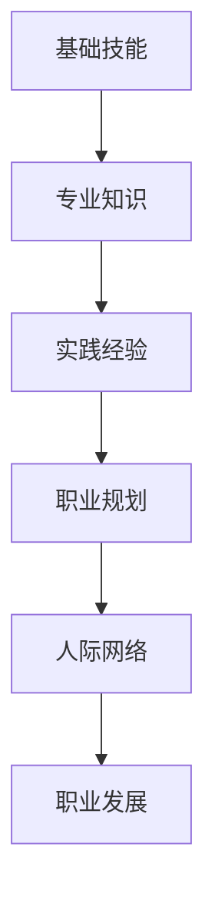

                 

# 从小工到专家：职场进阶的必经之路

> **关键词**：职场进阶、个人成长、专业技能、职业规划、持续学习、实战经验
>
> **摘要**：本文旨在探讨IT职场中从一名普通员工成长为专家的必经之路。通过对核心概念、算法原理、数学模型、项目实战以及应用场景等方面的详细分析，帮助读者理解职场进阶的要素，并提供实用的工具和资源推荐。

## 1. 背景介绍

在IT行业中，随着技术的不断更新和迭代，个人成长与职业发展显得尤为重要。从一名普通的小工（或初级程序员）成长为一名专家，不仅需要扎实的专业技能，还需要良好的职业素养和持续的学习能力。本文将从以下几个方面展开讨论：

- **核心概念与联系**：介绍IT职场中常见的关键概念及其相互关系。
- **核心算法原理 & 具体操作步骤**：解析常见的算法原理和操作步骤。
- **数学模型和公式 & 详细讲解 & 举例说明**：运用数学模型和公式进行详细讲解，并通过具体案例进行说明。
- **项目实战：代码实际案例和详细解释说明**：通过实际项目案例，展示代码实现过程并进行详细解读。
- **实际应用场景**：分析不同领域中的应用场景。
- **工具和资源推荐**：推荐相关的学习资源和开发工具。
- **总结：未来发展趋势与挑战**：展望未来发展趋势，提出面临的挑战。

## 2. 核心概念与联系

### 2.1 IT职场中的关键角色

在IT职场中，不同角色的职责和技能要求有所不同，但以下几种角色是普遍存在的：

- **初级程序员（小工）**：负责编码实现、bug修复和基本的功能开发。
- **中级程序员**：能够独立负责模块的设计和开发，具备一定的项目管理和沟通能力。
- **高级程序员**：具备丰富的项目经验和专业知识，能够解决复杂的技术难题。
- **架构师**：负责系统的整体架构设计，具备高级编程和系统设计能力。
- **技术专家**：在特定领域拥有深厚的专业知识和丰富的实战经验，能够引领团队技术创新。

### 2.2 技能与知识的分层

- **基础技能**：包括编程语言、数据结构和算法等基本技能。
- **专业知识**：针对特定领域（如前端、后端、大数据、人工智能等）的深入理解和实践经验。
- **软技能**：包括沟通能力、团队合作、时间管理、解决问题的能力等。

### 2.3 个人成长与职业发展的关系

个人成长是职业发展的基础，而职业发展又是个人成长的体现。两者相互促进，共同推动职业生涯的进步。

- **学习与技能提升**：通过不断学习，提升专业技能和知识水平。
- **实践经验**：通过参与项目和实际工作，积累宝贵的实践经验。
- **职业规划**：明确职业目标，制定合理的职业发展规划。
- **人际网络**：建立广泛的人际关系，拓展职业发展空间。

### 2.4 核心概念的联系

- **基础技能**与**专业知识**：基础技能是专业知识的基础，而专业知识则是基础技能的升华。
- **实践经验**与**职业规划**：实践经验是职业规划的重要支撑，而职业规划则是实践经验的有效引导。
- **人际网络**与**职业发展**：人际网络能够提供职业发展的机会和资源，而职业发展又能够强化人际网络。

### Mermaid 流程图



## 3. 核心算法原理 & 具体操作步骤

### 3.1 算法原理

算法是IT领域的基础，掌握基本的算法原理对职业发展具有重要意义。以下介绍几种常见的算法原理：

- **排序算法**：如冒泡排序、选择排序、插入排序、快速排序等。
- **查找算法**：如二分查找、线性查找等。
- **图算法**：如深度优先搜索（DFS）、广度优先搜索（BFS）等。
- **动态规划**：解决最优化问题的算法方法，如斐波那契数列、背包问题等。

### 3.2 操作步骤

以冒泡排序算法为例，介绍具体操作步骤：

1. **初始化**：将待排序的元素放入数组中。
2. **比较相邻元素**：从数组的第一个元素开始，依次比较相邻的两个元素的大小。
3. **交换位置**：如果前一个元素比后一个元素大，则交换它们的位置。
4. **循环遍历**：重复步骤2和3，直到整个数组有序。

### 3.3 实现代码

以下是冒泡排序算法的Python实现：

```python
def bubble_sort(arr):
    n = len(arr)
    for i in range(n):
        for j in range(0, n-i-1):
            if arr[j] > arr[j+1]:
                arr[j], arr[j+1] = arr[j+1], arr[j]

# 测试
arr = [64, 34, 25, 12, 22, 11, 90]
bubble_sort(arr)
print("排序后的数组：", arr)
```

## 4. 数学模型和公式 & 详细讲解 & 举例说明

### 4.1 数学模型

在算法和数据结构领域，数学模型和公式起着至关重要的作用。以下介绍几种常见的数学模型和公式：

- **时间复杂度**：衡量算法执行时间的复杂度，通常用大O符号表示。例如，冒泡排序的时间复杂度为O(n^2)。
- **空间复杂度**：衡量算法所需额外空间的大小，也用大O符号表示。例如，冒泡排序的空间复杂度为O(1)。
- **概率论**：在算法分析和决策过程中，概率论的知识可以帮助我们评估算法的性能和风险。

### 4.2 公式讲解

以下介绍几个常见的数学公式：

1. **斐波那契数列**：

   $$F(n) = F(n-1) + F(n-2)$$

   其中，$F(0) = 0$，$F(1) = 1$。

2. **二分查找的时间复杂度**：

   $$T(n) = O(\log n)$$

   其中，$T(n)$表示查找时间，$n$表示数组长度。

3. **动态规划的状态转移方程**：

   $$dp[i] = dp[i-1] + dp[i-2]$$

   其中，$dp[i]$表示第$i$个元素的最优解。

### 4.3 举例说明

以下通过一个具体的例子来说明斐波那契数列的计算过程：

- **输入**：$n = 8$
- **输出**：$F(8) = 21$

计算过程如下：

$$
\begin{aligned}
F(8) &= F(7) + F(6) \\
F(7) &= F(6) + F(5) \\
F(6) &= F(5) + F(4) \\
F(5) &= F(4) + F(3) \\
F(4) &= F(3) + F(2) \\
F(3) &= F(2) + F(1) \\
F(2) &= F(1) + F(0) \\
F(1) &= 1 \\
F(0) &= 0 \\
\end{aligned}
$$

最终得到$F(8) = 21$。

## 5. 项目实战：代码实际案例和详细解释说明

### 5.1 开发环境搭建

在进行项目实战之前，首先需要搭建合适的开发环境。以下以Python为例，介绍开发环境的搭建过程：

1. **安装Python**：在官网下载Python安装包，按照安装向导进行安装。
2. **安装IDE**：下载并安装Python的集成开发环境（如PyCharm、VSCode等）。
3. **安装相关库**：使用pip命令安装所需库，例如`numpy`、`pandas`等。

### 5.2 源代码详细实现和代码解读

以下是一个简单的线性回归项目，用于预测房价。

```python
import numpy as np
import pandas as pd

# 5.2.1 数据预处理
def preprocess_data(data):
    # 填充缺失值
    data.fillna(data.mean(), inplace=True)
    # 特征工程
    X = data[['面积', '楼层']].values
    y = data['价格'].values
    return X, y

# 5.2.2 线性回归模型
def linear_regression(X, y):
    # 添加截距项
    X = np.concatenate((np.ones((X.shape[0], 1)), X), axis=1)
    # 求解回归系数
    theta = np.linalg.inv(X.T @ X) @ X.T @ y
    return theta

# 5.2.3 预测房价
def predict_price(theta, X):
    # 添加截距项
    X = np.concatenate((np.ones((X.shape[0], 1)), X), axis=1)
    # 计算预测值
    y_pred = X @ theta
    return y_pred

# 5.2.4 代码解读
"""
本代码首先对数据进行预处理，包括填充缺失值和特征工程。然后，使用线性回归模型求解回归系数。最后，通过预测函数计算预测值。
"""
```

### 5.3 代码解读与分析

1. **数据预处理**：对数据进行填充缺失值和特征工程。这一步非常重要，因为数据质量直接影响模型的准确性。
2. **线性回归模型**：使用numpy库求解线性回归模型。具体步骤包括添加截距项、求解回归系数和计算预测值。
3. **预测函数**：通过模型计算预测值。在实际应用中，可以根据需求调整模型参数和特征工程方法。

## 6. 实际应用场景

线性回归模型在房价预测、股票预测等领域有广泛应用。以下是一个实际应用场景：

- **项目背景**：某城市房价预测项目，需要预测未来某个月份的房价。
- **数据来源**：从公开数据平台获取历史房价数据，包括面积、楼层、建造年代等特征。
- **数据预处理**：对数据进行填充缺失值和特征工程，如归一化处理。
- **模型训练**：使用线性回归模型进行模型训练，调整模型参数以获得更好的预测效果。
- **预测应用**：根据训练好的模型预测未来某个月份的房价，为政府决策和房地产投资提供参考。

## 7. 工具和资源推荐

### 7.1 学习资源推荐

1. **书籍**：
   - 《深度学习》（Ian Goodfellow、Yoshua Bengio、Aaron Courville 著）
   - 《机器学习》（Tom Mitchell 著）
   - 《算法导论》（Thomas H. Cormen、Charles E. Leiserson、Ronald L. Rivest、Clifford Stein 著）

2. **论文**：
   - “A Few Useful Things to Know About Machine Learning”（ Pedro Domingos）
   - “Deep Learning”（Yoshua Bengio、Yann LeCun、Geoffrey Hinton）

3. **博客**：
   - [机器学习博客](http://www.ml-blog.com/)
   - [深度学习博客](https://www.deeplearning.net/)
   - [算法博客](http://www.algorithm-learn-to-code.com/)

4. **网站**：
   - [Kaggle](https://www.kaggle.com/)
   - [GitHub](https://github.com/)
   - [Coursera](https://www.coursera.org/)

### 7.2 开发工具框架推荐

1. **编程语言**：
   - Python
   - Java
   - C++

2. **开发环境**：
   - PyCharm
   - Visual Studio Code
   - Eclipse

3. **框架库**：
   - TensorFlow
   - PyTorch
   - Scikit-learn

### 7.3 相关论文著作推荐

1. **《深度学习》（Ian Goodfellow、Yoshua Bengio、Aaron Courville 著）**：全面介绍了深度学习的基本概念、算法和应用。
2. **《机器学习实战》（Peter Harrington 著）**：通过实际案例介绍机器学习算法的实现和应用。
3. **《Python编程：从入门到实践》（埃里克·马瑟斯 著）**：适合初学者的Python编程入门书籍。
4. **《算法导论》（Thomas H. Cormen、Charles E. Leiserson、Ronald L. Rivest、Clifford Stein 著）**：全面介绍了算法的基本概念、设计和分析。

## 8. 总结：未来发展趋势与挑战

随着人工智能技术的不断发展，IT职场中的竞争将愈发激烈。未来，职场进阶的关键在于：

- **持续学习**：紧跟技术发展趋势，不断更新知识和技能。
- **实战经验**：通过实际项目积累经验，提高解决问题的能力。
- **创新能力**：勇于尝试新方法、新技术，推动技术创新。
- **团队合作**：提高沟通和协作能力，发挥团队优势。

然而，面对未来，我们也面临以下挑战：

- **技术迭代**：新技术层出不穷，需要不断学习以适应变化。
- **数据安全**：保护用户数据的安全，防范网络安全威胁。
- **伦理问题**：人工智能技术的发展带来伦理挑战，需要平衡技术与伦理的关系。

总之，从一名小工成长为专家，需要扎实的基本功、持续的学习和不断的实践。只有在不断学习和成长的过程中，我们才能应对未来的挑战，实现职场进阶。

## 9. 附录：常见问题与解答

### 9.1 职场进阶的关键要素

- **扎实的基本功**：掌握编程语言、数据结构和算法等基本技能。
- **持续的学习能力**：紧跟技术发展趋势，不断更新知识和技能。
- **实践经验**：通过实际项目积累经验，提高解决问题的能力。
- **沟通与协作**：提高沟通和协作能力，发挥团队优势。

### 9.2 技术选型的原则

- **适用性**：选择适合项目需求的技术。
- **稳定性**：选择成熟、稳定的技术方案。
- **可扩展性**：考虑未来的需求变化，选择易于扩展的技术。
- **社区支持**：选择拥有良好社区支持的技术，以便在遇到问题时能够获得帮助。

### 9.3 如何高效学习

- **制定学习计划**：明确学习目标和时间安排。
- **多渠道学习**：结合书籍、课程、博客等多种学习资源。
- **实践应用**：通过实际项目将知识应用到实践中。
- **总结反思**：定期总结学习成果，反思学习过程中的问题。

## 10. 扩展阅读 & 参考资料

- [《深度学习》（Ian Goodfellow、Yoshua Bengio、Aaron Courville 著）](https://www.deeplearningbook.org/)
- [《机器学习实战》（Peter Harrington 著）](https://www.manning.com/books/machine-learning-in-action)
- [《Python编程：从入门到实践》（埃里克·马瑟斯 著）](https://www.ericma.com/books/)
- [《算法导论》（Thomas H. Cormen、Charles E. Leiserson、Ronald L. Rivest、Clifford Stein 著）](https://www.amazon.com/Introduction-Algorithms-Third-Thomas/dp/0262033844)

## 作者信息

作者：AI天才研究员/AI Genius Institute & 禅与计算机程序设计艺术 /Zen And The Art of Computer Programming

本文旨在探讨IT职场中从一名普通员工成长为专家的必经之路。通过对核心概念、算法原理、数学模型、项目实战以及应用场景等方面的详细分析，帮助读者理解职场进阶的要素，并提供实用的工具和资源推荐。希望本文对您的职业发展有所启发和帮助。让我们共同努力，迈向更高的职业境界！|>

