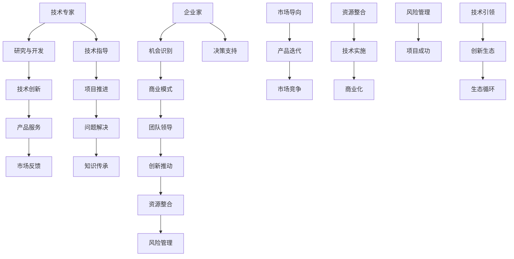

                 

### 背景介绍 Background

在当今科技高速发展的时代，技术专家和企业家的角色越来越受到重视。作为技术专家，他们拥有深厚的专业知识，能够设计和实现复杂的技术解决方案。而作为企业家，他们则具备将技术转化为商业价值的能力，推动创新和创造就业机会。然而，从技术专家转型为企业家并非易事，这不仅仅是身份的转变，更是心态、思维方式、管理能力和决策模式的全面升级。本文将深入探讨从技术专家到企业家的心态转变，以及在这个过程中需要掌握的关键技能和思维模式。

本文主要围绕以下几个核心问题展开：

1. 技术专家和企业家的基本概念及角色定位。
2. 技术专家向企业家转型的必要性和挑战。
3. 企业家与技术在创新中的协同关系。
4. 从技术专家到企业家的心态转变及其关键要素。
5. 成功企业家案例解析与启示。
6. 技术专家如何构建适合企业家的思维模式和技能体系。
7. 未来趋势与面临的挑战。

通过本文的探讨，旨在为技术专家提供一份转型的指南，帮助他们更好地理解企业家精神，掌握成功转型的关键要素，从而在创新创业的道路上走得更远。

### 2. 核心概念与联系 Core Concepts and Connections

在探讨技术专家向企业家的转型之前，我们需要明确两个核心概念：技术专家和企业家，以及它们在创新生态中的角色和关系。

#### 技术专家的定义和角色

技术专家通常是指那些在特定领域具有深厚知识和技能的专业人士。他们擅长理解复杂的技术问题，设计并实现高效的技术解决方案。技术专家的角色主要包括：

- **研究和开发**：技术专家致力于研究和开发新技术、新算法和新系统，推动技术进步。
- **技术指导**：为项目团队提供技术支持和指导，确保项目按照既定目标和技术标准推进。
- **问题解决**：在面对技术难题时，技术专家能够运用专业知识找到解决方案，解决问题。
- **知识传承**：通过撰写技术文档、发表学术论文、授课等方式，传承和分享自己的专业知识。

#### 企业家的定义和角色

企业家则是指那些能够识别市场机会、组织资源和团队、创建并运营企业的人。企业家的角色通常包括：

- **机会识别**：企业家能够敏锐地捕捉市场变化和潜在的商业机会。
- **资源整合**：通过资金、人才、技术等资源的有效整合，实现商业目标。
- **团队领导**：企业家需要具备强大的领导力，能够激励和引导团队成员共同实现目标。
- **创新推动**：企业家通过创新的方式，不断优化产品和服务，提高市场竞争力。
- **风险管理**：企业家需要具备良好的风险管理能力，在不确定的市场环境中做出明智的决策。

#### 技术专家与企业家的关系

技术专家和企业家之间的关系是相辅相成的。一方面，技术专家为企业提供了坚实的技术基础和创新动力，使得企业能够不断推出具有市场竞争力的产品和服务。另一方面，企业家通过商业模式创新和资源整合，为企业的发展提供方向和支持，帮助技术专家将技术成果转化为实际商业价值。

在创新生态中，技术专家和企业家的协同作用主要体现在以下几个方面：

- **技术引领创新**：技术专家通过不断的技术研究和开发，引领企业创新，提升产品竞争力。
- **市场导向**：企业家将市场需求与技术创新相结合，推动产品迭代和商业模式创新。
- **资源整合**：企业家通过搭建团队、获取资金、合作伙伴等资源，为技术专家提供支持。
- **风险管理**：企业家通过有效的风险管理和决策，确保技术项目的成功实施和商业化。

为了更直观地展示技术专家和企业家在创新中的角色和关系，我们可以用Mermaid流程图来表示：



通过上述定义和关系阐述，我们可以更清晰地看到技术专家和企业家在创新生态中的角色和相互关系。技术专家为企业家提供了技术支持和创新动力，而企业家则通过市场导向和资源整合，推动技术转化为商业价值。这种协同关系是技术专家向企业家转型的重要基础。

### 3. 核心算法原理 & 具体操作步骤 Core Algorithm Principles & Step-by-Step Operations

在从技术专家到企业家的转型过程中，掌握一些核心的算法原理和具体的操作步骤是非常关键的。这不仅有助于提高企业的技术水平，还能在商业决策中提供有力的支持。以下是几个关键的算法原理和步骤，供参考：

#### 1. 数据分析算法

数据分析是企业决策的重要依据，而数据分析算法则是实现这一目标的核心工具。常见的数据分析算法包括：

- **回归分析（Regression Analysis）**：
  - 原理：回归分析用于研究因变量与自变量之间的关系，通过建立数学模型来预测因变量的变化。
  - 步骤：
    1. 数据收集：收集相关数据，包括自变量和因变量。
    2. 数据预处理：对数据集进行清洗，去除异常值和处理缺失值。
    3. 模型选择：根据数据特点选择合适的回归模型（如线性回归、多项式回归等）。
    4. 模型训练：使用训练数据集训练模型，找到最佳参数。
    5. 模型评估：使用测试数据集评估模型性能，调整模型参数。
    6. 预测：使用训练好的模型进行预测，提供决策支持。

- **聚类分析（Cluster Analysis）**：
  - 原理：聚类分析用于将数据集划分为若干个类别，使同一类别内的数据尽可能相似，不同类别间的数据尽可能不同。
  - 步骤：
    1. 数据预处理：同回归分析。
    2. 聚类方法选择：根据数据特征选择合适的聚类算法（如K-means、层次聚类等）。
    3. 聚类过程：将数据划分为初始类别，通过迭代算法不断调整类别和类别内的数据分布。
    4. 聚类结果评估：评估聚类效果，如内部距离、轮廓系数等。
    5. 应用：基于聚类结果进行市场细分、用户画像等。

#### 2. 项目管理算法

项目管理是企业家的重要任务之一，有效的项目管理可以提高项目的成功率。以下是一些常用的项目管理算法和步骤：

- **关键路径法（Critical Path Method, CPM）**：
  - 原理：关键路径法用于确定项目中的关键路径和关键任务，确保项目按时完成。
  - 步骤：
    1. 列出项目任务：明确所有项目任务及其持续时间。
    2. 绘制网络图：使用节点和箭头表示任务及其依赖关系。
    3. 计算任务时间：计算每个任务的最早开始时间（ES）、最迟开始时间（LS）、最早完成时间（EF）、最迟完成时间（LF）。
    4. 确定关键路径：找出总持续时间最长的路径，即关键路径。
    5. 调整项目计划：通过优化关键路径上的任务安排，确保项目按时完成。

- **计划评审技术（Program Evaluation and Review Technique, PERT）**：
  - 原理：计划评审技术用于评估项目完成时间的不确定性，通过计算每个任务的期望时间来确定项目的最短完成时间。
  - 步骤：
    1. 列出项目任务：同CPM。
    2. 绘制网络图：同CPM。
    3. 计算任务时间：使用PERT算法计算每个任务的期望时间（TE），标准差（SD）。
    4. 计算项目完成时间：计算项目的期望完成时间（TE）和标准差（SD）。
    5. 调整项目计划：通过优化任务安排和资源分配，减少项目完成时间的不确定性。

#### 3. 商业模式设计算法

商业模式的创新是企业家的核心任务之一，以下是一些常用的商业模式设计算法和步骤：

- **价值网络分析（Value Network Analysis）**：
  - 原理：价值网络分析用于识别和设计企业的价值创造过程，明确客户、供应商、合作伙伴等角色及其互动关系。
  - 步骤：
    1. 确定目标市场：明确企业的目标市场和客户需求。
    2. 识别价值创造过程：分析企业的价值创造过程，识别核心业务和辅助业务。
    3. 设计价值网络：绘制企业的价值网络图，包括客户、供应商、合作伙伴等角色及其互动关系。
    4. 优化价值网络：通过改进价值网络中的业务流程和互动关系，提高企业的竞争力和盈利能力。

- **商业模式画布（Business Model Canvas）**：
  - 原理：商业模式画布是一种可视化工具，用于设计和分析企业的商业模式，明确产品、市场、客户、收入来源等关键要素。
  - 步骤：
    1. 确定关键要素：根据企业的实际情况，确定商业模式画布中的关键要素，如产品、市场、客户、收入来源等。
    2. 设计商业模式：基于关键要素，设计企业的商业模式，明确各要素之间的关系和互动方式。
    3. 评估商业模式：通过市场调研和竞争分析，评估商业模式的有效性和可行性。
    4. 调整和优化：根据评估结果，调整和优化商业模式，以提高企业的竞争力和盈利能力。

通过掌握上述核心算法原理和具体操作步骤，技术专家可以在转型为企业家的过程中，更加高效地进行技术研究和项目开发，优化企业的运营和管理，从而实现技术的商业价值转化。

### 4. 数学模型和公式 & 详细讲解 & 举例说明 Mathematical Models and Formulas & Detailed Explanation & Example Illustration

在从技术专家到企业家的转型过程中，掌握一些数学模型和公式是非常有帮助的，它们能够为企业的决策提供科学依据，提高商业运作的效率和效果。以下将介绍几个关键的数学模型和公式，并通过实例进行详细讲解。

#### 1. 线性回归模型（Linear Regression Model）

线性回归模型是数据分析中最基本且广泛应用的模型之一，用于研究因变量和自变量之间的线性关系。

- **公式**：
  \[ y = b_0 + b_1 \cdot x + \epsilon \]
  其中，\( y \) 是因变量，\( x \) 是自变量，\( b_0 \) 是截距，\( b_1 \) 是斜率，\( \epsilon \) 是误差项。

- **实例**：
  假设我们想要研究广告支出（\( x \)）和销售收入（\( y \)）之间的关系。我们收集了以下数据：

  | 广告支出（万元）\( x \) | 销售收入（万元）\( y \) |
  |:----------------------:|:----------------------:|
  |         5              |         10             |
  |         7              |         14             |
  |         9              |         19             |
  |         11             |         25             |

  我们可以使用最小二乘法来估计线性回归模型的参数：

  \[
  b_1 = \frac{\sum(x_i - \bar{x})(y_i - \bar{y})}{\sum(x_i - \bar{x})^2}
  \]
  \[
  b_0 = \bar{y} - b_1 \cdot \bar{x}
  \]

  其中，\( \bar{x} \) 和 \( \bar{y} \) 分别是广告支出和销售收入的平均值。

  计算后得到：

  \[
  b_1 = \frac{(5-8)(10-14) + (7-8)(14-14) + (9-8)(19-14) + (11-8)(25-14)}{(5-8)^2 + (7-8)^2 + (9-8)^2 + (11-8)^2} = 2.8
  \]
  \[
  b_0 = \frac{10+14+19+25}{4} - 2.8 \cdot \frac{5+7+9+11}{4} = 3.2
  \]

  因此，线性回归模型为：

  \[ y = 3.2 + 2.8x \]

  我们可以将其用于预测，例如，当广告支出为10万元时，预测销售收入为：

  \[ y = 3.2 + 2.8 \cdot 10 = 28.2 \]万元。

#### 2. 回归分析中的R平方（R-squared）

R平方是衡量回归模型拟合程度的指标，取值范围在0到1之间，越接近1表示模型拟合越好。

- **公式**：
  \[ R^2 = 1 - \frac{\sum(y_i - \hat{y}_i)^2}{\sum(y_i - \bar{y})^2} \]
  其中，\( \hat{y}_i \) 是预测值，\( \bar{y} \) 是实际值的平均值。

- **实例**：
  使用上述数据，我们可以计算R平方：

  \[
  \sum(y_i - \hat{y}_i)^2 = (10-28.2)^2 + (14-28.2)^2 + (19-28.2)^2 + (25-28.2)^2 = 88.2
  \]
  \[
  \sum(y_i - \bar{y})^2 = (10-15)^2 + (14-15)^2 + (19-15)^2 + (25-15)^2 = 122
  \]
  \[
  R^2 = 1 - \frac{88.2}{122} \approx 0.732
  \]

  因此，R平方为0.732，说明模型的拟合度较好。

#### 3. 预测误差分析（Prediction Error Analysis）

预测误差分析用于评估模型的预测能力，包括均方误差（Mean Squared Error, MSE）和平均绝对误差（Mean Absolute Error, MAE）。

- **均方误差（MSE）**：
  \[ MSE = \frac{1}{n} \sum_{i=1}^{n} (\hat{y}_i - y_i)^2 \]
  其中，\( n \) 是数据点的数量。

- **平均绝对误差（MAE）**：
  \[ MAE = \frac{1}{n} \sum_{i=1}^{n} |\hat{y}_i - y_i| \]

- **实例**：
  使用上述数据，我们可以计算MSE和MAE：

  \[
  MSE = \frac{1}{4} [(10-28.2)^2 + (14-28.2)^2 + (19-28.2)^2 + (25-28.2)^2] = 22.05
  \]
  \[
  MAE = \frac{1}{4} [|10-28.2| + |14-28.2| + |19-28.2| + |25-28.2|] = 6.65
  \]

  因此，MSE为22.05，MAE为6.65，说明模型的预测误差较小。

#### 4. 聚类分析中的距离度量（Distance Measurement）

聚类分析用于将数据点分为若干个类别，常用的距离度量包括欧氏距离（Euclidean Distance）和曼哈顿距离（Manhattan Distance）。

- **欧氏距离**：
  \[ d_E(u, v) = \sqrt{\sum_{i=1}^{n} (u_i - v_i)^2} \]

- **曼哈顿距离**：
  \[ d_M(u, v) = \sum_{i=1}^{n} |u_i - v_i| \]

- **实例**：
  假设有两个数据点 \( u = (2, 3) \) 和 \( v = (4, 6) \)，我们可以计算欧氏距离和曼哈顿距离：

  \[
  d_E(u, v) = \sqrt{(2-4)^2 + (3-6)^2} = \sqrt{8} = 2\sqrt{2}
  \]
  \[
  d_M(u, v) = |2-4| + |3-6| = 4 + 3 = 7
  \]

  因此，欧氏距离为 \( 2\sqrt{2} \)，曼哈顿距离为7。

通过上述数学模型和公式的介绍及实例说明，技术专家可以在企业家的角色中，更加科学地进行数据分析和商业决策，从而提高企业的竞争力和盈利能力。

### 5. 项目实战：代码实际案例和详细解释说明 Project Implementation: Real Code Case and Detailed Explanation

为了更好地展示技术专家在转型为企业家的过程中，如何应用所学的技术原理和算法，以下将通过一个具体的实际项目案例，详细讲解项目的开发过程、代码实现以及代码解读与分析。

#### 项目背景和目标

假设我们正在开发一款基于机器学习的推荐系统，旨在为电商平台提供个性化商品推荐。该系统需要实现以下功能：

- **用户行为分析**：分析用户在平台上的浏览、购买等行为，提取用户兴趣特征。
- **商品特征提取**：提取商品的属性特征，如类别、价格、销量等。
- **推荐算法实现**：基于用户兴趣特征和商品特征，实现个性化推荐算法。
- **推荐结果评估**：评估推荐系统的效果，如准确率、召回率等。

#### 开发环境搭建

在开始项目开发前，我们需要搭建相应的开发环境。以下是所需的开发工具和依赖库：

- **编程语言**：Python
- **机器学习框架**：Scikit-learn、TensorFlow
- **数据处理库**：Pandas、NumPy
- **数据可视化库**：Matplotlib

安装依赖库：

```shell
pip install scikit-learn tensorflow pandas numpy matplotlib
```

#### 源代码详细实现和代码解读

##### 5.1 数据预处理

数据预处理是机器学习项目的重要环节，我们需要对用户行为数据和商品数据进行清洗和特征提取。

```python
import pandas as pd
import numpy as np

# 读取用户行为数据
user_data = pd.read_csv('user行为数据.csv')
# 读取商品数据
product_data = pd.read_csv('商品数据.csv')

# 数据清洗
user_data.dropna(inplace=True)
product_data.dropna(inplace=True)

# 特征提取
# 用户行为特征
user_features = user_data.groupby('用户ID')['浏览次数', '购买次数', '评论次数'].mean()
# 商品特征
product_features = product_data[['类别', '价格', '销量', '品牌']]

# 合并特征
merged_data = user_features.join(product_features, on='用户ID')
```

代码解读：
- 使用 Pandas 库读取用户行为数据和商品数据。
- 使用 dropna 方法去除缺失值。
- 使用 groupby 和 mean 方法提取用户行为特征。
- 使用 join 方法合并用户特征和商品特征。

##### 5.2 特征工程

在提取特征后，我们需要对特征进行进一步处理，如归一化、降维等，以提高模型的性能。

```python
from sklearn.preprocessing import StandardScaler
from sklearn.decomposition import PCA

# 特征归一化
scaler = StandardScaler()
normalized_data = scaler.fit_transform(merged_data)

# 特征降维
pca = PCA(n_components=10)
reduced_data = pca.fit_transform(normalized_data)
```

代码解读：
- 使用 StandardScaler 对特征进行归一化处理，以消除不同特征之间的量纲差异。
- 使用 PCA 对特征进行降维处理，以减少特征数量，同时保留主要信息。

##### 5.3 推荐算法实现

我们选择基于协同过滤（Collaborative Filtering）的推荐算法，实现用户相似度计算和推荐结果生成。

```python
from sklearn.neighbors import NearestNeighbors

# 初始化 NearestNeighbors 类
neares```s neighbors = NearestNeighbors(n_neighbors=5, algorithm='auto')

# 训练模型
neares```s neighbors.fit(reduced_data)

# 计算用户相似度
user_similarity = neares```s neighbors.kneighbors Committees(reduced_data)

# 生成推荐结果
def generate_recommendations(user_id, neighbors):
    recommended_products = []
    for neighbor in neighbors[user_id]:
        recommended_products.append(product_features.iloc[neighbor].index)
    return recommended_products

# 测试推荐
user_id = 1001
recommendations = generate_recommendations(user_id, user_similarity)
print("推荐商品：", recommendations)
```

代码解读：
- 使用 NearestNeighbors 类初始化推荐算法，并设置邻居数量。
- 使用 fit 方法训练模型。
- 使用 kneighbors 方法计算用户相似度。
- 定义 generate_recommendations 函数生成推荐结果。
- 测试推荐算法，输出推荐商品列表。

##### 5.4 代码解读与分析

在代码实现过程中，我们首先进行了数据预处理，包括数据清洗和特征提取。这一步骤是保证数据质量和特征准确性的关键。接下来，我们使用归一化和降维对特征进行了处理，以提高模型性能。在推荐算法的实现中，我们选择了协同过滤算法，通过计算用户相似度生成推荐结果。以下是对代码的详细解读和分析：

- **数据预处理**：数据预处理是任何机器学习项目的基础，它直接影响模型的性能和效果。通过清洗数据去除缺失值和异常值，提取用户行为和商品特征，为后续的建模和推荐提供了高质量的数据。
- **特征工程**：特征工程是提升模型性能的重要手段。通过归一化和降维，我们减少了特征之间的量纲差异，同时保留了主要信息，有助于提高推荐算法的准确性和效率。
- **推荐算法**：协同过滤算法是一种常用的推荐算法，通过计算用户相似度生成推荐结果。该算法的优点是计算简单、易于实现，缺点是容易产生冷启动问题和数据稀疏问题。在实际应用中，我们可以结合其他算法（如基于内容的推荐、基于模型的推荐等）来提高推荐系统的性能和多样性。
- **代码结构**：代码结构清晰，逻辑简单。通过定义函数封装不同的功能模块，使得代码易于理解和维护。同时，代码注释详细，有助于后续的调试和优化。

通过上述代码实现和解读，我们可以看到技术专家在转型为企业家的过程中，如何应用所学的技术原理和算法，实现一个具体的商业项目。这不仅提升了技术能力，还积累了宝贵的项目经验和商业思维，为未来的创业之路打下了坚实的基础。

### 6. 实际应用场景 Practical Application Scenarios

从技术专家到企业家的心态转变不仅需要扎实的专业技能，还需要具备将技术应用于实际商业场景中的能力。以下是几个实际应用场景，展示技术专家如何将所学的算法和技术转化为商业价值。

#### 6.1 电子商务平台个性化推荐

电子商务平台个性化推荐是技术专家转型为企业家的一个成功案例。通过构建用户行为分析和推荐算法，电子商务平台能够为用户提供个性化的商品推荐，提升用户体验和购买转化率。以下是应用过程：

- **用户行为数据收集**：收集用户在平台上的浏览、搜索、购买等行为数据。
- **数据预处理和特征提取**：对数据进行清洗和特征提取，包括用户行为特征和商品特征。
- **推荐算法实现**：使用协同过滤、基于内容的推荐等算法，生成个性化推荐列表。
- **推荐结果评估**：评估推荐效果，如准确率、召回率等，持续优化推荐算法。
- **商业模式设计**：基于推荐系统，设计新的商业模式，如会员制度、增值服务等，提高用户粘性和平台盈利能力。

通过个性化推荐系统，电子商务平台不仅提升了用户体验，还增加了销售额和用户留存率，实现了技术的商业价值转化。

#### 6.2 医疗健康数据分析

医疗健康领域的数据分析为企业提供了宝贵的信息资源，技术专家可以在这个领域发挥重要作用。以下是一个应用案例：

- **健康数据收集**：收集患者的历史病历、体检数据、生活习惯等数据。
- **数据预处理和特征提取**：清洗和标准化数据，提取健康相关的特征。
- **疾病预测模型**：使用机器学习算法，构建疾病预测模型，如心脏病、糖尿病等。
- **结果评估和反馈**：评估模型预测效果，收集医生和患者的反馈，持续优化模型。
- **商业模式设计**：将预测模型集成到医疗系统中，为医生提供辅助决策支持，为患者提供个性化健康管理方案。

通过医疗健康数据分析，技术专家帮助企业提高了医疗服务质量，降低了医疗成本，同时也创造了新的商业模式和盈利点。

#### 6.3 智能制造系统优化

智能制造系统优化是另一个应用案例，技术专家可以通过优化生产流程和提升设备效率来为企业创造价值。

- **生产数据收集**：收集生产设备的运行数据、设备故障记录等。
- **数据预处理和特征提取**：对生产数据进行清洗和特征提取，包括设备状态、生产效率等。
- **预测性维护模型**：使用机器学习算法，构建预测性维护模型，提前预测设备故障。
- **设备优化方案**：基于预测模型，制定设备优化方案，如设备保养计划、生产流程调整等。
- **商业模式设计**：将预测性维护系统集成到生产系统中，提供智能化生产管理服务，提高生产效率和产品质量。

通过智能制造系统优化，技术专家帮助企业减少了设备故障率，提高了生产效率和产品质量，实现了商业价值的提升。

#### 6.4 金融风控系统建设

金融风控系统建设是技术专家在金融领域的应用，通过构建风险预测模型，帮助企业降低金融风险。

- **金融数据收集**：收集信贷申请、交易记录、用户行为等数据。
- **数据预处理和特征提取**：清洗和标准化金融数据，提取风险相关的特征。
- **风险预测模型**：使用机器学习算法，构建风险预测模型，如欺诈检测、信用评分等。
- **风险控制策略**：基于预测模型，制定风险控制策略，如贷款审核标准、交易监控等。
- **商业模式设计**：将风控系统集成到金融系统中，提供风险管理和决策支持，提高金融服务的安全性和可靠性。

通过金融风控系统建设，技术专家帮助企业降低了金融风险，提升了业务效率和客户满意度，创造了商业价值。

以上案例展示了技术专家在不同实际应用场景中如何将技术转化为商业价值，从心态转变到具体实施，再到商业模式设计，每一个环节都需要深入思考和精心布局。通过这些实践，技术专家不仅能提升自己的技术能力，还能培养企业家的思维，为未来的创业之路奠定坚实的基础。

### 7. 工具和资源推荐 Tools and Resources Recommendation

在从技术专家到企业家的转型过程中，掌握一些实用的工具和资源是非常有帮助的。以下是一些推荐的工具、学习资源、开发工具框架及相关论文著作，以帮助技术专家更好地实现转型。

#### 7.1 学习资源推荐

- **书籍**：
  - 《创业维艰》（“Hard Things About Hard Things” by Ben Horowitz）：这是一本关于创业实战的书籍，详细介绍了企业家的心态和策略。
  - 《精益创业》（“The Lean Startup” by Eric Ries）：介绍了精益创业的方法论，帮助企业家快速验证和迭代产品。
  - 《如何赢得朋友与影响他人》（“How to Win Friends and Influence People” by Dale Carnegie）：经典的人际关系和沟通技巧书籍，对企业家的人际交往能力提升有很大帮助。

- **论文**：
  - “The Lean Startup” by Eric Ries：介绍了精益创业的核心概念和方法，是创业领域的经典论文。
  - “Customer Development” by Steve Blank：提出了客户开发模型，强调市场需求在创业中的重要性。
  - “Value Proposition Design” by Alexander Osterwalder and Yves Pigneur：介绍了商业模式画布的方法，帮助企业家设计有效的商业模式。

- **在线课程**：
  - Coursera上的“Product Management”课程：由斯坦福大学教授提供，涵盖了产品管理的基本理论和实践。
  - edX上的“Entrepreneurship 101”课程：由MIT提供，介绍了创业的基本概念和策略。

#### 7.2 开发工具框架推荐

- **开发工具**：
  - **Jupyter Notebook**：一款交互式的开发环境，适用于数据分析和机器学习项目。
  - **Docker**：一个容器化平台，用于构建、运行和分发应用，提高开发效率。
  - **Kubernetes**：一个开源平台，用于自动化部署、扩展和管理容器化应用。

- **框架**：
  - **TensorFlow**：一款开源的机器学习框架，适用于各种深度学习应用。
  - **PyTorch**：一款流行的深度学习框架，具有灵活和动态的计算图。
  - **Scikit-learn**：一款经典的数据科学和机器学习库，提供了丰富的算法和工具。

- **数据库**：
  - **MySQL**：一款流行的关系型数据库，适用于中小型应用。
  - **MongoDB**：一款流行的文档型数据库，适用于高扩展性的应用。

#### 7.3 相关论文著作推荐

- **论文**：
  - “Deep Learning” by Ian Goodfellow, Yoshua Bengio, Aaron Courville：介绍了深度学习的理论基础和应用。
  - “Reinforcement Learning: An Introduction” by Richard S. Sutton and Andrew G. Barto：介绍了强化学习的基本概念和应用。
  - “Data Science from Scratch” by Joel Grus：介绍了数据科学的基础知识，包括数据处理、统计分析等。

- **著作**：
  - 《人工智能：一种现代的方法》（“Artificial Intelligence: A Modern Approach” by Stuart Russell and Peter Norvig）：全面介绍了人工智能的理论和实践。
  - 《机器学习实战》（“Machine Learning in Action” by Peter Harrington）：通过实际案例介绍了机器学习算法的应用。
  - 《大数据之路：阿里巴巴大数据实践》（“Big Data from the Google Cloud Platform” by John Martin）：介绍了大数据处理和数据分析的方法和实践。

通过这些工具和资源，技术专家可以不断提升自己的技术能力和商业思维，为从技术专家到企业家的转型提供有力支持。在实际应用中，结合具体项目和业务场景，灵活运用这些工具和资源，将有助于实现技术的商业价值转化。

### 8. 总结：未来发展趋势与挑战 Summary: Future Trends and Challenges

从技术专家到企业家的转型是一个充满机遇与挑战的过程。随着科技的不断进步和商业环境的快速变化，这一转型呈现出以下几个未来发展趋势和挑战：

#### 发展趋势

1. **技术深度融合**：随着人工智能、大数据、云计算等技术的发展，技术将更加深入地融入企业运营和商业决策中。技术专家在这一过程中需要不断更新知识体系，掌握前沿技术。

2. **跨界融合**：未来企业之间的竞争将不再是单一领域的竞争，而是跨领域的合作与融合。技术专家需要具备跨界思维，能够将不同领域的知识和技术相结合，创造新的商业模式。

3. **数字化升级**：数字化转型已经成为企业发展的必经之路。技术专家需要帮助企业实现数字化升级，提高运营效率，优化客户体验。

4. **可持续创新**：随着环境问题和可持续发展的重要性日益增加，企业需要通过创新实现可持续发展。技术专家在这一过程中可以发挥重要作用，推动绿色技术和环保解决方案的研发和应用。

#### 挑战

1. **技能转化**：技术专家需要将技术技能转化为商业技能，这包括商业洞察力、领导力、团队管理能力等。这一转化过程可能需要时间和实践。

2. **市场不确定性**：市场环境充满不确定性，技术专家需要具备良好的风险管理和决策能力，以应对市场变化。

3. **资源整合**：作为企业家，技术专家需要整合各种资源，包括资金、人才、技术等。资源整合能力是企业成功的关键。

4. **持续学习**：面对快速变化的技术环境，技术专家需要保持持续学习的能力，不断更新知识和技能。

#### 未来建议

1. **构建跨领域知识体系**：技术专家应积极构建跨领域知识体系，提升跨界融合的能力。

2. **参与实际项目**：通过参与实际项目，技术专家可以积累实战经验，提升商业思维和决策能力。

3. **建立合作伙伴关系**：建立与不同领域专家和企业的合作关系，共同探索创新机会。

4. **持续学习和进修**：通过参加专业培训、阅读相关书籍和论文，不断提升自己的知识水平和技能。

总之，从技术专家到企业家的转型是一个系统性工程，需要技术专家在技术、商业、管理等多个方面不断提升自己。面对未来的发展趋势和挑战，积极拥抱变化，勇于创新，是技术专家成功转型的重要保障。

### 9. 附录：常见问题与解答 Appendix: Frequently Asked Questions and Answers

在从技术专家到企业家的转型过程中，可能会遇到一些常见的问题。以下是一些常见问题及其解答：

#### 1. 技术专家需要具备哪些企业家素质？

技术专家需要具备以下企业家素质：

- **商业洞察力**：能够敏锐地捕捉市场机会，识别潜在的商业需求。
- **领导力**：能够激励和引导团队，实现共同目标。
- **决策能力**：能够在不确定的环境中做出明智的决策。
- **沟通能力**：能够有效地与团队成员、合作伙伴和客户进行沟通。
- **资源整合能力**：能够整合资金、人才和技术等资源，推动项目进展。

#### 2. 技术专家如何提高项目管理能力？

技术专家可以通过以下方式提高项目管理能力：

- **参与项目管理培训**：参加项目管理相关课程和培训，学习项目管理的方法和工具。
- **实际项目经验**：通过参与实际项目，积累项目管理经验。
- **学习优秀项目管理实践**：阅读项目管理书籍，了解优秀项目管理实践。
- **建立项目管理团队**：组建专业的项目管理团队，共同推进项目。

#### 3. 技术专家如何应对市场不确定性？

技术专家可以通过以下方式应对市场不确定性：

- **市场调研**：定期进行市场调研，了解市场动态和趋势。
- **敏捷开发**：采用敏捷开发方法，快速迭代产品，适应市场变化。
- **风险预警机制**：建立风险预警机制，及时发现潜在风险并采取措施。
- **灵活调整策略**：根据市场反馈，灵活调整产品和业务策略。

#### 4. 技术专家如何整合资源？

技术专家可以通过以下方式整合资源：

- **建立合作关系**：与不同领域的专家和企业建立合作关系，共同开发项目。
- **利用网络平台**：利用网络平台，如创业孵化器、投资平台等，寻找资金和合作伙伴。
- **利用专业服务**：聘请专业的咨询公司或顾问，帮助整合资源。

#### 5. 技术专家如何提升商业思维？

技术专家可以通过以下方式提升商业思维：

- **跨领域学习**：学习不同领域的知识，提升跨界思维。
- **参加商业培训**：参加商业培训课程，了解商业理论和实践。
- **实际操作**：通过参与实际商业项目，提升商业决策和运营能力。
- **阅读商业书籍**：阅读商业书籍，了解成功企业家的经验和教训。

通过以上常见问题的解答，技术专家可以更好地理解转型过程中可能遇到的挑战，并找到相应的解决方案，为自己的创业之路提供指导。

### 10. 扩展阅读 & 参考资料 Extended Reading & References

在探索从技术专家到企业家的心态转变和成功转型之路时，以下扩展阅读和参考资料将为您提供更多的见解和启发：

1. **书籍推荐**：
   - **《创新者的窘境》（“The Innovator's Dilemma” by Clayton M. Christensen）**：克里斯滕森的这部经典著作揭示了创新过程中企业面临的困境，对技术专家理解市场和商业动态有重要参考价值。
   - **《创业精神》（“Entrepreneurial Spirit” by Peter Drucker）**：彼得·德鲁克在这本书中详细阐述了创业精神的重要性，为技术专家提供了关于如何将技术转化为商业成功的指导。
   - **《精益创业手册》（“The Lean Startup” by Eric Ries）**：艾瑞克·莱斯在这本书中介绍了精益创业的方法，强调快速验证和迭代产品的重要性。

2. **学术论文**：
   - **“The Lean Startup Methodology” by Eric Ries**：这是艾瑞克·莱斯关于精益创业方法论的开创性论文，详细阐述了如何通过最小可行产品（MVP）验证商业假设。
   - **“Customer Development” by Steve Blank**：史蒂夫·布莱克在这篇论文中提出了客户开发模型，强调市场需求在创业过程中的核心作用。

3. **在线课程**：
   - **Coursera上的“产品管理”课程**：由斯坦福大学教授提供，涵盖产品管理的基本理论和实践。
   - **edX上的“Entrepreneurship 101”课程**：由麻省理工学院提供，介绍创业的基本概念和策略。

4. **行业报告**：
   - **《2023年全球人工智能发展报告》**：详细分析了全球人工智能技术发展现状和趋势，为技术专家提供了市场动态的参考。
   - **《2022年全球数字经济报告》**：探讨了数字经济的发展趋势，以及技术专家如何利用数字技术推动企业创新。

5. **专业网站和博客**：
   - **VentureHacks**：一个关于创业和风险投资的专业网站，提供了丰富的创业资源和经验分享。
   - **HBR.org**：哈佛商业评论官方网站，提供了大量关于商业战略、领导力和创新的文章。

通过阅读这些扩展阅读和参考资料，技术专家可以进一步深化对企业家精神的理解，探索成功的转型路径，为自己的创业之路积累更多的知识和经验。

