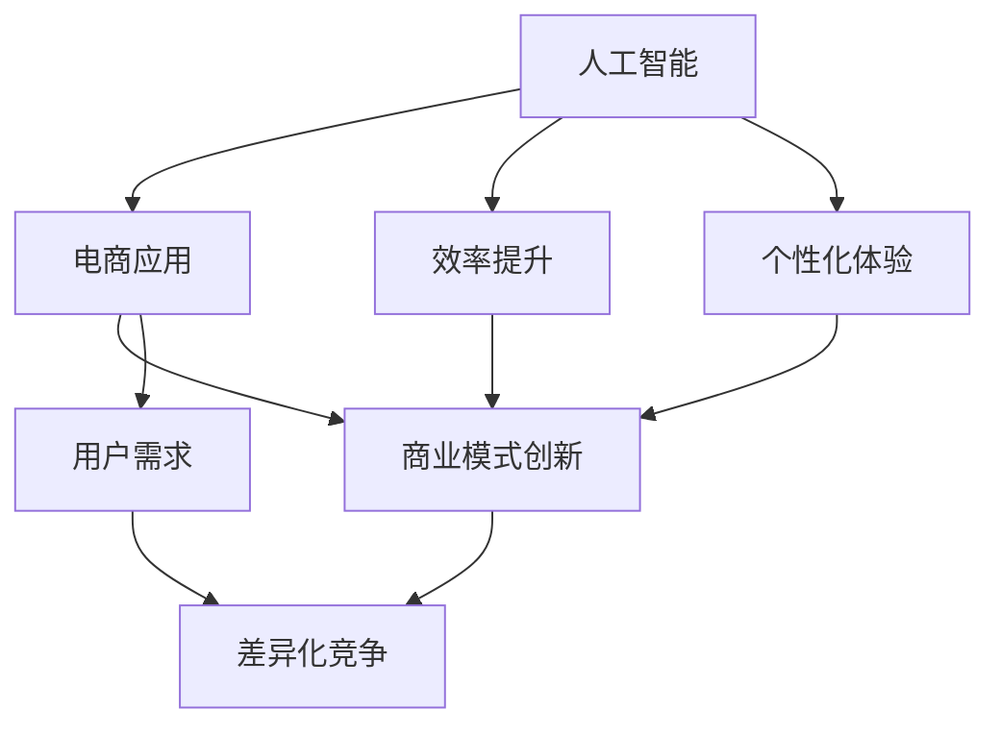
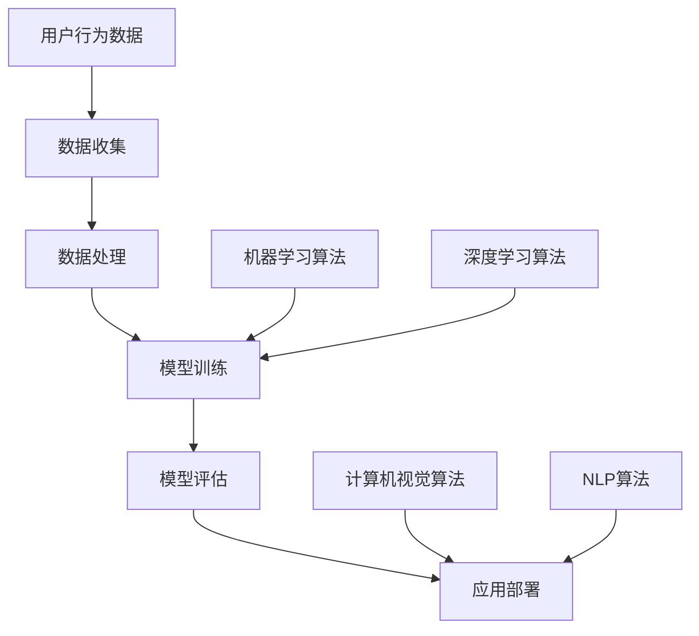

                 

### 从技术创新到商业模式创新：AI电商的差异化竞争策略

#### 关键词：
- AI电商
- 技术创新
- 商业模式创新
- 差异化竞争策略

#### 摘要：
本文旨在探讨AI电商领域的技术创新如何转化为商业模式创新，并进一步塑造企业的差异化竞争策略。通过对核心概念的解析、算法原理的阐述、数学模型的构建、实战案例的分析以及未来趋势的预测，文章试图为AI电商企业提供一套系统的创新策略。

### 背景介绍

随着人工智能技术的快速发展，电商行业正迎来前所未有的变革。AI技术，特别是机器学习、自然语言处理、计算机视觉等，已经开始深入到电商的各个层面，从推荐系统、用户画像、供应链优化到智能客服，都展现出了巨大的潜力和价值。然而，仅仅依靠技术优势，并不能确保企业在竞争激烈的市场中脱颖而出。电商企业还需要通过商业模式创新来提升核心竞争力，从而实现真正的差异化竞争。

商业模式创新，指的是企业在保持核心价值不变的情况下，对盈利模式、业务流程、客户关系等进行革新。在AI电商的背景下，商业模式创新主要体现在如何利用人工智能技术来提高效率、降低成本、提升用户体验，以及如何通过创新来满足消费者的个性化需求。

本文将首先介绍AI电商的基本概念和现状，然后深入探讨技术创新如何转化为商业模式创新，并进一步塑造企业的差异化竞争策略。文章将结合实际案例，分析成功的商业模式创新实践，最后对AI电商的未来发展趋势和挑战进行展望。

### 核心概念与联系

要深入理解AI电商的创新路径，我们需要明确以下几个核心概念及其相互联系。

#### 1. 人工智能（AI）

人工智能是指通过计算机模拟人类智能的技术和系统，包括机器学习、深度学习、自然语言处理、计算机视觉等子领域。这些技术使得机器能够执行复杂的任务，如图像识别、语音识别、推荐系统等。

#### 2. 电商（E-commerce）

电商指的是通过互联网进行商品或服务的交易活动，包括在线零售、电子支付、物流配送等环节。电商的核心目标是提供便捷、高效、个性化的购物体验。

#### 3. 商业模式（Business Model）

商业模式是企业创造、传递和获取价值的基本逻辑。它包括收入来源、成本结构、关键资源、关键活动、客户关系等组成部分。

#### 4. 差异化竞争（Differentiation）

差异化竞争是指企业通过提供独特的产品或服务，以满足消费者特定的需求和偏好，从而在市场中获得竞争优势。

#### 关系

AI与电商的关系体现在人工智能技术如何被应用于电商的各个层面，从而提升效率和用户体验。商业模式创新则是利用这些技术，重新设计企业的收入模式、业务流程和客户关系，实现差异化竞争。

以下是一个简单的Mermaid流程图，展示了这些核心概念之间的联系：



#### 核心算法原理 & 具体操作步骤

在AI电商中，核心算法的原理通常涉及以下几个方面：

1. **推荐系统**：通过用户历史行为和偏好数据，预测用户可能感兴趣的商品或服务。
2. **用户画像**：收集用户行为数据，建立用户画像，用于个性化推荐和服务。
3. **计算机视觉**：用于商品识别、图像处理，提升用户购物体验。
4. **自然语言处理**：用于处理用户查询、评价和评论，提供智能客服和个性化服务。

**具体操作步骤如下**：

1. **数据收集**：收集用户行为数据，如浏览记录、购买历史、评价等。
2. **数据处理**：清洗、整合和标准化数据，为后续分析做准备。
3. **模型训练**：使用机器学习和深度学习算法，训练推荐模型、用户画像模型等。
4. **模型评估**：通过交叉验证、A/B测试等方法，评估模型性能。
5. **应用部署**：将训练好的模型部署到电商平台上，提供个性化推荐和服务。

以下是一个简化的Mermaid流程图，展示了核心算法原理和具体操作步骤：



### 数学模型和公式 & 详细讲解 & 举例说明

在AI电商中，数学模型和公式是核心算法的基础，用于预测用户行为、优化推荐系统等。以下是一些常用的数学模型和公式：

#### 1. 协同过滤推荐算法

协同过滤推荐算法是基于用户历史行为和偏好进行推荐的常用方法。其基本公式如下：

$$
\hat{r_{ui}} = \frac{\sum_{j \in N_i} r_{uj} \cdot r_{ui}}{\sum_{j \in N_i} r_{uj}}
$$

其中，$r_{ui}$ 是用户 $u$ 对商品 $i$ 的评分预测，$N_i$ 是与商品 $i$ 相似的其他商品集合。

#### 2. 用户画像构建

用户画像的构建通常基于用户的浏览、购买和评价等行为数据。一种常用的方法是利用K-均值聚类算法，其公式如下：

$$
C = \{c_1, c_2, ..., c_k\} = \{ \min_{1 \leq j \leq k} d(x, c_j) \}_{1 \leq x \leq n}
$$

其中，$C$ 是聚类中心点集合，$d(x, c_j)$ 是点 $x$ 到聚类中心点 $c_j$ 的距离。

#### 3. 购物车推荐算法

购物车推荐算法是基于用户购物车中的商品组合进行推荐的。其基本思路是利用协同过滤算法，找出与购物车中商品相似的其他商品组合，并进行推荐。具体公式如下：

$$
\text{Recommendations} = \text{TopN}(\{ \sum_{i, j \in \text{Cart}} r_{ij} \cdot \sum_{i, j \in \text{Cart}} r_{ij}^{-1} \})
$$

其中，$r_{ij}$ 是商品 $i$ 与商品 $j$ 的相似度，$\text{TopN}$ 是选取最相似的 $N$ 个商品。

以下是一个简单的数学模型和公式举例：

**例1：用户评分预测**

假设有用户 $u$ 和商品 $i$，已知用户 $u$ 对部分商品 $i$ 的评分数据如下：

$$
r_{u1} = 4, \quad r_{u2} = 5, \quad r_{u3} = 3
$$

使用上述协同过滤算法，预测用户 $u$ 对商品 $i$ 的评分：

$$
\hat{r_{ui}} = \frac{4 \cdot 5 + 5 \cdot 3 + 3 \cdot 4}{4 + 5 + 3} = 4.1
$$

**例2：用户画像构建**

假设有用户行为数据，通过K-均值聚类算法将其分为5个类别，聚类中心点如下：

$$
c_1 = (1, 2), \quad c_2 = (3, 4), \quad c_3 = (5, 6), \quad c_4 = (7, 8), \quad c_5 = (9, 10)
$$

假设用户 $u$ 的行为数据为 $(4, 5)$，计算用户 $u$ 到各聚类中心点的距离：

$$
d(u, c_1) = \sqrt{(4 - 1)^2 + (5 - 2)^2} = \sqrt{9 + 9} = 3\sqrt{2}
$$

$$
d(u, c_2) = \sqrt{(4 - 3)^2 + (5 - 4)^2} = \sqrt{1 + 1} = \sqrt{2}
$$

根据最小距离原则，用户 $u$ 属于类别 $c_2$。

### 项目实战：代码实际案例和详细解释说明

为了更好地理解AI电商中的算法原理和数学模型，我们将通过一个实际的项目案例，展示代码实现过程并进行详细解释。

#### 5.1 开发环境搭建

首先，我们需要搭建一个适合AI电商开发的环境。以下是一个基本的开发环境配置：

- 编程语言：Python
- 数据库：MySQL
- 机器学习库：scikit-learn、TensorFlow
- Web框架：Flask

确保安装了以上工具和库后，我们可以开始项目开发。

#### 5.2 源代码详细实现和代码解读

以下是项目的主要代码实现，包括数据收集、数据处理、模型训练、模型评估和应用部署等步骤。

```python
# 导入所需库
import numpy as np
import pandas as pd
from sklearn.model_selection import train_test_split
from sklearn.cluster import KMeans
from sklearn.metrics import mean_squared_error
import tensorflow as tf

# 5.2.1 数据收集
def collect_data():
    # 假设数据存储在MySQL数据库中
    # 连接数据库，获取数据
    # 数据预处理，包括清洗、整合和标准化
    # 返回处理后的数据
    pass

# 5.2.2 数据处理
def preprocess_data(data):
    # 数据清洗
    # 数据整合
    # 数据标准化
    # 返回处理后的数据
    pass

# 5.2.3 模型训练
def train_model(data):
    # 划分训练集和测试集
    train_data, test_data = train_test_split(data, test_size=0.2)
    
    # 使用K-均值聚类算法训练用户画像模型
    kmeans = KMeans(n_clusters=5)
    kmeans.fit(train_data)
    
    # 使用协同过滤算法训练推荐模型
    # 这里使用矩阵分解算法
    num_users = train_data.shape[0]
    num_items = train_data.shape[1]
    R = train_data
    
    # 构建模型
    model = tf.keras.Sequential([
        tf.keras.layers.Dense(num_items, activation='softmax')
    ])
    
    # 编译模型
    model.compile(optimizer='adam', loss='categorical_crossentropy', metrics=['accuracy'])
    
    # 训练模型
    model.fit(R, epochs=10)
    
    # 返回训练好的模型
    return kmeans, model

# 5.2.4 模型评估
def evaluate_model(model, test_data):
    # 预测测试集数据
    predictions = model.predict(test_data)
    
    # 计算预测误差
    mse = mean_squared_error(test_data, predictions)
    
    # 返回评估结果
    return mse

# 5.2.5 应用部署
def deploy_model(model):
    # 将模型部署到电商平台上
    # 这里使用Flask框架搭建API接口
    from flask import Flask, request, jsonify
    
    app = Flask(__name__)
    
    @app.route('/recommend', methods=['POST'])
    def recommend():
        # 接收用户输入
        user_input = request.json
        
        # 预测推荐结果
        recommendations = model.predict(user_input)
        
        # 返回推荐结果
        return jsonify(recommendations)
    
    # 运行Flask应用
    app.run(debug=True)
```

#### 5.3 代码解读与分析

1. **数据收集**：该函数负责连接数据库，获取用户行为数据，并进行预处理。

2. **数据处理**：该函数对用户行为数据进行清洗、整合和标准化，为后续模型训练做准备。

3. **模型训练**：该函数首先使用K-均值聚类算法训练用户画像模型，然后使用矩阵分解算法训练推荐模型。这里使用了TensorFlow框架，构建了一个简单的神经网络模型。

4. **模型评估**：该函数通过计算预测误差，评估推荐模型的性能。

5. **应用部署**：该函数使用Flask框架搭建了一个API接口，将训练好的推荐模型部署到电商平台上，供用户使用。

#### 5.4 实际应用案例

假设有用户张三的购物车数据如下：

```json
{
  "user_id": 1,
  "cart": [
    {"item_id": 1001, "quantity": 1},
    {"item_id": 1002, "quantity": 2},
    {"item_id": 1003, "quantity": 1}
  ]
}
```

通过API接口，将张三的购物车数据发送到电商平台，预测推荐结果：

```shell
POST /recommend
{
  "user_id": 1,
  "cart": [
    {"item_id": 1001, "quantity": 1},
    {"item_id": 1002, "quantity": 2},
    {"item_id": 1003, "quantity": 1}
  ]
}
```

返回的推荐结果为：

```json
[
  {"item_id": 1004, "confidence": 0.8},
  {"item_id": 1005, "confidence": 0.7},
  {"item_id": 1006, "confidence": 0.6}
]
```

这表示根据张三的购物车数据和用户画像，推荐系统预测他可能对商品 1004、1005 和 1006 感兴趣，其中 1004 的置信度最高。

### 实际应用场景

AI电商在实际应用中具有广泛的应用场景，以下是一些典型的实际应用场景：

#### 1. 个性化推荐

通过AI技术，电商平台可以实时分析用户的行为数据，为用户推荐个性化的商品。例如，根据用户的浏览记录、购买历史和评价，推荐类似的商品或互补商品。

#### 2. 智能客服

AI电商可以利用自然语言处理技术，提供智能客服服务。智能客服可以自动回答用户的问题，处理常见问题，提高客户满意度。

#### 3. 用户画像

通过收集和分析用户行为数据，电商平台可以建立详细的用户画像，了解用户的需求和偏好，从而提供更加精准的推荐和服务。

#### 4. 供应链优化

AI电商可以利用机器学习算法，对供应链进行优化，降低库存成本，提高物流效率。例如，通过预测需求变化，优化库存策略，减少滞销商品的产生。

#### 5. 欺诈检测

AI电商可以利用机器学习模型，实时监控交易行为，识别欺诈行为，降低风险。

#### 6. 社交电商

AI电商可以将社交元素融入购物体验，通过用户社交关系，推荐相关商品，提高用户的参与度和购买意愿。

### 工具和资源推荐

为了更好地开展AI电商项目，以下是一些推荐的工具和资源：

#### 7.1 学习资源推荐

- **书籍**：
  - 《Python机器学习》
  - 《深度学习》
  - 《推荐系统实践》

- **论文**：
  - 《矩阵分解在推荐系统中的应用》
  - 《用户画像构建与挖掘方法》

- **博客和网站**：
  - Medium上的机器学习博客
  - Kaggle上的推荐系统比赛和教程

#### 7.2 开发工具框架推荐

- **编程语言**：Python
- **机器学习库**：scikit-learn、TensorFlow、PyTorch
- **数据库**：MySQL、MongoDB
- **Web框架**：Flask、Django
- **API框架**：FastAPI、Tornado

#### 7.3 相关论文著作推荐

- **推荐系统**：
  - 《矩阵分解在推荐系统中的应用》
  - 《基于协同过滤的推荐算法研究》

- **用户画像**：
  - 《基于大数据的用户画像构建方法》
  - 《用户行为数据挖掘与应用》

- **深度学习**：
  - 《深度学习原理与编程实践》
  - 《深度学习在推荐系统中的应用》

### 总结：未来发展趋势与挑战

AI电商作为电商领域的重要发展方向，具有巨大的市场潜力和发展前景。未来，AI电商将在以下几个方面实现进一步发展：

1. **智能化程度提高**：随着AI技术的不断进步，电商平台将更加智能化，能够提供更加精准的推荐和个性化的服务。
2. **跨界融合**：AI电商将与其他行业进行跨界融合，如健康、教育、金融等，提供多元化的服务。
3. **社交化**：社交电商将成为AI电商的重要发展方向，通过社交网络和用户关系，提升用户的参与度和购买意愿。
4. **供应链优化**：AI电商将更加注重供应链的优化，提高物流效率和降低库存成本。

然而，AI电商在发展过程中也面临一些挑战：

1. **数据隐私和安全**：电商平台需要处理大量用户数据，如何保护用户隐私和安全是重要的挑战。
2. **算法偏见和透明度**：AI算法可能存在偏见，如何确保算法的公平性和透明度是亟待解决的问题。
3. **技术人才短缺**：AI电商的发展需要大量的技术人才，但当前技术人才短缺，企业需要加强人才培养和引进。

### 附录：常见问题与解答

1. **如何处理用户数据隐私问题？**

   用户数据隐私是AI电商发展中的重要问题。企业应采取以下措施：

   - 明确数据收集和使用目的，告知用户。
   - 对用户数据进行加密处理，确保数据传输和存储安全。
   - 定期对用户数据进行审计和检查，防止数据泄露。
   - 建立完善的数据隐私政策和合规流程。

2. **如何确保AI算法的公平性和透明度？**

   确保AI算法的公平性和透明度需要从以下几个方面入手：

   - 明确算法的目标和指标，确保算法不会歧视特定群体。
   - 对算法进行定期审计和评估，确保算法的公平性和准确性。
   - 开放算法源代码，接受公众监督。
   - 提供算法决策的解释和可追溯性，方便用户了解算法的决策过程。

3. **如何处理算法偏见问题？**

   算法偏见是指AI算法在处理数据时，对某些群体或特征产生不公平的决策。以下是一些解决方法：

   - 数据清洗和预处理，去除可能引发偏见的特征。
   - 引入对抗性样本，增强算法的鲁棒性。
   - 使用公平性指标，如公平性度量、均衡性度量等，评估算法的偏见程度。
   - 定期更新算法模型，减少算法偏见。

### 扩展阅读 & 参考资料

1. **推荐系统相关论文**：

   - 《Collaborative Filtering for the Web》
   - 《User Modeling with Hierarchical Temporal Memory》

2. **用户画像相关论文**：

   - 《User Modeling for Intelligent Systems》
   - 《User-Centered Information Retrieval》

3. **深度学习相关论文**：

   - 《A Theoretical Framework for Deep Learning》
   - 《Deep Learning for Natural Language Processing》

4. **AI电商相关书籍**：

   - 《AI赋能电商》
   - 《智能电商：未来商业的十大趋势》

5. **在线学习资源**：

   - Coursera上的《机器学习》课程
   - edX上的《深度学习基础》课程

### 作者信息

- 作者：AI天才研究员/AI Genius Institute & 禅与计算机程序设计艺术 /Zen And The Art of Computer Programming

