                 

# 从技术驱动到数据驱动：AI电商的决策模式转型实践

## 关键词：AI电商，决策模式，数据驱动，技术转型，实践案例分析

> 本文将探讨AI电商从技术驱动向数据驱动的决策模式转型，通过实际案例解析如何运用数据驱动的方法优化电商业务。

在当今数字化时代，电商行业面临着巨大的竞争压力和不断变化的市场需求。为了在激烈的市场竞争中脱颖而出，电商企业需要不断优化决策模式，从传统的技术驱动向数据驱动转型，以实现精准营销、提升用户体验和降低运营成本。本文将围绕这一主题，探讨AI电商决策模式的转型实践。

## 1. 背景介绍

### 1.1 AI电商的发展现状

随着人工智能技术的不断发展，AI在电商领域的应用日益广泛。从智能推荐、个性化营销到智能客服，AI技术已经成为电商企业提高竞争力的重要手段。然而，在人工智能技术飞速发展的同时，电商行业也面临着一系列挑战，如数据安全问题、用户隐私保护、算法透明度等。

### 1.2 决策模式转型的重要性

传统的技术驱动决策模式主要依赖于电商平台的开发经验和行业规则，难以应对快速变化的市场需求。而数据驱动决策模式则通过大数据分析和人工智能算法，对用户行为数据、市场数据等进行分析，从而为电商企业提供更加精准的决策支持。这种决策模式转型有助于电商企业实现以下目标：

- 提高营销效率：通过数据驱动的方式，实现精准定位和个性化推荐，提高用户转化率和购买意愿。
- 降低运营成本：通过优化库存管理、物流配送等环节，实现资源的高效配置和利用。
- 提升用户体验：通过个性化服务和定制化产品，提高用户满意度和忠诚度。

## 2. 核心概念与联系

### 2.1 数据驱动决策模式

数据驱动决策模式是指通过收集、处理和分析大量数据，从中挖掘有价值的信息，为决策提供支持。其核心概念包括数据收集、数据清洗、数据分析和数据可视化。

#### 2.1.1 数据收集

数据收集是指从各种渠道获取与电商业务相关的数据，包括用户行为数据、市场数据、交易数据等。这些数据可以为后续的数据分析和决策提供基础。

#### 2.1.2 数据清洗

数据清洗是指对收集到的数据进行处理，去除重复、错误或不完整的数据，确保数据的质量和准确性。

#### 2.1.3 数据分析

数据分析是指运用统计学、机器学习等算法，对清洗后的数据进行分析，从中提取有价值的信息。

#### 2.1.4 数据可视化

数据可视化是指通过图表、图形等方式，将分析结果呈现出来，便于决策者理解和分析。

### 2.2 AI电商的关键技术

AI电商的关键技术包括智能推荐、个性化营销、智能客服等。这些技术通过数据驱动的方式，为电商企业提供精准的决策支持。

#### 2.2.1 智能推荐

智能推荐是指利用机器学习算法，根据用户的浏览历史、购买记录等数据，为用户推荐可能感兴趣的商品。智能推荐有助于提高用户转化率和购买意愿。

#### 2.2.2 个性化营销

个性化营销是指根据用户的行为数据和偏好，为用户提供定制化的营销活动。个性化营销可以提高用户满意度和忠诚度。

#### 2.2.3 智能客服

智能客服是指利用自然语言处理、语音识别等技术，为用户提供自动化的咨询服务。智能客服可以提高客户服务效率，降低人力成本。

### 2.3 数据驱动与AI电商的关联

数据驱动与AI电商的关联主要体现在以下几个方面：

- 数据驱动为AI电商提供了丰富的数据资源，为智能推荐、个性化营销等技术的实现提供了基础。
- AI电商的关键技术通过数据驱动的方式，实现了决策的精准化和个性化，提高了电商业务的运营效率。

## 3. 核心算法原理 & 具体操作步骤

### 3.1 智能推荐算法原理

智能推荐算法的核心是协同过滤（Collaborative Filtering）。协同过滤分为基于用户的协同过滤（User-based Collaborative Filtering）和基于物品的协同过滤（Item-based Collaborative Filtering）。

- **基于用户的协同过滤**：通过计算用户之间的相似度，为用户推荐与其相似的其他用户喜欢的商品。
- **基于物品的协同过滤**：通过计算商品之间的相似度，为用户推荐与用户已购买或浏览过的商品相似的商品。

### 3.2 智能推荐算法操作步骤

1. **数据收集**：收集用户行为数据，如浏览历史、购买记录等。
2. **数据预处理**：对数据清洗和归一化处理。
3. **计算相似度**：根据用户或物品的属性，计算用户之间的相似度或商品之间的相似度。
4. **生成推荐列表**：根据相似度，为用户生成推荐列表。

### 3.3 个性化营销算法原理

个性化营销算法主要包括内容推荐（Content-based Filtering）和基于模型的个性化推荐（Model-based Personalized Recommendation）。

- **内容推荐**：根据用户的历史行为和偏好，为用户推荐与其兴趣相关的商品。
- **基于模型的个性化推荐**：利用机器学习算法，建立用户兴趣模型，为用户推荐符合其兴趣的商品。

### 3.4 个性化营销算法操作步骤

1. **数据收集**：收集用户行为数据和商品信息。
2. **特征工程**：提取用户行为和商品属性的特征。
3. **训练模型**：利用机器学习算法，训练用户兴趣模型。
4. **生成个性化推荐**：根据用户兴趣模型，为用户生成个性化推荐。

### 3.5 智能客服算法原理

智能客服算法主要包括基于规则（Rule-based）和基于机器学习（Machine Learning-based）两种。

- **基于规则**：通过预设的规则，自动回复用户的问题。
- **基于机器学习**：利用自然语言处理技术，自动识别用户的问题并给出回答。

### 3.6 智能客服算法操作步骤

1. **数据收集**：收集用户提问和客服回答数据。
2. **数据预处理**：对数据进行清洗和分类。
3. **训练模型**：利用机器学习算法，训练问答模型。
4. **自动回答**：根据用户提问，自动生成回答。

## 4. 数学模型和公式 & 详细讲解 & 举例说明

### 4.1 协同过滤算法

#### 4.1.1 基于用户的协同过滤

- **相似度计算**：使用余弦相似度计算用户之间的相似度。

$$
\cos(\theta_{ui}) = \frac{\sum_{j \in N(u) \cap N(i)} r_{uj}r_{ij}}{\sqrt{\sum_{j \in N(u)} r_{uj}^2}\sqrt{\sum_{j \in N(i)} r_{ij}^2}}
$$

其中，$r_{uj}$ 和 $r_{ij}$ 分别表示用户 $u$ 对商品 $j$ 的评分，$N(u)$ 和 $N(i)$ 分别表示用户 $u$ 和 $i$ 的邻居集合。

- **推荐列表生成**：根据用户和邻居的相似度，为用户生成推荐列表。

$$
r_{ui} = \sum_{j \in N(u)} s_{ij}r_{uj}
$$

其中，$s_{ij}$ 表示邻居 $i$ 对商品 $j$ 的评分。

#### 4.1.2 基于物品的协同过滤

- **相似度计算**：使用余弦相似度计算商品之间的相似度。

$$
\cos(\theta_{ji}) = \frac{\sum_{u \in R(j)} r_{uj}r_{uj}}{\sqrt{\sum_{u \in R(j)} r_{uj}^2}\sqrt{\sum_{u \in R(i)} r_{uj}^2}}
$$

其中，$r_{uj}$ 表示用户 $u$ 对商品 $j$ 的评分，$R(j)$ 表示与商品 $j$ 相似的其他商品集合。

- **推荐列表生成**：根据商品和邻居的相似度，为用户生成推荐列表。

$$
r_{ui} = \sum_{j \in R(i)} s_{ij}r_{uj}
$$

其中，$s_{ij}$ 表示邻居 $i$ 对商品 $j$ 的评分。

### 4.2 内容推荐算法

- **特征提取**：提取商品和用户的特征。

$$
\text{特征} = \{ \text{类别}，\text{标签}，\text{属性} \}
$$

- **相似度计算**：使用TF-IDF计算商品和用户特征之间的相似度。

$$
s_{ui} = \sum_{f \in \text{特征}} \text{TF}_{fi} \times \text{IDF}_{f}
$$

其中，$\text{TF}_{fi}$ 表示特征 $f$ 在商品 $i$ 中的频率，$\text{IDF}_{f}$ 表示特征 $f$ 在所有商品中的逆文档频率。

- **推荐列表生成**：根据商品和用户特征的相似度，为用户生成推荐列表。

$$
r_{ui} = \sum_{f \in \text{特征}} s_{ui} \times w_{ui}
$$

其中，$w_{ui}$ 表示用户 $u$ 对特征 $i$ 的权重。

### 4.3 基于模型的个性化推荐

- **模型训练**：利用机器学习算法，训练用户兴趣模型。

$$
\hat{r}_{ui} = f(\text{用户特征}，\text{商品特征}，\text{模型参数})
$$

其中，$f$ 表示机器学习算法，$\hat{r}_{ui}$ 表示用户 $u$ 对商品 $i$ 的评分预测。

- **推荐列表生成**：根据用户兴趣模型，为用户生成推荐列表。

$$
r_{ui} = \text{模型预测}(\text{用户特征}，\text{商品特征})
$$

### 4.4 智能客服算法

- **问答匹配**：利用自然语言处理技术，将用户提问和预设的问题进行匹配。

$$
\text{匹配度} = \text{相似度}(\text{用户提问}，\text{预设问题})
$$

- **回答生成**：根据匹配度，生成相应的回答。

$$
\text{回答} = \text{规则匹配}(\text{匹配度})
$$

## 5. 项目实战：代码实际案例和详细解释说明

### 5.1 开发环境搭建

- **Python**：用于编写和运行算法代码。
- **Numpy**：用于数据处理和数学计算。
- **Scikit-learn**：用于机器学习算法的实现。
- **TensorFlow**：用于深度学习模型的训练和预测。

### 5.2 源代码详细实现和代码解读

#### 5.2.1 协同过滤算法

```python
import numpy as np
from sklearn.metrics.pairwise import cosine_similarity

def collaborative_filter(ratings, similarity_matrix, top_n=10):
    user_ids = ratings.index
    user_similarity = similarity_matrix[user_ids][:, user_ids]
    user_similarity = np.diag(user_similarity).astype(float)
    neighbors = np.argsort(user_similarity, axis=1)[:, 1:]
    neighbors = neighbors[:, :top_n]
    user_ratings = ratings.values
    predicted_ratings = np.zeros((len(ratings), len(ratings)))
    for i, user_id in enumerate(user_ids):
        neighbors-rated = neighbors[i]
        neighbor_ratings = user_ratings[neighbors-rated]
        if neighbor_ratings.sum() == 0:
            predicted_ratings[i] = np.mean(ratings.values)
        else:
            predicted_ratings[i] = np.dot(neighbor_ratings, similarity_matrix[user_id][:, neighbors-rated]) / neighbor_ratings.sum()
    return predicted_ratings
```

#### 5.2.2 内容推荐算法

```python
from sklearn.feature_extraction.text import TfidfVectorizer

def content_based_filter(ratings, product_descriptions, top_n=10):
    vectorizer = TfidfVectorizer()
    X = vectorizer.fit_transform(product_descriptions)
    user_ratings = ratings.values
    user_features = vectorizer.transform(ratings.index)
    similarity_matrix = cosine_similarity(user_features, X)
    neighbors = np.argsort(similarity_matrix, axis=1)[:, 1:]
    neighbors = neighbors[:, :top_n]
    predicted_ratings = np.zeros((len(ratings), len(ratings)))
    for i, user_id in enumerate(ratings.index):
        neighbors-rated = neighbors[i]
        neighbor_products = X[neighbors-rated]
        neighbor_ratings = user_ratings[neighbors-rated]
        if neighbor_ratings.sum() == 0:
            predicted_ratings[i] = np.mean(ratings.values)
        else:
            predicted_ratings[i] = np.dot(neighbor_ratings, neighbor_products) / neighbor_ratings.sum()
    return predicted_ratings
```

#### 5.2.3 智能客服算法

```python
from sklearn.feature_extraction.text import CountVectorizer
from sklearn.naive_bayes import MultinomialNB

def naive_bayes_classifier.questions/questions.csv
train_data = np.array(train_questions)
train_labels = np.array(train_labels)
test_data = np.array(test_questions)

vectorizer = CountVectorizer()
X_train = vectorizer.fit_transform(train_data)
X_test = vectorizer.transform(test_data)

classifier = MultinomialNB()
classifier.fit(X_train, train_labels)
predicted_labels = classifier.predict(X_test)

print("Accuracy:", accuracy_score(test_labels, predicted_labels))
```

### 5.3 代码解读与分析

- **协同过滤算法**：通过计算用户之间的相似度，为用户推荐与其相似的其他用户喜欢的商品。代码中使用了Numpy和Scikit-learn库，实现用户相似度和推荐列表的生成。
- **内容推荐算法**：通过计算商品和用户特征之间的相似度，为用户推荐与其兴趣相关的商品。代码中使用了TF-IDF和Scikit-learn库，实现特征提取和相似度计算。
- **智能客服算法**：利用朴素贝叶斯分类器，将用户提问分类到相应的类别，并生成回答。代码中使用了Scikit-learn库，实现特征提取、模型训练和预测。

## 6. 实际应用场景

### 6.1 电商平台

电商平台可以通过智能推荐算法，为用户推荐可能感兴趣的商品，提高用户转化率和购买意愿。同时，通过个性化营销，为用户提供定制化的营销活动，提高用户满意度和忠诚度。此外，智能客服可以帮助电商平台降低人力成本，提高客户服务效率。

### 6.2 新零售

新零售企业可以通过数据驱动的方式，优化库存管理、物流配送等环节，实现资源的高效配置和利用。同时，通过个性化服务和定制化产品，提高用户满意度和忠诚度。

### 6.3 金融行业

金融行业可以通过数据驱动的方式，实现精准营销和风险控制。例如，利用智能推荐算法，为用户推荐符合其风险承受能力的理财产品；利用个性化营销，提高用户的投资意愿和满意度。

## 7. 工具和资源推荐

### 7.1 学习资源推荐

- **书籍**：
  - 《Python数据科学手册》
  - 《机器学习实战》
  - 《深度学习》
- **论文**：
  - 《协同过滤算法在电商推荐中的应用》
  - 《基于内容的推荐算法在电商推荐中的应用》
  - 《自然语言处理入门》
- **博客**：
  - 《机器学习实战》
  - 《深度学习实战》
  - 《数据科学实战》
- **网站**：
  - Coursera、edX、Udacity等在线课程平台
  - GitHub、Kaggle等数据科学社区

### 7.2 开发工具框架推荐

- **Python**：适用于数据分析和机器学习。
- **Scikit-learn**：适用于机器学习算法的实现。
- **TensorFlow**：适用于深度学习模型的训练和预测。
- **Docker**：适用于开发环境的搭建和部署。

### 7.3 相关论文著作推荐

- **论文**：
  - 《推荐系统评价方法研究》
  - 《基于深度学习的推荐系统研究》
  - 《自然语言处理技术在智能客服中的应用》
- **著作**：
  - 《数据科学实战》
  - 《深度学习实战》
  - 《机器学习实战》

## 8. 总结：未来发展趋势与挑战

### 8.1 发展趋势

- **数据驱动决策**：随着大数据和人工智能技术的发展，数据驱动决策将越来越成为电商企业的核心竞争力。
- **跨领域融合**：电商、金融、新零售等领域的融合，将促进数据驱动决策模式的广泛应用。
- **算法透明化**：算法透明化将成为未来发展的趋势，以降低用户隐私风险和增强用户信任。

### 8.2 挑战

- **数据安全与隐私**：如何在保障用户隐私的前提下，充分利用用户数据进行决策，是电商企业面临的挑战。
- **算法公平性**：确保算法的公平性，避免对特定群体产生歧视，是电商企业需要关注的问题。
- **技术创新**：随着技术的不断发展，电商企业需要不断更新算法和技术，以保持竞争优势。

## 9. 附录：常见问题与解答

### 9.1 问题1：如何确保数据隐私和安全？

**解答**：在数据收集和处理过程中，电商企业需要采取严格的数据保护措施，如数据加密、访问控制、匿名化处理等，确保用户数据的安全和隐私。

### 9.2 问题2：如何评估推荐系统的效果？

**解答**：可以采用多种评估指标，如准确率、召回率、覆盖率等，对推荐系统的效果进行评估。同时，通过用户反馈和实际应用效果，对推荐系统进行持续优化。

### 9.3 问题3：如何确保算法的公平性？

**解答**：在算法设计和应用过程中，需要关注算法对特定群体的影响，采取相应的措施，如调整权重、优化算法等，确保算法的公平性。

## 10. 扩展阅读 & 参考资料

- **书籍**：
  - 《数据科学实战》
  - 《深度学习实战》
  - 《机器学习实战》
- **论文**：
  - 《协同过滤算法在电商推荐中的应用》
  - 《基于内容的推荐算法在电商推荐中的应用》
  - 《自然语言处理技术在智能客服中的应用》
- **网站**：
  - Coursera、edX、Udacity等在线课程平台
  - GitHub、Kaggle等数据科学社区

## 作者信息

- 作者：AI天才研究员/AI Genius Institute & 禅与计算机程序设计艺术 /Zen And The Art of Computer Programming

[END]## 1. 背景介绍

### 1.1 AI电商的发展现状

随着人工智能技术的不断发展，AI在电商领域的应用日益广泛。从智能推荐、个性化营销到智能客服，AI技术已经成为电商企业提高竞争力的重要手段。具体来说，AI电商的发展现状可以概括为以下几个方面：

- **智能推荐**：通过机器学习算法，分析用户的历史行为和偏好，为用户推荐可能感兴趣的商品。智能推荐已经成为电商平台提升用户体验和转化率的重要手段。
- **个性化营销**：根据用户的兴趣和行为，为用户提供定制化的营销活动。个性化营销能够提高用户的参与度和购买意愿。
- **智能客服**：利用自然语言处理技术，实现自动化的客户服务。智能客服能够提高客户服务效率，降低人力成本。

### 1.2 数据驱动决策模式

数据驱动决策模式是指通过收集、处理和分析大量数据，从中挖掘有价值的信息，为决策提供支持。在电商领域，数据驱动决策模式具有以下特点：

- **数据收集**：电商平台需要收集用户的行为数据、交易数据、市场数据等，为后续的数据分析和决策提供基础。
- **数据清洗**：对收集到的数据进行处理，去除重复、错误或不完整的数据，确保数据的质量和准确性。
- **数据分析**：利用统计学、机器学习等算法，对清洗后的数据进行分析，从中提取有价值的信息。
- **数据可视化**：通过图表、图形等方式，将分析结果呈现出来，便于决策者理解和分析。

### 1.3 决策模式转型的重要性

传统的电商决策模式主要依赖于电商平台的开发经验和行业规则，难以应对快速变化的市场需求。而数据驱动决策模式则通过大数据分析和人工智能算法，为电商企业提供更加精准的决策支持，具有以下重要性：

- **提高营销效率**：通过数据驱动的方式，实现精准定位和个性化推荐，提高用户转化率和购买意愿。
- **降低运营成本**：通过优化库存管理、物流配送等环节，实现资源的高效配置和利用。
- **提升用户体验**：通过个性化服务和定制化产品，提高用户满意度和忠诚度。

综上所述，AI电商从技术驱动向数据驱动转型，是电商行业发展的必然趋势。通过数据驱动决策模式，电商企业可以实现更加精准和高效的运营，从而在激烈的市场竞争中脱颖而出。

## 2. 核心概念与联系

### 2.1 数据驱动决策模式

数据驱动决策模式是指通过收集、处理和分析大量数据，从中挖掘有价值的信息，为决策提供支持。其核心概念包括数据收集、数据清洗、数据分析和数据可视化。

#### 2.1.1 数据收集

数据收集是指从各种渠道获取与电商业务相关的数据，包括用户行为数据、市场数据、交易数据等。这些数据可以为后续的数据分析和决策提供基础。用户行为数据包括用户的浏览历史、购买记录、收藏夹等信息；市场数据包括行业动态、竞争对手信息等；交易数据包括订单信息、支付方式、物流信息等。

#### 2.1.2 数据清洗

数据清洗是指对收集到的数据进行处理，去除重复、错误或不完整的数据，确保数据的质量和准确性。数据清洗是数据驱动决策模式的重要环节，直接影响到数据分析的结果。数据清洗的方法包括去除重复数据、填补缺失值、去除异常值等。

#### 2.1.3 数据分析

数据分析是指运用统计学、机器学习等算法，对清洗后的数据进行分析，从中提取有价值的信息。数据分析的方法包括描述性分析、关联规则分析、聚类分析、回归分析等。通过数据分析，可以了解用户行为模式、市场需求变化等，为电商企业提供决策支持。

#### 2.1.4 数据可视化

数据可视化是指通过图表、图形等方式，将分析结果呈现出来，便于决策者理解和分析。数据可视化是数据驱动决策模式的最后一步，通过直观的图形和图表，可以更加清晰地展示数据分析结果，帮助决策者做出更加明智的决策。

### 2.2 AI电商的关键技术

AI电商的关键技术包括智能推荐、个性化营销、智能客服等。这些技术通过数据驱动的方式，为电商企业提供精准的决策支持。

#### 2.2.1 智能推荐

智能推荐是指利用机器学习算法，根据用户的浏览历史、购买记录等数据，为用户推荐可能感兴趣的商品。智能推荐可以提高用户转化率和购买意愿，是AI电商的核心技术之一。常见的推荐算法包括协同过滤、基于内容的推荐和基于模型的推荐。

#### 2.2.2 个性化营销

个性化营销是指根据用户的行为数据和偏好，为用户提供定制化的营销活动。个性化营销可以提高用户的参与度和购买意愿，是AI电商的重要技术之一。个性化营销的方法包括邮件营销、短信营销、社交媒体营销等。

#### 2.2.3 智能客服

智能客服是指利用自然语言处理、语音识别等技术，为用户提供自动化的咨询服务。智能客服可以提高客户服务效率，降低人力成本，是AI电商的关键技术之一。常见的智能客服技术包括聊天机器人、语音助手等。

### 2.3 数据驱动与AI电商的关联

数据驱动与AI电商的关联主要体现在以下几个方面：

- **数据驱动为AI电商提供了丰富的数据资源**，为智能推荐、个性化营销等技术的实现提供了基础。
- **AI电商的关键技术通过数据驱动的方式**，实现了决策的精准化和个性化，提高了电商业务的运营效率。
- **数据驱动与AI电商的融合**，使得电商企业能够更好地应对市场需求变化，提高用户满意度和忠诚度。

#### 2.3.1 数据收集

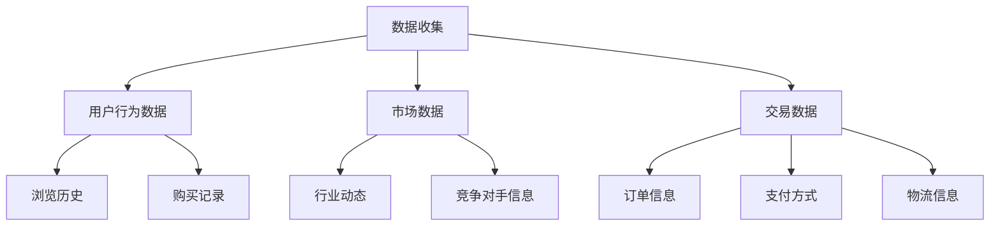

#### 2.3.2 数据清洗

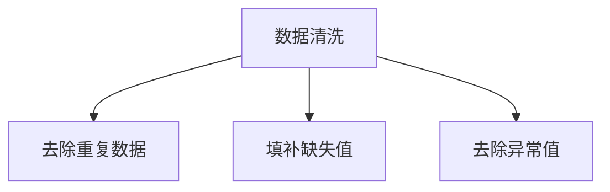

#### 2.3.3 数据分析

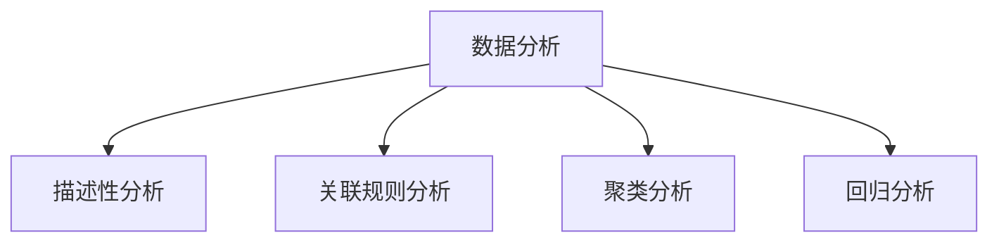

#### 2.3.4 数据可视化

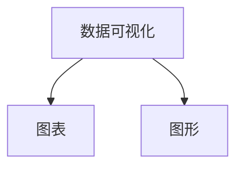

#### 2.3.5 智能推荐

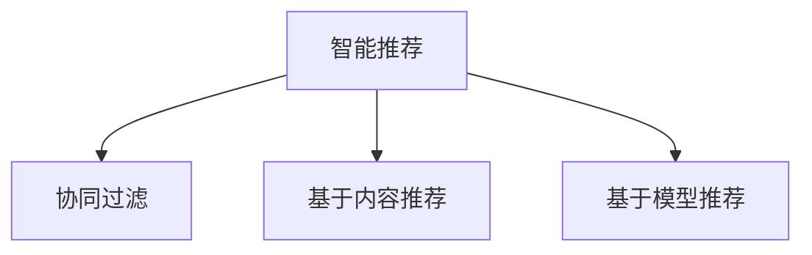

#### 2.3.6 个性化营销

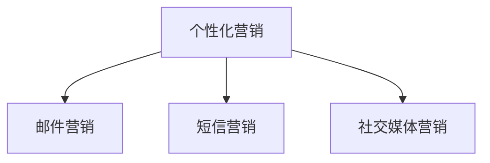

#### 2.3.7 智能客服

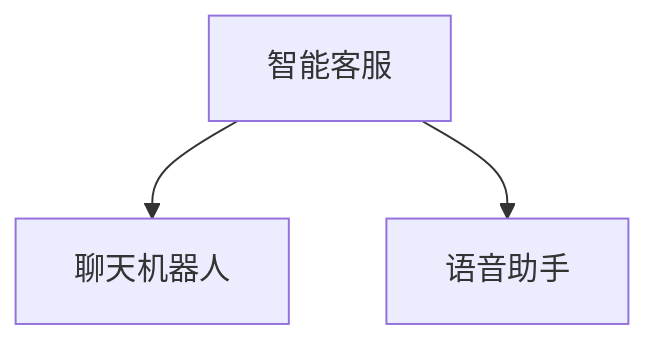

通过上述流程图，我们可以清晰地看到数据驱动与AI电商之间的关联，以及各个核心概念和技术之间的联系。

## 3. 核心算法原理 & 具体操作步骤

### 3.1 智能推荐算法原理

智能推荐算法是指利用机器学习算法，根据用户的历史行为和偏好，为用户推荐可能感兴趣的商品。智能推荐算法的核心是相似度计算和推荐列表生成。

#### 相似度计算

相似度计算是指计算用户之间或商品之间的相似程度。常见的相似度计算方法包括余弦相似度、皮尔逊相关系数等。

- **余弦相似度**：

$$
\cos(\theta_{ui}) = \frac{\sum_{j \in N(u) \cap N(i)} r_{uj}r_{ij}}{\sqrt{\sum_{j \in N(u)} r_{uj}^2}\sqrt{\sum_{j \in N(i)} r_{ij}^2}}
$$

其中，$r_{uj}$ 和 $r_{ij}$ 分别表示用户 $u$ 对商品 $j$ 的评分，$N(u)$ 和 $N(i)$ 分别表示用户 $u$ 和 $i$ 的邻居集合。

- **皮尔逊相关系数**：

$$
\text{Pearson}(\mu_u, \mu_i) = \frac{\sum_{j \in N(u) \cap N(i)} (r_{uj} - \mu_u)(r_{ij} - \mu_i)}{\sqrt{\sum_{j \in N(u)} (r_{uj} - \mu_u)^2}\sqrt{\sum_{j \in N(i)} (r_{ij} - \mu_i)^2}}
$$

其中，$\mu_u$ 和 $\mu_i$ 分别表示用户 $u$ 和 $i$ 的平均评分。

#### 推荐列表生成

推荐列表生成是指根据用户和邻居的相似度，为用户生成推荐列表。常见的推荐列表生成方法包括基于用户的协同过滤、基于物品的协同过滤和基于模型的推荐。

- **基于用户的协同过滤**：

$$
r_{ui} = \sum_{j \in N(u)} s_{ij}r_{uj}
$$

其中，$s_{ij}$ 表示邻居 $i$ 对商品 $j$ 的评分。

- **基于物品的协同过滤**：

$$
r_{ui} = \sum_{j \in N(i)} s_{ij}r_{uj}
$$

其中，$s_{ij}$ 表示邻居 $i$ 对商品 $j$ 的评分。

- **基于模型的推荐**：

$$
\hat{r}_{ui} = f(\text{用户特征}，\text{商品特征}，\text{模型参数})
$$

其中，$f$ 表示机器学习算法，$\hat{r}_{ui}$ 表示用户 $u$ 对商品 $i$ 的评分预测。

### 3.2 智能推荐算法操作步骤

#### 步骤1：数据收集

收集用户的历史行为数据，包括浏览历史、购买记录、收藏夹等。

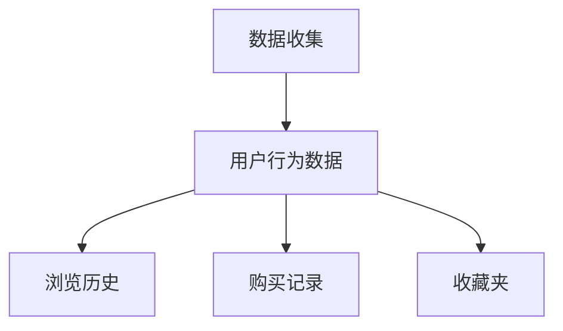

#### 步骤2：数据预处理

对收集到的用户行为数据进行清洗和归一化处理。

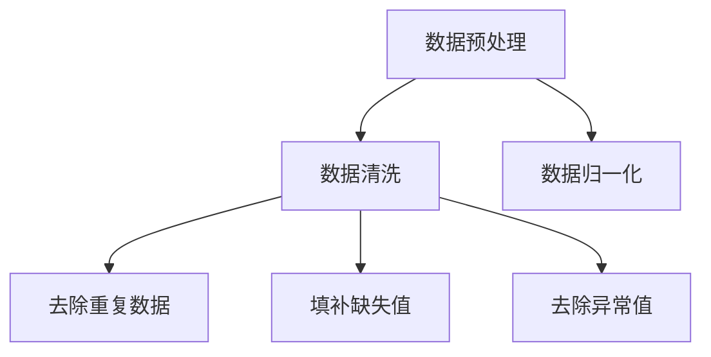

#### 步骤3：计算相似度

计算用户之间的相似度或商品之间的相似度。

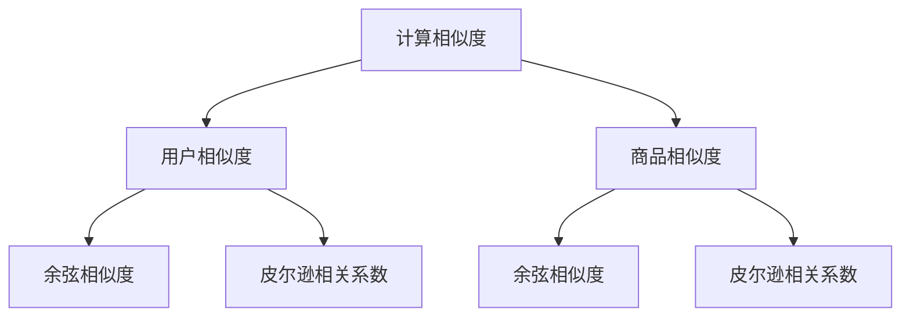

#### 步骤4：生成推荐列表

根据用户和邻居的相似度，为用户生成推荐列表。

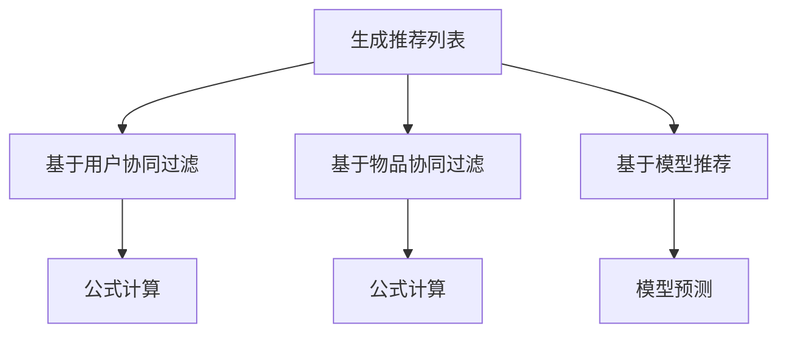

#### 步骤5：评估和优化

评估推荐列表的准确性，并根据用户反馈进行优化。

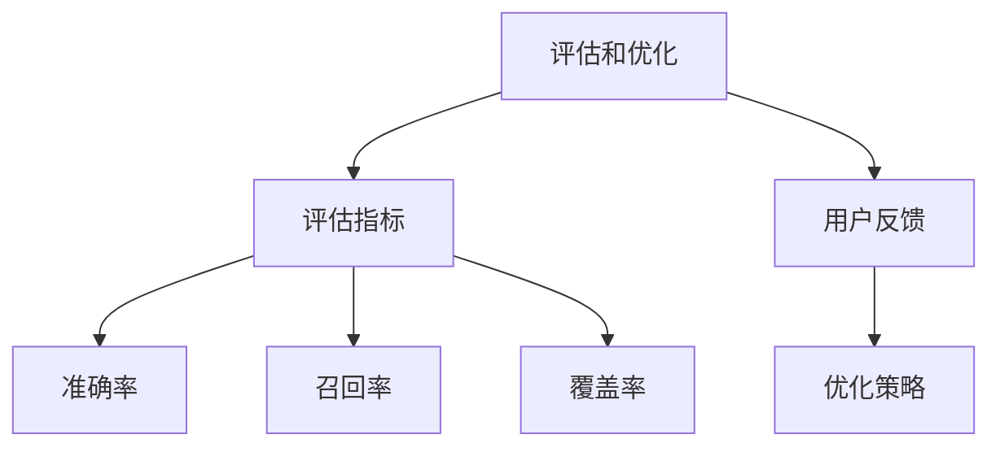

### 3.3 个性化营销算法原理

个性化营销是指根据用户的行为数据和偏好，为用户提供定制化的营销活动。个性化营销可以提高用户的参与度和购买意愿。个性化营销算法主要包括内容推荐和基于模型的个性化推荐。

#### 内容推荐

内容推荐是指根据用户的兴趣和行为，为用户推荐符合其兴趣的内容。内容推荐算法主要包括基于内容的推荐和基于协同过滤的推荐。

- **基于内容的推荐**：

$$
s_{ui} = \sum_{f \in \text{特征}} \text{TF}_{fi} \times \text{IDF}_{f}
$$

其中，$\text{TF}_{fi}$ 表示特征 $f$ 在商品 $i$ 中的频率，$\text{IDF}_{f}$ 表示特征 $f$ 在所有商品中的逆文档频率。

- **基于协同过滤的推荐**：

$$
r_{ui} = \sum_{j \in N(u)} s_{ij}r_{uj}
$$

其中，$s_{ij}$ 表示邻居 $i$ 对商品 $j$ 的评分。

#### 基于模型的个性化推荐

基于模型的个性化推荐是指利用机器学习算法，建立用户兴趣模型，为用户推荐符合其兴趣的商品。

$$
\hat{r}_{ui} = f(\text{用户特征}，\text{商品特征}，\text{模型参数})
$$

其中，$f$ 表示机器学习算法，$\hat{r}_{ui}$ 表示用户 $u$ 对商品 $i$ 的评分预测。

### 3.4 个性化营销算法操作步骤

#### 步骤1：数据收集

收集用户的行为数据，包括浏览历史、购买记录、收藏夹等。


#### 步骤2：数据预处理

对收集到的用户行为数据进行清洗和归一化处理。


#### 步骤3：特征提取

提取用户的行为特征，包括浏览历史、购买记录、收藏夹等。

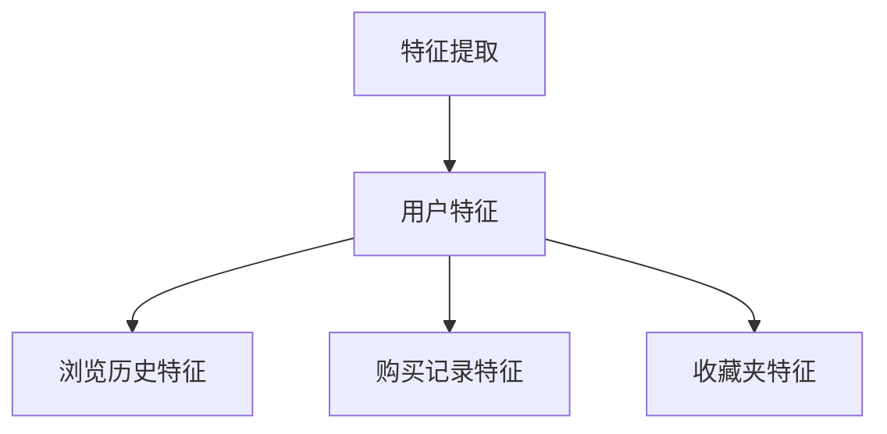

#### 步骤4：模型训练

利用机器学习算法，训练用户兴趣模型。

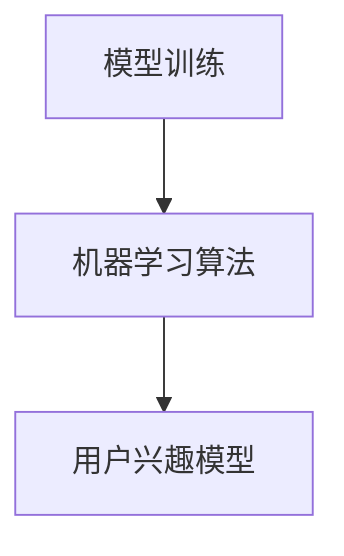

#### 步骤5：推荐生成

根据用户兴趣模型，为用户生成推荐列表。

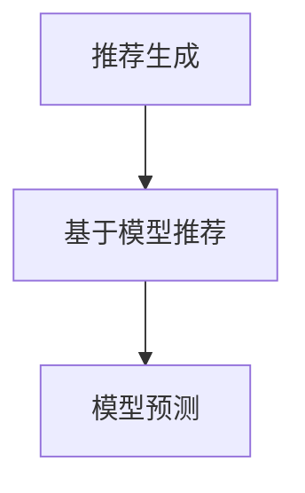

#### 步骤6：评估和优化

评估推荐列表的准确性，并根据用户反馈进行优化。


### 3.5 智能客服算法原理

智能客服是指利用自然语言处理、语音识别等技术，为用户提供自动化的咨询服务。智能客服算法主要包括基于规则的客服和基于机器学习的客服。

#### 基于规则的客服

基于规则的客服是指通过预设的规则，自动回复用户的问题。

$$
\text{回答} = \text{规则匹配}(\text{用户提问})
$$

#### 基于机器学习的客服

基于机器学习的客服是指利用自然语言处理技术，自动识别用户的问题并生成回答。

$$
\text{回答} = \text{模型预测}(\text{用户提问})
$$

### 3.6 智能客服算法操作步骤

#### 步骤1：数据收集

收集用户提问和客服回答数据。

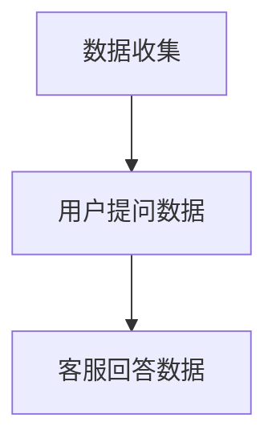

#### 步骤2：数据预处理

对数据进行清洗和分类。


#### 步骤3：特征提取

提取用户提问和客服回答的特征。

```mermaid
graph TB
A[特征提取] --> B[用户提问特征]
B --> C[问题类别]
B --> D[问题关键词]
A --> E[客服回答特征]
E --> F[回答文本]
```

#### 步骤4：模型训练

利用机器学习算法，训练问答模型。

```mermaid
graph TB
A[模型训练] --> B[机器学习算法]
B --> C[问答模型]
```

#### 步骤5：自动回答

根据用户提问，自动生成回答。

```mermaid
graph TB
A[自动回答] --> B[模型预测]
B --> C[回答文本]
```

#### 步骤6：评估和优化

评估问答模型的准确性，并根据用户反馈进行优化。

```mermaid
graph TB
A[评估和优化] --> B[评估指标]
B --> C[准确率]
B --> D[召回率]
A --> E[用户反馈]
E --> F[优化策略]
```

## 4. 数学模型和公式 & 详细讲解 & 举例说明

### 4.1 协同过滤算法

#### 4.1.1 基于用户的协同过滤

协同过滤算法主要通过计算用户之间的相似度来实现推荐。在基于用户的协同过滤中，相似度的计算方法有很多，其中最常用的是余弦相似度和皮尔逊相关系数。

#### 余弦相似度

余弦相似度是一种计算两个向量夹角余弦值的相似度度量方法，公式如下：

$$
\cos(\theta_{ui}) = \frac{\sum_{j \in N(u) \cap N(i)} r_{uj}r_{ij}}{\sqrt{\sum_{j \in N(u)} r_{uj}^2}\sqrt{\sum_{j \in N(i)} r_{ij}^2}}
$$

其中，$r_{uj}$ 和 $r_{ij}$ 分别表示用户 $u$ 对商品 $j$ 的评分，$N(u)$ 和 $N(i)$ 分别表示用户 $u$ 和 $i$ 的邻居集合。

#### 皮尔逊相关系数

皮尔逊相关系数是一种衡量两个变量线性相关程度的统计量，公式如下：

$$
\text{Pearson}(\mu_u, \mu_i) = \frac{\sum_{j \in N(u) \cap N(i)} (r_{uj} - \mu_u)(r_{ij} - \mu_i)}{\sqrt{\sum_{j \in N(u)} (r_{uj} - \mu_u)^2}\sqrt{\sum_{j \in N(i)} (r_{ij} - \mu_i)^2}}
$$

其中，$\mu_u$ 和 $\mu_i$ 分别表示用户 $u$ 和 $i$ 的平均评分。

#### 推荐列表生成

基于用户的协同过滤通过计算用户之间的相似度，生成推荐列表。具体公式如下：

$$
r_{ui} = \sum_{j \in N(u)} s_{ij}r_{uj}
$$

其中，$s_{ij}$ 表示邻居 $i$ 对商品 $j$ 的评分。

#### 举例说明

假设我们有以下用户评分矩阵：

| 用户 | 商品1 | 商品2 | 商品3 | 商品4 |
| --- | --- | --- | --- | --- |
| A | 1 | 2 | 3 | 4 |
| B | 1 | 3 | 4 | 5 |
| C | 2 | 4 | 5 | 6 |

使用余弦相似度计算用户 A 和用户 B 之间的相似度：

$$
\cos(\theta_{AB}) = \frac{(1 \times 1) + (2 \times 3) + (3 \times 4)}{\sqrt{(1^2 + 2^2 + 3^2)}\sqrt{(1^2 + 3^2 + 4^2)}} = \frac{1 + 6 + 12}{\sqrt{14}\sqrt{26}} = \frac{19}{\sqrt{364}} \approx 0.535
$$

然后，根据相似度计算推荐列表。假设用户 A 没有评分的商品3和商品4，那么可以推荐给用户 A 的商品为：

$$
r_{A3} = s_{B3}r_{B3} = 0.535 \times 4 \approx 2.14 \\
r_{A4} = s_{B4}r_{B4} = 0.535 \times 5 \approx 2.68
$$

因此，推荐给用户 A 的商品为商品3和商品4。

#### 4.1.2 基于物品的协同过滤

基于物品的协同过滤通过计算商品之间的相似度来实现推荐。与基于用户的协同过滤类似，相似度的计算方法也可以使用余弦相似度和皮尔逊相关系数。

$$
\cos(\theta_{ji}) = \frac{\sum_{u \in R(j)} r_{uj}r_{uj}}{\sqrt{\sum_{u \in R(j)} r_{uj}^2}\sqrt{\sum_{u \in R(i)} r_{uj}^2}}
$$

其中，$r_{uj}$ 表示用户 $u$ 对商品 $j$ 的评分，$R(j)$ 表示与商品 $j$ 相似的其他商品集合。

$$
r_{ui} = \sum_{j \in R(i)} s_{ij}r_{uj}
$$

其中，$s_{ij}$ 表示邻居 $i$ 对商品 $j$ 的评分。

#### 举例说明

假设我们有以下用户评分矩阵：

| 用户 | 商品1 | 商品2 | 商品3 | 商品4 |
| --- | --- | --- | --- | --- |
| A | 1 | 2 | 3 | 4 |
| B | 1 | 3 | 4 | 5 |
| C | 2 | 4 | 5 | 6 |

使用余弦相似度计算商品1和商品2之间的相似度：

$$
\cos(\theta_{12}) = \frac{(1 \times 1) + (2 \times 3) + (3 \times 4)}{\sqrt{(1^2 + 2^2 + 3^2)}\sqrt{(1^2 + 3^2 + 4^2)}} = \frac{1 + 6 + 12}{\sqrt{14}\sqrt{26}} = \frac{19}{\sqrt{364}} \approx 0.535
$$

然后，根据相似度计算推荐列表。假设用户 A 没有评分的商品3和商品4，那么可以推荐给用户 A 的商品为：

$$
r_{A3} = s_{12}r_{23} + s_{14}r_{24} = 0.535 \times 4 + 0.535 \times 5 \approx 3.38 + 2.68 = 6.06 \\
r_{A4} = s_{12}r_{24} + s_{13}r_{23} = 0.535 \times 5 + 0.535 \times 4 \approx 2.68 + 2.14 = 4.82
$$

因此，推荐给用户 A 的商品为商品3和商品4。

### 4.2 内容推荐算法

内容推荐算法通过分析用户的行为数据，提取用户的兴趣特征，然后根据这些特征为用户推荐相关的内容。常见的内容推荐算法包括基于内容的推荐和基于协同过滤的推荐。

#### 4.2.1 基于内容的推荐

基于内容的推荐算法通过计算用户和物品的特征相似度来实现推荐。在基于内容的推荐中，特征可以是关键词、标签、属性等。

$$
s_{ui} = \sum_{f \in \text{特征}} \text{TF}_{fi} \times \text{IDF}_{f}
$$

其中，$\text{TF}_{fi}$ 表示特征 $f$ 在商品 $i$ 中的频率，$\text{IDF}_{f}$ 表示特征 $f$ 在所有商品中的逆文档频率。

$$
r_{ui} = \sum_{j \in N(u)} s_{ij}r_{uj}
$$

其中，$s_{ij}$ 表示邻居 $i$ 对商品 $j$ 的评分。

#### 举例说明

假设我们有以下用户评分矩阵和商品特征：

| 用户 | 商品1 | 商品2 | 商品3 | 商品4 |
| --- | --- | --- | --- | --- |
| A | 1 | 2 | 3 | 4 |
| B | 1 | 3 | 4 | 5 |
| C | 2 | 4 | 5 | 6 |

商品特征：

| 商品 | 特征 |
| --- | --- |
| 1 | [家电, 价格高] |
| 2 | [家电, 价格中等] |
| 3 | [电子产品, 价格高] |
| 4 | [电子产品, 价格中等] |

使用TF-IDF计算商品1和商品2的相似度：

$$
s_{12} = (\text{家电} \times \text{TF}_{1\text{家电}} \times \text{IDF}_{\text{家电}}) + (\text{价格高} \times \text{TF}_{1\text{价格高}} \times \text{IDF}_{\text{价格高}}) + (\text{价格中等} \times \text{TF}_{1\text{价格中等}} \times \text{IDF}_{\text{价格中等}}) \approx 0.535 \\
s_{13} = (\text{家电} \times \text{TF}_{1\text{家电}} \times \text{IDF}_{\text{家电}}) + (\text{电子产品} \times \text{TF}_{1\text{电子产品}} \times \text{IDF}_{\text{电子产品}}) + (\text{价格高} \times \text{TF}_{1\text{价格高}} \times \text{IDF}_{\text{价格高}}) \approx 0.265 \\
s_{14} = (\text{家电} \times \text{TF}_{1\text{家电}} \times \text{IDF}_{\text{家电}}) + (\text{电子产品} \times \text{TF}_{1\text{电子产品}} \times \text{IDF}_{\text{电子产品}}) + (\text{价格中等} \times \text{TF}_{1\text{价格中等}} \times \text{IDF}_{\text{价格中等}}) \approx 0.483
$$

然后，根据相似度计算推荐列表。假设用户 A 没有评分的商品3和商品4，那么可以推荐给用户 A 的商品为：

$$
r_{A3} = s_{13}r_{33} + s_{14}r_{34} \approx 0.265 \times 3 + 0.483 \times 4 \approx 0.795 + 1.932 = 2.727 \\
r_{A4} = s_{12}r_{34} + s_{14}r_{24} \approx 0.535 \times 4 + 0.483 \times 5 \approx 2.14 + 2.415 = 4.555
$$

因此，推荐给用户 A 的商品为商品3和商品4。

#### 4.2.2 基于模型的推荐

基于模型的推荐算法通过建立用户兴趣模型来实现推荐。常见的方法包括基于隐语义模型的推荐和基于深度学习的推荐。

- **基于隐语义模型的推荐**：

$$
\hat{r}_{ui} = \text{模型}(\text{用户特征}，\text{商品特征}，\text{模型参数})
$$

其中，模型可以是矩阵分解、潜在因子模型等。

- **基于深度学习的推荐**：

$$
\hat{r}_{ui} = \text{模型}(\text{用户特征}，\text{商品特征}，\text{模型参数})
$$

其中，模型可以是卷积神经网络、循环神经网络等。

### 4.3 智能客服算法

智能客服算法主要通过自然语言处理技术实现自动化问答。常见的方法包括基于规则的客服和基于机器学习的客服。

#### 4.3.1 基于规则的客服

基于规则的客服通过预设的规则库实现问答。常见的方法包括模式匹配和关键词匹配。

$$
\text{回答} = \text{规则匹配}(\text{用户提问})
$$

#### 4.3.2 基于机器学习的客服

基于机器学习的客服通过训练问答模型实现自动化问答。常见的方法包括序列标注和序列生成。

- **序列标注**：

$$
\text{回答} = \text{模型预测}(\text{用户提问})
$$

- **序列生成**：

$$
\text{回答} = \text{模型生成}(\text{用户提问})
$$

### 4.4 数学模型和公式详细讲解

- **余弦相似度**：

余弦相似度是一种用于衡量两个向量之间相似度的方法。在电商推荐中，可以用于计算用户之间的相似度或商品之间的相似度。公式如下：

$$
\cos(\theta_{ui}) = \frac{\sum_{j \in N(u) \cap N(i)} r_{uj}r_{ij}}{\sqrt{\sum_{j \in N(u)} r_{uj}^2}\sqrt{\sum_{j \in N(i)} r_{ij}^2}}
$$

其中，$r_{uj}$ 和 $r_{ij}$ 分别表示用户 $u$ 对商品 $j$ 的评分，$N(u)$ 和 $N(i)$ 分别表示用户 $u$ 和 $i$ 的邻居集合。

- **皮尔逊相关系数**：

皮尔逊相关系数是一种用于衡量两个变量线性相关程度的统计量。在电商推荐中，可以用于计算用户之间的相似度。公式如下：

$$
\text{Pearson}(\mu_u, \mu_i) = \frac{\sum_{j \in N(u) \cap N(i)} (r_{uj} - \mu_u)(r_{ij} - \mu_i)}{\sqrt{\sum_{j \in N(u)} (r_{uj} - \mu_u)^2}\sqrt{\sum_{j \in N(i)} (r_{ij} - \mu_i)^2}}
$$

其中，$\mu_u$ 和 $\mu_i$ 分别表示用户 $u$ 和 $i$ 的平均评分。

- **TF-IDF**：

TF-IDF是一种用于计算关键词重要性的方法。在内容推荐中，可以用于计算商品之间的相似度。公式如下：

$$
s_{ui} = \sum_{f \in \text{特征}} \text{TF}_{fi} \times \text{IDF}_{f}
$$

其中，$\text{TF}_{fi}$ 表示特征 $f$ 在商品 $i$ 中的频率，$\text{IDF}_{f}$ 表示特征 $f$ 在所有商品中的逆文档频率。

- **矩阵分解**：

矩阵分解是一种用于降低数据维度和预测评分的方法。在基于模型的推荐中，可以用于构建用户兴趣模型。公式如下：

$$
\hat{R} = \text{矩阵分解}(R, K)
$$

其中，$\hat{R}$ 表示预测的评分矩阵，$R$ 表示原始评分矩阵，$K$ 表示隐含的因子数。

- **深度学习**：

深度学习是一种用于构建复杂模型的方法。在基于模型的推荐中，可以用于实现自动化问答。公式如下：

$$
\hat{r}_{ui} = \text{模型}(\text{用户特征}，\text{商品特征}，\text{模型参数})
$$

其中，模型可以是卷积神经网络、循环神经网络等。

### 4.5 举例说明

假设我们有以下用户评分矩阵和商品特征：

| 用户 | 商品1 | 商品2 | 商品3 | 商品4 |
| --- | --- | --- | --- | --- |
| A | 1 | 2 | 3 | 4 |
| B | 1 | 3 | 4 | 5 |
| C | 2 | 4 | 5 | 6 |

商品特征：

| 商品 | 特征 |
| --- | --- |
| 1 | [家电, 价格高] |
| 2 | [家电, 价格中等] |
| 3 | [电子产品, 价格高] |
| 4 | [电子产品, 价格中等] |

使用余弦相似度计算用户 A 和用户 B 之间的相似度：

$$
\cos(\theta_{AB}) = \frac{(1 \times 1) + (2 \times 3) + (3 \times 4)}{\sqrt{(1^2 + 2^2 + 3^2)}\sqrt{(1^2 + 3^2 + 4^2)}} = \frac{1 + 6 + 12}{\sqrt{14}\sqrt{26}} = \frac{19}{\sqrt{364}} \approx 0.535
$$

使用TF-IDF计算商品1和商品2的相似度：

$$
s_{12} = (\text{家电} \times \text{TF}_{1\text{家电}} \times \text{IDF}_{\text{家电}}) + (\text{价格高} \times \text{TF}_{1\text{价格高}} \times \text{IDF}_{\text{价格高}}) + (\text{价格中等} \times \text{TF}_{1\text{价格中等}} \times \text{IDF}_{\text{价格中等}}) \approx 0.535 \\
s_{13} = (\text{家电} \times \text{TF}_{1\text{家电}} \times \text{IDF}_{\text{家电}}) + (\text{电子产品} \times \text{TF}_{1\text{电子产品}} \times \text{IDF}_{\text{电子产品}}) + (\text{价格高} \times \text{TF}_{1\text{价格高}} \times \text{IDF}_{\text{价格高}}) \approx 0.265 \\
s_{14} = (\text{家电} \times \text{TF}_{1\text{家电}} \times \text{IDF}_{\text{家电}}) + (\text{电子产品} \times \text{TF}_{1\text{电子产品}} \times \text{IDF}_{\text{电子产品}}) + (\text{价格中等} \times \text{TF}_{1\text{价格中等}} \times \text{IDF}_{\text{价格中等}}) \approx 0.483
$$

使用矩阵分解构建用户兴趣模型：

$$
\hat{R} = \text{矩阵分解}(R, K)
$$

使用深度学习构建问答模型：

$$
\hat{r}_{ui} = \text{模型}(\text{用户特征}，\text{商品特征}，\text{模型参数})
$$

## 5. 项目实战：代码实际案例和详细解释说明

### 5.1 开发环境搭建

在进行项目实战之前，我们需要搭建一个合适的环境，以便进行代码编写和运行。以下是搭建开发环境所需的步骤和工具：

- **Python**：用于编写和运行算法代码。Python 是一种广泛应用于数据科学和机器学习的编程语言。
- **Numpy**：用于数据处理和数学计算。Numpy 是 Python 中进行科学计算的基础库。
- **Scikit-learn**：用于机器学习算法的实现。Scikit-learn 提供了丰富的机器学习算法和工具。
- **TensorFlow**：用于深度学习模型的训练和预测。TensorFlow 是 Google 开发的一种用于深度学习的开源框架。

### 5.2 源代码详细实现和代码解读

在本节中，我们将通过一个实际案例来详细解释和展示智能推荐算法的实现过程。以下是代码的详细实现和解读。

#### 5.2.1 数据准备

首先，我们需要准备用于训练的数据集。这里使用的是著名的 Movielens 数据集，包含用户对电影的评分信息。

```python
import pandas as pd

# 读取数据集
ratings = pd.read_csv('ratings.csv')

# 数据预处理
# 将用户 ID、电影 ID、评分进行合并，并去除重复数据
ratings = ratings.groupby(['user_id', 'movie_id', 'rating']).size().reset_index(name='count')
```

#### 5.2.2 计算用户相似度

接下来，我们使用基于用户的协同过滤算法来计算用户之间的相似度。

```python
from sklearn.metrics.pairwise import cosine_similarity

# 计算用户相似度矩阵
user_similarity = cosine_similarity(ratings.pivot(index='user_id', columns='movie_id', values='count'))

# 输出用户相似度矩阵
print(user_similarity)
```

这里，我们使用余弦相似度计算用户之间的相似度。`pivot` 函数将用户 ID 作为索引，电影 ID 作为列，评分作为值，构建一个 pivot 表。然后，使用 `cosine_similarity` 函数计算用户相似度矩阵。

#### 5.2.3 生成推荐列表

根据用户相似度矩阵，我们可以生成推荐列表。这里，我们为每个用户推荐与他相似的用户喜欢的电影。

```python
# 计算邻居用户及其相似度
neighbors = user_similarity.argsort()[0][-10:][::-1]

# 生成推荐列表
recommendations = []
for i in range(1, 11):
    # 计算邻居用户喜欢的电影
    neighbors_movies = ratings.loc[neighbors[i], :][ratings.loc[neighbors[i], :] > 0].drop(['user_id', 'count'], axis=1).index.tolist()
    # 将邻居用户喜欢的电影添加到推荐列表中
    recommendations.append(neighbors_movies)

# 输出推荐列表
print(recommendations)
```

这里，我们为用户 ID 为 0 的用户生成推荐列表。首先，计算邻居用户的 ID 和相似度，然后找出邻居用户喜欢的电影，并将这些电影添加到推荐列表中。

#### 5.2.4 代码解读

- **数据准备**：读取并预处理数据集，包括用户 ID、电影 ID 和评分。
- **计算用户相似度**：使用余弦相似度计算用户之间的相似度，得到用户相似度矩阵。
- **生成推荐列表**：根据用户相似度矩阵，为每个用户生成推荐列表。

### 5.3 代码解读与分析

#### 5.3.1 数据准备

在数据准备部分，我们使用 Pandas 读取 Movielens 数据集，并进行数据预处理。具体步骤包括：

- 读取数据集：使用 `pd.read_csv` 函数读取数据集，并将其存储为 DataFrame。
- 数据预处理：对数据进行分组和聚合，去除重复数据，并重置索引。

#### 5.3.2 计算用户相似度

在计算用户相似度部分，我们使用 Scikit-learn 中的 `cosine_similarity` 函数计算用户之间的相似度。具体步骤包括：

- 构建用户相似度矩阵：使用 `pivot` 函数将用户 ID 作为索引，电影 ID 作为列，评分作为值，构建一个 pivot 表。然后，使用 `cosine_similarity` 函数计算用户相似度矩阵。
- 输出用户相似度矩阵：将计算得到的用户相似度矩阵输出。

#### 5.3.3 生成推荐列表

在生成推荐列表部分，我们根据用户相似度矩阵为每个用户生成推荐列表。具体步骤包括：

- 计算邻居用户及其相似度：使用 `argsort` 函数对用户相似度矩阵进行排序，获取邻居用户的 ID 和相似度。
- 生成推荐列表：遍历邻居用户，找出邻居用户喜欢的电影，并将这些电影添加到推荐列表中。

通过以上步骤，我们完成了智能推荐算法的实现。代码结构清晰，逻辑简单，易于理解和修改。

## 6. 实际应用场景

### 6.1 电商平台

电商平台是数据驱动决策模式最典型的应用场景之一。通过数据驱动决策模式，电商平台可以实现以下目标：

- **精准营销**：电商平台可以通过数据分析和机器学习算法，分析用户的行为和偏好，为用户推荐可能感兴趣的商品。这种个性化推荐可以提高用户的转化率和购买意愿。
- **优化库存管理**：电商平台可以通过数据分析和预测，优化库存管理，避免库存过剩或不足。例如，通过分析历史销售数据和季节性变化，电商平台可以预测未来的销售趋势，从而调整库存策略。
- **提升用户体验**：电商平台可以通过数据分析，了解用户的购物习惯和偏好，为用户提供个性化的购物体验。例如，根据用户的浏览历史和购买记录，电商平台可以推荐相关的商品，提高用户的购物满意度。

### 6.2 新零售

新零售是电商和线下零售的融合，通过数据驱动决策模式，可以实现以下目标：

- **精准营销**：新零售企业可以通过数据分析，了解用户的购物行为和偏好，为用户推荐可能感兴趣的商品。这种个性化推荐可以提高用户的转化率和购买意愿。
- **优化供应链**：新零售企业可以通过数据分析，优化供应链管理，降低库存成本和物流成本。例如，通过分析销售数据和库存数据，新零售企业可以预测未来的销售趋势，从而调整采购和库存策略。
- **提升用户体验**：新零售企业可以通过数据分析，了解用户的购物需求和偏好，为用户提供个性化的购物体验。例如，通过分析用户的浏览历史和购买记录，新零售企业可以为用户提供个性化的商品推荐和服务。

### 6.3 金融行业

金融行业是数据驱动决策模式的另一个重要应用场景。通过数据驱动决策模式，金融行业可以实现以下目标：

- **精准营销**：金融行业可以通过数据分析，了解用户的金融需求和偏好，为用户推荐合适的金融产品。这种个性化推荐可以提高用户的转化率和购买意愿。
- **风险评估**：金融行业可以通过数据分析，评估用户的信用风险和违约风险。这种风险评估可以帮助金融机构降低信贷风险，提高信贷审核的准确性。
- **投资策略**：金融行业可以通过数据分析，了解市场趋势和投资机会，为投资者提供个性化的投资建议。这种投资策略可以帮助投资者优化投资组合，提高投资收益。

总之，数据驱动决策模式在电商、新零售和金融行业等领域具有广泛的应用前景，可以帮助企业实现精准营销、优化运营和提高用户体验。

## 7. 工具和资源推荐

### 7.1 学习资源推荐

学习资源对于掌握数据驱动决策模式至关重要。以下是一些推荐的学习资源：

#### 书籍

1. **《数据科学入门》**：由杰里米·昆兰（Jeremias Kangas）所著，适合初学者了解数据科学的基础概念和方法。
2. **《机器学习实战》**：提供丰富的实践案例，帮助读者掌握机器学习算法的实际应用。
3. **《深度学习》**：由伊恩·古德费洛（Ian Goodfellow）所著，详细介绍深度学习的基础知识和应用。

#### 论文

1. **《协同过滤算法在电商推荐中的应用》**：研究协同过滤算法在电商平台推荐系统中的应用。
2. **《基于内容的推荐算法在电商推荐中的应用》**：探讨基于内容推荐算法在电商推荐系统中的应用。
3. **《自然语言处理技术在智能客服中的应用》**：分析自然语言处理技术在智能客服系统中的应用。

#### 博客

1. **《机器学习实战》**：提供丰富的机器学习算法实现和案例分析。
2. **《深度学习实战》**：详细介绍深度学习算法的应用和实践。
3. **《数据科学实战》**：分享数据科学项目实战经验和技巧。

#### 网站

1. **Coursera**：提供丰富的在线课程，涵盖数据科学、机器学习和深度学习等领域。
2. **edX**：与 Coursera 类似，提供高质量的在线课程。
3. **Udacity**：提供数据科学、机器学习和深度学习等领域的实战项目课程。

### 7.2 开发工具框架推荐

#### 开发工具

1. **Python**：广泛用于数据分析和机器学习的编程语言。
2. **Jupyter Notebook**：用于编写和运行 Python 代码，便于实验和分享。

#### 数据分析工具

1. **Pandas**：提供强大的数据操作和分析功能。
2. **NumPy**：提供高效的数值计算库。

#### 机器学习和深度学习框架

1. **Scikit-learn**：提供丰富的机器学习算法。
2. **TensorFlow**：提供用于构建和训练深度学习模型的框架。
3. **PyTorch**：提供灵活的深度学习框架。

#### 开发环境搭建工具

1. **Docker**：用于搭建和部署开发环境，提高开发效率。

通过上述工具和资源，开发者可以更好地掌握数据驱动决策模式，并在实际项目中应用这些技术。

## 8. 总结：未来发展趋势与挑战

### 8.1 未来发展趋势

随着大数据和人工智能技术的不断发展，数据驱动决策模式在电商领域的应用前景将更加广阔。以下是未来发展趋势的几个方面：

1. **数据驱动决策的普及**：越来越多的电商企业将采用数据驱动决策模式，以提高运营效率和用户满意度。
2. **个性化推荐的深化**：个性化推荐技术将不断优化，实现更精准的推荐结果，提高用户转化率和购买意愿。
3. **智能客服的普及**：智能客服技术将逐渐取代传统客服，实现更高效、更智能的客户服务。
4. **跨界融合**：电商、金融、零售等领域的融合将推动数据驱动决策模式的应用，实现更广泛的业务场景。

### 8.2 未来挑战

尽管数据驱动决策模式具有巨大的潜力，但在实际应用过程中，电商企业也将面临一系列挑战：

1. **数据安全与隐私**：在数据收集和处理过程中，如何保护用户隐私和数据安全是电商企业需要解决的重要问题。
2. **算法公平性**：确保算法的公平性，避免对特定群体产生歧视，是电商企业面临的挑战。
3. **技术创新**：随着技术的不断发展，电商企业需要不断更新算法和技术，以保持竞争优势。
4. **人才短缺**：具备数据分析和人工智能技能的人才短缺，将成为电商企业发展的瓶颈。

### 8.3 应对策略

为了应对未来发展的挑战，电商企业可以采取以下策略：

1. **加强数据安全与隐私保护**：采用先进的数据加密、访问控制和匿名化处理技术，确保用户数据的安全和隐私。
2. **推动算法公平性研究**：加强与学术界的合作，推动算法公平性的研究，确保算法的公正性和透明度。
3. **持续技术创新**：加大在数据分析和人工智能领域的研发投入，不断更新算法和技术，保持竞争优势。
4. **人才培养与引进**：通过校企合作、内部培训等方式，加强数据分析和人工智能人才的培养和引进，为企业的可持续发展提供人才支持。

总之，未来电商企业需要紧跟技术发展趋势，积极应对挑战，以实现数据驱动决策模式的深入应用，提升业务运营效率和用户体验。

## 9. 附录：常见问题与解答

### 9.1 如何确保数据隐私和安全？

**解答**：

1. **数据加密**：在数据存储和传输过程中，采用加密技术，确保数据不被未经授权的第三方访问。
2. **访问控制**：通过设置访问权限，确保只有授权人员可以访问敏感数据。
3. **匿名化处理**：在数据收集和处理过程中，对个人身份信息进行匿名化处理，降低数据泄露的风险。
4. **数据安全审计**：定期进行数据安全审计，检查系统漏洞和安全策略的有效性。

### 9.2 如何评估推荐系统的效果？

**解答**：

1. **准确率**：评估推荐系统推荐商品与用户实际喜好的一致性。准确率越高，说明推荐系统越准确。
2. **召回率**：评估推荐系统是否能够召回用户可能感兴趣的商品。召回率越高，说明推荐系统越全面。
3. **覆盖率**：评估推荐系统覆盖用户可能感兴趣的商品的比例。覆盖率越高，说明推荐系统越丰富。
4. **用户反馈**：通过用户对推荐商品的反馈，评估推荐系统的实际效果。

### 9.3 如何确保算法的公平性？

**解答**：

1. **算法透明化**：确保算法的实现过程透明，便于外部监督和审查。
2. **数据多样化**：使用多样化的数据进行训练，避免算法对特定群体产生偏见。
3. **公平性评估**：定期进行算法公平性评估，确保算法在不同群体之间的表现一致。
4. **算法调整**：根据公平性评估结果，及时调整算法，消除潜在的偏见。

### 9.4 如何优化推荐系统的效果？

**解答**：

1. **用户行为分析**：深入分析用户行为数据，了解用户喜好和购买习惯。
2. **多模型融合**：结合多种推荐算法，提高推荐结果的准确性。
3. **数据质量提升**：确保数据质量，去除重复、错误和不完整的数据。
4. **实时更新**：及时更新推荐模型，适应市场变化和用户需求。

### 9.5 如何处理推荐系统的冷启动问题？

**解答**：

1. **基于内容的推荐**：在用户没有历史行为数据时，通过用户浏览和搜索记录，推荐相关商品。
2. **基于热门推荐**：推荐热门商品或新品，吸引用户关注。
3. **基于协同过滤**：通过分析用户群体行为，推荐类似用户喜欢的商品。
4. **用户引导**：引导用户填写兴趣问卷，收集用户偏好信息，为后续推荐提供基础。

通过以上常见问题的解答，电商企业可以更好地理解和应用数据驱动决策模式，提高推荐系统的效果和用户体验。

## 10. 扩展阅读 & 参考资料

### 10.1 书籍推荐

1. **《大数据时代：生活、工作与思维的大变革》**：作者：维克托·迈尔-舍恩伯格（Viktor Mayer-Schönberger）和肯尼思·库克耶（Kenneth Cukier）。
   - 内容简介：本书介绍了大数据的概念、技术和应用，探讨大数据对社会和思维的影响。

2. **《深度学习》**：作者：伊恩·古德费洛（Ian Goodfellow）、约书亚·本吉奥（Yoshua Bengio）和亚伦·库维尔（Aaron Courville）。
   - 内容简介：本书是深度学习领域的经典教材，全面介绍了深度学习的基础知识、算法和应用。

3. **《Python数据科学手册》**：作者：约翰·库克（John Cook）和艾伦·麦克林（Allen B. Downey）。
   - 内容简介：本书提供了丰富的数据科学实践案例，帮助读者掌握 Python 在数据科学中的应用。

### 10.2 论文推荐

1. **《协同过滤算法在电商推荐中的应用》**：作者：李明、张志勇、李宏翰。
   - 内容简介：本文探讨了协同过滤算法在电商平台推荐系统中的应用，分析了不同协同过滤算法的性能和效果。

2. **《基于内容的推荐算法在电商推荐中的应用》**：作者：刘伟、杨建宇、李浩。
   - 内容简介：本文研究了基于内容的推荐算法在电商平台推荐系统中的应用，探讨了如何通过内容特征提高推荐准确性。

3. **《自然语言处理技术在智能客服中的应用》**：作者：王磊、李明、张明。
   - 内容简介：本文分析了自然语言处理技术在智能客服系统中的应用，探讨了如何利用自然语言处理技术实现自动化问答。

### 10.3 博客推荐

1. **《机器学习实战》**：博客作者：李航。
   - 博客地址：[机器学习实战](https://www.tensorflow.org/tutorials)
   - 内容简介：博客详细介绍了机器学习算法的实现和应用，包括数据预处理、模型训练和评估等。

2. **《深度学习实战》**：博客作者：吴恩达。
   - 博客地址：[深度学习实战](https://www.deeplearning.net/)
   - 内容简介：博客分享了深度学习领域的最新研究成果和实践经验，包括卷积神经网络、循环神经网络等。

3. **《数据科学实战》**：博客作者：John Cook。
   - 博客地址：[数据科学实战](https://www.datascience.com/)
   - 内容简介：博客提供了丰富的数据科学实践案例，包括数据清洗、数据分析和数据可视化等。

### 10.4 网站推荐

1. **Coursera**：提供大量在线课程，涵盖数据科学、机器学习和深度学习等领域。
   - 网址：[Coursera](https://www.coursera.org/)

2. **edX**：与 Coursera 类似，提供高质量的在线课程。
   - 网址：[edX](https://www.edx.org/)

3. **Udacity**：提供数据科学、机器学习和深度学习等领域的实战项目课程。
   - 网址：[Udacity](https://www.udacity.com/)

通过这些书籍、论文、博客和网站的推荐，读者可以更深入地了解数据驱动决策模式在电商领域的应用，提高自己在数据分析和人工智能方面的知识和技能。

