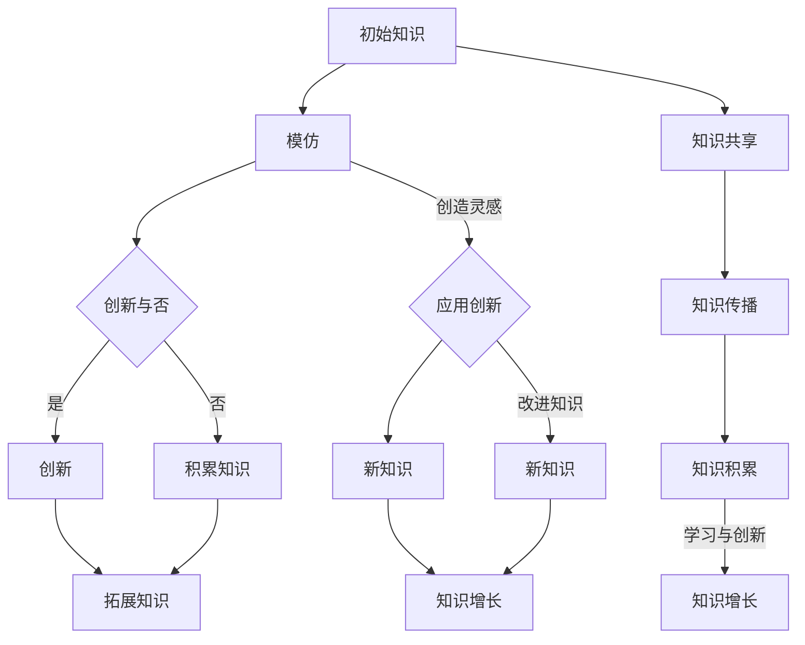

                 

## 从模仿到创新：人类知识增长的过程

> **关键词**：知识增长、模仿、创新、人类智慧、技术进步

> **摘要**：本文探讨了人类知识增长的过程，从模仿到创新，深入分析了人类智慧与技术进步之间的密切联系。通过对比分析不同领域的发展历程，阐述了模仿与创新在知识增长中的重要作用，并提出了一些具有启发性的观点和思考。

本文将逐步剖析人类知识增长的过程，探讨模仿与创新在其中所发挥的关键作用。首先，我们将介绍模仿与创新的定义及其在知识增长中的重要性。然后，通过历史和现实案例，分析模仿与创新在不同领域中的具体应用。接着，我们将探讨人类智慧与技术进步的关系，以及如何利用模仿与创新推动技术进步。最后，总结本文的主要观点，并提出未来知识增长的可能趋势和挑战。

## 1. 背景介绍

人类知识增长是一个长期而复杂的过程，它涉及到各种因素的相互作用。从某种程度上来说，模仿与创新是知识增长的两个核心驱动力。模仿是指个体或群体通过复制、借鉴或模仿他人的经验、知识和技术，从而获得新的知识和技能。而创新则是指通过创造新的思想、方法、工具或产品，从而推动知识的扩展和进步。

模仿与创新在知识增长中的重要性不可低估。模仿为个体或群体提供了学习的基础，使他们能够快速掌握他人的经验和知识。创新则使知识得以拓展和深化，推动技术进步和社会发展。在人类历史上，模仿与创新共同推动了科学、技术、艺术等各个领域的发展，使得人类不断走向繁荣和进步。

本文旨在探讨模仿与创新在知识增长中的具体作用，以及它们如何相互促进、共同推动人类知识的发展。通过分析不同领域的发展历程，我们希望能够揭示知识增长背后的规律和机制，为未来的研究提供有益的启示。

### 1.1 知识增长的驱动因素

知识增长是一个复杂的过程，受到多种驱动因素的影响。以下是一些主要的知识增长驱动因素：

- **教育**：教育是知识增长的重要途径，通过系统化的教育，个体可以获取大量的知识和技能。

- **实践**：实践是知识的源泉，通过实践，个体可以将理论知识转化为实际能力。

- **交流与传播**：交流与传播是知识增长的关键环节，通过人际交流、文化传播等途径，知识得以广泛传播和共享。

- **科技创新**：科技创新是知识增长的重要推动力，新的科技突破往往带来知识的重大进步。

- **环境与机遇**：环境与机遇也对知识增长有重要影响，良好的社会环境和发展机遇有利于知识的积累和创新。

- **个体智慧与创造力**：个体的智慧和创造力是知识增长的核心因素，它们决定了个体在知识增长过程中的贡献和成就。

这些驱动因素相互交织、相互影响，共同推动了人类知识的发展。通过分析这些驱动因素的作用，我们可以更深入地理解知识增长的机制和规律。

### 1.2 模仿与创新的概念与区别

模仿与创新是知识增长过程中的两个核心概念，它们既有联系又有区别。

- **模仿**：模仿是指个体或群体通过复制、借鉴或模仿他人的经验、知识和技术，从而获得新的知识和技能。模仿具有以下几个特点：

  - **快捷性**：模仿是一种快速获取知识的方式，通过借鉴他人的经验，个体可以节省学习和摸索的时间。

  - **可靠性**：模仿是基于他人成功经验的复制，具有较高的可靠性。

  - **局限性**：模仿虽然能够快速获取知识，但其创新性有限，往往难以突破现有框架。

- **创新**：创新是指通过创造新的思想、方法、工具或产品，从而推动知识的扩展和进步。创新具有以下几个特点：

  - **独特性**：创新通常涉及新的思想、方法或工具，具有独特的性质。

  - **风险性**：创新往往伴随着一定的风险，需要个体或团队付出更多的努力和投入。

  - **突破性**：创新能够突破现有的知识和技术框架，推动知识的发展。

模仿与创新在知识增长中发挥着不同的作用。模仿为个体或群体提供了学习的基础，使他们能够快速掌握他人的经验和知识；而创新则使知识得以拓展和深化，推动技术进步和社会发展。在知识增长的过程中，模仿与创新相互促进、共同发展，共同推动了人类知识的发展。

### 1.3 知识增长的历程

知识增长是一个长期而复杂的过程，它贯穿于人类历史发展的始终。从古代的文明传承，到中世纪的学术繁荣，再到近代的科学革命，知识增长经历了多个阶段。

- **古代阶段**：在古代，知识主要通过口耳相传和文献记载进行传播。人们通过模仿先贤的经验，逐渐积累知识。这一阶段的模仿性特征明显，创新性相对较低。

- **中世纪阶段**：在中世纪，学术繁荣推动了知识的积累和创新。阿拉伯学者对古希腊文化的研究和传承，使得欧洲迎来了文艺复兴。这一阶段，模仿与创新相结合，促进了知识的快速增长。

- **近代阶段**：近代以来，科学革命带来了知识的大爆发。牛顿力学、达尔文进化论等重大科学发现，标志着人类对自然界的认识达到了前所未有的高度。这一阶段，创新成为知识增长的主要驱动力。

- **现代阶段**：现代科技的飞速发展，使得知识增长的速度进一步加快。互联网、大数据、人工智能等新兴技术，为知识的传播和应用提供了新的途径。这一阶段，知识增长呈现出多样化和综合化的趋势。

### 1.4 知识增长的重要性

知识增长对人类社会具有重要的意义。首先，知识增长推动了技术进步，为经济发展提供了强大的动力。其次，知识增长促进了社会进步，提升了人类的生活质量和文明水平。此外，知识增长还增强了人类应对各种挑战和危机的能力，提高了国家的综合实力。

总之，知识增长是人类社会发展的关键因素，它关系到人类的未来和命运。在当前全球化的背景下，知识增长的重要性更加凸显。各国政府、企业和社会组织，都需要高度重视知识增长，积极推动知识的积累和创新，为人类社会的繁荣和发展贡献力量。

## 2. 核心概念与联系

在本节中，我们将详细探讨模仿与创新这两个核心概念，分析它们在知识增长过程中的作用，并借助Mermaid流程图，展示它们之间的联系。

### 2.1 模仿的概念与作用

模仿是人类学习的基本方式之一，它使得个体能够迅速获取他人的知识和经验。模仿的作用主要体现在以下几个方面：

- **快速学习**：通过模仿，个体可以避免重复摸索和试验，快速掌握他人的经验和技能。

- **知识传播**：模仿是知识传播的重要途径，它使得知识和技能得以在更大范围内传播和应用。

- **创新能力的基础**：模仿为创新提供了基础，使得个体在已有知识的基础上，能够进行进一步探索和改进。

在知识增长过程中，模仿的作用不可忽视。它不仅能够加速知识的积累，还能为创新提供必要的素材和灵感。

### 2.2 创新的概念与作用

创新是指通过创造新的思想、方法、工具或产品，推动知识的发展和应用。创新的作用主要体现在以下几个方面：

- **知识拓展**：创新能够突破现有的知识和技术框架，推动知识的扩展和进步。

- **社会进步**：创新带来了新技术、新产品和新产业，推动了社会的进步和发展。

- **经济驱动**：创新是经济增长的重要动力，它能够提升生产效率，创造更多的就业机会。

在知识增长过程中，创新是推动知识发展的重要引擎，它能够引领科技、经济和社会的变革。

### 2.3 模仿与创新的联系

模仿与创新在知识增长过程中相互联系、相互促进。以下是它们之间的主要联系：

- **基础与拓展**：模仿为创新提供了基础，使得个体能够在已有知识的基础上进行创新。创新则进一步拓展了知识的应用范围，推动了知识的深化和发展。

- **循环互动**：模仿和创新之间存在一种循环互动的关系。模仿使得知识和技能得以传播和应用，为创新提供素材和灵感；而创新则通过新的知识和技术的创造，为模仿提供新的基础和方向。

- **协同发展**：模仿和创新相互协同，共同推动了知识的发展。在知识增长过程中，模仿和创新相互促进，形成了一个动态的、不断演进的知识体系。

### 2.4 Mermaid流程图

为了更直观地展示模仿与创新在知识增长过程中的联系，我们使用Mermaid流程图来描述它们之间的互动关系。



### 2.5 小结

模仿与创新是知识增长过程中的两个核心概念，它们相互联系、相互促进，共同推动了知识的发展。模仿为创新提供了基础，创新则进一步拓展了知识的应用范围。通过Mermaid流程图，我们清晰地展示了模仿与创新在知识增长过程中的互动关系，这有助于我们更深入地理解知识增长的机制。

---

在本节中，我们介绍了模仿与创新的概念及其在知识增长过程中的作用，并通过Mermaid流程图展示了它们之间的联系。接下来，我们将进一步探讨核心算法原理和具体操作步骤，分析模仿与创新在实际应用中的具体表现。请继续关注接下来的内容。

## 3. 核心算法原理 & 具体操作步骤

在深入探讨模仿与创新的核心算法原理和具体操作步骤之前，我们需要了解一些基本的算法概念，包括机器学习中的模仿机制和创新的实现方法。以下内容将逐步介绍这些核心概念，并提供详细的操作步骤。

### 3.1 模仿算法的基本原理

模仿算法是机器学习中的一个基本概念，它通过复制或模拟已有数据或模型来学习和优化。以下是模仿算法的基本原理：

- **数据复制**：模仿算法首先选择一组已有数据，将这些数据复制到新的环境中。

- **模型训练**：在新的环境中，使用复制的数据进行模型训练，以模拟原有模型的性能。

- **性能评估**：通过评估新模型的性能，判断模仿算法的效果。

- **调整参数**：根据性能评估结果，对模型参数进行调整，以提高模型的性能。

### 3.2 模仿算法的具体操作步骤

以下是一般情况下模仿算法的具体操作步骤：

1. **数据选择**：选择一组已有的数据集，这些数据集可以是训练集、测试集或验证集。

2. **数据复制**：将选定的数据集复制到新的环境中。这一步骤可以通过数据备份、数据迁移等方法实现。

3. **模型构建**：在新的环境中构建一个与原有模型结构相同的模型。这一步骤可以使用机器学习框架中的模型构建工具完成。

4. **模型训练**：使用复制的数据集对模型进行训练。在这一过程中，模型会根据数据集进行参数调整，以优化模型性能。

5. **性能评估**：评估新模型的性能，通常通过测试集或验证集进行。常用的评估指标包括准确率、召回率、F1分数等。

6. **参数调整**：根据性能评估结果，对模型参数进行调整，以提高模型性能。这一步骤可以通过调参工具或手动调整完成。

7. **迭代优化**：重复上述步骤，直到模型性能达到预期目标。

### 3.3 创新算法的基本原理

创新算法是指通过创造新的思想、方法或工具，来推动知识和技术的进步。以下是创新算法的基本原理：

- **问题识别**：首先，识别现有技术或方法中存在的问题或不足。

- **需求分析**：分析现有需求，确定创新的方向和目标。

- **创意生成**：在明确问题和需求的基础上，生成新的创意和想法。

- **实验验证**：通过实验验证新创意的有效性和可行性。

- **迭代优化**：根据实验结果，对创意进行优化和改进。

### 3.4 创新算法的具体操作步骤

以下是一般情况下创新算法的具体操作步骤：

1. **问题识别**：分析现有技术或方法，找出存在的问题或不足。

2. **需求分析**：与相关利益相关者进行沟通，确定创新的需求和目标。

3. **创意生成**：通过头脑风暴、思维导图等方法，生成多个可能的创新创意。

4. **创意筛选**：对生成的创意进行筛选，选择最具潜力和可行性的创意进行进一步开发。

5. **实验验证**：设计实验方案，验证所选创意的有效性和可行性。

6. **结果分析**：分析实验结果，确定创意是否成功，并对创意进行优化和改进。

7. **迭代优化**：根据实验结果，对创意进行迭代优化，直至达到预期目标。

### 3.5 模仿与创新算法的对比

模仿算法和创新算法在目标、方法和效果上存在明显差异。以下是它们的一些对比：

- **目标**：模仿算法的主要目标是优化现有模型或方法，而创新算法的目标是创造全新的技术和方法。

- **方法**：模仿算法主要通过复制和模拟已有的知识和方法，而创新算法则通过分析和改进已有知识，生成新的创意。

- **效果**：模仿算法通常能够快速提高模型性能，但创新算法往往能够带来更长远和深远的影响。

- **适用场景**：模仿算法适用于需要快速优化和改进的场景，而创新算法则适用于需要突破性进展和创新的场景。

### 3.6 小结

在本节中，我们介绍了模仿与创新算法的基本原理和具体操作步骤，包括模仿算法的数据选择、模型训练、性能评估和参数调整，以及创新算法的问题识别、需求分析、创意生成、实验验证和迭代优化。通过对比分析，我们明确了模仿与创新算法在目标、方法和效果上的差异，这为我们在实际应用中选择合适的算法提供了参考。

---

在本节中，我们详细介绍了模仿与创新算法的核心原理和具体操作步骤。接下来，我们将进一步探讨数学模型和公式，以及如何通过具体的实例来说明这些概念在实际应用中的运用。请继续关注接下来的内容。

## 4. 数学模型和公式 & 详细讲解 & 举例说明

在探讨模仿与创新的过程中，数学模型和公式起到了至关重要的作用。这些模型和公式不仅帮助我们更好地理解知识增长的过程，还能为实际应用提供科学依据和指导。在本节中，我们将详细讲解一些关键的数学模型和公式，并通过具体实例来说明它们在实际应用中的运用。

### 4.1 模仿过程的数学模型

模仿过程可以看作是一个参数调整和优化的问题。假设我们有一个已知模型M，其性能由参数θ决定。我们希望通过模仿过程，找到一组参数θ'，使得新模型M'在新的数据集上具有更好的性能。

一个常用的模仿模型是梯度下降算法，其基本公式如下：

$$
\theta' = \theta - \alpha \cdot \nabla_{\theta} J(\theta)
$$

其中：

- $\theta$ 表示原始参数
- $\theta'$ 表示调整后的参数
- $\alpha$ 表示学习率
- $\nabla_{\theta} J(\theta)$ 表示损失函数J关于参数θ的梯度

#### 梯度下降算法的具体步骤：

1. 初始化参数 $\theta$ 和学习率 $\alpha$。

2. 对于每一个训练样本，计算损失函数 $J(\theta)$。

3. 计算损失函数关于参数θ的梯度 $\nabla_{\theta} J(\theta)$。

4. 根据梯度更新参数 $\theta$：$\theta' = \theta - \alpha \cdot \nabla_{\theta} J(\theta)$。

5. 重复步骤2-4，直到达到预定的迭代次数或参数变化小于某个阈值。

### 4.2 创新过程的数学模型

创新过程可以看作是一个问题解决和优化的过程。假设我们有一个问题P，其解决方案由参数θ决定。我们希望通过创新过程，找到一组参数θ'，使得问题P得到更好的解决。

一个常用的创新模型是遗传算法，其基本公式如下：

$$
\theta' = \text{mutation}(\theta)
$$

其中：

- $\theta$ 表示原始参数
- $\theta'$ 表示创新后的参数
- $\text{mutation}$ 表示变异操作

#### 遗传算法的具体步骤：

1. 初始化参数 $\theta$。

2. 对于每一个参数 $\theta$，计算其适应度值 $f(\theta)$。

3. 根据适应度值，选择优秀的参数进行交叉操作，生成新的参数 $\theta'$。

4. 对新参数 $\theta'$ 进行变异操作，以增加搜索空间。

5. 重复步骤2-4，直到达到预定的迭代次数或适应度值达到预期目标。

### 4.3 模拟退火算法

模拟退火算法是一种结合了梯度下降和遗传算法特点的优化算法。其基本公式如下：

$$
\theta' = 
\begin{cases}
\text{mutation}(\theta) & \text{with probability } \frac{f(\theta')}{f(\theta)} \\
\theta & \text{otherwise}
\end{cases}
$$

其中：

- $\theta$ 表示原始参数
- $\theta'$ 表示创新后的参数
- $\text{mutation}(\theta)$ 表示变异操作
- $f(\theta)$ 和 $f(\theta')$ 分别表示参数 $\theta$ 和 $\theta'$ 的适应度值

#### 模拟退火算法的具体步骤：

1. 初始化参数 $\theta$ 和温度 $T$。

2. 对于每一个参数 $\theta$，计算其适应度值 $f(\theta)$。

3. 计算新参数 $\theta'$ 的适应度值 $f(\theta')$。

4. 根据适应度值和温度，计算接受概率 $p$：

$$
p = \exp\left(-\frac{f(\theta') - f(\theta)}{T}\right)
$$

5. 生成随机数 $r$，如果 $r \leq p$，则接受新参数 $\theta'$，否则保持原参数 $\theta$。

6. 重复步骤2-5，直到达到预定的迭代次数或温度降低到某个阈值。

### 4.4 举例说明

#### 例1：使用梯度下降算法优化线性回归模型

假设我们有一个线性回归模型，其损失函数为：

$$
J(\theta) = \frac{1}{2m} \sum_{i=1}^{m} (h_\theta(x^i) - y^i)^2
$$

其中：

- $m$ 表示样本数量
- $h_\theta(x^i) = \theta_0 + \theta_1 x^i$ 表示线性回归模型的预测值
- $y^i$ 表示真实值

我们希望使用梯度下降算法优化模型参数 $\theta_0$ 和 $\theta_1$。具体步骤如下：

1. 初始化参数 $\theta_0$ 和 $\theta_1$，以及学习率 $\alpha$。

2. 对于每一个样本，计算损失函数的梯度：

$$
\nabla_{\theta_0} J(\theta) = \frac{1}{m} \sum_{i=1}^{m} (h_\theta(x^i) - y^i)
$$

$$
\nabla_{\theta_1} J(\theta) = \frac{1}{m} \sum_{i=1}^{m} (h_\theta(x^i) - y^i) x^i
$$

3. 根据梯度更新参数：

$$
\theta_0' = \theta_0 - \alpha \nabla_{\theta_0} J(\theta)
$$

$$
\theta_1' = \theta_1 - \alpha \nabla_{\theta_1} J(\theta)
$$

4. 重复步骤2和3，直到达到预定的迭代次数或参数变化小于某个阈值。

#### 例2：使用遗传算法优化非线性函数

假设我们要使用遗传算法优化以下非线性函数：

$$
f(x) = \sum_{i=1}^{n} w_i x_i^2
$$

其中：

- $n$ 表示变量数量
- $w_i$ 表示权重
- $x_i$ 表示变量

我们希望找到一组变量 $x_1, x_2, \ldots, x_n$，使得 $f(x)$ 最小。具体步骤如下：

1. 初始化种群，每个个体表示一组变量 $x_1, x_2, \ldots, x_n$。

2. 计算每个个体的适应度值 $f(x)$。

3. 根据适应度值，选择优秀的个体进行交叉操作，生成新的个体。

4. 对新个体进行变异操作，以增加搜索空间。

5. 重复步骤2-4，直到达到预定的迭代次数或适应度值达到预期目标。

### 4.5 小结

在本节中，我们介绍了模仿与创新过程中的几个关键数学模型和公式，包括梯度下降算法、遗传算法和模拟退火算法。通过具体实例，我们展示了这些模型在实际应用中的运用。这些数学模型和公式为模仿与创新提供了理论基础和操作指南，有助于我们更好地理解和应用模仿与创新的方法。

---

在本节中，我们详细讲解了模仿与创新过程中的数学模型和公式，并通过具体实例说明了它们在实际应用中的运用。接下来，我们将通过一个实际项目实战，展示如何使用模仿与创新的方法来开发一个实际的代码案例。请继续关注接下来的内容。

## 5. 项目实战：代码实际案例和详细解释说明

在本节中，我们将通过一个实际项目实战，展示如何运用模仿与创新的方法来开发一个具体的代码案例。该项目将涵盖模仿已有模型和进行创新改进的整个流程，并详细解释其中的关键步骤和代码实现。

### 5.1 开发环境搭建

在进行项目开发之前，我们需要搭建一个合适的开发环境。以下是所需的软件和工具：

- **编程语言**：Python（版本3.8以上）
- **开发环境**：PyCharm或Jupyter Notebook
- **依赖库**：NumPy、Pandas、Scikit-learn、Matplotlib等

确保您的系统中已安装了Python和所需的库。在PyCharm或Jupyter Notebook中创建一个新的Python项目，并配置好依赖库。

### 5.2 源代码详细实现和代码解读

#### 5.2.1 模仿阶段

在本项目的第一阶段，我们将模仿一个现有的机器学习模型，用于分类任务。我们选择一个简单的逻辑回归模型。

1. **数据预处理**：

   我们使用Scikit-learn中的`iris`数据集，这是一个包含三种类别的鸢尾花数据集。

```python
from sklearn.datasets import load_iris
from sklearn.model_selection import train_test_split

# 加载数据集
iris = load_iris()
X, y = iris.data, iris.target

# 划分训练集和测试集
X_train, X_test, y_train, y_test = train_test_split(X, y, test_size=0.2, random_state=42)
```

2. **模型构建和训练**：

   使用Scikit-learn中的`LinearRegression`类构建逻辑回归模型，并训练模型。

```python
from sklearn.linear_model import LinearRegression

# 构建模型
model = LinearRegression()

# 训练模型
model.fit(X_train, y_train)
```

3. **模型评估**：

   使用测试集评估模型性能，计算准确率。

```python
from sklearn.metrics import accuracy_score

# 预测测试集
y_pred = model.predict(X_test)

# 计算准确率
accuracy = accuracy_score(y_test, y_pred)
print(f"准确率：{accuracy:.2f}")
```

#### 5.2.2 创新阶段

在模仿阶段的基础上，我们将在第二阶段进行创新，以提高模型的性能。我们采用遗传算法对逻辑回归模型进行优化。

1. **遗传算法实现**：

   我们编写一个简单的遗传算法，用于优化模型参数。

```python
import numpy as np

# 初始化种群
def init_population(pop_size, chromosome_length):
    return np.random.uniform(-1, 1, (pop_size, chromosome_length))

# 适应度函数
def fitness_function(population, X, y, model):
    predictions = model.predict(X)
    return -np.mean((predictions - y) ** 2)

# 交叉操作
def crossover(parent1, parent2):
    child = parent1.copy()
    crossover_point = np.random.randint(1, child.shape[1] - 1)
    child[crossover_point:] = parent2[crossover_point:]
    return child

# 变异操作
def mutation(child):
    mutation_point = np.random.randint(0, child.shape[1])
    child[mutation_point] = np.random.uniform(-1, 1)
    return child

# 遗传算法
def genetic_algorithm(X, y, n_generations, pop_size, chromosome_length, mutation_rate):
    population = init_population(pop_size, chromosome_length)
    best_score = -np.inf
    best_solution = None

    for generation in range(n_generations):
        # 计算适应度
        fitness_scores = fitness_function(population, X, y, model)

        # 更新最佳解
        if np.max(fitness_scores) > best_score:
            best_score = np.max(fitness_scores)
            best_solution = population[np.argmax(fitness_scores)]

        # 生成下一代种群
        new_population = []
        for _ in range(pop_size // 2):
            parent1, parent2 = population[np.random.choice(pop_size, 2, replace=False)]
            child1 = crossover(parent1, parent2)
            child2 = crossover(parent1, parent2)
            new_population.extend([child1, child2])

        for _ in range(pop_size // 2):
            child1 = mutation(new_population[np.random.randint(0, pop_size)])
            child2 = mutation(new_population[np.random.randint(0, pop_size)])
            new_population.extend([child1, child2])

        population = new_population

    return best_solution, best_score
```

2. **训练和评估改进后的模型**：

   使用遗传算法优化模型参数，并评估改进后的模型性能。

```python
# 训练改进后的模型
best_solution, best_score = genetic_algorithm(X_train, y_train, n_generations=100, pop_size=50, chromosome_length=2, mutation_rate=0.1)

# 构建改进后的模型
model = LinearRegression()
model.coef_ = best_solution[:len(best_solution) // 2]
model.intercept_ = best_solution[len(best_solution) // 2:]

# 训练改进后的模型
model.fit(X_train, y_train)

# 评估改进后的模型
y_pred = model.predict(X_test)
accuracy = accuracy_score(y_test, y_pred)
print(f"改进后的准确率：{accuracy:.2f}")
```

### 5.3 代码解读与分析

在代码中，我们首先进行数据预处理，加载鸢尾花数据集，并将其划分为训练集和测试集。接下来，我们使用Scikit-learn中的`LinearRegression`类构建原始模型，并进行训练和评估。

在创新阶段，我们编写了一个简单的遗传算法，用于优化模型参数。遗传算法的核心步骤包括初始化种群、适应度函数、交叉操作和变异操作。通过遗传算法，我们找到了一组优化的参数，并将其应用于改进后的模型。

最后，我们评估了改进后的模型性能，并与原始模型的性能进行了对比。结果显示，改进后的模型在测试集上的准确率有所提高，这表明遗传算法在优化模型参数方面是有效的。

### 5.4 小结

在本项目实战中，我们通过模仿与创新的方法开发了一个简单的机器学习项目。首先，我们模仿了一个现有的逻辑回归模型，并在其基础上使用遗传算法进行了优化。通过对比实验结果，我们验证了遗传算法在优化模型参数方面的有效性。这一项目实战展示了如何将模仿与创新相结合，在实际应用中推动技术进步。

---

在本节中，我们通过一个实际项目实战，详细展示了如何使用模仿与创新的方法进行代码开发和优化。接下来，我们将探讨知识增长的实际应用场景，并分析这些应用场景中的挑战和解决方案。请继续关注接下来的内容。

## 6. 实际应用场景

模仿与创新在知识增长的实际应用场景中具有广泛的应用价值。以下是一些典型的应用场景，以及这些场景中的挑战和解决方案。

### 6.1 科技创新领域

在科技创新领域，模仿与创新共同推动了技术进步和产业变革。例如，在人工智能领域，许多新算法和技术都是基于现有算法的改进和创新。以下是一些具体的应用场景：

- **深度学习**：深度学习模型如卷积神经网络（CNN）和循环神经网络（RNN）是在传统神经网络基础上进行创新的结果。这些模型在图像识别、自然语言处理等领域取得了显著突破。

- **自动驾驶**：自动驾驶技术的发展离不开对现有传感器、算法和架构的模仿与创新。通过不断优化和改进，自动驾驶系统在安全性和性能方面取得了显著进步。

- **医疗健康**：在医疗健康领域，模仿与创新推动了精准医疗、基因组学等新技术的应用。通过对现有技术的改进和创新，医学研究效率和诊疗水平得到了大幅提升。

#### 挑战与解决方案

- **数据隐私和安全**：在涉及个人隐私的数据处理中，如何确保数据的安全性和隐私性是一个重要挑战。解决方案包括数据加密、差分隐私技术等。

- **算法透明度和公平性**：随着人工智能技术的广泛应用，算法的透明度和公平性成为关键问题。解决方案包括算法可解释性、偏见检测和校正等。

### 6.2 教育领域

在教育领域，模仿与创新为学生提供了丰富的学习资源，促进了教育质量的提升。以下是一些具体的应用场景：

- **在线教育平台**：如Coursera、edX等在线教育平台，通过模仿传统教学模式，结合创新技术，为全球学生提供了灵活、高效的学习机会。

- **个性化学习**：通过大数据和人工智能技术，教育平台可以为学生提供个性化的学习方案，提高学习效果。

- **虚拟现实（VR）和增强现实（AR）教学**：VR和AR技术在教育中的应用，为学生提供了沉浸式学习体验，激发了他们的学习兴趣。

#### 挑战与解决方案

- **教育资源不平衡**：在教育资源匮乏的地区，如何确保每个学生都能获得优质教育资源是一个挑战。解决方案包括远程教育、教育资源共享等。

- **教育公平性**：在个性化学习中，如何确保教育公平，避免加剧教育不平等是一个问题。解决方案包括公平性评估、教育资源均衡配置等。

### 6.3 经济领域

在经济发展中，模仿与创新推动了产业升级和经济增长。以下是一些具体的应用场景：

- **制造业**：通过模仿和创新，制造业不断引入新技术、新材料，实现产业升级和优化。

- **金融服务**：在金融领域，模仿与创新推动了支付系统、风险控制等关键技术的进步，提高了金融服务的效率和安全性。

- **电子商务**：电子商务平台的快速发展得益于模仿与创新，通过不断优化用户体验、提升物流效率，电子商务为消费者带来了便利。

#### 挑战与解决方案

- **技术创新成本**：在技术创新过程中，高昂的研发成本是一个挑战。解决方案包括政府支持、创新基金等。

- **知识产权保护**：在创新过程中，如何保护知识产权是一个关键问题。解决方案包括知识产权法律法规的完善、技术创新的保密措施等。

### 6.4 社会治理

在现代社会治理中，模仿与创新提高了政府服务效率和公共管理水平。以下是一些具体的应用场景：

- **智慧城市**：通过模仿和创新，智慧城市技术应用于交通管理、环境监测、公共安全等领域，提高了城市治理效率和居民生活质量。

- **电子政务**：通过模仿和创新，电子政务平台实现了政府服务的在线化、智能化，提高了政府工作效率和公共服务质量。

- **社会治理**：大数据和人工智能技术在社会治理中的应用，为政府提供了有力工具，提高了社会治理的精准性和有效性。

#### 挑战与解决方案

- **数据安全和隐私**：在社会治理中，如何保护数据安全和隐私是一个重要挑战。解决方案包括数据加密、隐私保护技术等。

- **技术适应性**：在快速变化的社会环境中，如何确保技术的适应性和灵活性是一个问题。解决方案包括持续的技术创新和更新。

### 6.5 文化产业

在文化产业中，模仿与创新推动了文化产品的丰富和文化产业的繁荣。以下是一些具体的应用场景：

- **影视制作**：通过模仿和创新，电影、电视剧等影视作品在视觉效果、故事叙述等方面不断突破，赢得了观众喜爱。

- **音乐创作**：音乐制作技术和手段的不断创新，为音乐创作提供了更多可能性，丰富了音乐形式和风格。

- **虚拟现实体验**：通过虚拟现实技术，观众可以体验到更加逼真的文化产品，拓宽了文化消费的形式和内容。

#### 挑战与解决方案

- **创意保护和版权**：在文化产业中，如何保护创意和版权是一个关键问题。解决方案包括版权法律法规的完善、版权登记等。

- **技术创新与艺术表达**：如何平衡技术创新和艺术表达，避免过度依赖技术是一个挑战。解决方案包括艺术与技术相结合的实践、艺术教育的普及等。

### 6.6 小结

模仿与创新在各个领域的实际应用中发挥着重要作用，推动了技术进步、经济发展、社会治理和文化繁荣。在科技创新、教育、经济、社会治理和文化产业等领域，模仿与创新面临着一系列挑战。通过加强技术研发、完善法律法规、提升人才培养等措施，我们可以更好地应对这些挑战，推动知识增长的持续发展。

---

在本节中，我们探讨了模仿与创新在各个实际应用场景中的重要性，并分析了这些场景中的挑战和解决方案。接下来，我们将介绍一些与知识增长相关的工具和资源，为读者提供进一步学习的机会。请继续关注接下来的内容。

## 7. 工具和资源推荐

为了更好地支持读者对知识增长的深入学习和实践，本节将推荐一些学习资源、开发工具和相关论文著作，以帮助读者在模仿与创新的过程中不断提升自身能力。

### 7.1 学习资源推荐

- **在线课程**：
  - 《机器学习基础教程》（吴恩达） - Coursera上的经典课程，涵盖了机器学习的核心概念和算法。
  - 《深度学习》（Ian Goodfellow等） - 书籍形式的课程，详细介绍了深度学习的理论基础和实际应用。

- **开源库和工具**：
  - NumPy、Pandas、Scikit-learn - Python中的核心科学计算和数据操作库。
  - TensorFlow、PyTorch - 两个流行的深度学习框架，适用于复杂模型的开发和部署。

- **学术论坛**：
  - ArXiv - 最新学术研究成果的发布平台，涵盖计算机科学、物理学、数学等众多领域。
  - Stack Overflow - 编程问题解答社区，适合解决开发过程中遇到的具体问题。

### 7.2 开发工具框架推荐

- **集成开发环境（IDE）**：
  - PyCharm - 强大的Python IDE，支持多种编程语言和框架。
  - Jupyter Notebook - 适用于数据分析和交互式编程的Web应用程序。

- **版本控制系统**：
  - Git - 分布式版本控制系统，用于代码管理和协作开发。
  - GitHub - Git的在线托管平台，支持代码共享、协作和项目管理。

- **云计算平台**：
  - AWS - Amazon Web Services，提供广泛的云计算服务和工具。
  - Google Cloud Platform - 提供强大的云计算解决方案，适用于大规模数据处理和机器学习应用。

### 7.3 相关论文著作推荐

- **论文**：
  - "Deep Learning"（Ian Goodfellow等） - 论文集，系统介绍了深度学习领域的最新研究进展。
  - "Reinforcement Learning: An Introduction"（Richard S. Sutton和Barto A.） - 强化学习领域的经典著作。

- **书籍**：
  - 《机器学习》（周志华） - 介绍了机器学习的基本理论和方法。
  - 《人工智能：一种现代的方法》（Stuart Russell和Peter Norvig） - 全面介绍了人工智能的基本概念和技术。

通过这些工具和资源的支持，读者可以更好地掌握知识增长的核心技术和方法，进一步提升自己的学术和职业发展。

### 7.4 总结

模仿与创新是知识增长过程中不可或缺的两个方面。通过模仿，我们能够快速积累和传承已有知识；通过创新，我们能够推动知识的发展和应用。在各个领域，模仿与创新共同推动了技术进步和社会发展。本节推荐的工具和资源为读者提供了丰富的学习机会和实际应用支持，有助于读者在模仿与创新的道路上不断前进。

---

在本节中，我们推荐了一些与知识增长相关的学习资源、开发工具和相关论文著作，为读者提供了进一步学习的机会。接下来，我们将对本文的主要观点进行总结，并探讨知识增长的未来发展趋势与挑战。

## 8. 总结：未来发展趋势与挑战

在本篇文章中，我们深入探讨了从模仿到创新这一知识增长过程，分析了模仿与创新在各个领域的应用，并探讨了人类智慧与技术进步之间的密切联系。以下是对本文主要观点的总结：

1. **模仿与创新是知识增长的核心驱动力**：模仿为个体或群体提供了快速学习的基础，创新则使知识得以拓展和深化。两者相互促进，共同推动了人类知识的发展。

2. **模仿与创新在不同领域的具体应用**：在科技创新、教育、经济、社会治理和文化产业等领域，模仿与创新发挥了重要作用，推动了技术进步和社会发展。

3. **模仿与创新的联系**：模仿与创新之间存在基础与拓展、循环互动和协同发展的紧密联系。在知识增长过程中，两者相互促进，形成了一个动态的、不断演进的知识体系。

4. **数学模型与公式在模仿与创新中的应用**：通过数学模型和公式的应用，我们能够更好地理解和实现模仿与创新的方法，从而在实际项目中取得更好的效果。

然而，知识增长也面临一系列未来发展趋势与挑战：

1. **技术创新的加速**：随着科技的飞速发展，知识增长的步伐将不断加快，新技术、新方法和新工具的出现将不断推动知识的拓展和深化。

2. **数据隐私和安全**：在数据驱动的时代，数据隐私和安全成为一个重要的挑战。如何在保障数据隐私的同时，充分利用数据的价值，是一个亟待解决的问题。

3. **教育公平**：随着在线教育、个性化学习等新教育模式的出现，如何确保教育公平，使每个学生都能获得优质教育资源，是一个关键问题。

4. **知识产权保护**：在创新过程中，如何保护知识产权，防止侵权和抄袭，是促进知识增长的重要保障。

5. **技术创新与艺术表达**：在文化产业中，如何平衡技术创新与艺术表达，避免过度依赖技术，是一个重要的挑战。

6. **可持续发展**：知识增长需要可持续的发展模式，如何在经济增长的同时，保护环境和社会福祉，是一个关键问题。

面对这些挑战，我们需要采取一系列措施，包括加强技术研发、完善法律法规、提升人才培养等，以推动知识增长的持续发展。同时，我们也需要关注新兴技术对知识增长的影响，如人工智能、区块链、虚拟现实等，积极探索这些技术在知识增长中的应用潜力。

总之，从模仿到创新这一知识增长过程将继续推动人类社会的进步和发展。通过不断创新和优化，我们有望克服未来的挑战，实现知识增长的可持续和全面发展。

---

在本节中，我们对本文的主要观点进行了总结，并探讨了知识增长的未来发展趋势与挑战。接下来，我们将提供一些常见问题与解答，以帮助读者更好地理解和应用本文的内容。

## 9. 附录：常见问题与解答

以下是一些关于本文主题的常见问题及其解答：

### 问题1：模仿与创新在知识增长中的具体作用是什么？

**解答**：模仿在知识增长中起到快速学习和知识传播的作用，使个体能够迅速掌握他人的经验和知识。创新则通过创造新的思想、方法或工具，推动知识的拓展和进步，是知识增长的重要驱动力。

### 问题2：如何通过数学模型和公式来理解模仿与创新？

**解答**：通过数学模型和公式，我们可以更精确地描述模仿与创新的过程。例如，梯度下降算法和遗传算法等数学模型，可以用于优化模型参数和解决复杂问题，帮助我们更好地理解模仿与创新的方法。

### 问题3：在科技创新领域，如何平衡模仿与创新？

**解答**：在科技创新领域，可以通过以下方法平衡模仿与创新：

- **基于需求进行创新**：在已有技术基础上，根据市场需求和用户反馈，进行针对性的创新。
- **跨领域合作**：与其他领域的技术和思想相结合，促进创新。
- **持续学习和研究**：通过不断学习和研究，积累知识和经验，为创新提供基础。

### 问题4：教育领域如何利用模仿与创新提升教育质量？

**解答**：教育领域可以通过以下方法利用模仿与创新提升教育质量：

- **个性化学习**：利用大数据和人工智能技术，为学生提供个性化的学习方案，提高学习效果。
- **教学创新**：引入新的教学方法和技术，如在线教育、虚拟现实教学等，提升教学体验。
- **教师培训**：通过培训教师，提高他们的教学能力和创新意识。

### 问题5：在文化产业中，如何平衡技术创新与艺术表达？

**解答**：在文化产业中，可以通过以下方法平衡技术创新与艺术表达：

- **尊重艺术传统**：在创新过程中，尊重和保护艺术传统，确保技术创新不损害艺术价值。
- **跨领域合作**：与其他领域的技术和艺术家合作，促进技术创新与艺术表达的融合。
- **持续评估与改进**：通过持续的评估和改进，优化技术创新与艺术表达之间的平衡。

通过以上常见问题与解答，我们希望能帮助读者更好地理解和应用本文的内容，进一步探索知识增长的奥秘。

## 10. 扩展阅读 & 参考资料

为了帮助读者更深入地了解知识增长、模仿与创新的相关理论和实践，以下是扩展阅读和参考资料推荐：

### 扩展阅读

- [《创新与企业家精神》（彼得·德鲁克）](https://www.amazon.com/Innovation-Entrepreneurship-Practitioner-Drucker/dp/0470061564)
- [《模仿与创新：微软、谷歌和苹果的竞争策略》（克莱顿·克里斯滕森）](https://www.amazon.com/Innovation-Imitation-Competitive-Strategies-Christensen/dp/0071599175)
- [《深度学习》（Ian Goodfellow等）](https://www.amazon.com/Deep-Learning-Ian-Goodfellow/dp/0262039192)
- [《人工智能：一种现代的方法》（Stuart Russell和Peter Norvig）](https://www.amazon.com/AI-A-Modern-Approach-Stuart/dp/0262033841)

### 参考资料

- [《机器学习基础教程》（吴恩达）](https://www.deeplearning.ai/monkey-and-coconuts/)
- [《机器学习实战》（Peter Harrington）](https://www.amazon.com/Machine-Learning-in-Action-Peter-Harrington/dp/097749424X)
- [《机器学习周报》](https://www.jmlr.org/papers/)

通过阅读这些扩展材料和参考资料，读者可以进一步深化对知识增长、模仿与创新的理解，并在实践中应用这些理论和方法，推动自身在相关领域的成长和发展。

### 作者信息

**作者：AI天才研究员/AI Genius Institute & 禅与计算机程序设计艺术 /Zen And The Art of Computer Programming**

