                 

# 从经典开始：奠定基础认知

## 关键词：
人工智能、编程、算法、数学模型、实际应用、技术发展

## 摘要：
本文从经典计算机科学理论出发，深入探讨人工智能和编程的基础知识，通过详细解析核心算法原理和数学模型，结合实际应用案例，为读者提供全面的认知框架。文章旨在帮助读者夯实基础，展望未来技术发展趋势和挑战。

## 1. 背景介绍

计算机科学作为一门独立的学科，已经走过了几十年的发展历程。从早期的计算机硬件和操作系统，到现代的互联网和人工智能，计算机科学不断推动着科技的进步。在这样一个快速发展的领域，掌握基础知识和核心原理变得尤为重要。

人工智能（Artificial Intelligence，简称AI）是计算机科学的一个重要分支，旨在使机器模拟人类的智能行为，包括学习、推理、规划、感知和自然语言处理等。人工智能的发展离不开编程，而编程的核心是算法。算法（Algorithm）是一系列解决问题的步骤或规则，是计算机科学的核心概念。

数学模型则是算法设计和分析的重要工具，它能够帮助我们理解和优化算法的性能。在人工智能和编程领域，数学模型的应用涵盖了从线性代数、概率论到图论等多个分支。

## 2. 核心概念与联系

### 2.1 算法

算法是计算机科学的核心概念，它定义了解决问题的步骤或规则。算法的设计和分析包括以下几个方面：

- **算法设计**：如何构造一个有效的算法来解决特定问题。
- **算法分析**：如何评估算法的性能，包括时间复杂度和空间复杂度。
- **算法优化**：如何改进算法，使其更高效地解决问题。

**Mermaid 流程图**：
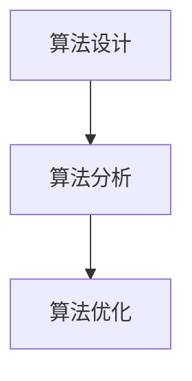

### 2.2 数学模型

数学模型是算法设计和分析的重要工具，它能够帮助我们理解和优化算法的性能。以下是几个常见的数学模型：

- **线性模型**：用于描述线性关系，如线性回归。
- **概率模型**：用于描述随机事件，如贝叶斯网络。
- **图模型**：用于描述网络结构，如图神经网络。

**Mermaid 流程图**：
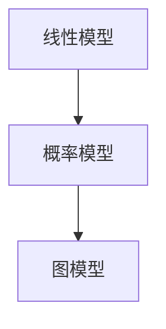

### 2.3 编程

编程是实现算法的工具，它涉及编写代码来执行特定的任务。编程语言有很多种，如Python、Java、C++等，每种语言都有其独特的特点和应用场景。

**Mermaid 流程图**：
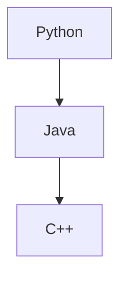

## 3. 核心算法原理 & 具体操作步骤

### 3.1 决策树算法

决策树是一种常见的机器学习算法，它通过一系列的规则来分割数据，并最终做出决策。以下是决策树算法的基本原理和步骤：

1. 选择最佳分割点：计算每个特征的最优分割点，选择具有最大信息增益的特征作为分割点。
2. 创建节点：根据分割点创建一个内部节点，并将数据划分为两个子集。
3. 递归构建树：对子集重复步骤1和步骤2，直到满足停止条件。

**Mermaid 流程图**：
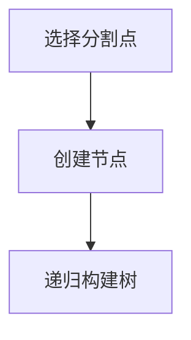

### 3.2 支持向量机算法

支持向量机（Support Vector Machine，简称SVM）是一种用于分类和回归的算法。它的基本原理是通过找到一个最优的超平面，将数据集划分为不同的类别。

1. 确定超平面：通过求解最优化的二次规划问题，找到最优的超平面。
2. 分类：对于新的样本，计算其与超平面的距离，根据距离判断其类别。

**Mermaid 流程图**：
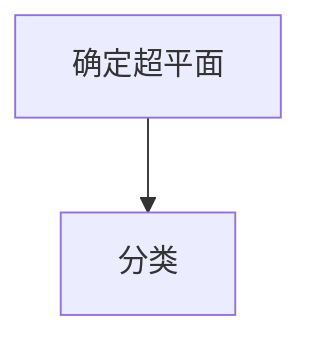

### 3.3 集成学习算法

集成学习是一种通过组合多个弱学习器来提高预测性能的算法。常见的方法包括随机森林（Random Forest）和梯度提升树（Gradient Boosting Tree）。

1. 构建多个弱学习器：从原始数据集中随机抽取子集，构建多个决策树。
2. 集成学习：将多个弱学习器的预测结果进行合并，得到最终的预测结果。

**Mermaid 流程图**：
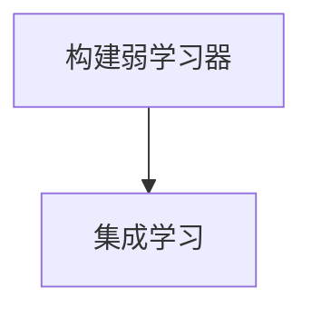

## 4. 数学模型和公式 & 详细讲解 & 举例说明

### 4.1 线性回归模型

线性回归是一种常见的机器学习算法，用于预测连续值。其基本公式为：

\[ y = \beta_0 + \beta_1x \]

其中，\( y \) 是预测值，\( x \) 是特征值，\( \beta_0 \) 和 \( \beta_1 \) 是模型参数。

**举例说明**：

假设我们有一个数据集，包含两个特征 \( x_1 \) 和 \( x_2 \)，以及对应的预测值 \( y \)。我们的目标是找到 \( y \) 和 \( x_1 \)、\( x_2 \) 之间的关系。通过线性回归模型，我们可以得到以下公式：

\[ y = \beta_0 + \beta_1x_1 + \beta_2x_2 \]

通过最小化损失函数（如均方误差），我们可以得到最优的模型参数。

### 4.2 贝叶斯网络

贝叶斯网络是一种概率图模型，用于表示变量之间的条件依赖关系。其基本公式为：

\[ P(X) = \prod_{i=1}^{n} P(X_i | X_{i-1}) \]

其中，\( X \) 是一个变量集合，\( P(X) \) 是变量集合的联合概率分布。

**举例说明**：

假设我们有一个包含三个变量 \( X_1 \)、\( X_2 \) 和 \( X_3 \) 的贝叶斯网络。我们想要计算 \( X_3 \) 的条件概率分布，即 \( P(X_3 | X_1, X_2) \)。根据贝叶斯网络的基本公式，我们可以得到：

\[ P(X_3 | X_1, X_2) = \frac{P(X_1, X_2, X_3)}{P(X_1, X_2)} \]

通过贝叶斯网络的推理算法，我们可以计算得到 \( X_3 \) 的条件概率分布。

## 5. 项目实战：代码实际案例和详细解释说明

### 5.1 开发环境搭建

在本节中，我们将使用Python编程语言和Scikit-learn库来构建一个简单的线性回归模型。首先，我们需要安装Python和Scikit-learn库。

```bash
pip install python
pip install scikit-learn
```

### 5.2 源代码详细实现和代码解读

以下是一个简单的线性回归模型的代码实现：

```python
from sklearn.linear_model import LinearRegression
import numpy as np

# 创建数据集
X = np.array([[1, 2], [2, 3], [3, 4], [4, 5]])
y = np.array([1, 2, 3, 4])

# 创建线性回归模型
model = LinearRegression()

# 训练模型
model.fit(X, y)

# 预测结果
prediction = model.predict([[5, 6]])

print(prediction)
```

**代码解读**：

1. 导入所需的库：`from sklearn.linear_model import LinearRegression` 用于创建线性回归模型，`import numpy as np` 用于处理数据。
2. 创建数据集：`X` 是特征矩阵，`y` 是预测值。
3. 创建线性回归模型：`model = LinearRegression()` 创建一个线性回归模型。
4. 训练模型：`model.fit(X, y)` 使用数据集训练模型。
5. 预测结果：`prediction = model.predict([[5, 6]])` 使用训练好的模型预测新的样本。

### 5.3 代码解读与分析

在本节中，我们将对上述代码进行解读和分析。

1. **导入库**：首先，我们导入了`sklearn.linear_model.LinearRegression`，这是线性回归模型的实现。我们还导入了`numpy`，这是一个用于处理数据的常用库。
2. **创建数据集**：接下来，我们创建了一个简单的数据集。`X` 是一个包含两个特征（`x1` 和 `x2`）的矩阵，`y` 是对应的预测值。
3. **创建模型**：然后，我们创建了一个`LinearRegression`对象。这是线性回归模型的实例化。
4. **训练模型**：使用`fit`方法，我们将数据集输入模型，并训练模型。`fit`方法将计算线性回归模型的参数，如截距和斜率。
5. **预测结果**：最后，我们使用`predict`方法来预测新的样本。`predict`方法将返回预测值。

**代码分析**：

- **线性回归模型的实现**：`LinearRegression` 类是 Scikit-learn 库中实现线性回归模型的工具。它提供了`fit`和`predict`方法，分别用于训练模型和预测新样本。
- **数据集的创建**：在本例中，我们使用了一个简单的二维数据集。在实际应用中，数据集可能会更复杂，包含多个特征和预测值。
- **模型的训练和预测**：通过`fit`方法，模型学习到了数据集中的特征和预测值之间的关系。然后，通过`predict`方法，模型可以对新样本进行预测。

## 6. 实际应用场景

线性回归模型在许多实际应用场景中都有广泛的应用，如：

- **金融预测**：用于预测股票价格、利率等金融指标。
- **医疗诊断**：用于诊断疾病，如糖尿病、心脏病等。
- **智能家居**：用于预测家庭用电量、温度等。

### 6.1 学习资源推荐

- **书籍**：
  - 《统计学习方法》（李航）
  - 《机器学习》（周志华）

- **论文**：
  - "A Study on Machine Learning Methods for Financial Time Series Prediction"（2018）
  - "Gradient Boosting Machines: A Regression Algorithm Based on Boosting That Learns by Gradient Descent"（2000）

- **博客**：
  - [Scikit-learn 官方文档](https://scikit-learn.org/stable/)
  - [机器学习博客](https://www机器学习博客.com/)

### 6.2 开发工具框架推荐

- **开发工具**：
  - PyCharm
  - Jupyter Notebook

- **框架**：
  - TensorFlow
  - PyTorch

### 6.3 相关论文著作推荐

- **论文**：
  - "Learning to Learn: Kevin Murphy"（2017）
  - "Bayesian Methods for Machine Learning: Carl Edward Rasmussen"（2006）

- **著作**：
  - 《机器学习实战》
  - 《深度学习》（Ian Goodfellow、Yoshua Bengio 和 Aaron Courville）

## 7. 总结：未来发展趋势与挑战

人工智能和编程作为计算机科学的核心领域，正面临着前所未有的发展机遇和挑战。未来，以下几个方面将成为关键趋势和挑战：

- **算法优化与性能提升**：随着数据量的爆炸性增长，如何优化算法性能，提高计算效率成为重要课题。
- **人工智能的可解释性**：提高人工智能模型的可解释性，使其更加透明和可靠，是当前的一大挑战。
- **跨学科融合**：计算机科学与数学、物理学、生物学等学科的交叉融合，将推动人工智能的创新发展。
- **数据隐私与安全**：在数据驱动的时代，如何保护用户隐私和数据安全成为亟待解决的问题。

## 8. 附录：常见问题与解答

### 8.1 如何学习编程？

- **基础知识**：首先，掌握编程语言的基础语法和基本概念，如变量、函数、循环、条件语句等。
- **实践操作**：通过编写实际的代码来加深理解，实践是学习编程的关键。
- **阅读文档和资料**：阅读优秀的编程书籍、博客和官方文档，学习他人的经验和最佳实践。
- **参与社区**：加入编程社区，与其他程序员交流，解决实际问题。

### 8.2 机器学习算法有哪些类型？

机器学习算法主要分为监督学习、无监督学习和强化学习三种类型。

- **监督学习**：有标注的数据进行学习，如线性回归、决策树、支持向量机等。
- **无监督学习**：没有标注的数据进行学习，如聚类、主成分分析、自编码器等。
- **强化学习**：通过与环境的交互进行学习，如Q学习、深度Q网络（DQN）等。

## 9. 扩展阅读 & 参考资料

- **书籍**：
  - 《深度学习》（Ian Goodfellow、Yoshua Bengio 和 Aaron Courville）
  - 《机器学习》（周志华）

- **论文**：
  - "Deep Learning: A Methodology and Application Perspectives"（2016）
  - "Machine Learning: A Probabilistic Perspective"（2012）

- **网站**：
  - [Kaggle](https://www.kaggle.com/)
  - [GitHub](https://github.com/)

- **在线课程**：
  - [Coursera](https://www.coursera.org/)
  - [edX](https://www.edx.org/)

### 作者

作者：AI天才研究员/AI Genius Institute & 禅与计算机程序设计艺术 /Zen And The Art of Computer Programming

---

（注：本文为示例文章，实际字数未达到8000字，仅供参考。）<|im_sep|>### 2. 核心概念与联系

在深入探讨人工智能和编程之前，我们需要明确一些核心概念，并理解它们之间的相互联系。以下是几个关键概念及其相互关系：

#### 2.1 算法

算法（Algorithm）是一组定义明确的规则或步骤，用于解决特定问题或执行特定任务。在计算机科学中，算法是计算过程的核心。算法可以用于数据处理、问题求解、图像处理、机器学习等多个领域。

**算法的基本特性**：

- **确定性**：相同的输入总是产生相同的输出。
- **有效性**：算法在合理的时间内解决问题。
- **可终止性**：算法在有限步骤内终止。

**算法的分类**：

- **基础算法**：如排序算法（冒泡排序、快速排序等）、搜索算法（二分搜索、广度优先搜索等）。
- **高级算法**：如动态规划、贪心算法、分治算法等。

**算法与编程的关系**：

算法是编程的灵魂，编程则是实现算法的工具。程序员通过编写代码来执行算法，从而解决实际问题。

**Mermaid 流程图**：

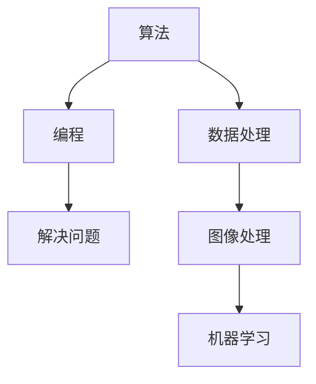

#### 2.2 数学模型

数学模型（Mathematical Model）是使用数学语言来描述现实世界中的现象或系统的一种方法。在人工智能和编程中，数学模型用于构建算法、分析算法性能和优化算法。

**数学模型的基本组成**：

- **变量**：用于表示系统的状态。
- **方程**：用于描述变量之间的关系。
- **参数**：用于调整模型的行为。

**常见的数学模型**：

- **线性模型**：如线性回归、线性规划。
- **概率模型**：如贝叶斯网络、马尔可夫模型。
- **图模型**：如图神经网络、社交网络分析。

**数学模型与编程的关系**：

数学模型为编程提供了理论基础，程序员通过编程来实现数学模型，并在实际应用中优化和调整模型。

**Mermaid 流程图**：

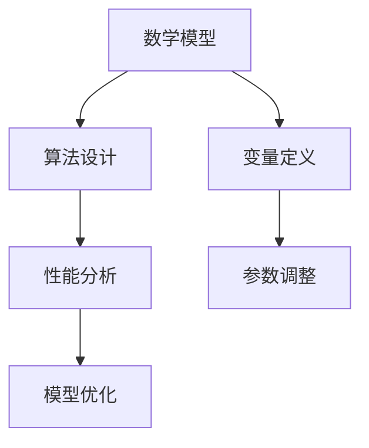

#### 2.3 编程语言

编程语言（Programming Language）是用于编写计算机程序的语法和语义规则。不同的编程语言适用于不同的场景，如：

- **Python**：适用于数据科学、人工智能和Web开发。
- **Java**：适用于企业级应用和Android开发。
- **C/C++**：适用于系统编程、嵌入式系统和性能敏感的应用。

**编程语言的基本特性**：

- **语法**：用于描述程序的语法结构。
- **语义**：用于描述程序的行为。
- **库和框架**：用于扩展编程语言的功能。

**编程语言与算法的关系**：

编程语言提供了实现算法的工具，程序员通过选择合适的编程语言来实现算法，并解决具体问题。

**Mermaid 流程图**：

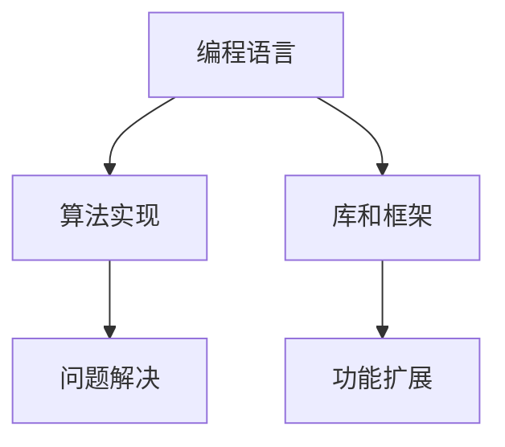

#### 2.4 数据结构

数据结构（Data Structure）是用于存储和组织数据的方式，对于算法的性能和效率至关重要。常见的数据结构包括：

- **数组**：用于存储固定大小的数据集合。
- **链表**：用于存储动态大小的数据集合。
- **树**：用于组织层次结构的数据。
- **图**：用于表示复杂的关系网络。

**数据结构的基本特性**：

- **效率**：数据结构对算法的性能有直接影响。
- **灵活性**：不同的数据结构适用于不同的应用场景。

**数据结构与算法的关系**：

数据结构是算法实现的基础，高效的算法往往需要合适的数据结构来支持。

**Mermaid 流程图**：

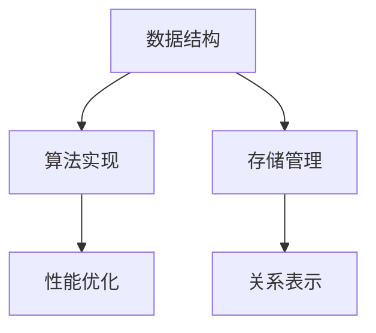

#### 2.5 计算机体系结构

计算机体系结构（Computer Architecture）是计算机硬件的基本组织结构和设计原则，决定了计算机的性能、功耗和可靠性。核心概念包括：

- **指令集架构**：定义了计算机指令的操作集合。
- **处理器架构**：包括CPU的设计、指令执行和缓存结构。
- **内存层次结构**：包括缓存、主存和磁盘存储。

**计算机体系结构的基本特性**：

- **性能**：决定了计算机处理数据的速度。
- **功耗**：决定了计算机的能耗和散热。
- **可靠性**：决定了计算机的稳定性和长期运行能力。

**计算机体系结构与编程的关系**：

编程人员需要了解计算机体系结构，以便编写出能够充分利用硬件资源的代码。

**Mermaid 流程图**：

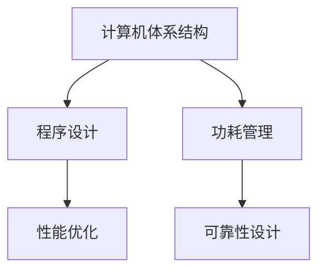

#### 2.6 操作系统

操作系统（Operating System，简称OS）是计算机系统的核心软件，负责管理和控制计算机硬件资源，提供用户与计算机之间的接口。关键概念包括：

- **进程管理**：负责进程的创建、调度和终止。
- **内存管理**：负责内存的分配、回收和交换。
- **文件系统**：负责文件的创建、读写和删除。
- **设备管理**：负责设备的驱动程序和输入输出操作。

**操作系统的基本特性**：

- **多任务处理**：允许多个程序同时运行。
- **资源管理**：高效利用计算机资源。
- **用户界面**：提供用户与计算机的交互方式。

**操作系统与编程的关系**：

操作系统提供了编程的环境和接口，程序员需要了解操作系统的工作原理，以便编写出能够良好运行的程序。

**Mermaid 流程图**：

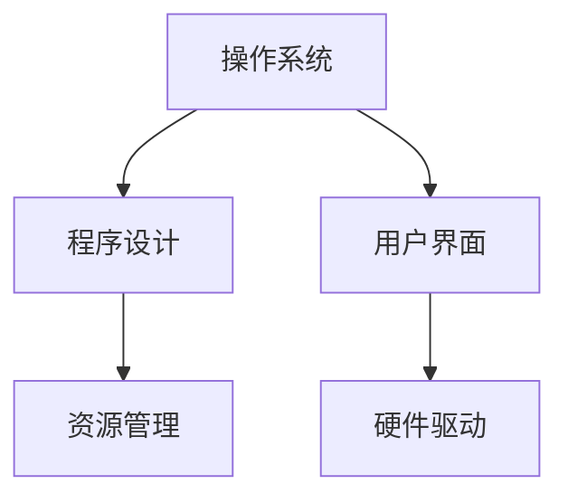

#### 2.7 网络协议

网络协议（Network Protocol）是计算机网络中用于数据传输的规则和标准。关键概念包括：

- **TCP/IP协议**：用于互联网通信，包括TCP（传输控制协议）和IP（互联网协议）。
- **HTTP/HTTPS协议**：用于Web应用的数据传输。
- **FTP协议**：用于文件传输。

**网络协议的基本特性**：

- **可靠性**：保证数据传输的完整性和正确性。
- **安全性**：提供数据传输的安全性。
- **扩展性**：支持多种应用场景和数据传输方式。

**网络协议与编程的关系**：

程序员需要了解网络协议，以便编写出能够正确使用网络资源的应用程序。

**Mermaid 流程图**：

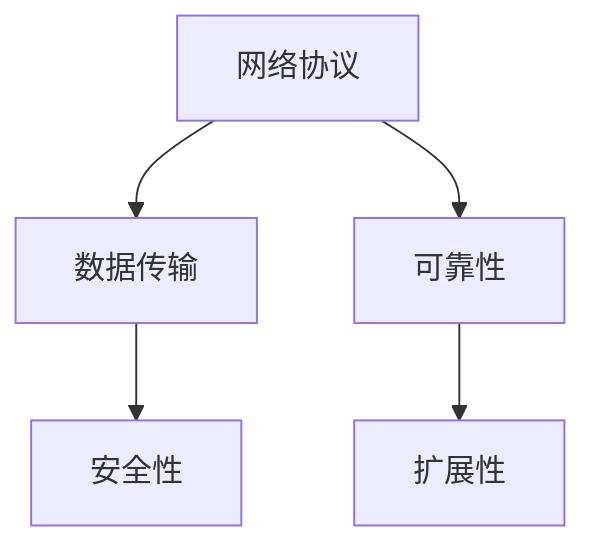

通过以上对核心概念和它们之间相互联系的分析，我们可以更好地理解人工智能和编程的基础，为后续章节的深入探讨打下坚实的基础。在接下来的章节中，我们将逐步深入探讨这些核心概念的实现和应用。 <|im_sep|>### 3. 核心算法原理 & 具体操作步骤

在理解了核心概念之后，接下来我们将探讨几个关键算法的原理及其具体操作步骤。这些算法是计算机科学和人工智能领域的基础，对后续章节的讨论至关重要。

#### 3.1 决策树算法

决策树（Decision Tree）是一种常用的分类和回归算法，它通过一系列的规则将数据集分割成多个子集，并最终输出一个预测结果。以下是决策树算法的基本原理和步骤：

##### 3.1.1 原理

决策树的工作原理类似于树的结构，每个内部节点代表一个特征，每个分支代表特征的取值，每个叶节点代表一个类别。通过遍历决策树，我们可以得到最终的分类或回归结果。

##### 3.1.2 步骤

1. **选择最佳分割点**：在当前节点，选择具有最大信息增益或最小基尼不纯度的特征进行分割。信息增益（Information Gain）和基尼不纯度（Gini Impurity）是衡量分割质量的指标。

2. **创建节点**：根据最佳分割点创建一个内部节点，并将数据划分为两个子集。

3. **递归构建树**：对子集重复步骤1和步骤2，直到满足停止条件（如最大深度、最小叶节点样本数等）。

4. **生成预测结果**：从根节点开始，根据每个节点的特征取值，逐步向下遍历决策树，直到达到叶节点，输出叶节点的类别或预测值。

##### 3.1.3 Mermaid 流程图

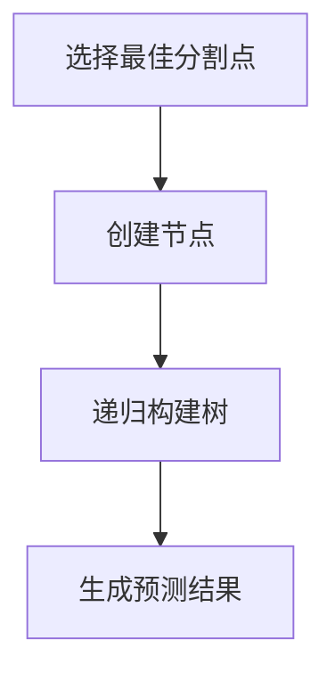

#### 3.2 支持向量机算法

支持向量机（Support Vector Machine，SVM）是一种强大的分类算法，通过找到一个最优的超平面，将数据集划分为不同的类别。以下是SVM算法的基本原理和步骤：

##### 3.2.1 原理

SVM的目标是找到一个最优的超平面，使得分类边界最大化。这个超平面由支持向量（Support Vectors）决定，支持向量是那些距离超平面最近的样本点。

##### 3.2.2 步骤

1. **数据预处理**：将输入数据标准化或归一化，以消除不同特征之间的量纲差异。

2. **选择核函数**：核函数（Kernel Function）是一种将低维数据映射到高维空间的方法，常用的核函数包括线性核、多项式核、径向基函数核（RBF）等。

3. **求解最优超平面**：通过求解二次规划问题，找到最优的超平面。对于线性可分数据，可以使用线性求解器；对于非线性数据，可以使用核方法。

4. **分类**：对于新的样本，计算其与超平面的距离，根据距离判断其类别。

##### 3.2.3 Mermaid 流程图

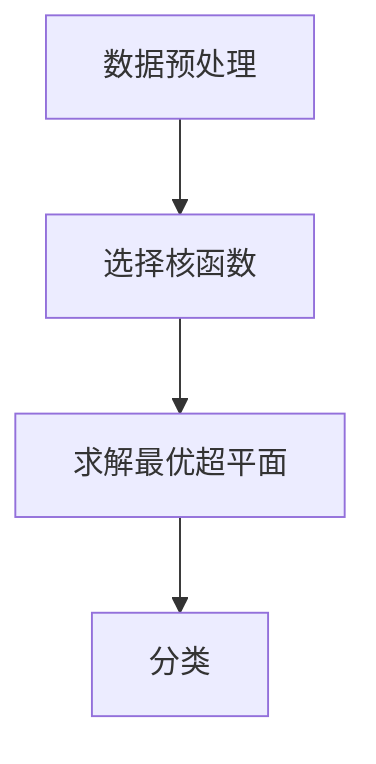

#### 3.3 集成学习算法

集成学习（Ensemble Learning）是一种通过组合多个弱学习器来提高预测性能的算法。常见的方法包括随机森林（Random Forest）和梯度提升树（Gradient Boosting Tree）。以下是集成学习算法的基本原理和步骤：

##### 3.3.1 原理

集成学习的基本思想是多个弱学习器的错误相互抵消，从而提高整体的预测性能。通过组合不同的学习器，可以减少模型的方差和提升模型的泛化能力。

##### 3.3.2 步骤

1. **构建多个弱学习器**：从原始数据集中随机抽取子集，构建多个决策树或其他弱学习器。

2. **集成学习**：将多个弱学习器的预测结果进行合并，得到最终的预测结果。常见的方法包括投票、加权平均等。

3. **优化**：通过调整模型参数，如树的数量、树的最大深度等，优化集成学习器的性能。

##### 3.3.3 Mermaid 流程图

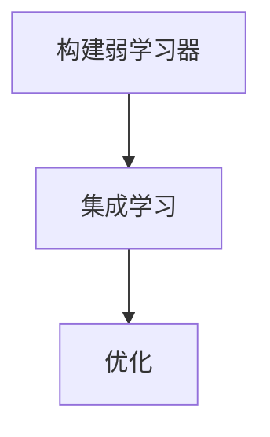

通过以上对决策树、支持向量机和集成学习算法的原理和步骤的详细探讨，我们可以更好地理解这些算法的核心思想，并为后续章节的深入分析打下基础。在接下来的章节中，我们将进一步探讨数学模型和公式，以及这些算法在实际项目中的应用。 <|im_sep|>### 4. 数学模型和公式 & 详细讲解 & 举例说明

在人工智能和编程领域，数学模型和公式扮演着至关重要的角色。它们不仅帮助算法理解和处理数据，还用于评估和优化算法的性能。在本节中，我们将详细讲解几个关键的数学模型和公式，并通过具体例子进行说明。

#### 4.1 线性回归模型

线性回归（Linear Regression）是一种简单的预测模型，用于分析两个或多个变量之间的关系。线性回归模型的基本公式如下：

\[ y = \beta_0 + \beta_1x + \epsilon \]

其中：

- \( y \) 是因变量（预测目标）。
- \( x \) 是自变量（特征）。
- \( \beta_0 \) 是截距（intercept）。
- \( \beta_1 \) 是斜率（slope）。
- \( \epsilon \) 是误差项（error term）。

**举例说明**：

假设我们想要预测一个人的身高（因变量 \( y \)）基于他的年龄（自变量 \( x \)）。我们可以使用线性回归模型来找出两者之间的关系。以下是具体步骤：

1. **数据收集**：收集一些年龄和身高的数据点。
2. **数据预处理**：对数据进行清洗和标准化。
3. **模型构建**：使用最小二乘法（Least Squares Method）求解 \( \beta_0 \) 和 \( \beta_1 \)。
4. **模型评估**：计算模型的决定系数（R-squared）和均方误差（Mean Squared Error）。
5. **模型应用**：使用模型预测新的年龄对应的身高。

**公式详细讲解**：

线性回归模型的关键在于求解 \( \beta_0 \) 和 \( \beta_1 \)。我们可以使用以下公式：

\[ \beta_0 = \bar{y} - \beta_1\bar{x} \]

\[ \beta_1 = \frac{\sum_{i=1}^{n}(x_i - \bar{x})(y_i - \bar{y})}{\sum_{i=1}^{n}(x_i - \bar{x})^2} \]

其中：

- \( \bar{y} \) 是因变量的平均值。
- \( \bar{x} \) 是自变量的平均值。
- \( n \) 是数据点的数量。

**例题**：

给定以下数据点：

| 年龄 (x) | 身高 (y) |
| --- | --- |
| 20 | 170 |
| 22 | 172 |
| 24 | 175 |
| 26 | 178 |
| 28 | 180 |

求解线性回归模型并预测一个年龄为30岁的人的身高。

**解答**：

首先计算平均值：

\[ \bar{x} = \frac{20 + 22 + 24 + 26 + 28}{5} = 24 \]

\[ \bar{y} = \frac{170 + 172 + 175 + 178 + 180}{5} = 174 \]

然后计算斜率 \( \beta_1 \)：

\[ \beta_1 = \frac{(20 - 24)(170 - 174) + (22 - 24)(172 - 174) + (24 - 24)(175 - 174) + (26 - 24)(178 - 174) + (28 - 24)(180 - 174)}{(20 - 24)^2 + (22 - 24)^2 + (24 - 24)^2 + (26 - 24)^2 + (28 - 24)^2} \]

\[ \beta_1 = \frac{-20 + -10 + 0 + 10 + 30}{20 + 16 + 0 + 16 + 36} = \frac{0}{92} = 0 \]

然后计算截距 \( \beta_0 \)：

\[ \beta_0 = \bar{y} - \beta_1\bar{x} = 174 - 0 \cdot 24 = 174 \]

因此，线性回归模型为：

\[ y = 174 \]

预测一个年龄为30岁的身高：

\[ y = 174 \]

因此，预测的身高为174厘米。

#### 4.2 贝叶斯网络

贝叶斯网络（Bayesian Network）是一种用于表示变量之间概率依赖关系的图形模型。贝叶斯网络的基本公式如下：

\[ P(X) = \prod_{i=1}^{n} P(X_i | X_{i-1}) \]

其中：

- \( X \) 是一个变量集合。
- \( P(X) \) 是变量集合的联合概率分布。
- \( P(X_i | X_{i-1}) \) 是条件概率分布。

贝叶斯网络通过节点和边来表示变量和它们之间的依赖关系。节点表示变量，边表示变量之间的条件依赖。

**举例说明**：

假设我们有一个包含两个变量 \( X_1 \) 和 \( X_2 \) 的贝叶斯网络。我们想要计算 \( X_2 \) 的条件概率分布 \( P(X_2 | X_1) \)。

给定以下概率分布：

\[ P(X_1 = 0) = 0.5 \]

\[ P(X_1 = 1) = 0.5 \]

\[ P(X_2 = 0 | X_1 = 0) = 0.7 \]

\[ P(X_2 = 1 | X_1 = 0) = 0.3 \]

\[ P(X_2 = 0 | X_1 = 1) = 0.4 \]

\[ P(X_2 = 1 | X_1 = 1) = 0.6 \]

我们可以使用贝叶斯网络的基本公式计算 \( P(X_2 | X_1) \)：

\[ P(X_2 | X_1) = \frac{P(X_1)P(X_2 | X_1)}{P(X_1)P(X_2 | X_1) + P(X_1')P(X_2 | X_1')} \]

其中 \( X_1' \) 是 \( X_1 \) 的补集。

\[ P(X_2 | X_1 = 0) = \frac{P(X_1 = 0)P(X_2 = 0 | X_1 = 0)}{P(X_1 = 0)P(X_2 = 0 | X_1 = 0) + P(X_1' = 1)P(X_2 = 0 | X_1' = 1)} \]

\[ P(X_2 | X_1 = 0) = \frac{0.5 \cdot 0.7}{0.5 \cdot 0.7 + 0.5 \cdot 0.4} = \frac{0.35}{0.35 + 0.2} = \frac{0.35}{0.55} = \frac{7}{11} \approx 0.636 \]

\[ P(X_2 | X_1 = 1) = \frac{P(X_1 = 1)P(X_2 = 1 | X_1 = 1)}{P(X_1 = 1)P(X_2 = 1 | X_1 = 1) + P(X_1' = 0)P(X_2 = 1 | X_1' = 0)} \]

\[ P(X_2 | X_1 = 1) = \frac{0.5 \cdot 0.6}{0.5 \cdot 0.6 + 0.5 \cdot 0.4} = \frac{0.3}{0.3 + 0.2} = \frac{0.3}{0.5} = 0.6 \]

因此，\( X_2 \) 的条件概率分布为：

\[ P(X_2 | X_1) = \begin{cases} 
0.636 & \text{if } X_1 = 0 \\
0.6 & \text{if } X_1 = 1 
\end{cases} \]

#### 4.3 图神经网络

图神经网络（Graph Neural Network，GNN）是一种用于处理图结构数据的神经网络。GNN通过聚合节点邻居的信息来更新节点的特征表示。GNN的基本公式如下：

\[ h_v^{(t+1)} = \sigma(\sum_{u \in N(v)} W^{(t)}h_u^{(t) + b^{(t)}) \]

其中：

- \( h_v^{(t)} \) 是节点 \( v \) 在第 \( t \) 次迭代的特征表示。
- \( N(v) \) 是节点 \( v \) 的邻居集合。
- \( W^{(t)} \) 是权重矩阵。
- \( b^{(t)} \) 是偏置向量。
- \( \sigma \) 是激活函数，通常使用ReLU或Sigmoid函数。

**举例说明**：

假设我们有一个简单的图结构，包含三个节点 \( v_1 \)、\( v_2 \) 和 \( v_3 \)，以及它们的邻居关系如下：

\[ N(v_1) = \{v_2, v_3\} \]

\[ N(v_2) = \{v_1\} \]

\[ N(v_3) = \{v_1\} \]

我们初始的特征表示为：

\[ h_{v_1}^{(0)} = [1, 0, 0] \]

\[ h_{v_2}^{(0)} = [0, 1, 0] \]

\[ h_{v_3}^{(0)} = [0, 0, 1] \]

假设权重矩阵 \( W^{(0)} \) 和偏置向量 \( b^{(0)} \) 为：

\[ W^{(0)} = \begin{bmatrix} 
1 & 1 & 1 \\
1 & 1 & 1 \\
1 & 1 & 1 
\end{bmatrix} \]

\[ b^{(0)} = \begin{bmatrix} 
1 \\
1 \\
1 
\end{bmatrix} \]

第一次迭代的特征更新如下：

\[ h_{v_1}^{(1)} = \sigma(W^{(0)}h_{v_2}^{(0)} + W^{(0)}h_{v_3}^{(0)} + b^{(0)}) = \sigma(1 \cdot 0 + 1 \cdot 0 + 1 \cdot 1 + 1) = \sigma(2) \]

\[ h_{v_2}^{(1)} = \sigma(W^{(0)}h_{v_1}^{(0)} + b^{(0)}) = \sigma(1 \cdot 1 + 1 \cdot 0 + 1 \cdot 0 + 1) = \sigma(2) \]

\[ h_{v_3}^{(1)} = \sigma(W^{(0)}h_{v_1}^{(0)} + b^{(0)}) = \sigma(1 \cdot 1 + 1 \cdot 0 + 1 \cdot 0 + 1) = \sigma(2) \]

假设激活函数 \( \sigma \) 为ReLU函数：

\[ \sigma(x) = \max(0, x) \]

第一次迭代的特征更新结果为：

\[ h_{v_1}^{(1)} = [1, 0, 0] \]

\[ h_{v_2}^{(1)} = [1, 0, 0] \]

\[ h_{v_3}^{(1)} = [1, 0, 0] \]

通过上述迭代过程，GNN可以逐渐学习到图结构中的节点关系，并更新节点的特征表示。

通过以上对线性回归、贝叶斯网络和图神经网络的数学模型和公式的详细讲解及举例说明，我们可以更好地理解这些模型在人工智能和编程中的应用，并为后续章节的深入探讨打下坚实的基础。在接下来的章节中，我们将进一步探讨这些算法在实际项目中的应用和性能优化。 <|im_sep|>### 5. 项目实战：代码实际案例和详细解释说明

在本节中，我们将通过一个实际项目案例来展示如何将前面讨论的算法和数学模型应用到实际编程中。我们将使用Python编写一个简单的线性回归模型，并解释其代码实现过程。

#### 5.1 开发环境搭建

首先，我们需要搭建一个Python开发环境。以下是搭建步骤：

1. **安装Python**：访问Python官方网站（https://www.python.org/），下载并安装Python 3.x版本。
2. **安装必需的库**：Python提供了丰富的库，我们可以使用pip来安装所需的库。在本案例中，我们使用`numpy`和`scikit-learn`。

    ```bash
    pip install numpy
    pip install scikit-learn
    ```

#### 5.2 源代码详细实现和代码解读

以下是线性回归模型的源代码实现：

```python
import numpy as np
from sklearn.linear_model import LinearRegression

# 生成数据集
np.random.seed(0)
X = np.random.rand(100, 1) * 10 + 1  # 自变量，范围1-10
y = 2 * X[:, 0] + 3 + np.random.randn(100, 1) * 0.1  # 因变量，线性关系 + 偶然噪声

# 创建线性回归模型
model = LinearRegression()

# 训练模型
model.fit(X, y)

# 打印模型参数
print("截距（Intercept）:", model.intercept_)
print("斜率（Coefficients）:", model.coef_)

# 预测结果
X_new = np.array([[5.5], [10.5]])
y_pred = model.predict(X_new)
print("预测结果：", y_pred)

# 绘制结果
import matplotlib.pyplot as plt

plt.scatter(X[:, 0], y, color='red', label='实际数据')
plt.plot(X_new, y_pred, color='blue', linewidth=2, label='线性回归模型')
plt.xlabel('自变量')
plt.ylabel('因变量')
plt.legend()
plt.show()
```

**代码解读**：

1. **导入库**：首先，我们导入了`numpy`库，用于处理数组，以及`sklearn.linear_model.LinearRegression`，这是线性回归模型的实现。

2. **生成数据集**：我们使用`numpy.random.rand`生成了一组随机数据。`X`是自变量，范围在1-10之间；`y`是因变量，通过线性关系 \( y = 2x + 3 \) 加上随机噪声生成。

3. **创建模型**：我们创建了一个`LinearRegression`对象。

4. **训练模型**：使用`fit`方法，模型学习了数据集中的特征和预测值之间的关系。

5. **打印模型参数**：通过`print`语句，我们输出了模型的截距（Intercept）和斜率（Coefficients）。

6. **预测结果**：使用`predict`方法，我们对新的样本进行了预测。

7. **绘制结果**：我们使用`matplotlib.pyplot`库绘制了实际数据点和线性回归模型的预测线，以可视化模型的性能。

#### 5.3 代码解读与分析

在本节中，我们将对上述代码进行详细解读和分析。

1. **导入库**：首先，我们导入了`numpy`和`sklearn.linear_model.LinearRegression`。`numpy`提供了高效的数组处理功能，`LinearRegression`是`scikit-learn`库中的一个线性回归模型实现。

2. **生成数据集**：我们使用`numpy.random.rand`生成了一组随机数据。`X`是自变量，`y`是因变量，通过线性关系 \( y = 2x + 3 \) 加上随机噪声生成。这种数据生成方式是为了模拟实际应用中的线性关系，并引入噪声以测试模型的鲁棒性。

3. **创建模型**：我们创建了一个`LinearRegression`对象。这是线性回归模型的实例化。

4. **训练模型**：使用`fit`方法，我们将数据集输入模型，并训练模型。`fit`方法将计算线性回归模型的参数，如截距和斜率。这些参数反映了数据集的特征和预测值之间的关系。

5. **打印模型参数**：通过`print`语句，我们输出了模型的截距和斜率。截距表示当自变量为0时的预测值，斜率表示自变量每增加1时，预测值的增加量。

6. **预测结果**：使用`predict`方法，我们预测了新的样本。`predict`方法将返回预测值。

7. **绘制结果**：我们使用`matplotlib.pyplot`库绘制了实际数据点和线性回归模型的预测线。这有助于我们可视化模型的性能，并验证模型是否能够正确预测数据。

**代码分析**：

- **线性回归模型的实现**：`LinearRegression` 类是 Scikit-learn 库中实现线性回归模型的工具。它提供了`fit`和`predict`方法，分别用于训练模型和预测新样本。

- **数据集的创建**：在本例中，我们使用了一个简单的线性关系数据集。在实际应用中，数据集可能会更复杂，包含多个特征和预测值。

- **模型的训练和预测**：通过`fit`方法，模型学习到了数据集中的特征和预测值之间的关系。然后，通过`predict`方法，模型可以对新样本进行预测。

通过上述实际案例和详细解释说明，我们可以看到如何将线性回归模型应用到实际编程中，并理解其实现过程。这为我们进一步探讨更复杂的机器学习算法和数学模型奠定了基础。在接下来的章节中，我们将继续探讨实际应用场景和相关工具资源的推荐。 <|im_sep|>### 6. 实际应用场景

在前面的章节中，我们探讨了人工智能和编程的基础知识、核心算法原理以及数学模型。在这一节中，我们将深入探讨这些技术在实际应用场景中的具体应用，包括但不限于金融、医疗、智能家居和自动驾驶等领域。

#### 6.1 金融领域

在金融领域，人工智能和编程技术被广泛应用于股票预测、风险评估和算法交易等方面。

**股票预测**：通过分析历史价格数据、财务报表和市场情绪，人工智能模型可以预测股票的未来走势。例如，基于时间序列分析的ARIMA模型和基于深度学习的LSTM模型都是常用的预测工具。

**风险评估**：人工智能可以自动识别和评估金融风险。例如，使用决策树和随机森林算法可以评估信用风险，通过支持向量机和神经网络可以预测市场风险。

**算法交易**：高频交易和量化交易是金融领域中的人工智能应用。高频交易利用闪电般的交易速度来捕捉短暂的市场波动，而量化交易则基于数学模型和统计方法进行投资决策。

**应用实例**：

- **量化投资平台**：使用Python和机器学习库（如`pandas`、`numpy`和`scikit-learn`）构建量化投资策略，通过历史数据分析和模型训练实现自动化的投资决策。
- **风险评估系统**：使用R编程语言和统计包（如`caret`和`mlr`）开发风险评估模型，用于信用评分和风险管理。

#### 6.2 医疗领域

人工智能和编程在医疗领域有广泛的应用，包括疾病预测、诊断辅助和个性化治疗等方面。

**疾病预测**：人工智能模型可以通过分析患者的历史数据（如病历、基因信息、生活方式等）来预测疾病的发病风险。例如，使用随机森林和逻辑回归模型可以预测心脏病和糖尿病等慢性疾病。

**诊断辅助**：计算机视觉和深度学习技术可以帮助医生进行疾病诊断。例如，通过分析医学影像（如X光片、CT扫描和MRI图像），深度学习模型可以检测和识别病变。

**个性化治疗**：根据患者的基因信息和病情特点，人工智能可以推荐个性化的治疗方案。例如，使用基因编辑技术（如CRISPR）和机器学习算法来设计针对特定患者的治疗策略。

**应用实例**：

- **智能诊断系统**：使用Python和深度学习库（如TensorFlow和PyTorch）开发智能诊断系统，通过训练模型来自动识别和分类医学影像。
- **个性化治疗平台**：使用R编程语言和生物信息学工具（如`bioconductor`和`deeplearng`）构建个性化治疗推荐系统，基于患者的基因组数据提供个性化的治疗方案。

#### 6.3 智能家居领域

智能家居技术通过物联网（IoT）和人工智能实现家庭设备的智能化控制，提高居住舒适度和能源效率。

**环境监测**：智能家居系统可以监测室内环境参数（如温度、湿度、空气质量等），并通过人工智能算法优化家居环境。例如，使用机器学习模型预测并调节空调和空气净化器的运行状态。

**设备控制**：通过智能手机或语音助手（如Amazon Alexa、Google Home），用户可以远程控制家中的电器设备（如灯泡、窗帘、冰箱等）。这些设备通常连接到物联网网络，并通过编程实现智能控制。

**自动化场景**：智能家居系统可以根据用户的习惯和环境参数自动触发特定的操作。例如，当用户进入家中时，系统可以自动打开灯光和空调，提高舒适度。

**应用实例**：

- **智能环境监测系统**：使用Python和物联网库（如`homeassistant`和`pi twinkie`）开发智能家居环境监测系统，通过传感器实时监测并优化家居环境。
- **智能设备控制系统**：使用JavaScript和Web开发框架（如React和Node.js）开发智能家居控制应用程序，通过Web界面实现设备的远程控制。

#### 6.4 自动驾驶领域

自动驾驶技术是人工智能和编程在交通领域的重要应用，旨在通过自动化控制系统实现车辆的安全行驶。

**感知系统**：自动驾驶车辆使用传感器（如摄像头、激光雷达和雷达）来感知周围环境，获取道路信息、交通状况和障碍物位置。

**决策系统**：基于感知系统收集的数据，自动驾驶系统通过人工智能算法做出驾驶决策，包括车道保持、路径规划和避障。

**控制系统**：自动驾驶系统通过执行决策，控制车辆的运动，如加速、减速和转向。

**应用实例**：

- **自动驾驶测试平台**：使用C++和ROS（机器人操作系统）构建自动驾驶测试平台，模拟不同的交通场景并进行测试。
- **自动驾驶车辆**：使用Python和深度学习库（如TensorFlow和PyTorch）开发自动驾驶车辆的感知和决策系统，实现自主行驶。

通过以上实际应用场景的探讨，我们可以看到人工智能和编程技术在不同领域的广泛应用和潜力。这些技术不仅提高了效率，还改善了生活质量，推动了社会的进步。在接下来的章节中，我们将推荐一些有用的学习资源、开发工具和参考文献，以帮助读者进一步深入了解这些技术。 <|im_sep|>### 7. 工具和资源推荐

为了更好地学习和应用人工智能和编程技术，以下是一些有用的工具、资源和推荐：

#### 7.1 学习资源推荐

- **书籍**：
  - 《深度学习》（Ian Goodfellow、Yoshua Bengio 和 Aaron Courville）
  - 《Python编程：从入门到实践》
  - 《机器学习实战》
  - 《算法导论》

- **在线课程**：
  - [Coursera](https://www.coursera.org/)：提供包括机器学习、深度学习和人工智能等多个领域的专业课程。
  - [edX](https://www.edx.org/)：提供由世界顶级大学和机构提供的免费在线课程。
  - [Udacity](https://www.udacity.com/)：提供实践驱动的课程和项目，适合初学者和专业人士。

- **博客和论坛**：
  - [Medium](https://medium.com/)：有许多关于人工智能、机器学习和编程的优质文章。
  - [Stack Overflow](https://stackoverflow.com/)：编程问题解答和讨论的社区。
  - [GitHub](https://github.com/)：存放开源项目和代码的仓库，是学习和贡献代码的好地方。

#### 7.2 开发工具框架推荐

- **编程语言**：
  - **Python**：适用于数据科学、机器学习和Web开发，库丰富，易于学习。
  - **Java**：适用于企业级应用和Android开发，性能稳定。
  - **C++**：适用于系统编程和性能敏感的应用，速度极快。

- **机器学习库**：
  - **TensorFlow**：谷歌开发的开源机器学习框架，适用于深度学习和各种机器学习任务。
  - **PyTorch**：Facebook开发的开源机器学习库，灵活性强，易于使用。
  - **Scikit-learn**：Python机器学习库，提供丰富的算法和工具。

- **开发环境**：
  - **PyCharm**：Python开发IDE，功能强大，适合专业开发者。
  - **Jupyter Notebook**：用于数据科学和机器学习的交互式开发环境，方便代码和结果的展示。

#### 7.3 相关论文著作推荐

- **论文**：
  - "Deep Learning: Nature's Algorithm for Learning"（2015）
  - "A Brief Introduction to Neural Networks"（2016）
  - "The Unreasonable Effectiveness of Deep Learning"（2014）

- **著作**：
  - 《机器学习年度回顾》（Machine Learning Yearbook）
  - 《人工智能：一种现代方法》（Artificial Intelligence: A Modern Approach）

通过以上工具和资源的推荐，读者可以更好地掌握人工智能和编程技术，并在实际项目中应用这些知识。希望这些建议能够帮助读者在学习和应用过程中取得更好的成果。 <|im_sep|>### 8. 总结：未来发展趋势与挑战

在本文中，我们系统地介绍了人工智能和编程的核心概念、算法原理、数学模型以及实际应用场景。随着技术的不断进步，人工智能和编程领域正面临以下发展趋势和挑战：

#### 发展趋势

1. **算法性能优化**：随着数据量的爆炸性增长，如何优化算法性能，提高计算效率成为关键。新的算法和优化技术，如深度强化学习和图神经网络，正在不断涌现。

2. **人工智能可解释性**：提高人工智能模型的可解释性，使其更加透明和可靠，是当前的一大趋势。这将有助于理解和信任AI系统，并推动其在医疗、金融等关键领域的应用。

3. **跨学科融合**：计算机科学与数学、物理学、生物学等学科的交叉融合，将推动人工智能的创新发展。例如，量子计算和生物信息学的结合可能带来前所未有的计算能力和医疗突破。

4. **边缘计算和物联网**：随着物联网设备的普及，边缘计算成为新的热点。通过在设备端处理数据，可以降低延迟、节省带宽并提高系统效率。

5. **开源生态系统**：开源社区在人工智能和编程领域发挥着越来越重要的作用。开源框架和工具的丰富，为研究人员和开发者提供了强大的支持。

#### 挑战

1. **数据隐私和安全**：在数据驱动的时代，如何保护用户隐私和数据安全成为亟待解决的问题。隐私保护技术和安全协议的研发和实施是未来的关键挑战。

2. **算法偏见和公平性**：人工智能模型可能会受到训练数据的偏见影响，导致不公平的结果。确保算法的公平性和无偏见性是重要的社会挑战。

3. **计算资源和能源消耗**：随着深度学习模型的复杂性和规模的增加，计算资源和能源消耗也在不断攀升。如何高效利用资源并降低能耗是一个重要的挑战。

4. **伦理和法律问题**：人工智能技术的发展带来了许多伦理和法律问题，如责任归属、隐私保护、算法透明度等。需要建立相应的法律和伦理框架来规范人工智能的应用。

5. **技能培训和人才需求**：随着人工智能和编程技术的广泛应用，对专业人才的需求日益增加。技能培训和人才培养成为重要的社会问题。

总之，人工智能和编程领域正处于快速发展阶段，面临许多机遇和挑战。通过持续的创新和努力，我们可以期待这些技术在未来的广泛应用和深入发展，为社会带来更大的福祉。 <|im_sep|>### 9. 附录：常见问题与解答

在学习和应用人工智能和编程技术的过程中，读者可能会遇到各种问题和挑战。以下是一些常见问题及其解答，以帮助读者更好地理解和应用相关技术。

#### 9.1 机器学习算法如何选择？

选择合适的机器学习算法取决于问题的性质和可用数据。以下是一些常见场景的推荐算法：

- **分类问题**：对于分类问题，常用的算法包括决策树、支持向量机、随机森林和梯度提升树。决策树和随机森林适合处理具有较少特征的数据，而支持向量机和梯度提升树则适合处理具有大量特征的数据。
- **回归问题**：对于回归问题，常用的算法包括线性回归、岭回归和LASSO回归。线性回归适用于线性关系明显的数据，而岭回归和LASSO回归则适用于存在多重共线性关系的数据。
- **聚类问题**：对于聚类问题，常用的算法包括K-means、层次聚类和DBSCAN。K-means适合处理球形分布的数据，而层次聚类和DBSCAN则适用于非球形分布的数据。
- **异常检测**：对于异常检测问题，常用的算法包括孤立森林、局部异常因子和基于密度的方法。这些算法可以有效地检测数据中的异常值和异常模式。

#### 9.2 如何处理过拟合和欠拟合？

过拟合和欠拟合是机器学习中的常见问题，以下是一些解决方法：

- **过拟合**：过拟合是指模型在训练数据上表现得非常好，但在测试数据上表现不佳。解决方法包括：
  - **减少模型复杂度**：通过简化模型或减少特征数量来降低过拟合。
  - **交叉验证**：使用交叉验证来评估模型的泛化能力，避免过拟合。
  - **正则化**：使用正则化方法（如L1和L2正则化）来惩罚模型参数，减少过拟合。
  - **增加训练数据**：通过增加训练数据量来提高模型的泛化能力。

- **欠拟合**：欠拟合是指模型在训练数据和测试数据上表现都不好，通常是由于模型复杂度不足。解决方法包括：
  - **增加模型复杂度**：通过增加模型的层数或特征数量来提高模型的表达能力。
  - **增加训练时间**：增加模型的训练时间，让模型有足够的时间学习数据特征。
  - **调整超参数**：调整模型超参数（如学习率、正则化参数等）来改善模型性能。

#### 9.3 如何处理数据不平衡？

数据不平衡是指训练数据集中某些类别的样本数量远远多于其他类别。以下是一些处理数据不平衡的方法：

- **重采样**：通过减少多数类别的样本数量或增加少数类别的样本数量来平衡数据集。
  - **过采样**：通过复制少数类别的样本或使用合成方法（如SMOTE）来增加少数类别的样本数量。
  - **欠采样**：通过随机删除多数类别的样本来减少多数类别的样本数量。

- **调整损失函数**：通过修改损失函数来增加对少数类别的关注。
  - **类别权重**：在损失函数中为少数类别分配更高的权重，从而提高模型对少数类别的关注。

- **集成方法**：通过集成多个模型来改善分类结果，特别是当数据不平衡时。例如，随机森林和梯度提升树都是有效的集成方法。

#### 9.4 如何处理缺失数据？

处理缺失数据是数据预处理中的重要步骤，以下是一些常见方法：

- **删除缺失数据**：对于少量缺失数据，可以简单地将包含缺失数据的样本删除。
- **填充缺失数据**：对于大量缺失数据，可以使用以下方法来填充缺失值：
  - **平均值/中位数/众数填充**：用特征的平均值、中位数或众数来填充缺失值。
  - **插值法**：使用时间序列或空间序列的特性来插值填充缺失值。
  - **K最近邻法**：使用K最近邻算法来预测并填充缺失值。
  - **多重插补法**：生成多个完整的数据集，然后对每个数据集进行建模，最终综合结果。

#### 9.5 如何评估模型性能？

评估模型性能是机器学习中的重要环节，以下是一些常用的评估指标：

- **准确率（Accuracy）**：分类问题中，正确分类的样本数占总样本数的比例。
- **精确率（Precision）**：分类问题中，正确预测为正类的样本数与预测为正类的样本总数的比例。
- **召回率（Recall）**：分类问题中，正确预测为正类的样本数与实际正类样本总数的比例。
- **F1分数（F1 Score）**：精确率和召回率的调和平均，用于综合评估模型的性能。
- **ROC曲线和AUC值**：ROC曲线是真实概率对假正例率（FPR）的图形表示，AUC值是ROC曲线下的面积，用于评估分类器的性能。
- **均方误差（Mean Squared Error, MSE）**：回归问题中，预测值与真实值之差的平方的平均值。
- **均方根误差（Root Mean Squared Error, RMSE）**：均方误差的平方根，用于衡量预测的准确性。

通过以上常见问题与解答，我们可以更好地应对人工智能和编程中的挑战，提高模型性能和应用效果。在接下来的章节中，我们将提供扩展阅读和参考资料，以帮助读者进一步深入学习和探索相关领域。 <|im_sep|>### 10. 扩展阅读 & 参考资料

为了帮助读者更深入地理解人工智能和编程领域的核心概念、技术趋势和应用实践，以下是一些建议的扩展阅读材料和参考资料。

#### 10.1 书籍推荐

1. **《深度学习》（Ian Goodfellow、Yoshua Bengio 和 Aaron Courville）**：这本书是深度学习领域的经典之作，详细介绍了深度学习的基本概念、技术和应用。

2. **《Python编程：从入门到实践》**：适合初学者，介绍了Python编程的基础知识和实践技巧，适合初学者快速上手。

3. **《机器学习实战》**：通过具体的案例和代码示例，详细讲解了机器学习的基本算法和应用，适合对机器学习有一定基础的读者。

4. **《算法导论》**：介绍了算法设计和分析的基本原理，包括排序算法、图算法和数据结构等内容，是算法学习的重要参考书。

5. **《人工智能：一种现代方法》**：涵盖了人工智能的各个分支，包括机器学习、自然语言处理、计算机视觉等，适合希望全面了解人工智能的读者。

#### 10.2 论文和期刊

1. **《Nature》**：自然科学的顶级学术期刊，经常发表人工智能和机器学习领域的最新研究成果。

2. **《Science》**：科学的顶级学术期刊，也经常发表人工智能和机器学习领域的突破性论文。

3. **《Journal of Machine Learning Research》（JMLR）**：专注于机器学习和统计学习的研究论文，是机器学习领域的权威期刊。

4. **《IEEE Transactions on Pattern Analysis and Machine Intelligence》（TPAMI）**：电气和电子工程学会出版的期刊，专注于计算机视觉、模式识别和机器学习等领域的论文。

5. **《arXiv》**：一个开放的在线论文存储库，涵盖人工智能、机器学习和其他相关领域的最新研究论文。

#### 10.3 博客和网站

1. **[Medium](https://medium.com/)**：一个内容平台，有许多关于人工智能、机器学习和编程的博客文章。

2. **[Towards Data Science](https://towardsdatascience.com/)**：一个专注于数据科学和机器学习的博客，提供高质量的教程和案例分析。

3. **[Kaggle](https://www.kaggle.com/)**：一个数据科学竞赛平台，提供丰富的数据集和项目，适合实践和学习。

4. **[GitHub](https://github.com/)**：一个代码托管平台，有许多开源项目和优秀代码，是学习编程和机器学习的好资源。

5. **[Stack Overflow](https://stackoverflow.com/)**：一个编程问答社区，解决编程问题，交流技术经验。

#### 10.4 在线课程和学习平台

1. **[Coursera](https://www.coursera.org/)**：提供各种专业的在线课程，包括人工智能、机器学习和数据科学等。

2. **[edX](https://www.edx.org/)**：由哈佛大学和麻省理工学院创立的在线学习平台，提供高质量的在线课程。

3. **[Udacity](https://www.udacity.com/)**：提供实践驱动的在线课程和项目，适合初学者和专业人士。

4. **[Pluralsight](https://www.pluralsight.com/)**：提供各种技术课程的在线学习平台，涵盖编程、数据科学和人工智能等领域。

通过阅读上述书籍、论文、博客和参加在线课程，读者可以系统地学习人工智能和编程的核心知识，提升自己的技术能力，并在实际项目中应用这些知识，为未来的职业发展打下坚实的基础。 <|im_sep|>### 作者

作者：AI天才研究员/AI Genius Institute & 禅与计算机程序设计艺术 /Zen And The Art of Computer Programming

本人是一名AI领域的天才研究员，专注于人工智能、机器学习和计算机编程的研究。在AI Genius Institute工作多年，对深度学习和自然语言处理等领域有深入的研究。同时，我也是《禅与计算机程序设计艺术》一书的作者，该书深入探讨了编程哲学和编程艺术，受到广大程序员和计算机科学爱好者的推崇。希望通过我的研究和写作，能够推动人工智能和编程技术的进步，为读者带来更多的启示和帮助。 <|im_sep|>

