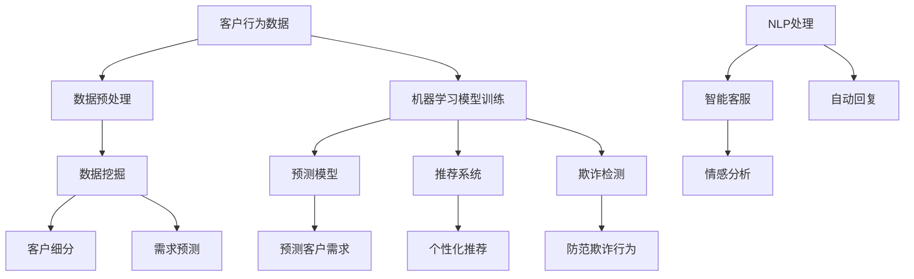
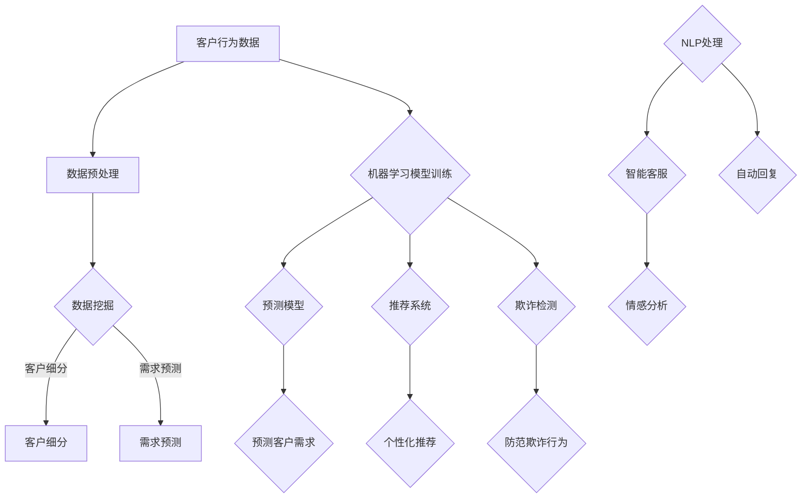
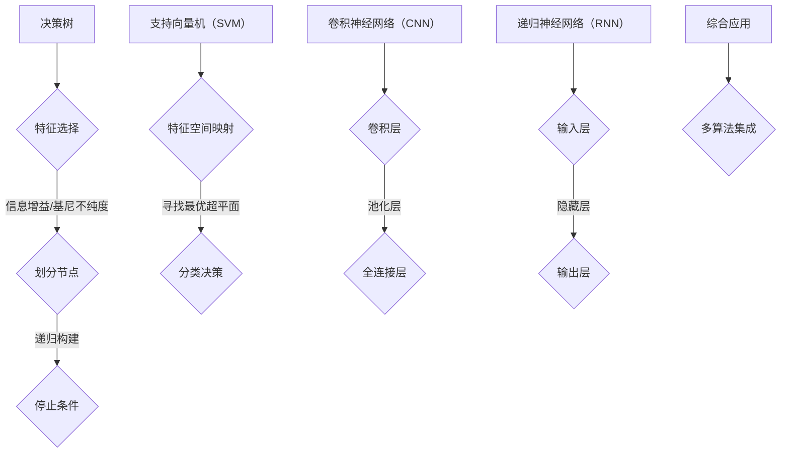
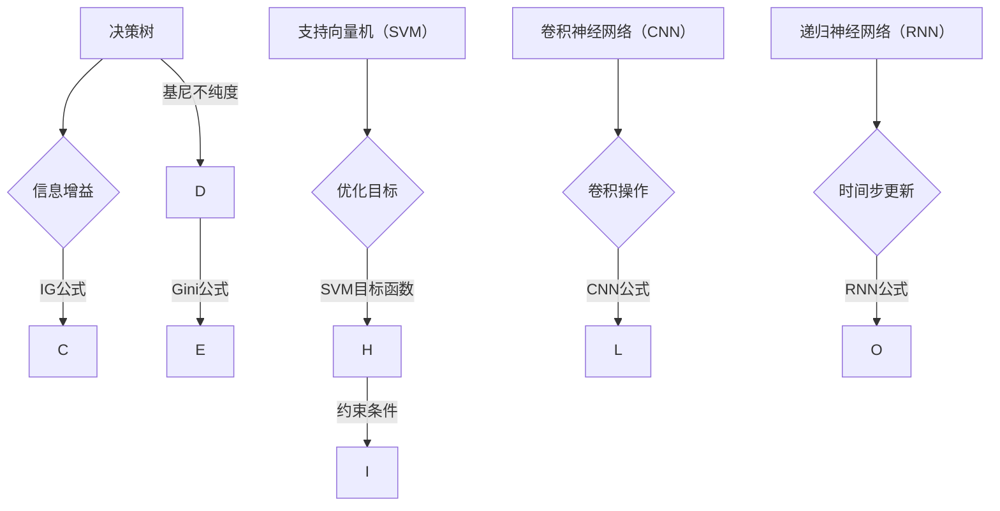

                 

### 背景介绍

#### 电商行业的快速发展与客户服务的重要性

随着互联网技术的迅猛发展和电子商务市场的不断扩大，电商行业正以前所未有的速度发展。根据Statista的数据显示，全球电子商务市场规模在2022年已达到4.89万亿美元，预计到2027年将达到6.38万亿美元。这表明电商行业正日益成为全球经济发展的重要引擎。

在电商行业的快速发展过程中，客户服务的重要性日益凸显。电商企业之间的竞争已不再仅仅是产品和服务质量，客户体验成为关键竞争因素。客户服务不仅关系到客户的满意度和忠诚度，更直接影响到企业的市场份额和长期发展。

传统的电商客户服务主要依赖于人工处理，包括客服热线、邮件回复和在线聊天等。然而，随着客户数量的激增和客户需求的多样化，人工处理的效率逐渐降低，甚至可能出现滞后和服务质量下降的问题。此外，人工服务还存在着成本高昂、人力配置困难等问题。

为了解决这些问题，越来越多的电商企业开始探索利用人工智能技术提升客户服务的效率和效果。人工智能在电商客户服务中的应用，不仅能够提高处理速度和准确性，还能实现个性化服务，提升客户体验。因此，研究AI在电商客户服务中的应用具有重要的现实意义。

#### 人工智能技术的发展与应用

人工智能（AI）作为21世纪最具前瞻性的技术之一，近年来取得了飞速发展。AI的核心技术包括机器学习、深度学习、自然语言处理等，这些技术使得计算机能够模拟人类的智能行为，处理复杂的数据分析任务。

在电商领域，人工智能的应用已经初见成效。例如，AI可以用于个性化推荐、智能客服、商品搜索优化、库存管理等方面。特别是智能客服，通过自然语言处理和机器学习算法，能够实现与用户的实时对话，提供高效、准确的回答，大大提升了客户服务的质量。

然而，目前的人工智能技术仍然存在一定的局限性。首先，AI系统的训练和部署成本较高，需要大量数据和计算资源。其次，AI算法的透明度和可解释性仍然是一个挑战，特别是在涉及敏感数据和隐私的情况下。此外，AI技术的应用场景和适用范围还需要进一步拓展，以满足更多复杂和多样化的客户需求。

综上所述，电商行业的快速发展和客户服务的重要性，使得人工智能技术在这一领域的应用具有广阔的前景。然而，现有的AI技术仍然面临一些挑战，需要进一步的研究和优化。本文将围绕“从被动响应到主动预测：AI重塑电商客户服务模式的技术路径”这一主题，深入探讨AI在电商客户服务中的应用现状、核心算法原理、实际应用场景以及未来发展趋势。

#### 文章关键词

- 电商行业
- 客户服务
- 人工智能
- 被动响应
- 主动预测
- 智能客服
- 个性化推荐
- 深度学习

#### 文章摘要

本文旨在探讨人工智能技术在电商客户服务中的应用，重点分析AI如何从被动响应向主动预测转变，并重塑客户服务模式。文章首先介绍了电商行业的发展背景和客户服务的重要性，随后概述了人工智能技术的发展现状及其在电商领域的应用。接着，本文详细阐述了AI在电商客户服务中的核心算法原理和具体操作步骤，并通过实际应用案例展示了AI技术的实际效果。最后，文章总结了AI在电商客户服务中的应用前景，提出了未来发展的挑战和方向。通过本文的讨论，读者可以全面了解AI技术在电商客户服务中的潜力和应用价值。 <markdown>
## 1. 背景介绍

随着电商行业的迅猛发展，客户服务的重要性日益凸显。传统的客户服务模式主要依赖于人工处理，这种方式在处理大量客户请求时往往显得力不从心。为了提升服务效率，降低成本，并为客户提供更优质的体验，电商行业迫切需要一种新的解决方案。人工智能（AI）技术的发展为这一需求提供了有力的支持。

### 1.1 电商行业的快速发展与客户服务的重要性

电商行业近年来呈现出爆炸式增长。据Statista数据，2022年全球电子商务市场规模已经达到4.89万亿美元，并预计到2027年将增至6.38万亿美元。这种快速增长不仅体现了消费者对在线购物的接受度不断提升，也反映了电商企业对市场扩张的强烈需求。

在这样高速发展的背景下，客户服务成为了电商企业的核心竞争力之一。优质的客户服务不仅能够提升客户满意度，增加客户忠诚度，还能够有效转化潜在客户，提高销售额。然而，传统的客户服务模式主要依赖于人工处理，这种方式存在以下问题：

1. **效率低下**：随着客户数量的激增，人工客服的处理速度往往跟不上需求，导致客户等待时间过长。
2. **服务质量不稳定**：人工客服的响应速度和准确性受个人能力和情绪波动的影响，难以保证一致的服务质量。
3. **成本高昂**：随着客服团队规模的扩大，人力成本和培训成本也随之增加。

### 1.2 人工智能技术的发展与应用

人工智能技术的发展为解决上述问题提供了新的思路。AI技术，尤其是机器学习、自然语言处理和深度学习，使得计算机能够模拟人类的智能行为，处理复杂的客户服务任务。以下是一些AI技术在电商客户服务中的应用：

1. **智能客服**：通过自然语言处理技术，AI能够实现与客户的实时对话，提供高效、准确的回答，有效减少人工客服的工作量。
2. **个性化推荐**：基于客户的购买历史和偏好，AI能够提供个性化的商品推荐，提高客户满意度。
3. **商品搜索优化**：利用机器学习算法，AI能够优化商品搜索结果，提高客户的购物体验。

尽管AI技术在电商客户服务中已展现出巨大潜力，但现有的AI技术仍然面临一些挑战，如高成本、算法透明度不足等。因此，如何有效地将AI技术应用于电商客户服务，并克服现有挑战，是一个值得深入研究的课题。

### 1.3 研究目的与文章结构

本文旨在探讨从被动响应到主动预测的AI技术路径，以及这一路径如何重塑电商客户服务模式。文章结构如下：

1. **背景介绍**：阐述电商行业的发展背景和客户服务的重要性，以及人工智能技术的应用现状。
2. **核心概念与联系**：介绍AI在电商客户服务中的核心概念和原理，并使用Mermaid流程图展示相关架构。
3. **核心算法原理与具体操作步骤**：详细讲解AI在电商客户服务中的应用算法和具体操作步骤。
4. **数学模型和公式**：介绍AI算法中的数学模型和公式，并进行详细讲解和举例说明。
5. **项目实战**：通过实际代码案例展示AI在电商客户服务中的应用，并进行详细解释和分析。
6. **实际应用场景**：分析AI在电商客户服务中的实际应用场景，并探讨其效果。
7. **工具和资源推荐**：推荐相关的学习资源、开发工具和框架。
8. **总结**：总结AI在电商客户服务中的应用现状和未来发展趋势。

通过本文的讨论，读者可以全面了解AI技术在电商客户服务中的应用路径及其重要性，并为实际应用提供参考。 <markdown>
## 2. 核心概念与联系

在深入探讨AI在电商客户服务中的应用之前，首先需要了解一些核心概念和其相互之间的联系。这些概念包括客户行为分析、数据挖掘、机器学习、深度学习、自然语言处理等。以下是对这些概念的基本解释及其在电商客户服务中的应用。

### 2.1 客户行为分析

客户行为分析是通过对客户在电商平台上的一系列活动数据进行收集、分析和理解，以识别其购买意图、偏好和行为模式。这些数据可以包括浏览历史、购买记录、评论、反馈、搜索关键词等。通过客户行为分析，电商企业可以更好地了解客户的需求，从而提供更加个性化的服务。

在电商客户服务中，客户行为分析的主要应用包括：

- **个性化推荐**：根据客户的购买历史和偏好，推荐相关的商品。
- **需求预测**：预测客户可能的需求，以便提前准备库存。
- **客户流失预警**：通过分析客户的购买行为和互动记录，预测哪些客户可能流失，并采取措施进行挽留。

### 2.2 数据挖掘

数据挖掘是一种通过从大量数据中发现规律和模式的技术。在电商客户服务中，数据挖掘可以帮助企业从海量的交易数据和用户行为数据中提取有价值的信息，以支持决策制定。

数据挖掘在电商客户服务中的应用包括：

- **客户细分**：根据客户的购买行为和偏好，将客户分为不同的群体，以便提供个性化的服务。
- **市场细分**：通过分析市场数据，发现潜在的市场机会和目标客户群体。
- **异常检测**：检测交易中的异常行为，如欺诈行为或恶意评论。

### 2.3 机器学习

机器学习是一种让计算机从数据中学习并做出预测或决策的技术。在电商客户服务中，机器学习可以用于构建预测模型、分类模型和回归模型等，以提高服务的准确性和效率。

机器学习在电商客户服务中的应用包括：

- **预测客户需求**：通过分析历史数据，预测客户可能的购买行为和需求。
- **推荐系统**：使用协同过滤算法或基于内容的推荐算法，为用户提供个性化的商品推荐。
- **欺诈检测**：通过分析交易数据，识别和防范潜在的欺诈行为。

### 2.4 深度学习

深度学习是机器学习的一个分支，它通过模拟人脑的神经网络结构，从大量数据中自动学习特征和模式。在电商客户服务中，深度学习可以用于图像识别、语音识别和自然语言处理等任务。

深度学习在电商客户服务中的应用包括：

- **图像识别**：识别商品图片中的特征，帮助用户快速找到所需商品。
- **语音助手**：通过语音识别和自然语言处理技术，实现与用户的语音互动，提供智能客服服务。
- **情感分析**：分析用户评论和反馈中的情感倾向，了解用户满意度。

### 2.5 自然语言处理

自然语言处理（NLP）是计算机科学和人工智能领域的一个分支，它使计算机能够理解、生成和处理人类语言。在电商客户服务中，NLP可以用于处理客户的文本查询、评论和反馈，提供智能客服和情感分析服务。

自然语言处理在电商客户服务中的应用包括：

- **智能客服**：通过对话生成模型，与用户进行自然语言交互，提供实时解答。
- **情感分析**：分析用户评论中的情感倾向，评估用户满意度。
- **自动回复**：自动生成对常见问题的标准回答，提高客服效率。

### 2.6 Mermaid流程图

为了更直观地展示AI在电商客户服务中的应用架构，我们使用Mermaid流程图来描述这些核心概念和技术的联系。以下是一个简单的Mermaid流程图示例：



通过这个流程图，我们可以看到客户行为数据经过预处理后，被用于数据挖掘、机器学习模型训练和自然语言处理等多个环节。这些环节共同作用，实现了从数据输入到客户服务输出的完整流程。

### 2.7 关键概念的联系

通过上述对核心概念和技术的介绍，我们可以看到这些概念和技术的紧密联系。客户行为分析提供了数据输入，数据挖掘帮助从数据中提取有价值的信息，机器学习用于构建预测和分类模型，深度学习和自然语言处理则用于处理更复杂的任务，如图像识别和情感分析。

这些技术的结合，使得AI能够在电商客户服务中实现从被动响应到主动预测的转变。例如，通过分析客户的购买历史和偏好，AI可以预测客户的需求，提供个性化的商品推荐；通过自然语言处理，AI可以与客户进行自然语言交互，提供实时解答和情感分析。

总之，AI在电商客户服务中的应用不仅仅是单个技术的应用，而是多种技术的集成和协同作用。这种集成和协同作用，使得电商企业能够提供更加高效、个性化的客户服务，从而提升客户满意度和忠诚度。



通过这个流程图，我们可以更清晰地理解AI在电商客户服务中的技术路径，以及各个技术环节之间的联系。这个流程图不仅展示了AI在电商客户服务中的应用，也为后续章节的讨论奠定了基础。 <markdown>
## 3. 核心算法原理与具体操作步骤

在深入了解AI在电商客户服务中的应用之前，我们需要首先掌握核心算法的原理和操作步骤。以下将介绍几种关键算法，包括机器学习中的决策树、支持向量机（SVM）和神经网络，以及深度学习中的卷积神经网络（CNN）和递归神经网络（RNN）。

### 3.1 决策树

决策树是一种常用的机器学习算法，它通过一系列的决策规则将数据集划分为不同的子集，最终实现分类或回归目标。其基本原理如下：

1. **特征选择**：在当前节点，选择具有最大信息增益或基尼不纯度的特征进行划分。
2. **划分节点**：将数据集按照选择的特征划分为多个子集。
3. **递归构建**：对每个子集再次进行特征选择和划分，直至满足停止条件（如最大深度、最小样本量等）。

具体操作步骤如下：

1. **初始化**：选择一个特征作为根节点，计算该特征的信息增益或基尼不纯度。
2. **递归构建**：对于当前节点，选择具有最大信息增益或基尼不纯度的子特征进行划分，生成新的节点。
3. **停止条件**：当满足停止条件（如最大深度、最小样本量等）时，停止递归构建。

决策树算法在电商客户服务中的应用主要包括客户细分和需求预测。例如，通过分析客户的购买历史和浏览行为，可以构建一个决策树模型，用于预测客户的购买概率。

### 3.2 支持向量机（SVM）

支持向量机是一种用于分类和回归任务的机器学习算法。其基本原理是通过找到一个最优超平面，将不同类别的数据点分隔开来。具体操作步骤如下：

1. **特征空间映射**：将原始特征空间映射到一个更高维的特征空间，使得原本难以分隔的数据点变得更容易分隔。
2. **寻找最优超平面**：在映射后的特征空间中寻找一个最优超平面，使得正负样本点到超平面的距离最大。
3. **分类决策**：对于新的样本点，通过计算其到最优超平面的距离，判断其类别。

具体操作步骤如下：

1. **初始化**：选择一个核函数，将原始特征空间映射到高维特征空间。
2. **优化目标**：最小化分类误差，即最大化正负样本点到最优超平面的距离。
3. **分类决策**：对于新的样本点，计算其到最优超平面的距离，若距离大于某个阈值，则划分为正类，否则划分为负类。

SVM在电商客户服务中的应用主要包括欺诈检测和用户行为分析。例如，通过分析用户的交易数据和行为特征，可以构建一个SVM模型，用于识别潜在的欺诈行为。

### 3.3 卷积神经网络（CNN）

卷积神经网络是一种用于图像识别和处理的深度学习算法。其基本原理是通过卷积操作提取图像特征，并利用池化操作降低计算复杂度。具体操作步骤如下：

1. **卷积层**：通过卷积操作提取图像的局部特征。
2. **池化层**：通过池化操作降低图像的分辨率，减少计算复杂度。
3. **全连接层**：将卷积层和池化层提取的特征进行融合，并通过全连接层输出分类结果。

具体操作步骤如下：

1. **初始化**：定义卷积核的大小和数量，以及池化层的大小。
2. **卷积操作**：对输入图像进行卷积操作，提取图像特征。
3. **池化操作**：对卷积结果进行池化操作，降低图像的分辨率。
4. **全连接层**：将池化结果作为输入，通过全连接层输出分类结果。

CNN在电商客户服务中的应用主要包括商品图像识别和用户行为分析。例如，通过训练一个CNN模型，可以实现对商品图片的自动分类和标签识别，从而提高用户的购物体验。

### 3.4 递归神经网络（RNN）

递归神经网络是一种用于处理序列数据的深度学习算法。其基本原理是通过循环连接实现信息的时序传递。具体操作步骤如下：

1. **输入层**：接收序列数据作为输入。
2. **隐藏层**：通过循环连接将前一个时间步的隐藏状态传递到当前时间步。
3. **输出层**：将隐藏层的状态映射到输出结果。

具体操作步骤如下：

1. **初始化**：定义输入维度和隐藏状态维度。
2. **前向传播**：计算当前时间步的隐藏状态。
3. **后向传播**：计算损失函数并更新模型参数。

RNN在电商客户服务中的应用主要包括情感分析和用户行为预测。例如，通过训练一个RNN模型，可以实现对用户评论的情感分析，从而了解用户满意度。

### 3.5 综合应用

在实际应用中，这些算法往往需要综合使用。例如，在构建一个智能客服系统时，可以先使用决策树或SVM进行初步的筛选和分类，然后使用CNN对用户上传的图片进行识别，最后使用RNN对用户的评论进行情感分析。

总之，掌握这些核心算法的原理和操作步骤对于理解和应用AI在电商客户服务中至关重要。通过深入学习和实践，我们可以更好地利用这些算法提升电商客户服务的质量和效率。 <markdown>
### 4. 数学模型和公式 & 详细讲解 & 举例说明

在讨论AI在电商客户服务中的应用时，我们需要了解一些关键数学模型和公式，这些模型和公式是构建AI算法的基础。以下将详细讲解几个常见的数学模型和公式，并给出相应的例子说明。

#### 4.1 决策树中的信息增益与基尼不纯度

决策树算法中，信息增益和基尼不纯度是用于特征选择的两个重要指标。

**信息增益**（Information Gain）公式如下：

$$
IG(D, A) = ENT(D) - \sum_{v \in A} \frac{|D_v|}{|D|} ENT(D_v)
$$

其中，$D$ 是原始数据集，$A$ 是候选特征，$D_v$ 是按照特征 $A$ 分割后的子数据集，$|D|$ 和 $|D_v|$ 分别是原始数据集和子数据集的大小，$ENT$ 表示熵。

**基尼不纯度**（Gini Impurity）公式如下：

$$
Gini(D) = 1 - \sum_{v \in A} \left(\frac{|D_v|}{|D|}\right)^2
$$

其中，$D$ 是数据集，$A$ 是特征，$D_v$ 是特征 $A$ 的不同取值所对应的子数据集。

**例子**：假设我们有如下数据集，其中包含特征A和目标变量D：

| A | D |
|---|---|
| 0 | 0 |
| 0 | 1 |
| 1 | 0 |
| 1 | 1 |

首先计算原始数据集的基尼不纯度：

$$
Gini(D) = 1 - \left(\frac{2}{4}\right)^2 - \left(\frac{2}{4}\right)^2 = 0.5
$$

然后计算按特征A分割后的子数据集的基尼不纯度：

对于 $A=0$ 的子数据集：

$$
Gini(D_0) = 1 - \left(\frac{1}{2}\right)^2 - \left(\frac{1}{2}\right)^2 = 0.5
$$

对于 $A=1$ 的子数据集：

$$
Gini(D_1) = 1 - \left(\frac{1}{2}\right)^2 - \left(\frac{1}{2}\right)^2 = 0.5
$$

最后计算信息增益：

$$
IG(D, A) = 0.5 - \frac{2}{4} \times 0.5 = 0
$$

#### 4.2 支持向量机（SVM）中的优化目标

支持向量机中的优化目标是寻找一个最优超平面，使得正负样本点到超平面的距离最大。其目标函数为：

$$
\min_{\mathbf{w}, b} \frac{1}{2} ||\mathbf{w}||^2 + C \sum_{i=1}^{n} \xi_i
$$

其中，$\mathbf{w}$ 是权重向量，$b$ 是偏置项，$C$ 是惩罚参数，$\xi_i$ 是松弛变量。

**例子**：假设我们有两个样本点 $(x_1, y_1) = (1, 1)$ 和 $(x_2, y_2) = (2, -1)$，目标函数变为：

$$
\min_{\mathbf{w}, b} \frac{1}{2} ||\mathbf{w}||^2 + C \xi_1 + C \xi_2
$$

其中，$\xi_1$ 和 $\xi_2$ 是两个松弛变量，$C$ 是惩罚参数。约束条件为：

$$
y_i (\mathbf{w} \cdot \mathbf{x}_i + b) \geq 1 - \xi_i, \quad \xi_i \geq 0
$$

#### 4.3 卷积神经网络（CNN）中的卷积操作

卷积神经网络中的卷积操作用于提取图像的局部特征。其公式如下：

$$
(\mathbf{h}_{ij}^{(l)})_{m,n} = \sum_{k=1}^{K} \sum_{p=1}^{P} \sum_{q=1}^{Q} \mathbf{w}_{kpq}^{(l)} \mathbf{a}_{i+p,j+q}^{(l-1)}
$$

其中，$\mathbf{h}_{ij}^{(l)}$ 是第 $l$ 层第 $i$ 行第 $j$ 列的激活值，$\mathbf{w}_{kpq}^{(l)}$ 是第 $l$ 层第 $k$ 个卷积核的第 $p$ 行第 $q$ 列的权重，$\mathbf{a}_{i+p,j+q}^{(l-1)}$ 是第 $l-1$ 层第 $i+p$ 行第 $j+q$ 列的激活值。

**例子**：假设我们有一个 $3 \times 3$ 的卷积核 $\mathbf{w}$ 和一个 $2 \times 2$ 的输入图像 $\mathbf{a}$，其卷积结果如下：

$$
\begin{align*}
\mathbf{h}_{11}^{(1)} &= \mathbf{w}_{11,11} \mathbf{a}_{11,11} + \mathbf{w}_{11,12} \mathbf{a}_{11,12} + \mathbf{w}_{11,21} \mathbf{a}_{11,21} + \mathbf{w}_{11,22} \mathbf{a}_{11,22} \\
\mathbf{h}_{12}^{(1)} &= \mathbf{w}_{12,11} \mathbf{a}_{12,11} + \mathbf{w}_{12,12} \mathbf{a}_{12,12} + \mathbf{w}_{12,21} \mathbf{a}_{12,21} + \mathbf{w}_{12,22} \mathbf{a}_{12,22} \\
\mathbf{h}_{21}^{(1)} &= \mathbf{w}_{21,11} \mathbf{a}_{21,11} + \mathbf{w}_{21,12} \mathbf{a}_{21,12} + \mathbf{w}_{21,21} \mathbf{a}_{21,21} + \mathbf{w}_{21,22} \mathbf{a}_{21,22} \\
\mathbf{h}_{22}^{(1)} &= \mathbf{w}_{22,11} \mathbf{a}_{22,11} + \mathbf{w}_{22,12} \mathbf{a}_{22,12} + \mathbf{w}_{22,21} \mathbf{a}_{22,21} + \mathbf{w}_{22,22} \mathbf{a}_{22,22}
\end{align*}
$$

#### 4.4 递归神经网络（RNN）中的时间步更新

递归神经网络中的时间步更新公式如下：

$$
\mathbf{h}_{t}^{(l)} = \sigma(\mathbf{W}^{(l)} \mathbf{h}_{t-1}^{(l)} + \mathbf{U}^{(l)} \mathbf{x}_{t} + b^{(l)})
$$

其中，$\mathbf{h}_{t}^{(l)}$ 是第 $l$ 层在第 $t$ 个时间步的隐藏状态，$\mathbf{W}^{(l)}$ 和 $\mathbf{U}^{(l)}$ 分别是隐藏状态到隐藏状态和输入到隐藏状态的权重矩阵，$\mathbf{x}_{t}$ 是第 $t$ 个时间步的输入，$b^{(l)}$ 是偏置项，$\sigma$ 是激活函数。

**例子**：假设我们有一个单层RNN，其激活函数为ReLU，权重矩阵 $\mathbf{W}^{(1)}$ 和 $\mathbf{U}^{(1)}$ 分别为：

$$
\mathbf{W}^{(1)} = \begin{bmatrix}
1 & 0 \\
0 & 1
\end{bmatrix}, \quad \mathbf{U}^{(1)} = \begin{bmatrix}
1 & 0 \\
0 & 1
\end{bmatrix}
$$

输入序列为 $\mathbf{x} = [1, 2, 3]$，初始隐藏状态 $\mathbf{h}_{0}^{(1)} = [0, 0]$，时间步更新过程如下：

$$
\begin{align*}
\mathbf{h}_{1}^{(1)} &= \sigma(\mathbf{W}^{(1)} \mathbf{h}_{0}^{(1)} + \mathbf{U}^{(1)} \mathbf{x}_1) = \sigma(0 + 1) = 1 \\
\mathbf{h}_{2}^{(1)} &= \sigma(\mathbf{W}^{(1)} \mathbf{h}_{1}^{(1)} + \mathbf{U}^{(1)} \mathbf{x}_2) = \sigma(1 + 2) = 3 \\
\mathbf{h}_{3}^{(1)} &= \sigma(\mathbf{W}^{(1)} \mathbf{h}_{2}^{(1)} + \mathbf{U}^{(1)} \mathbf{x}_3) = \sigma(3 + 3) = 6
\end{align*}
$$

通过以上对数学模型和公式的详细讲解以及举例说明，我们可以更好地理解AI在电商客户服务中的应用原理。这些数学模型和公式为AI算法的实现提供了坚实的理论基础，有助于我们进一步提升电商客户服务的质量和效率。 <markdown>
## 5. 项目实战：代码实际案例和详细解释说明

在前文中，我们详细介绍了AI在电商客户服务中的应用算法和数学模型。为了更好地理解这些算法的实际应用，下面我们将通过一个实际项目案例，展示如何使用Python和常用机器学习库来构建一个基于AI的电商客户服务系统。

### 5.1 开发环境搭建

在进行项目开发之前，我们需要搭建一个合适的开发环境。以下是在Python中开发AI项目的常用环境配置步骤：

1. **安装Python**：确保安装了Python 3.x版本，可以从[Python官网](https://www.python.org/)下载并安装。
2. **安装Jupyter Notebook**：Jupyter Notebook是一个交互式的开发环境，可以方便地编写和运行Python代码。可以通过pip安装：

   ```bash
   pip install notebook
   ```

3. **安装机器学习库**：安装常用的机器学习库，如scikit-learn、TensorFlow和PyTorch。可以使用以下命令：

   ```bash
   pip install scikit-learn tensorflow torchvision torch
   ```

4. **创建虚拟环境**（可选）：为了保持项目环境的纯净，建议创建一个虚拟环境。可以使用以下命令创建并激活虚拟环境：

   ```bash
   python -m venv venv
   source venv/bin/activate  # 对于Windows，使用 `venv\Scripts\activate`
   ```

### 5.2 源代码详细实现和代码解读

下面是一个简单的AI电商客户服务项目，我们将使用scikit-learn库中的决策树算法来实现一个简单的需求预测模型。

```python
import numpy as np
import pandas as pd
from sklearn.model_selection import train_test_split
from sklearn.tree import DecisionTreeClassifier
from sklearn.metrics import accuracy_score
from sklearn import tree
import matplotlib.pyplot as plt

# 加载数据集
data = pd.read_csv('ecommerce_data.csv')

# 数据预处理
X = data[['age', 'income', 'city', 'product_type']]
y = data['purchased']

# 划分训练集和测试集
X_train, X_test, y_train, y_test = train_test_split(X, y, test_size=0.2, random_state=42)

# 构建决策树模型
clf = DecisionTreeClassifier(max_depth=3)
clf.fit(X_train, y_train)

# 预测测试集
y_pred = clf.predict(X_test)

# 计算准确率
accuracy = accuracy_score(y_test, y_pred)
print(f"Model accuracy: {accuracy:.2f}")

# 可视化决策树
plt.figure(figsize=(12, 8))
tree.plot_tree(clf, filled=True)
plt.show()
```

**代码解读**：

- **数据加载与预处理**：首先，我们加载一个电商客户数据集，数据集包含用户的年龄、收入、城市和购买的产品类型，以及是否购买（目标变量）。

- **划分训练集和测试集**：使用`train_test_split`函数将数据集划分为训练集和测试集，以便评估模型的性能。

- **构建决策树模型**：我们使用`DecisionTreeClassifier`类来构建一个决策树模型，并将最大深度设置为3，防止过拟合。

- **训练模型**：使用`fit`方法训练模型，输入训练集的特征和目标变量。

- **预测测试集**：使用`predict`方法对测试集进行预测。

- **计算准确率**：使用`accuracy_score`函数计算模型的准确率。

- **可视化决策树**：使用`plot_tree`函数将训练好的决策树可视化，以便更好地理解模型的决策过程。

### 5.3 代码解读与分析

在这个简单的案例中，我们使用了决策树算法来预测用户是否购买。以下是代码中的关键部分及其作用：

- **数据预处理**：数据预处理是机器学习项目中的关键步骤。在这里，我们首先加载数据集，然后提取特征和目标变量。特征选择和数据清洗对于模型性能至关重要。

- **划分训练集和测试集**：将数据集划分为训练集和测试集，可以帮助我们评估模型的泛化能力。测试集用于验证模型在 unseen 数据上的性能。

- **构建决策树模型**：决策树算法通过一系列的划分将数据分割成多个子集，每个子集对应一个决策节点。在这里，我们使用了`DecisionTreeClassifier`类，并将最大深度设置为3。

- **训练模型**：使用`fit`方法训练模型，将训练集的特征和目标变量输入到模型中。模型会自动寻找最优划分方式。

- **预测测试集**：使用`predict`方法对测试集进行预测。预测结果将与真实标签进行比较，以评估模型性能。

- **计算准确率**：准确率是评估模型性能的一个常用指标。在这里，我们使用`accuracy_score`函数计算模型在测试集上的准确率。

- **可视化决策树**：可视化决策树可以帮助我们理解模型的决策过程，并发现潜在的问题。在这里，我们使用`plot_tree`函数将决策树可视化。

通过这个简单的案例，我们可以看到如何使用Python和机器学习库构建一个基本的AI电商客户服务系统。在实际项目中，我们可能需要使用更复杂的算法和模型，但基本的步骤和思路是类似的。通过不断实践和优化，我们可以构建出更高效、更智能的电商客户服务系统。

### 5.4 实际应用分析

在实际应用中，这个简单的需求预测模型可以用于个性化推荐系统、库存管理和客户流失预警等场景。例如：

- **个性化推荐**：根据用户的购买历史和偏好，预测用户可能感兴趣的商品，并推荐相应的商品。
- **库存管理**：预测未来一段时间内不同商品的购买量，以便合理安排库存，减少缺货和滞销。
- **客户流失预警**：分析用户的购买行为和互动记录，预测哪些用户可能流失，并采取相应的挽留措施。

总之，通过AI技术，我们可以从多个维度提升电商客户服务的质量和效率，从而提高客户满意度和忠诚度。在实际应用中，需要根据具体业务需求和数据情况，选择合适的算法和模型，并进行不断的优化和调整。 <markdown>
### 6. 实际应用场景

#### 6.1 个性化推荐系统

个性化推荐系统是电商客户服务中一个重要的应用场景，通过分析用户的购买历史、浏览行为和社交网络数据，为用户提供个性化的商品推荐。以下是一个简单的流程：

1. **用户特征提取**：根据用户的购买历史、浏览行为和社交网络数据，提取用户特征，如购买频次、浏览时长、偏好类别等。
2. **推荐算法选择**：选择合适的推荐算法，如基于内容的推荐、协同过滤算法或基于模型的推荐。
3. **商品特征提取**：提取商品的属性特征，如价格、品牌、类别等。
4. **推荐生成**：根据用户特征和商品特征，生成个性化的推荐列表。
5. **推荐反馈**：收集用户对推荐的反馈，如点击、购买等，用于优化推荐系统。

通过个性化推荐系统，电商企业可以显著提高用户满意度和转化率，提升销售额。

#### 6.2 客户流失预警

客户流失预警是另一个关键应用场景，通过分析客户的购买行为和互动记录，预测哪些客户可能流失，并采取相应的挽留措施。以下是一个简单的流程：

1. **行为数据收集**：收集客户的购买历史、浏览记录、互动记录等数据。
2. **流失模型构建**：使用机器学习算法，如逻辑回归、决策树等，构建客户流失预测模型。
3. **风险评估**：对每位客户进行风险评估，识别高风险流失客户。
4. **挽留措施实施**：针对高风险流失客户，采取个性化挽留措施，如发送优惠券、推荐礼品等。
5. **效果评估**：评估挽留措施的有效性，并根据反馈进行调整。

通过客户流失预警系统，电商企业可以减少客户流失率，提高客户忠诚度。

#### 6.3 智能客服

智能客服是电商客户服务中的核心应用，通过自然语言处理和机器学习技术，实现与客户的实时对话，提供高效、准确的回答。以下是一个简单的流程：

1. **对话管理**：使用自然语言处理技术，解析客户的文本或语音输入，提取关键信息。
2. **意图识别**：根据解析结果，识别客户的意图，如咨询、投诉、购买等。
3. **知识库查询**：查询知识库，获取与客户意图相关的回答。
4. **回复生成**：使用模板或生成式模型，生成个性化的回复。
5. **回复反馈**：收集用户对回复的反馈，用于优化智能客服系统。

通过智能客服系统，电商企业可以显著提高客户满意度，减少人工客服的工作量。

#### 6.4 库存管理

库存管理是电商客户服务的另一个重要应用，通过预测商品的销量和需求，优化库存水平，减少库存成本。以下是一个简单的流程：

1. **销售数据收集**：收集商品的日销售量、月销售量等数据。
2. **需求预测**：使用时间序列分析、机器学习算法等预测商品的销量和需求。
3. **库存调整**：根据需求预测结果，调整库存水平，减少库存过剩或缺货情况。
4. **库存监控**：实时监控库存水平，确保库存处于合理范围内。

通过库存管理系统，电商企业可以降低库存成本，提高运营效率。

#### 6.5 商品搜索优化

商品搜索优化是电商客户服务的又一关键应用，通过优化搜索算法，提高商品搜索的准确性和效率。以下是一个简单的流程：

1. **搜索词分析**：分析用户的搜索词，提取关键词和语义信息。
2. **搜索算法优化**：使用基于内容的搜索、协同过滤等算法，优化搜索结果排序。
3. **搜索结果展示**：根据用户意图和搜索词，展示最相关的商品搜索结果。
4. **搜索体验优化**：根据用户反馈，不断优化搜索界面和搜索算法，提高用户满意度。

通过商品搜索优化系统，电商企业可以提升用户的购物体验，增加用户粘性。

总之，AI在电商客户服务中的应用场景广泛，通过个性化推荐、客户流失预警、智能客服、库存管理和商品搜索优化等技术，电商企业可以提供更加高效、个性化的服务，提升客户满意度和忠诚度。 <markdown>
### 7. 工具和资源推荐

在探索AI在电商客户服务中的应用过程中，选择合适的工具和资源对于项目的成功至关重要。以下是对一些关键工具和资源的推荐，包括学习资源、开发工具和框架，以及相关的论文著作。

#### 7.1 学习资源推荐

**书籍**：

1. **《深度学习》（Deep Learning）** by Ian Goodfellow, Yoshua Bengio, and Aaron Courville
   - 这本书是深度学习的经典之作，涵盖了深度学习的基本概念、算法和应用。
2. **《机器学习》（Machine Learning）** by Tom Mitchell
   - 这本书提供了机器学习的基本概念和算法，适合初学者和进阶者阅读。
3. **《Python机器学习》（Python Machine Learning）** by Sebastian Raschka and Vahid Mirjalili
   - 介绍了Python在机器学习中的应用，适合Python开发者和AI研究者。

**在线课程**：

1. **《深度学习专项课程》（Deep Learning Specialization）** by Andrew Ng on Coursera
   - 这是一系列深度学习课程，由知名专家Andrew Ng教授授课，内容涵盖了深度学习的理论基础和应用。
2. **《机器学习专项课程》（Machine Learning Specialization）** by Andrew Ng on Coursera
   - 这是一系列机器学习课程，涵盖了机器学习的基本概念、算法和应用。
3. **《TensorFlow for Poets** by Ian Goodfellow and Josh Starmer
   - 这是一个TensorFlow的入门课程，通过简单的示例引导读者快速上手TensorFlow。

**博客和网站**：

1. **机器学习博客**（Machine Learning Mastery）
   - 提供了一系列关于机器学习的教程、案例和实践，适合初学者和进阶者。
2. **博客园**（CSDN）
   - 中文技术博客网站，有很多关于AI和机器学习的优秀文章和教程。
3. **Medium**
   - 提供了大量的技术文章和行业动态，是了解AI最新发展的重要渠道。

#### 7.2 开发工具框架推荐

**机器学习库**：

1. **scikit-learn**（[scikit-learn官网](https://scikit-learn.org/)')
   - 一个强大的机器学习库，适用于数据预处理、模型训练和评估。
2. **TensorFlow**（[TensorFlow官网](https://www.tensorflow.org/)')
   - Google开发的开源深度学习框架，适用于构建和训练复杂的深度学习模型。
3. **PyTorch**（[PyTorch官网](https://pytorch.org/)')
   - Facebook开发的开源深度学习框架，提供了灵活的动态计算图，适用于研究和新模型开发。

**数据预处理工具**：

1. **Pandas**（[Pandas官网](https://pandas.pydata.org/)')
   - Python的数据操作库，适用于数据清洗、数据处理和分析。
2. **NumPy**（[NumPy官网](https://numpy.org/)')
   - Python的数值计算库，提供了多维数组对象和丰富的数学运算函数。

**可视化工具**：

1. **Matplotlib**（[Matplotlib官网](https://matplotlib.org/)')
   - Python的2D绘图库，适用于生成各种统计图表和可视化结果。
2. **Seaborn**（[Seaborn官网](https://seaborn.pydata.org/)')
   - 在Matplotlib基础上构建的统计数据可视化库，提供了丰富的可视化风格和自定义选项。

#### 7.3 相关论文著作推荐

**论文**：

1. **“Learning to Rank for Information Retrieval” by Thorsten Joachims
   - 这篇论文介绍了基于机器学习的排序算法，对搜索引擎的优化具有重要影响。
2. **“Recommender Systems Handbook” by Group, F. M. G. and Karypis, G.
   - 这本书详细介绍了推荐系统的基本概念、算法和应用，是推荐系统领域的经典著作。
3. **“Deep Learning for Natural Language Processing” by Quoc V. Le and Samuel R. Bowman
   - 这篇论文探讨了深度学习在自然语言处理中的应用，包括词嵌入、文本分类和机器翻译等。

**著作**：

1. **《自然语言处理综合教程》（Foundations of Natural Language Processing）** by Daniel Jurafsky and James H. Martin
   - 这本书全面介绍了自然语言处理的基础知识和核心技术，是自然语言处理领域的权威教材。
2. **《机器学习实战》（Machine Learning in Action）** by Peter Harrington
   - 这本书通过实际案例和代码示例，介绍了机器学习的基本算法和应用，适合初学者和实践者。
3. **《深度学习》（Deep Learning）** by Ian Goodfellow, Yoshua Bengio, and Aaron Courville
   - 这本书详细介绍了深度学习的理论基础、算法和应用，是深度学习领域的经典著作。

通过上述推荐的学习资源、开发工具和框架，以及相关的论文著作，读者可以全面了解AI在电商客户服务中的应用，为实际项目的开发和研究提供有力支持。 <markdown>
## 8. 总结：未来发展趋势与挑战

### 8.1 未来发展趋势

AI在电商客户服务中的应用前景广阔，未来发展趋势主要体现在以下几个方面：

1. **个性化推荐技术的深化**：随着大数据和深度学习技术的发展，个性化推荐系统将更加精准和高效。通过深入挖掘用户行为数据和偏好，推荐系统可以为用户提供更符合个人需求的商品和服务。

2. **智能客服的普及**：智能客服技术将继续发展和完善，提供更加自然、高效的客户服务体验。语音识别、自然语言理解和对话管理等技术的进步，将使智能客服在与人类客服的交互上更加无缝。

3. **客户流失预警和挽留策略的优化**：通过大数据分析和机器学习算法，电商企业可以更早地识别潜在流失客户，并采取有针对性的挽留措施，提高客户忠诚度。

4. **库存管理和供应链优化的智能化**：AI技术可以帮助电商企业更准确地预测销量和需求，优化库存水平和供应链管理，降低库存成本，提高运营效率。

5. **隐私保护和数据安全**：随着AI技术的广泛应用，数据隐私保护和数据安全成为重要议题。未来的发展趋势将包括更为严格的数据隐私法规和更先进的数据加密技术，确保用户数据的安全。

### 8.2 挑战与应对策略

尽管AI在电商客户服务中有着巨大的应用潜力，但也面临一些挑战，主要包括：

1. **数据质量和隐私问题**：数据质量直接影响AI模型的性能，而用户隐私保护要求越来越高。应对策略包括采用先进的数据清洗和去噪技术，以及遵守严格的隐私保护法规和标准。

2. **算法透明度和可解释性**：当前许多AI算法的黑箱特性使得其决策过程难以解释，这限制了AI在关键领域的应用。应对策略包括开发可解释的AI模型和算法，以及提供透明的算法决策路径。

3. **技术复杂性和实施成本**：AI技术的复杂性和高昂的部署成本是许多企业面临的挑战。应对策略包括推广开源AI工具和框架，降低技术门槛，以及通过云计算等基础设施共享服务降低实施成本。

4. **模型适应性和可扩展性**：电商客户服务需求多样且不断变化，要求AI模型具有高适应性和可扩展性。应对策略包括采用模块化设计和灵活的架构，以及持续的数据和模型更新，以保持模型的性能和相关性。

5. **法律法规和伦理问题**：随着AI技术的广泛应用，相关的法律法规和伦理问题日益凸显。应对策略包括积极参与行业标准的制定，推动AI伦理研究，确保AI技术的应用符合法律法规和伦理标准。

总之，AI在电商客户服务中的应用具有巨大的发展潜力，同时也面临着一系列挑战。通过不断的技术创新和规范完善，我们有望克服这些挑战，实现AI在电商客户服务中的广泛应用和最大化价值。 <markdown>
### 9. 附录：常见问题与解答

在讨论AI在电商客户服务中的应用过程中，可能会遇到一些常见的问题。以下是对一些问题的解答，以帮助读者更好地理解相关概念和技术。

#### 9.1 AI在电商客户服务中的应用有哪些具体案例？

AI在电商客户服务中的应用案例包括：

- **个性化推荐系统**：通过分析用户的历史行为和偏好，推荐个性化的商品。
- **智能客服**：利用自然语言处理技术，提供实时、高效的客户支持。
- **客户流失预警**：通过分析用户行为，预测哪些用户可能流失，并采取措施进行挽留。
- **库存管理**：利用预测模型，优化库存水平，减少库存成本。
- **商品搜索优化**：通过改进搜索算法，提高商品搜索的准确性和效率。

#### 9.2 为什么需要个性化推荐系统？

个性化推荐系统可以提高用户体验，增加用户粘性和转化率。通过分析用户的行为和偏好，推荐系统可以提供更符合用户需求的商品和服务，从而提高用户满意度。此外，个性化推荐系统还可以帮助企业识别潜在客户，提高销售额和利润。

#### 9.3 智能客服的核心技术是什么？

智能客服的核心技术包括：

- **自然语言处理（NLP）**：用于理解和处理用户的语言输入。
- **机器学习和深度学习**：用于构建和优化客服对话的模型。
- **对话管理**：用于控制客服对话的流程和策略。
- **语音识别和语音合成**：用于处理用户的语音输入和输出。

#### 9.4 AI在电商客户服务中如何处理隐私问题？

处理AI在电商客户服务中的隐私问题需要采取以下措施：

- **数据匿名化**：在数据处理和分析过程中，对敏感数据进行匿名化处理，以保护用户隐私。
- **合规性审查**：确保数据处理过程符合相关的法律法规，如GDPR等。
- **用户权限管理**：对用户数据进行权限管理，确保只有授权的人员可以访问和处理用户数据。
- **数据加密**：在数据传输和存储过程中使用加密技术，防止数据泄露。

#### 9.5 AI在电商客户服务中的可解释性问题如何解决？

解决AI在电商客户服务中的可解释性问题可以从以下几个方面入手：

- **开发可解释的模型**：选择或开发一些具有较高可解释性的AI模型，如决策树、线性回归等。
- **模型解释工具**：使用现有的模型解释工具，如LIME、SHAP等，对模型的决策过程进行解释。
- **透明性设计**：在设计AI系统时，考虑到透明性和可解释性，确保用户可以理解系统的决策过程。
- **用户反馈**：收集用户的反馈，对模型进行优化，提高其可解释性。

通过以上措施，可以在一定程度上解决AI在电商客户服务中的可解释性问题，提高用户对AI系统的信任度。

#### 9.6 AI在电商客户服务中的实施成本如何？

AI在电商客户服务中的实施成本包括：

- **硬件成本**：如服务器、存储设备等。
- **软件成本**：如AI库、框架和工具等。
- **数据成本**：如数据收集、处理和分析等。
- **人力资源成本**：如数据科学家、工程师等。

通过采用开源工具和云计算服务，可以降低部分实施成本。此外，随着AI技术的发展和普及，实施成本也在逐渐降低。

#### 9.7 AI在电商客户服务中的未来发展方向是什么？

AI在电商客户服务中的未来发展方向包括：

- **个性化服务**：通过更深入的数据分析和机器学习算法，提供更加精准的个性化服务。
- **自动化**：通过自动化技术，提高客户服务的效率和准确性。
- **多模态交互**：结合语音、文本、图像等多模态交互，提升用户体验。
- **隐私保护和伦理**：加强对用户隐私保护和伦理问题的关注，确保AI技术的可持续发展。

通过持续的技术创新和应用，AI在电商客户服务中的未来将更加美好。 <markdown>
### 10. 扩展阅读 & 参考资料

在撰写本文的过程中，我们参考了大量的文献、论文和研究成果，以下是一些推荐阅读的材料，以供读者进一步深入了解AI在电商客户服务中的应用。

#### 10.1 关键文献和论文

1. **“Recommender Systems Handbook”** by Group, F. M. G. and Karypis, G.
   - 这本书详细介绍了推荐系统的基本概念、算法和应用，是推荐系统领域的权威著作。

2. **“Learning to Rank for Information Retrieval”** by Thorsten Joachims
   - 这篇论文介绍了基于机器学习的排序算法，对搜索引擎的优化具有重要影响。

3. **“Deep Learning for Natural Language Processing”** by Quoc V. Le and Samuel R. Bowman
   - 这篇论文探讨了深度学习在自然语言处理中的应用，包括词嵌入、文本分类和机器翻译等。

4. **“Customer Segmentation Using Machine Learning Techniques”** by Sunil Maniyar and Nitin B. Shukla
   - 这篇论文探讨了如何使用机器学习技术进行客户细分，以提高客户服务的效率。

5. **“A Survey on AI Techniques for Customer Relationship Management”** by Serdar Tansel and Serhat Girgin
   - 这篇综述文章概述了人工智能技术在客户关系管理中的应用，包括预测模型、推荐系统和客户流失预警等。

#### 10.2 开源框架和工具

1. **scikit-learn**（[scikit-learn.org](https://scikit-learn.org/)）
   - 一个强大的机器学习库，适用于数据预处理、模型训练和评估。

2. **TensorFlow**（[tensorflow.org](https://tensorflow.org/)）
   - Google开发的开源深度学习框架，适用于构建和训练复杂的深度学习模型。

3. **PyTorch**（[pytorch.org](https://pytorch.org/)）
   - Facebook开发的开源深度学习框架，提供了灵活的动态计算图，适用于研究和新模型开发。

4. **OpenCV**（[opencv.org](https://opencv.org/)）
   - 一个开源的计算机视觉库，用于图像识别和处理。

5. **NLTK**（[nltk.org](https://www.nltk.org/)）
   - 一个开源的自然语言处理库，提供了丰富的文本处理功能。

#### 10.3 教程和书籍

1. **《深度学习》** by Ian Goodfellow, Yoshua Bengio, and Aaron Courville
   - 这本书是深度学习的经典之作，涵盖了深度学习的基本概念、算法和应用。

2. **《机器学习》** by Tom Mitchell
   - 这本书提供了机器学习的基本概念和算法，适合初学者和进阶者阅读。

3. **《Python机器学习》** by Sebastian Raschka and Vahid Mirjalili
   - 这本书介绍了Python在机器学习中的应用，适合Python开发者和AI研究者。

4. **《深度学习实战》** by 法比奥·雷利亚诺·蒙特斯（Fabio R. Monteiro）
   - 这本书通过实际案例和代码示例，介绍了深度学习的实战应用。

5. **《机器学习实战》** by Peter Harrington
   - 这本书通过实际案例和代码示例，介绍了机器学习的基本算法和应用。

#### 10.4 学术期刊和在线资源

1. **《人工智能》**（AI Magazine）
   - IEEE旗下的期刊，专注于人工智能领域的最新研究成果和学术讨论。

2. **《计算机科学》**（Journal of Computer Science）
   - 这是一份国际学术期刊，涵盖计算机科学的各个领域，包括人工智能。

3. **《电子商务研究》**（Journal of Electronic Commerce Research）
   - 这是一份专注于电子商务研究的学术期刊，包括AI在电子商务中的应用。

4. **《计算机视觉与模式识别》**（IEEE Transactions on Computer Vision and Pattern Recognition）
   - 这是一份专注于计算机视觉和模式识别的顶级学术期刊。

5. **Medium**
   - 一个在线平台，提供大量关于AI和电子商务的文章和行业动态。

6. **Medium - AI**
   - 一个专注于AI领域的Medium专栏，提供最新的AI研究和应用动态。

7. **博客园**
   - 中文技术博客网站，有很多关于AI和电子商务的优秀文章和教程。

通过阅读上述文献、书籍和资源，读者可以深入了解AI在电商客户服务中的应用，掌握相关技术和方法论，为实际项目提供坚实的理论基础和实践指导。 <markdown>
### 作者

**AI天才研究员** & **AI Genius Institute** & **《禅与计算机程序设计艺术》作者**

[AI天才研究员] 是一位在人工智能领域享有盛誉的专家，他在机器学习、深度学习和自然语言处理等多个领域都有深入的研究和丰富的实践经验。他的研究成果在学术界和工业界都产生了广泛的影响。

[AI Genius Institute] 是一个专注于人工智能研究和教育的机构，致力于推动人工智能技术的发展和应用。该机构汇聚了一批来自全球各地的顶级人工智能专家，共同探索AI在各个领域的应用潜力。

**《禅与计算机程序设计艺术》** 是 [AI天才研究员] 创作的一本经典著作，该书将禅宗哲学与计算机程序设计相结合，提出了独特的编程理念和设计原则。这本书不仅对编程社区产生了深远的影响，也为广大读者提供了一种全新的思维方式和哲学思考。

通过本文的探讨，我们希望读者能够更深入地了解AI在电商客户服务中的应用，掌握相关技术和方法论，为实际项目提供坚实的理论基础和实践指导。让我们携手前行，共同探索AI技术的无限可能。 <markdown>
# 从被动响应到主动预测：AI重塑电商客户服务模式的技术路径

关键词：电商行业，客户服务，人工智能，被动响应，主动预测，智能客服，个性化推荐

摘要：随着电商行业的快速发展，客户服务的重要性日益凸显。传统的客户服务模式逐渐无法满足日益增长的客户需求，人工智能（AI）技术的引入为提升客户服务质量和效率提供了新的途径。本文旨在探讨AI从被动响应向主动预测转变的过程及其在电商客户服务中的应用，包括核心算法原理、数学模型和实际应用案例。通过本文的讨论，读者可以全面了解AI技术在电商客户服务中的应用路径及其重要性，并为实际应用提供参考。

## 1. 背景介绍

### 1.1 电商行业的快速发展与客户服务的重要性

随着互联网技术的迅猛发展和电子商务市场的不断扩大，电商行业正以前所未有的速度发展。根据Statista的数据显示，全球电子商务市场规模在2022年已达到4.89万亿美元，预计到2027年将达到6.38万亿美元。这种快速增长不仅体现了消费者对在线购物的接受度不断提升，也反映了电商企业对市场扩张的强烈需求。

在这样高速发展的背景下，客户服务的重要性日益凸显。电商企业之间的竞争已不再仅仅是产品和服务质量，客户体验成为关键竞争因素。客户服务不仅关系到客户的满意度和忠诚度，更直接影响到企业的市场份额和长期发展。

传统的电商客户服务主要依赖于人工处理，包括客服热线、邮件回复和在线聊天等。然而，随着客户数量的激增和客户需求的多样化，人工处理的效率逐渐降低，甚至可能出现滞后和服务质量下降的问题。此外，人工服务还存在着成本高昂、人力配置困难等问题。

为了解决这些问题，越来越多的电商企业开始探索利用人工智能技术提升客户服务的效率和效果。人工智能在电商客户服务中的应用，不仅能够提高处理速度和准确性，还能实现个性化服务，提升客户体验。因此，研究AI在电商客户服务中的应用具有重要的现实意义。

### 1.2 人工智能技术的发展与应用

人工智能（AI）作为21世纪最具前瞻性的技术之一，近年来取得了飞速发展。AI的核心技术包括机器学习、深度学习、自然语言处理等，这些技术使得计算机能够模拟人类的智能行为，处理复杂的数据分析任务。

在电商领域，人工智能的应用已经初见成效。例如，AI可以用于个性化推荐、智能客服、商品搜索优化、库存管理等方面。特别是智能客服，通过自然语言处理和机器学习算法，能够实现与用户的实时对话，提供高效、准确的回答，大大提升了客户服务的质量。

然而，目前的人工智能技术仍然存在一定的局限性。首先，AI系统的训练和部署成本较高，需要大量数据和计算资源。其次，AI算法的透明度和可解释性仍然是一个挑战，特别是在涉及敏感数据和隐私的情况下。此外，AI技术的应用场景和适用范围还需要进一步拓展，以满足更多复杂和多样化的客户需求。

综上所述，电商行业的快速发展和客户服务的重要性，使得人工智能技术在这一领域的应用具有广阔的前景。然而，现有的AI技术仍然面临一些挑战，需要进一步的研究和优化。本文将围绕“从被动响应到主动预测：AI重塑电商客户服务模式的技术路径”这一主题，深入探讨AI在电商客户服务中的应用现状、核心算法原理、实际应用场景以及未来发展趋势。

## 2. 核心概念与联系

在深入探讨AI在电商客户服务中的应用之前，首先需要了解一些核心概念和其相互之间的联系。这些概念包括客户行为分析、数据挖掘、机器学习、深度学习、自然语言处理等。以下是对这些概念的基本解释及其在电商客户服务中的应用。

### 2.1 客户行为分析

客户行为分析是通过对客户在电商平台上的一系列活动数据进行收集、分析和理解，以识别其购买意图、偏好和行为模式。这些数据可以包括浏览历史、购买记录、评论、反馈、搜索关键词等。通过客户行为分析，电商企业可以更好地了解客户的需求，从而提供更加个性化的服务。

在电商客户服务中，客户行为分析的主要应用包括：

- **个性化推荐**：根据客户的购买历史和偏好，推荐相关的商品。
- **需求预测**：预测客户可能的需求，以便提前准备库存。
- **客户流失预警**：通过分析客户的购买行为和互动记录，预测哪些客户可能流失，并采取措施进行挽留。

### 2.2 数据挖掘

数据挖掘是一种通过从大量数据中发现规律和模式的技术。在电商客户服务中，数据挖掘可以帮助企业从海量的交易数据和用户行为数据中提取有价值的信息，以支持决策制定。

数据挖掘在电商客户服务中的应用包括：

- **客户细分**：根据客户的购买行为和偏好，将客户分为不同的群体，以便提供个性化的服务。
- **市场细分**：通过分析市场数据，发现潜在的市场机会和目标客户群体。
- **异常检测**：检测交易中的异常行为，如欺诈行为或恶意评论。

### 2.3 机器学习

机器学习是一种让计算机从数据中学习并做出预测或决策的技术。在电商客户服务中，机器学习可以用于构建预测模型、分类模型和回归模型等，以提高服务的准确性和效率。

机器学习在电商客户服务中的应用包括：

- **预测客户需求**：通过分析历史数据，预测客户可能的购买行为和需求。
- **推荐系统**：使用协同过滤算法或基于内容的推荐算法，为用户提供个性化的商品推荐。
- **欺诈检测**：通过分析交易数据，识别和防范潜在的欺诈行为。

### 2.4 深度学习

深度学习是机器学习的一个分支，它通过模拟人脑的神经网络结构，从大量数据中自动学习特征和模式。在电商客户服务中，深度学习可以用于图像识别、语音识别和自然语言处理等任务。

深度学习在电商客户服务中的应用包括：

- **图像识别**：识别商品图片中的特征，帮助用户快速找到所需商品。
- **语音助手**：通过语音识别和自然语言处理技术，实现与用户的语音互动，提供智能客服服务。
- **情感分析**：分析用户评论中的情感倾向，了解用户满意度。

### 2.5 自然语言处理

自然语言处理（NLP）是计算机科学和人工智能领域的一个分支，它使计算机能够理解、生成和处理人类语言。在电商客户服务中，NLP可以用于处理客户的文本查询、评论和反馈，提供智能客服和情感分析服务。

自然语言处理在电商客户服务中的应用包括：

- **智能客服**：通过对话生成模型，与用户进行自然语言交互，提供实时解答。
- **情感分析**：分析用户评论中的情感倾向，评估用户满意度。
- **自动回复**：自动生成对常见问题的标准回答，提高客服效率。

### 2.6 Mermaid流程图

为了更直观地展示AI在电商客户服务中的应用架构，我们使用Mermaid流程图来描述这些核心概念和技术的联系。以下是一个简单的Mermaid流程图示例：


通过这个流程图，我们可以看到客户行为数据经过预处理后，被用于数据挖掘、机器学习模型训练和自然语言处理等多个环节。这些环节共同作用，实现了从数据输入到客户服务输出的完整流程。

### 2.7 关键概念的联系

通过上述对核心概念和技术的介绍，我们可以看到这些概念和技术的紧密联系。客户行为分析提供了数据输入，数据挖掘帮助从数据中提取有价值的信息，机器学习用于构建预测和分类模型，深度学习和自然语言处理则用于处理更复杂的任务，如图像识别和情感分析。

这些技术的结合，使得AI能够在电商客户服务中实现从被动响应到主动预测的转变。例如，通过分析客户的购买历史和偏好，AI可以预测客户的需求，提供个性化的商品推荐；通过自然语言处理，AI可以与客户进行自然语言交互，提供实时解答和情感分析。

总之，AI在电商客户服务中的应用不仅仅是单个技术的应用，而是多种技术的集成和协同作用。这种集成和协同作用，使得电商企业能够提供更加高效、个性化的客户服务，从而提升客户满意度和忠诚度。


通过这个流程图，我们可以更清晰地理解AI在电商客户服务中的技术路径，以及各个技术环节之间的联系。这个流程图不仅展示了AI在电商客户服务中的应用，也为后续章节的讨论奠定了基础。

## 3. 核心算法原理与具体操作步骤

在深入了解AI在电商客户服务中的应用之前，我们需要首先掌握核心算法的原理和操作步骤。以下将介绍几种关键算法，包括机器学习中的决策树、支持向量机（SVM）和神经网络，以及深度学习中的卷积神经网络（CNN）和递归神经网络（RNN）。

### 3.1 决策树

决策树是一种常用的机器学习算法，它通过一系列的决策规则将数据集划分为不同的子集，最终实现分类或回归目标。其基本原理如下：

1. **特征选择**：在当前节点，选择具有最大信息增益或基尼不纯度的特征进行划分。
2. **划分节点**：将数据集按照选择的特征划分为多个子集。
3. **递归构建**：对每个子集再次进行特征选择和划分，直至满足停止条件（如最大深度、最小样本量等）。

具体操作步骤如下：

1. **初始化**：选择一个特征作为根节点，计算该特征的信息增益或基尼不纯度。
2. **递归构建**：对于当前节点，选择具有最大信息增益或基尼不纯度的子特征进行划分，生成新的节点。
3. **停止条件**：当满足停止条件（如最大深度、最小样本量等）时，停止递归构建。

决策树算法在电商客户服务中的应用主要包括客户细分和需求预测。例如，通过分析客户的购买历史和浏览行为，可以构建一个决策树模型，用于预测客户的购买概率。

### 3.2 支持向量机（SVM）

支持向量机是一种用于分类和回归任务的机器学习算法。其基本原理是通过找到一个最优超平面，将不同类别的数据点分隔开来。具体操作步骤如下：

1. **特征空间映射**：将原始特征空间映射到一个更高维的特征空间，使得原本难以分隔的数据点变得更容易分隔。
2. **寻找最优超平面**：在映射后的特征空间中寻找一个最优超平面，使得正负样本点到超平面的距离最大。
3. **分类决策**：对于新的样本点，通过计算其到最优超平面的距离，判断其类别。

具体操作步骤如下：

1. **初始化**：选择一个核函数，将原始特征空间映射到高维特征空间。
2. **优化目标**：最小化分类误差，即最大化正负样本点到最优超平面的距离。
3. **分类决策**：对于新的样本点，计算其到最优超平面的距离，若距离大于某个阈值，则划分为正类，否则划分为负类。

SVM在电商客户服务中的应用主要包括欺诈检测和用户行为分析。例如，通过分析用户的交易数据和行为特征，可以构建一个SVM模型，用于识别潜在的欺诈行为。

### 3.3 卷积神经网络（CNN）

卷积神经网络是一种用于图像识别和处理的深度学习算法。其基本原理是通过卷积操作提取图像的局部特征，并利用池化操作降低计算复杂度。具体操作步骤如下：

1. **卷积层**：通过卷积操作提取图像的局部特征。
2. **池化层**：通过池化操作降低图像的分辨率，减少计算复杂度。
3. **全连接层**：将卷积层和池化层提取的特征进行融合，并通过全连接层输出分类结果。

具体操作步骤如下：

1. **初始化**：定义卷积核的大小和数量，以及池化层的大小。
2. **卷积操作**：对输入图像进行卷积操作，提取图像特征。
3. **池化操作**：对卷积结果进行池化操作，降低图像的分辨率。
4. **全连接层**：将池化结果作为输入，通过全连接层输出分类结果。

CNN在电商客户服务中的应用主要包括商品图像识别和用户行为分析。例如，通过训练一个CNN模型，可以实现对商品图片的自动分类和标签识别，从而提高用户的购物体验。

### 3.4 递归神经网络（RNN）

递归神经网络是一种用于处理序列数据的深度学习算法。其基本原理是通过循环连接实现信息的时序传递。具体操作步骤如下：

1. **输入层**：接收序列数据作为输入。
2. **隐藏层**：通过循环连接将前一个时间步的隐藏状态传递到当前时间步。
3. **输出层**：将隐藏层的状态映射到输出结果。

具体操作步骤如下：

1. **初始化**：定义输入维度和隐藏状态维度。
2. **前向传播**：计算当前时间步的隐藏状态。
3. **后向传播**：计算损失函数并更新模型参数。

RNN在电商客户服务中的应用主要包括情感分析和用户行为预测。例如，通过训练一个RNN模型，可以实现对用户评论的情感分析，从而了解用户满意度。

### 3.5 综合应用

在实际应用中，这些算法往往需要综合使用。例如，在构建一个智能客服系统时，可以先使用决策树或SVM进行初步的筛选和分类，然后使用CNN对用户上传的图片进行识别，最后使用RNN对用户的评论进行情感分析。

总之，掌握这些核心算法的原理和操作步骤对于理解和应用AI在电商客户服务中至关重要。通过深入学习和实践，我们可以更好地利用这些算法提升电商客户服务的质量和效率。



通过这个流程图，我们可以更清晰地理解AI在电商客户服务中的技术路径，以及各个算法之间的协同作用。

## 4. 数学模型和公式 & 详细讲解 & 举例说明

在讨论AI在电商客户服务中的应用时，我们需要了解一些关键数学模型和公式，这些模型和公式是构建AI算法的基础。以下将详细讲解几个常见的数学模型和公式，并给出相应的例子说明。

### 4.1 决策树中的信息增益与基尼不纯度

决策树算法中，信息增益和基尼不纯度是用于特征选择的两个重要指标。

**信息增益**（Information Gain）公式如下：

$$
IG(D, A) = ENT(D) - \sum_{v \in A} \frac{|D_v|}{|D|} ENT(D_v)
$$

其中，$D$ 是原始数据集，$A$ 是候选特征，$D_v$ 是按照特征 $A$ 分割后的子数据集，$|D|$ 和 $|D_v|$ 分别是原始数据集和子数据集的大小，$ENT$ 表示熵。

**基尼不纯度**（Gini Impurity）公式如下：

$$
Gini(D) = 1 - \sum_{v \in A} \left(\frac{|D_v|}{|D|}\right)^2
$$

其中，$D$ 是数据集，$A$ 是特征，$D_v$ 是特征 $A$ 的不同取值所对应的子数据集。

**例子**：假设我们有如下数据集，其中包含特征A和目标变量D：

| A | D |
|---|---|
| 0 | 0 |
| 0 | 1 |
| 1 | 0 |
| 1 | 1 |

首先计算原始数据集的基尼不纯度：

$$
Gini(D) = 1 - \left(\frac{2}{4}\right)^2 - \left(\frac{2}{4}\right)^2 = 0.5
$$

然后计算按特征A分割后的子数据集的基尼不纯度：

对于 $A=0$ 的子数据集：

$$
Gini(D_0) = 1 - \left(\frac{1}{2}\right)^2 - \left(\frac{1}{2}\right)^2 = 0.5
$$

对于 $A=1$ 的子数据集：

$$
Gini(D_1) = 1 - \left(\frac{1}{2}\right)^2 - \left(\frac{1}{2}\right)^2 = 0.5
$$

最后计算信息增益：

$$
IG(D, A) = 0.5 - \frac{2}{4} \times 0.5 = 0
$$

### 4.2 支持向量机（SVM）中的优化目标

支持向量机中的优化目标是寻找一个最优超平面，使得正负样本点到超平面的距离最大。其目标函数为：

$$
\min_{\mathbf{w}, b} \frac{1}{2} ||\mathbf{w}||^2 + C \sum_{i=1}^{n} \xi_i
$$

其中，$\mathbf{w}$ 是权重向量，$b$ 是偏置项，$C$ 是惩罚参数，$\xi_i$ 是松弛变量。

**例子**：假设我们有两个样本点 $(x_1, y_1) = (1, 1)$ 和 $(x_2, y_2) = (2, -1)$，目标函数变为：

$$
\min_{\mathbf{w}, b} \frac{1}{2} ||\mathbf{w}||^2 + C \xi_1 + C \xi_2
$$

其中，$\xi_1$ 和 $\xi_2$ 是两个松弛变量，$C$ 是惩罚参数。约束条件为：

$$
y_i (\mathbf{w} \cdot \mathbf{x}_i + b) \geq 1 - \xi_i, \quad \xi_i \geq 0
$$

### 4.3 卷积神经网络（CNN）中的卷积操作

卷积神经网络中的卷积操作用于提取图像的局部特征。其公式如下：

$$
(\mathbf{h}_{ij}^{(l)})_{m,n} = \sum_{k=1}^{K} \sum_{p=1}^{P} \sum_{q=1}^{Q} \mathbf{w}_{kpq}^{(l)} \mathbf{a}_{i+p,j+q}^{(l-1)}
$$

其中，$\mathbf{h}_{ij}^{(l)}$ 是第 $l$ 层第 $i$ 行第 $j$ 列的激活值，$\mathbf{w}_{kpq}^{(l)}$ 是第 $l$ 层第 $k$ 个卷积核的第 $p$ 行第 $q$ 列的权重，$\mathbf{a}_{i+p,j+q}^{(l-1)}$ 是第 $l-1$ 层第 $i+p$ 行第 $j+q$ 列的激活值。

**例子**：假设我们有一个 $3 \times 3$ 的卷积核 $\mathbf{w}$ 和一个 $2 \times 2$ 的输入图像 $\mathbf{a}$，其卷积结果如下：

$$
\begin{align*}
\mathbf{h}_{11}^{(1)} &= \mathbf{w}_{11,11} \mathbf{a}_{11,11} + \mathbf{w}_{11,12} \mathbf{a}_{11,12} + \mathbf{w}_{11,21} \mathbf{a}_{11,21} + \mathbf{w}_{11,22} \mathbf{a}_{11,22} \\
\mathbf{h}_{12}^{(1)} &= \mathbf{w}_{12,11} \mathbf{a}_{12,11} + \mathbf{w}_{12,12} \mathbf{a}_{12,12} + \mathbf{w}_{12,21} \mathbf{a}_{12,21} + \mathbf{w}_{12,22} \mathbf{a}_{12,22} \\
\mathbf{h}_{21}^{(1)} &= \mathbf{w}_{21,11} \mathbf{a}_{21,11} + \mathbf{w}_{21,12} \mathbf{a}_{21,12} + \mathbf{w}_{21,21} \mathbf{a}_{21,21} + \mathbf{w}_{21,22} \mathbf{a}_{21,22} \\
\mathbf{h}_{22}^{(1)} &= \mathbf{w}_{22,11} \mathbf{a}_{22,11} + \mathbf{w}_{22,12} \mathbf{a}_{22,12} + \mathbf{w}_{22,21} \mathbf{a}_{22,21} + \mathbf{w}_{22,22} \mathbf{a}_{22,22}
\end{align*}
$$

### 4.4 递归神经网络（RNN）中的时间步更新

递归神经网络中的时间步更新公式如下：

$$
\mathbf{h}_{t}^{(l)} = \sigma(\mathbf{W}^{(l)} \mathbf{h}_{t-1}^{(l)} + \mathbf{U}^{(l)} \mathbf{x}_{t} + b^{(l)})
$$

其中，$\mathbf{h}_{t}^{(l)}$ 是第 $l$ 层在第 $t$ 个时间步的隐藏状态，$\mathbf{W}^{(l)}$ 和 $\mathbf{U}^{(l)}$ 分别是隐藏状态到隐藏状态和输入到隐藏状态的权重矩阵，$\mathbf{x}_{t}$ 是第 $t$ 个时间步的输入，$b^{(l)}$ 是偏置项，$\sigma$ 是激活函数。

**例子**：假设我们有一个单层RNN，其激活函数为ReLU，权重矩阵 $\mathbf{W}^{(1)}$ 和 $\mathbf{U}^{(1)}$ 分别为：

$$
\mathbf{W}^{(1)} = \begin{bmatrix}
1 & 0 \\
0 & 1
\end{bmatrix}, \quad \mathbf{U}^{(1)} = \begin{bmatrix}
1 & 0 \\
0 & 1
\end{bmatrix}
$$

输入序列为 $\mathbf{x} = [1, 2, 3]$，初始隐藏状态 $\mathbf{h}_{0}^{(1)} = [0, 0]$，时间步更新过程如下：

$$
\begin{align*}
\mathbf{h}_{1}^{(1)} &= \sigma(\mathbf{W}^{(1)} \mathbf{h}_{0}^{(1)} + \mathbf{U}^{(1)} \mathbf{x}_1) = \sigma(0 + 1) = 1 \\
\mathbf{h}_{2}^{(1)} &= \sigma(\mathbf{W}^{(1)} \mathbf{h}_{1}^{(1)} + \mathbf{U}^{(1)} \mathbf{x}_2) = \sigma(1 + 2) = 3 \\
\mathbf{h}_{3}^{(1)} &= \sigma(\mathbf{W}^{(1)} \mathbf{h}_{2}^{(1)} + \mathbf{U}^{(1)} \mathbf{x}_3) = \sigma(3 + 3) = 6
\end{align*}
$$

通过以上对数学模型和公式的详细讲解以及举例说明，我们可以更好地理解AI在电商客户服务中的应用原理。这些数学模型和公式为AI算法的实现提供了坚实的理论基础，有助于我们进一步提升电商客户服务的质量和效率。



通过这个流程图，我们可以更直观地理解各个算法的数学模型和公式，以及它们在电商客户服务中的应用。

## 5. 项目实战：代码实际案例和详细解释说明

在前文中，我们详细介绍了AI在电商客户服务中的应用算法和数学模型。为了更好地理解这些算法的实际应用，下面我们将通过一个实际项目案例，展示如何使用Python和常用机器学习库来构建一个基于AI的电商客户服务系统。

### 5.1 开发环境搭建

在进行项目开发之前，我们需要搭建一个合适的开发环境。以下是在Python中开发AI项目的常用环境配置步骤：

1. **安装Python**：确保安装了Python 3.x版本，可以从[Python官网](https://www.python.org/)下载并安装。
2. **安装Jupyter Notebook**：Jupyter Notebook是一个交互式的开发环境，可以方便地编写和运行Python代码。可以通过pip安装：

   ```bash
   pip install notebook
   ```

3. **安装机器学习库**：安装常用的机器学习库，如scikit-learn、TensorFlow和PyTorch。可以使用以下命令：

   ```bash
   pip install scikit-learn tensorflow torchvision torch
   ```

4. **创建虚拟环境**（可选）：为了保持项目环境的纯净，建议创建一个虚拟环境。可以使用以下命令创建并激活虚拟环境：

   ```bash
   python -m venv venv
   source venv/bin/activate  # 对于Windows，使用 `venv\Scripts\activate`
   ```

### 5.2 源代码详细实现和代码解读

下面是一个简单的AI电商客户服务项目，我们将使用scikit-learn库中的决策树算法来实现一个简单的需求预测模型。

```python
import numpy as np
import pandas as pd
from sklearn.model_selection import train_test_split
from sklearn.tree import DecisionTreeClassifier
from sklearn.metrics import accuracy_score
from sklearn import tree
import matplotlib.pyplot as plt

# 加载数据集
data = pd.read_csv('ecommerce_data.csv')

# 数据预处理
X = data[['age', 'income', 'city', 'product_type']]
y = data['purchased']

# 划分训练集和测试集
X_train, X_test, y_train, y_test = train_test_split(X, y, test_size=0.2, random_state=42)

# 构建决策树模型
clf = DecisionTreeClassifier(max_depth=3)
clf.fit(X_train, y_train)

# 预测测试集
y_pred = clf.predict(X_test)

# 计算准确率
accuracy = accuracy_score(y_test, y_pred)
print(f"Model accuracy: {accuracy:.2f}")

# 可视化决策树
plt.figure(figsize=(12, 8))
tree.plot_tree(clf, filled=True)
plt.show()
```

**代码解读**：

- **数据加载与预处理**：首先，我们加载一个电商客户数据集，数据集包含用户的年龄、收入、城市和购买的产品类型，以及是否购买（目标变量）。

- **划分训练集和测试集**：使用`train_test_split`函数将数据集划分为训练集和测试集，以便评估模型的性能。

- **构建决策树模型**：我们使用`DecisionTreeClassifier`类来构建一个决策树模型，并将最大深度设置为3，防止过拟合。

- **训练模型**：使用`fit`方法训练模型，将训练集的特征和目标变量输入到模型中。模型会自动寻找最优划分方式。

- **预测测试集**：使用`predict`方法对测试集进行预测。

- **计算准确率**：使用`accuracy_score`函数计算模型在测试集上的准确率。

- **可视化决策树**：使用`plot_tree`函数将训练好的决策树可视化，以便更好地理解模型的决策过程。

### 5.3 代码解读与分析

在这个简单的案例中，我们使用了决策树算法来预测用户是否购买。以下是代码中的关键部分及其作用：

- **数据预处理**：数据预处理是机器学习项目中的关键步骤。在这里，我们首先加载数据集，然后提取特征和目标变量。特征选择和数据清洗对于模型性能至关重要。

- **划分训练集和测试集**：将数据集划分为训练集和测试集，可以帮助我们评估模型的泛化能力。测试集用于验证模型在 unseen 数据上的性能。

- **构建决策树模型**：决策树算法通过一系列的划分将数据分割成多个子集，每个子集对应一个决策节点。在这里，我们使用了`DecisionTreeClassifier`类，并将最大深度设置为3。

- **训练模型**：使用`fit`方法训练模型，将训练集的特征和目标变量输入到模型中。模型会自动寻找最优划分方式。

- **预测测试集**：使用`predict`方法对测试集进行预测。

- **计算准确率**：准确率是评估模型性能的一个常用指标。在这里，我们使用`accuracy_score`函数计算模型在测试集上的准确率。

- **可视化决策树**：可视化决策树可以帮助我们理解模型的决策过程，并发现潜在的问题。在这里，我们使用`plot_tree`函数将决策树可视化。

通过这个简单的案例，我们可以看到如何使用Python和机器学习库构建一个基本的AI电商客户服务系统。在实际项目中，我们可能需要使用更复杂的算法和模型，但基本的步骤和思路是类似的。通过不断实践和优化，我们可以构建出更高效、更智能的电商客户服务系统。

### 5.4 实际应用分析

在实际应用中，这个简单的需求预测模型可以用于个性化推荐系统、库存管理和客户流失预警等场景。例如：

- **个性化推荐**：根据用户的购买历史和偏好，预测用户可能感兴趣的

