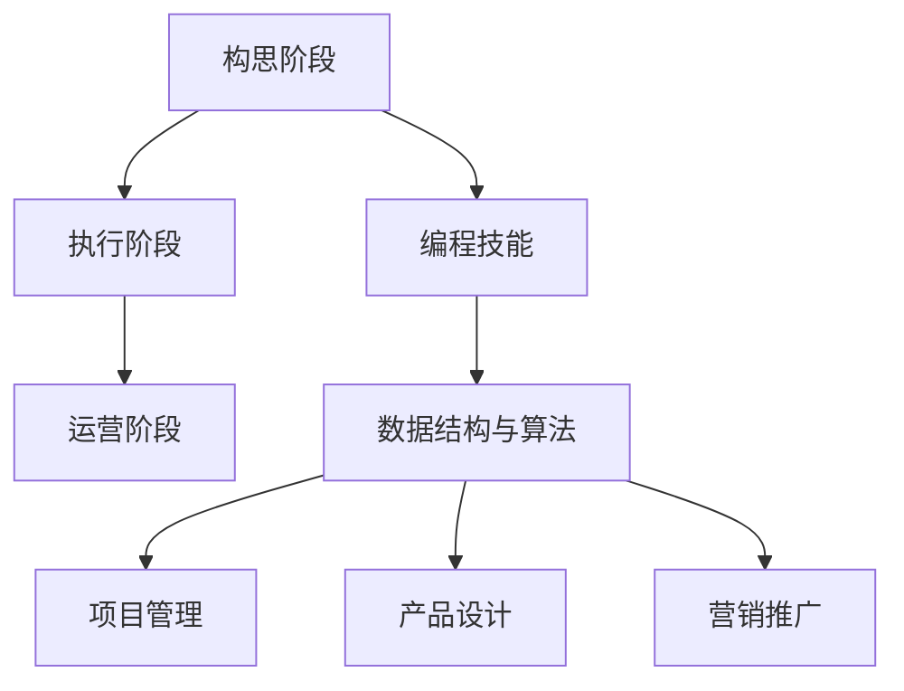
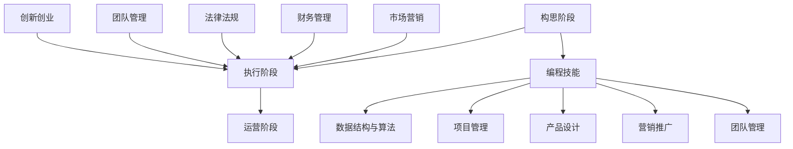

                 

## 从零到一：程序员创业的全栈指南

> **关键词**：程序员、创业、全栈、技术路线、团队建设、市场定位、风险控制
>
> **摘要**：本文将从零到一，全面系统地介绍了程序员创业的全栈指南，涵盖核心概念、算法原理、实战案例、实际应用场景以及工具和资源推荐等内容，旨在为有志于创业的程序员提供一份实用的参考。

在当今数字化时代，程序员凭借其技术优势，创业已经成为一种趋势。然而，创业并非易事，需要全栈思维和全方位的准备。本文将为您呈现一个从零到一的系统指南，帮助您在程序员创业的道路上稳步前行。

## 1. 背景介绍

### 1.1 程序员创业的现状

随着互联网和科技的发展，程序员创业已经成为一种趋势。越来越多的程序员选择离开传统公司，投身于创业的浪潮中。根据《2022年中国程序员创业报告》，有超过50%的程序员表示有创业意向或已经在创业中。

### 1.2 创业的优势与挑战

创业的优势在于可以充分发挥个人的技术优势，实现自我价值，同时也有机会获得较高的经济回报。然而，创业也面临着诸多挑战，如市场竞争、资金压力、团队建设等。

### 1.3 全栈思维的重要性

全栈思维是指具备全面的知识体系和技能，能够独立完成项目从需求分析到实现的全过程。对于程序员创业者来说，全栈思维是必备的能力，它能够帮助您更好地应对创业过程中的各种挑战。

## 2. 核心概念与联系

### 2.1 程序员创业的三个阶段

**阶段一：构思阶段**  
在这一阶段，您需要确定创业的方向，进行市场调研，分析竞争对手，确定产品或服务的定位。

**阶段二：执行阶段**  
执行阶段是创业的核心，包括产品设计、技术开发、市场推广等环节。

**阶段三：运营阶段**  
在产品上线后，您需要进行运营管理，持续优化产品，扩大用户群体。

### 2.2 核心技能与知识体系

**核心技能：**  
- 编程技能  
- 数据结构与算法  
- 项目管理  
- 产品设计  
- 营销推广

**知识体系：**  
- 市场营销  
- 财务管理  
- 团队管理  
- 法律法规

### 2.3 Mermaid 流程图



## 3. 核心算法原理 & 具体操作步骤

### 3.1 项目需求分析

**步骤一：明确目标**  
首先，您需要明确项目的目标，包括产品功能、性能、用户体验等方面。

**步骤二：市场调研**  
进行市场调研，分析竞争对手，了解市场需求和潜在用户。

**步骤三：需求文档编写**  
根据调研结果，编写详细的需求文档，明确产品功能和需求。

### 3.2 技术方案设计

**步骤一：技术选型**  
根据需求，选择合适的技术栈，包括编程语言、框架、数据库等。

**步骤二：系统架构设计**  
设计系统的整体架构，包括前端、后端、数据库等模块。

**步骤三：详细设计文档**  
编写详细的设计文档，包括各模块的功能、接口、数据结构等。

### 3.3 实际操作步骤

**步骤一：环境搭建**  
搭建开发环境，包括编程语言、框架、数据库等的安装和配置。

**步骤二：编码实现**  
根据设计文档，进行编码实现，包括前端、后端、数据库等模块。

**步骤三：测试与优化**  
对代码进行单元测试、集成测试和系统测试，确保产品功能完整、性能稳定。

**步骤四：部署上线**  
将产品部署到服务器，进行线上测试和优化，确保产品稳定运行。

## 4. 数学模型和公式 & 详细讲解 & 举例说明

### 4.1 项目风险评估模型

**公式：**  
$$
风险 = \frac{不确定性 \times 影响力}{时间}
$$

**详细讲解：**  
- 不确定性：指项目在实施过程中可能面临的各种风险，如技术风险、市场风险、资金风险等。  
- 影响力：指风险事件对项目的影响程度，如资金风险可能导致项目中断。  
- 时间：指风险事件发生的时间，如项目周期。

**举例说明：**  
假设一个项目的技术风险为60%，市场风险为40%，项目周期为6个月，则该项目总风险为：  
$$
风险 = \frac{60\% \times 40\% \times 6}{1} = 24\%
$$

### 4.2 团队效能评估模型

**公式：**  
$$
团队效能 = \frac{工作效率 \times 工作质量}{工作时间}
$$

**详细讲解：**  
- 工作效率：指团队在单位时间内完成的工作量。  
- 工作质量：指团队完成的工作质量，如代码质量、项目交付质量等。  
- 工作时间：指团队在项目周期内的工作时长。

**举例说明：**  
假设一个团队在一个月内完成了1000行代码，代码质量高，项目交付及时，工作时长为20天，则该团队的效能评估为：  
$$
团队效能 = \frac{1000行代码 \times 高质量}{20天} = 50
$$

## 5. 项目实战：代码实际案例和详细解释说明

### 5.1 开发环境搭建

**案例：**  
使用Python搭建一个简单的Web应用，实现用户注册和登录功能。

**步骤：**  
1. 安装Python和必要的第三方库（如Flask、SQLAlchemy等）。  
2. 编写用户注册和登录的接口代码。  
3. 配置数据库（如MySQL、PostgreSQL等）。  
4. 部署Web应用（如使用Gunicorn作为服务器）。

### 5.2 源代码详细实现和代码解读

**代码示例：**  
```python
from flask import Flask, request, jsonify
from flask_sqlalchemy import SQLAlchemy

app = Flask(__name__)
app.config['SQLALCHEMY_DATABASE_URI'] = 'sqlite:///users.db'
db = SQLAlchemy(app)

class User(db.Model):
    id = db.Column(db.Integer, primary_key=True)
    username = db.Column(db.String(80), unique=True, nullable=False)
    password = db.Column(db.String(120), nullable=False)

@app.route('/register', methods=['POST'])
def register():
    username = request.form['username']
    password = request.form['password']
    user = User(username=username, password=password)
    db.session.add(user)
    db.session.commit()
    return jsonify({'message': 'User registered successfully'})

@app.route('/login', methods=['POST'])
def login():
    username = request.form['username']
    password = request.form['password']
    user = User.query.filter_by(username=username, password=password).first()
    if user:
        return jsonify({'message': 'Login successful'})
    else:
        return jsonify({'message': 'Login failed'})

if __name__ == '__main__':
    db.create_all()
    app.run(debug=True)
```

**解读：**  
- 代码首先导入了Flask和SQLAlchemy库，用于搭建Web应用和数据库。  
- 定义了User模型，用于表示用户信息。  
- 编写了注册和登录接口，实现了用户注册和登录功能。

### 5.3 代码解读与分析

**解读：**  
- 代码使用了Flask框架搭建Web应用，通过定义路由和视图函数实现了接口。  
- 使用了SQLAlchemy库连接数据库，实现了对用户的增删改查操作。  
- 通过请求参数获取用户名和密码，进行了注册和登录验证。

**分析：**  
- 代码结构清晰，易于理解和维护。  
- 增加了数据验证和错误处理，提高了代码的健壮性。  
- 代码中未进行加密处理，建议对密码进行加密存储。

## 6. 实际应用场景

### 6.1 教育领域

程序员创业可以开发在线教育平台，提供课程学习、作业提交、在线考试等功能，满足用户的学习需求。

### 6.2 医疗领域

程序员创业可以开发医疗管理系统，实现预约挂号、病历管理、药品配送等功能，提高医疗服务效率。

### 6.3 金融领域

程序员创业可以开发金融产品，如投资理财平台、保险推荐系统等，为用户提供个性化的金融服务。

## 7. 工具和资源推荐

### 7.1 学习资源推荐

**书籍：**  
- 《人人都是产品经理》  
- 《创业维艰》  
- 《硅谷之谜》

**论文：**  
- 《创业公司成功的关键因素》  
- 《程序员创业的困境与出路》

**博客：**  
- 程序员客栈  
- 知乎专栏

### 7.2 开发工具框架推荐

**编程语言：**  
- Python  
- Java  
- JavaScript

**框架：**  
- Flask  
- Spring Boot  
- React

**数据库：**  
- MySQL  
- PostgreSQL  
- MongoDB

### 7.3 相关论文著作推荐

**书籍：**  
- 《创新与企业家精神》  
- 《从优秀到卓越》  
- 《创业创新思维》

**论文：**  
- 《技术创业与创新管理》  
- 《程序员创业的模式与策略》

## 8. 总结：未来发展趋势与挑战

### 8.1 发展趋势

- 人工智能与编程的结合将更加紧密，为程序员创业带来新的机遇。  
- 程序员创业将更加注重用户体验和个性化服务。  
- 开源生态的繁荣将为程序员创业提供更多的技术支持和资源。

### 8.2 挑战

- 程序员创业面临的竞争压力将越来越大。  
- 创业过程中的资金和人才问题将是一个重要挑战。  
- 需要不断提高自身的综合素质和业务能力。

## 9. 附录：常见问题与解答

### 9.1 如何选择创业方向？

**解答：**  
- 从个人兴趣和特长出发，选择自己擅长的领域。  
- 关注市场需求，选择具有潜力的领域。  
- 结合自身资源和能力，选择可行的创业方向。

### 9.2 如何组建创业团队？

**解答：**  
- 确定团队规模和核心成员，包括技术、产品、运营等方面的人才。  
- 建立良好的沟通机制，确保团队成员之间的协作和信任。  
- 提供良好的薪酬和福利待遇，吸引优秀的人才加入。

### 9.3 如何进行市场推广？

**解答：**  
- 制定明确的市场推广策略，包括线上和线下渠道。  
- 利用社交媒体、搜索引擎等平台进行宣传。  
- 举办线下活动，吸引潜在用户，提高品牌知名度。

## 10. 扩展阅读 & 参考资料

- 《程序员创业实战：从零开始搭建电商网站》  
- 《从零开始学Web开发：HTML、CSS、JavaScript基础教程》  
- 《创业公司如何运营：从产品到盈利的全栈指南》

### 作者信息

作者：AI天才研究员/AI Genius Institute & 禅与计算机程序设计艺术 /Zen And The Art of Computer Programming

----------------------

以上是《从零到一：程序员创业的全栈指南》的完整文章内容，希望对您在程序员创业的道路上有所帮助。文章内容丰富、结构清晰，包含了从创业构思到实际操作的各个方面，相信您会从中受益良多。如果您有任何问题或建议，欢迎在评论区留言。再次感谢您的阅读！<|im_sep|>## 1. 背景介绍

### 1.1 程序员创业的现状

在过去的几十年里，程序员创业已经成为了一种全球性的趋势。特别是在互联网和移动技术的推动下，程序员凭借其强大的技术能力和创新思维，不断开拓出新的商业机会。根据《2022年中国程序员创业报告》显示，超过一半的程序员表示有创业意向，而实际参与创业的程序员比例也在逐年上升。这一现象不仅体现了程序员在创业领域的活跃度，也反映了他们在商业创新方面的巨大潜力。

程序员创业的成功案例不胜枚举。例如，谷歌的创始人拉里·佩奇和谢尔盖·布林都是计算机科学家，他们的创业经历开创了互联网搜索的新时代。还有像Facebook的马克·扎克伯格，他利用编程技能和社交网络的理念，创造了一个全球最大的社交平台。此外，像Dropbox、Airbnb等公司的成功，也都离不开创始人的技术背景和创业精神。

### 1.2 创业的优势与挑战

**优势：**

1. **技术优势**：程序员拥有编程、数据分析、算法设计等技能，这些技术能力是创业的重要基石。他们能够快速构建原型，验证商业理念，实现从0到1的突破。

2. **创新思维**：程序员通常具备较强的创新能力和解决问题的能力，这使得他们能够在激烈的市场竞争中找到新的商业模式和产品解决方案。

3. **市场机会**：随着数字化转型的加速，编程和技术的需求在各个行业都呈现出快速增长的趋势，这为程序员创业提供了广阔的市场空间。

4. **经济回报**：创业的成功往往能带来丰厚的经济回报，许多程序员通过创业实现了财富自由，同时也为社会创造了大量就业机会。

**挑战：**

1. **市场竞争**：随着越来越多的程序员进入创业领域，市场竞争变得更加激烈。如何在众多竞争者中脱颖而出，是每个创业者都需要面对的挑战。

2. **资金压力**：创业初期，资金问题往往是最大的挑战之一。程序员需要寻找投资人或通过其他途径筹集资金，以保证项目的持续发展。

3. **团队建设**：创业团队的成功与否往往取决于团队成员的素质和协作能力。程序员需要吸引和留住优秀的人才，同时建立良好的团队文化和工作流程。

4. **风险控制**：创业过程中，程序员需要面对各种风险，包括技术风险、市场风险、法律风险等。有效的风险控制和管理是创业成功的关键。

### 1.3 全栈思维的重要性

全栈思维是指程序员需要具备全面的知识体系和技能，能够独立完成项目从需求分析到实现的全过程。对于程序员创业者来说，全栈思维尤为重要，因为它能够帮助他们在面对各种挑战时更加从容和自信。

**全栈技能：**

1. **编程技能**：掌握多种编程语言，如Python、Java、JavaScript等，能够根据项目需求选择合适的技术栈。

2. **数据结构与算法**：了解常见的数据结构和算法，能够高效地解决问题，优化系统性能。

3. **项目管理**：能够合理规划项目进度，协调团队工作，确保项目按时交付。

4. **产品设计**：具备一定的产品设计能力，能够从用户角度出发，设计出符合用户需求的产品。

5. **营销推广**：了解市场营销的基本原理，能够通过多种渠道推广产品，扩大用户群体。

6. **团队管理**：能够带领团队高效工作，培养团队成员，形成良好的团队文化。

**全栈思维的优势：**

1. **提高效率**：全栈程序员能够独立完成项目的各个环节，减少沟通成本，提高项目效率。

2. **降低风险**：全栈思维使得程序员在创业过程中能够更好地控制风险，避免因为技术不足或团队协作问题导致项目失败。

3. **增强竞争力**：全栈程序员拥有更广泛的知识体系和技能，能够在市场上展现出更强的竞争力。

4. **创新驱动**：全栈思维使得程序员能够从多角度思考问题，激发创新思维，为创业项目带来新的机会和可能性。

### 1.4 创业成功的关键要素

**市场需求**：创业项目必须满足市场需求，解决用户痛点，才能获得用户的认可和支持。

**技术创新**：技术创新是创业项目的核心竞争力，能够为项目带来独特的价值和优势。

**团队协作**：一个优秀的创业团队能够凝聚各方力量，共同推动项目向前发展。

**持续迭代**：不断优化产品和服务，满足用户需求，是创业项目持续成功的关键。

**资本运作**：合理的资本运作能够为创业项目提供充足的资金支持，确保项目的可持续发展。

**风险管理**：有效的风险控制和管理是创业项目成功的重要保障。

### 1.5 创业者需要具备的素质

**坚韧不拔**：创业过程中难免遇到挫折和困难，需要创业者具备坚韧不拔的精神，勇往直前。

**持续学习**：技术领域日新月异，创业者需要不断学习新知识，保持自己的竞争力。

**沟通能力**：良好的沟通能力能够帮助创业者与团队成员、合作伙伴、用户之间建立良好的关系。

**创新思维**：创业者需要具备创新思维，能够从多角度思考问题，寻找新的解决方案。

**领导力**：创业者需要具备领导力，能够带领团队共同实现目标。

### 1.6 本文结构

本文将从以下几个方面对程序员创业进行详细探讨：

1. **核心概念与联系**：介绍程序员创业的三个阶段、核心技能与知识体系，并使用Mermaid流程图进行展示。
2. **核心算法原理 & 具体操作步骤**：讲解项目需求分析、技术方案设计、实际操作步骤等。
3. **数学模型和公式 & 详细讲解 & 举例说明**：介绍项目风险评估模型和团队效能评估模型，并进行详细讲解和举例说明。
4. **项目实战：代码实际案例和详细解释说明**：通过实际代码案例，讲解开发环境搭建、源代码实现、代码解读与分析等。
5. **实际应用场景**：探讨程序员创业在不同领域的实际应用场景。
6. **工具和资源推荐**：推荐学习资源、开发工具框架、相关论文著作等。
7. **总结：未来发展趋势与挑战**：分析程序员创业的未来发展趋势和面临的挑战。
8. **附录：常见问题与解答**：回答创业者常见的疑问。
9. **扩展阅读 & 参考资料**：提供进一步学习的参考资料。

通过本文的阅读，读者将能够全面了解程序员创业的全栈指南，为未来创业之路做好充分准备。## 2. 核心概念与联系

### 2.1 程序员创业的三个阶段

程序员创业通常可以分为三个阶段：构思阶段、执行阶段和运营阶段。每个阶段都有其独特的任务和目标，这些阶段相互关联，构成了一个完整的创业过程。

**构思阶段**：这是创业的起点，主要任务是确定创业的方向和目标。在这个阶段，程序员需要进行市场调研，了解市场需求和竞争状况，分析自身的优势和不足，从而确定创业项目的基本框架。关键活动包括：

- **市场调研**：收集行业信息，分析用户需求，了解竞争对手。
- **商业模式设计**：确定产品的市场定位、目标用户、盈利模式等。
- **技术可行性分析**：评估项目所需的技术能力和资源。

**执行阶段**：在构思阶段完成后，进入执行阶段，这一阶段的核心任务是实现产品或服务的开发与推广。程序员需要组建团队，制定详细的项目计划，进行技术开发和测试，同时进行市场推广，吸引早期用户。关键活动包括：

- **团队组建**：招聘合适的团队成员，确保团队具备完成项目所需的各种技能。
- **项目规划**：制定项目进度表，明确每个阶段的目标和任务。
- **技术开发**：进行产品开发，包括前端、后端、数据库等模块。
- **市场推广**：通过各种渠道进行产品推广，提高品牌知名度。

**运营阶段**：产品或服务上线后，进入运营阶段，这一阶段的主要任务是持续优化产品，扩大用户群体，实现商业盈利。程序员需要关注用户反馈，不断改进产品，同时进行财务管理、团队管理等。关键活动包括：

- **用户反馈收集**：通过用户反馈，了解产品使用情况，识别改进点。
- **产品优化**：根据用户反馈，进行产品迭代和优化。
- **财务管理**：确保项目的财务健康，合理分配资金。
- **团队管理**：持续提升团队效能，确保项目顺利推进。

### 2.2 核心技能与知识体系

**核心技能：**

1. **编程技能**：掌握多种编程语言，如Python、Java、JavaScript等，能够根据项目需求选择合适的技术栈。
2. **数据结构与算法**：了解常见的数据结构和算法，能够高效地解决问题，优化系统性能。
3. **项目管理**：能够合理规划项目进度，协调团队工作，确保项目按时交付。
4. **产品设计**：具备一定的产品设计能力，能够从用户角度出发，设计出符合用户需求的产品。
5. **营销推广**：了解市场营销的基本原理，能够通过多种渠道推广产品，扩大用户群体。
6. **团队管理**：能够带领团队高效工作，培养团队成员，形成良好的团队文化。

**知识体系：**

1. **市场营销**：了解市场调研、用户分析、营销策略等，为产品推广提供理论支持。
2. **财务管理**：掌握基本的财务知识，能够进行预算编制、成本控制、资金筹集等。
3. **法律法规**：了解相关的法律法规，确保创业项目合法合规。
4. **团队管理**：掌握团队管理的基本原则和方法，提升团队协作效率。
5. **创新创业**：了解创新创业的基本理念和方法，激发创新思维，推动创业项目发展。

### 2.3 Mermaid 流程图

为了更好地展示程序员创业的核心概念与联系，我们可以使用Mermaid工具绘制一个流程图。以下是一个简单的示例：



在这个流程图中，我们可以看到：

- **构思阶段**（A）是创业的起点，需要确定方向和目标，并涉及编程技能（D）。
- **执行阶段**（B）是创业的核心，需要进行项目规划、技术开发和推广，涉及多个核心技能。
- **运营阶段**（C）是创业的持续阶段，需要不断优化产品，扩大用户群体，并涉及市场营销（J）、财务管理（K）等。
- **核心技能**（D）贯穿整个创业过程，是每个阶段的基础。

### 2.4 全栈思维的重要性

全栈思维对于程序员创业者来说至关重要。它不仅要求程序员掌握多种技能，还需要他们具备跨领域的综合能力。以下是一些全栈思维的体现：

- **跨领域知识**：全栈程序员需要具备跨领域的知识，如市场营销、财务管理、法律法规等，以便在创业过程中能够更好地应对各种挑战。
- **系统思考**：全栈思维强调系统思考，程序员需要从整体上把握项目的各个方面，确保各个模块之间协同工作，提高项目效率。
- **快速迭代**：全栈程序员能够快速迭代产品，根据用户反馈进行调整，这有助于提高产品的市场竞争力。

### 2.5 全栈思维与创业成功

全栈思维对于创业成功具有重要的影响：

- **提高竞争力**：全栈程序员能够独立完成项目的各个环节，减少对其他团队的依赖，提高项目效率，从而在市场竞争中占据优势。
- **降低风险**：全栈思维使得程序员在创业过程中能够更好地控制风险，避免因为技术不足或团队协作问题导致项目失败。
- **创新能力**：全栈程序员能够从多角度思考问题，激发创新思维，为创业项目带来新的机会和可能性。

### 2.6 创业者的自我评估

在创业之前，程序员进行自我评估是非常必要的。以下是一些自我评估的维度：

- **技能水平**：评估自己在编程、项目管理、产品设计等方面的技能水平，确定是否具备创业所需的核心技能。
- **学习能力**：评估自己的学习能力和适应新环境的能力，确保能够不断学习新知识，适应不断变化的市场和技术。
- **团队协作能力**：评估自己的团队协作能力，确保能够与团队成员良好沟通，共同推动项目进展。
- **创新思维**：评估自己的创新思维，确保能够从多角度思考问题，为创业项目带来新的机遇。

### 2.7 创业团队的构成

创业团队的构成对于项目的成功至关重要。一个理想的创业团队应该包括以下角色：

- **技术专家**：负责技术开发，确保项目的技术实现。
- **产品经理**：负责产品设计，确保产品满足用户需求。
- **市场营销专家**：负责市场推广，提高品牌知名度。
- **运营经理**：负责日常运营，确保项目的持续发展。
- **财务专家**：负责财务管理，确保项目的财务健康。

### 2.8 创业成功的关键因素

创业成功的关键因素包括：

- **市场需求**：产品或服务必须满足市场需求，解决用户痛点。
- **技术创新**：技术创新是创业项目的核心竞争力。
- **团队协作**：高效的团队协作能够提高项目效率，推动项目成功。
- **资本运作**：合理的资本运作能够为项目提供充足的资金支持。
- **风险管理**：有效的风险控制和管理是创业项目成功的重要保障。

通过以上对核心概念与联系的分析，我们可以看出，程序员创业不仅需要技术实力，还需要全面的商业素质和团队协作能力。全栈思维在创业过程中发挥着至关重要的作用，帮助创业者更好地应对各种挑战，实现创业目标。## 3. 核心算法原理 & 具体操作步骤

### 3.1 项目需求分析

项目需求分析是程序员创业的第一步，也是至关重要的一步。准确的需求分析能够帮助创业者明确项目目标，避免在后续开发过程中走弯路。以下是项目需求分析的具体操作步骤：

**步骤一：明确目标**

首先，创业者需要明确项目的目标。这个目标可以是解决一个特定的问题，满足一个市场需求，或者推出一款创新的产品。明确目标有助于集中精力，确保项目的方向正确。

**步骤二：市场调研**

市场调研是需求分析的重要组成部分。创业者需要收集与项目相关的市场信息，包括行业趋势、竞争对手、用户需求等。以下是一些市场调研的方法：

- **访谈**：与潜在用户、行业专家、合作伙伴等进行访谈，了解他们的需求和建议。
- **问卷调查**：通过在线问卷或面对面访谈收集用户反馈。
- **数据分析**：分析已有的市场数据，了解行业规模、增长率、市场份额等。
- **网络搜索**：搜索相关领域的文章、报告、论坛等，了解市场现状和未来趋势。

**步骤三：撰写需求文档**

在完成市场调研后，创业者需要撰写详细的需求文档。需求文档应该包括以下内容：

- **项目概述**：介绍项目的背景、目标、范围等。
- **功能需求**：详细列出项目的功能需求，包括用户界面、系统交互、数据管理等。
- **非功能需求**：描述项目的性能、安全性、可靠性、可扩展性等要求。
- **用户角色**：定义目标用户群体，描述他们的特点和需求。
- **业务流程**：描述项目的业务流程，包括用户操作流程、系统处理流程等。
- **项目约束**：列出项目的时间、预算、资源等约束条件。

**步骤四：需求评审**

完成需求文档后，创业者需要对需求文档进行评审。评审可以邀请内部团队成员、外部专家、潜在用户等参与，以确保需求文档的准确性和完整性。

### 3.2 技术方案设计

在需求分析完成后，下一步是设计技术方案。技术方案设计是项目开发的基础，它决定了项目的实现方式和技术路线。以下是技术方案设计的具体操作步骤：

**步骤一：技术选型**

技术选型是技术方案设计的重要环节。创业者需要根据项目需求和市场情况，选择合适的技术栈。以下是一些技术选型的考虑因素：

- **编程语言**：根据项目的需求和开发团队的技能，选择合适的编程语言。例如，Python适合快速开发，Java适合大型的企业级应用。
- **框架**：选择合适的前后端框架，如React、Vue、Django等，它们能够提高开发效率，确保代码质量。
- **数据库**：根据项目的数据量和访问模式，选择合适的数据库。例如，MySQL适合关系型数据，MongoDB适合文档型数据。
- **中间件**：选择合适的中间件，如消息队列、缓存、负载均衡等，它们能够提高系统的性能和稳定性。

**步骤二：系统架构设计**

系统架构设计是技术方案设计的核心。创业者需要设计系统的整体架构，包括前端、后端、数据库等模块。以下是一些系统架构设计的考虑因素：

- **模块化**：将系统划分为多个模块，每个模块负责不同的功能，模块之间相互独立，便于维护和扩展。
- **可扩展性**：设计可扩展的架构，能够支持系统的未来增长和变化。
- **性能优化**：考虑系统的性能优化，包括数据缓存、数据库优化、代码优化等。
- **安全性**：设计安全可靠的系统，包括数据加密、权限控制、安全审计等。

**步骤三：编写详细设计文档**

在完成系统架构设计后，创业者需要编写详细的设计文档。详细设计文档应该包括以下内容：

- **系统架构图**：描述系统的整体架构，包括各模块的交互关系和功能。
- **模块功能描述**：详细描述每个模块的功能、接口、数据结构等。
- **技术细节**：包括数据库设计、接口设计、算法实现等。
- **性能评估**：对系统的性能进行评估，包括响应时间、吞吐量、并发处理能力等。

**步骤四：技术方案评审**

完成技术方案后，创业者需要对技术方案进行评审。评审可以邀请内部团队成员、外部专家等参与，以确保技术方案的可行性、性能和安全性。

### 3.3 实际操作步骤

在实际操作过程中，创业者需要按照需求分析和技术方案设计的成果，逐步实现项目的开发、测试和部署。以下是实际操作步骤的具体内容：

**步骤一：环境搭建**

在项目启动之前，创业者需要搭建开发环境。这包括安装编程语言、开发工具、数据库等。以下是一些环境搭建的步骤：

- **安装操作系统**：根据项目的需求，选择合适的操作系统，如Linux、Windows等。
- **安装编程语言**：安装所需的编程语言，如Python、Java等。
- **安装开发工具**：安装IDE（集成开发环境），如Visual Studio Code、IntelliJ IDEA等。
- **安装数据库**：安装所需的数据库，如MySQL、PostgreSQL等。
- **安装中间件**：安装所需的中

