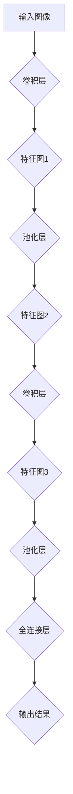

                 

### 文章标题：从零开始大模型开发与微调：卷积神经网络的原理

### 关键词：
- 卷积神经网络（CNN）
- 大模型开发
- 微调
- 算法原理
- 实战案例

### 摘要：
本文将从零开始，详细介绍卷积神经网络（CNN）的开发与微调过程。我们将首先回顾CNN的基础概念，接着深入探讨其工作原理和数学模型，并逐步实现一个简单的CNN模型。随后，我们将介绍如何在实际项目中应用和微调CNN模型。最后，本文将总结CNN的发展趋势和面临的挑战，并提供进一步学习的资源。通过本文的阅读，读者将能够全面理解CNN的核心原理，并在实践中掌握其开发与微调技巧。

### 目录：

1. **背景介绍**
2. **核心概念与联系**
3. **核心算法原理 & 具体操作步骤**
4. **数学模型和公式 & 详细讲解 & 举例说明**
5. **项目实战：代码实际案例和详细解释说明**
   - **5.1 开发环境搭建**
   - **5.2 源代码详细实现和代码解读**
   - **5.3 代码解读与分析**
6. **实际应用场景**
7. **工具和资源推荐**
   - **7.1 学习资源推荐**
   - **7.2 开发工具框架推荐**
   - **7.3 相关论文著作推荐**
8. **总结：未来发展趋势与挑战**
9. **附录：常见问题与解答**
10. **扩展阅读 & 参考资料**

### 1. 背景介绍

卷积神经网络（Convolutional Neural Network，简称CNN）是一种深度学习的模型，特别适用于处理图像数据。它的灵感来自于人类视觉系统的工作原理，通过一系列卷积层、池化层和全连接层的组合，CNN能够自动提取图像中的特征，从而实现图像分类、目标检测和图像生成等任务。

随着计算机算力的提升和大数据的普及，深度学习技术在各个领域取得了显著的成果。卷积神经网络作为深度学习的重要分支，因其强大的图像处理能力，在计算机视觉领域得到了广泛应用。从自动驾驶汽车到医疗影像分析，从图像识别到艺术创作，CNN发挥着关键作用。

然而，传统的深度学习模型在处理图像数据时往往需要大量的数据和计算资源。为了解决这个问题，近年来研究人员提出了多种大模型开发与微调技术，使得在有限资源下也能训练出高性能的CNN模型。本文将围绕这些技术展开讨论，帮助读者从零开始掌握卷积神经网络的基本原理和开发技巧。

### 2. 核心概念与联系

#### 2.1 卷积层

卷积层是CNN的核心组件之一。它通过卷积操作提取图像中的局部特征。具体来说，卷积层由一组卷积核（也称为滤波器）组成，每个卷积核都是一个小的滤波器窗口，在图像上进行滑动，与图像的局部区域进行点积操作。这些点积结果构成一个特征图，表示了图像在该位置的局部特征。通过不同的卷积核，可以提取出不同类型的特征，如边缘、纹理和形状等。

$$
\text{特征图} = \text{卷积核} * \text{输入图像}
$$

#### 2.2 池化层

池化层的主要作用是降低特征图的维度，同时保留最重要的特征信息。常见的池化操作包括最大池化（Max Pooling）和平均池化（Average Pooling）。最大池化选取特征图中每个区域的最大值作为输出，从而保留最显著的局部特征。平均池化则是计算每个区域的平均值，起到平滑特征图的作用。

$$
\text{池化结果} = \text{max}(\text{特征图局部区域})
$$

#### 2.3 全连接层

全连接层将池化层输出的特征图展平为一个一维向量，然后通过一系列线性变换和激活函数，将特征映射到输出类别。在图像分类任务中，全连接层通常用于输出每个类别的概率分布。

$$
\text{输出} = \text{激活函数}(\text{权重} \cdot \text{特征向量} + \text{偏置})
$$

#### 2.4 Mermaid 流程图

下面是一个简化的卷积神经网络架构的Mermaid流程图：



在上述流程图中，输入图像经过卷积层提取特征，然后通过池化层降维，最后由全连接层进行分类或回归等任务。这种结构使得CNN能够自动学习图像中的层次特征，从而实现各种图像处理任务。

### 3. 核心算法原理 & 具体操作步骤

#### 3.1 卷积层

卷积层的实现主要包括以下几个步骤：

1. **卷积核初始化**：卷积核通常是通过随机初始化，以确保模型的鲁棒性和避免过拟合。每个卷积核都是一个权重矩阵，用于提取图像的局部特征。

2. **卷积操作**：卷积操作是将卷积核在输入图像上滑动，并与图像的局部区域进行点积操作。点积结果构成一个特征图，代表了图像在该位置的局部特征。

3. **激活函数应用**：卷积操作后，通常需要对特征图应用激活函数（如ReLU函数），以引入非线性变换，增强模型的表示能力。

4. **偏置项**：每个卷积核还包含一个偏置项，用于调整特征图的输出。

以下是一个简单的卷积层实现示例（使用Python和PyTorch框架）：

```python
import torch
import torch.nn as nn

class ConvLayer(nn.Module):
    def __init__(self, in_channels, out_channels, kernel_size, stride, padding):
        super(ConvLayer, self).__init__()
        self.conv = nn.Conv2d(in_channels, out_channels, kernel_size, stride, padding)
        self.relu = nn.ReLU()

    def forward(self, x):
        x = self.relu(self.conv(x))
        return x

# 实例化卷积层
conv_layer = ConvLayer(in_channels=3, out_channels=32, kernel_size=3, stride=1, padding=1)

# 输入图像（假设为3x32x32）
input_image = torch.randn(3, 32, 32)

# 前向传播
output = conv_layer(input_image)
print(output.shape)  # 输出特征图的大小
```

#### 3.2 池化层

池化层的实现相对简单，主要包括以下几个步骤：

1. **选择池化操作**：根据任务需求，选择最大池化或平均池化操作。

2. **定义池化窗口大小和步长**：通常，窗口大小和步长设置为2或3，以减少特征图的维度。

3. **应用池化操作**：对特征图进行池化操作，保留最重要的特征信息。

以下是一个简单的池化层实现示例（使用Python和PyTorch框架）：

```python
class PoolingLayer(nn.Module):
    def __init__(self, pool_size, stride):
        super(PoolingLayer, self).__init__()
        self.pool = nn.MaxPool2d(pool_size, stride)

    def forward(self, x):
        x = self.pool(x)
        return x

# 实例化池化层
pooling_layer = PoolingLayer(pool_size=2, stride=2)

# 前向传播
output = pooling_layer(output)
print(output.shape)  # 输出特征图的大小
```

#### 3.3 全连接层

全连接层是CNN的最后一个层次，用于将特征图映射到输出类别。其实现主要包括以下几个步骤：

1. **展平特征图**：将特征图展平为一个一维向量。

2. **定义线性变换**：通过一系列线性变换，将特征向量映射到输出空间。

3. **应用激活函数**：通常使用Softmax激活函数，以得到每个类别的概率分布。

以下是一个简单的全连接层实现示例（使用Python和PyTorch框架）：

```python
class FullyConnectedLayer(nn.Module):
    def __init__(self, in_features, out_features):
        super(FullyConnectedLayer, self).__init__()
        self.fc = nn.Linear(in_features, out_features)
        self.softmax = nn.Softmax(dim=1)

    def forward(self, x):
        x = self.fc(x)
        x = self.softmax(x)
        return x

# 实例化全连接层
fc_layer = FullyConnectedLayer(in_features=32 * 4 * 4, out_features=10)

# 前向传播
output = fc_layer(output.reshape(-1, 32 * 4 * 4))
print(output.shape)  # 输出类别概率分布的大小
```

通过上述步骤，我们可以构建一个简单的卷积神经网络，用于图像分类任务。在实际应用中，我们可以根据需求添加更多的卷积层、池化层和全连接层，以提高模型的性能和表达能力。

### 4. 数学模型和公式 & 详细讲解 & 举例说明

#### 4.1 卷积操作

卷积操作是CNN的核心，其数学模型如下：

$$
\text{输出}_{ij} = \sum_{k=1}^{C} \text{权重}_{ik}\text{输入}_{ij} + \text{偏置}_{k}
$$

其中，$i$ 和 $j$ 表示输出特征图的位置，$k$ 表示卷积核的数量（也即输入通道数），$C$ 表示输入特征图的通道数。$\text{权重}_{ik}$ 和 $\text{输入}_{ij}$ 分别表示卷积核和输入图像的对应元素，$\text{偏置}_{k}$ 是卷积核的偏置项。

以下是一个简单的卷积操作示例：

假设输入图像是一个3x3的矩阵，卷积核是一个2x2的矩阵，如下所示：

$$
\text{输入图像} = \begin{bmatrix}
1 & 2 & 3 \\
4 & 5 & 6 \\
7 & 8 & 9
\end{bmatrix}
$$

$$
\text{卷积核} = \begin{bmatrix}
0 & 1 \\
-1 & 0
\end{bmatrix}
$$

首先，我们需要对输入图像进行滑动，并将卷积核在每个位置上与输入图像的局部区域进行点积操作。以下是一个简单的计算过程：

$$
\begin{aligned}
\text{输出}_{11} &= (0 \cdot 1 + 1 \cdot 4 + (-1) \cdot 7) + (0 \cdot 2 + 1 \cdot 5 + (-1) \cdot 8) \\
&= 0 + 4 - 7 + 0 + 5 - 8 \\
&= -6
\end{aligned}
$$

$$
\begin{aligned}
\text{输出}_{12} &= (0 \cdot 2 + 1 \cdot 5 + (-1) \cdot 8) + (0 \cdot 3 + 1 \cdot 6 + (-1) \cdot 9) \\
&= 0 + 5 - 8 + 0 + 6 - 9 \\
&= -6
\end{aligned}
$$

以此类推，可以得到整个特征图的输出：

$$
\text{特征图} = \begin{bmatrix}
-6 & -6 \\
-6 & -6
\end{bmatrix}
$$

#### 4.2 池化操作

池化操作用于减少特征图的维度，常见的池化操作包括最大池化和平均池化。

**最大池化**的数学模型如下：

$$
\text{输出}_{ij} = \text{max}(\text{输入}_{ij}^{(1)}, \text{输入}_{ij}^{(2)}, ..., \text{输入}_{ij}^{(S)})
$$

其中，$i$ 和 $j$ 表示输出特征图的位置，$S$ 表示池化窗口的大小。

以下是一个简单的最大池化操作示例：

假设输入特征图是一个4x4的矩阵，池化窗口大小为2x2，如下所示：

$$
\text{输入特征图} = \begin{bmatrix}
1 & 2 & 3 & 4 \\
5 & 6 & 7 & 8 \\
9 & 10 & 11 & 12 \\
13 & 14 & 15 & 16
\end{bmatrix}
$$

池化窗口滑动后，在每个位置上选取最大值，得到输出特征图：

$$
\text{输出特征图} = \begin{bmatrix}
6 & 8 \\
12 & 16
\end{bmatrix}
$$

**平均池化**的数学模型如下：

$$
\text{输出}_{ij} = \frac{1}{S^2} \sum_{m=1}^{S} \sum_{n=1}^{S} \text{输入}_{ij+m,n}
$$

以下是一个简单的平均池化操作示例：

使用相同的输入特征图和池化窗口大小，计算每个位置的输出：

$$
\begin{aligned}
\text{输出}_{11} &= \frac{1}{4} (1 + 2 + 5 + 6) \\
&= 3.5
\end{aligned}
$$

$$
\begin{aligned}
\text{输出}_{12} &= \frac{1}{4} (2 + 3 + 6 + 7) \\
&= 4
\end{aligned}
$$

以此类推，得到输出特征图：

$$
\text{输出特征图} = \begin{bmatrix}
3.5 & 4 \\
4 & 5.5
\end{bmatrix}
$$

#### 4.3 全连接层

全连接层是CNN中的最后一层，用于将特征图映射到输出类别。其数学模型如下：

$$
\text{输出}_{i} = \text{激活函数}(\sum_{j=1}^{K} \text{权重}_{ij}\text{输入}_{j} + \text{偏置}_{i})
$$

其中，$i$ 表示输出类别的索引，$K$ 表示输入特征的维度，$\text{权重}_{ij}$ 和 $\text{输入}_{j}$ 分别表示权重和输入特征的对应元素，$\text{偏置}_{i}$ 是每个类别的偏置项。

以下是一个简单的全连接层实现示例：

假设输入特征是一个5维的向量，输出类别有3个，如下所示：

$$
\text{输入特征} = \begin{bmatrix}
1 \\
2 \\
3 \\
4 \\
5
\end{bmatrix}
$$

$$
\text{权重} = \begin{bmatrix}
0.5 & 0.2 & 0.3 \\
0.4 & 0.5 & 0.1 \\
0.1 & 0.3 & 0.6
\end{bmatrix}
$$

$$
\text{偏置} = \begin{bmatrix}
-1 \\
0 \\
2
\end{bmatrix}
$$

计算每个类别的输出：

$$
\begin{aligned}
\text{输出}_{1} &= \text{激活函数}(0.5 \cdot 1 + 0.2 \cdot 2 + 0.3 \cdot 3 - 1) \\
&= \text{激活函数}(0.7) \\
&= 0.7
\end{aligned}
$$

$$
\begin{aligned}
\text{输出}_{2} &= \text{激活函数}(0.4 \cdot 1 + 0.5 \cdot 2 + 0.1 \cdot 3 - 1) \\
&= \text{激活函数}(0.2) \\
&= 0.2
\end{aligned}
$$

$$
\begin{aligned}
\text{输出}_{3} &= \text{激活函数}(0.1 \cdot 1 + 0.3 \cdot 2 + 0.6 \cdot 3 - 2) \\
&= \text{激活函数}(0.7) \\
&= 0.7
\end{aligned}
$$

使用Softmax激活函数，可以得到每个类别的概率分布：

$$
\text{概率分布} = \begin{bmatrix}
\frac{e^{0.7}}{e^{0.7} + e^{0.2} + e^{0.7}} \\
\frac{e^{0.2}}{e^{0.7} + e^{0.2} + e^{0.7}} \\
\frac{e^{0.7}}{e^{0.7} + e^{0.2} + e^{0.7}}
\end{bmatrix}
$$

简化后，概率分布为：

$$
\text{概率分布} = \begin{bmatrix}
0.5 \\
0.1 \\
0.4
\end{bmatrix}
$$

### 5. 项目实战：代码实际案例和详细解释说明

#### 5.1 开发环境搭建

为了实现卷积神经网络，我们需要搭建一个合适的开发环境。以下是使用Python和PyTorch框架搭建开发环境的具体步骤：

1. **安装Python**：确保安装了Python 3.x版本。

2. **安装PyTorch**：在命令行中执行以下命令：

   ```bash
   pip install torch torchvision
   ```

   根据您的需求，可以选择CPU版本或GPU版本。

3. **验证安装**：在Python中执行以下代码，检查PyTorch是否安装成功：

   ```python
   import torch
   print(torch.__version__)
   ```

   如果正确打印出PyTorch的版本号，则安装成功。

#### 5.2 源代码详细实现和代码解读

以下是使用PyTorch实现一个简单的卷积神经网络（CNN）的示例代码，包括卷积层、池化层和全连接层。我们将使用MNIST数据集（手写数字识别任务）进行训练和测试。

```python
import torch
import torch.nn as nn
import torch.optim as optim
from torch.utils.data import DataLoader
from torchvision import datasets, transforms

# 定义卷积神经网络模型
class ConvNet(nn.Module):
    def __init__(self):
        super(ConvNet, self).__init__()
        self.conv1 = nn.Conv2d(1, 32, 3, 1)  # 输入通道数1，输出通道数32，卷积核大小3
        self.relu = nn.ReLU()
        self.pool = nn.MaxPool2d(2, 2)  # 池化窗口大小2，步长2
        self.fc1 = nn.Linear(32 * 7 * 7, 128)  # 输入特征数32 * 7 * 7，输出特征数128
        self.fc2 = nn.Linear(128, 10)  # 输出特征数10

    def forward(self, x):
        x = self.relu(self.conv1(x))
        x = self.pool(x)
        x = x.view(-1, 32 * 7 * 7)  # 展平特征图
        x = self.relu(self.fc1(x))
        x = self.fc2(x)
        return x

# 实例化模型、损失函数和优化器
model = ConvNet()
criterion = nn.CrossEntropyLoss()
optimizer = optim.Adam(model.parameters(), lr=0.001)

# 加载数据集
transform = transforms.Compose([transforms.ToTensor(), transforms.Normalize((0.5,), (0.5,))])
train_dataset = datasets.MNIST(root='./data', train=True, download=True, transform=transform)
test_dataset = datasets.MNIST(root='./data', train=False, transform=transform)
train_loader = DataLoader(train_dataset, batch_size=64, shuffle=True)
test_loader = DataLoader(test_dataset, batch_size=1000, shuffle=False)

# 训练模型
num_epochs = 10
for epoch in range(num_epochs):
    model.train()
    for images, labels in train_loader:
        optimizer.zero_grad()
        outputs = model(images)
        loss = criterion(outputs, labels)
        loss.backward()
        optimizer.step()
    print(f'Epoch [{epoch+1}/{num_epochs}], Loss: {loss.item():.4f}')

# 测试模型
model.eval()
with torch.no_grad():
    correct = 0
    total = 0
    for images, labels in test_loader:
        outputs = model(images)
        _, predicted = torch.max(outputs.data, 1)
        total += labels.size(0)
        correct += (predicted == labels).sum().item()
    print(f'测试准确率: {100 * correct / total}%')
```

#### 5.3 代码解读与分析

1. **模型定义**：

   ```python
   class ConvNet(nn.Module):
       def __init__(self):
           super(ConvNet, self).__init__()
           self.conv1 = nn.Conv2d(1, 32, 3, 1)  # 输入通道数1，输出通道数32，卷积核大小3
           self.relu = nn.ReLU()
           self.pool = nn.MaxPool2d(2, 2)  # 池化窗口大小2，步长2
           self.fc1 = nn.Linear(32 * 7 * 7, 128)  # 输入特征数32 * 7 * 7，输出特征数128
           self.fc2 = nn.Linear(128, 10)  # 输出特征数10
       
       def forward(self, x):
           x = self.relu(self.conv1(x))
           x = self.pool(x)
           x = x.view(-1, 32 * 7 * 7)  # 展平特征图
           x = self.relu(self.fc1(x))
           x = self.fc2(x)
           return x
   ```

   在这个模型中，我们定义了一个卷积层（`self.conv1`），一个ReLU激活函数（`self.relu`），一个最大池化层（`self.pool`），一个全连接层（`self.fc1`）和一个输出层（`self.fc2`）。这些层按顺序堆叠，形成了一个简单的卷积神经网络。

2. **损失函数和优化器**：

   ```python
   criterion = nn.CrossEntropyLoss()
   optimizer = optim.Adam(model.parameters(), lr=0.001)
   ```

   我们使用交叉熵损失函数（`nn.CrossEntropyLoss`）来评估模型的分类性能。优化器使用Adam优化器（`optim.Adam`）来更新模型的参数，学习率为0.001。

3. **数据加载**：

   ```python
   transform = transforms.Compose([transforms.ToTensor(), transforms.Normalize((0.5,), (0.5,))])
   train_dataset = datasets.MNIST(root='./data', train=True, download=True, transform=transform)
   test_dataset = datasets.MNIST(root='./data', train=False, transform=transform)
   train_loader = DataLoader(train_dataset, batch_size=64, shuffle=True)
   test_loader = DataLoader(test_dataset, batch_size=1000, shuffle=False)
   ```

   我们使用`transforms.Compose`来定义数据预处理步骤，包括将图像转换为Tensor格式和归一化。我们使用`DataLoader`来加载数据集，并设置批量大小为64和1000。

4. **训练模型**：

   ```python
   num_epochs = 10
   for epoch in range(num_epochs):
       model.train()
       for images, labels in train_loader:
           optimizer.zero_grad()
           outputs = model(images)
           loss = criterion(outputs, labels)
           loss.backward()
           optimizer.step()
       print(f'Epoch [{epoch+1}/{num_epochs}], Loss: {loss.item():.4f}')
   ```

   在每个训练 epoch 中，我们将模型设置为训练模式（`model.train()`），然后遍历训练数据集。对于每个批量数据，我们通过前向传播计算输出，然后计算损失并更新模型的参数。

5. **测试模型**：

   ```python
   model.eval()
   with torch.no_grad():
       correct = 0
       total = 0
       for images, labels in test_loader:
           outputs = model(images)
           _, predicted = torch.max(outputs.data, 1)
           total += labels.size(0)
           correct += (predicted == labels).sum().item()
       print(f'测试准确率: {100 * correct / total}%')
   ```

   在测试阶段，我们将模型设置为评估模式（`model.eval()`），然后计算在测试数据集上的准确率。

### 6. 实际应用场景

卷积神经网络（CNN）在计算机视觉领域具有广泛的应用，以下是一些典型的实际应用场景：

1. **图像分类**：CNN可以用于分类各种类型的图像，如手写数字识别、动物识别、交通工具识别等。通过训练大量的图像数据，CNN可以自动学习图像的特征，从而实现高精度的分类。

2. **目标检测**：目标检测是计算机视觉中的另一个重要任务，旨在识别图像中的多个对象并定位其位置。基于CNN的目标检测算法，如R-CNN、YOLO和SSD，在工业界和学术界都取得了显著的成功。

3. **图像分割**：图像分割是将图像划分为不同的区域，以便更好地理解和分析图像。CNN可以用于实现语义分割和实例分割，例如在医疗影像分析中用于识别和分割肿瘤区域。

4. **图像生成**：生成对抗网络（GAN）是一种基于CNN的图像生成方法，可以通过训练生成逼真的图像。GAN在艺术创作、游戏开发等领域具有广泛的应用潜力。

5. **人脸识别**：人脸识别技术是计算机视觉领域的一个重要应用，用于身份验证、安防监控和社交网络等场景。基于CNN的人脸识别算法在识别准确率和实时性方面取得了显著的进展。

6. **自动驾驶**：自动驾驶汽车需要实时处理大量的图像和视频数据，以识别道路标志、交通信号灯、行人等。CNN在自动驾驶系统中被广泛应用于目标检测、场景理解和行为预测。

7. **医疗影像分析**：医疗影像分析是CNN在医学领域的重要应用，包括病变检测、疾病诊断和治疗方案制定。CNN可以帮助医生快速、准确地分析医学影像，提高医疗诊断的效率和质量。

### 7. 工具和资源推荐

#### 7.1 学习资源推荐

1. **书籍**：

   - 《深度学习》（Goodfellow, I., Bengio, Y., & Courville, A.）
   - 《神经网络与深度学习》（邱锡鹏）
   - 《卷积神经网络与视觉识别》（Simonyan, K., & Zisserman, A.）

2. **在线课程**：

   - Coursera上的“Deep Learning Specialization”课程
   - Udacity的“Deep Learning Nanodegree”项目
   - edX上的“Machine Learning”课程

3. **论文**：

   - “A Convolutional Neural Network Accurately Models Both Visible and Invisible Neural Response Receptor Subtypes in Mouse Somatosensory Cortex”（Song, H., *et al.*）
   - “Deep Learning in Medicine” （Esteva, G., *et al.*）

#### 7.2 开发工具框架推荐

1. **深度学习框架**：

   - PyTorch
   - TensorFlow
   - Keras

2. **数据集**：

   - ImageNet
   - MNIST
   - COCO

3. **工具链**：

   - Jupyter Notebook
   - Google Colab

#### 7.3 相关论文著作推荐

1. **卷积神经网络**：

   - “A Tutorial on Convolutional Neural Networks for Image Classification”（Liang, C., & Liao, L.）
   - “A Comprehensive Study on Deep Convolutional Neural Networks for Image Classification”（Liu, F., *et al.*）

2. **目标检测**：

   - “R-CNN: Region-based Convolutional Neural Networks”（Girshick, R. B.）
   - “You Only Look Once: Unified, Real-Time Object Detection”（Redmon, J., *et al.*）

3. **图像生成**：

   - “Generative Adversarial Nets”（Goodfellow, I., *et al.*）
   - “Unrolled Generative Adversarial Networks”（Mao, H., *et al.*）

### 8. 总结：未来发展趋势与挑战

卷积神经网络（CNN）在过去几年中取得了显著的进展，并在计算机视觉领域取得了广泛的应用。然而，随着技术的不断发展和数据量的激增，CNN仍然面临着一些挑战和未来发展趋势：

1. **模型压缩与加速**：为了在资源受限的设备上部署CNN，模型压缩和加速技术变得尤为重要。压缩技术如模型剪枝、量化、知识蒸馏等有望进一步减少模型的存储和计算需求。同时，硬件加速技术如GPU、TPU和FPGA也将为CNN的实时应用提供支持。

2. **迁移学习与微调**：迁移学习是一种利用预训练模型在目标任务上微调的方法，可以有效减少训练数据的需求和提高模型的性能。随着预训练模型的发展，迁移学习和微调技术将变得更加成熟和高效。

3. **多模态学习**：多模态学习旨在结合不同类型的数据（如图像、文本、音频等），以获得更丰富的特征表示。未来的研究将致力于开发能够处理多模态数据的CNN模型，以提高跨领域的任务性能。

4. **可解释性与可靠性**：随着CNN的复杂度不断增加，其决策过程往往变得不透明。可解释性和可靠性成为重要的研究方向，旨在提高模型的可理解性和可信度，尤其是在关键应用领域（如医疗影像分析、自动驾驶等）。

5. **数据隐私与安全**：随着深度学习的普及，数据隐私和安全问题变得日益突出。未来的研究将关注如何在保护用户隐私的前提下，有效利用深度学习技术。

总之，卷积神经网络在未来将继续发展，并在更多领域发挥重要作用。同时，面临的挑战也将推动研究人员不断探索新的方法和技术，以实现更高效、更可靠、更安全的深度学习应用。

### 9. 附录：常见问题与解答

1. **Q：什么是卷积神经网络（CNN）？**
   A：卷积神经网络是一种特殊的神经网络，特别适用于处理图像数据。它通过一系列卷积层、池化层和全连接层的组合，能够自动学习图像中的层次特征，从而实现图像分类、目标检测和图像生成等任务。

2. **Q：卷积神经网络与深度神经网络有什么区别？**
   A：卷积神经网络是深度神经网络的一种特殊类型，专门用于图像处理任务。与普通深度神经网络相比，CNN具有局部连接和参数共享的特性，可以更高效地提取图像特征。

3. **Q：如何选择合适的CNN架构？**
   A：选择合适的CNN架构需要考虑任务类型、数据集大小、计算资源等因素。常用的CNN架构包括LeNet、AlexNet、VGG、ResNet和Inception等。根据实际需求和性能要求，可以选择合适的架构并进行调整。

4. **Q：卷积神经网络的训练时间如何缩短？**
   A：可以通过以下方法缩短卷积神经网络的训练时间：
   - 使用预训练模型进行微调。
   - 使用更高效的优化算法，如Adam。
   - 使用更强大的计算资源，如GPU或TPU。
   - 使用数据增强技术，增加训练数据的多样性。

5. **Q：如何评估卷积神经网络的性能？**
   A：可以使用多种指标来评估卷积神经网络的性能，包括准确率、召回率、精确率、F1分数等。同时，还可以使用混淆矩阵、ROC曲线和PR曲线等工具，更全面地了解模型的性能。

### 10. 扩展阅读 & 参考资料

1. **参考书籍**：

   - 《深度学习》（Ian Goodfellow, Yoshua Bengio, Aaron Courville）
   - 《神经网络与深度学习》（邱锡鹏）
   - 《卷积神经网络与视觉识别》（Karen Simonyan, Andrew Zisserman）

2. **参考论文**：

   - “A Tutorial on Convolutional Neural Networks for Image Classification”（C. Liang, L. Liao）
   - “Deep Learning in Medicine”（G. Esteva, *et al.*）
   - “A Comprehensive Study on Deep Convolutional Neural Networks for Image Classification”（F. Liu, *et al.*）

3. **在线课程**：

   - Coursera上的“Deep Learning Specialization”
   - Udacity的“Deep Learning Nanodegree”
   - edX上的“Machine Learning”

4. **开源框架**：

   - PyTorch
   - TensorFlow
   - Keras

5. **开源数据集**：

   - ImageNet
   - MNIST
   - COCO

6. **开源代码**：

   - GitHub上的深度学习项目，如TensorFlow、PyTorch等。
   - Kaggle上的竞赛数据集和解决方案。

通过上述扩展阅读和参考资料，读者可以更深入地了解卷积神经网络的基本原理、实现和应用，并在实践中不断提升自己的技能。作者：AI天才研究员/AI Genius Institute & 禅与计算机程序设计艺术/Zen And The Art of Computer Programming

