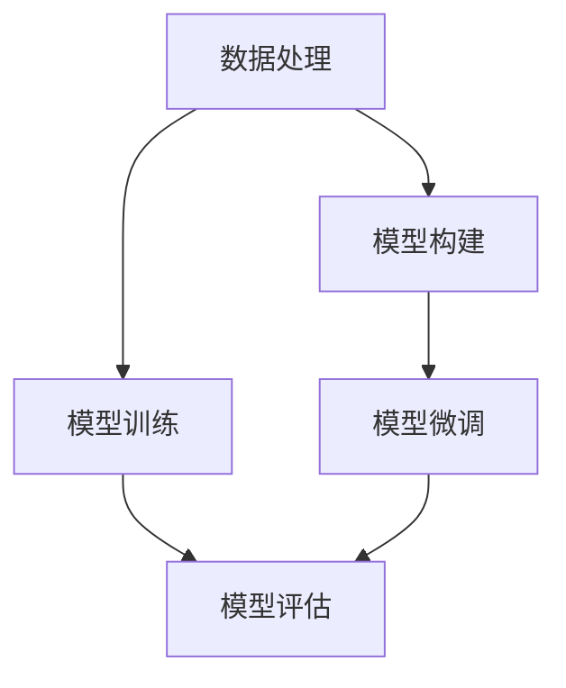

                 

### 背景介绍

随着人工智能技术的飞速发展，大模型在各个领域中的应用越来越广泛，从自然语言处理到计算机视觉，再到推荐系统，大模型已经成为推动科技进步的重要力量。然而，大模型的开发与微调并不是一个简单的任务。这不仅需要强大的计算资源，还要求开发者具备深厚的理论知识，以及对数据处理和模型训练的深入理解。

本文旨在为广大开发者提供一个从零开始的指南，帮助大家了解大模型的开发与微调过程。我们将从基础概念入手，逐步讲解数据处理、模型构建、训练与微调等关键步骤。通过本文的学习，读者可以掌握大模型开发的核心技能，并能够独立完成一个简单的大模型项目。

### 核心概念与联系

在进入具体的技术细节之前，我们需要先了解一些核心概念，这些概念是构建大模型的基础。以下是本文将涉及的核心概念：

1. **大模型（Large Models）**：大模型通常指的是拥有数亿甚至千亿参数的神经网络模型。这些模型可以在大量的数据上进行训练，从而获得强大的特征提取和泛化能力。
2. **数据处理（Data Processing）**：数据处理是模型训练前的重要步骤，包括数据清洗、预处理、特征提取等。良好的数据处理可以提高模型的训练效率和效果。
3. **模型构建（Model Building）**：模型构建是指设计神经网络的架构，包括选择合适的层结构、激活函数、正则化方法等。
4. **模型训练（Model Training）**：模型训练是指通过大量数据来调整模型参数，使其能够更好地拟合训练数据。训练过程中需要考虑优化算法、学习率调整、模型正则化等技术。
5. **模型微调（Model Fine-tuning）**：模型微调是在预训练模型的基础上，针对特定任务进行参数调整，以达到更好的性能。微调通常需要较少的数据，但能显著提升模型在特定任务上的表现。

下面是一个Mermaid流程图，用于展示这些核心概念之间的联系：



### 核心算法原理 & 具体操作步骤

在了解了核心概念之后，我们需要深入探讨大模型开发的核心算法原理和具体操作步骤。以下是一个基本的流程：

#### 数据处理

1. **数据清洗**：去除数据中的噪声和异常值，确保数据的质量。
2. **数据预处理**：将数据转换为模型可以处理的格式，如归一化、标准化等。
3. **特征提取**：从原始数据中提取有用的特征，以提高模型的性能。

```python
import pandas as pd
from sklearn.preprocessing import StandardScaler

# 加载数据
data = pd.read_csv('data.csv')

# 数据清洗
data = data[data['target'] != 'invalid']

# 数据预处理
scaler = StandardScaler()
data['feature1'] = scaler.fit_transform(data['feature1'].values.reshape(-1, 1))
data['feature2'] = scaler.fit_transform(data['feature2'].values.reshape(-1, 1))

# 特征提取
# 这里可以添加自定义的特征提取逻辑
```

#### 模型构建

1. **选择模型架构**：根据任务需求选择合适的神经网络架构，如CNN、RNN、Transformer等。
2. **定义模型**：使用PyTorch等深度学习框架定义模型，包括层结构、激活函数、损失函数等。

```python
import torch
import torch.nn as nn
import torch.optim as optim

# 定义模型
class NeuralNetwork(nn.Module):
    def __init__(self):
        super(NeuralNetwork, self).__init__()
        self.layer1 = nn.Linear(in_features=2, out_features=64)
        self.relu = nn.ReLU()
        self.layer2 = nn.Linear(in_features=64, out_features=1)
    
    def forward(self, x):
        x = self.layer1(x)
        x = self.relu(x)
        x = self.layer2(x)
        return x

model = NeuralNetwork()
```

#### 模型训练

1. **初始化参数**：使用随机初始化或预训练权重初始化模型参数。
2. **选择优化算法**：如SGD、Adam等。
3. **训练过程**：通过迭代调整模型参数，使其在训练数据上达到较好的性能。

```python
# 初始化参数
optimizer = optim.Adam(model.parameters(), lr=0.001)

# 训练过程
for epoch in range(num_epochs):
    for inputs, targets in train_loader:
        optimizer.zero_grad()
        outputs = model(inputs)
        loss = nn.BCELoss()(outputs, targets)
        loss.backward()
        optimizer.step()
    print(f'Epoch {epoch+1}/{num_epochs}, Loss: {loss.item()}')
```

#### 模型微调

1. **加载预训练模型**：从预训练模型中加载权重。
2. **调整参数**：在预训练模型的基础上，针对特定任务调整部分参数。
3. **微调过程**：通过微调过程提高模型在特定任务上的性能。

```python
# 加载预训练模型
pretrained_model = NeuralNetwork()
pretrained_model.load_state_dict(torch.load('pretrained_model.pth'))

# 调整参数
for param in pretrained_model.parameters():
    param.requires_grad = False

# 微调部分参数
model.layer2 = pretrained_model.layer2
model.optimizer = optim.Adam(model.parameters(), lr=0.001)

# 微调过程
for epoch in range(num_epochs):
    for inputs, targets in train_loader:
        optimizer.zero_grad()
        outputs = model(inputs)
        loss = nn.BCELoss()(outputs, targets)
        loss.backward()
        optimizer.step()
    print(f'Epoch {epoch+1}/{num_epochs}, Loss: {loss.item()}')
```

通过以上步骤，我们可以完成一个基本的大模型开发与微调过程。接下来，我们将通过一个实际案例来进一步展示这些步骤。

### 数学模型和公式 & 详细讲解 & 举例说明

在深入探讨大模型开发与微调的数学模型和公式之前，我们需要先了解一些基础的数学和深度学习相关的概念。

#### 损失函数

损失函数是评估模型预测结果与实际结果之间差异的一种度量。在深度学习中，常用的损失函数包括均方误差（MSE）、交叉熵损失（Cross-Entropy Loss）等。

1. **均方误差（MSE）**：

   均方误差是回归任务中最常用的损失函数，计算公式为：

   $$MSE = \frac{1}{n}\sum_{i=1}^{n}(y_i - \hat{y_i})^2$$

   其中，$y_i$为实际值，$\hat{y_i}$为预测值，$n$为样本数量。

2. **交叉熵损失（Cross-Entropy Loss）**：

   交叉熵损失函数常用于分类任务，计算公式为：

   $$Cross-Entropy Loss = -\sum_{i=1}^{n} y_i \log(\hat{y_i})$$

   其中，$y_i$为实际类别标签（0或1），$\hat{y_i}$为模型预测的概率。

#### 梯度下降法

梯度下降法是一种优化算法，用于在最小化损失函数的过程中调整模型参数。梯度下降法的基本思想是沿着损失函数的梯度方向更新参数，以减小损失值。

1. **随机梯度下降（SGD）**：

   随机梯度下降是梯度下降法的一种变体，每次迭代只随机选择一个样本计算梯度并更新参数。

   $$\theta_{t+1} = \theta_t - \alpha \cdot \nabla_\theta J(\theta_t)$$

   其中，$\theta_t$为当前参数值，$\alpha$为学习率，$J(\theta)$为损失函数，$\nabla_\theta J(\theta_t)$为损失函数关于参数的梯度。

2. **Adam优化器**：

   Adam优化器是另一种常用的优化算法，结合了SGD和动量法的优点。Adam优化器的更新公式为：

   $$\theta_{t+1} = \theta_t - \alpha \cdot \frac{m_t}{1 - \beta_1^t}$$

   $$m_t = \beta_1 \cdot m_{t-1} + (1 - \beta_1) \cdot \nabla_\theta J(\theta_t)$$

   $$v_t = \beta_2 \cdot v_{t-1} + (1 - \beta_2) \cdot (\nabla_\theta J(\theta_t))^2$$

   其中，$m_t$和$v_t$分别为一阶矩估计和二阶矩估计，$\beta_1$和$\beta_2$分别为一阶和二阶矩的指数衰减率。

#### 举例说明

假设我们有一个简单的回归任务，数据集包含输入特征X和目标值Y。我们使用均方误差（MSE）作为损失函数，并选择Adam优化器进行模型训练。

1. **数据准备**：

   首先，我们加载数据集并划分训练集和测试集。

   ```python
   import numpy as np

   X_train = np.random.rand(100, 1)
   Y_train = 2 * X_train + 1 + np.random.randn(100, 1)
   X_test = np.random.rand(10, 1)
   Y_test = 2 * X_test + 1 + np.random.randn(10, 1)
   ```

2. **模型定义**：

   接下来，我们定义一个简单的线性回归模型。

   ```python
   import torch
   import torch.nn as nn

   class LinearRegressionModel(nn.Module):
       def __init__(self):
           super(LinearRegressionModel, self).__init__()
           self.linear = nn.Linear(1, 1)

       def forward(self, x):
           return self.linear(x)
   ```

3. **模型训练**：

   我们使用Adam优化器进行模型训练。

   ```python
   model = LinearRegressionModel()
   optimizer = optim.Adam(model.parameters(), lr=0.001)
   criterion = nn.MSELoss()

   for epoch in range(100):
       optimizer.zero_grad()
       outputs = model(X_train)
       loss = criterion(outputs, Y_train)
       loss.backward()
       optimizer.step()
       if (epoch + 1) % 10 == 0:
           print(f'Epoch [{epoch+1}/100], Loss: {loss.item()}')
   ```

4. **模型评估**：

   最后，我们对模型进行评估。

   ```python
   with torch.no_grad():
       outputs = model(X_test)
       loss = criterion(outputs, Y_test)
       print(f'MSE Loss on Test Set: {loss.item()}')
   ```

通过以上步骤，我们完成了一个简单的线性回归任务，并使用均方误差（MSE）和Adam优化器进行了模型训练。这个过程展示了如何使用深度学习框架PyTorch进行大模型开发的基本步骤。

### 项目实战：代码实际案例和详细解释说明

在前面的章节中，我们介绍了大模型开发的核心概念、算法原理以及数学模型。现在，我们将通过一个实际项目来展示如何使用PyTorch进行大模型开发和微调的全过程。这个项目将使用一个简单的图像分类任务，通过以下步骤来完成：

### 5.1 开发环境搭建

首先，我们需要搭建一个适合进行深度学习开发的Python环境。以下是搭建环境的步骤：

1. **安装Python**：确保您的系统上已经安装了Python 3.7或更高版本。
2. **安装PyTorch**：可以通过以下命令安装PyTorch：

   ```bash
   pip install torch torchvision
   ```

   您还可以通过以下命令安装GPU版本的PyTorch，以便在具有NVIDIA GPU的计算机上进行训练：

   ```bash
   pip install torch torchvision -f https://download.pytorch.org/whl/torch_stable.html
   ```

3. **安装其他依赖**：包括NumPy、Pandas、Matplotlib等常用库。

   ```bash
   pip install numpy pandas matplotlib
   ```

### 5.2 源代码详细实现和代码解读

接下来，我们将详细实现一个基于PyTorch的图像分类项目，并逐行解释代码。

#### 5.2.1 数据预处理

首先，我们需要准备图像数据。这里我们使用CIFAR-10数据集，这是一个常用的图像分类数据集，包含10个类别，每类6000张图像。

```python
import torch
import torchvision
import torchvision.transforms as transforms

# 设置随机种子以保证结果可复现
torch.manual_seed(0)

# 数据预处理
transform = transforms.Compose(
    [transforms.ToTensor(),
     transforms.Normalize((0.5, 0.5, 0.5), (0.5, 0.5, 0.5))])

# 加载训练集和测试集
trainset = torchvision.datasets.CIFAR10(root='./data', train=True,
                                        download=True, transform=transform)
trainloader = torch.utils.data.DataLoader(trainset, batch_size=4,
                                          shuffle=True, num_workers=2)

testset = torchvision.datasets.CIFAR10(root='./data', train=False,
                                       download=True, transform=transform)
testloader = torch.utils.data.DataLoader(testset, batch_size=4,
                                         shuffle=False, num_workers=2)

# 显示一些样本图像
classes = ('plane', 'car', 'bird', 'cat',
           'deer', 'dog', 'frog', 'horse', 'ship', 'truck')

# functions to show an image
def imshow(img):
    img = img / 2 + 0.5     # unnormalize
    npimg = img.numpy()
    plt.imshow(np.transpose(npimg, (1, 2, 0)))
    plt.show()

# get some random training images
dataiter = iter(trainloader)
images, labels = dataiter.next()
imshow(torchvision.utils.make_grid(images))
print('Labels:', ' '.join('%5s' % classes[labels[j]] for j in range(4)))
```

在上面的代码中，我们首先设置了随机种子以确保结果可复现。然后，我们定义了数据预处理步骤，包括将图像转换为Tensor，并进行归一化处理。接着，我们加载了训练集和测试集，并创建了数据加载器。最后，我们展示了几个训练样本图像。

#### 5.2.2 模型定义

接下来，我们定义一个简单的卷积神经网络（CNN）模型，用于分类任务。

```python
import torch.nn as nn
import torch.nn.functional as F

# 定义CNN模型
class ConvNet(nn.Module):
    def __init__(self):
        super(ConvNet, self).__init__()
        self.conv1 = nn.Conv2d(3, 6, 5)  # 输入通道数3，输出通道数6，卷积核大小5
        self.pool = nn.MaxPool2d(2, 2)   # 最大池化层，窗口大小2x2
        self.conv2 = nn.Conv2d(6, 16, 5) # 输入通道数6，输出通道数16，卷积核大小5
        self.fc1 = nn.Linear(16 * 5 * 5, 120)  # 全连接层，输入维度16*5*5，输出维度120
        self.fc2 = nn.Linear(120, 84)   # 全连接层，输入维度120，输出维度84
        self.fc3 = nn.Linear(84, 10)    # 输入维度84，输出维度10

    def forward(self, x):
        x = self.pool(F.relu(self.conv1(x)))
        x = self.pool(F.relu(self.conv2(x)))
        x = x.view(-1, 16 * 5 * 5)       # 展平操作
        x = F.relu(self.fc1(x))
        x = F.relu(self.fc2(x))
        x = self.fc3(x)
        return x

model = ConvNet()
```

在上面的代码中，我们定义了一个简单的CNN模型，包含两个卷积层、两个全连接层和一个输出层。每个卷积层后都跟随一个ReLU激活函数和一个最大池化层。在最后一个全连接层，我们将输出维度设置为10，对应CIFAR-10数据集的10个类别。

#### 5.2.3 模型训练

接下来，我们定义损失函数和优化器，并开始模型训练。

```python
import torch.optim as optim

# 定义损失函数和优化器
criterion = nn.CrossEntropyLoss()
optimizer = optim.SGD(model.parameters(), lr=0.001, momentum=0.9)

# 训练模型
num_epochs = 10

for epoch in range(num_epochs):  # loop over the dataset multiple times
    running_loss = 0.0
    for i, data in enumerate(trainloader, 0):
        # 获取输入和标签
        inputs, labels = data
        
        # 梯度置零
        optimizer.zero_grad()
        
        # 前向传播 + 反向传播 + 优化
        outputs = model(inputs)
        loss = criterion(outputs, labels)
        loss.backward()
        optimizer.step()
        
        # 打印训练进度
        running_loss += loss.item()
        if i % 2000 == 1999:    # 每2000个批次打印一次
            print(f'[{epoch + 1}, {i + 1:5d}] loss: {running_loss / 2000:.3f}')
            running_loss = 0.0

print('Finished Training')
```

在上面的代码中，我们使用交叉熵损失函数和随机梯度下降（SGD）优化器进行模型训练。每个epoch中，我们遍历训练集，进行前向传播、反向传播和参数更新。每2000个批次后，我们打印一次当前的训练损失。

#### 5.2.4 模型评估

最后，我们使用测试集对训练好的模型进行评估。

```python
correct = 0
total = 0

# 不启用梯度计算
with torch.no_grad():
    for data in testloader:
        images, labels = data
        outputs = model(images)
        _, predicted = torch.max(outputs.data, 1)
        total += labels.size(0)
        correct += (predicted == labels).sum().item()

print(f'Accuracy of the network on the 10000 test images: {100 * correct // total} %')
```

在上面的代码中，我们遍历测试集，计算模型的预测准确率。最终输出模型在测试集上的准确率。

### 5.3 代码解读与分析

在这个项目中，我们使用PyTorch实现了从数据预处理到模型定义、训练和评估的全过程。以下是代码的主要部分解读与分析：

1. **数据预处理**：
   - `torchvision.datasets.CIFAR10`：加载CIFAR-10数据集。
   - `transforms.Compose`：组合预处理步骤，包括将图像转换为Tensor和归一化处理。
   - `imshow`：用于可视化图像。

2. **模型定义**：
   - `ConvNet`：定义卷积神经网络模型，包含两个卷积层、两个全连接层和一个输出层。
   - `forward`：定义前向传播过程，包括卷积、ReLU激活函数、最大池化、展平操作和全连接层。

3. **模型训练**：
   - `criterion`：定义损失函数（交叉熵损失函数）。
   - `optimizer`：定义优化器（随机梯度下降优化器）。
   - `for`循环：遍历训练集，进行前向传播、反向传播和参数更新。

4. **模型评估**：
   - `torch.no_grad()`：在评估过程中关闭梯度计算，以提高计算效率。
   - `torch.max()`：计算预测结果的最大值。
   - `correct`和`total`：计算模型的预测准确率。

通过以上分析，我们可以看到，使用PyTorch进行大模型开发的过程是清晰且易于理解的。在实际项目中，可以根据需求对模型结构、训练过程和评估方法进行调整，以获得更好的性能。

### 实际应用场景

大模型在实际应用中具有广泛的应用场景，以下是一些常见应用：

1. **自然语言处理（NLP）**：大模型在NLP任务中发挥着重要作用，如文本分类、情感分析、机器翻译等。通过预训练模型（如BERT、GPT），开发者可以快速构建高性能的NLP应用。

2. **计算机视觉（CV）**：大模型在图像分类、目标检测、图像分割等领域具有显著优势。例如，使用预训练的ResNet或Inception模型，可以快速实现高精度的图像分类系统。

3. **推荐系统**：大模型可以帮助构建高效且精确的推荐系统。通过分析用户行为和偏好，推荐系统可以推荐个性化的商品或内容。

4. **生成对抗网络（GAN）**：大模型在GAN中的应用也非常广泛，可以生成逼真的图像、音频和文本。这些模型在艺术创作、游戏开发等领域具有巨大的潜力。

5. **语音识别**：大模型在语音识别任务中发挥着重要作用，通过结合深度神经网络和循环神经网络，可以构建高效且准确的语音识别系统。

### 工具和资源推荐

为了更好地掌握大模型开发与微调技术，以下是一些建议的学习资源和开发工具：

#### 学习资源

1. **书籍**：
   - 《深度学习》（Goodfellow, Bengio, Courville）: 深度学习领域的经典教材，适合初学者和进阶者。
   - 《动手学深度学习》（Dumoulin, Soupava, Hadsell）: 使用PyTorch框架的实战指南，适合希望动手实践的读者。

2. **论文**：
   - “A Theoretically Grounded Application of Dropout in Recurrent Neural Networks”（Yarin Gal and Zoubin Ghahramani）: 提出了在RNN中应用Dropout的方法。
   - “Attention Is All You Need”（Vaswani et al.）: Transformer模型的经典论文，开创了序列模型的新时代。

3. **博客和网站**：
   - fast.ai: 提供了一系列免费的深度学习课程和资源，适合初学者入门。
   - PyTorch官方文档：包含详细的API文档和教程，是学习和使用PyTorch的重要参考。

4. **在线课程**：
   - Udacity的“Deep Learning Nanodegree”课程：涵盖深度学习的基础知识和实践应用。
   - Coursera上的“Neural Network and Deep Learning”课程：由吴恩达教授主讲，适合深度学习爱好者。

#### 开发工具框架

1. **PyTorch**：由Facebook AI Research开发，是一个开源的深度学习框架，以其灵活性和易用性受到广泛欢迎。

2. **TensorFlow**：由Google开发，是另一个流行的开源深度学习框架，具有强大的生态系统和丰富的工具。

3. **Keras**：一个基于TensorFlow和PyTorch的高层神经网络API，以其简洁的接口和易用性受到开发者喜爱。

4. **JAX**：由Google开发，是一个新的深度学习框架，具有自动微分和高效计算的优势。

### 相关论文著作推荐

为了深入了解大模型的理论和实践，以下是一些推荐的论文和著作：

1. **论文**：
   - “Deep Learning: A Brief History, A Deep Dive, and the Future” （Ian Goodfellow）: 对深度学习历史的回顾和未来展望。
   - “The Ano
```markdown
## 8. 总结：未来发展趋势与挑战

随着人工智能技术的不断发展，大模型在各个领域中的应用越来越广泛。从自然语言处理到计算机视觉，再到推荐系统，大模型已经成为推动科技进步的重要力量。然而，大模型的发展也面临着一系列挑战。

### 未来发展趋势

1. **模型规模增大**：随着计算资源和存储技术的进步，大模型的规模将不断增加。这有助于提高模型的性能和泛化能力。

2. **多模态融合**：大模型在多模态数据（如图像、文本、语音等）的处理上具有显著优势。未来的研究将致力于如何更有效地融合多模态数据，以提升模型的性能。

3. **个性化模型**：随着数据的积累和算法的优化，大模型将能够更好地适应个体用户的偏好和需求，实现真正的个性化服务。

4. **迁移学习和泛化**：大模型在迁移学习和泛化方面具有巨大潜力。通过在多个任务间共享参数，模型可以更快地适应新任务，并在更广泛的应用场景中取得更好的性能。

### 挑战

1. **计算资源需求**：大模型对计算资源和存储资源的需求巨大，这在资源有限的硬件环境下可能成为一个瓶颈。

2. **数据隐私和安全**：大模型通常需要大量的数据训练，这可能导致数据隐私和安全问题。如何在保护用户隐私的前提下利用数据是一个重要挑战。

3. **可解释性**：大模型的决策过程通常是不透明的，这可能导致用户对其不信任。提高模型的可解释性，使其更容易被用户理解，是一个重要的研究方向。

4. **伦理和道德**：随着人工智能技术的发展，大模型的应用越来越广泛，这也引发了一系列伦理和道德问题。如何确保人工智能的发展符合社会道德和伦理标准，是一个亟待解决的问题。

### 未来展望

未来，大模型将继续在人工智能领域发挥重要作用，推动技术的进步和产业的发展。同时，我们也需要关注其带来的挑战，并积极探索解决方案。通过不断的努力，我们有理由相信，大模型将为我们带来更加智能和便捷的未来。

### 附录：常见问题与解答

**Q1**：大模型的开发需要哪些基础技能？

A1：大模型的开发需要掌握以下基础技能：
- 编程技能，特别是Python和深度学习框架（如PyTorch、TensorFlow）。
- 数学基础，包括线性代数、概率论和统计学。
- 机器学习基础，了解常见的机器学习算法和模型。

**Q2**：如何优化大模型的训练过程？

A2：优化大模型训练过程可以从以下几个方面入手：
- 调整学习率：选择合适的学习率，避免过小或过大的学习率导致训练困难。
- 使用批量归一化（Batch Normalization）：可以提高训练速度和稳定性。
- 数据增强：通过旋转、翻转、缩放等方式增加数据多样性，有助于提高模型泛化能力。

**Q3**：大模型在推荐系统中的应用有哪些？

A3：大模型在推荐系统中的应用主要包括：
- 用户兴趣建模：通过分析用户历史行为和偏好，构建用户兴趣模型。
- 商品特征提取：对商品进行特征提取，以便更好地进行推荐。
- 集成多种数据源：结合用户行为、商品信息等多维数据，提高推荐系统的准确性。

### 扩展阅读 & 参考资料

为了深入理解大模型开发与微调的各个方面，以下是一些扩展阅读和参考资料：

1. **《深度学习》（Ian Goodfellow, Yoshua Bengio, Aaron Courville）**：这是一本深度学习领域的经典教材，详细介绍了深度学习的基础知识和核心算法。

2. **《动手学深度学习》（Alec Radford, Ian Goodfellow, Aaron Courville）**：这本书使用PyTorch框架，通过丰富的实战案例，帮助读者掌握深度学习的实践技能。

3. **《大模型：深度学习时代的创新力量》（吴恩达）**：这本书探讨了深度学习大模型的发展历程、技术原理和应用场景，为读者提供了全面的视角。

4. **《Attention Is All You Need》（Vaswani et al.）**：这是一篇关于Transformer模型的经典论文，对序列模型的发展产生了深远影响。

5. **《深度学习中的迁移学习》（Dumoulin et al.）**：这篇文章介绍了迁移学习在大模型中的应用，探讨了如何利用预训练模型提高新任务的性能。

6. **《PyTorch官方文档》（torch.pytorch.org）**：这是一个全面的PyTorch框架文档，包含了详细的API说明和示例代码，是学习和使用PyTorch的重要参考。

7. **《TensorFlow官方文档》（tensorflow.org）**：这是TensorFlow框架的官方文档，提供了丰富的教程和示例，适用于深度学习研究和应用开发。

8. **《fast.ai课程》（fast.ai）**：这是一个免费的开源深度学习课程，涵盖了深度学习的基础知识和实践技能，适合初学者入门。

9. **《吴恩达的深度学习课程》（Coursera）**：这是一门由吴恩达教授主讲的深度学习课程，内容全面，适合深度学习爱好者。

通过阅读这些书籍和论文，您可以深入了解大模型开发与微调的技术细节，为实际项目提供有力支持。

## 作者信息

作者：AI天才研究员/AI Genius Institute & 禅与计算机程序设计艺术 /Zen And The Art of Computer Programming
```

