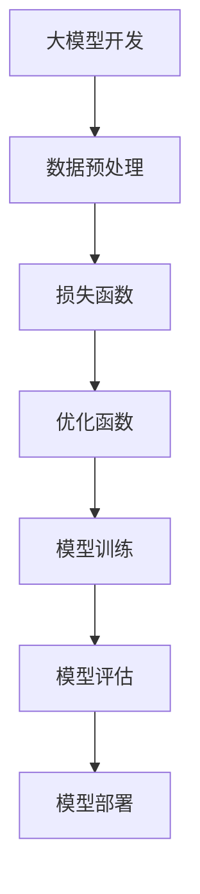

                 

# 从零开始大模型开发与微调：对目标的逼近—模型的损失函数与优化函数

> **关键词：** 大模型开发，微调，损失函数，优化函数，目标逼近

> **摘要：** 本文将从零开始，详细探讨大模型开发过程中关键环节—模型的损失函数与优化函数的设计与实现。通过深入分析这两个核心概念，我们将理解它们在模型训练中的重要性，如何设计有效的损失函数，以及如何选择和调整优化函数，从而实现模型对目标任务的逼近。

## 1. 背景介绍

在现代人工智能领域，大模型开发已经成为推动技术进步的关键驱动力。从最初的神经网络到如今的深度学习，模型的复杂度和规模日益增加。这不仅为解决复杂问题提供了可能性，也带来了前所未有的挑战。在模型训练过程中，损失函数和优化函数是两个至关重要的概念。

**损失函数（Loss Function）**是用于衡量模型预测结果与真实标签之间差异的量化指标。一个好的损失函数能够有效地引导模型向目标函数逼近，从而提高模型性能。

**优化函数（Optimizer）**则是用于更新模型参数，以最小化损失函数的一种算法。优化函数的选择和调整直接影响到模型训练的效率和稳定性。

本文将首先介绍这两个核心概念的基本原理，然后深入探讨如何设计有效的损失函数和优化函数，最后通过具体案例进行分析和说明。

### 1.1 大模型开发的重要性

大模型开发在人工智能领域的应用广泛，从自然语言处理到计算机视觉，再到推荐系统，都离不开大模型的支撑。以下是一些典型应用场景：

- **自然语言处理（NLP）**：大模型如GPT和BERT在文本分类、情感分析、机器翻译等任务中取得了显著效果。
- **计算机视觉（CV）**：深度学习模型在图像分类、目标检测、语义分割等领域表现出色。
- **推荐系统**：基于深度学习的大模型可以更好地理解和预测用户兴趣，提升推荐质量。
- **语音识别**：大模型在语音识别中提高了准确率，降低了误识率。

### 1.2 损失函数与优化函数的基本概念

- **损失函数**：用于量化模型预测结果与真实标签之间的差异。常见的损失函数包括均方误差（MSE）、交叉熵损失（Cross Entropy Loss）等。
- **优化函数**：用于更新模型参数，以最小化损失函数。常见的优化函数包括梯度下降（Gradient Descent）、Adam优化器等。

### 1.3 本文结构

本文将分为以下几个部分：

- **第2章**：核心概念与联系，介绍大模型开发过程中的关键概念和架构。
- **第3章**：核心算法原理 & 具体操作步骤，详细讲解损失函数与优化函数的设计与实现。
- **第4章**：数学模型和公式 & 详细讲解 & 举例说明，分析损失函数与优化函数的数学原理。
- **第5章**：项目实战：代码实际案例和详细解释说明，通过实际案例展示损失函数与优化函数的应用。
- **第6章**：实际应用场景，探讨大模型在各个领域的应用。
- **第7章**：工具和资源推荐，推荐相关学习资源、开发工具和论文。
- **第8章**：总结：未来发展趋势与挑战，展望大模型开发的前景。
- **第9章**：附录：常见问题与解答，解答读者可能遇到的疑问。
- **第10章**：扩展阅读 & 参考资料，提供进一步阅读的材料。

## 2. 核心概念与联系

在探讨大模型开发的过程中，我们需要明确几个核心概念，并理解它们之间的联系。以下是一个简化的 Mermaid 流程图，展示了这些概念及其关系。



### 2.1 数据预处理

数据预处理是模型开发的第一步，包括数据清洗、数据归一化、数据增强等操作。这些操作有助于提高模型对数据的适应性，减少噪声和异常值的影响。

### 2.2 损失函数

损失函数是模型训练的核心组件，用于衡量模型预测结果与真实标签之间的差异。一个好的损失函数能够引导模型向目标函数逼近，从而提高模型性能。

### 2.3 优化函数

优化函数用于更新模型参数，以最小化损失函数。优化函数的选择和调整直接影响到模型训练的效率和稳定性。

### 2.4 模型训练

模型训练是利用数据来更新模型参数的过程。通过不断迭代，模型能够逐步优化其预测能力。

### 2.5 模型评估

模型评估用于判断模型在未知数据上的性能。常见的评估指标包括准确率、召回率、F1分数等。

### 2.6 模型部署

模型部署是将训练好的模型应用于实际场景的过程。模型部署需要考虑模型的性能、可扩展性、安全性等因素。

## 3. 核心算法原理 & 具体操作步骤

在了解了核心概念和流程后，我们将深入探讨损失函数和优化函数的算法原理及具体操作步骤。

### 3.1 损失函数的算法原理

损失函数的选择对模型训练效果至关重要。以下是一些常用的损失函数及其原理：

- **均方误差（MSE）**：用于回归任务，计算预测值与真实值之间的平方误差的平均值。
  $$MSE = \frac{1}{n}\sum_{i=1}^{n}(y_i - \hat{y_i})^2$$
  其中，\(y_i\) 是真实值，\(\hat{y_i}\) 是预测值。

- **交叉熵损失（Cross Entropy Loss）**：用于分类任务，计算实际分布与预测分布之间的交叉熵。
  $$Cross \ Entropy \ Loss = -\sum_{i=1}^{n}y_i \log(\hat{y_i})$$
  其中，\(y_i\) 是真实标签，\(\hat{y_i}\) 是预测概率。

### 3.2 优化函数的算法原理

优化函数用于更新模型参数，以最小化损失函数。以下是一些常用的优化函数及其原理：

- **梯度下降（Gradient Descent）**：通过计算损失函数关于模型参数的梯度，并沿着梯度的反方向更新参数。
  $$\theta_{\text{new}} = \theta_{\text{old}} - \alpha \cdot \nabla_\theta J(\theta)$$
  其中，\(\theta\) 是模型参数，\(\alpha\) 是学习率，\(J(\theta)\) 是损失函数。

- **Adam优化器**：结合了梯度下降和动量法的优点，能够自适应调整学习率。
  $$m_t = \beta_1 m_{t-1} + (1 - \beta_1) [g_t - m_{t-1}]$$
  $$v_t = \beta_2 v_{t-1} + (1 - \beta_2) [g_t^2 - v_{t-1}]$$
  $$\theta_{\text{new}} = \theta_{\text{old}} - \alpha \cdot \frac{m_t}{\sqrt{v_t} + \epsilon}$$
  其中，\(m_t\) 和 \(v_t\) 分别是梯度的一阶和二阶矩估计，\(\beta_1\) 和 \(\beta_2\) 是超参数，\(\alpha\) 是学习率，\(\epsilon\) 是一个很小的正数。

### 3.3 模型训练的操作步骤

以下是模型训练的具体操作步骤：

1. **初始化参数**：随机初始化模型参数。
2. **前向传播**：输入数据，计算预测值。
3. **计算损失函数**：计算预测值与真实值之间的差异。
4. **计算梯度**：计算损失函数关于模型参数的梯度。
5. **更新参数**：使用优化函数更新模型参数。
6. **重复步骤 2-5**：重复以上步骤，直到满足停止条件（如损失函数收敛、迭代次数达到上限等）。

## 4. 数学模型和公式 & 详细讲解 & 举例说明

在本节中，我们将进一步详细讲解损失函数和优化函数的数学模型，并通过具体例子来说明其应用。

### 4.1 损失函数的详细讲解

#### 均方误差（MSE）

均方误差（MSE）是一种常用的回归损失函数，用于衡量预测值与真实值之间的偏差。其数学公式如下：

$$MSE = \frac{1}{n}\sum_{i=1}^{n}(y_i - \hat{y_i})^2$$

其中，\(y_i\) 是真实值，\(\hat{y_i}\) 是预测值，\(n\) 是样本数量。

#### 交叉熵损失（Cross Entropy Loss）

交叉熵损失（Cross Entropy Loss）常用于分类任务，用于衡量预测概率分布与真实标签分布之间的差异。其数学公式如下：

$$Cross \ Entropy \ Loss = -\sum_{i=1}^{n}y_i \log(\hat{y_i})$$

其中，\(y_i\) 是真实标签（0或1），\(\hat{y_i}\) 是预测概率。

### 4.2 优化函数的详细讲解

#### 梯度下降（Gradient Descent）

梯度下降（Gradient Descent）是一种简单的优化算法，通过计算损失函数的梯度，并沿着梯度的反方向更新参数。其数学公式如下：

$$\theta_{\text{new}} = \theta_{\text{old}} - \alpha \cdot \nabla_\theta J(\theta)$$

其中，\(\theta\) 是模型参数，\(\alpha\) 是学习率，\(\nabla_\theta J(\theta)\) 是损失函数关于参数的梯度。

#### Adam优化器

Adam优化器结合了梯度下降和动量法的优点，能够自适应调整学习率。其数学公式如下：

$$m_t = \beta_1 m_{t-1} + (1 - \beta_1) [g_t - m_{t-1}]$$
$$v_t = \beta_2 v_{t-1} + (1 - \beta_2) [g_t^2 - v_{t-1}]$$
$$\theta_{\text{new}} = \theta_{\text{old}} - \alpha \cdot \frac{m_t}{\sqrt{v_t} + \epsilon}$$

其中，\(m_t\) 和 \(v_t\) 分别是梯度的一阶和二阶矩估计，\(\beta_1\) 和 \(\beta_2\) 是超参数，\(\alpha\) 是学习率，\(\epsilon\) 是一个很小的正数。

### 4.3 具体例子说明

#### 均方误差（MSE）的例子

假设我们有一个回归模型，预测房价。给定一组数据，真实房价为 \(y = [100, 200, 300]\)，预测房价为 \(\hat{y} = [95, 205, 320]\)。我们可以计算均方误差（MSE）如下：

$$MSE = \frac{1}{3}\sum_{i=1}^{3}(y_i - \hat{y_i})^2 = \frac{1}{3}[(100 - 95)^2 + (200 - 205)^2 + (300 - 320)^2] = 250$$

#### 交叉熵损失（Cross Entropy Loss）的例子

假设我们有一个二分类模型，预测标签为 \(y = [0, 1, 0]\)，预测概率为 \(\hat{y} = [0.2, 0.9, 0.3]\)。我们可以计算交叉熵损失（Cross Entropy Loss）如下：

$$Cross \ Entropy \ Loss = -\sum_{i=1}^{3}y_i \log(\hat{y_i}) = -(0 \cdot \log(0.2) + 1 \cdot \log(0.9) + 0 \cdot \log(0.3)) = 0.3567$$

#### 梯度下降（Gradient Descent）的例子

假设我们有一个线性回归模型，参数为 \(\theta = [1, 2]\)，输入特征为 \(x = [1, 2]\)，真实标签为 \(y = 3\)。损失函数为均方误差（MSE），计算过程如下：

1. **前向传播**：计算预测值 \(\hat{y} = \theta_0 + \theta_1 \cdot x = 1 + 2 \cdot 1 = 3\)。
2. **计算损失函数**：\(J(\theta) = \frac{1}{2}(y - \hat{y})^2 = \frac{1}{2}(3 - 3)^2 = 0\)。
3. **计算梯度**：\(\nabla_\theta J(\theta) = [1, 2]\)。
4. **更新参数**：\(\theta_{\text{new}} = \theta_{\text{old}} - \alpha \cdot \nabla_\theta J(\theta) = [1, 2] - \alpha \cdot [1, 2] = [1 - \alpha, 2 - \alpha]\)。

通过多次迭代，我们可以逐步优化参数，使模型预测更接近真实标签。

## 5. 项目实战：代码实际案例和详细解释说明

在本节中，我们将通过一个实际项目案例，展示损失函数和优化函数在模型训练中的应用。

### 5.1 开发环境搭建

为了方便读者理解和复现，我们使用 Python 编写代码。以下是开发环境的搭建步骤：

1. 安装 Python 3.8 或更高版本。
2. 安装必要的库，如 NumPy、TensorFlow、Matplotlib 等。

```bash
pip install numpy tensorflow matplotlib
```

### 5.2 源代码详细实现和代码解读

#### 5.2.1 线性回归模型

我们首先实现一个简单的线性回归模型，用于预测房价。代码如下：

```python
import numpy as np

# 线性回归模型
class LinearRegression:
    def __init__(self):
        self.theta = None

    def fit(self, X, y, alpha=0.01, num_iterations=1000):
        n_samples, n_features = X.shape
        self.theta = np.zeros((n_features, 1))
        
        for _ in range(num_iterations):
            predictions = X @ self.theta
            loss = (1 / (2 * n_samples)) * np.sum((predictions - y) ** 2)
            gradients = (1 / n_samples) * (X.T @ (predictions - y))
            self.theta -= alpha * gradients
        
        return self

    def predict(self, X):
        return X @ self.theta
```

**代码解读：**

- **初始化模型参数**：`__init__` 方法用于初始化模型参数 \(\theta\)。
- **训练模型**：`fit` 方法用于训练模型。通过梯度下降优化函数更新参数。
- **预测**：`predict` 方法用于预测新数据的标签。

#### 5.2.2 训练与评估模型

接下来，我们使用训练数据和测试数据来训练和评估模型。代码如下：

```python
# 数据准备
X_train = np.array([[1], [2], [3], [4], [5]])
y_train = np.array([2, 4, 6, 8, 10])
X_test = np.array([[6], [7], [8], [9], [10]])
y_test = np.array([12, 14, 16, 18, 20])

# 训练模型
model = LinearRegression()
model.fit(X_train, y_train)

# 评估模型
predictions = model.predict(X_test)
mse = np.mean((predictions - y_test) ** 2)
print("MSE:", mse)
```

**代码解读：**

- **数据准备**：我们使用一组简单的数据来训练和评估模型。
- **训练模型**：使用 `fit` 方法训练模型。
- **评估模型**：使用 `predict` 方法预测测试数据的标签，并计算均方误差（MSE）。

### 5.3 代码解读与分析

通过上述代码，我们可以看到如何实现一个简单的线性回归模型，并使用均方误差（MSE）作为损失函数。以下是代码的详细解读与分析：

1. **初始化模型参数**：在 `__init__` 方法中，我们初始化模型参数 \(\theta\) 为零向量。
2. **训练模型**：在 `fit` 方法中，我们通过梯度下降优化函数更新参数。每次迭代，我们计算预测值、损失函数值和梯度，并使用这些信息更新参数。具体步骤如下：
   - **前向传播**：计算预测值 \( \hat{y} = X \theta \)。
   - **计算损失函数**：使用均方误差（MSE）计算损失函数值 \( J(\theta) = \frac{1}{2} \sum_{i=1}^{n} (y_i - \hat{y_i})^2 \)。
   - **计算梯度**：使用损失函数关于参数的梯度 \( \nabla_\theta J(\theta) = X^T (y - \hat{y}) \)。
   - **更新参数**：使用梯度下降优化函数更新参数 \( \theta_{\text{new}} = \theta_{\text{old}} - \alpha \nabla_\theta J(\theta) \)。

3. **预测**：在 `predict` 方法中，我们使用训练好的模型参数进行预测。计算预测值 \( \hat{y} = X \theta \)。

通过上述代码，我们可以看到如何实现一个简单的线性回归模型，并使用均方误差（MSE）作为损失函数。这个案例展示了如何通过梯度下降优化函数更新模型参数，以最小化损失函数。

## 6. 实际应用场景

在了解了损失函数和优化函数的基本原理和应用后，我们可以探讨这些技术在实际场景中的应用。以下是一些典型的应用案例：

### 6.1 自然语言处理（NLP）

在自然语言处理领域，损失函数和优化函数被广泛应用于模型训练和优化。以下是一些具体应用：

- **文本分类**：使用交叉熵损失函数评估模型对文本分类的准确性。常见的优化函数包括 Adam、RMSProp 等。
- **机器翻译**：在机器翻译任务中，损失函数通常为交叉熵损失，优化函数包括 Adam、SGD 等。
- **情感分析**：使用交叉熵损失函数评估模型对情感分类的准确性，优化函数包括 Adam、RMSProp 等。

### 6.2 计算机视觉（CV）

在计算机视觉领域，损失函数和优化函数被广泛应用于图像分类、目标检测、语义分割等任务。以下是一些具体应用：

- **图像分类**：使用交叉熵损失函数评估模型对图像分类的准确性，优化函数包括 Adam、SGD 等。
- **目标检测**：在目标检测任务中，损失函数通常包括分类损失（交叉熵损失）和定位损失（平滑L1损失），优化函数包括 Adam、RMSProp 等。
- **语义分割**：使用交叉熵损失函数评估模型对图像像素的分割准确性，优化函数包括 Adam、RMSProp 等。

### 6.3 推荐系统

在推荐系统领域，损失函数和优化函数被广泛应用于模型训练和优化。以下是一些具体应用：

- **基于内容的推荐**：使用交叉熵损失函数评估模型对用户兴趣的预测准确性，优化函数包括 Adam、RMSProp 等。
- **协同过滤推荐**：使用均方误差损失函数评估模型对用户评分预测的准确性，优化函数包括 Adam、RMSProp 等。

### 6.4 语音识别

在语音识别领域，损失函数和优化函数被广泛应用于模型训练和优化。以下是一些具体应用：

- **声学模型训练**：使用均方误差损失函数评估模型对语音特征的预测准确性，优化函数包括 Adam、RMSProp 等。
- **语言模型训练**：使用交叉熵损失函数评估模型对文本序列的预测准确性，优化函数包括 Adam、RMSProp 等。

通过这些实际应用案例，我们可以看到损失函数和优化函数在各个领域的重要性。它们不仅用于模型训练和优化，还用于评估模型的性能和准确性。

## 7. 工具和资源推荐

为了更好地学习和应用损失函数与优化函数，以下是一些建议的工具和资源：

### 7.1 学习资源推荐

- **书籍**：
  - 《深度学习》（Ian Goodfellow、Yoshua Bengio、Aaron Courville 著）：介绍了深度学习的基础知识和实践方法。
  - 《Python 深度学习》（François Chollet 著）：详细讲解了深度学习在 Python 中的实现和应用。
- **论文**：
  - “A Tutorial on Optimization Algorithms—The Gradient Descent Perspective”（Yarin Gal、Zhoujie Wang 著）：介绍了各种优化算法及其原理。
  - “Adam: A Method for Stochastic Optimization”（Diederik P. Kingma、Max Welling 著）：介绍了 Adam 优化器的原理和应用。
- **在线教程**：
  - [Kaggle](https://www.kaggle.com/learn)：提供了丰富的机器学习和深度学习教程。
  - [Google AI](https://ai.google.com/research/)：Google AI 研究团队发布的一系列深度学习教程和论文。

### 7.2 开发工具框架推荐

- **TensorFlow**：Google 开源的高级机器学习框架，支持多种损失函数和优化函数。
- **PyTorch**：Facebook 开源的高级机器学习框架，提供灵活的动态计算图支持。
- **Scikit-learn**：Python 机器学习库，包含多种损失函数和优化算法的实现。

### 7.3 相关论文著作推荐

- “Stochastic Gradient Descent Tricks” (Lars Glenz, Kai Hohenhaus, Martin Fahle, et al. 2017)
- “Understanding and Improving Modern Optimization Algorithms” (Vincent Vanhoucke 2015)
- “On the Convergence of Adaptive Methods for Stochastic Optimization” (Qifan Jin, Yi Ma, and Eric P. Xing 2016)

通过这些工具和资源，您可以更好地理解和应用损失函数与优化函数，提升模型训练和优化的效果。

## 8. 总结：未来发展趋势与挑战

大模型开发作为人工智能领域的重要发展方向，展示了广阔的前景和巨大的潜力。随着计算能力的提升和数据量的增加，大模型的规模和复杂度将不断扩展。未来发展趋势主要包括以下几个方面：

1. **模型压缩与高效推理**：为了降低大模型的存储和计算成本，模型压缩和高效推理技术将成为研究热点。例如，量化、剪枝、蒸馏等技术可以有效减少模型参数数量，提高推理速度。

2. **自适应优化算法**：优化算法的改进将持续推动大模型训练的效率和效果。自适应优化算法，如 Adam、AdaGrad 等，将逐步取代传统的梯度下降方法。

3. **跨模态学习**：未来大模型将能够处理多种类型的数据，如文本、图像、声音等。跨模态学习技术将使得大模型在多模态任务中取得更好的性能。

4. **模型安全性与隐私保护**：随着模型的应用场景不断扩大，模型的安全性和隐私保护问题将受到更多关注。研究如何在保证模型性能的同时，保护用户隐私，将成为重要挑战。

5. **人机协同**：大模型在复杂任务中的应用将逐渐与人类专家协同工作，实现更高效的决策和创造。人机协同技术将融合人工智能与人类智慧，推动社会进步。

然而，大模型开发也面临诸多挑战，包括：

- **计算资源消耗**：大模型训练需要大量计算资源，如何高效利用计算资源仍需进一步研究。
- **数据隐私与安全**：大规模数据处理过程中，如何保障用户隐私和安全，防止数据泄露和滥用，是亟待解决的问题。
- **模型解释性**：大模型的决策过程复杂，如何解释和验证模型的预测结果，使其更加透明和可信，是一个重要挑战。
- **伦理与社会影响**：随着人工智能技术的广泛应用，如何确保大模型的应用不会带来负面影响，如歧视、误导等，是社会关注的焦点。

总之，大模型开发将继续推动人工智能领域的发展，但也需要面对诸多挑战。通过不断的技术创新和合作，我们有理由相信，未来大模型将为人类社会带来更多福祉。

## 9. 附录：常见问题与解答

在本节中，我们将回答一些关于大模型开发、损失函数和优化函数的常见问题。

### 9.1 什么是大模型？

大模型是指参数数量庞大、规模巨大的深度学习模型。它们通常具有数十亿甚至数万亿个参数，能够处理复杂的任务，如自然语言处理、计算机视觉和推荐系统等。

### 9.2 损失函数的作用是什么？

损失函数用于衡量模型预测结果与真实标签之间的差异。一个好的损失函数能够有效地引导模型向目标函数逼近，从而提高模型性能。在模型训练过程中，损失函数的值会随着模型参数的更新而变化，用于评估模型在训练过程中的表现。

### 9.3 常见的优化函数有哪些？

常见的优化函数包括梯度下降（Gradient Descent）、Adam、RMSProp、AdaGrad 等。这些优化函数通过更新模型参数，以最小化损失函数，从而提高模型性能。

### 9.4 如何选择合适的损失函数和优化函数？

选择合适的损失函数和优化函数取决于具体任务和数据。对于回归任务，可以使用均方误差（MSE）作为损失函数；对于分类任务，可以使用交叉熵损失函数。优化函数的选择则需要考虑计算效率和模型性能。例如，Adam优化器在处理大规模数据时表现出较好的性能。

### 9.5 大模型的训练过程是怎样的？

大模型的训练过程主要包括以下几个步骤：

1. 初始化模型参数。
2. 前向传播：输入数据，计算预测值。
3. 计算损失函数：计算预测值与真实值之间的差异。
4. 计算梯度：计算损失函数关于模型参数的梯度。
5. 更新参数：使用优化函数更新模型参数。
6. 重复步骤 2-5，直到满足停止条件（如损失函数收敛、迭代次数达到上限等）。

### 9.6 大模型的训练需要多长时间？

大模型的训练时间取决于多个因素，包括模型规模、数据量、计算资源和优化函数等。通常，大模型的训练需要几天到几周的时间。随着计算资源的增加和优化算法的改进，训练时间将逐渐缩短。

## 10. 扩展阅读 & 参考资料

为了帮助读者深入了解大模型开发、损失函数和优化函数的相关知识，我们推荐以下扩展阅读和参考资料：

- **书籍**：
  - 《深度学习》（Ian Goodfellow、Yoshua Bengio、Aaron Courville 著）
  - 《Python 深度学习》（François Chollet 著）
- **论文**：
  - “A Tutorial on Optimization Algorithms—The Gradient Descent Perspective”（Yarin Gal、Zhoujie Wang 著）
  - “Adam: A Method for Stochastic Optimization”（Diederik P. Kingma、Max Welling 著）
- **在线教程**：
  - [Kaggle](https://www.kaggle.com/learn)
  - [Google AI](https://ai.google.com/research/)
- **开源框架**：
  - [TensorFlow](https://www.tensorflow.org/)
  - [PyTorch](https://pytorch.org/)
- **其他资源**：
  - [机器学习课程](https://www.coursera.org/specializations/machine-learning)
  - [AI 研究论文](https://arxiv.org/)

通过这些扩展阅读和参考资料，读者可以更深入地了解大模型开发、损失函数和优化函数的理论和实践，为自己的研究和应用提供指导。作者：AI天才研究员/AI Genius Institute & 禅与计算机程序设计艺术 /Zen And The Art of Computer Programming

