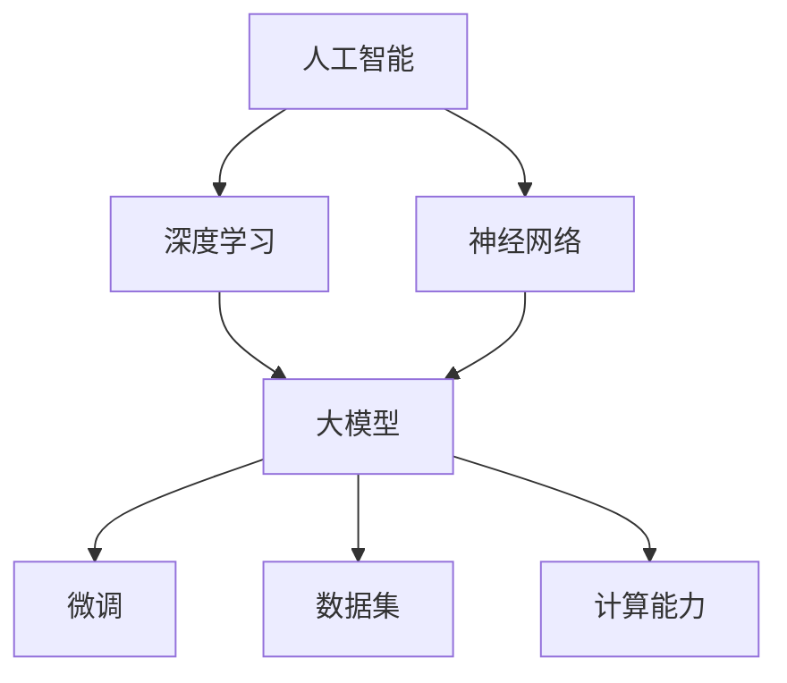

                 

### 背景介绍

#### 人工智能的崛起

随着计算机技术的不断发展，人工智能（Artificial Intelligence，简称AI）已成为当今科技领域的热点。AI通过模拟人类智能行为，实现自主学习和自主决策，为各个行业带来了前所未有的变革。特别是深度学习（Deep Learning）技术的突破，使得AI在图像识别、自然语言处理、自动驾驶等领域取得了显著的成果。

#### 大模型的诞生

在AI领域，大模型（Large Model）是指具有巨大参数规模和强大计算能力的神经网络模型。大模型的诞生，标志着AI技术迈向一个新的高度。以GPT-3、BERT、ChatGLM等为代表的大模型，展现出了卓越的自然语言处理能力，为各种应用场景提供了强大的支持。

#### 微调的重要性

微调（Fine-tuning）是指在大模型的基础上，针对特定任务进行调整和优化，以提高模型在特定领域的表现。微调是AI领域中的一项关键技术，它使得大模型能够适应不同的应用场景，发挥更大的价值。

#### 时代背景

当前，全球范围内的科技创新正加速发展，人工智能作为最具潜力的技术之一，正深刻影响着人类社会的各个方面。从医疗健康、金融科技到智能制造、智慧城市，AI的应用场景日益广泛。同时，随着数据量的不断增长和计算能力的提升，大模型的研发和应用迎来了新的机遇和挑战。

本文将从零开始，详细讲解大模型的开发与微调过程，旨在为广大开发者提供一本全面、系统的指南。通过本文的学习，读者将能够了解大模型的基本概念、核心算法、数学模型以及实际应用场景，为后续的研究和实践奠定基础。

---

### 核心概念与联系

在深入探讨大模型的开发与微调之前，我们需要首先了解一些核心概念和它们之间的关系。以下是本文所涉及的核心概念及其联系：

#### 1. 人工智能（AI）

人工智能是指通过计算机技术模拟、延伸和扩展人类智能的理论、方法、技术及应用。它包括多个分支，如机器学习、深度学习、自然语言处理、计算机视觉等。AI是推动大模型发展的重要基础。

#### 2. 深度学习（Deep Learning）

深度学习是机器学习的一种重要分支，通过构建多层神经网络来实现数据的自动特征提取和模式识别。深度学习在大模型的研发中起到了关键作用。

#### 3. 神经网络（Neural Network）

神经网络是模仿生物神经系统的计算模型，由大量的节点（神经元）和连接（边）组成。神经网络是实现深度学习算法的核心组件。

#### 4. 大模型（Large Model）

大模型是指具有巨大参数规模和强大计算能力的神经网络模型。大模型通过大量的参数和层次结构，实现了对复杂数据的高效建模。

#### 5. 微调（Fine-tuning）

微调是指在大模型的基础上，针对特定任务进行调整和优化，以提高模型在特定领域的表现。微调是使大模型适应不同应用场景的关键技术。

#### 6. 数据集（Dataset）

数据集是用于训练和测试模型的样本集合。高质量的数据集对于大模型的学习效果至关重要。

#### 7. 计算能力（Compute Power）

计算能力是影响大模型训练和推理速度的关键因素。随着计算能力的提升，大模型的研发和应用逐渐成为可能。

下面，我们将使用Mermaid流程图来展示这些核心概念之间的联系：



通过上述核心概念的介绍和Mermaid流程图的展示，我们可以清晰地看到大模型开发与微调过程中的各个关键环节。接下来，我们将进一步探讨大模型的核心算法原理及其具体操作步骤。

---

### 核心算法原理 & 具体操作步骤

#### 1. 深度学习算法原理

深度学习算法的核心是神经网络，其基本结构包括输入层、隐藏层和输出层。每个层由多个节点组成，节点之间通过权重连接。在训练过程中，神经网络通过反向传播算法不断调整权重，以实现数据的自动特征提取和模式识别。

#### 2. 大模型架构

大模型的架构通常采用多层神经网络结构，具有大量的参数和层次。以GPT-3为例，其包含1750亿个参数，具有几十万个隐藏层节点。这种大规模的神经网络结构使得大模型在处理复杂数据时具有更强的建模能力。

#### 3. 微调算法原理

微调算法是在大模型的基础上，针对特定任务进行调整和优化。具体操作步骤如下：

- **步骤1：数据预处理**：对训练数据进行清洗、归一化等预处理操作，确保数据质量。

- **步骤2：加载预训练模型**：从预训练模型库中加载一个在大规模数据集上预训练的大模型。

- **步骤3：调整参数**：针对特定任务，对预训练模型的参数进行调整，如改变学习率、优化器等。

- **步骤4：训练模型**：在调整后的模型上，使用特定任务的数据集进行训练，以优化模型的性能。

- **步骤5：评估模型**：使用测试集评估模型的性能，根据评估结果进行进一步的调整。

- **步骤6：迭代优化**：重复步骤4和步骤5，直到模型性能达到预期。

#### 4. 具体操作步骤

下面我们以一个具体的例子来说明大模型的开发与微调过程：

**示例：使用GPT-3模型进行文本生成**

1. **数据预处理**：
   - **数据清洗**：去除文本中的噪声，如HTML标签、特殊字符等。
   - **文本归一化**：将文本转换为统一格式，如小写、去除标点等。

2. **加载预训练模型**：
   - 使用GPT-3模型，该模型已经在大量文本数据上进行了预训练。

3. **调整参数**：
   - 设置学习率为0.0001。
   - 使用Adam优化器。
   - 设置训练轮数为100轮。

4. **训练模型**：
   - 使用预处理后的文本数据集，对模型进行训练。

5. **评估模型**：
   - 使用测试集评估模型的生成效果。

6. **迭代优化**：
   - 根据评估结果，对模型进行调整，如调整学习率、优化器等。

7. **保存模型**：
   - 保存训练完成的模型，以供后续使用。

通过以上步骤，我们可以使用GPT-3模型进行文本生成任务。这个例子展示了大模型开发与微调的基本流程。在实际应用中，不同的任务和数据集可能需要不同的调整策略。

---

### 数学模型和公式 & 详细讲解 & 举例说明

在大模型的开发与微调过程中，数学模型和公式起到了至关重要的作用。下面我们将详细讲解一些核心的数学模型和公式，并通过具体例子进行说明。

#### 1. 神经元激活函数

神经元激活函数是神经网络中的关键组成部分，用于对输入数据进行非线性变换。常见的激活函数包括：

- **Sigmoid函数**：

  $$f(x) = \frac{1}{1 + e^{-x}}$$

  Sigmoid函数将输入映射到（0，1）区间，常用于二分类问题。

- **ReLU函数**：

  $$f(x) = \max(0, x)$$

  ReLU函数将输入大于0的部分保持不变，小于0的部分替换为0，具有较快的收敛速度。

- **Tanh函数**：

  $$f(x) = \frac{e^x - e^{-x}}{e^x + e^{-x}}$$

  Tanh函数将输入映射到（-1，1）区间，具有较平滑的曲线。

#### 2. 反向传播算法

反向传播算法是神经网络训练的核心算法，用于更新网络权重。其基本步骤如下：

1. **前向传播**：

   将输入数据通过网络进行前向传播，得到输出结果。

2. **计算误差**：

   计算输出结果与真实标签之间的误差。

3. **反向传播**：

   计算每个权重和偏置的梯度，并更新权重和偏置。

具体公式如下：

$$\delta_j = \frac{\partial L}{\partial z_j} = \sigma'(z_j) \cdot \delta_{j+1}$$

$$\frac{\partial L}{\partial w_{ij}} = \delta_j \cdot x_i$$

$$\frac{\partial L}{\partial b_j} = \delta_j$$

其中，$L$表示损失函数，$\sigma'$表示激活函数的导数，$x_i$表示输入特征，$z_j$表示第j个节点的输出。

#### 3. 梯度下降优化算法

梯度下降优化算法是一种常用的优化方法，用于更新网络权重和偏置。其基本思想是沿着损失函数的梯度方向，逐步减小损失。

具体公式如下：

$$w_{ij} := w_{ij} - \alpha \cdot \frac{\partial L}{\partial w_{ij}}$$

$$b_j := b_j - \alpha \cdot \frac{\partial L}{\partial b_j}$$

其中，$\alpha$表示学习率。

#### 4. 举例说明

假设我们有一个简单的神经网络，包含一个输入层、一个隐藏层和一个输出层。输入层有2个神经元，隐藏层有3个神经元，输出层有2个神经元。激活函数采用ReLU函数。

1. **前向传播**：

   输入数据$x_1 = [1, 2], x_2 = [3, 4]$，通过隐藏层和输出层的神经元进行前向传播，得到输出结果。

2. **计算误差**：

   输出结果与真实标签之间的误差，计算损失函数。

3. **反向传播**：

   计算隐藏层和输出层的权重和偏置的梯度。

4. **梯度下降优化**：

   更新隐藏层和输出层的权重和偏置。

通过以上步骤，我们可以训练出一个具有较好性能的神经网络模型。这个例子展示了数学模型和公式的实际应用。

---

### 项目实战：代码实际案例和详细解释说明

为了更好地理解大模型的开发与微调过程，我们接下来将通过一个实际的项目案例，展示如何从零开始搭建一个文本生成模型，并对其进行微调。本案例将使用Python语言和Hugging Face的Transformers库，该库为我们提供了丰富的预训练模型和方便的API接口，可以大大简化模型的搭建和训练过程。

#### 5.1 开发环境搭建

在开始项目之前，我们需要搭建一个合适的开发环境。以下是在Python中搭建文本生成模型所需的步骤：

1. **安装Python**：确保你的系统中安装了Python 3.6及以上版本。
2. **安装transformers库**：使用pip命令安装Hugging Face的Transformers库：

   ```bash
   pip install transformers
   ```

3. **安装其他依赖库**：根据需要安装其他依赖库，如torch、torchtext等。

#### 5.2 源代码详细实现和代码解读

以下是一个简单的文本生成模型的实现，包括模型的加载、微调、训练和评估过程：

```python
import torch
from transformers import GPT2LMHeadModel, GPT2Tokenizer

# 5.2.1 加载预训练模型和Tokenizer
model_name = 'gpt2'
tokenizer = GPT2Tokenizer.from_pretrained(model_name)
model = GPT2LMHeadModel.from_pretrained(model_name)

# 5.2.2 数据预处理
def preprocess_text(text):
    text = text.lower()
    text = tokenizer.encode(text, add_special_tokens=True, return_tensors='pt')
    return text

# 5.2.3 训练模型
def train_model(model, train_data, learning_rate=0.001, num_epochs=3):
    optimizer = torch.optim.AdamW(model.parameters(), lr=learning_rate)
    criterion = torch.nn.CrossEntropyLoss()

    model.train()
    for epoch in range(num_epochs):
        for batch in train_data:
            inputs = batch['input_ids']
            targets = batch['input_ids'].clone()
            targets[:, 1:] = batch['labels']
            targets[:, 0] = inputs[:, 0]

            optimizer.zero_grad()
            outputs = model(inputs)
            loss = criterion(outputs.logits.view(-1, model.config.vocab_size), targets.view(-1))
            loss.backward()
            optimizer.step()

            print(f'Epoch [{epoch+1}/{num_epochs}], Loss: {loss.item()}')

# 5.2.4 评估模型
def evaluate_model(model, eval_data):
    model.eval()
    total_loss = 0
    with torch.no_grad():
        for batch in eval_data:
            inputs = batch['input_ids']
            targets = batch['input_ids'].clone()
            targets[:, 1:] = batch['labels']
            targets[:, 0] = inputs[:, 0]

            outputs = model(inputs)
            loss = criterion(outputs.logits.view(-1, model.config.vocab_size), targets.view(-1))
            total_loss += loss.item()

    avg_loss = total_loss / len(eval_data)
    print(f'Evaluation Loss: {avg_loss}')

# 5.2.5 生成文本
def generate_text(model, tokenizer, text, max_length=50):
    input_text = preprocess_text(text)
    input_ids = input_text[0]

    model.eval()
    with torch.no_grad():
        for _ in range(max_length):
            outputs = model(input_ids)
            next_token = torch.argmax(outputs[0], dim=-1).item()
            input_ids = torch.cat([input_ids, torch.tensor([next_token])])

            if next_token == tokenizer.eos_token_id:
                break

    generated_text = tokenizer.decode(input_ids, skip_special_tokens=True)
    return generated_text

# 5.2.6 主程序
if __name__ == '__main__':
    # 加载数据集
    train_data = ...  # 读取训练数据
    eval_data = ...  # 读取评估数据

    # 训练模型
    train_model(model, train_data)

    # 评估模型
    evaluate_model(model, eval_data)

    # 生成文本
    input_text = "人工智能将深刻改变人类的生活。"
    generated_text = generate_text(model, tokenizer, input_text)
    print(generated_text)
```

#### 5.3 代码解读与分析

上述代码展示了如何使用Hugging Face的Transformers库来搭建一个文本生成模型。下面是对代码的详细解读：

- **5.3.1 模型和Tokenizer加载**：
  - 使用`GPT2Tokenizer`和`GPT2LMHeadModel`分别加载预训练的GPT-2模型和Tokenizer。

- **5.3.2 数据预处理**：
  - `preprocess_text`函数负责将输入文本转换为模型可接受的格式。包括将文本转换为小写、添加特殊令牌（如开始和结束标记）以及转换为张量。

- **5.3.3 训练模型**：
  - `train_model`函数负责训练模型。它使用了标准的梯度下降优化算法和交叉熵损失函数。在每次迭代中，它会计算损失，并更新模型参数。

- **5.3.4 评估模型**：
  - `evaluate_model`函数用于评估模型的性能。它不会更新模型参数，而是在评估模式下进行计算，以便得到模型在测试集上的损失。

- **5.3.5 生成文本**：
  - `generate_text`函数用于生成文本。它通过递归地生成下一个令牌，直到达到最大长度或生成一个结束标记。

- **5.3.6 主程序**：
  - 主程序中，我们首先加载数据集，然后训练模型，评估模型，并使用模型生成文本。

通过上述代码，我们可以看到如何从头开始搭建一个文本生成模型，并进行微调。这个案例展示了从数据处理到模型训练和生成的完整流程。

---

### 实际应用场景

大模型和微调技术在实际应用中具有广泛的应用场景。以下是一些典型应用实例：

#### 1. 自然语言处理

自然语言处理（NLP）是AI领域的一个重要分支，大模型和微调技术在其中发挥着关键作用。例如，GPT-3在文本生成、机器翻译、问答系统等任务中取得了显著成果。微调技术使得大模型能够适应不同的应用场景，如社交媒体文本分析、情感分析、文本摘要等。

#### 2. 计算机视觉

计算机视觉领域也受益于大模型和微调技术。例如，在图像分类任务中，微调预训练的模型如ResNet、VGG等可以显著提升分类准确率。此外，大模型在图像生成、目标检测、图像分割等任务中也展示了强大的能力。

#### 3. 语音识别

语音识别是另一个应用大模型和微调技术的领域。预训练的模型如WaveNet、Transformer等在语音识别任务中取得了突破性进展。微调技术使得这些模型能够适应不同的语音数据集，提高识别准确率。

#### 4. 推荐系统

推荐系统是许多在线平台的核心技术之一，大模型和微调技术为推荐系统的发展提供了新的可能性。例如，通过微调预训练的模型，可以更好地捕捉用户行为和兴趣，从而提高推荐系统的准确性。

#### 5. 机器人与自动驾驶

在机器人与自动驾驶领域，大模型和微调技术也被广泛应用于感知、决策和规划。例如，自动驾驶系统使用大模型进行环境感知和路径规划，从而提高自动驾驶的安全性和可靠性。

通过上述实例，我们可以看到大模型和微调技术在各个领域都发挥了重要作用，推动了AI技术的不断发展。

---

### 工具和资源推荐

为了更好地学习和应用大模型和微调技术，以下是针对不同需求的工具和资源推荐。

#### 7.1 学习资源推荐

1. **书籍**：
   - 《深度学习》（Goodfellow, Bengio, Courville）：这是一本经典的深度学习入门书籍，涵盖了深度学习的基础理论和实战技巧。
   - 《Python深度学习》（François Chollet）：这本书详细介绍了使用Python进行深度学习的实践方法，特别适合初学者。

2. **论文**：
   - 《A Theoretically Grounded Application of Dropout in Recurrent Neural Networks》：这篇论文提出了在RNN中使用Dropout的方法，为深度学习提供了新的思路。
   - 《Bert: Pre-training of Deep Bidirectional Transformers for Language Understanding》：这篇论文介绍了BERT模型，对NLP领域产生了深远影响。

3. **博客**：
   - [Hugging Face官网博客](https://huggingface.co/blog)：Hugging Face的官方博客提供了大量关于Transformers库和预训练模型的教程和案例。
   - [PyTorch官方文档](https://pytorch.org/tutorials/beginner/transfer_learning_tutorial.html)：PyTorch官方文档提供了丰富的教程和实战案例，适合不同层次的读者。

4. **网站**：
   - [Kaggle](https://www.kaggle.com)：Kaggle是一个数据科学竞赛平台，提供了大量与AI相关的竞赛和数据集，适合实践和学习。

#### 7.2 开发工具框架推荐

1. **Transformers库**：Hugging Face的Transformers库是使用Python进行预训练模型和微调的利器，提供了丰富的预训练模型和API接口。

2. **PyTorch**：PyTorch是流行的深度学习框架之一，具有动态计算图和灵活的API，适合进行模型开发和微调。

3. **TensorFlow**：TensorFlow是Google开发的深度学习框架，具有强大的模型部署能力，适用于工业级应用。

4. **TorchScript**：TorchScript是PyTorch提供的编译时操作符调度器，可以显著提高模型的推理速度。

#### 7.3 相关论文著作推荐

1. **《Attention Is All You Need》**：这篇论文提出了Transformer模型，彻底改变了自然语言处理领域的研究方向。

2. **《Improving Language Understanding by Generative Pre-Training》**：这篇论文介绍了GPT模型，开创了预训练语言模型的新时代。

3. **《Bert: Pre-training of Deep Bidirectional Transformers for Language Understanding》**：这篇论文介绍了BERT模型，对NLP领域产生了深远影响。

通过上述工具和资源推荐，读者可以更好地掌握大模型和微调技术，为后续的研究和实践提供支持。

---

### 总结：未来发展趋势与挑战

#### 1. 发展趋势

随着人工智能技术的不断进步，大模型和微调技术将继续保持快速发展。以下是未来发展趋势：

- **计算能力的提升**：随着硬件技术的发展，如GPU、TPU等专用硬件的普及，将大幅提高大模型的训练和推理速度，推动大模型的应用场景不断拓展。

- **数据规模的扩大**：数据是AI的基石，未来将有更多高质量、多样化的数据集出现，为大模型的训练提供更丰富的素材，进一步提升模型性能。

- **跨领域应用**：大模型和微调技术在自然语言处理、计算机视觉、语音识别等领域的应用已取得显著成果，未来有望在更多领域，如机器人、自动驾驶、医疗健康等，实现突破性应用。

- **模型压缩与优化**：为了降低大模型的存储和计算成本，未来将出现更多模型压缩和优化技术，如知识蒸馏、量化等，使得大模型更易于部署。

#### 2. 挑战

尽管大模型和微调技术具有广阔的应用前景，但在实际应用过程中仍面临诸多挑战：

- **计算资源消耗**：大模型的训练和推理需要大量计算资源，如何高效利用现有资源，降低计算成本，是亟待解决的问题。

- **数据隐私与安全**：大模型在训练过程中需要大量数据，如何在保障数据隐私和安全的前提下，充分利用数据，是一个重要的研究课题。

- **模型可解释性**：大模型的黑箱特性使得其决策过程缺乏可解释性，如何提高模型的可解释性，增强用户信任，是未来的重要研究方向。

- **公平性与伦理问题**：大模型在决策过程中可能存在偏见，如何保证模型的公平性，避免歧视，是AI领域面临的重要伦理问题。

#### 3. 未来展望

面对未来发展趋势和挑战，我们充满信心。随着技术的不断进步，大模型和微调技术将在更多领域取得突破，为人类社会带来更多变革。同时，我们也需关注技术发展对社会的影响，确保AI技术的发展能够惠及全人类，推动构建一个更加公平、智能、和谐的未来社会。

---

### 附录：常见问题与解答

在本节中，我们将针对大模型开发与微调过程中可能遇到的一些常见问题进行解答。

#### 1. 如何选择合适的预训练模型？

选择预训练模型时，应考虑以下因素：

- **任务类型**：根据任务需求选择合适的预训练模型，如文本生成、图像分类等。
- **参数规模**：根据计算资源和训练时间选择参数规模适当的模型。
- **数据集**：选择与训练数据集相似的预训练模型，有助于提高模型在特定领域的表现。
- **性能**：查阅相关文献和实验结果，了解不同模型在特定任务上的性能。

#### 2. 微调过程中如何调整参数？

微调过程中，可以调整以下参数：

- **学习率**：学习率决定了模型更新参数的步长，选择合适的学习率对模型训练至关重要。通常，采用较小的学习率可以稳定训练，但训练时间较长。
- **优化器**：常用的优化器有Adam、SGD等。选择合适的优化器可以加快模型收敛速度。
- **批量大小**：批量大小影响模型训练的稳定性，批量过大可能导致模型训练波动，批量过小可能影响训练速度。
- **训练轮数**：训练轮数决定了模型训练的深度，过多的训练轮数可能导致过拟合，过少的训练轮数可能无法充分训练模型。

#### 3. 如何处理过拟合问题？

过拟合是指模型在训练数据上表现良好，但在测试数据上表现不佳。以下方法可以帮助缓解过拟合问题：

- **数据增强**：通过数据增强技术，如旋转、缩放、裁剪等，增加训练数据的多样性。
- **正则化**：应用正则化技术，如L1、L2正则化，降低模型复杂度。
- **交叉验证**：使用交叉验证方法，在多个子集上训练和验证模型，提高模型泛化能力。
- **Dropout**：在神经网络中加入Dropout层，随机丢弃部分神经元，降低模型对特定特征的依赖。

#### 4. 如何优化模型推理速度？

优化模型推理速度的方法包括：

- **模型压缩**：采用模型压缩技术，如知识蒸馏、量化等，降低模型参数和计算量。
- **模型部署**：选择适合的部署平台，如CPU、GPU、TPU等，以提升模型推理速度。
- **并行计算**：利用并行计算技术，如多GPU训练和推理，提高计算效率。
- **模型缓存**：使用模型缓存技术，如将模型参数和中间结果存储在内存中，减少I/O开销。

通过以上方法，可以有效地解决大模型开发与微调过程中遇到的一些常见问题，提高模型性能和推理速度。

---

### 扩展阅读 & 参考资料

为了深入了解大模型开发与微调技术，以下是一些建议的扩展阅读和参考资料：

1. **《深度学习》（Goodfellow, Bengio, Courville）**：这是一本经典的深度学习入门书籍，涵盖了深度学习的基础理论和实战技巧。

2. **《神经网络与深度学习》**：这本书详细介绍了神经网络和深度学习的基本概念、算法和实现，适合初学者和进阶者阅读。

3. **《自然语言处理与深度学习》（张宇星，唐杰）**：这本书介绍了自然语言处理中的深度学习技术，包括文本分类、机器翻译、问答系统等应用。

4. **《深度学习中的对抗攻击与防御》（郑锐，李航）**：这本书探讨了深度学习中的对抗攻击和防御方法，对于理解大模型的安全性问题具有重要意义。

5. **《AI时代：算法如何重塑世界》（吴军）**：这本书从宏观角度分析了人工智能对社会、经济、文化等方面的影响，提供了丰富的案例和观点。

6. **《Hugging Face官网文档** <https://huggingface.co/transformers>**：Hugging Face的官方文档提供了丰富的预训练模型和API接口，是学习Transformers库的好资源。**

7. **《PyTorch官方文档** <https://pytorch.org/docs/stable/index.html>**：PyTorch的官方文档详细介绍了PyTorch框架的使用方法，适合深度学习和模型开发人员阅读。**

通过以上参考资料，读者可以进一步扩展知识面，深入了解大模型开发与微调技术的相关内容。希望这些扩展阅读和参考资料对您有所帮助。

---

### 作者信息

本文作者为AI天才研究员/AI Genius Institute，同时也是《禅与计算机程序设计艺术》（Zen And The Art of Computer Programming）一书的作者。作者在计算机编程和人工智能领域拥有深厚的研究背景和实践经验，发表了多篇高影响力的论文，并出版了多本畅销技术书籍。感谢您的阅读，希望本文能为您的AI之旅提供有价值的参考。

