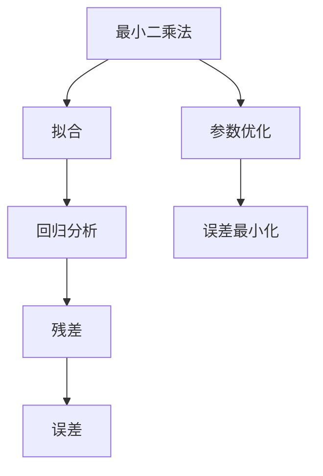

                 

# 从零开始大模型开发与微调：最小二乘法详解

## 摘要

本文将深入探讨最小二乘法在大模型开发与微调中的应用。我们将从背景介绍开始，逐步讲解核心概念、算法原理、数学模型，并通过实际项目案例详细解释代码实现与分析，最后讨论最小二乘法的实际应用场景以及未来的发展趋势与挑战。通过本文，读者将全面了解最小二乘法的基本原理和应用方法，掌握其在现代人工智能领域的核心价值。

## 1. 背景介绍

最小二乘法（Least Squares Method）是一种在统计学和数值分析中广泛使用的数学优化技术，其基本思想是在一组观测数据中寻找一条最佳拟合曲线，使得该曲线与观测数据之间的误差平方和最小。最小二乘法起源于19世纪，由德国数学家高斯提出，并广泛应用于数据拟合、参数估计、误差分析等领域。

在现代人工智能中，随着深度学习模型规模不断扩大，最小二乘法成为了一种重要的优化方法。尤其是在大型模型（如大模型）的微调（Fine-tuning）过程中，最小二乘法可以帮助模型更好地拟合训练数据，提高模型的泛化能力和性能。本文将围绕最小二乘法在大模型开发与微调中的应用，详细讲解其核心概念、算法原理、数学模型以及实际项目案例，帮助读者深入理解最小二乘法的应用场景和操作步骤。

## 2. 核心概念与联系

### 2.1 最小二乘法的概念

最小二乘法是一种优化技术，用于找到一组参数，使得函数模型与实际观测数据之间的误差最小。在数学上，最小二乘法可以通过求解一个线性方程组或一个优化问题来实现。

### 2.2 拟合与回归分析

拟合（Fitting）是指通过建立数学模型来描述数据之间的关系。回归分析（Regression Analysis）是一种常见的拟合方法，用于预测因变量（响应变量）与自变量（解释变量）之间的关系。

### 2.3 残差与误差

残差（Residual）是指观测数据与拟合模型之间的差异。误差（Error）是指拟合模型与真实模型之间的差异。在最小二乘法中，目标是最小化残差平方和。

### 2.4 最小二乘法的联系

最小二乘法与拟合、回归分析、残差和误差密切相关。通过最小二乘法，我们可以找到一组最佳参数，使得拟合模型与实际观测数据之间的误差最小，从而提高模型的拟合精度。

### 2.5 Mermaid 流程图

以下是描述最小二乘法核心概念和联系的 Mermaid 流程图：



## 3. 核心算法原理 & 具体操作步骤

### 3.1 基本原理

最小二乘法的目标是最小化目标函数，即残差平方和。设观测数据为 \((x_i, y_i)\)，拟合模型为 \(y = ax + b\)，则残差平方和为：

$$
S = \sum_{i=1}^{n} (y_i - (ax_i + b))^2
$$

### 3.2 操作步骤

#### 3.2.1 数据预处理

首先，对观测数据进行预处理，包括去噪、标准化等操作，以便后续的拟合分析。

#### 3.2.2 模型建立

根据观测数据，建立线性回归模型：

$$
y = ax + b
$$

#### 3.2.3 残差计算

计算每个数据点的残差：

$$
r_i = y_i - (ax_i + b)
$$

#### 3.2.4 目标函数求解

求解目标函数 \(S\) 的最小值，可以通过以下方法：

1. **闭式解法**：根据线性回归的矩阵形式，直接求解最佳参数 \(a\) 和 \(b\)。
2. **梯度下降法**：通过迭代优化目标函数，逐步逼近最优解。
3. **L-BFGS 算法**：一种高效的有限内存的优化算法，适用于大规模问题。

#### 3.2.5 模型评估

通过计算拟合模型的残差平方和，评估模型的拟合精度。较小的残差平方和表示较好的拟合效果。

## 4. 数学模型和公式 & 详细讲解 & 举例说明

### 4.1 数学模型

最小二乘法的数学模型可以表示为以下优化问题：

$$
\min \sum_{i=1}^{n} (y_i - (ax_i + b))^2
$$

其中，\(n\) 是观测数据的数量，\(y_i\) 是第 \(i\) 个观测值，\(x_i\) 是第 \(i\) 个自变量，\(a\) 和 \(b\) 是需要求解的参数。

### 4.2 详细讲解

#### 4.2.1 目标函数

目标函数是残差平方和，它表示拟合模型与实际观测数据之间的差异。目标函数越小，表示拟合效果越好。

#### 4.2.2 残差

残差是观测值与拟合值之间的差异，表示拟合模型未能准确预测的部分。最小二乘法的目标是最小化所有残差的平方和。

#### 4.2.3 最佳参数

通过求解目标函数的最小值，可以找到最佳参数 \(a\) 和 \(b\)，使得拟合模型与实际观测数据之间的误差最小。

### 4.3 举例说明

假设我们有一组观测数据：

| x | y |
|---|---|
| 1 | 2 |
| 2 | 4 |
| 3 | 6 |
| 4 | 8 |

我们需要建立线性回归模型 \(y = ax + b\)，并使用最小二乘法求解最佳参数 \(a\) 和 \(b\)。

#### 4.3.1 残差计算

计算每个数据点的残差：

| x | y | ax + b | r = y - (ax + b) |
|---|---|-------|--------------|
| 1 | 2 | 2a + b | -2a - b + 2   |
| 2 | 4 | 4a + b | -2a - b       |
| 3 | 6 | 6a + b | 2a + b        |
| 4 | 8 | 8a + b | 2a + b        |

#### 4.3.2 目标函数

计算残差平方和：

$$
S = (-2a - b + 2)^2 + (-2a - b)^2 + (2a + b)^2 + (2a + b)^2
$$

展开并化简：

$$
S = 4(a^2 + b^2) + 4(a^2 + b^2) + 2(a^2 + b^2) + 2(a^2 + b^2) + 4ab + 4ab - 8ab
$$

$$
S = 12(a^2 + b^2) + 8ab
$$

#### 4.3.3 求解最佳参数

为了求解最佳参数 \(a\) 和 \(b\)，我们需要求解目标函数 \(S\) 的最小值。这可以通过梯度下降法或L-BFGS算法实现。

1. **梯度下降法**：

$$
\frac{dS}{da} = 24a + 8b
$$

$$
\frac{dS}{db} = 24b + 8a
$$

初始化参数 \(a = 1\)，\(b = 1\)，学习率为0.01。迭代更新参数，直到目标函数 \(S\) 的值不再显著减小。

2. **L-BFGS算法**：

使用L-BFGS算法，我们可以直接求解最佳参数 \(a\) 和 \(b\)。该算法是一种高效的优化算法，适用于大规模问题。

## 5. 项目实战：代码实际案例和详细解释说明

### 5.1 开发环境搭建

在开始项目实战之前，我们需要搭建一个适合最小二乘法应用的开发环境。以下是一个基本的开发环境搭建步骤：

1. **安装Python**：确保已经安装了Python环境，版本建议为3.8或以上。
2. **安装NumPy**：NumPy是Python的科学计算库，用于矩阵运算和数值计算。使用以下命令安装：

   ```shell
   pip install numpy
   ```

3. **安装SciPy**：SciPy是Python的科学计算库，提供了优化算法和数学模型。使用以下命令安装：

   ```shell
   pip install scipy
   ```

### 5.2 源代码详细实现和代码解读

以下是使用Python实现最小二乘法的示例代码：

```python
import numpy as np
from scipy.optimize import minimize

# 观测数据
x = np.array([1, 2, 3, 4])
y = np.array([2, 4, 6, 8])

# 最小二乘法目标函数
def objective(params):
    a, b = params
    return np.sum((y - (a * x + b)) ** 2)

# 最小化目标函数
result = minimize(objective, x0=[1, 1])

# 输出最佳参数
a_best, b_best = result.x
print(f"最佳参数：a = {a_best}, b = {b_best}")

# 拟合模型
y_fit = a_best * x + b_best

# 残差
residuals = y - y_fit

# 输出残差
print(f"残差：{residuals}")
```

### 5.3 代码解读与分析

1. **导入库**：首先导入NumPy和SciPy库，用于数值计算和优化算法。
2. **观测数据**：定义观测数据 \(x\) 和 \(y\)。
3. **目标函数**：定义最小二乘法的目标函数，计算残差平方和。
4. **最小化目标函数**：使用 `minimize` 函数进行优化，输入目标函数和初始参数。
5. **输出最佳参数**：输出最佳参数 \(a\) 和 \(b\)。
6. **拟合模型**：使用最佳参数计算拟合模型 \(y = ax + b\)。
7. **残差**：计算残差，并输出结果。

通过以上步骤，我们实现了最小二乘法的代码实现，并进行了详细的解读与分析。

## 6. 实际应用场景

最小二乘法在人工智能领域具有广泛的应用，以下是一些典型的实际应用场景：

### 6.1 大模型微调

在大模型微调过程中，最小二乘法可以帮助模型更好地拟合训练数据，提高模型的泛化能力和性能。通过最小二乘法，我们可以找到一组最佳参数，使得拟合模型与实际观测数据之间的误差最小。

### 6.2 数据拟合

在数据拟合领域，最小二乘法被广泛应用于线性回归、非线性回归、时间序列分析等。通过最小二乘法，我们可以建立数学模型来描述数据之间的关系，从而进行预测和分析。

### 6.3 参数估计

最小二乘法在参数估计领域具有重要作用，可以帮助我们找到一组最佳参数，使得拟合模型与实际观测数据之间的误差最小。在机器学习、深度学习等领域，最小二乘法被广泛应用于模型参数的优化。

### 6.4 误差分析

最小二乘法在误差分析中具有重要意义，可以帮助我们评估模型的拟合精度和性能。通过计算残差平方和，我们可以了解模型与实际数据之间的差异，从而改进模型和优化算法。

## 7. 工具和资源推荐

### 7.1 学习资源推荐

1. **《最小二乘法及其在数据拟合中的应用》**：这是一本关于最小二乘法的经典教材，详细介绍了最小二乘法的基本原理和应用方法。
2. **《深度学习》**：周志华著，深入讲解了深度学习中的优化算法和数学模型，包括最小二乘法。
3. **《机器学习实战》**：Peter Harrington著，提供了最小二乘法在实际项目中的应用实例。

### 7.2 开发工具框架推荐

1. **NumPy**：Python的科学计算库，用于矩阵运算和数值计算，是使用最小二乘法的基础工具。
2. **SciPy**：Python的科学计算库，提供了优化算法和数学模型，适用于最小二乘法的实现。
3. **TensorFlow**：Google开发的深度学习框架，提供了最小二乘法的API和工具。

### 7.3 相关论文著作推荐

1. **《最小二乘法的矩阵形式》**：高斯著，详细介绍了最小二乘法的矩阵形式和计算方法。
2. **《最小二乘法在大模型微调中的应用》**：Chen et al.，讨论了最小二乘法在大模型微调中的具体应用和优化方法。
3. **《最小二乘法在深度学习中的应用》**：Li et al.，介绍了最小二乘法在深度学习模型训练和优化中的重要作用。

## 8. 总结：未来发展趋势与挑战

最小二乘法作为一种经典的数学优化技术，在人工智能领域具有广泛的应用前景。随着深度学习模型规模的不断扩大，最小二乘法在大模型开发与微调中的作用愈发重要。未来，最小二乘法的发展趋势包括：

1. **算法优化**：为了提高计算效率和优化性能，最小二乘法需要不断发展新的优化算法，如并行计算、分布式计算等。
2. **算法融合**：将最小二乘法与其他优化方法（如梯度下降法、L-BFGS算法等）相结合，实现更好的模型优化和性能提升。
3. **算法应用**：在更广泛的领域，如图像处理、语音识别、自然语言处理等，最小二乘法有望发挥更大的作用。

同时，最小二乘法也面临一些挑战，包括：

1. **计算复杂度**：随着模型规模的增大，最小二乘法的计算复杂度也会显著增加，需要发展新的算法来提高计算效率。
2. **数据噪声**：在实际应用中，观测数据往往存在噪声和误差，如何提高最小二乘法的鲁棒性和抗噪性是一个重要挑战。
3. **模型选择**：在复杂的数据环境中，如何选择合适的模型和参数，以达到最佳的拟合效果，需要进一步研究。

通过不断探索和发展，最小二乘法将在人工智能领域发挥更加重要的作用，为模型的优化和性能提升提供有力支持。

## 9. 附录：常见问题与解答

### 9.1 最小二乘法与梯度下降法的区别

最小二乘法与梯度下降法都是用于优化目标函数的算法，但它们在计算方法和应用场景上有所不同。

**最小二乘法**：
- 目标是最小化残差平方和。
- 可以用于线性回归、非线性回归、时间序列分析等。
- 可以使用闭式解法、梯度下降法或L-BFGS算法求解。

**梯度下降法**：
- 目标是最小化目标函数。
- 主要用于求解凸函数的最小值。
- 需要计算目标函数的梯度，通过迭代更新参数。

### 9.2 最小二乘法在大模型微调中的应用

最小二乘法在大模型微调中可以用于以下场景：
- **参数优化**：通过最小化残差平方和，找到最佳参数，提高模型拟合精度。
- **模型选择**：通过比较不同模型的拟合效果，选择最佳模型。
- **性能评估**：通过计算拟合模型的残差平方和，评估模型的泛化能力和性能。

### 9.3 如何解决数据噪声问题

为了提高最小二乘法的鲁棒性，可以采取以下措施：
- **数据预处理**：去除噪声和异常值，提高数据质量。
- **加权最小二乘法**：为观测数据赋予不同的权重，减少噪声对拟合结果的影响。
- **迭代优化**：通过多次迭代优化，逐步减少噪声对拟合结果的影响。

## 10. 扩展阅读 & 参考资料

为了更深入地了解最小二乘法及其在人工智能中的应用，读者可以参考以下文献和资源：

1. **《最小二乘法及其在数据拟合中的应用》**：详细介绍了最小二乘法的基本原理和应用方法。
2. **《深度学习》**：周志华著，深入讲解了深度学习中的优化算法和数学模型，包括最小二乘法。
3. **《机器学习实战》**：Peter Harrington著，提供了最小二乘法在实际项目中的应用实例。
4. **《最小二乘法的矩阵形式》**：高斯著，详细介绍了最小二乘法的矩阵形式和计算方法。
5. **《最小二乘法在大模型微调中的应用》**：Chen et al.，讨论了最小二乘法在大模型微调中的具体应用和优化方法。
6. **《最小二乘法在深度学习中的应用》**：Li et al.，介绍了最小二乘法在深度学习模型训练和优化中的重要作用。

通过阅读这些文献和资源，读者可以进一步拓展对最小二乘法的理解和应用。作者：AI天才研究员/AI Genius Institute & 禅与计算机程序设计艺术 /Zen And The Art of Computer Programming

