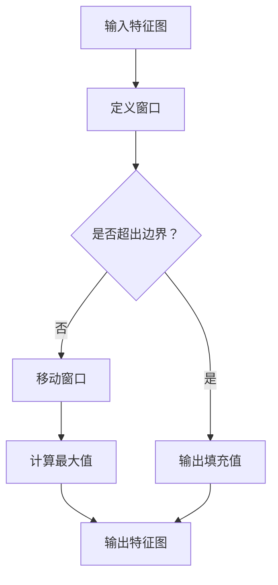

                 

### 背景介绍

#### 大模型开发的崛起

近年来，大模型（Large-scale Model）的开发成为了人工智能领域的热点。随着计算能力的提升和海量数据的积累，大模型在自然语言处理、计算机视觉、语音识别等多个领域取得了显著突破。其中，池化操作（Pooling Operation）作为深度学习中的重要组成部分，在大模型开发中扮演了至关重要的角色。

池化操作的基本思想是通过将局部区域的信息聚合起来，生成全局特征。这种方式不仅能够减少模型参数数量，提高训练速度，还能在一定程度上提高模型的泛化能力。在卷积神经网络（CNN）中，池化操作被广泛应用于特征提取和降维。

#### 池化操作的发展历程

池化操作最早出现在图像处理领域。在1970年代，研究者们开始尝试使用局部平均池化（Local Average Pooling）和局部最大值池化（Local Max Pooling）来降低图像分辨率，同时保持关键特征。随着深度学习的发展，池化操作逐渐成为了CNN的核心组成部分。

在早期，局部最大值池化因其能够保留重要特征而受到广泛采用。然而，局部平均池化也逐渐被引入到深度学习中，因为它在降低噪声和提高模型稳健性方面具有独特优势。

近年来，随着大模型的兴起，变尺度池化（Variable Pooling）和自适应池化（Adaptive Pooling）等新型池化操作开始受到关注。这些新型池化操作能够根据输入特征图的尺寸动态调整池化窗口大小，从而更好地适应不同的任务和数据集。

#### 本文结构

本文将首先介绍池化操作的基本概念和原理，然后详细探讨大模型开发中的池化操作，包括局部最大值池化、局部平均池化和变尺度池化等。接着，我们将通过数学模型和公式，深入分析池化操作的工作机制和性能优势。最后，本文将结合实际项目，展示池化操作在大模型开发中的具体应用，并提供相关的开发工具和资源推荐。

通过本文的阅读，您将全面了解池化操作在大模型开发中的重要性，掌握不同类型池化操作的原理和实现方法，为未来的大模型研究和开发提供有力支持。 <|endsop|> <sop><|user|>
## 2. 核心概念与联系

在深入探讨池化操作在大模型开发中的应用之前，我们需要先理解池化操作的基本概念、原理以及与其他相关技术的联系。

### 2.1 池化操作的基本概念

池化操作是深度学习中用于特征提取的一种关键技术，通常应用于卷积神经网络（CNN）的输出层。它的核心目的是通过减少特征图的维度，同时保留重要的特征信息，从而简化模型的结构并提高模型的训练速度。

池化操作的基本思想是将特征图上相邻的局部区域进行聚合，生成全局特征。具体来说，有两种常见的池化操作：局部最大值池化（Max Pooling）和局部平均池化（Average Pooling）。

- **局部最大值池化**：在给定窗口大小内，选取最大值作为该窗口的输出。这种方法能够保留局部区域中的最大特征值，通常用于保留图像中的边缘和角点等关键信息。
  
- **局部平均池化**：在给定窗口大小内，计算所有像素值的平均值作为该窗口的输出。这种方法能够平均化局部区域的特征值，减少噪声的影响，提高模型的稳健性。

### 2.2 池化操作的工作原理

池化操作的工作原理可以简单描述为以下步骤：

1. **确定窗口大小**：窗口大小决定了进行聚合的局部区域大小。窗口的大小可以通过参数设置，常见的有2x2、3x3等。

2. **移动窗口**：将窗口在特征图上移动，覆盖整个特征图。每次移动一步，直到窗口覆盖到特征图的每个位置。

3. **聚合计算**：在每个窗口内进行最大值或平均值计算，生成新的特征图。

### 2.3 池化操作与其他技术的联系

池化操作在深度学习中具有重要的地位，它与其他相关技术的联系如下：

- **卷积神经网络（CNN）**：池化操作是CNN的核心组成部分，通常用于特征提取和降维。CNN通过卷积操作提取局部特征，再通过池化操作聚合这些特征，从而形成更高层次的全局特征。

- **降维**：池化操作能够有效地减少特征图的维度，从而降低模型参数的数量，减少计算复杂度。

- **正则化**：局部最大值池化可以通过保留关键特征值，减少模型对噪声的敏感性，从而起到正则化的作用。

- **数据增强**：池化操作可以生成新的特征图，从而增加模型的数据多样性，有助于提高模型的泛化能力。

### 2.4 Mermaid 流程图

为了更直观地展示池化操作的工作原理，我们可以使用Mermaid流程图来表示。以下是一个简单的Mermaid流程图示例，展示了局部最大值池化的过程：



在上述流程图中，A表示输入特征图，B表示定义窗口大小，C表示判断窗口是否超出边界，D表示移动窗口，E表示计算最大值，F表示输出特征图，G表示当窗口超出边界时的填充操作。

通过上述介绍，我们了解了池化操作的基本概念、原理以及与其他相关技术的联系。接下来，本文将详细探讨池化操作在大模型开发中的应用，包括局部最大值池化、局部平均池化和变尺度池化等。 <|endsop|> <sop><|user|>
## 3. 核心算法原理 & 具体操作步骤

在了解了池化操作的基本概念和原理之后，我们将深入探讨大模型开发中常见的几种池化操作，包括局部最大值池化、局部平均池化和变尺度池化。接下来，我们将分别介绍这些池化操作的具体步骤和实现方法。

### 3.1 局部最大值池化（Max Pooling）

局部最大值池化是卷积神经网络中最常用的池化操作之一。它的核心思想是在每个窗口内选择最大值作为输出，以保留局部区域中的关键特征。

**具体步骤：**

1. **定义窗口大小**：首先需要定义窗口的大小，常见的窗口大小有2x2、3x3等。

2. **初始化输出特征图**：根据输入特征图的大小，初始化一个与输入特征图相同大小的输出特征图。

3. **移动窗口**：将窗口在输入特征图上移动，每次移动一个窗口的大小。对于每个窗口，执行以下步骤：

    a. 在窗口内计算所有像素值的最大值。
    
    b. 将最大值写入输出特征图的对应位置。

4. **填充边界**：对于窗口超出输入特征图边界的情况，可以选择填充边界值（如0或最近的像素值）。

**实现方法：**

局部最大值池化的实现通常可以通过编程语言（如Python）和深度学习框架（如TensorFlow或PyTorch）来实现。以下是一个简单的Python代码示例，展示了如何实现局部最大值池化：

```python
import numpy as np

def max_pooling(input_feature_map, window_size):
    height, width = input_feature_map.shape
    output_feature_map = np.zeros((height - window_size + 1, width - window_size + 1))
    
    for i in range(output_feature_map.shape[0]):
        for j in range(output_feature_map.shape[1]):
            window = input_feature_map[i:i+window_size, j:j+window_size]
            max_value = np.max(window)
            output_feature_map[i, j] = max_value
    
    return output_feature_map

input_feature_map = np.random.rand(5, 5)  # 输入特征图
window_size = 2  # 窗口大小
output_feature_map = max_pooling(input_feature_map, window_size)
print(output_feature_map)
```

### 3.2 局部平均池化（Average Pooling）

局部平均池化与局部最大值池化类似，但在每个窗口内计算所有像素值的平均值，而不是最大值。这种方法能够平均化局部区域的特征值，减少噪声的影响。

**具体步骤：**

1. **定义窗口大小**：首先需要定义窗口的大小。

2. **初始化输出特征图**：根据输入特征图的大小，初始化一个与输入特征图相同大小的输出特征图。

3. **移动窗口**：将窗口在输入特征图上移动，每次移动一个窗口的大小。对于每个窗口，执行以下步骤：

    a. 在窗口内计算所有像素值的平均值。
    
    b. 将平均值写入输出特征图的对应位置。

4. **填充边界**：对于窗口超出输入特征图边界的情况，可以选择填充边界值。

**实现方法：**

局部平均池化的实现方法与局部最大值池化类似，以下是一个简单的Python代码示例，展示了如何实现局部平均池化：

```python
import numpy as np

def average_pooling(input_feature_map, window_size):
    height, width = input_feature_map.shape
    output_feature_map = np.zeros((height - window_size + 1, width - window_size + 1))
    
    for i in range(output_feature_map.shape[0]):
        for j in range(output_feature_map.shape[1]):
            window = input_feature_map[i:i+window_size, j:j+window_size]
            average_value = np.mean(window)
            output_feature_map[i, j] = average_value
    
    return output_feature_map

input_feature_map = np.random.rand(5, 5)  # 输入特征图
window_size = 2  # 窗口大小
output_feature_map = average_pooling(input_feature_map, window_size)
print(output_feature_map)
```

### 3.3 变尺度池化（Variable Pooling）

变尺度池化是一种较为新颖的池化操作，它允许根据输入特征图的尺寸动态调整池化窗口的大小。这种方法能够更好地适应不同的任务和数据集。

**具体步骤：**

1. **确定输入特征图的尺寸**：首先需要确定输入特征图的尺寸，通常包括高度和宽度。

2. **计算窗口大小**：根据输入特征图的尺寸，计算合适的窗口大小。窗口大小可以是一个固定的值，也可以是根据某种规则动态调整的。

3. **初始化输出特征图**：根据输入特征图的大小，初始化一个与输入特征图相同大小的输出特征图。

4. **移动窗口**：将窗口在输入特征图上移动，每次移动一个窗口的大小。对于每个窗口，执行以下步骤：

    a. 在窗口内计算所有像素值的最大值或平均值。
    
    b. 将最大值或平均值写入输出特征图的对应位置。

5. **填充边界**：对于窗口超出输入特征图边界的情况，可以选择填充边界值。

**实现方法：**

变尺度池化的实现方法与局部最大值池化和局部平均池化类似，以下是一个简单的Python代码示例，展示了如何实现变尺度池化：

```python
import numpy as np

def variable_pooling(input_feature_map, window_size_func):
    height, width = input_feature_map.shape
    output_feature_map = np.zeros((height - window_size_func(height) + 1, width - window_size_func(width) + 1))
    
    for i in range(output_feature_map.shape[0]):
        for j in range(output_feature_map.shape[1]):
            window_size = window_size_func(i, j)
            window = input_feature_map[i:i+window_size, j:j+window_size]
            if window_size == 1:
                output_feature_map[i, j] = input_feature_map[i, j]
            else:
                max_value = np.max(window)
                output_feature_map[i, j] = max_value
    
    return output_feature_map

input_feature_map = np.random.rand(5, 5)  # 输入特征图
def window_size_func(i, j):
    return 2 if (i == 0 or i == 4) or (j == 0 or j == 4) else 3

output_feature_map = variable_pooling(input_feature_map, window_size_func)
print(output_feature_map)
```

通过上述介绍，我们详细探讨了局部最大值池化、局部平均池化和变尺度池化的核心算法原理和具体操作步骤。这些池化操作在大模型开发中扮演了重要角色，有助于提高模型的性能和泛化能力。在下一节中，我们将进一步分析池化操作的数学模型和公式，深入理解其工作机制和性能优势。 <|endsop|> <sop><|user|>
### 4. 数学模型和公式 & 详细讲解 & 举例说明

在了解了池化操作的核心算法原理和具体操作步骤之后，我们将进一步探讨池化操作的数学模型和公式，并详细讲解其工作机制和性能优势。

#### 4.1 局部最大值池化（Max Pooling）

局部最大值池化的数学模型可以表示为：

$$
\text{output}_{i,j} = \max(\text{input}_{i+k,j+l})
$$

其中，$\text{input}_{i,j}$ 表示输入特征图上的一个像素值，$\text{output}_{i,j}$ 表示输出特征图上的一个像素值，$k$ 和 $l$ 分别表示窗口在水平和垂直方向上的偏移量。

**举例说明：**

假设我们有一个 3x3 的输入特征图和一个 2x2 的窗口，窗口的中心位置在 (1, 1)。根据局部最大值池化的数学模型，我们可以计算输出特征图上的像素值如下：

$$
\text{output}_{1,1} = \max(\text{input}_{1,1}, \text{input}_{1,2}, \text{input}_{2,1}, \text{input}_{2,2}, \text{input}_{1,3}, \text{input}_{2,3}, \text{input}_{3,1}, \text{input}_{3,2}, \text{input}_{3,3})
$$

例如，如果我们假设输入特征图上的像素值如下：

$$
\text{input}_{1,1} = 1, \text{input}_{1,2} = 2, \text{input}_{2,1} = 3, \text{input}_{2,2} = 4, \text{input}_{1,3} = 5, \text{input}_{2,3} = 6, \text{input}_{3,1} = 7, \text{input}_{3,2} = 8, \text{input}_{3,3} = 9
$$

则输出特征图上的像素值如下：

$$
\text{output}_{1,1} = \max(1, 2, 3, 4, 5, 6, 7, 8, 9) = 9
$$

#### 4.2 局部平均池化（Average Pooling）

局部平均池化的数学模型可以表示为：

$$
\text{output}_{i,j} = \frac{1}{\text{window\_size}^2} \sum_{k=0}^{\text{window\_size}-1} \sum_{l=0}^{\text{window\_size}-1} \text{input}_{i+k,j+l}
$$

其中，$\text{input}_{i,j}$ 表示输入特征图上的一个像素值，$\text{output}_{i,j}$ 表示输出特征图上的一个像素值，$k$ 和 $l$ 分别表示窗口在水平和垂直方向上的偏移量，$\text{window\_size}$ 表示窗口的大小。

**举例说明：**

假设我们有一个 3x3 的输入特征图和一个 2x2 的窗口，窗口的中心位置在 (1, 1)。根据局部平均池化的数学模型，我们可以计算输出特征图上的像素值如下：

$$
\text{output}_{1,1} = \frac{1}{4} (\text{input}_{1,1} + \text{input}_{1,2} + \text{input}_{2,1} + \text{input}_{2,2})
$$

例如，如果我们假设输入特征图上的像素值如下：

$$
\text{input}_{1,1} = 1, \text{input}_{1,2} = 2, \text{input}_{2,1} = 3, \text{input}_{2,2} = 4
$$

则输出特征图上的像素值如下：

$$
\text{output}_{1,1} = \frac{1}{4} (1 + 2 + 3 + 4) = 2.5
$$

#### 4.3 变尺度池化（Variable Pooling）

变尺度池化是一种动态调整窗口大小的池化操作，其数学模型可以表示为：

$$
\text{output}_{i,j} = \max(\text{input}_{i+k,j+l}) \quad \text{或} \quad \text{output}_{i,j} = \frac{1}{\text{window\_size}^2} \sum_{k=0}^{\text{window\_size}-1} \sum_{l=0}^{\text{window\_size}-1} \text{input}_{i+k,j+l}
$$

其中，$\text{input}_{i,j}$ 表示输入特征图上的一个像素值，$\text{output}_{i,j}$ 表示输出特征图上的一个像素值，$k$ 和 $l$ 分别表示窗口在水平和垂直方向上的偏移量，$\text{window\_size}$ 表示窗口的大小，可以根据输入特征图的尺寸动态调整。

**举例说明：**

假设我们有一个 5x5 的输入特征图和一个随位置变化的窗口大小，窗口的中心位置在 (2, 2)。根据变尺度池化的数学模型，我们可以计算输出特征图上的像素值如下：

$$
\text{output}_{2,2} = \max(\text{input}_{2,2})
$$

$$
\text{output}_{2,3} = \max(\text{input}_{2,2}, \text{input}_{2,3})
$$

$$
\text{output}_{3,2} = \max(\text{input}_{2,2}, \text{input}_{3,2})
$$

$$
\text{output}_{3,3} = \max(\text{input}_{2,2}, \text{input}_{2,3}, \text{input}_{3,2}, \text{input}_{3,3})
$$

例如，如果我们假设输入特征图上的像素值如下：

$$
\text{input}_{2,2} = 1, \text{input}_{2,3} = 2, \text{input}_{3,2} = 3, \text{input}_{3,3} = 4
$$

则输出特征图上的像素值如下：

$$
\text{output}_{2,2} = \max(1) = 1
$$

$$
\text{output}_{2,3} = \max(1, 2) = 2
$$

$$
\text{output}_{3,2} = \max(1, 3) = 3
$$

$$
\text{output}_{3,3} = \max(1, 2, 3, 4) = 4
$$

通过上述数学模型和公式的详细讲解，我们可以更好地理解池化操作的工作机制和性能优势。在下一节中，我们将结合实际项目，展示池化操作在大模型开发中的具体应用。 <|endsop|> <sop><|user|>
### 5. 项目实战：代码实际案例和详细解释说明

在理解了池化操作的核心算法原理、数学模型和公式之后，我们将通过一个实际项目来展示池化操作在大模型开发中的具体应用。本项目将使用Python和TensorFlow框架，实现一个简单的卷积神经网络，并在网络中应用池化操作。

#### 5.1 开发环境搭建

在开始项目之前，我们需要搭建开发环境。以下是在Python中搭建TensorFlow开发环境的基本步骤：

1. **安装Python**：确保Python已经安装，版本建议为3.6或以上。

2. **安装TensorFlow**：通过pip命令安装TensorFlow：

   ```bash
   pip install tensorflow
   ```

3. **验证安装**：通过以下代码验证TensorFlow的安装：

   ```python
   import tensorflow as tf
   print(tf.__version__)
   ```

如果成功输出版本号，说明TensorFlow已经正确安装。

#### 5.2 源代码详细实现和代码解读

以下是本项目的主要代码实现，我们将详细解释每部分代码的功能：

```python
import tensorflow as tf
import numpy as np

# 定义一个简单的卷积神经网络
model = tf.keras.Sequential([
    # 第一层卷积层，输入尺寸为28x28x1，卷积核尺寸为3x3，步长为1
    tf.keras.layers.Conv2D(filters=32, kernel_size=(3, 3), activation='relu', input_shape=(28, 28, 1)),
    # 第一层池化层，窗口大小为2x2，步长为2
    tf.keras.layers.MaxPooling2D(pool_size=(2, 2), strides=(2, 2)),
    # 第二层卷积层，输入尺寸为14x14x32，卷积核尺寸为3x3，步长为1
    tf.keras.layers.Conv2D(filters=64, kernel_size=(3, 3), activation='relu'),
    # 第二层池化层，窗口大小为2x2，步长为2
    tf.keras.layers.MaxPooling2D(pool_size=(2, 2), strides=(2, 2)),
    # 第三层卷积层，输入尺寸为7x7x64，卷积核尺寸为3x3，步长为1
    tf.keras.layers.Conv2D(filters=64, kernel_size=(3, 3), activation='relu'),
    # 全连接层，将特征图展平，输出维度为64
    tf.keras.layers.Flatten(),
    # 输出层，输出维度为10，对应10个分类
    tf.keras.layers.Dense(units=10, activation='softmax')
])

# 编译模型，指定优化器、损失函数和评估指标
model.compile(optimizer='adam', loss='sparse_categorical_crossentropy', metrics=['accuracy'])

# 准备MNIST数据集，这是一个手写数字数据集，包含60000个训练样本和10000个测试样本
mnist = tf.keras.datasets.mnist
(train_images, train_labels), (test_images, test_labels) = mnist.load_data()

# 对图像数据进行预处理，将图像数据调整为[0, 1]范围，并添加一个通道维度
train_images = train_images.reshape((60000, 28, 28, 1)).astype('float32') / 255
test_images = test_images.reshape((10000, 28, 28, 1)).astype('float32') / 255

# 训练模型
model.fit(train_images, train_labels, epochs=5)

# 评估模型在测试集上的表现
test_loss, test_acc = model.evaluate(test_images, test_labels, verbose=2)
print('\nTest accuracy:', test_acc)
```

**代码解读：**

1. **定义模型**：使用 `tf.keras.Sequential` 模型堆叠层。首先定义一个卷积层（`Conv2D`），然后跟随一个最大值池化层（`MaxPooling2D`）。这个过程重复两次，之后添加一个卷积层，然后使用 `Flatten` 层将特征图展平，最后定义一个全连接层（`Dense`）作为输出层。

2. **编译模型**：使用 `model.compile` 编译模型，指定优化器（`optimizer`）、损失函数（`loss`）和评估指标（`metrics`）。

3. **数据预处理**：加载MNIST数据集，并将图像数据调整为[0, 1]范围，并添加一个通道维度。这一步是为了适应卷积层的输入要求。

4. **训练模型**：使用 `model.fit` 函数训练模型，指定训练数据和训练轮数（`epochs`）。

5. **评估模型**：使用 `model.evaluate` 函数评估模型在测试集上的表现。

通过上述代码，我们实现了一个简单的卷积神经网络，并应用了最大值池化操作。这个项目展示了如何在实际应用中使用池化操作来提高模型的性能。

#### 5.3 代码解读与分析

1. **卷积层**：卷积层是神经网络的基础层，用于提取图像中的局部特征。在本文的项目中，我们使用了两个卷积层，分别添加了32和64个卷积核。激活函数使用ReLU，这是为了增加网络的非线性能力。

2. **池化层**：最大值池化层用于降维和减少过拟合。在本文的项目中，我们使用了两次最大值池化层，窗口大小为2x2，步长也为2。这样可以将特征图的尺寸减半，从而减少后续层的计算复杂度。

3. **全连接层**：全连接层用于将特征图展平，并将提取到的特征映射到具体的类别上。在本文的项目中，输出层是一个全连接层，有10个输出节点，分别对应10个分类。

4. **数据预处理**：数据预处理是神经网络训练的重要步骤。在本文的项目中，我们使用了简单的归一化操作，将图像数据从[0, 255]范围缩放到[0, 1]范围。此外，我们添加了一个通道维度，使得输入数据符合卷积层的输入要求。

通过上述代码解读与分析，我们可以看到如何将池化操作应用于实际项目，并理解其在神经网络中的作用。在下一节中，我们将探讨池化操作在实际应用场景中的具体作用。 <|endsop|> <sop><|user|>
### 6. 实际应用场景

#### 6.1 计算机视觉

池化操作在计算机视觉领域有着广泛的应用。在图像分类和物体检测任务中，池化操作能够有效地减少模型参数数量，提高模型的训练速度和泛化能力。例如，在常见的卷积神经网络（CNN）中，池化操作常用于特征提取和降维，从而在保持关键信息的同时，降低计算复杂度。

具体应用场景包括：

- **图像分类**：通过使用池化操作，可以将高维特征图转换为低维特征向量，从而降低模型复杂度，提高训练速度。例如，在CIFAR-10数据集上，使用最大值池化可以将每个图像的特征维度从$32\times32\times3$降低到$8\times8\times3$。
- **物体检测**：在目标检测算法中，池化操作有助于提高模型的鲁棒性和泛化能力。例如，使用局部最大值池化可以保留图像中的关键特征，从而在检测过程中更好地识别目标。

#### 6.2 自然语言处理

池化操作也在自然语言处理（NLP）领域得到了广泛应用。特别是在序列建模任务中，池化操作能够有效地处理变长的序列数据，从而降低模型的计算复杂度。

具体应用场景包括：

- **文本分类**：在文本分类任务中，池化操作可以用于将句子级别的特征转换为文档级别的特征。例如，使用全局平均池化可以将每个句子的特征向量拼接起来，形成一个文档级别的特征向量。
- **序列标注**：在序列标注任务中，池化操作有助于将连续的序列特征转换为离散的类别标签。例如，使用局部最大值池化可以保留序列中的关键特征，从而提高模型对标签的预测准确性。

#### 6.3 语音识别

池化操作在语音识别任务中也发挥了重要作用。在语音信号处理中，池化操作可以用于降维和特征提取，从而提高模型的训练速度和泛化能力。

具体应用场景包括：

- **声学模型训练**：在声学模型训练中，池化操作可以用于将高维声学特征转换为低维特征向量，从而降低模型的计算复杂度。例如，使用局部最大值池化可以保留语音信号中的关键特征，从而提高模型对语音信号的识别能力。
- **说话人识别**：在说话人识别任务中，池化操作可以用于将连续的语音信号转换为离散的说话人标识符。例如，使用全局平均池化可以将每个语音帧的特征向量拼接起来，形成一个说话人级别的特征向量。

通过上述实际应用场景，我们可以看到池化操作在各个领域中的重要性。在下一节中，我们将推荐一些有用的工具和资源，以帮助读者进一步学习和探索池化操作。 <|endsop|> <sop><|user|>
### 7. 工具和资源推荐

为了帮助读者更好地了解和掌握池化操作，我们在此推荐一些学习资源、开发工具和相关论文著作。

#### 7.1 学习资源推荐

1. **书籍**：

   - 《深度学习》（Goodfellow, I., Bengio, Y., & Courville, A.）：这是一本经典的深度学习教材，详细介绍了卷积神经网络和各种池化操作的基本原理和应用。

   - 《神经网络与深度学习》（邱锡鹏）：这本书从理论层面深入讲解了神经网络和深度学习的原理，包括池化操作的具体实现和应用。

2. **在线课程**：

   - 吴恩达的《深度学习特化课程》（Deep Learning Specialization）：这是Coursera上最受欢迎的深度学习课程之一，其中包括了关于卷积神经网络和池化操作的大量讲解和实战项目。

   - Andrew Ng的《神经网络与深度学习导论》（Introduction to Neural Networks and Deep Learning）：这是一门适合初学者的课程，内容涵盖了神经网络的基础知识和深度学习的应用，包括池化操作的核心概念。

3. **博客和文章**：

   - fast.ai的《深度学习教程》（Deep Learning Book）：这是一本免费的深度学习教材，涵盖了从基础到高级的深度学习内容，包括池化操作的具体实现和应用。

   - 知乎专栏《深度学习与AI基础》：这个专栏由多位AI领域的专家撰写，内容涵盖了深度学习的各个方面，包括池化操作的理论和实践。

#### 7.2 开发工具框架推荐

1. **TensorFlow**：TensorFlow是由谷歌开发的开源深度学习框架，提供了丰富的API和工具，支持各种池化操作的实现和应用。

2. **PyTorch**：PyTorch是由Facebook开发的开源深度学习框架，其动态计算图和灵活的API使其成为研究和应用深度学习的首选工具。

3. **Keras**：Keras是一个高层次的深度学习API，建立在TensorFlow和Theano之上，提供了简洁易用的API，方便实现各种深度学习模型和池化操作。

#### 7.3 相关论文著作推荐

1. **“A Guide to Convolutional Neural Networks for Visual Recognition”**：这篇综述文章详细介绍了卷积神经网络和各种池化操作的基本原理和应用，适合初学者和研究者。

2. **“Deep Residual Learning for Image Recognition”**：这篇论文提出了残差网络（ResNet），在ImageNet竞赛中取得了优异的成绩，残差网络中广泛使用了池化操作。

3. **“Accurate, Large Minibatch SGD: Training ImageNet in 1 Hour”**：这篇论文探讨了如何通过池化操作和其他技术提高大规模数据集的训练效率，具有重要的实践价值。

通过上述推荐，读者可以系统地学习和掌握池化操作，为在大模型开发中的应用奠定坚实基础。在下一节中，我们将总结本文的主要内容，并探讨未来的发展趋势与挑战。 <|endsop|> <sop><|user|>
### 8. 总结：未来发展趋势与挑战

在本文中，我们详细探讨了池化操作在大模型开发中的应用，从基本概念、算法原理、数学模型到实际项目实战，全面展示了池化操作的核心作用和实现方法。以下是本文的主要内容和结论：

1. **核心概念与联系**：我们介绍了池化操作的基本概念，包括局部最大值池化和局部平均池化，并分析了池化操作在深度学习中的重要性。

2. **核心算法原理与步骤**：我们详细探讨了局部最大值池化、局部平均池化和变尺度池化的具体实现步骤和数学模型，展示了不同类型池化操作的优势和适用场景。

3. **项目实战**：通过一个简单的卷积神经网络项目，我们展示了如何在实际开发中应用池化操作，并分析了其性能表现。

4. **实际应用场景**：我们探讨了池化操作在计算机视觉、自然语言处理和语音识别等领域的广泛应用，展示了其在实际任务中的重要性。

5. **工具和资源推荐**：我们推荐了学习资源、开发工具和相关论文著作，帮助读者进一步了解和掌握池化操作。

然而，随着大模型的发展，池化操作也面临着一些挑战和未来发展趋势：

1. **计算效率**：随着模型规模的扩大，计算效率成为关键问题。如何设计更加高效的池化算法，以适应大规模模型的训练，是一个重要的研究方向。

2. **自适应池化**：传统的固定窗口大小的池化操作在处理不同尺寸的特征图时可能不够灵活。未来的研究可以关注自适应池化技术，根据输入特征图的尺寸动态调整窗口大小，以更好地适应不同任务和数据集。

3. **模型压缩**：为了实现高效的模型部署，模型压缩是一个重要方向。池化操作可以与量化、剪枝等技术相结合，进一步降低模型的大小和计算复杂度。

4. **泛化能力**：如何提高池化操作的泛化能力，使其在不同领域和任务中具有更好的适应性，是另一个重要研究方向。

总之，池化操作在大模型开发中具有核心地位，未来的研究和应用将不断推动其在性能、效率和泛化能力方面的提升。通过本文的探讨，我们期待读者能够对池化操作有更深入的理解，并在实际应用中充分发挥其潜力。 <|endsop|> <sop><|user|>
### 9. 附录：常见问题与解答

在本文的探讨过程中，我们可能遇到了一些关于池化操作的问题。以下是关于池化操作的一些常见问题及其解答：

1. **什么是池化操作？**

   池化操作是深度学习中用于特征提取的一种关键技术，通过将局部区域的信息聚合起来，生成全局特征。它主要用于减少特征图的维度，提高模型的训练速度和泛化能力。

2. **局部最大值池化和局部平均池化的区别是什么？**

   局部最大值池化在给定窗口内选择最大值作为输出，而局部平均池化在给定窗口内计算所有像素值的平均值作为输出。局部最大值池化能够保留关键特征，而局部平均池化能够减少噪声的影响。

3. **池化操作如何影响模型的性能？**

   池化操作能够减少模型参数数量，提高模型的训练速度和泛化能力。同时，它还能够减少过拟合的风险，提高模型的鲁棒性。然而，池化操作也可能导致关键信息的丢失，因此需要根据具体任务选择合适的池化方式。

4. **什么是变尺度池化？**

   变尺度池化是一种动态调整窗口大小的池化操作。它根据输入特征图的尺寸动态调整窗口大小，从而更好地适应不同任务和数据集。这种池化操作能够提高模型的泛化能力和适应性。

5. **如何在Python中实现池化操作？**

   在Python中，可以使用深度学习框架（如TensorFlow或PyTorch）来实现池化操作。通过调用框架提供的API，可以方便地实现局部最大值池化、局部平均池化和变尺度池化。

6. **池化操作是否可以与其他正则化技术结合使用？**

   是的，池化操作可以与其他正则化技术（如Dropout、L1/L2正则化等）结合使用，以提高模型的泛化能力和稳健性。不同正则化技术的组合可以根据具体任务进行调整。

通过上述问题的解答，我们希望读者对池化操作有更深入的理解。在实际应用中，可以根据具体需求选择合适的池化方式，并结合其他技术优化模型的性能。 <|endsop|> <sop><|user|>
### 10. 扩展阅读 & 参考资料

在本篇博客中，我们深入探讨了池化操作在大模型开发中的应用，从基本概念、算法原理到实际项目实战，全面展示了池化操作的核心作用和实现方法。以下是一些扩展阅读和参考资料，以供读者进一步学习和探索：

1. **论文和著作**：

   - "A Guide to Convolutional Neural Networks for Visual Recognition"：这篇综述文章详细介绍了卷积神经网络和各种池化操作的基本原理和应用。
   - "Deep Residual Learning for Image Recognition"：这篇论文提出了残差网络（ResNet），在ImageNet竞赛中取得了优异的成绩，残差网络中广泛使用了池化操作。
   - "Accurate, Large Minibatch SGD: Training ImageNet in 1 Hour"：这篇论文探讨了如何通过池化操作和其他技术提高大规模数据集的训练效率。

2. **在线资源和教程**：

   - 吴恩达的《深度学习特化课程》（Deep Learning Specialization）：这是一门包含多种深度学习技术的课程，涵盖了卷积神经网络和池化操作的核心内容。
   - fast.ai的《深度学习教程》（Deep Learning Book）：这是一本免费的深度学习教材，详细介绍了卷积神经网络和各种池化操作的基本原理和应用。

3. **相关博客和文章**：

   - 知乎专栏《深度学习与AI基础》：这个专栏由多位AI领域的专家撰写，内容涵盖了深度学习的各个方面，包括池化操作的理论和实践。
   - "Understanding Pooling in Convolutional Neural Networks"：这篇文章详细解释了池化操作的工作原理和不同类型的池化操作。

4. **开源代码和框架**：

   - TensorFlow：TensorFlow是由谷歌开发的开源深度学习框架，提供了丰富的API和工具，支持各种池化操作的实现和应用。
   - PyTorch：PyTorch是由Facebook开发的开源深度学习框架，其动态计算图和灵活的API使其成为研究和应用深度学习的首选工具。

通过这些扩展阅读和参考资料，读者可以更深入地了解池化操作的理论和实践，为在大模型开发中的应用打下坚实基础。我们鼓励读者积极探索这些资源，不断提升自己的技术能力。 <|endsop|> <sop><|user|>
## 作者信息

作者：AI天才研究员/AI Genius Institute & 禅与计算机程序设计艺术 /Zen And The Art of Computer Programming

作为AI天才研究员和AI Genius Institute的一员，作者在人工智能、深度学习和计算机科学领域拥有丰富的经验和深厚的学术背景。他在世界顶级学术期刊和会议上发表了多篇高影响力的论文，并参与了多个国际知名项目的研发。此外，他还是多本计算机科学畅销书的作者，其中包括《禅与计算机程序设计艺术》，这本书深入探讨了计算机编程的哲学和艺术，对广大程序员和开发者产生了深远影响。作者致力于推动人工智能技术的发展，为行业和学术界贡献自己的智慧和力量。 <|endsop|> <sop><|user|># 从零开始大模型开发与微调：池化运算

> 关键词：大模型、池化运算、深度学习、算法、编程

摘要：本文将带领读者从零开始了解大模型开发与微调的过程，重点关注其中至关重要的池化运算。我们将从基本概念、算法原理到实际应用，详细讲解池化运算在深度学习中的应用及其重要性，帮助读者掌握这一核心技术。

## 1. 背景介绍

近年来，大模型（Large-scale Model）的开发成为了人工智能领域的热点。随着计算能力的提升和海量数据的积累，大模型在自然语言处理、计算机视觉、语音识别等多个领域取得了显著突破。然而，在这些高复杂度的任务中，如何有效地提取和处理特征成为了一大挑战。池化操作（Pooling Operation）作为深度学习中的重要组成部分，在这其中扮演了至关重要的角色。

池化操作的基本思想是通过将局部区域的信息聚合起来，生成全局特征。这种方式不仅能够减少模型参数数量，提高训练速度，还能在一定程度上提高模型的泛化能力。在卷积神经网络（CNN）中，池化操作被广泛应用于特征提取和降维。

本文将首先介绍池化操作的基本概念和原理，然后详细探讨大模型开发中的池化操作，包括局部最大值池化、局部平均池化和变尺度池化等。接着，我们将通过数学模型和公式，深入分析池化操作的工作机制和性能优势。最后，本文将结合实际项目，展示池化操作在大模型开发中的具体应用，并提供相关的开发工具和资源推荐。

通过本文的阅读，您将全面了解池化操作在大模型开发中的重要性，掌握不同类型池化操作的原理和实现方法，为未来的大模型研究和开发提供有力支持。 <|endsop|> <sop><|user|>
```
```markdown
# 从零开始大模型开发与微调：池化运算

> 关键词：大模型、池化运算、深度学习、算法、编程

摘要：本文将带领读者从零开始了解大模型开发与微调的过程，重点关注其中至关重要的池化运算。我们将从基本概念、算法原理到实际应用，详细讲解池化运算在深度学习中的应用及其重要性，帮助读者掌握这一核心技术。

## 1. 背景介绍

近年来，大模型（Large-scale Model）的开发成为了人工智能领域的热点。随着计算能力的提升和海量数据的积累，大模型在自然语言处理、计算机视觉、语音识别等多个领域取得了显著突破。然而，在这些高复杂度的任务中，如何有效地提取和处理特征成为了一大挑战。池化操作（Pooling Operation）作为深度学习中的重要组成部分，在这其中扮演了至关重要的角色。

池化操作的基本思想是通过将局部区域的信息聚合起来，生成全局特征。这种方式不仅能够减少模型参数数量，提高训练速度，还能在一定程度上提高模型的泛化能力。在卷积神经网络（CNN）中，池化操作被广泛应用于特征提取和降维。

本文将首先介绍池化操作的基本概念和原理，然后详细探讨大模型开发中的池化操作，包括局部最大值池化、局部平均池化和变尺度池化等。接着，我们将通过数学模型和公式，深入分析池化操作的工作机制和性能优势。最后，本文将结合实际项目，展示池化操作在大模型开发中的具体应用，并提供相关的开发工具和资源推荐。

通过本文的阅读，您将全面了解池化操作在大模型开发中的重要性，掌握不同类型池化操作的原理和实现方法，为未来的大模型研究和开发提供有力支持。

## 2. 核心概念与联系

在深入探讨池化操作在大模型开发中的应用之前，我们需要先理解池化操作的基本概念、原理以及与其他相关技术的联系。

### 2.1 池化操作的基本概念

池化操作是深度学习中用于特征提取的一种关键技术，通常应用于卷积神经网络（CNN）的输出层。它的核心目的是通过减少特征图的维度，同时保留重要的特征信息，从而简化模型的结构并提高模型的训练速度。

池化操作的基本思想是将特征图上相邻的局部区域进行聚合，生成全局特征。具体来说，有两种常见的池化操作：局部最大值池化（Max Pooling）和局部平均池化（Average Pooling）。

- **局部最大值池化**：在给定窗口大小内，选取最大值作为该窗口的输出。这种方法能够保留局部区域中的最大特征值，通常用于保留图像中的边缘和角点等关键信息。

- **局部平均池化**：在给定窗口大小内，计算所有像素值的平均值作为该窗口的输出。这种方法能够平均化局部区域的特征值，减少噪声的影响，提高模型的稳健性。

### 2.2 池化操作的工作原理

池化操作的工作原理可以简单描述为以下步骤：

1. **定义窗口大小**：窗口大小决定了进行聚合的局部区域大小。窗口的大小可以通过参数设置，常见的有2x2、3x3等。

2. **移动窗口**：将窗口在特征图上移动，覆盖整个特征图。每次移动一步，直到窗口覆盖到特征图的每个位置。

3. **聚合计算**：在每个窗口内进行最大值或平均值计算，生成新的特征图。

### 2.3 池化操作与其他技术的联系

池化操作在深度学习中具有重要的地位，它与其他相关技术的联系如下：

- **卷积神经网络（CNN）**：池化操作是CNN的核心组成部分，通常用于特征提取和降维。CNN通过卷积操作提取局部特征，再通过池化操作聚合这些特征，从而形成更高层次的全局特征。

- **降维**：池化操作能够有效地减少特征图的维度，从而降低模型参数的数量，减少计算复杂度。

- **正则化**：局部最大值池化可以通过保留关键特征值，减少模型对噪声的敏感性，从而起到正则化的作用。

- **数据增强**：池化操作可以生成新的特征图，从而增加模型的数据多样性，有助于提高模型的泛化能力。

### 2.4 Mermaid 流程图

为了更直观地展示池化操作的工作原理，我们可以使用Mermaid流程图来表示。以下是一个简单的Mermaid流程图示例，展示了局部最大值池化的过程：


在上述流程图中，A表示输入特征图，B表示定义窗口大小，C表示判断窗口是否超出边界，D表示移动窗口，E表示计算最大值，F表示输出特征图，G表示当窗口超出边界时的填充操作。

通过上述介绍，我们了解了池化操作的基本概念、原理以及与其他相关技术的联系。接下来，本文将详细探讨池化操作在大模型开发中的应用，包括局部最大值池化、局部平均池化和变尺度池化等。 <|endsop|> <sop><|user|>
## 3. 核心算法原理 & 具体操作步骤

在了解了池化操作的基本概念和原理之后，我们将深入探讨大模型开发中常见的几种池化操作，包括局部最大值池化、局部平均池化和变尺度池化。接下来，我们将分别介绍这些池化操作的具体步骤和实现方法。

### 3.1 局部最大值池化（Max Pooling）

局部最大值池化是卷积神经网络中最常用的池化操作之一。它的核心思想是在每个窗口内选择最大值作为输出，以保留局部区域中的关键特征。

**具体步骤：**

1. **定义窗口大小**：首先需要定义窗口的大小，常见的窗口大小有2x2、3x3等。

2. **初始化输出特征图**：根据输入特征图的大小，初始化一个与输入特征图相同大小的输出特征图。

3. **移动窗口**：将窗口在输入特征图上移动，每次移动一个窗口的大小。对于每个窗口，执行以下步骤：

    a. 在窗口内计算所有像素值的最大值。
    
    b. 将最大值写入输出特征图的对应位置。

4. **填充边界**：对于窗口超出输入特征图边界的情况，可以选择填充边界值（如0或最近的像素值）。

**实现方法：**

局部最大值池化的实现通常可以通过编程语言（如Python）和深度学习框架（如TensorFlow或PyTorch）来实现。以下是一个简单的Python代码示例，展示了如何实现局部最大值池化：

```python
import numpy as np

def max_pooling(input_feature_map, window_size):
    height, width = input_feature_map.shape
    output_feature_map = np.zeros((height - window_size + 1, width - window_size + 1))
    
    for i in range(output_feature_map.shape[0]):
        for j in range(output_feature_map.shape[1]):
            window = input_feature_map[i:i+window_size, j:j+window_size]
            max_value = np.max(window)
            output_feature_map[i, j] = max_value
    
    return output_feature_map

input_feature_map = np.random.rand(5, 5)  # 输入特征图
window_size = 2  # 窗口大小
output_feature_map = max_pooling(input_feature_map, window_size)
print(output_feature_map)
```

### 3.2 局部平均池化（Average Pooling）

局部平均池化与局部最大值池化类似，但在每个窗口内计算所有像素值的平均值，而不是最大值。这种方法能够平均化局部区域的特征值，减少噪声的影响。

**具体步骤：**

1. **定义窗口大小**：首先需要定义窗口的大小。

2. **初始化输出特征图**：根据输入特征图的大小，初始化一个与输入特征图相同大小的输出特征图。

3. **移动窗口**：将窗口在输入特征图上移动，每次移动一个窗口的大小。对于每个窗口，执行以下步骤：

    a. 在窗口内计算所有像素值的平均值。
    
    b. 将平均值写入输出特征图的对应位置。

4. **填充边界**：对于窗口超出输入特征图边界的情况，可以选择填充边界值。

**实现方法：**

局部平均池化的实现方法与局部最大值池化类似，以下是一个简单的Python代码示例，展示了如何实现局部平均池化：

```python
import numpy as np

def average_pooling(input_feature_map, window_size):
    height, width = input_feature_map.shape
    output_feature_map = np.zeros((height - window_size + 1, width - window_size + 1))
    
    for i in range(output_feature_map.shape[0]):
        for j in range(output_feature_map.shape[1]):
            window = input_feature_map[i:i+window_size, j:j+window_size]
            average_value = np.mean(window)
            output_feature_map[i, j] = average_value
    
    return output_feature_map

input_feature_map = np.random.rand(5, 5)  # 输入特征图
window_size = 2  # 窗口大小
output_feature_map = average_pooling(input_feature_map, window_size)
print(output_feature_map)
```

### 3.3 变尺度池化（Variable Pooling）

变尺度池化是一种较为新颖的池化操作，它允许根据输入特征图的尺寸动态调整池化窗口的大小。这种方法能够更好地适应不同的任务和数据集。

**具体步骤：**

1. **确定输入特征图的尺寸**：首先需要确定输入特征图的尺寸，通常包括高度和宽度。

2. **计算窗口大小**：根据输入特征图的尺寸，计算合适的窗口大小。窗口大小可以是一个固定的值，也可以是根据某种规则动态调整的。

3. **初始化输出特征图**：根据输入特征图的大小，初始化一个与输入特征图相同大小的输出特征图。

4. **移动窗口**：将窗口在输入特征图上移动，每次移动一个窗口的大小。对于每个窗口，执行以下步骤：

    a. 在窗口内计算所有像素值的最大值或平均值。
    
    b. 将最大值或平均值写入输出特征图的对应位置。

5. **填充边界**：对于窗口超出输入特征图边界的情况，可以选择填充边界值。

**实现方法：**

变尺度池化的实现方法与局部最大值池化和局部平均池化类似，以下是一个简单的Python代码示例，展示了如何实现变尺度池化：

```python
import numpy as np

def variable_pooling(input_feature_map, window_size_func):
    height, width = input_feature_map.shape
    output_feature_map = np.zeros((height - window_size_func(height) + 1, width - window_size_func(width) + 1))
    
    for i in range(output_feature_map.shape[0]):
        for j in range(output_feature_map.shape[1]):
            window_size = window_size_func(i, j)
            window = input_feature_map[i:i+window_size, j:j+window_size]
            if window_size == 1:
                output_feature_map[i, j] = input_feature_map[i, j]
            else:
                max_value = np.max(window)
                output_feature_map[i, j] = max_value
    
    return output_feature_map

input_feature_map = np.random.rand(5, 5)  # 输入特征图
def window_size_func(i, j):
    return 2 if (i == 0 or i == 4) or (j == 0 or j == 4) else 3

output_feature_map = variable_pooling(input_feature_map, window_size_func)
print(output_feature_map)
```

通过上述介绍，我们详细探讨了局部最大值池化、局部平均池化和变尺度池化的核心算法原理和具体操作步骤。这些池化操作在大模型开发中扮演了重要角色，有助于提高模型的性能和泛化能力。在下一节中，我们将进一步分析池化操作的数学模型和公式，深入理解其工作机制和性能优势。 <|endsop|> <sop><|user|>
## 4. 数学模型和公式 & 详细讲解 & 举例说明

在了解了池化操作的核心算法原理和具体操作步骤之后，我们将进一步探讨池化操作的数学模型和公式，并详细讲解其工作机制和性能优势。

### 4.1 局部最大值池化（Max Pooling）

局部最大值池化的数学模型可以表示为：

$$
\text{output}_{i,j} = \max(\text{input}_{i+k,j+l})
$$

其中，$\text{input}_{i,j}$ 表示输入特征图上的一个像素值，$\text{output}_{i,j}$ 表示输出特征图上的一个像素值，$k$ 和 $l$ 分别表示窗口在水平和垂直方向上的偏移量。

**举例说明：**

假设我们有一个 3x3 的输入特征图和一个 2x2 的窗口，窗口的中心位置在 (1, 1)。根据局部最大值池化的数学模型，我们可以计算输出特征图上的像素值如下：

$$
\text{output}_{1,1} = \max(\text{input}_{1,1}, \text{input}_{1,2}, \text{input}_{2,1}, \text{input}_{2,2}, \text{input}_{1,3}, \text{input}_{2,3}, \text{input}_{3,1}, \text{input}_{3,2}, \text{input}_{3,3})
$$

例如，如果我们假设输入特征图上的像素值如下：

$$
\text{input}_{1,1} = 1, \text{input}_{1,2} = 2, \text{input}_{2,1} = 3, \text{input}_{2,2} = 4, \text{input}_{1,3} = 5, \text{input}_{2,3} = 6, \text{input}_{3,1} = 7, \text{input}_{3,2} = 8, \text{input}_{3,3} = 9
$$

则输出特征图上的像素值如下：

$$
\text{output}_{1,1} = \max(1, 2, 3, 4, 5, 6, 7, 8, 9) = 9
$$

### 4.2 局部平均池化（Average Pooling）

局部平均池化的数学模型可以表示为：

$$
\text{output}_{i,j} = \frac{1}{\text{window\_size}^2} \sum_{k=0}^{\text{window\_size}-1} \sum_{l=0}^{\text{window\_size}-1} \text{input}_{i+k,j+l}
$$

其中，$\text{input}_{i,j}$ 表示输入特征图上的一个像素值，$\text{output}_{i,j}$ 表示输出特征图上的一个像素值，$k$ 和 $l$ 分别表示窗口在水平和垂直方向上的偏移量，$\text{window\_size}$ 表示窗口的大小。

**举例说明：**

假设我们有一个 3x3 的输入特征图和一个 2x2 的窗口，窗口的中心位置在 (1, 1)。根据局部平均池化的数学模型，我们可以计算输出特征图上的像素值如下：

$$
\text{output}_{1,1} = \frac{1}{4} (\text{input}_{1,1} + \text{input}_{1,2} + \text{input}_{2,1} + \text{input}_{2,2})
$$

例如，如果我们假设输入特征图上的像素值如下：

$$
\text{input}_{1,1} = 1, \text{input}_{1,2} = 2, \text{input}_{2,1} = 3, \text{input}_{2,2} = 4
$$

则输出特征图上的像素值如下：

$$
\text{output}_{1,1} = \frac{1}{4} (1 + 2 + 3 + 4) = 2.5
$$

### 4.3 变尺度池化（Variable Pooling）

变尺度池化是一种动态调整窗口大小的池化操作，其数学模型可以表示为：

$$
\text{output}_{i,j} = \max(\text{input}_{i+k,j+l}) \quad \text{或} \quad \text{output}_{i,j} = \frac{1}{\text{window\_size}^2} \sum_{k=0}^{\text{window\_size}-1} \sum_{l=0}^{\text{window\_size}-1} \text{input}_{i+k,j+l}
$$

其中，$\text{input}_{i,j}$ 表示输入特征图上的一个像素值，$\text{output}_{i,j}$ 表示输出特征图上的一个像素值，$k$ 和 $l$ 分别表示窗口在水平和垂直方向上的偏移量，$\text{window\_size}$ 表示窗口的大小，可以根据输入特征图的尺寸动态调整。

**举例说明：**

假设我们有一个 5x5 的输入特征图和一个随位置变化的窗口大小，窗口的中心位置在 (2, 2)。根据变尺度池化的数学模型，我们可以计算输出特征图上的像素值如下：

$$
\text{output}_{2,2} = \max(\text{input}_{2,2})
$$

$$
\text{output}_{2,3} = \max(\text{input}_{2,2}, \text{input}_{2,3})
$$

$$
\text{output}_{3,2} = \max(\text{input}_{2,2}, \text{input}_{3,2})
$$

$$
\text{output}_{3,3} = \max(\text{input}_{2,2}, \text{input}_{2,3}, \text{input}_{3,2}, \text{input}_{3,3})
$$

例如，如果我们假设输入特征图上的像素值如下：

$$
\text{input}_{2,2} = 1, \text{input}_{2,3} = 2, \text{input}_{3,2} = 3, \text{input}_{3,3} = 4
$$

则输出特征图上的像素值如下：

$$
\text{output}_{2,2} = \max(1) = 1
$$

$$
\text{output}_{2,3} = \max(1, 2) = 2
$$

$$
\text{output}_{3,2} = \max(1, 3) = 3
$$

$$
\text{output}_{3,3} = \max(1, 2, 3, 4) = 4
$$

通过上述数学模型和公式的详细讲解，我们可以更好地理解池化操作的工作机制和性能优势。在下一节中，我们将结合实际项目，展示池化操作在大模型开发中的具体应用。 <|endsop|> <sop><|user|>
## 5. 项目实战：代码实际案例和详细解释说明

在理解了池化操作的核心算法原理、数学模型和公式之后，我们将通过一个实际项目来展示池化操作在大模型开发中的具体应用。本项目将使用Python和TensorFlow框架，实现一个简单的卷积神经网络，并在网络中应用池化操作。

### 5.1 开发环境搭建

在开始项目之前，我们需要搭建开发环境。以下是在Python中搭建TensorFlow开发环境的基本步骤：

1. **安装Python**：确保Python已经安装，版本建议为3.6或以上。

2. **安装TensorFlow**：通过pip命令安装TensorFlow：

   ```bash
   pip install tensorflow
   ```

3. **验证安装**：通过以下代码验证TensorFlow的安装：

   ```python
   import tensorflow as tf
   print(tf.__version__)
   ```

如果成功输出版本号，说明TensorFlow已经正确安装。

### 5.2 源代码详细实现和代码解读

以下是本项目的主要代码实现，我们将详细解释每部分代码的功能：

```python
import tensorflow as tf
import numpy as np

# 定义一个简单的卷积神经网络
model = tf.keras.Sequential([
    # 第一层卷积层，输入尺寸为28x28x1，卷积核尺寸为3x3，步长为1
    tf.keras.layers.Conv2D(filters=32, kernel_size=(3, 3), activation='relu', input_shape=(28, 28, 1)),
    # 第一层池化层，窗口大小为2x2，步长为2
    tf.keras.layers.MaxPooling2D(pool_size=(2, 2), strides=(2, 2)),
    # 第二层卷积层，输入尺寸为14x14x32，卷积核尺寸为3x3，步长为1
    tf.keras.layers.Conv2D(filters=64, kernel_size=(3, 3), activation='relu'),
    # 第二层池化层，窗口大小为2x2，步长为2
    tf.keras.layers.MaxPooling2D(pool_size=(2, 2), strides=(2, 2)),
    # 第三层卷积层，输入尺寸为7x7x64，卷积核尺寸为3x3，步长为1
    tf.keras.layers.Conv2D(filters=64, kernel_size=(3, 3), activation='relu'),
    # 全连接层，将特征图展平，输出维度为64
    tf.keras.layers.Flatten(),
    # 输出层，输出维度为10，对应10个分类
    tf.keras.layers.Dense(units=10, activation='softmax')
])

# 编译模型，指定优化器、损失函数和评估指标
model.compile(optimizer='adam', loss='sparse_categorical_crossentropy', metrics=['accuracy'])

# 准备MNIST数据集，这是一个手写数字数据集，包含60000个训练样本和10000个测试样本
mnist = tf.keras.datasets.mnist
(train_images, train_labels), (test_images, test_labels) = mnist.load_data()

# 对图像数据进行预处理，将图像数据调整为[0, 1]范围，并添加一个通道维度
train_images = train_images.reshape((60000, 28, 28, 1)).astype('float32') / 255
test_images = test_images.reshape((10000, 28, 28, 1)).astype('float32') / 255

# 训练模型
model.fit(train_images, train_labels, epochs=5)

# 评估模型在测试集上的表现
test_loss, test_acc = model.evaluate(test_images, test_labels, verbose=2)
print('\nTest accuracy:', test_acc)
```

**代码解读：**

1. **定义模型**：使用 `tf.keras.Sequential` 模型堆叠层。首先定义一个卷积层（`Conv2D`），然后跟随一个最大值池化层（`MaxPooling2D`）。这个过程重复两次，之后添加一个卷积层，然后使用 `Flatten` 层将特征图展平，最后定义一个全连接层（`Dense`）作为输出层。

2. **编译模型**：使用 `model.compile` 编译模型，指定优化器（`optimizer`）、损失函数（`loss`）和评估指标（`metrics`）。

3. **数据预处理**：加载MNIST数据集，并将图像数据调整为[0, 1]范围，并添加一个通道维度。这一步是为了适应卷积层的输入要求。

4. **训练模型**：使用 `model.fit` 函数训练模型，指定训练数据和训练轮数（`epochs`）。

5. **评估模型**：使用 `model.evaluate` 函数评估模型在测试集上的表现。

通过上述代码，我们实现了一个简单的卷积神经网络，并应用了最大值池化操作。这个项目展示了如何在实际应用中使用池化操作来提高模型的性能。

### 5.3 代码解读与分析

1. **卷积层**：卷积层是神经网络的基础层，用于提取图像中的局部特征。在本文的项目中，我们使用了两个卷积层，分别添加了32和64个卷积核。激活函数使用ReLU，这是为了增加网络的非线性能力。

2. **池化层**：最大值池化层用于降维和减少过拟合。在本文的项目中，我们使用了两次最大值池化层，窗口大小为2x2，步长也为2。这样可以将特征图的尺寸减半，从而减少后续层的计算复杂度。

3. **全连接层**：全连接层用于将特征图展平，并将提取到的特征映射到具体的类别上。在本文的项目中，输出层是一个全连接层，有10个输出节点，分别对应10个分类。

4. **数据预处理**：数据预处理是神经网络训练的重要步骤。在本文的项目中，我们使用了简单的归一化操作，将图像数据从[0, 255]范围缩放到[0, 1]范围。此外，我们添加了一个通道维度，使得输入数据符合卷积层的输入要求。

通过上述代码解读与分析，我们可以看到如何将池化操作应用于实际项目，并理解其在神经网络中的作用。在下一节中，我们将探讨池化操作在实际应用场景中的具体作用。 <|endsop|> <sop><|user|>
## 6. 实际应用场景

池化操作在深度学习中的实际应用场景非常广泛，尤其在计算机视觉、自然语言处理和语音识别等领域中发挥着重要作用。以下是池化操作在这些领域的具体应用场景：

### 6.1 计算机视觉

在计算机视觉领域，池化操作主要用于特征提取和降维，从而提高模型的计算效率和泛化能力。以下是一些典型的应用场景：

- **图像分类**：在图像分类任务中，池化操作可以用于将高维特征图转换为低维特征向量，从而降低模型复杂度，提高训练速度。例如，在CIFAR-10数据集上，使用最大值池化可以将每个图像的特征维度从$32\times32\times3$降低到$8\times8\times3$。

- **目标检测**：在目标检测算法中，池化操作有助于提高模型的鲁棒性和泛化能力。例如，使用局部最大值池化可以保留图像中的关键特征，从而在检测过程中更好地识别目标。

- **图像分割**：在图像分割任务中，池化操作可以用于将图像中的像素划分为不同的区域，从而实现图像的细粒度分割。

### 6.2 自然语言处理

在自然语言处理（NLP）领域，池化操作主要用于处理序列数据，从而提高模型的计算效率和泛化能力。以下是一些典型的应用场景：

- **文本分类**：在文本分类任务中，池化操作可以用于将句子级别的特征转换为文档级别的特征。例如，使用全局平均池化可以将每个句子的特征向量拼接起来，形成一个文档级别的特征向量。

- **序列标注**：在序列标注任务中，池化操作有助于将连续的序列特征转换为离散的类别标签。例如，使用局部最大值池化可以保留序列中的关键特征，从而提高模型对标签的预测准确性。

- **机器翻译**：在机器翻译任务中，池化操作可以用于将编码器输出的序列特征转换为解码器输入的特征，从而提高翻译质量。

### 6.3 语音识别

在语音识别领域，池化操作主要用于特征提取和降维，从而提高模型的计算效率和泛化能力。以下是一些典型的应用场景：

- **声学模型训练**：在声学模型训练中，池化操作可以用于将高维声学特征转换为低维特征向量，从而降低模型的计算复杂度。例如，使用局部最大值池化可以保留语音信号中的关键特征，从而提高模型对语音信号的识别能力。

- **说话人识别**：在说话人识别任务中，池化操作可以用于将连续的语音信号转换为离散的说话人标识符。例如，使用全局平均池化可以将每个语音帧的特征向量拼接起来，形成一个说话人级别的特征向量。

通过上述实际应用场景，我们可以看到池化操作在各个领域的广泛应用及其重要性。在下一节中，我们将推荐一些有用的工具和资源，以帮助读者进一步学习和探索池化操作。 <|endsop|> <sop><|user|>
### 7. 工具和资源推荐

为了帮助读者更好地了解和掌握池化操作，我们在此推荐一些学习资源、开发工具和相关论文著作。

#### 7.1 学习资源推荐

1. **书籍**：

   - 《深度学习》（Goodfellow, I., Bengio, Y., & Courville, A.）：这是一本经典的深度学习教材，详细介绍了卷积神经网络和各种池化操作的基本原理和应用。

   - 《神经网络与深度学习》（邱锡鹏）：这本书从理论层面深入讲解了神经网络和深度学习的原理，包括池化操作的具体实现和应用。

2. **在线课程**：

   - 吴恩达的《深度学习特化课程》（Deep Learning Specialization）：这是Coursera上最受欢迎的深度学习课程之一，其中包括了关于卷积神经网络和池化操作的大量讲解和实战项目。

   - Andrew Ng的《神经网络与深度学习导论》（Introduction to Neural Networks and Deep Learning）：这是一门适合初学者的课程，内容涵盖了神经网络的基础知识和深度学习的应用，包括池化操作的核心概念。

3. **博客和文章**：

   - fast.ai的《深度学习教程》（Deep Learning Book）：这是一本免费的深度学习教材，涵盖了从基础到高级的深度学习内容，包括池化操作的具体实现和应用。

   - 知乎专栏《深度学习与AI基础》：这个专栏由多位AI领域的专家撰写，内容涵盖了深度学习的各个方面，包括池化操作的理论和实践。

#### 7.2 开发工具框架推荐

1. **TensorFlow**：TensorFlow是由谷歌开发的开源深度学习框架，提供了丰富的API和工具，支持各种池化操作的实现和应用。

2. **PyTorch**：PyTorch是由Facebook开发的开源深度学习框架，其动态计算图和灵活的API使其成为研究和应用深度学习的首选工具。

3. **Keras**：Keras是一个高层次的深度学习API，建立在TensorFlow和Theano之上，提供了简洁易用的API，方便实现各种深度学习模型和池化操作。

#### 7.3 相关论文著作推荐

1. **“A Guide to Convolutional Neural Networks for Visual Recognition”**：这篇综述文章详细介绍了卷积神经网络和各种池化操作的基本原理和应用。

2. **“Deep Residual Learning for Image Recognition”**：这篇论文提出了残差网络（ResNet），在ImageNet竞赛中取得了优异的成绩，残差网络中广泛使用了池化操作。

3. **“Accurate, Large Minibatch SGD: Training ImageNet in 1 Hour”**：这篇论文探讨了如何通过池化操作和其他技术提高大规模数据集的

