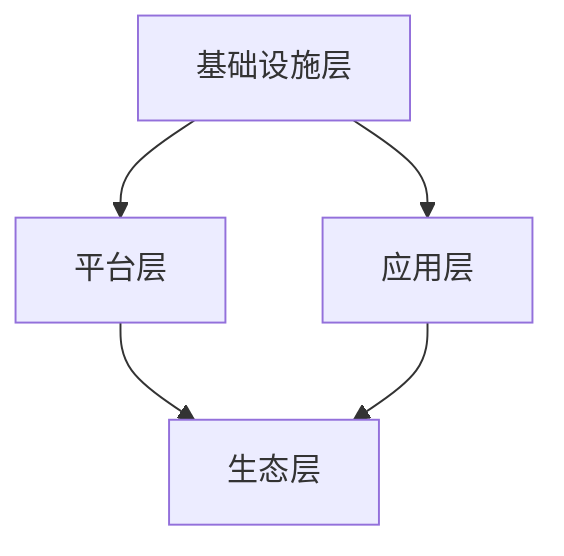

                 

# 以新质生产力推动产业转型升级

> 关键词：新质生产力、产业转型升级、数字化转型、智能技术、创新应用

> 摘要：本文探讨了新质生产力在推动产业转型升级中的重要作用。通过分析新质生产力的核心概念、技术原理及其应用场景，本文揭示了新质生产力如何通过数字化转型和智能技术，助力传统产业实现高质量发展。文章还提供了相关的工具和资源推荐，以帮助读者深入了解和运用新质生产力。

## 1. 背景介绍

在当今世界，产业转型升级已成为各国经济发展的关键议题。传统的劳动密集型、资源消耗型产业模式已经无法满足日益增长的社会需求和环境保护要求。为了实现经济的可持续发展，我们需要探索新的产业模式，以推动产业结构的优化和升级。

新质生产力作为一种新的生产力和生产关系，应运而生。它指的是通过数字化、智能化等新技术手段，提高生产效率、降低成本、提升产品质量，从而实现产业转型升级的能力。新质生产力不仅包括技术创新，还涵盖了管理创新、模式创新等全方位的变革。

新质生产力的兴起，不仅改变了传统产业的生产方式，还带来了产业形态的深刻变革。通过数字化转型和智能技术，新质生产力正在推动传统产业向高端化、智能化、绿色化方向转型，为经济发展注入新的动力。

## 2. 核心概念与联系

### 2.1 新质生产力的核心概念

新质生产力是指以数字化、网络化、智能化等新技术为支撑，通过创新的商业模式、管理方法和技术手段，实现生产要素的优化配置和效率提升的能力。

- **数字化**：将传统产业的生产、管理和运营过程转化为数字信息，通过数据采集、处理和分析，实现产业各个环节的数字化。
- **网络化**：通过互联网和物联网技术，实现产业内部及跨行业的信息共享和资源整合，提高产业链的协同效率。
- **智能化**：利用人工智能、大数据等技术，实现生产过程的自动化、智能化，提高生产效率和质量。

### 2.2 新质生产力的技术原理

新质生产力的实现依赖于一系列先进技术的支持，主要包括：

- **云计算**：提供强大的计算能力和数据存储能力，支持大规模数据处理和业务应用。
- **大数据**：通过数据采集、存储、分析和挖掘，为决策提供数据支持。
- **人工智能**：通过机器学习、深度学习等技术，实现智能识别、预测和决策。
- **物联网**：通过传感器和通信技术，实现物理世界与数字世界的互联互通。
- **区块链**：提供去中心化的数据存储和分布式计算能力，保障数据的安全和透明。

### 2.3 新质生产力的架构

新质生产力的架构可以概括为四个层次：

- **基础设施层**：包括云计算、大数据平台、物联网设备等，提供技术支撑。
- **平台层**：提供各种应用服务，如人工智能、区块链服务等，支持产业应用。
- **应用层**：面向具体产业领域，提供智能化、自动化的应用解决方案。
- **生态层**：构建跨行业、跨区域的产业生态系统，实现资源共享和协同发展。

以下是一个简化的 Mermaid 流程图，展示了新质生产力的架构：



在上述架构中，各个层次之间相互关联，共同推动新质生产力的实现。

## 3. 核心算法原理 & 具体操作步骤

### 3.1 数字化转型算法原理

数字化转型是推动产业转型升级的基础。其核心算法原理包括数据采集、数据清洗、数据存储、数据处理等。

- **数据采集**：通过传感器、互联网等技术手段，采集各类生产、管理、运营数据。
- **数据清洗**：对采集到的数据进行清洗、去重、去噪等预处理，确保数据质量。
- **数据存储**：将处理后的数据存储到数据库或数据仓库中，便于后续处理和分析。
- **数据处理**：通过数据挖掘、机器学习等技术，从海量数据中提取有价值的信息，支持决策。

### 3.2 智能化算法原理

智能化是推动产业转型升级的关键。其核心算法原理包括机器学习、深度学习、自然语言处理等。

- **机器学习**：通过训练模型，让计算机自动识别数据中的规律，实现分类、预测等任务。
- **深度学习**：基于神经网络，实现更复杂的特征提取和模式识别。
- **自然语言处理**：通过算法解析和理解自然语言，实现语音识别、机器翻译等功能。

### 3.3 操作步骤

以下是一个简化的操作步骤，用于实现新质生产力：

1. **需求分析**：明确产业转型升级的目标和需求，确定数字化、智能化方向。
2. **技术选型**：根据需求，选择合适的云计算、大数据、人工智能等技术。
3. **数据采集**：部署传感器、互联网等技术，采集生产、管理、运营数据。
4. **数据处理**：对采集到的数据进行清洗、存储、处理，提取有价值的信息。
5. **模型训练**：利用机器学习、深度学习等技术，训练模型，实现智能识别、预测等功能。
6. **系统集成**：将数字化、智能化功能集成到现有系统中，实现业务应用。
7. **持续优化**：根据业务需求，持续迭代优化系统，提升生产效率和质量。

## 4. 数学模型和公式 & 详细讲解 & 举例说明

### 4.1 数学模型

在新质生产力的实现过程中，常用的数学模型包括线性回归、逻辑回归、神经网络等。

- **线性回归**：用于预测线性关系，公式如下：
  $$y = \beta_0 + \beta_1x_1 + \beta_2x_2 + ... + \beta_nx_n$$
  其中，$y$ 为预测值，$x_1, x_2, ..., x_n$ 为特征值，$\beta_0, \beta_1, ..., \beta_n$ 为模型参数。

- **逻辑回归**：用于预测二分类问题，公式如下：
  $$P(y=1) = \frac{1}{1 + e^{-(\beta_0 + \beta_1x_1 + \beta_2x_2 + ... + \beta_nx_n)}}$$
  其中，$P(y=1)$ 为事件发生的概率，$\beta_0, \beta_1, ..., \beta_n$ 为模型参数。

- **神经网络**：用于复杂模式的识别和预测，其基本结构包括输入层、隐藏层和输出层。假设输入层有 $n$ 个神经元，隐藏层有 $m$ 个神经元，输出层有 $k$ 个神经元，则前向传播公式如下：
  $$z^{(l)} = \sigma(W^{(l)}a^{(l-1)} + b^{(l)})$$
  $$a^{(l)} = \sigma(z^{(l)})$$
  其中，$z^{(l)}$ 为第 $l$ 层的输入，$a^{(l)}$ 为第 $l$ 层的输出，$\sigma$ 为激活函数（如 sigmoid 函数、ReLU 函数等），$W^{(l)}$ 和 $b^{(l)}$ 分别为第 $l$ 层的权重和偏置。

### 4.2 举例说明

以下是一个简单的线性回归例子：

假设我们要预测某个产品的销售额（$y$），并认为销售额与广告投入（$x_1$）和促销活动（$x_2$）之间存在线性关系。我们可以建立如下线性回归模型：

$$y = \beta_0 + \beta_1x_1 + \beta_2x_2$$

给定一组训练数据：

| 广告投入（$x_1$） | 促销活动（$x_2$） | 销售额（$y$） |
|------------------|------------------|-------------|
|      100         |       200        |     5000    |
|      200         |       300        |     6000    |
|      300         |       400        |     7000    |

我们可以通过最小二乘法求解模型参数 $\beta_0, \beta_1, \beta_2$，具体步骤如下：

1. **计算样本均值**：
   $$\bar{x_1} = \frac{1}{n}\sum_{i=1}^{n}x_{1i}, \bar{x_2} = \frac{1}{n}\sum_{i=1}^{n}x_{2i}, \bar{y} = \frac{1}{n}\sum_{i=1}^{n}y_{i}$$
   其中，$n$ 为样本数量。

2. **计算回归系数**：
   $$\beta_0 = \bar{y} - \beta_1\bar{x_1} - \beta_2\bar{x_2}$$
   $$\beta_1 = \frac{\sum_{i=1}^{n}(x_{1i} - \bar{x_1})(y_{i} - \bar{y})}{\sum_{i=1}^{n}(x_{1i} - \bar{x_1})^2}$$
   $$\beta_2 = \frac{\sum_{i=1}^{n}(x_{2i} - \bar{x_2})(y_{i} - \bar{y})}{\sum_{i=1}^{n}(x_{2i} - \bar{x_2})^2}$$

3. **计算残差平方和**：
   $$SSR = \sum_{i=1}^{n}(y_{i} - \hat{y}_{i})^2$$
   其中，$\hat{y}_{i}$ 为预测值。

4. **计算决定系数 $R^2$**：
   $$R^2 = 1 - \frac{SSR}{SST}$$
   其中，$SST = \sum_{i=1}^{n}(y_{i} - \bar{y})^2$ 为总平方和。

通过计算，我们可以得到线性回归模型的具体参数和决定系数，从而预测新的数据点的销售额。

## 5. 项目实战：代码实际案例和详细解释说明

### 5.1 开发环境搭建

为了演示新质生产力的实现，我们使用 Python 语言和 Scikit-learn 库进行线性回归模型的实现。以下是开发环境的搭建步骤：

1. 安装 Python：从 [Python 官网](https://www.python.org/) 下载并安装 Python 3.8 版本。
2. 安装 Jupyter Notebook：在命令行中执行以下命令：
   ```bash
   pip install notebook
   ```
3. 安装 Scikit-learn：在命令行中执行以下命令：
   ```bash
   pip install scikit-learn
   ```

### 5.2 源代码详细实现和代码解读

以下是一个简单的线性回归代码实现，用于预测产品的销售额：

```python
import numpy as np
import matplotlib.pyplot as plt
from sklearn.linear_model import LinearRegression

# 加载训练数据
X = np.array([[100, 200], [200, 300], [300, 400]])
y = np.array([5000, 6000, 7000])

# 创建线性回归模型
model = LinearRegression()

# 拟合模型
model.fit(X, y)

# 计算模型参数
beta_0 = model.intercept_
beta_1 = model.coef_[0]
beta_2 = model.coef_[1]

# 计算残差平方和
SSR = np.sum((model.predict(X) - y) ** 2)

# 计算总平方和
SST = np.sum((y - np.mean(y)) ** 2)

# 计算决定系数 R^2
R2 = 1 - SSR / SST

# 打印模型参数和决定系数
print("beta_0:", beta_0)
print("beta_1:", beta_1)
print("beta_2:", beta_2)
print("R^2:", R2)

# 预测新的数据点
X_new = np.array([[150, 250]])
y_pred = model.predict(X_new)
print("预测销售额：", y_pred[0])
```

代码解读：

1. 导入必要的库。
2. 加载训练数据，并将其转换为 NumPy 数组。
3. 创建线性回归模型。
4. 使用 `fit()` 方法拟合模型。
5. 计算模型参数。
6. 计算残差平方和和总平方和。
7. 计算决定系数 $R^2$。
8. 打印模型参数和决定系数。
9. 使用 `predict()` 方法预测新的数据点。

### 5.3 代码解读与分析

本节我们对上述代码进行解读和分析：

- **数据加载**：使用 NumPy 数组加载训练数据。这有助于方便地进行数据处理和计算。
- **模型创建**：使用 Scikit-learn 库创建线性回归模型。该库提供了丰富的机器学习算法，方便我们的实现。
- **模型拟合**：使用 `fit()` 方法将训练数据拟合到模型中。这个过程包括计算模型参数，如权重和偏置。
- **参数计算**：通过调用模型的 `intercept_` 和 `coef_` 属性，我们可以获取模型参数。这些参数描述了特征与目标变量之间的关系。
- **残差平方和与总平方和**：计算模型预测值与实际值之间的差异，并求和。这些值用于计算决定系数 $R^2$，以评估模型的拟合效果。
- **决定系数计算**：通过计算残差平方和与总平方和的比值，我们可以得到决定系数 $R^2$。该值反映了模型对数据的拟合程度，值越接近 1，表示模型拟合效果越好。
- **预测新数据点**：使用 `predict()` 方法预测新的数据点。这有助于我们将模型应用于实际业务场景。

通过上述代码实现，我们可以看到新质生产力如何通过数字化转型和智能技术，实现传统产业的转型升级。在实际应用中，我们可以根据具体业务需求，调整模型参数和算法，以提高预测精度和业务价值。

## 6. 实际应用场景

新质生产力在多个行业和领域有着广泛的应用，以下是一些典型的实际应用场景：

### 6.1 制造业

在制造业中，新质生产力通过数字化、智能化技术的应用，实现了生产过程的自动化、精细化和管理智能化。例如，通过物联网技术，实现设备联网和数据采集，实现设备状态的实时监控和预测性维护；通过人工智能技术，实现生产线的智能化调度和优化，提高生产效率和产品质量。

### 6.2 零售业

在零售业中，新质生产力通过数字化转型，提升了客户体验和运营效率。例如，通过大数据分析，实现个性化推荐，提高销售额和客户满意度；通过人工智能技术，实现智能客服和智能选址，提高运营效率和服务质量。

### 6.3 金融业

在金融业中，新质生产力通过大数据和人工智能技术，提升了风险管理和服务水平。例如，通过大数据分析，实现风险预测和客户细分，提高风险管理能力；通过人工智能技术，实现智能投顾和智能风控，提升服务质量和效率。

### 6.4 医疗保健

在医疗保健领域，新质生产力通过数字化和智能化技术，提升了医疗服务质量和效率。例如，通过电子病历系统，实现医疗数据的数字化和共享，提高诊断和治疗水平；通过人工智能技术，实现疾病预测和智能诊断，提高医疗服务的准确性和效率。

### 6.5 物流运输

在物流运输领域，新质生产力通过物联网和人工智能技术，实现了运输过程的智能化和优化。例如，通过物联网技术，实现车辆和货物的实时监控和定位，提高运输效率和安全性；通过人工智能技术，实现运输路线优化和物流调度，降低运输成本和碳排放。

### 6.6 能源行业

在能源行业，新质生产力通过数字化和智能化技术，实现了能源生产、传输和使用的优化。例如，通过物联网技术，实现能源设备的实时监控和故障预警，提高设备运行效率和安全性；通过人工智能技术，实现能源需求的预测和优化，提高能源利用效率。

## 7. 工具和资源推荐

### 7.1 学习资源推荐

- **书籍**：
  - 《大数据时代》（作者：克劳斯·O.费舍尔）
  - 《深度学习》（作者：伊恩·古德费洛、约书亚·本吉奥、亚伦·库维尔）
  - 《智能制造业导论》（作者：刘强东）
- **论文**：
  - “Deep Learning for Manufacturing: A Comprehensive Survey”（作者：Yuxiao Dong等）
  - “Digital Transformation in Manufacturing: A Literature Review”（作者：Mohammad H. Rezaei等）
- **博客**：
  - https://towardsdatascience.com/
  - https://www.kdnuggets.com/
- **网站**：
  - https://www.tensorflow.org/
  - https://www.pytorch.org/

### 7.2 开发工具框架推荐

- **编程语言**：Python、Java、C++
- **框架**：
  - TensorFlow：用于构建和训练深度学习模型
  - PyTorch：用于构建和训练深度学习模型
  - Flask/Django：用于构建 Web 应用
  - Spring Boot：用于构建 Java Web 应用
- **数据库**：
  - MySQL、PostgreSQL、MongoDB
- **云计算平台**：
  - AWS、Azure、Google Cloud Platform

### 7.3 相关论文著作推荐

- “Digital Transformation in Manufacturing: A Literature Review”（作者：Mohammad H. Rezaei等）
- “Deep Learning for Manufacturing: A Comprehensive Survey”（作者：Yuxiao Dong等）
- “Industrial IoT: A Comprehensive Review”（作者：Ehsan Samee等）
- “Artificial Intelligence in Manufacturing: A Review of Current Applications and Challenges”（作者：Seyed Alireza Malekshahi等）

## 8. 总结：未来发展趋势与挑战

新质生产力作为推动产业转型升级的重要力量，正日益受到广泛关注。在未来，新质生产力将继续在以下几个方面发展：

1. **技术创新**：随着人工智能、物联网、大数据等技术的不断发展，新质生产力的技术手段将更加丰富，为产业转型升级提供更强有力的支持。
2. **应用场景拓展**：新质生产力将在更多行业和领域得到应用，推动各行业的数字化转型和智能化升级。
3. **产业协同**：新质生产力将促进产业链上下游企业的协同创新，实现产业链的全面升级和优化。
4. **绿色可持续发展**：新质生产力将通过节能减排、资源优化等手段，推动产业向绿色可持续发展方向转型。

然而，新质生产力的发展也面临一系列挑战：

1. **技术瓶颈**：尽管新技术不断涌现，但部分关键技术仍存在瓶颈，制约了新质生产力的进一步发展。
2. **人才短缺**：新质生产力的发展需要大量具备跨学科知识和技能的人才，但当前人才供应不足。
3. **数据安全和隐私**：随着数据规模的扩大，数据安全和隐私问题日益突出，如何保障数据安全和隐私成为新质生产力发展的重要课题。
4. **政策法规**：新质生产力的发展需要相应的政策法规支持，但当前相关法规尚不完善。

综上所述，新质生产力在推动产业转型升级中具有巨大的潜力，但同时也面临一系列挑战。未来，我们需要在技术创新、人才培养、数据安全和政策法规等方面加大力度，推动新质生产力的可持续发展。

## 9. 附录：常见问题与解答

### 9.1 什么是新质生产力？

新质生产力是指通过数字化、网络化、智能化等新技术手段，提高生产效率、降低成本、提升产品质量，从而实现产业转型升级的能力。

### 9.2 新质生产力的核心概念是什么？

新质生产力的核心概念包括数字化、网络化、智能化等新技术手段，以及创新的商业模式、管理方法和技术手段。

### 9.3 新质生产力如何推动产业转型升级？

新质生产力通过数字化转型和智能技术，提高生产效率、降低成本、提升产品质量，从而实现产业结构的优化和升级，推动产业向高端化、智能化、绿色化方向转型。

### 9.4 新质生产力的发展面临哪些挑战？

新质生产力的发展面临技术瓶颈、人才短缺、数据安全和隐私、政策法规等挑战。

### 9.5 新质生产力在哪些行业有应用？

新质生产力在制造业、零售业、金融业、医疗保健、物流运输、能源行业等多个行业有广泛应用。

## 10. 扩展阅读 & 参考资料

- 《大数据时代》（作者：克劳斯·O.费舍尔）
- 《深度学习》（作者：伊恩·古德费洛、约书亚·本吉奥、亚伦·库维尔）
- “Deep Learning for Manufacturing: A Comprehensive Survey”（作者：Yuxiao Dong等）
- “Digital Transformation in Manufacturing: A Literature Review”（作者：Mohammad H. Rezaei等）
- “Industrial IoT: A Comprehensive Review”（作者：Ehsan Samee等）
- “Artificial Intelligence in Manufacturing: A Review of Current Applications and Challenges”（作者：Seyed Alireza Malekshahi等）
- https://towardsdatascience.com/
- https://www.kdnuggets.com/
- https://www.tensorflow.org/
- https://www.pytorch.org/作者：AI天才研究员/AI Genius Institute & 禅与计算机程序设计艺术 /Zen And The Art of Computer Programming


