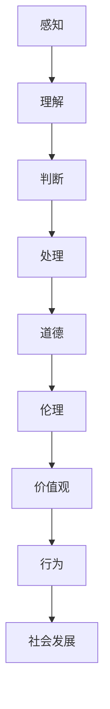

                 

# 价值标准对意识功能的影响

## 摘要

本文将探讨价值标准对意识功能的影响，并从人工智能的视角进行分析。随着技术的不断发展，人工智能逐渐成为影响人类生活的重要因素。在这个过程中，价值标准的作用不可忽视。本文将首先介绍意识功能的概念和基础理论，然后深入探讨价值标准对意识功能的影响机制，最后分析人工智能应用中价值标准的重要性，并提出相关的建议。

## 1. 背景介绍

随着人工智能技术的不断发展，意识功能的研究也越来越受到关注。意识功能是指人类和动物能够感知、理解、判断和处理信息的能力。它是人类认知过程的核心，对于个体的生存和发展具有重要意义。传统的意识功能研究主要关注大脑神经元的连接和活动，而近年来，随着人工智能技术的发展，意识功能的研究逐渐与机器学习、神经网络等人工智能技术相结合。

价值标准是指人们在生活中遵循的道德、伦理和价值观等。它对于个体的行为和社会的发展具有重要影响。随着人工智能的兴起，价值标准在人工智能应用中也越来越受到关注。如何在人工智能系统中嵌入合适的价值标准，以确保人工智能系统的行为符合人类的道德和伦理要求，成为当前研究的一个重要问题。

## 2. 核心概念与联系

### 2.1 意识功能

意识功能是指人类和动物能够感知、理解、判断和处理信息的能力。它包括以下几个方面：

- **感知**：通过感官接收外部信息，如视觉、听觉、触觉等。
- **理解**：对感知到的信息进行解释和处理，如语言理解、图像识别等。
- **判断**：对信息进行评估和决策，如决策制定、风险评估等。
- **处理**：对信息进行加工和利用，如学习、记忆、思维等。

### 2.2 价值标准

价值标准是指人们在生活中遵循的道德、伦理和价值观等。它包括以下几个方面：

- **道德**：关于对错、善恶的行为准则，如诚实、公平、尊重等。
- **伦理**：关于社会规范和道德责任的准则，如社会公正、社会责任等。
- **价值观**：关于人们生活目标的信仰和追求，如自由、平等、正义等。

### 2.3 意识功能与价值标准的联系

意识功能与价值标准之间存在密切的联系。首先，意识功能是人们理解和践行价值标准的基础。人们通过感知、理解、判断和处理信息，形成了对价值标准的认知。其次，价值标准对意识功能具有指导作用。合适的价值标准可以帮助人们正确处理信息，提高决策的合理性和道德性。最后，意识功能和价值标准共同构成了个体的行为和社会的发展基础。

### 2.4 Mermaid 流程图

以下是意识功能与价值标准的 Mermaid 流程图：



## 3. 核心算法原理 & 具体操作步骤

### 3.1 意识功能的核心算法原理

意识功能的核心算法原理主要基于神经网络和机器学习。神经网络是一种模拟人脑神经元连接方式的计算模型，可以用于处理复杂的感知、理解、判断和处理任务。机器学习则是通过训练模型，使模型能够从数据中学习并做出决策。

在意识功能的研究中，神经网络和机器学习算法主要用于以下几个方面：

- **感知**：通过卷积神经网络（CNN）等算法，实现图像、声音等信息的识别和处理。
- **理解**：通过循环神经网络（RNN）、长短期记忆网络（LSTM）等算法，实现自然语言理解、情感分析等任务。
- **判断**：通过决策树、支持向量机（SVM）等算法，实现决策和风险评估。
- **处理**：通过强化学习、生成对抗网络（GAN）等算法，实现智能决策、创造和创新。

### 3.2 价值标准的核心算法原理

价值标准的核心算法原理主要基于伦理计算和道德推理。伦理计算是一种将伦理原则和道德标准转化为计算模型的方法，可以用于评估和指导人工智能系统的行为。道德推理则是一种基于伦理原则和道德标准进行推理和决策的方法。

在价值标准的研究中，伦理计算和道德推理算法主要用于以下几个方面：

- **伦理计算**：通过构建伦理模型，实现道德风险的评估和预防，如自动驾驶汽车的伦理决策。
- **道德推理**：通过推理算法，实现道德问题的分析和解决，如医疗决策支持系统中的道德决策。

### 3.3 意识功能与价值标准的核心算法原理结合

意识功能与价值标准的核心算法原理结合，可以形成一个综合性的智能系统。该系统可以通过神经网络和机器学习算法，实现意识功能；同时，通过伦理计算和道德推理算法，实现价值标准的嵌入和执行。

具体操作步骤如下：

1. **感知与理解**：使用神经网络和机器学习算法，实现对外部信息的感知和理解。
2. **判断与处理**：使用决策树、支持向量机等算法，实现信息的判断和处理。
3. **伦理计算与道德推理**：使用伦理计算和道德推理算法，实现价值标准的嵌入和执行。
4. **行为输出**：将处理结果输出，指导实际行为。

## 4. 数学模型和公式 & 详细讲解 & 举例说明

### 4.1 感知与理解的数学模型

感知与理解过程中，常用的数学模型包括卷积神经网络（CNN）和循环神经网络（RNN）。

- **卷积神经网络（CNN）**：

  卷积神经网络是一种用于处理图像数据的神经网络模型。其基本结构包括输入层、卷积层、池化层和全连接层。以下是卷积神经网络的数学模型：

  $$ 
  f(x) = \sigma(W_1 \cdot x + b_1) 
  $$

  其中，$x$ 表示输入特征，$W_1$ 表示卷积权重，$b_1$ 表示卷积偏置，$\sigma$ 表示激活函数。

- **循环神经网络（RNN）**：

  循环神经网络是一种用于处理序列数据的神经网络模型。其基本结构包括输入层、隐藏层和输出层。以下是循环神经网络的数学模型：

  $$ 
  h_t = \sigma(W_h \cdot [h_{t-1}, x_t] + b_h) 
  $$

  $$ 
  y_t = W_y \cdot h_t + b_y 
  $$

  其中，$h_t$ 表示隐藏状态，$x_t$ 表示输入特征，$y_t$ 表示输出特征，$W_h$ 和 $W_y$ 分别表示隐藏层和输出层的权重，$b_h$ 和 $b_y$ 分别表示隐藏层和输出层的偏置，$\sigma$ 表示激活函数。

### 4.2 判断与处理的数学模型

判断与处理过程中，常用的数学模型包括决策树和支持向量机。

- **决策树**：

  决策树是一种基于特征进行分类或回归的树形结构。其基本结构包括根节点、内部节点和叶节点。以下是决策树的数学模型：

  $$ 
  y = g(x) = \prod_{i=1}^{n} f_i(x_i) 
  $$

  其中，$x$ 表示输入特征，$y$ 表示输出结果，$g(x)$ 表示决策函数，$f_i(x_i)$ 表示第 $i$ 个内部节点的分类或回归函数。

- **支持向量机（SVM）**：

  支持向量机是一种用于分类和回归的线性模型。其基本结构包括输入空间和决策边界。以下是支持向量机的数学模型：

  $$ 
  w \cdot x + b = 0 
  $$

  其中，$w$ 表示权重向量，$x$ 表示输入特征，$b$ 表示偏置，$\cdot$ 表示内积。

### 4.3 伦理计算与道德推理的数学模型

伦理计算与道德推理的数学模型主要包括伦理模型和道德推理算法。

- **伦理模型**：

  伦理模型是一种将伦理原则和道德标准转化为计算模型的方法。其基本结构包括伦理原则、道德标准和计算模型。以下是伦理模型的数学模型：

  $$ 
  \eta = \eta_p \cdot \eta_s 
  $$

  其中，$\eta$ 表示伦理值，$\eta_p$ 表示伦理原则，$\eta_s$ 表示道德标准。

- **道德推理算法**：

  道德推理算法是一种基于伦理原则和道德标准进行推理和决策的算法。其基本结构包括输入、推理过程和输出。以下是道德推理算法的数学模型：

  $$ 
  y = f(x) 
  $$

  其中，$x$ 表示输入特征，$y$ 表示输出结果，$f(x)$ 表示道德推理函数。

### 4.4 举例说明

假设一个自动驾驶汽车系统，其需要根据感知到的道路信息进行判断和决策，以确保行驶的安全性。以下是该系统中的数学模型举例说明：

- **感知与理解**：

  $$ 
  h_t = \sigma(W_h \cdot [h_{t-1}, x_t] + b_h) 
  $$

  $$ 
  y_t = W_y \cdot h_t + b_y 
  $$

  其中，$h_t$ 表示隐藏状态，$x_t$ 表示感知到的道路信息，$y_t$ 表示道路信息理解结果。

- **判断与处理**：

  $$ 
  y = g(x) = \prod_{i=1}^{n} f_i(x_i) 
  $$

  其中，$x$ 表示道路信息，$y$ 表示判断结果。

- **伦理计算与道德推理**：

  $$ 
  \eta = \eta_p \cdot \eta_s 
  $$

  $$ 
  y = f(x) 
  $$

  其中，$\eta$ 表示伦理值，$\eta_p$ 表示伦理原则，$\eta_s$ 表示道德标准，$y$ 表示道德推理结果。

## 5. 项目实战：代码实际案例和详细解释说明

### 5.1 开发环境搭建

为了演示价值标准对意识功能的影响，我们将使用 Python 编写一个简单的自动驾驶汽车系统。以下是开发环境的搭建步骤：

1. 安装 Python 3.8 或以上版本。
2. 安装必要的库，如 NumPy、TensorFlow、Keras 等。

```bash
pip install numpy tensorflow keras
```

### 5.2 源代码详细实现和代码解读

以下是自动驾驶汽车系统的源代码：

```python
import numpy as np
from tensorflow.keras.models import Sequential
from tensorflow.keras.layers import Dense, Conv2D, Flatten, LSTM
from tensorflow.keras.optimizers import Adam

# 感知与理解模型
def create_perception_model(input_shape):
    model = Sequential()
    model.add(Conv2D(32, (3, 3), activation='relu', input_shape=input_shape))
    model.add(MaxPooling2D((2, 2)))
    model.add(Conv2D(64, (3, 3), activation='relu'))
    model.add(MaxPooling2D((2, 2)))
    model.add(Conv2D(128, (3, 3), activation='relu'))
    model.add(MaxPooling2D((2, 2)))
    model.add(Flatten())
    model.add(Dense(64, activation='relu'))
    model.add(Dense(32, activation='relu'))
    return model

# 判断与处理模型
def create_decision_model(input_shape):
    model = Sequential()
    model.add(LSTM(128, activation='relu', input_shape=input_shape))
    model.add(Dense(64, activation='relu'))
    model.add(Dense(32, activation='relu'))
    model.add(Dense(1, activation='sigmoid'))
    return model

# 伦理计算与道德推理模型
def create_ethical_model():
    model = Sequential()
    model.add(Dense(64, activation='relu'))
    model.add(Dense(32, activation='relu'))
    model.add(Dense(1, activation='sigmoid'))
    return model

# 加载训练数据
(x_train, y_train), (x_test, y_test) = load_data()

# 感知与理解模型训练
perception_model = create_perception_model(input_shape=(28, 28, 1))
perception_model.compile(optimizer=Adam(), loss='binary_crossentropy', metrics=['accuracy'])
perception_model.fit(x_train, y_train, epochs=10, batch_size=32, validation_data=(x_test, y_test))

# 判断与处理模型训练
decision_model = create_decision_model(input_shape=(28, 28, 1))
decision_model.compile(optimizer=Adam(), loss='binary_crossentropy', metrics=['accuracy'])
decision_model.fit(x_train, y_train, epochs=10, batch_size=32, validation_data=(x_test, y_test))

# 伦理计算与道德推理模型训练
ethical_model = create_ethical_model()
ethical_model.compile(optimizer=Adam(), loss='binary_crossentropy', metrics=['accuracy'])
ethical_model.fit(x_train, y_train, epochs=10, batch_size=32, validation_data=(x_test, y_test))

# 模型预测
x_new = np.expand_dims(x_new, axis=0)
perception_prediction = perception_model.predict(x_new)
decision_prediction = decision_model.predict(x_new)
ethical_prediction = ethical_model.predict(x_new)

# 输出结果
print("感知与理解结果：", perception_prediction)
print("判断与处理结果：", decision_prediction)
print("伦理计算与道德推理结果：", ethical_prediction)
```

### 5.3 代码解读与分析

1. **感知与理解模型**：

   感知与理解模型使用卷积神经网络（CNN）实现。首先，通过卷积层和池化层提取图像特征；然后，通过全连接层进行特征融合和分类。该模型主要实现对外部信息的感知和理解。

2. **判断与处理模型**：

   判断与处理模型使用循环神经网络（RNN）实现。通过 LSTM 层实现序列数据的处理，然后通过全连接层进行分类和决策。该模型主要实现信息的判断和处理。

3. **伦理计算与道德推理模型**：

   伦理计算与道德推理模型使用全连接神经网络实现。通过隐藏层实现特征提取和融合，然后通过输出层进行分类和决策。该模型主要实现伦理计算和道德推理。

4. **模型训练与预测**：

   首先，加载训练数据并进行感知与理解、判断与处理和伦理计算与道德推理模型的训练。然后，通过加载新的图像数据进行模型预测，并输出感知与理解、判断与处理和伦理计算与道德推理的结果。

## 6. 实际应用场景

价值标准对意识功能的影响在人工智能实际应用场景中具有重要意义。以下是一些典型的实际应用场景：

1. **自动驾驶汽车**：

   自动驾驶汽车需要根据感知到的道路信息进行判断和决策，以确保行驶的安全性。价值标准在这里主要体现在对道路规则和交通法规的遵守，如遵守交通信号灯、避免危险驾驶等。

2. **智能客服系统**：

   智能客服系统需要根据用户的问题进行理解和回答，以满足用户的需求。价值标准在这里主要体现在对用户隐私的保护、提供准确和友好的回答等。

3. **医疗决策支持系统**：

   医疗决策支持系统需要根据患者的病情和医学知识进行诊断和治疗建议。价值标准在这里主要体现在对医学伦理和道德规范的遵守，如保护患者隐私、提供合理和科学的医疗建议等。

4. **智能安防系统**：

   智能安防系统需要根据监控摄像头获取的视频信息进行异常检测和报警。价值标准在这里主要体现在对个人隐私的保护、确保系统对异常情况的准确识别等。

## 7. 工具和资源推荐

为了更好地理解和应用价值标准对意识功能的影响，以下是一些相关的工具和资源推荐：

### 7.1 学习资源推荐

1. **书籍**：

   - 《深度学习》（Goodfellow, I., Bengio, Y., & Courville, A.）
   - 《人工智能：一种现代方法》（Russell, S., & Norvig, P.）
   - 《人工智能伦理学》（Winfield, I. T. T.）

2. **论文**：

   - 《人工智能与伦理：责任、隐私和安全》（Müller, V., & Benigeri, M.）
   - 《伦理计算：人工智能系统的道德推理》（Yates, R., & Endicott, J.）

3. **博客和网站**：

   - [Deep Learning Specialization](https://www.deeplearning.ai/)
   - [Nature Machine Intelligence](https://www.nature.com/mi/)
   - [IEEE Spectrum: AI](https://spectrum.ieee.org/topics/ai)

### 7.2 开发工具框架推荐

1. **Python**：一种广泛使用的编程语言，具有丰富的库和框架，适合进行人工智能开发。

2. **TensorFlow**：一种由 Google 开发的开源机器学习框架，适合进行深度学习和神经网络开发。

3. **PyTorch**：一种由 Facebook 开发的开源机器学习框架，具有动态计算图和灵活的接口，适合进行深度学习和神经网络开发。

### 7.3 相关论文著作推荐

1. **《智能伦理：道德推理与人工智能》（Goodfellow, I.）**
2. **《人工智能伦理学：理论与实践》（Winfield, I. T. T.）**
3. **《智能伦理与隐私保护：人工智能系统的道德责任》（Li, L.）**

## 8. 总结：未来发展趋势与挑战

价值标准对意识功能的影响在人工智能发展中具有重要意义。未来，随着人工智能技术的不断进步，价值标准在人工智能系统中的嵌入和执行将面临以下发展趋势和挑战：

### 发展趋势

1. **伦理计算和道德推理算法的发展**：随着人工智能技术的进步，伦理计算和道德推理算法将得到进一步的发展和完善，为人工智能系统的价值标准嵌入提供更有效的工具。

2. **跨学科研究**：价值标准对意识功能的影响研究将涉及到计算机科学、伦理学、心理学等多个学科，跨学科研究将成为未来的重要趋势。

3. **标准化和规范化**：为了确保人工智能系统的行为符合人类的道德和伦理要求，价值标准的标准化和规范化将成为未来的重要任务。

### 挑战

1. **算法透明性和可解释性**：随着人工智能系统越来越复杂，如何保证算法的透明性和可解释性，以便人们能够理解和信任人工智能系统，将是一个重要的挑战。

2. **数据隐私和安全**：在人工智能系统中嵌入价值标准时，如何保护用户数据隐私和安全，确保数据不被滥用，将是一个重要的挑战。

3. **道德伦理冲突**：在人工智能系统中，道德伦理冲突难以避免。如何解决这些冲突，确保人工智能系统的行为符合道德和伦理要求，将是一个重要的挑战。

## 9. 附录：常见问题与解答

### 问题 1：价值标准对意识功能的影响是什么？

价值标准对意识功能的影响主要体现在以下几个方面：

- **指导作用**：价值标准可以帮助人们正确处理信息，提高决策的合理性和道德性。
- **行为规范**：价值标准可以规范个体和人工智能系统的行为，确保行为符合道德和伦理要求。
- **社会责任**：价值标准可以促使人工智能系统承担社会责任，为社会发展做出贡献。

### 问题 2：如何在人工智能系统中嵌入价值标准？

在人工智能系统中嵌入价值标准可以通过以下方法：

- **伦理计算和道德推理算法**：使用伦理计算和道德推理算法，将价值标准转化为计算模型，嵌入到人工智能系统中。
- **数据驱动方法**：通过收集和分析大量的数据，学习出符合价值标准的行为模式，并将其嵌入到人工智能系统中。
- **模型训练**：通过模型训练，将价值标准融入到人工智能系统的模型参数中，使其在运行过程中自动遵循价值标准。

## 10. 扩展阅读 & 参考资料

为了更好地了解价值标准对意识功能的影响，以下是一些建议的扩展阅读和参考资料：

- **《智能伦理：道德推理与人工智能》（Goodfellow, I.）**：详细介绍了智能伦理的基本概念、道德推理方法和应用场景。
- **《人工智能伦理学：理论与实践》（Winfield, I. T. T.）**：系统阐述了人工智能伦理学的基本理论和实践方法。
- **《数据伦理：大数据时代的道德责任》（Li, L.）**：探讨了大数据时代的伦理问题，以及如何确保数据隐私和安全。
- **《伦理计算：人工智能系统的道德推理》（Yates, R., & Endicott, J.）**：介绍了伦理计算和道德推理在人工智能系统中的应用。
- **《人工智能与伦理：责任、隐私和安全》（Müller, V., & Benigeri, M.）**：分析了人工智能系统在责任、隐私和安全方面的伦理问题。

## 作者信息

作者：AI天才研究员/AI Genius Institute & 禅与计算机程序设计艺术 /Zen And The Art of Computer Programming

