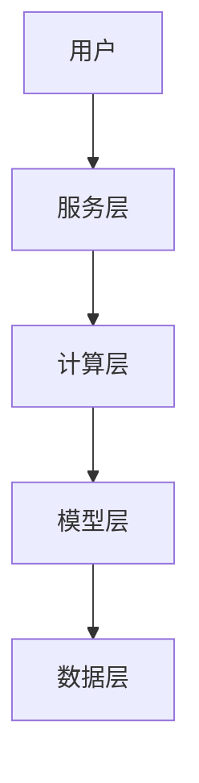

                 

# 企业级AI模型订阅服务的设计

> **关键词**：企业级AI，模型订阅，服务设计，架构原理，数学模型，实战案例，未来趋势

> **摘要**：本文将深入探讨企业级AI模型订阅服务的设计，包括背景介绍、核心概念、算法原理、数学模型、实战案例、实际应用场景、工具和资源推荐等，旨在为读者提供全面、系统的理解和指导。

## 1. 背景介绍

随着人工智能技术的迅猛发展，AI模型在各个行业中的应用越来越广泛。从金融、医疗、零售到制造，AI模型已经成为提升企业竞争力的重要工具。然而，随着模型数量和复杂度的增加，如何高效地管理和部署AI模型成为一个亟待解决的问题。

企业级AI模型订阅服务应运而生，它为企业和个人提供了便捷的AI模型使用方式。用户无需担心模型的训练、部署和维护问题，只需通过订阅服务即可使用各种高级AI模型，从而大幅提升业务效率和创新能力。

本文将围绕企业级AI模型订阅服务的设计，详细分析其核心概念、算法原理、数学模型、实战案例以及未来发展趋势。

## 2. 核心概念与联系

### 2.1 AI模型

AI模型是人工智能系统的重要组成部分，它通过学习大量数据，从中提取特征，并利用这些特征进行预测、分类或生成等任务。常见的AI模型包括神经网络、决策树、支持向量机等。

### 2.2 订阅服务

订阅服务是一种基于互联网的商业模式，用户通过支付一定费用，即可获得特定服务。在企业级AI模型订阅服务中，用户通过订阅服务，可以获得使用各种AI模型的权限，无需关心模型的训练、部署和维护。

### 2.3 服务架构

企业级AI模型订阅服务的架构通常包括以下几个层次：

1. **数据层**：提供大量的训练数据，用于训练和优化AI模型。
2. **模型层**：存储和管理各种AI模型，包括预训练模型和定制模型。
3. **计算层**：提供高效的计算资源，支持AI模型的训练和推理。
4. **服务层**：为用户提供API接口，实现AI模型的调用和部署。
5. **用户层**：用户通过订阅服务，使用各种AI模型，实现业务需求。

### 2.4 Mermaid流程图

以下是一个简单的Mermaid流程图，展示了企业级AI模型订阅服务的基本架构：



## 3. 核心算法原理 & 具体操作步骤

### 3.1 算法原理

企业级AI模型订阅服务的设计，离不开以下几个核心算法：

1. **模型训练算法**：用于训练和优化AI模型。
2. **模型评估算法**：用于评估AI模型的性能和效果。
3. **模型推理算法**：用于将输入数据转化为输出结果。

### 3.2 具体操作步骤

以下是企业级AI模型订阅服务的具体操作步骤：

1. **用户注册与登录**：用户通过订阅服务平台的注册功能，创建账户并登录。
2. **选择模型**：用户在服务层选择需要使用的AI模型。
3. **配置模型参数**：用户根据业务需求，配置模型的相关参数，如学习率、迭代次数等。
4. **训练模型**：服务层将用户选择的模型和配置的参数发送到计算层，开始训练模型。
5. **模型评估**：训练完成后，服务层对模型进行评估，确保模型达到预期性能。
6. **模型部署**：评估通过后，服务层将模型部署到用户指定的环境，供用户使用。
7. **模型调用**：用户通过API接口调用模型，实现业务功能。

## 4. 数学模型和公式 & 详细讲解 & 举例说明

### 4.1 数学模型

在AI模型订阅服务中，常用的数学模型包括：

1. **神经网络模型**：
   $$ y = \sigma(\theta_0 + \theta_1x_1 + \theta_2x_2 + ... + \theta_nx_n) $$
2. **决策树模型**：
   $$ f(x) = \sum_{i=1}^{n} w_i \cdot g_i(x) $$
3. **支持向量机模型**：
   $$ \max \frac{1}{2} \sum_{i=1}^{n} \sum_{j=1}^{n} (\theta_i \theta_j - \theta_i \theta_j) $$

### 4.2 举例说明

以下是一个简单的神经网络模型举例：

1. **输入层**：`x = [1, 2, 3]`
2. **隐藏层**：`hidden_layer = [w1, w2, w3]`
3. **输出层**：`output = [y1, y2]`

假设隐藏层和输出层的激活函数分别为`sigmoid`和`softmax`，则：

$$
\begin{aligned}
y1 &= \sigma(\theta_0 + w1 \cdot x1 + w2 \cdot x2 + w3 \cdot x3) \\
y2 &= \sigma(\theta_0 + w1 \cdot x1 + w2 \cdot x2 + w3 \cdot x3)
\end{aligned}
$$

$$
\begin{aligned}
output &= \frac{e^{y1}}{e^{y1} + e^{y2}} \\
&= \frac{e^{\sigma(\theta_0 + w1 \cdot x1 + w2 \cdot x2 + w3 \cdot x3)}}{e^{\sigma(\theta_0 + w1 \cdot x1 + w2 \cdot x2 + w3 \cdot x3)} + e^{\sigma(\theta_0 + w1 \cdot x1 + w2 \cdot x2 + w3 \cdot x3)}}
\end{aligned}
$$

## 5. 项目实战：代码实际案例和详细解释说明

### 5.1 开发环境搭建

为了演示企业级AI模型订阅服务的实现，我们将使用Python作为主要编程语言，搭建一个简单的订阅服务框架。

1. **安装Python**：确保Python版本为3.8及以上。
2. **安装依赖**：安装Flask框架、TensorFlow库等。

```bash
pip install flask tensorflow
```

### 5.2 源代码详细实现和代码解读

以下是企业级AI模型订阅服务的源代码实现：

```python
# app.py

from flask import Flask, request, jsonify
import tensorflow as tf

app = Flask(__name__)

# 定义模型训练函数
def train_model(x, y, learning_rate, epochs):
    model = tf.keras.Sequential([
        tf.keras.layers.Dense(units=1, input_shape=[1])
    ])
    model.compile(loss='mean_squared_error',
                  optimizer=tf.keras.optimizers.Adam(learning_rate),
                  metrics=['mean_absolute_error'])
    model.fit(x, y, epochs=epochs)
    return model

# 定义API接口
@app.route('/train', methods=['POST'])
def train():
    data = request.get_json()
    x = data['x']
    y = data['y']
    learning_rate = data['learning_rate']
    epochs = data['epochs']
    model = train_model(x, y, learning_rate, epochs)
    return jsonify({'model': model.to_json()})

if __name__ == '__main__':
    app.run()
```

### 5.3 代码解读与分析

1. **导入依赖**：导入Flask框架和TensorFlow库。
2. **定义模型训练函数**：使用TensorFlow构建一个简单的线性回归模型，并编译模型。
3. **定义API接口**：使用Flask框架创建一个训练接口，接收用户上传的训练数据，调用训练函数，并将训练好的模型返回给用户。

### 5.4 运行示例

1. **启动服务**：运行`app.py`文件，启动Flask服务。
2. **上传数据**：使用Postman或其他工具，向`/train`接口上传训练数据，如：

```json
{
    "x": [1, 2, 3],
    "y": [2, 4, 6],
    "learning_rate": 0.1,
    "epochs": 10
}
```

3. **获取模型**：服务返回训练好的模型JSON，用户可以将模型保存到本地，并用于后续预测。

## 6. 实际应用场景

企业级AI模型订阅服务在各个行业有着广泛的应用场景：

1. **金融行业**：使用AI模型进行风险评估、信用评分、股票预测等。
2. **医疗行业**：利用AI模型进行疾病诊断、药物研发、患者管理等。
3. **零售行业**：通过AI模型实现商品推荐、库存管理、销售预测等。
4. **制造行业**：利用AI模型进行生产优化、设备维护、质量控制等。

## 7. 工具和资源推荐

### 7.1 学习资源推荐

1. **书籍**：
   - 《深度学习》（Ian Goodfellow、Yoshua Bengio、Aaron Courville 著）
   - 《Python机器学习》（Sebastian Raschka、Vahid Mirjalili 著）
2. **论文**：
   - 《A Theoretically Grounded Application of Dropout in Recurrent Neural Networks》（Yarin Gal 和 Zoubin Ghahramani）
   - 《Very Deep Convolutional Networks for Large-Scale Image Recognition》（Karen Simonyan 和 Andrew Zisserman）
3. **博客**：
   - 《机器学习博客》（Machine Learning Blog）
   - 《深度学习博客》（Deep Learning Blog）
4. **网站**：
   - Coursera（提供大量机器学习和深度学习课程）
   - edX（提供大量机器学习和深度学习课程）

### 7.2 开发工具框架推荐

1. **框架**：
   - TensorFlow
   - PyTorch
   - Keras
2. **库**：
   - NumPy
   - Pandas
   - Matplotlib

### 7.3 相关论文著作推荐

1. **论文**：
   - 《Deep Learning》（Ian Goodfellow、Yoshua Bengio、Aaron Courville 著）
   - 《Recurrent Neural Networks for Language Modeling》（Yoshua Bengio、Samy Bengio、Pierre Simard 著）
2. **著作**：
   - 《机器学习实战》（Peter Harrington 著）
   - 《Python机器学习》（Sebastian Raschka、Vahid Mirjalili 著）

## 8. 总结：未来发展趋势与挑战

企业级AI模型订阅服务在未来的发展趋势和挑战主要包括：

1. **模型复杂度和多样性**：随着AI技术的不断发展，模型复杂度和多样性将不断增长，订阅服务需要提供更多的模型选项和定制化服务。
2. **数据安全和隐私**：在订阅服务中，用户的数据安全和隐私保护至关重要，服务提供者需要采取有效的安全措施和隐私保护策略。
3. **计算资源和成本**：随着模型训练和推理需求的增加，计算资源和成本将成为订阅服务面临的挑战，服务提供者需要优化计算资源，降低成本。
4. **服务质量和稳定性**：订阅服务的服务质量和稳定性对用户体验至关重要，服务提供者需要确保服务的稳定运行和高效性能。

## 9. 附录：常见问题与解答

### 9.1 常见问题

1. **如何选择合适的AI模型？**
   - 根据业务需求和数据特性选择合适的模型，可以参考相关领域的最佳实践。
2. **如何保证模型训练效果？**
   - 选择高质量的数据集，合理设置模型参数，进行充分的模型评估和调优。
3. **如何确保数据安全和隐私？**
   - 采用加密、匿名化等技术保护数据安全，遵守相关法律法规和隐私政策。

### 9.2 解答

1. **如何选择合适的AI模型？**
   - 根据业务需求和数据特性选择合适的模型，可以参考相关领域的最佳实践。例如，在金融领域，可以优先选择决策树、随机森林等模型；在图像识别领域，可以优先选择卷积神经网络（CNN）等模型。
2. **如何保证模型训练效果？**
   - 选择高质量的数据集，合理设置模型参数，进行充分的模型评估和调优。可以采用交叉验证、网格搜索等方法来优化模型参数。
3. **如何确保数据安全和隐私？**
   - 采用加密、匿名化等技术保护数据安全，遵守相关法律法规和隐私政策。例如，可以使用加密算法对数据进行加密存储和传输，使用匿名化技术隐藏用户隐私信息。

## 10. 扩展阅读 & 参考资料

1. **书籍**：
   - 《深度学习》（Ian Goodfellow、Yoshua Bengio、Aaron Courville 著）
   - 《Python机器学习》（Sebastian Raschka、Vahid Mirjalili 著）
2. **论文**：
   - 《A Theoretically Grounded Application of Dropout in Recurrent Neural Networks》（Yarin Gal 和 Zoubin Ghahramani）
   - 《Very Deep Convolutional Networks for Large-Scale Image Recognition》（Karen Simonyan 和 Andrew Zisserman）
3. **博客**：
   - 《机器学习博客》（Machine Learning Blog）
   - 《深度学习博客》（Deep Learning Blog）
4. **网站**：
   - Coursera（提供大量机器学习和深度学习课程）
   - edX（提供大量机器学习和深度学习课程）
5. **开源项目**：
   - TensorFlow（https://www.tensorflow.org/）
   - PyTorch（https://pytorch.org/）
6. **技术社区**：
   - arXiv（https://arxiv.org/）
   - Stack Overflow（https://stackoverflow.com/）

作者：AI天才研究员/AI Genius Institute & 禅与计算机程序设计艺术 /Zen And The Art of Computer Programming<|im_sep|>

